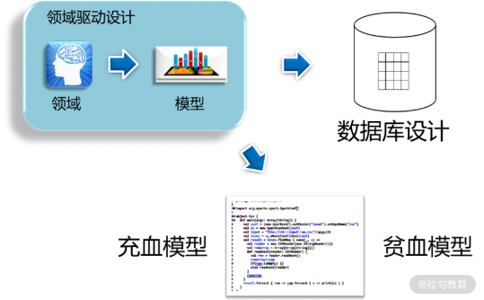
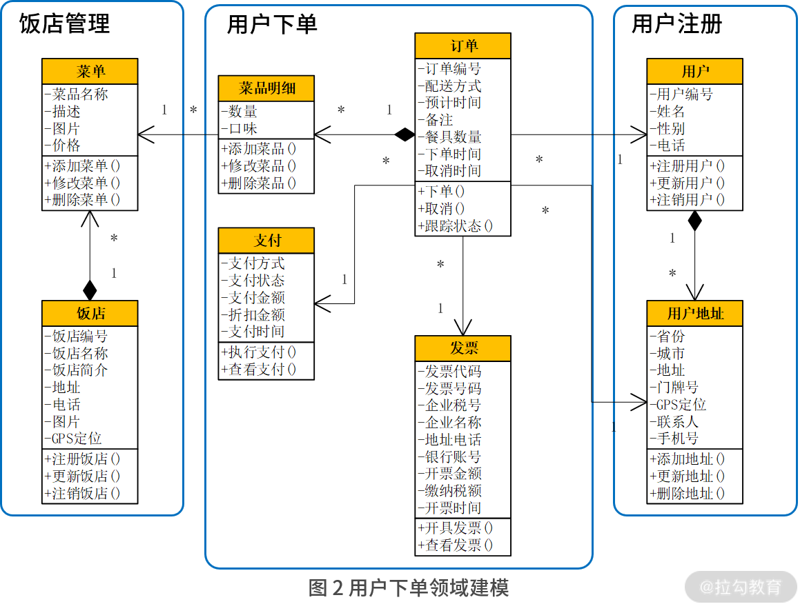
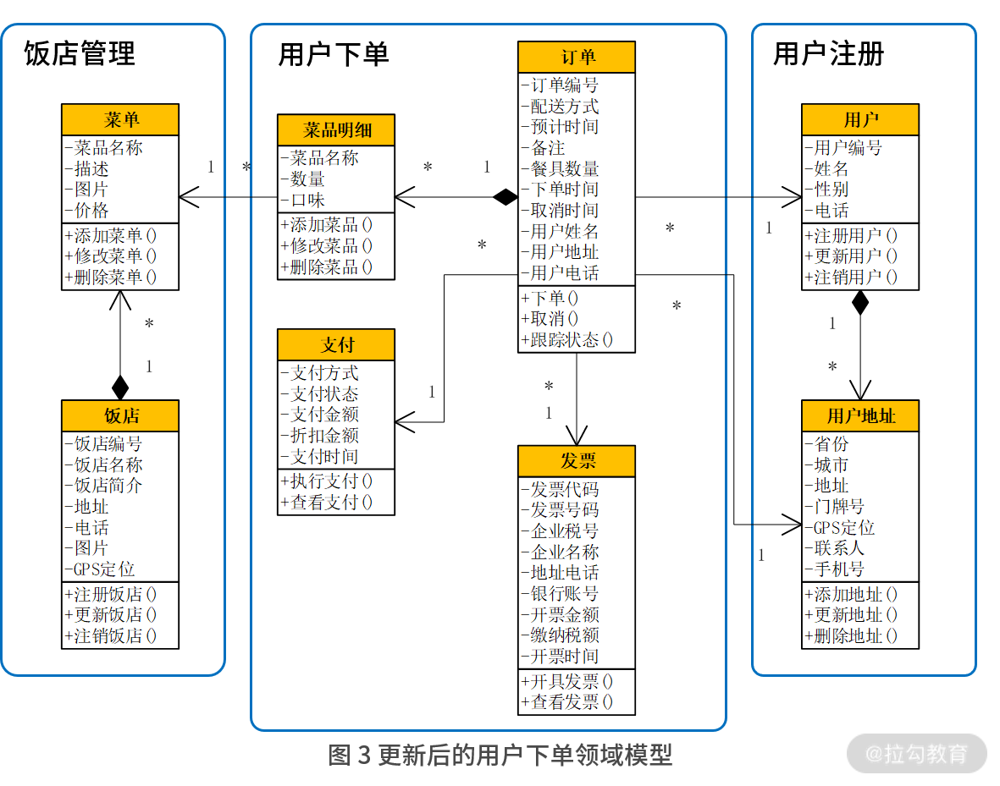
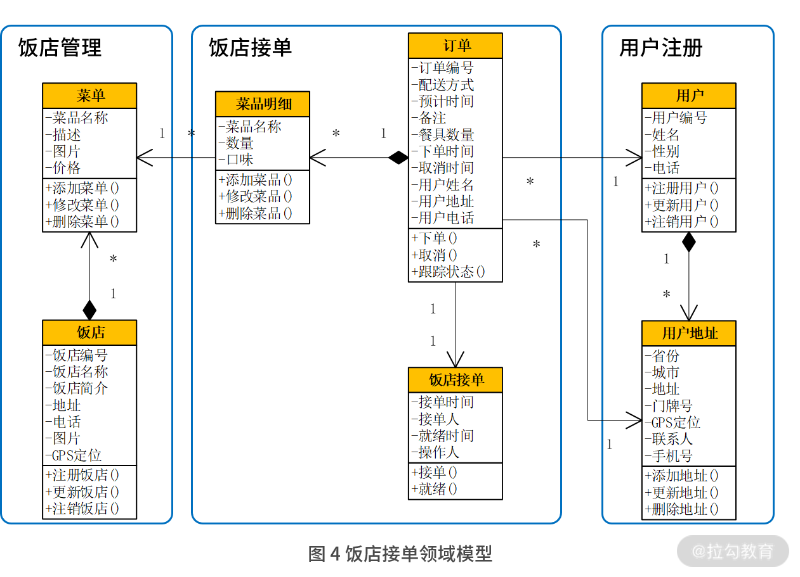
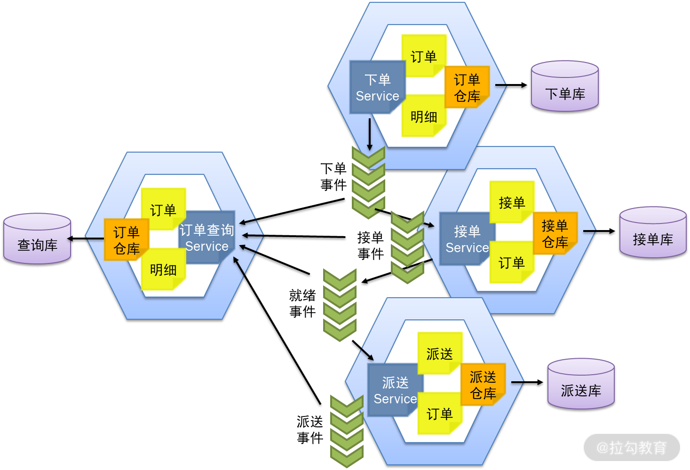

# 09 DDD 是如何落地微服务设计实现的？

自本专栏上线以来，有许多小伙伴跟我交流了很多相关的 DDD 知识。我发现，当大家看到贫血模型、充血模型、策略模式、装饰者模式时，发出这样的感慨：“难道这就是 DDD 吗？和我们平时的开发没有什么不同啊。”殊不知，其实你还没有 **真正 Get 到 DDD 的真谛**。

## DDD 的真谛

什么是 DDD 的真谛呢？那就是领域建模，它改变了我们过去对软件开发的认知。如图 1 所示，DDD 的精髓是：

- 首先深刻理解业务；
- 然后将我们对业务的理解绘制成领域模型；
- 再通过领域模型指导数据库和程序的设计。

图 1 领域驱动设计的真谛

过去，我们认为软件就是，**用户怎么提需求，软件就怎么开发**。这种开发模式使得我们对需求的认知浅薄，不得不随着用户的需求变动反复地改来改去，导致我们很累而用户还不满意，软件研发风险巨大。

正是 DDD 改变了这一切，它要求我们更加 **主动地去理解业务，掌握业务领域知识。** 这样，我们对业务的理解越深刻，开发出来的产品就越专业，那么客户就越喜欢购买和使用我们的产品。

然而，真实世界是非常复杂的，这就决定了我们不可能一开始就深刻理解业务。起初，我们对业务的理解浅薄，基于它做出来的领域模型也是浅薄的，导致最后开发出来的软件虽然也能用，但用户并不一定满意。然而，如果我们不断地与客户沟通，深入地理解业务，听取他们的意见，我们对业务的理解就会越来越深刻、越来越准确。再结合我们的专业技术知识，就能够理解我们的软件需要解决客户的什么问题，怎样做才是最优，怎样做才让客户感觉好用。

这时就不再是客户提需求了，而是我们 **主动地提需求** 、 **主动地改进功能**，**去解决客户的痛点**，这样做的效果是，客户会感觉“不知道为什么，我就觉得你们的软件好用，用着很顺手”。这时，不但客户不会再改来改去，而且我们的软件做得也越来越专业，越来越有市场竞争力，这才是 DDD 的真谛。

这里有个问题，如果我们对业务理解不深刻就会影响到产品，那么能不能一开始就对业务理解得非常深刻呢？这几乎是不可能的。我们经常说，**做事不能仅凭一腔热血，一定要符合自然规律**。其实软件的设计开发过程也是这样。

- 在最开始你对业务理解比较粗略的时候，就从主要流程开始领域建模。
- 接着，不断往领域模型中加东西。随着功能一个一个地添加，领域模型也变得越来越丰富、越来越完善。每次添加新功能的时候，运用“两顶帽子”的方式先重构再加新功能，不断地完善每个设计。
- 这样，领域模型就像小树一样一点儿一点儿成长，最后完成所有的功能。

这样的设计过程叫“ **小步快跑** ”。采用小步快跑的设计方法，一开始不用思考那么多问题，从简单问题开始逐步深入，**设计难度就降低了**。同时，系统始终是处于变更中，使 **设计更加易于变更**。

## 基于限界上下文的领域建模

回到 [第08讲](../第08讲) 微服务设计部分，当在线订餐系统完成了事件风暴的分析以后，接着应当怎样设计呢？通过划分限界上下文，已经将系统划分为了"用户注册"、"用户下单"、"饭店接单"、"骑士派送"与"饭店管理"等几个限界上下文，这样的划分也是后端微服务的划分。紧接着，就开始为每一个限界上下文进行领域建模。

首先，**从 "用户下单" 上下文** 开始 。通过业务领域分析，绘制出了如图 2 所示的领域模型，该模型的核心是“订单”，通过“订单”关联了用户与用户地址。一个订单有多个菜品明细，而每个菜品明细都对应了一个菜单，每个菜单隶属于一个饭店。此外，一个订单还关联了它的支付与发票。起初，它们的属性和方法没有那么全面，随着设计的不断深入，不断地细化与完善模型。

在这样的基础上开始划分限界上下文，用户与用户地址属于“用户注册”上下文，饭店与菜单属于“饭店管理”上下文。它们对于“用户下单”上下文来说都是支撑域，即给“用户下单”上下文提供接口调用的。真正属于“用户下单”上下文的，就只有订单、菜品明细、支付、发票这几个类，它们最终形成了“用户下单”微服务及其数据库设计。由于用户姓名、地址、电话等信息，都在“用户注册”上下文中，每次都需要远程接口调用来获得。这时就需要从系统优化的角度，适当将它们冗余到“订单”领域对象中，以提升查询效率。同样，“菜品名称”也进行了冗余，设计更新如图 3 所示：

完成了“用户下单”上下文以后，开始 **设计 "饭店接单" 上下文**，设计如图 4 所示。上一讲谈到，“用户下单“微服务通过 **事件通知机制**，将订单以消息的形式发送给“饭店接单”微服务。具体来说，就是将订单与菜品明细发送给“饭店接单”上下文。“饭店接单”上下文会将它们存储在自己的数据库中，并在此基础上增加“饭店接单”类，它与订单是一对一的关系。

同样的思路，通过领域事件通知“骑士派送”上下文，完成 **"骑士派送" 的领域建模**。

通过以上设计，就将上一讲的微服务拆分，进一步落实到每一个微服务的设计。紧接着，将每一个微服务的设计，按照 [第03讲](../第03讲) 的思路落实数据库设计，按照 [第04讲](../第04讲) 的思路落实贫血模型与充血模型的设计。

特别值得注意的是，**订单与菜品明细是一对聚合**。过去按照贫血模型的设计，分别为它们设计订单值对象、Service 与 Dao，菜品明细值对象、Service 与 Dao；现在按照充血模型的设计，只有订单领域对象、Service、仓库、工厂与菜品明细包含在订单对象中，而订单 Dao 被包含在订单仓库中。贫血模型与充血模型在设计上有明显的差别。关于聚合的实现，下一讲再详细探讨。

## 深入理解业务与模型重构

前面讲了，我们不可能一步到位深刻理解业务，它是一个 **逐步深入** 的过程。譬如，在设计“用户地址”时，起初没有“联系人”与“手机号”，因为通过关联用户就可以获得。然而，随着业务的不断深入，我们发现，当用户下单的时候，最终派送的不一定是给他本人，可能是另一个人，这是起初没有想到的真实业务场景。为此，在“用户地址”中果断增加了“联系人”与“手机号”，问题得到解决。

此外，如果用户下单以后又需要取消订单，这样的业务场景又该如何设计呢？通过与客户的沟通，确定了该业务的需求：

- 如果饭店还未接单，可以直接取消；
- 如果饭店已经接单了，需要经过饭店的确认方可取消；
- 如果饭店已经就绪了，就不可取消了。

这样，首先需要“饭店接单”上下文提供一个状态查询的接口，以及饭店确认取消的接口。接着，订单取消以后需要记录一个取消时间，并形成一个“订单取消”领域事件，通知“饭店接单”上下文。为此，“用户下单”上下文需要在订单中增加一个“取消时间”。

然而，当“用户下单”上下文对“订单”对象更新以后，“饭店接单”与“骑士派送”上下文是否也要跟着更新呢？前面提到，对微服务的设计，是希望：

- 每次变更的时候尽可能只更新一个微服务，以降低微服务的维护成本；
- 即使不能，也应当尽可能缩小更新的范围。

增加“取消时间”这个字段，对“饭店接单”上下文是有意义的，它的相应变更无可厚非。但对于“骑士派送”上下文来说，“取消时间”对它没有一毛钱关系，因此不希望对它进行更新。微服务间的调用是基于 RESTful 的接口调用，参数是通过 Json 对象传递，是一种松耦合调用。因此，在“饭店接单”与“骑士派送”上下文中，即使“订单”对象的数据结构不一致，也不影响它们的调用。因此，在“骑士派送”上下文不需要更新，更新范围就缩小了，维护成本降低了。

在完成了以上设计以后，还有一个难题就是 **订单状态的跟踪**。

### 订单状态的跟踪

当用户下单后，往往会不断地跟踪订单状态是“已下单”“已接单”“已就绪”还是“已派送”。然而，这些状态信息被分散到了各个微服务中，就不可能在“用户下单”上下文中实现了。如何从这些微服务中采集订单的状态信息，又可以保持微服务间的松耦合呢？解决思路还是 **领域事件的通知**。

通过消息队列，每个微服务在执行完某个领域事件的操作以后，就将领域事件封装成消息发送到消息队列中。比如，“用户下单”微服务在完成用户下单以后，将下单事件放到消息队列中。这样，不仅“饭店接单”微服务可以接收这个消息，完成后续的接单操作；而且“订单查询”微服务也可以接收这个消息，实现订单的跟踪。如图 5 所示。

图 5 订单状态的跟踪图

通过领域事件的通知与消息队列的设计，使微服务间调用的设计松耦合，“订单查询”微服务可以像外挂一样采集各种订单状态，同时不影响原有的微服务设计，使得微服务之间实现解耦，降低系统维护的成本。而“订单查询”微服务通过冗余，将“下单时间”“取消时间”“接单时间”“就绪时间”等订单在不同状态下的时间，以及其他相关信息，都保存到订单表中，甚至增加一个“订单状态”记录当前状态，并增加 Redis 缓存的功能。这样的设计就保障了订单跟踪查询的高效。要知道，面对大数据的高效查询，通常都是通过冗余来实现的。

## 总结

DDD 的真谛是领域建模，即深入理解业务。只有深入理解业务，将对业务的深入理解设计到领域模型中，设计出来的软件才更加专业，让用户的使用更满意。因此，基于每个限界上下文进行领域建模，不断地将每个功能加入模型中，落地每个微服务的设计。当业务越来越复杂，理解越来越深入的时候，适时地调整原有的模型，就能适应新的功能，使设计始终高质量。
