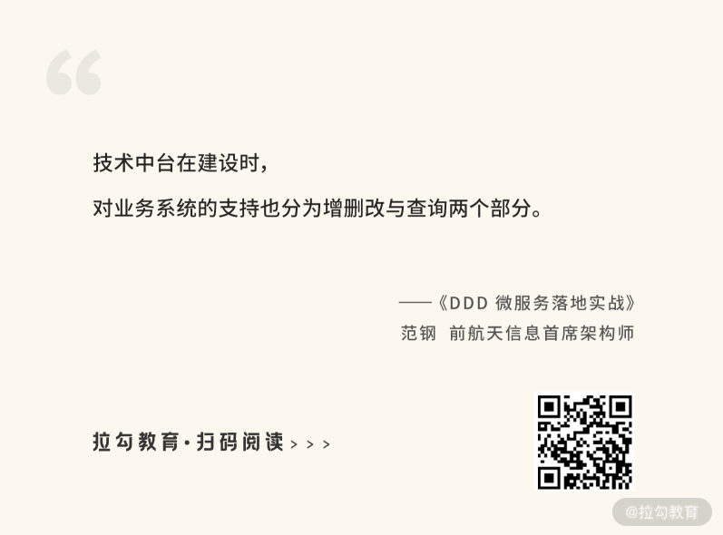
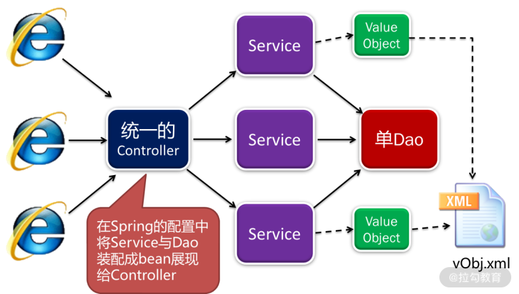
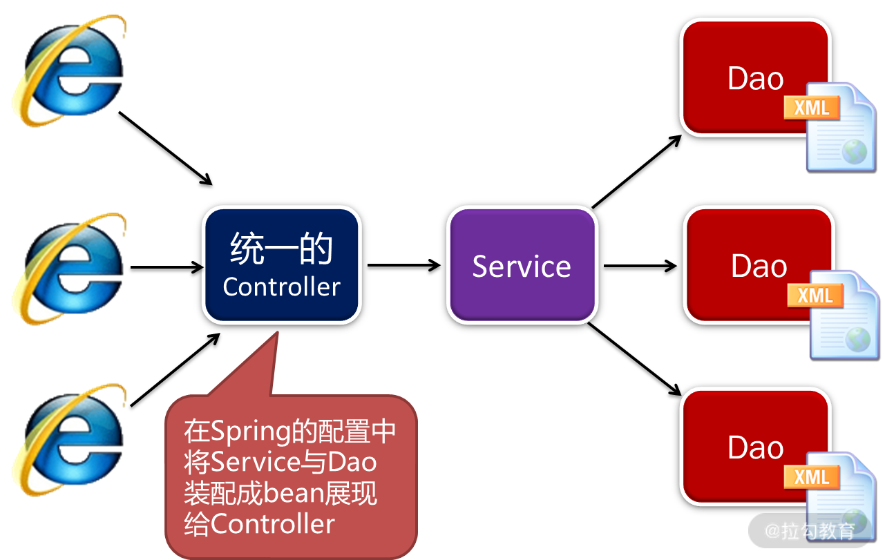

# 13 如何实现支持快速交付的技术中台设计？

前面提到了“大前端”的思想，也就是软件团队组织形式的趋势是“大前端 + 技术中台”，从而通过快速交付提高市场竞争力。所谓的“大前端 + 技术中台”，就是在开发团队中有一个 **架构支持团队**，他们通过架构强大的技术中台，将软件开发中的许多技术架构封装在平台中。有了这样一个技术中台，其他各个开发团队都基于它进行业务开发。

这样，既可以降低业务开发的工作量，提高开发速度，又可以降低技术门槛。业务开发人员也不必过于关注技术，而是将更多的精力集中在对业务的理解，并将对业务深刻的理解融入领域建模的过程中，从而开发出用户更满意的软件，提高用户体验。

因此，如何打造一个强大而实用的技术中台，成了各个软件开发团队迫切的需求。现在我们就从实战的角度看一看，以上这些设计思想该如何落地技术中台建设。

**命令与查询职责分离** （CQRS），是软件大师 Martin Fowler 在他的著作《企业应用架构模式》中提出来的一种架构设计模式。该模式将系统按照职责划分为 **命令** （即增删改操作）与 **查询** 两个部分。

- 所有命令部分的增删改操作，应当采用 **领域驱动设计的思想** 进行软件设计，从而更好地应对大规模复杂应用；
- 所有的查询功能则不适用于领域驱动设计，而应当采用 **事务脚本模式** （Transaction Script），即直接通过 SQL 语句进行查询。

遵循该设计模式，是我们在许多软件项目中总结出来的最佳实践。因此，技术中台在建设时，对业务系统的支持也分为 **增删改** 与 **查询** 两个部分。



## 增删改的架构设计



增删改部分的技术中台架构设计

在增删改部分中，采用了前面提到的单 Controller、单 Dao 的架构设计。如上图所示，各功能都有各自的前端 UI。但与以往架构不同的是，每个功能的前端 UI 对后台请求时，不再调用各自的 Controller，而是统一调用一个 Controller。然而，每个功能的前端在调用这一个 Controller 时，传递的参数是不一样的。首先从前端传递的是 bean，这个 bean 是什么呢？后台各功能都有一个 Service，将该 Service 注入 Dao 以后，会在 Spring 框架中配置成一个bean。这时，前端只知道调用的是这个 bean，但不知道它是哪个 Service。

这样的设计，既保障了 **安全性** （前端不知道具体是哪个类），又有效地实现了 **前后端分离**，将前端代码与后端解耦。

紧接着，前端还要传递一个 method，即调用的是哪个方法，和哪个 JSON 对象。这样，Controller 就可以通过反射进行相应的操作。这里的设计思想是，在软件开发过程中，通过 **规范与契约** 的约定，我们认为前端开发人员已经知道了他需要调用后端哪个 bean、哪个method，以及什么格式的 JSON，就可以大大简化技术中台的设计。

### 单 Controller 的设计

前端所有功能的增删改操作，以及基于 ID 的 get/load 操作，都是访问的 OrmController。

前端在访问 OrmController 时，输入如下 HTTP 请求：

> <http://localhost:9003/orm/{bean}/{method}>

例如：

- GET 请求

> <http://localhost:9003/orm/product/deleteProduct?id=P00006>

- POST 请求

> <http://localhost:9003/orm/product/saveProduct>
> 
> -d"id=P00006&name=ThinkPad T220&price=4600&unit=个&supplierId=20002&classify=办公用品

这里的 { **bean** } 是配置在 Spring 中的 bean.id，{ **method** } 是该 bean 中需要调用的方法（注意，此处不支持方法的重写，如果出现重写，它将去调用同名方法中的最后一个）。

- 如果要调用的方法有 **值对象**，按照规范，必须将 **值对象放在方法的第一个参数上**。
- 如果要调用的方法 **既有值对象**，**又有其他参数**，则值对象中的属性与其他参数都放在该 JSON 对象中。如：要调用的方法为 saveProduct(product, saveMode)，POST 请求为：

> <http://localhost:9003/orm/product/saveProduct>
>
> -d "id=500006&name=ThinkPad T220&price=4600&unit=个&supplierId=20002&classify=办公用品&saveMode=1"

特别需要注意的是：目前 OrmController 不包含任何权限校验，因此配置在 Spring 中的 bean 的所有方法都可以被前端调用。所以在实际项目中需要在 OrmController 之前进行一个 **权限校验**，来规范前端可以调用的方法。建议使用 **服务网关** 或 **filter** 进行校验。

OrmController 的流程设计如下：

- 根据前端参数 bean，从 Spring 中获得 Service；
- 根据前端参数 method，通过反射获得调用方法；
- 通过反射获得调用方法的第一个参数作为值对象；
- 通过反射创建值对象，根据反射获得值对象的所有属性，从前端 JSON 中获得对应属性的值，写入值对象；
- 根据前端 JSON 获得其他参数；
- 将值对象与其他参数，使用反射调用 Service 中的 method 方法。

### 单 Dao 的设计

当系统在 Service 中完成了一系列的业务操作，最终要存盘时，都统一调用一个单 Dao。但是，在调用单 Dao 之前，每个值对象都应当 **通过 vObj.xml 进行配置**。在该配置中，将每个值对象对应的表，以及值对象中每个属性对应的字段，通过 vObj.xml 配置文件进行对应。那么通用的 BasicDao 就可以通过配置文件形成 SQL，并最终完成数据库持久化操作。

vObj.xml 配置文件如下：

```xml
<?xml version="1.0" encoding="UTF-8"?>
<vobjs>
  <vo class="com.demo2.customer.entity.Customer" tableName="Customer">
    <property name="id" column="id" isPrimaryKey="true"></property>
    <property name="name" column="name"></property>
    <property name="sex" column="sex"></property>
    <property name="birthday" column="birthday"></property>
    <property name="identification" column="identification"></property>
    <property name="phone_number" column="phone_number"></property>
  </vo>
</vobjs>
```

值对象中可以有很多的属性变量，但只有最终作 **持久化的属性变量才需要配置**。这样可以使值对象的设计具有更大的空间，可以去做更多的数据转换与业务操作。前面提到充血模型的设计，就是需要在值对象中加入更多的操作与转换，使值对象可以长得与数据库的表不一样。但只要配置最后要持久化的属性，就会将这些属性写入到数据库相应的表中，或者从数据库中读取数据。

有了以上的设计，每个 Service 在 Spring 中都是统一注入 BasicDao。

- 如果要使用 DDD 的功能支持，注入通用仓库 Repository；
- 如果要使用 Redis 缓存，注入 RepositoryWithCache。

Spring 配置如下：

```xml
<?xml version="1.0" encoding="UTF-8"?>
<beans xmlns="http://www.springframework.org/schema/beans" ...>
 <description>The application context for orm</description>
 <bean id="customer" class="com.demo2...CustomerServiceImpl">
  <property name="dao" ref="basicDao"></property>
 </bean>
</beans>
```

特别需要说明的是，虽然当下注解比较流行，并且有诸多优势，但最大的问题是让业务代码对技术框架形成依赖，违背了技术中台设计的初衷。因此，在这里，虽然 Controller、Dao 以及其他功能设计使用了注解，但基于本框架进行的业务开发，包括 Spring 的配置、MyBatis 的配置、vObj 的配置，建议都 **采用 XML 文件的形式**，而 **不要采用注解**。这样，业务开发中设计的 Service 都是纯洁的，没有任何技术依赖，才能在将来移植到各种技术框架中，并长盛不衰。

这样，单 Dao 的流程设计如下。

1.单 Dao 调用 VObjFactory.getVObj(class) 获得配置信息 vObj。

2.根据 vObj.getTable() 获得对应的表名。

3.for(Property prop : vObj.getPreperties() )

- 通过 prop.getColumn() 获得值对象对应的字段；
- 运用反射从值对象中获得所有属性及其对应的值；
- 通过以上参数形成 SQL 语句。

4.通过 SQL 语句执行数据库操作。

## 查询功能的架构设计

接着，是查询功能的技术中台设计，如图所示：



查询功能的技术中台架构设计

与增删改部分一样的是，查询功能中，每个功能的前端 UI 也是统一调用一个 Controller。但与增删改的部分不一样的是，查询功能的前端 UI 传递的参数不同，因此是另一个类 QueryController。

在调用时，首先需要传递的还是 bean。但与增删改不同的是，查询功能的 Service 只有一个，那就是 QueryService。但是，该 Service 在 Spring 中配置的时候，往 Service 中注入的是不同的 Dao，就可以装配成各种不同的 bean。这样，前端调用的是不同的 bean，最后执行的就是不同的查询。

此外，与增删改不同的是，查询部分不需要传递 method 参数，因为每次查询调用的方法都是query()。最后，前端还要以 JSON 的形式传递各种查询参数，就能进行后端查询了。

### 单 Controller 的设计

在进行查询时，前端输入 HTTP 请求：

> <http://localhost:9003/query/{bean}>

例如：

> <http://localhost:9003/query/customerQry?gender=male&page=1&size=30>

该方法既可以接收 GET 请求，也可以接收 POST 请求。{bean} 是配置在 Spring 中的Service。QueryController 通过该请求，在 Spring 中找到 Service，并调用Service.query(map) 进行查询，此处的 map 就是该请求传递的所有查询参数。

为此，查询部分的单 Controller 的流程设计如下：

- 从前端获得 bean、page、size、count，以及查询参数；
- 根据 bean 从 Spring 中获得相应的 Serivce；
- 从前端获得查询参数 JSON，将其转换为 Map；
- 执行 service.query(map)；
- 执行完查询后，以不同形式返回给前端。

### 单 Service 的设计

查询的部分采用了单 Service 的设计，即所有的查询都是 **配置的 QueryService 进行查询**，但注入的是不同的 Dao，就可以配置成不同的 bean，完成各自不同的查询。为了设计更加简化，每个 Dao 可以通过 MyBatis 框架，注入同一个 Dao，但配置不同的 Mapper，就可以完成不同的查询。因此，先配置 MyBatis 的 Mapper 文件

```xml
<?xml version="1.0" encoding="UTF-8"?>
<!DOCTYPE mapper PUBLIC "-//mybatis.org//DTD Mapper 3.0//EN"
"http://mybatis.org/dtd/mybatis-3-mapper.dtd">
<mapper namespace="com.demo2.customer.query.dao.CustomerMapper">
 <!--筛选条件-->
 <sql id="searchParam">
  <if test="id != '' and id != null">
   and id = #{id}
  </if>
 </sql>
 <!--求count判断-->
 <sql id="isCount1">
  <if test="count == null  and notCount ==1">
   select count(*) from (
  </if>
 </sql>
 <sql id="isCount2">
  <if test="count == null  and notCount ==1">
   ) count
  </if>
 </sql> 
 <!--是否分页判断-->
 <sql id="isPage">
  <if test="size != null  and size !=''">
   limit #{size} offset #{firstRow} 
  </if>
  <if test="size ==null  or size ==''">
   <if test="pageSize != null  and pageSize !=''">
    limit #{pageSize} offset #{startNum} 
   </if>
  </if>
 </sql>
 <select id="query" parameterType="java.util.HashMap" resultType="com.demo2.customer.entity.Customer">
     <include refid="isCount1"/> 
        SELECT * FROM Customer WHERE 1 = 1
    <include refid="searchParam"/>
    <include refid="isPage"/>
     <include refid="isCount2"/>
 </select>
</mapper>
```

然后，将其注入 Spring 中，完成相应的配置，就可以进行查询了：

```xml
<?xml version="1.0" encoding="UTF-8"?>
<beans xmlns="http://www.springframework.org/schema/beans" ...>
 <description>The application context for query</description>
 <bean id="customerQry" class="com.demo2.support.service.impl.QueryServiceImpl">
  <property name="queryDao">
   <bean class="com.demo2.support.dao.impl.QueryDaoMybatisImpl">
    <property name="sqlMapper" value="com.demo2.customer.query.dao.CustomerMapper.query"></property>
   </bean>
  </property>
 </bean>
</beans>
```

每个查询的 bean 都是配置的 QueryServiceImpl，但每个 bean 配置的是不同的 sqlMapper，就会执行不同的查询。这里的 sqlMapper 应当与前面 MyBatis 配置中的namespace 相对应。

这样，查询部分的单 Service 流程设计如下：

- 将查询参数 map、 page、size 传递给 Dao，执行查询 dao.query(map)；
- 在查询的前后增加空方法 beforeQuery()、afterQuery() 作为 hook，当某业务需要在查询前后进行处理时，通过重载子类去实现；
- 判断前端是否传递 count，如果有则不再求和，否则调用 dao.count() 求和计算“第 x 页，共 y 页”；
- 将数据打包成 ResultSet 对象返回。

通常，在执行查询时，只需要执行 dao.query(map) 就可以了。由于不同的 bean 注入的 Dao不同，因此执行 dao.query(map) 就会执行不同的查询。但是，在某些业务中，需要个性地在查询前进行某些处理，如对查询参数进行某些转换，或者在查询后对查询结果进行某些转换与补填。现在的设计中只有一个 Service，如何实现查询前后的这些处理呢？

首先，在 QueryService 中增加了 beforeQuery() 和 afterQuery() 两个方法，但这两个方法在QueryService 中设计成空方法，什么都没写，因此调用它们就跟没有调用一样。这样的设计叫“钩子 hook”，如下代码所示：

```java
 /**
  * do something before query. 
  * It just a hook that override the function in subclass if we need do something before query.
  * @param params the parameters the query need
  */
 protected void beforeQuery(Map<String, Object> params) {
  //just a hood
 }
 /**
  * do something after query. 
  * It just a hook that override the function in subclass if we need do something after query.
  * @param params the parameters the query need
  * @param resultSet the result set after query.
  * @return 
  */
 protected ResultSet afterQuery(Map<String, Object> params, ResultSet resultSet) {
  //just a hood
  return resultSet;
 }
```

这样，如果不需要在查询前后添加处理，直接配置 QueryService 就行了。在执行查询时，就像没有这两个方法一样。然而，如果需要在查询前或查询后添加某些处理时，则通过继承编写一个 QueryService 的子类，并重写 beforeQuery() 或 afterQuery()。在 Spring 配置时配置的是这个子类，就实现了查询前后的处理。

譬如，ProductQuery 这个查询需要在查询后，对查询结果集补填 Supplier。这时，通过继承编写一个子类 ProductQueryServiceImpl，重写 afterQuery()。

```java
public class ProductQueryServiceImpl extends QueryServiceImpl {
 @Autowired
 private SupplierService supplierService;
 @Override
 protected ResultSet afterQuery(Map<String, Object> params,
   ResultSet resultSet) {
  @SuppressWarnings("unchecked")
  List<Product> list = (List<Product>)resultSet.getData();
  for(Product product : list) {
   String supplierId = product.getSupplierId();
   Supplier supplier = supplierService.loadSupplier(supplierId);
   product.setSupplier(supplier);
  }
  resultSet.setData(list);
  return resultSet;
 }
}
```

最后，将查询结果以 ResultSet 值对象的形式返回给 Controller，Controller 再返回给前端。在这个 ResultSet 中：

- 属性 data 是这一页的查询结果集；
- page、size 是分页信息；
- count 是记录总数。

通过这 3 个值就可以在前端显示“第 x 页，共 y 页，z 条记录”。在第一次查询时，除了查询这一页的数据，还要执行 count。将该 count 记录下来后，在进行分页查询时，就不再需要执行 count，从而有效提高查询性能。

属性 aggregate 是一个 map，如果该查询在前端展现时，需要在表格的最下方对某些字段进行汇总，并且这个汇总是对整个查询结果的汇总，而不是这一页的汇总，则将该字段作为 Key 值写入 aggregate 中，Value 是汇总的方式，如 count、sum、max 等。通过这样的设置，就可以在查询结果集的最后一行返回一个汇总记录。

通过以上技术中台的设计，各查询功能的编码就会极大地简化。具体来说，设计一个普通的查询，只需要制作一个 MyBatis 的查询语句配置，在 Spring 配置中制作一个 bean。然后，就可以通过前端进行查询了，甚至都不需要编写任何 class。只有在查询前后添加操作时，才需要自己制作一个子类。

此外，对于进行查询结果集的补填，也可以使用通用程序 AutofillQueryServiceImpl，在下一讲“如何设计支持领域驱动的技术中台”中会详细讲解。

## 总结

本讲讲解了一个强大而落地的技术中台设计实践。通过该技术中台的封装：

- 在增删改操作时，只需编写前端界面、Service 与值对象就可以了，更多技术细节被封装起来了，这样，开发人员就可以专心地将领域模型转换成业务代码的设计实现，并随着领域模型的变更而变更代码，不断满足用户需求；
- 在查询操作时，在大多数情况下只需要编写 MyBatis 与 Spring 的配置就可以完成查询功能的编写，开发工作量大大降低，同时变更也变得轻松快捷。

以上技术中台的设计是普通技术中台的设计，那么支持 DDD 的技术中台又该如何设计呢？是不是可以编写通用的仓库与工厂呢？下一讲将为你讲解。

[点击 GitHub 链接](https://github.com/mooodo/demo-service2-support)，查看源码。
