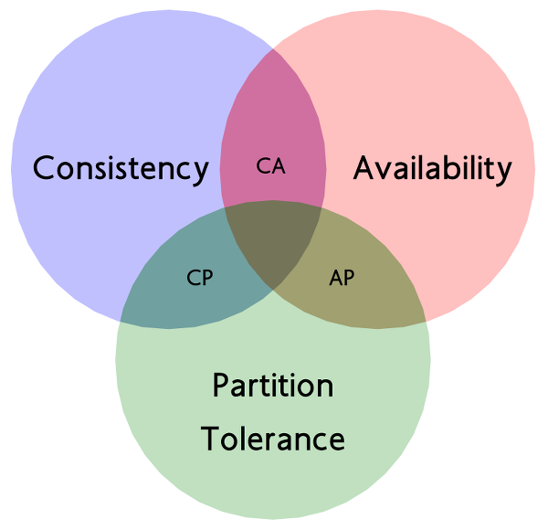
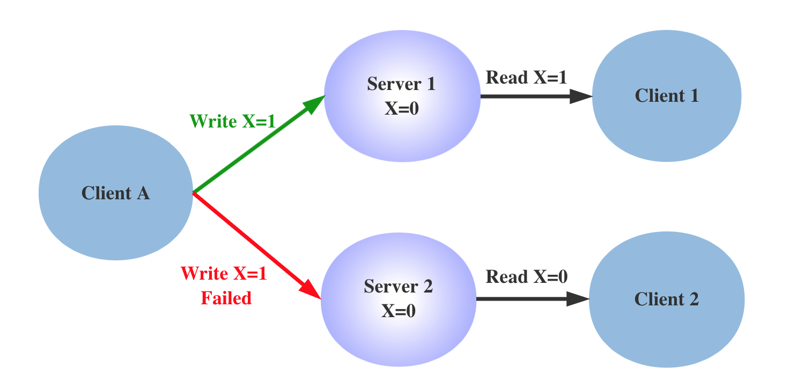

# 01 如何证明分布式系统的 CAP 理论？

本课时我们主要介绍分布式系统中最基础的 CAP 理论及其应用。 对于开发或设计分布式系统的架构师、工程师来说，CAP 是必须要掌握的基础理论，CAP 理论可以帮助架构师对系统设计中目标进行取舍，合理地规划系统拆分的维度。下面我们先讲讲分布式系统的特点。

## 分布式系统的特点

随着移动互联网的快速发展，互联网的用户数量越来越多，产生的数据规模也越来越大，对应用系统提出了更高的要求，我们的系统必须支持高并发访问和海量数据处理。 分布式系统技术就是用来解决集中式架构的性能瓶颈问题，来适应快速发展的业务规模，一般来说，分布式系统是建立在网络之上的硬件或者软件系统，彼此之间通过消息等方式进行通信和协调。 分布式系统的核心是 **可扩展性** ，通过对服务、存储的扩展，来提高系统的处理能力，通过对多台服务器协同工作，来完成单台服务器无法处理的任务，尤其是高并发或者大数据量的任务。 除了对可扩展性的需求，分布式系统 **还有不出现单点故障、服务或者存储无状态等特点** 。

- 单点故障（Single Point Failure）是指在系统中某个组件一旦失效，这会让整个系统无法工作，而不出现单点故障，单点不影响整体，就是分布式系统的设计目标之一；
- 无状态，是因为无状态的服务才能满足部分机器宕机不影响全部，可以随时进行扩展的需求。 由于分布式系统的特点，在分布式环境中更容易出现问题，比如节点之间通信失败、网络分区故障、多个副本的数据不一致等，为了更好地在分布式系统下进行开发，学者们提出了一系列的理论，其中具有代表性的就是 CAP 理论。

## CAP 代表什么含义

CAP 理论可以表述为，一个分布式系统最多只能同时满足一致性（Consistency）、可用性（Availability）和分区容忍性（Partition Tolerance）这三项中的两项。 

**一致性** 是指“所有节点同时看到相同的数据”，即更新操作成功并返回客户端完成后，所有节点在同一时间的数据完全一致，等同于所有节点拥有数据的最新版本。 **可用性** 是指“任何时候，读写都是成功的”，即服务一直可用，而且是正常响应时间。我们平时会看到一些 IT 公司的对外宣传，比如系统稳定性已经做到 3 个 9、4 个 9，即 99.9%、99.99%，这里的 N 个 9 就是对可用性的一个描述，叫做 SLA，即服务水平协议。比如我们说月度 99.95% 的 SLA，则意味着每个月服务出现故障的时间只能占总时间的 0.05%，如果这个月是 30 天，那么就是 21.6 分钟。 **分区容忍性** 具体是指“当部分节点出现消息丢失或者分区故障的时候，分布式系统仍然能够继续运行”，即系统容忍网络出现分区，并且在遇到某节点或网络分区之间网络不可达的情况下，仍然能够对外提供满足一致性和可用性的服务。 在分布式系统中，由于系统的各层拆分，P 是确定的，CAP 的应用模型就是 CP 架构和 AP 架构。分布式系统所关注的，就是在 Partition Tolerance 的前提下，如何实现更好的 A 和更稳定的 C。

### CAP 理论的证明

CAP 理论的证明有多种方式，通过 **反证** 的方式是最直观的。反证法来证明 CAP 定理，最早是由 Lynch 提出的，通过一个实际场景，如果 CAP 三者可同时满足，由于允许 P 的存在，则一定存在 Server 之间的丢包，如此则不能保证 C。  首先构造一个单机系统，如上图，Client A 可以发送指令到 Server 并且设置更新 X 的值，Client 1 从 Server 读取该值，在单点情况下，即没有网络分区的情况下，通过简单的事务机制，可以保证 Client 1 读到的始终是最新值，不存在一致性的问题。  我们在系统中增加一组节点，因为允许分区容错，Write 操作可能在 Server 1 上成功，在 Server 2 上失败，这时候对于 Client 1 和 Client 2，就会读取到不一致的值，出现不一致的情况。如果要保持 X 值的一致性，Write 操作必须同时失败， 也就是降低系统的可用性。 可以看到，在分布式系统中，无法同时满足 CAP 定律中的“一致性”“可用性”和“分区容错性”三者。 在该证明中，对 CAP 的定义进行了更明确的声明：

- Consistency，一致性被称为原子对象，任何的读写都应该看起来是“原子”的，或串行的，写后面的读一定能读到前面写的内容，所有的读写请求都好像被全局排序；
- Availability，对任何非失败节点都应该在有限时间内给出请求的回应（请求的可终止性）；
- Partition Tolerance，允许节点之间丢失任意多的消息，当网络分区发生时，节点之间的消息可能会完全丢失。

### CAP 理论的应用

CAP 理论提醒我们，在架构设计中，不要把精力浪费在如何设计能满足三者的完美分布式系统上，而要合理进行取舍，CAP 理论类似数学上的不可能三角，只能三者选其二，不能全部获得。 不同业务对于一致性的要求是不同的。举个例来讲，在微博上发表评论和点赞，用户对不一致是不敏感的，可以容忍相对较长时间的不一致，只要做好本地的交互，并不会影响用户体验；而我们在电商购物时，产品价格数据则是要求强一致性的，如果商家更改价格不能实时生效，则会对交易成功率有非常大的影响。 需要注意的是，CAP 理论中是忽略网络延迟的，也就是当事务提交时，节点间的数据复制一定是需要花费时间的。即使是同一个机房，从节点 A 复制到节点 B，由于现实中网络不是实时的，所以总会有一定的时间不一致。

### CP 和 AP 架构的取舍

在通常的分布式系统中，为了保证数据的高可用，通常会将数据保留多个 **副本** （Replica），网络分区是既成的现实，于是只能在可用性和一致性两者间做出选择。CAP 理论关注的是在绝对情况下，在工程上，可用性和一致性并不是完全对立的，我们关注的往往是如何在保持相对一致性的前提下，提高系统的可用性。 业务上对一致性的要求会直接反映在系统设计中，典型的就是 CP 和 AP 结构。

- CP 架构：对于 CP 来说，放弃可用性，追求一致性和分区容错性。

我们熟悉的 ZooKeeper，就是采用了 CP 一致性，ZooKeeper 是一个分布式的服务框架，主要用来解决分布式集群中应用系统的协调和一致性问题。其核心算法是 Zab，所有设计都是为了一致性。在 CAP 模型中，ZooKeeper 是 CP，这意味着面对网络分区时，为了保持一致性，它是不可用的。关于 Zab 协议，将会在后面的 ZooKeeper 课时中介绍。

- AP 架构：对于 AP 来说，放弃强一致性，追求分区容错性和可用性，这是很多分布式系统设计时的选择，后面的 Base 也是根据 AP 来扩展的。

和 ZooKeeper 相对的是 Eureka，Eureka 是 Spring Cloud 微服务技术栈中的服务发现组件，Eureka 的各个节点都是平等的，几个节点挂掉不影响正常节点的工作，剩余的节点依然可以提供注册和查询服务，只要有一台 Eureka 还在，就能保证注册服务可用，只不过查到的信息可能不是最新的版本，不保证一致性。
