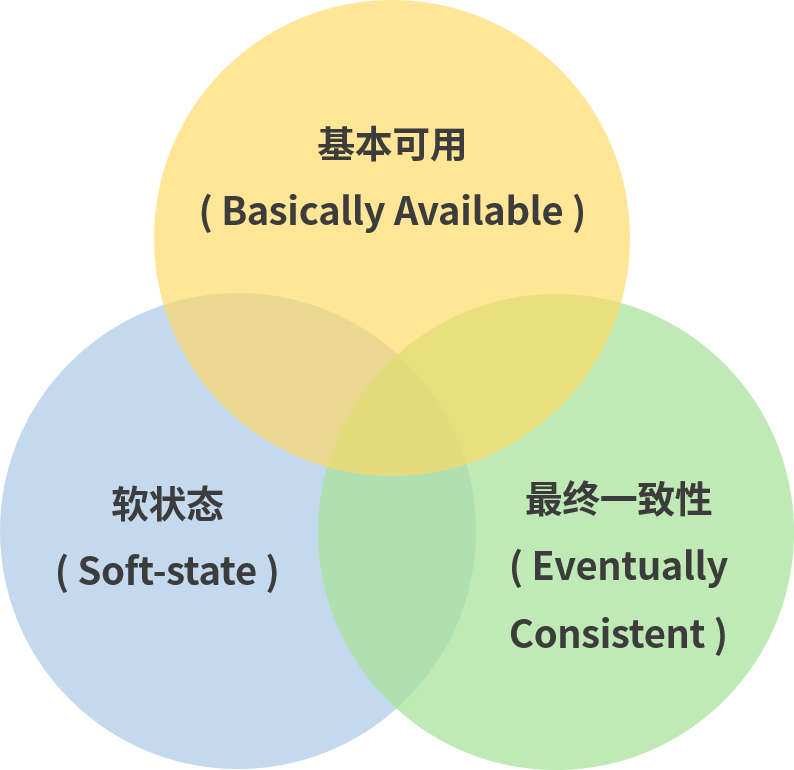
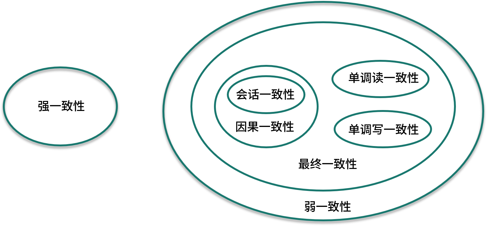

# 02 不同数据一致性模型有哪些应用？

本课时我们主要讲解“不同数据一致性模型有哪些应用”？ 上一课时讲过，对于 CAP 来说，放弃强一致性（这里说的一致性是强一致性），追求分区容错性和可用性，这是很多分布式系统设计时的选择。在工程实践中，基于 CAP 定理逐步演化，就提出了 Base 理论。 那么 Base 理论有哪些内容，Base 理论下的一致性模型又有哪些呢？

## Base 理论

Base 是三个短语的简写，即基本可用（Basically Available）、软状态（Soft State）和最终一致性（Eventually Consistent）。  Base 理论的核心思想是 **最终一致性**，即使无法做到强一致性（Strong Consistency），但每个应用都可以根据自身的业务特点，采用适当的方式来使系统达到最终一致性（Eventual Consistency）。 接下来我们着重对 Base 理论中的三要素进行讲解。

## 三个要素详解

### 基本可用

基本可用比较好理解，就是不追求 CAP 中的「任何时候，读写都是成功的」，而是系统能够基本运行，一直提供服务。基本可用强调了分布式系统在出现不可预知故障的时候，允许损失部分可用性，相比正常的系统，可能是响应时间延长，或者是服务被降级。 举个例子，在双十一秒杀活动中，如果抢购人数太多超过了系统的 QPS 峰值，可能会排队或者提示限流，这就是通过合理的手段保护系统的稳定性，保证主要的服务正常，保证基本可用。 

### 软状态

软状态可以对应 ACID 事务中的原子性，在 ACID 的事务中，实现的是强制一致性，要么全做要么不做，所有用户看到的数据一致。其中的原子性（Atomicity）要求多个节点的数据副本都是一致的，强调数据的一致性。 原子性可以理解为一种“硬状态”，软状态则是允许系统中的数据存在中间状态，并认为该状态不影响系统的整体可用性，即允许系统在多个不同节点的数据副本存在数据延时。

### 最终一致性

数据不可能一直是软状态，必须在一个时间期限之后达到各个节点的一致性，在期限过后，应当保证所有副本保持数据一致性，也就是达到数据的最终一致性。 在系统设计中，最终一致性实现的时间取决于网络延时、系统负载、不同的存储选型、不同数据复制方案设计等因素。

## 全局时钟和逻辑时钟

接下来我会分析不同数据一致性模型的分类，在这之前，我们先来看一个分布式系统中的全局时钟概念。 分布式系统解决了 **传统单体架构的单点问题和性能容量问题**，另一方面也带来了很多新的问题，其中一个问题就是 **多节点的时间同步问题** ：不同机器上的物理时钟难以同步，导致无法区分在分布式系统中多个节点的事件时序。 没有 **全局时钟**，绝对的内部一致性是没有意义的，一般来说，我们讨论的一致性都是外部一致性，而外部一致性主要指的是多并发访问时更新过的数据如何获取的问题。 和全局时钟相对的，是 **逻辑时钟**，逻辑时钟描绘了分布式系统中事件发生的时序，是为了区分现实中的物理时钟提出来的概念。  一般情况下我们提到的时间都是指物理时间，但实际上很多应用中，只要所有机器有相同的时间就够了，这个时间不一定要跟实际时间相同。更进一步解释：如果两个节点之间不进行交互，那么它们的时间甚至都不需要同步。 因此问题的关键点在于 **节点间的交互要在事件的发生顺序上达成一致，而不是对于时间达成一致** 。 逻辑时钟的概念也被用来解决分布式一致性问题，这里我们不展开，感兴趣的可以找一些相关的资料来学习。

## 不同数据一致性模型

一般来说，数据一致性模型可以分为强一致性和弱一致性，强一致性也叫做线性一致性，除此以外，所有其他的一致性都是弱一致性的特殊情况。弱一致性根据不同的业务场景，又可以分解为更细分的模型，不同一致性模型又有不同的应用场景。 在互联网领域的绝大多数场景中，都需要牺牲强一致性来换取系统的高可用性，系统往往只需要保证“最终一致性”，只要这个最终时间是在用户可以接受的范围内即可。  对于一致性，可以分为从服务端和客户端两个不同的视角，上面提到了全局时钟概念，这里关注的主要是外部一致性。

### 强一致性

当更新操作完成之后，任何多个后续进程的访问都会返回最新的更新过的值，这种是对用户最友好的，就是用户上一次写什么，下一次就保证能读到什么。根据 CAP 理论，这种实现需要牺牲可用性。

### 弱一致性

系统在数据写入成功之后，不承诺立即可以读到最新写入的值，也不会具体的承诺多久之后可以读到。用户读到某一操作对系统数据的更新需要一段时间，我们称这段时间为“ **不一致性窗口** ”。

### 最终一致性

最终一致性是弱一致性的特例，强调的是所有的数据副本，在经过一段时间的同步之后，最终都能够达到一个一致的状态。因此，最终一致性的本质是需要系统保证最终数据能够达到一致，而不需要实时保证系统数据的强一致性。 到达最终一致性的时间 ，就是不一致窗口时间，在没有故障发生的前提下，不一致窗口的时间主要受通信延迟，系统负载和复制副本的个数影响。 最终一致性模型根据其提供的不同保证可以划分为更多的模型，包括 **因果一致性和会话一致性** 等。

- 因果一致性

因果一致性要求有因果关系的操作顺序得到保证，非因果关系的操作顺序则无所谓。 进程 A 在更新完某个数据项后通知了进程 B，那么进程 B 之后对该数据项的访问都应该能够获取到进程 A 更新后的最新值，并且如果进程 B 要对该数据项进行更新操作的话，务必基于进程 A 更新后的最新值。 因果一致性的应用场景可以举个例子，在微博或者微信进行评论的时候，比如你在朋友圈发了一张照片，朋友给你评论了，而你对朋友的评论进行了回复，这条朋友圈的显示中，你的回复必须在朋友之后，这是一个因果关系，而其他没有因果关系的数据，可以允许不一致。

- 会话一致性

会话一致性将对系统数据的访问过程框定在了一个会话当中，约定了系统能保证在同一个有效的会话中实现“ **读己之所写** ”的一致性，就是在你的一次访问中，执行更新操作之后，客户端能够在同一个会话中始终读取到该数据项的最新值。 实际开发中有分布式的 Session 一致性问题，可以认为是会话一致性的一个应用。

## CAP 及 Base 的关系

Base 理论是在 CAP 上发展的，CAP 理论描述了分布式系统中数据一致性、可用性、分区容错性之间的制约关系，当你选择了其中的两个时，就不得不对剩下的一个做一定程度的牺牲。 Base 理论则是对 CAP 理论的实际应用，也就是在分区和副本存在的前提下，通过一定的系统设计方案，放弃强一致性，实现基本可用，这是大部分分布式系统的选择，比如 NoSQL 系统、微服务架构。在这个前提下，如何把基本可用做到最好，就是分布式工程师们追求的，在这个课程中，我们也会有专门的模块来讲解高可用。 除了 CAP 和 Base，上面还提到了 ACID 原理，ACID 是一种强一致性模型，强调原子性、一致性、隔离性和持久性，主要用于在数据库实现中。Base 理论面向的是高可用、可扩展的分布式系统，ACID 适合传统金融等业务，在实际场景中，不同业务对数据的一致性要求不一样，ACID 和 Base 理论往往会结合使用。
