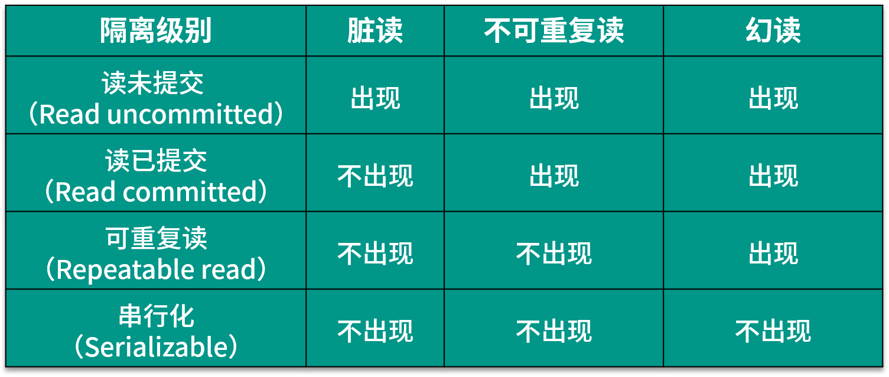
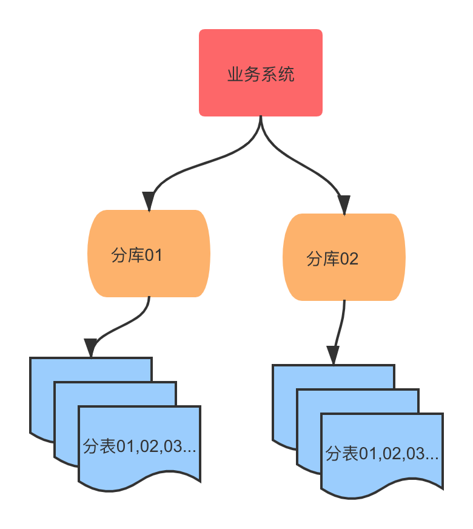
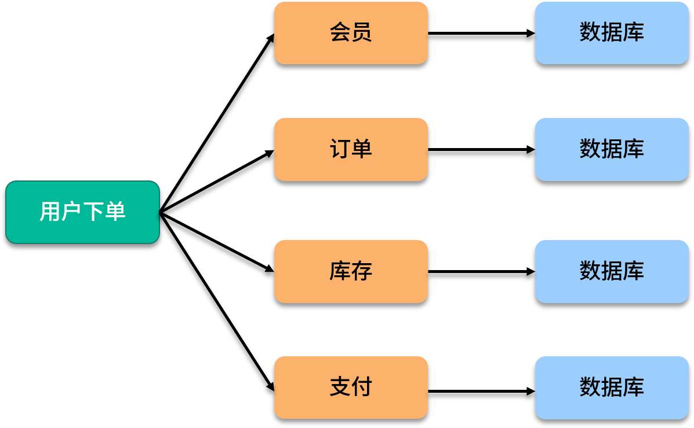
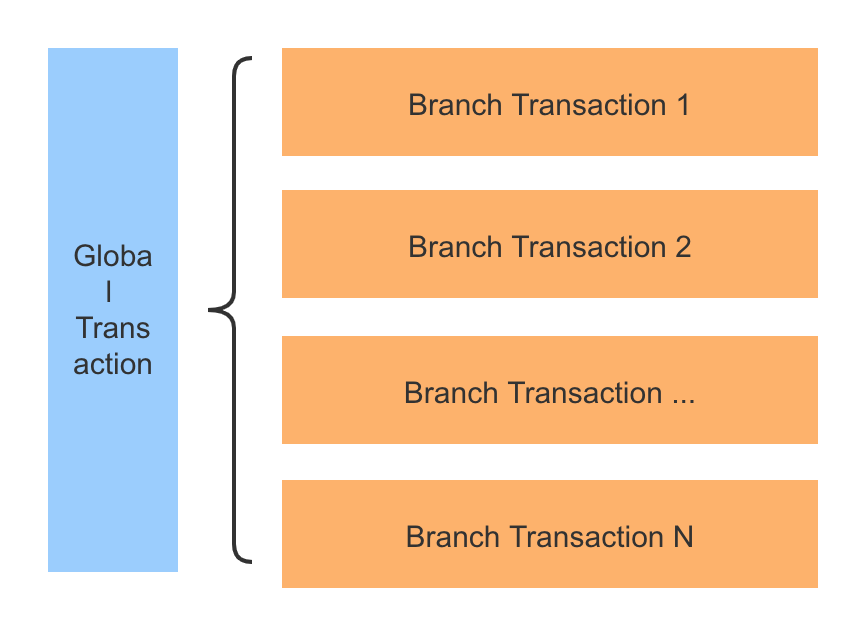

# 07 分布式事务有哪些解决方案？

本课时我们来讨论下分布式事务的相关知识点。

分布式事务是分布式系统中非常重要的一部分，最典型的例子是银行转账和扣款，A 和 B 的账户信息在不同的服务器上，A 给 B 转账 100 元，要完成这个操作，需要两个步骤，从 A 的账户上扣款，以及在 B 的账户上增加金额，两个步骤必须全部执行成功；否则如果有一个失败，那么另一个操作也不能执行。

那么像这种转账扣款的例子，在业务中如何保证一致性，有哪些解决方案呢？

## 分布式事务是什么

顾名思义，分布式事务关注的是分布式场景下如何处理事务，是指事务的参与者、支持事务操作的服务器、存储等资源分别位于分布式系统的不同节点之上。

简单来说，分布式事务就是一个业务操作，是由多个细分操作完成的，而这些细分操作又分布在不同的服务器上；事务，就是这些操作要么全部成功执行，要么全部不执行。

### 数据库事务

数据库事务的特性包括原子性（Atomicity）、一致性（Consistency）、隔离性（Isolation）和持久性（Durabilily），简称 ACID。

在数据库执行中，多个并发执行的事务如果涉及到同一份数据的读写就容易出现数据不一致的情况，不一致的异常现象有以下几种。

**脏读**，是指一个事务中访问到了另外一个事务未提交的数据。例如事务 T1 中修改的数据项在尚未提交的情况下被其他事务（T2）读取到，如果 T1 进行回滚操作，则 T2 刚刚读取到的数据实际并不存在。**不可重复读**，是指一个事务读取同一条记录 2 次，得到的结果不一致。例如事务 T1 第一次读取数据，接下来 T2 对其中的数据进行了更新或者删除，并且 Commit 成功。这时候 T1 再次读取这些数据，那么会得到 T2 修改后的数据，发现数据已经变更，这样 T1 在一个事务中的两次读取，返回的结果集会不一致。**幻读**，是指一个事务读取 2 次，得到的记录条数不一致。例如事务 T1 查询获得一个结果集，T2 插入新的数据，T2 Commit 成功后，T1 再次执行同样的查询，此时得到的结果集记录数不同。

脏读、不可重复读和幻读有以下的包含关系，如果发生了脏读，那么幻读和不可重复读都有可能出现。

### 不同隔离级别

SQL 标准根据三种不一致的异常现象，将隔离性定义为四个 **隔离级别** （Isolation Level），隔离级别和数据库的性能呈反比，隔离级别越低，数据库性能越高；而隔离级别越高，数据库性能越差，具体如下：

 （1）Read uncommitted 读未提交

在该级别下，一个事务对数据修改的过程中，不允许另一个事务对该行数据进行修改，但允许另一个事务对该行数据进行读，不会出现更新丢失，但会出现脏读、不可重复读的情况。

（2）Read committed 读已提交

在该级别下，未提交的写事务不允许其他事务访问该行，不会出现脏读，但是读取数据的事务允许其他事务访问该行数据，因此会出现不可重复读的情况。

（3）Repeatable read 可重复读

在该级别下，在同一个事务内的查询都是和事务开始时刻一致的，保证对同一字段的多次读取结果都相同，除非数据是被本身事务自己所修改，不会出现同一事务读到两次不同数据的情况。因为没有约束其他事务的新增Insert操作，所以 SQL 标准中可重复读级别会出现幻读。

值得一提的是，可重复读是 MySQL InnoDB 引擎的默认隔离级别，但是在 MySQL 额外添加了间隙锁（Gap Lock），可以防止幻读。

（4）Serializable 序列化

该级别要求所有事务都必须串行执行，可以避免各种并发引起的问题，效率也最低。

对不同隔离级别的解释，其实是为了保持数据库事务中的隔离性（Isolation），目标是使并发事务的执行效果与串行一致，隔离级别的提升带来的是并发能力的下降，两者是负相关的关系。

## 分布式事务产生的原因

分布式事务是伴随着系统拆分出现的，前面我们说过，分布式系统解决了海量数据服务对扩展性的要求，但是增加了架构上的复杂性，在这一点上，分布式事务就是典型的体现。

在实际开发中，分布式事务产生的原因主要来源于存储和服务的拆分。

### 存储层拆分

存储层拆分，最典型的就是数据库分库分表，一般来说，当单表容量达到千万级，就要考虑数据库拆分，从单一数据库变成多个分库和多个分表。在业务中如果需要进行跨库或者跨表更新，同时要保证数据的一致性，就产生了分布式事务问题。在后面的课程中，也会专门来讲解数据库拆分相关的内容。

### 服务层拆分

服务层拆分也就是业务的服务化，系统架构的演进是从集中式到分布式，业务功能之间越来越解耦合。

比如电商网站系统，业务初期可能是一个单体工程支撑整套服务，但随着系统规模进一步变大，参考康威定律，大多数公司都会将核心业务抽取出来，以作为独立的服务。商品、订单、库存、账号信息都提供了各自领域的服务，业务逻辑的执行散落在不同的服务器上。

用户如果在某网站上进行一个下单操作，那么会同时依赖订单服务、库存服务、支付扣款服务，这几个操作如果有一个失败，那下单操作也就完不成，这就需要分布式事务来保证了。 

## 分布式事务解决方案

分布式事务的解决方案，典型的有两阶段和三阶段提交协议、 TCC 分段提交，和基于消息队列的最终一致性设计。

### 2PC 两阶段提交

两阶段提交（2PC，Two-phase Commit Protocol）是非常经典的强一致性、中心化的原子提交协议，在各种事务和一致性的解决方案中，都能看到两阶段提交的应用。

### 3PC 三阶段提交

三阶段提交协议（3PC，Three-phase_commit_protocol）是在 2PC 之上扩展的提交协议，主要是为了解决两阶段提交协议的阻塞问题，从原来的两个阶段扩展为三个阶段，增加了超时机制。

### TCC 分段提交

TCC 是一个分布式事务的处理模型，将事务过程拆分为 Try、Confirm、Cancel 三个步骤，在保证强一致性的同时，最大限度提高系统的可伸缩性与可用性。

两阶段、三阶段以及 TCC 协议在后面的课程中我会详细介绍，接下来介绍几种系统设计中常用的一致性解决方案。

### 基于消息补偿的最终一致性

异步化在分布式系统设计中随处可见，基于消息队列的最终一致性就是一种异步事务机制，在业务中广泛应用。

在具体实现上，基于消息补偿的一致性主要有本地消息表和第三方可靠消息队列等。

下面介绍一下本地消息表，本地消息表的方案最初是由 ebay 的工程师提出，核心思想是将分布式事务拆分成本地事务进行处理，通过消息日志的方式来异步执行。

本地消息表是一种业务耦合的设计，消息生产方需要额外建一个事务消息表，并记录消息发送状态，消息消费方需要处理这个消息，并完成自己的业务逻辑，另外会有一个异步机制来定期扫描未完成的消息，确保最终一致性。

下面我们用下单减库存业务来简单模拟本地消息表的实现过程：

（1）系统收到下单请求，将订单业务数据存入到订单库中，并且同时存储该订单对应的消息数据，比如购买商品的 ID 和数量，消息数据与订单库为同一库，更新订单和存储消息为一个本地事务，要么都成功，要么都失败。

（2）库存服务通过消息中间件收到库存更新消息，调用库存服务进行业务操作，同时返回业务处理结果。

（3）消息生产方，也就是订单服务收到处理结果后，将本地消息表的数据删除或者设置为已完成。

（4）设置异步任务，定时去扫描本地消息表，发现有未完成的任务则重试，保证最终一致性。

以上就是基于本地消息表一致性的主流程，在具体实践中，还有许多分支情况，比如消息发送失败、下游业务方处理失败等，感兴趣的同学可以思考下。

### 不要求最终一致性的柔性事务

除了上述几种，还有一种不保证最终一致性的柔性事务，也称为 **尽最大努力通知**，这种方式适合可以接受部分不一致的业务场景。

## 分布式事务有哪些开源组件

分布式事务开源组件应用比较广泛的是蚂蚁金服开源的 Seata，也就是 Fescar，前身是阿里中间件团队发布的 TXC（Taobao Transaction Constructor）和升级后的 GTS（Global Transaction Service）。

Seata 的设计思想是把一个分布式事务拆分成一个包含了若干分支事务（Branch Transaction）的全局事务（Global Transaction）。分支事务本身就是一个满足 ACID 的 本地事务，全局事务的职责是协调其下管辖的分支事务达成一致，要么一起成功提交，要么一起失败回滚。

 在 Seata 中，全局事务对分支事务的协调基于两阶段提交协议，类似数据库中的 XA 规范，XA 规范定义了三个组件来协调分布式事务，分别是 AP 应用程序、TM 事务管理器、RM 资源管理器、CRM 通信资源管理器。关于 XA 规范的详细内容，将会在后面的课时中介绍。

## 总结

掌握分布式事务是学习分布式系统的必经之路，今天介绍了分布式事务的概念，回顾了数据库事务和不同隔离级别，以及分布式事务产生的原因，最后介绍了分布式事务的几种解决方案。

对本节课程中没有扩展的知识点，比如 MySQL 的间隙锁，Seata 组件的具体应用等，感兴趣的同学可以找相关资料去学习。
