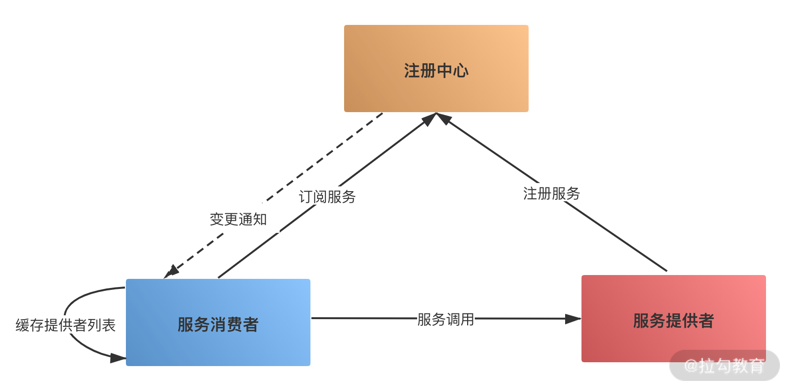
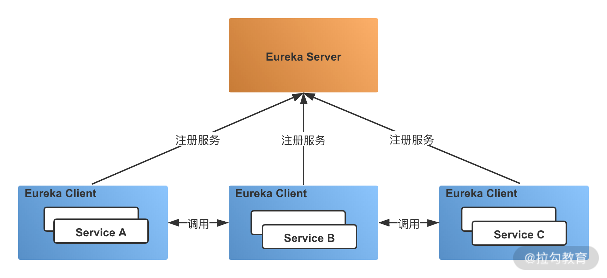
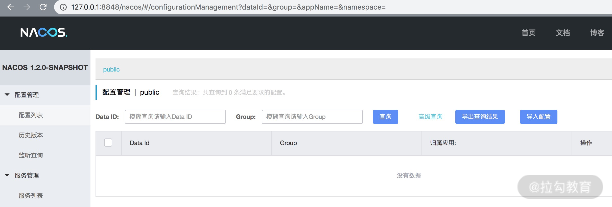

# 16 如何实现服务注册与发现？

你好，欢迎来到第 14 课时，本课时主要讲解如何实现服务注册与发现。

在分布式服务中，**服务注册和发现** 是一个特别重要的概念，为什么需要服务注册和发现？常用的服务发现组件有哪些？服务注册和发现对一致性有哪些要求呢?下面我们就来学习服务发现相关的知识。

### 为什么需要服务注册和发现

分布式系统下微服务架构的一个重要特性就是可以快速上线或下线，从而可以让服务进行水平扩展，以保证服务的可用性。

假设有一个电商会员服务，随着业务发展，服务器负载越来越高，需要新增服务器。如果没有服务注册与发现，就要把新的服务器地址配置到所有依赖会员模块的服务，并相继重启它们，这显然是不合理的。

服务注册与发现就是保证当服务上下线发生变更时，服务消费者和服务提供者能够保持正常通信。

有了服务注册和发现机制，消费者不需要知道具体服务提供者的真实物理地址就可以进行调用，也无须知道具体有多少个服务者可用；而服务提供者只需要注册到注册中心，就可以对外提供服务，在对外服务时不需要知道具体是哪些服务调用了自己。

### 服务注册和发现原理

服务注册和发现的基本流程如下图所示：

首先，在服务启动时，服务提供者会向注册中心注册服务，暴露自己的地址和端口等，注册中心会更新服务列表。服务消费者启动时会向注册中心请求可用的服务地址，并且在本地缓存一份提供者列表，这样在注册中心宕机时仍然可以正常调用服务。

如果提供者集群发生变更，注册中心会将变更推送给服务消费者，更新可用的服务地址列表。

### 典型服务发现组件的选型

在目前的微服务解决方案中，有三种典型的服务发现组件，分别是 ZooKeeper、Eureka 和 Nacos。

#### ZooKeeper

ZooKeeper 主要应用在 Dubbo 的注册中心实现，由于 Dubbo 在国内的流行，Dubbo + ZooKeeper 的典型服务化方案，使得 ZooKeeper 成为注册中心的经典解决方案。

ZooKeeper 是一个树形结构的目录服务，支持变更推送。使用 ZooKeeper 实现服务注册，就是应用了这种目录结构。

服务提供者在启动的时候，会在 ZooKeeper 上注册服务。以 com.dubbo.DemoService 为例，注册服务，其实就是在 ZooKeeper 的 /dubbo/com.dubbo.DemoService/providers 节点下创建一个子节点，并写入自己的 URL 地址，这就代表了 com.dubbo.DemoService 这个服务的一个提供者。

服务消费者在启动的时候，会向 ZooKeeper 注册中心订阅服务列表，就是读取并订阅 ZooKeeper 上 /dubbo/com.dubbo.DemoService/providers 节点下的所有子节点，并解析出所有提供者的 URL 地址来作为该服务地址列表。

#### Eureka

在 Spring Cloud 中，提供了 Eureka 来实现服务发现功能。Eureka 采用的是 Server 和 Client 的模式进行设计，Eureka Server 扮演了服务注册中心的角色，为 Client 提供服务注册和发现的功能。

Eureka Client 通过客户端注册的方式暴露服务，通过注解等方式嵌入到服务提供者的代码中，当服务启动时，服务发现组件会向注册中心注册自身提供的服务，并周期性地发送心跳来更新服务。

如果连续多次心跳不能够发现服务，那么 Eureka Server 就会将这个服务节点从服务注册表中移除，各个服务之间会通过注册中心的注册信息来实现调用。

Euerka 在 Spring Cloud 中广泛应用，目前社区中集成的是 1.0 版本，在后续的版本更新中，Netflix 宣布 Euerka 2.0 闭源，于是开源社区中也出现了许多新的服务发现组件，比如 Spring Cloud Alibaba Nacos。

#### Nacos

Nacos 是阿里巴巴推出来的一个开源项目，提供了服务注册和发现功能，使用 Nacos 可以方便地集成 Spring Cloud 框架。如果正在使用 Eureka 或者 Consul，可以通过少量的代码就能迁移到 Nacos 上。

Nacos 的应用和 Eureka 类似，独立于系统架构，需要部署 Nacos Server。除了服务注册和发现之外，Nacos 还提供了配置管理、元数据管理和流量管理等功能，并且提供了一个可视化的控制台管理界面。

关于 Nacos 的更多应用，可以在 [Nacos 官网](https://nacos.io/zh-cn/)找到相关的文档。

#### 一致性对比

在讨论分布式系统时，一致性是一个绕不开的话题，在服务发现中也是一样。CP 模型优先保证一致性，可能导致注册中心可用性降低，AP 模型优先保证可用性，可能出现服务错误。

为了保证微服务的高可用，避免单点故障，注册中心一般是通过集群的方式来对外服务，比如 ZooKeeper 集群。

ZooKeeper 核心算法是 Zab，实现的是 CP 一致性，所以 ZooKeeper 作为服务发现解决方案，在使用 ZooKeeper 获取服务列表时，如果 ZooKeeper 正在选主，或者 ZooKeeper 集群中半数以上机器不可用时，那么将无法获得数据。

在 Spring Cloud Eureka 中，各个节点都是平等的，几个节点挂掉不影响正常节点的工作，剩余的节点依然可以提供注册和查询服务。只要有一台 Eureka 还在，就能保证注册服务可用，只不过查到的信息可能不是最新的版本，不保证一致性。

Spring Cloud Nacos 在 1.0.0 版本正式支持 AP 和 CP 两种一致性协议，可以动态切换，感兴趣的同学可以去了解一下。

对于服务注册和发现场景来说，一般认为，可用性比数据一致性更加重要。针对同一个服务，即使注册中心的不同节点保存的服务提供者信息不相同，会出现部分提供者地址不存在等，不会导致严重的服务不可用。对于服务消费者来说，能消费才是最重要的，拿到可能不正确的服务实例信息后尝试消费，也要比因为无法获取实例信息而拒绝服务好。

### 总结

这一课时主要分析了服务注册和发现的基本流程、几种典型的服务发现组件，以及在不同服务发现组件中，是如何实现一致性的。

你可以结合实际工作思考一下，目前公司里的服务发现是如何实现的，是自研还是使用开源组件，以及为什么选择这种服务注册和发现方式？
