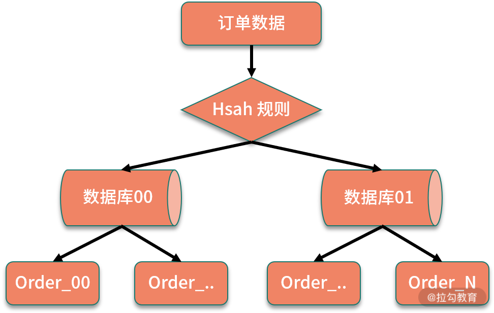
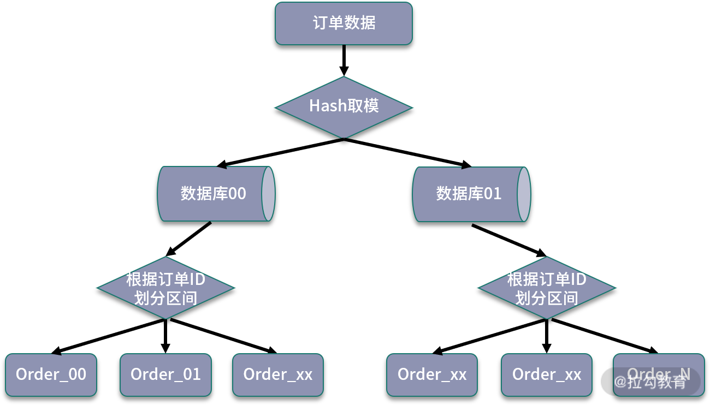

# 26 分库分表以后，如何实现扩容？

在实际开发中，数据库的扩容和不同的分库分表规则直接相关，今天我们从系统设计的角度，抽象了一个项目开发中出现的业务场景，从数据库设计、路由规则，以及数据迁移方案的角度进行讨论。

### 从业务场景出发进行讨论

假设这样一个业务场景，现在要设计电商网站的订单数据库模块，经过对业务增长的估算，预估三年后，数据规模可能达到 6000 万，每日订单数会超过 10 万。

首先选择 **存储实现**，订单作为电商业务的核心数据，应该尽量避免数据丢失，并且对数据一致性有强要求，肯定是选择支持事务的关系型数据库，比如使用 MySQL 及 InnoDB 存储引擎。

然后是 **数据库的高可用**，订单数据是典型读多写少的数据，不仅要面向消费者端的读请求，内部也有很多上下游关联的业务模块在调用，针对订单进行数据查询的调用量会非常大。基于这一点，我们在业务中配置基于主从复制的读写分离，并且设置多个从库，提高数据安全。

最后是 **数据规模**，6000 万的数据量，显然超出了单表的承受范围，参考《阿里巴巴 Java 开发手册》中「单表行数超过 500 万行」进行分表的建议，此时需要考虑进行分库分表，那么如何设计路由规则和拆分方案呢？接下来会对此展开讨论。

### 路由规则与扩容方案

现在我们考虑 3 种路由规则：对主键进行哈希取模、基于数据范围进行路由、结合哈希和数据范围的分库分表规则。

#### 1. 哈希取模的方式

哈希取模是分库分表中最常见的一种方案，也就是根据不同的业务主键输入，对数据库进行取模，得到插入数据的位置。

6000 万的数据规模，我们按照单表承载百万数量级来拆分，拆分成 64 张表，进一步可以把 64 张表拆分到两个数据库中，每个库中配置 32 张表。当新订单创建时，首先生成订单 ID，对数据库个数取模，计算对应访问的数据库；接下来对数据表取模，计算路由到的数据表，当处理查询操作时，也通过同样的规则处理，这样就实现了通过订单 ID 定位到具体数据表。

 规则示意图

通过哈希取模的方式进行路由，优点是数据拆分比较均匀，但缺点是不利于后面的扩容。假设我们的订单增长速度超出预估，数据规模很快达到了几亿的数量级，原先的数据表已经不满足性能要求，数据库需要继续进行拆分。

数据库拆分以后，订单库和表的数量都需要调整，路由规则也需要调整，为了适配新的分库分表规则，保证数据的读写正常，不可避免地要进行数据迁移，具体的操作，可以分为 **停机迁移** 和 **不停机迁移** 两种方式。

- 停机迁移

停机迁移的方式比较简单，比如我们在使用一些网站或者应用时，经常会收到某段时间内暂停服务的通知，一般是在这段时间内，完成数据迁移，将历史数据按照新的规则重新分配到新的存储中，然后切换服务。

- 不停机迁移

不停机迁移也就是常说的动态扩容，依赖业务上的双写操作实现，需要同时处理存量和增量数据，并且做好各种数据校验。

一般来说，具体的数据库扩容方式有基于原有存储增加节点，以及重新部署一套新的数据库两种策略，针对不同的扩容方式，需要不同的迁移方案和双写策略支持。

如果重新部署新的数据库存储，可以粗略地分为以下的步骤：

- 创建一套新的订单数据库；
- 在某个时间点上，将历史数据按照新的路由规则分配到新的数据库中；
- 在旧数据库的操作中开启双写，同时写入到两个数据库；
- 用新的读写服务逐步替代旧服务，同步进行数据不一致校验，最后完成全面切流。

这是一个非常简化的流程，实际开发中要处理的细节有很多，感兴趣的同学可以去了解下数据迁移的 ETL 等标准化流程。

#### 2. 基于数据范围进行拆分

基于数据范围进行路由，通常是根据特定的字段进行划分不同区间，对订单表进行拆分中，如果基于数据范围路由，可以按照订单 ID 进行范围的划分。

同样是拆分成 64 张数据表，可以把订单 ID 在 3000万 以下的数据划分到第一个订单库，3000 万以上的数据划分到第二个订单库，在每个数据库中，继续按照每张表 100万 的范围进行划分。

 规则示意图

可以看到，基于数据范围进行路由的规则，当进行扩容时，可以直接增加新的存储，将新生成的数据区间映射到新添加的存储节点中，不需要进行节点之间的调整，也不需要迁移历史数据。

但是这种方式的缺点就是数据访问不均匀。如果按照这种规则，另外一个数据库在很长一段时间内都得不到应用，导致数据节点负荷不均，在极端情况下，当前热点库可能出现性能瓶颈，无法发挥分库分表带来的性能优势。

#### 3. 结合数据范围和哈希取模

现在考虑，如果结合以上两种方式数据范围和哈希取模，那么是不是可以实现数据均匀分布，也可以更好地进行扩容？

我们设计这样的一个路由规则，首先对订单 ID 进行哈希取模，然后对取模后的数据再次进行范围分区。

 订单数据库进一步拆分

可以看到，通过哈希取模结合数据区间的方式，可以比较好地平衡两种路由方案的优缺点。当数据写入时，首先通过一次取模，计算出一个数据库，然后使用订单 ID 的范围，进行二次计算，将数据分散到不同的数据表中。

这种方式避免了单纯基于数据范围可能出现的热点存储，并且在后期扩展时，可以直接增加对应的扩展表，避免了复杂的数据迁移工作。

上面我们通过一个业务场景设计，思考了分库分表下的几种路由规则和扩容方案，这是一个开放性问题，思路要比方案更重要，而实际业务也要比这个复杂得多，你可以结合项目实践，思考在你负责的模块中，是如何设计路由规则，以及可以如何进行数据扩容的。

### 总结

这一课时从一个真实业务场景的设计出发，分享了分库分表不同路由规则的设计，对应的优缺点，以及对扩容方式的影响。

今天的问题如果出现在面试中，可以认为是一个典型的系统设计类问题，那么回答系统设计类问题，有哪些要注意的点呢？

首先，系统设计类问题出现在面试中，很重要的一方面是考察沟通，要和面试官确认整体的数据规模，输入和输出，明确系统设计的边界，比如数据规模不同，直接影响数据库表的设计方式。

其次，是找到主要问题，理解系统的瓶颈，然后就可以应用各种系统设计的技巧，进行各个业务层的设计。
