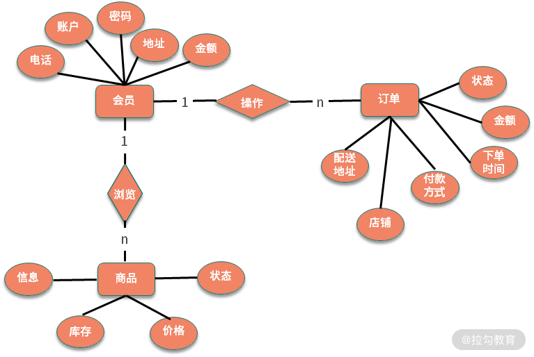

# 27 NoSQL 数据库有哪些典型应用？

前面的内容介绍了数据库读写分离和分库分表相关知识，都是针对关系型数据库的，即通常说的 RDBMS。除了关系型数据库，NoSQL 在项目开发中也有着越来越重要的作用，与此同时，NoSQL 相关的内容也是面试的常客。今天我们一起来看下 NoSQL 数据库有哪些应用。

### 对比关系型数据库

在介绍 NoSQL 数据库之前，先回顾下关系型数据库。还记得 SQL 语言的全称吗？Structured Query Language，也就是结构化查询语言，结构化查询对应的存储实现是关系型数据库，我们熟悉的 MySQL、Oracle 和 SQL Server，都是关系型数据库的代表。

关系型数据库通过关系模型来组织数据，在关系型数据库当中一个表就是一个模型，一个关系数据库可以包含多个表，不同数据表之间的联系反映了关系约束。

不知道你是否应用过 ER 图？在早期的软件工程中，数据表的创建都会通过 ER 图来定义，ER 图（Entity Relationship Diagram）称为 **实体-联系图** ，包括实体、属性和关系三个核心部分。

下面是在电商领域中，一个简化的会员、商品和订单的 ER 图：

 简化版的会员、商品和订单 ER 图

ER图中的实体采用矩形表示，即数据模型中的数据对象，例如电商业务模型中的会员、商品、订单等，每个数据对象具有不同的属性，比如会员有账户名、电话、地址等，商品有商品名称、价格、库存等属性。不同的数据对象之间又对应不同的关系，比如会员购买商品、创建订单。

有了 ER 图等的辅助设计，关系型数据库的数据模型可以非常好的描述物理世界，比较方便地创建各种数据约束。

另外一方面，关系型数据库对事务支持较好，支持 SQL 规范中的各种复杂查询，比如 join、union 等操作。正是由于对 SQL 规范的支持，也使得关系型数据库对扩展不友好，比较难进行分布式下的集群部署。

### NoSQL 数据库特性

NoSQL 数据库是在 SQL 的基础上发展的，对 NoSQL 的具体解释，你可以认为是 Not Only SQL，也可以认为是 Non-Relational SQL。

NoSQL 对应非关系型数据库，不同于传统的关系型数据库，如果说关系型数据库是武侠小说中的正统功夫，NoSQL 数据库就是野路子，少了很多约束，也就不拘一格、自成一派。那么对比关系型数据库，NoSQL 型数据库有哪些优点呢？

- **良好的扩展性，容易通过集群部署**

关系型数据库在进行扩展时，要考虑到如何分库分表、扩容等，各种实现方案都比较重，对业务侵入较大。NoSQL 数据库去掉了关系型数据库的关系特性，天生对集群友好，这样就非常容易扩展。

- **读写性能高，支持大数据量**

关系型数据库对一致性的要求较高，数据表的结构复杂，读写的性能要低于非关系型数据库。另外一方面，部分 NoSQL 数据库采用全内存实现，更适合一些高并发的访问场景。

- **不限制表结构，灵活的数据模型**

应用关系型数据库，需要通过 DML 语句创建表结构，数据表创建以后，增删字段需要重新修改表结构。如果使用 NoSQL，一般不需要事先为数据建立存储结构和字段，可以存储各种自定义的数据。

NoSQL 数据库有这么多优点，但是在项目开发中，关系型数据库和非关系型数据库不是对立的，而是相辅相成的。从性能的角度来讲，NoSQL 数据库的性能优于关系型数据库，从持久化角度，关系型数据库优于 NoSQL 数据库。

专栏最开始提到了 CAP 理论，从 CAP 的角度，NoSQL 数据库一般提供弱一致性的保证，实现最终一致性，也就是关系型数据库强调 CP 模型，而 NoSQL 关注的是 AP 模型，同时应用 NoSQL 和关系型数据库，可以满足高性能的基础上，同时保证数据可靠性。

### NoSQL 数据库应用

非关系型数据库有很多类型，应用的侧重点也不同，可以从以下几个角度进行分类。

#### Key-Value 数据库

Key-Value 存储就是我们熟悉的 Map 结构，支持高性能的通过 Key 定位和存储。通常用来实现缓存等应用，典型的有 Redis 和 Memcached。

以 Redis 为例，作为应用最多的非关系型数据库之一，Redis 可以说是日常工作中的一把瑞士军刀。

从性能的角度，为了提高读写效率，Redis 在最开始的版本中一直使用单线程模型，避免上下文切换和线程竞争资源，并且采用了 IO 多路复用的技术，提升了性能，另外在最近的版本更新中，Redis也开始支持多线程处理，感兴趣的同学可以查看相关的资料了解。

从存储结构的角度，Redis 支持多种数据结构，得益于这些，Redis 有丰富的应用场景，并且针对不同的数据规模等，Redis 采取多种内存优化方式，尽量减少内存占用。比如，List 结构内部有压缩列表和双向链表两种实现，在数据规模较小时采用 ZipList 实现，特别是在新的版本更新中，又添加了 QuickList 的实现，减少内存的消耗。

从高可用的角度，作为一个内存数据库，Redis实现了AOF和RDB的数据持久化机制，另外，Redis支持了多种集群方式，包括主从同步，Sentinel和Redis Cluster等机制，提高了整体的数据安全和高可用保障。

#### 文档型数据库

文档型数据库可以存储结构化的文档，比如 JSON 或者 XML，从这个角度上看，文档型数据库比较接近关系型数据库。但是对比关系型数据库，文档性数据库中不需要预先定义表结构，并且可以支持文档之间的嵌套，典型的比如 MongoDB，这一点和关系型数据库有很大的不同。

以 MongoDB 为例，采用了基于 JSON 扩展的 BSON 存储结构，可以进行自我描述，这种灵活的文档类型，特别适合应用在内容管理系统等业务中。MongoDB 还具备非常优秀的扩展能力，对分片等集群部署的支持非常全面，可以快速扩展集群规模。

#### 列存储数据库

列式数据库被用来存储海量数据，比如 Cassandra、HBase 等，特点是大数据量下读写速度较快、可扩展性强，更容易进行分布式部署。

以 HBase 为例，HBase 支持海量数据的读写，特别是写入操作，可以支持 TB 级的数据量。列式数据库通常不支持事务和各种索引优化，比如 HBase 使用 LSM 树组织数据，对比 MySQL 的 B+ 树，在高并发写入时有更好的性能。

#### 图形数据库

在一些特定的应用场景可以应用特殊的数据库，比如图形数据库。在学习数据结构时我们知道，社交网络中的用户关系可以使用图来存储，于是诞生了一些图形数据库，可以方便地操作图结构的相关算法，比如最短路径、关系查找等。

图形数据库在一般的工程开发中应用较少，感兴趣的同学可以去了解一下。

### 总结

这一课时分享了 NoSQL 数据库相关的知识点，包括关系型数据库和非关系型数据库的对比，分析了常见 NoSQL 数据库的分类和应用特性。

大多数场景下，NoSQL 数据库是配合关系型数据库一起使用的，这就涉及了不同存储之间的同步问题，比如缓存和数据库的同步等，针对这个问题，会在缓存模块展开介绍。现在你可以结合自己的项目实践，思考下应用过哪些非关系型数据库，以及使用了哪些对应特性，如何配合关系型数据库等，欢迎留言分享。
