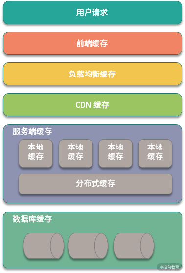

# 38 不止业务缓存，分布式系统中还有哪些缓存？

缓存是分布式系统开发中的常见技术，在分布式系统中的缓存，不止 Redis、Memcached 等后端存储；在前端页面、浏览器、网络 CDN 中也都有缓存的身影。

### 缓存有哪些分类

如果你是做业务开发的话，提起缓存首先想到的应该是应用 Redis，或者 Memcached 等服务端缓存，其实这些在缓存分类中只是一小部分。然而在整个业务流程中，从前端 Web 请求，到网络传输，再到服务端和数据库服务，各个阶段都有缓存的应用。

以电商业务场景为例，如果你打开淘宝或者京东，查看一个商品详情页，这个过程就涉及多种缓存的协同，我们从页面入口开始梳理一下，如下图所示。

### 前端缓存

前端缓存包括页面和浏览器缓存，如果你使用的是 App，那么在 App 端也会有缓存。当你打开商品详情页，除了首次打开以外，后面重复刷新时，页面上加载的信息来自多种缓存。

页面缓存属于客户端缓存的一种，在第一次访问时，页面缓存将浏览器渲染的页面存储在本地，当用户再次访问相同的页面时，可以不发送网络连接，直接展示缓存的内容，以提升整体性能。

HTML5 支持了本地存储，本地存储包括 localStorage 和 sessionStorage，其中 localStorage 没有时间限制，在同一个浏览器中，只要没被手动清理，数据会一直可用，sessionStorage 则和 session 的有效期内相关，关闭浏览器页面后缓存会被清空。

除了本地存储，HTML5 还支持离线缓存，也就是 Application Cache 技术，该技术可以实现应用离线的缓存，在暂时断网离线后仍然可以访问页面。

Application Cache 是基于 manifest 文件实现的缓存机制，浏览器会通过这个文件上的清单解析存储资源，感兴趣的同学可以去了解下实现细节。

页面缓存一般用于数据更新比较少的数据，不会频繁修改。除了页面缓存，大部分浏览器自身都会实现缓存功能，比如查看某个商品信息，我如果要回到之前的列表页，点击后退功能，就会应用到浏览器缓存；另外对于页面中的图片和视频等，浏览器都会进行缓存，方便下次查看。

前端缓存还有 App 内的缓存，由于 App 是一个单独的应用，各级缓存会更加复杂，在 Android 和 iOS 开发中也有区别，除非是做客户端开发的同学，不需要了解具体的细节。我们只需要知道客户端缓存是非常重要的优化手段，在开发中注意避免可能导致的问题就可以。

### 网络传输缓存

大多数业务请求都是通过 HTTP/HTTPS 协议实现的，它们工作在 TCP 协议之上，多次握手以后，浏览器和服务器建立 TCP 连接，然后进行数据传输，在传输过程中，会涉及多层缓存，比如 CDN 缓存等。

网络中缓存包括 CDN 缓存，CDN（Content Delivery Network，内容分发网络）实现的关键包括 **内容存储** 和 **内容分发** ，内容存储就是对数据的缓存功能，内容分发则是 CDN 节点支持的负载均衡。

前端请求在经过 DNS 之后，首先会被指向网络中最近的 CDN 节点，该节点从真正的应用服务器获取资源返回给前端，同时将静态信息缓存。在新的请求过来以后，就可以只请求 CDN 节点的数据，同时 CDN 节点也可以和服务器之间同步更新数据。

网络缓存还包括 **负载均衡中的缓存** ，负载均衡服务器主要实现的是请求路由，也就是负载均衡功能；也可以实现部分数据的缓存，比如一些配置信息等很少修改的数据。

目前业务开发中大部分负载均衡都是通过 Nginx 实现的，用户请求在达到应用服务器之前，会先访问 Nginx 负载均衡器。如果发现有缓存信息，则直接返回给用户，如果没有发现缓存信息，那么 Nginx 会 回源 到应用服务器获取信息。

### 服务端缓存

前端请求经过负载均衡落到 Web 服务器之后，就进入服务端缓存，服务端缓存是缓存的重点，也是业务开发平时打交道最多的缓存。它还可以进一步分为 **本地缓存** 和 **外部缓存** 。

本地缓存也可以叫作 **应用内缓存** ，比如 Guava 实现的各级缓存，或者 Java 语言中使用各类 Map 结构实现的数据存储，都属于本地缓存的范畴。应用内缓存的特点是随着服务重启后失效，作用时间很短，好处是应用比较灵活。

外部缓存就是我们平常应用的 Redis、Memchaed 等 NoSQL 存储的分布式缓存，它也是在系统设计中对整体性能提升最大的缓存。但如果外部缓存使用不当，则会导致缓存穿透、缓存雪崩等业务问题，关于如何处理这类问题，我们将在下一课时进行分析。

### 数据库缓存

经过服务端缓存以后，数据其实并不是直接请求数据库持久层，在数据库层面，也可以有多级缓存。

在 Java 开发中，我们一般使用 MyBatis 或者 Hibernate 作为数据库访问的持久化层，这两个组件中都支持缓存的应用。

以 MyBatis 为例，MyBatis 为每个 SqlSession 都创建了 LocalCache，LocalCache 可以实现查询请求的缓存， 如果查询语句命中了 缓存 ， 返回给用户，否则查询数据库， 并且 写入 LocalCache， 返回结果给用户。不过在实际开发中，数据库持久层的缓存非常容易出现数据不一致的情况，所以一般不推荐使用。

另外，大家熟悉的数据库服务器也实现了自身的缓存层，比如 MySQL 服务器支持的查询缓存。

在数据库执行查询语句时，MySQL 会保存一个 Key-Value 的形式缓存在内存中，其中 Key 是查询语句，Value 是结果集。如果缓存 Key 被命中，则会直接返回给客户端，否则会通过数据库引擎 进行 查询，并且把结果缓存起来，方便下一次调用。虽然 MySQL 支持缓存，但是由于需要保证一致性，当数据有修改时，需要删除缓存。如果是某些更新特别频繁的数据，缓存的有效时间非常短，带来的优化效果并不明显。

### 总结

这一课时讲解了分布式系统设计中的缓存应用，包括前端缓存、网络缓存、服务端缓存，以及数据库缓存。

缓存是一种通用的优化思路，伴随着计算机技术发展至今，在大学的操作系统专业课中，就讲过计算机操作系统设计的多种缓存，比如 Page Cache、Buffer Cache 等技术。你可以思考下，除了上面课时内容中的几种缓存，分布式系统还有哪些环节也用到了缓存技术，欢迎留言分享。
