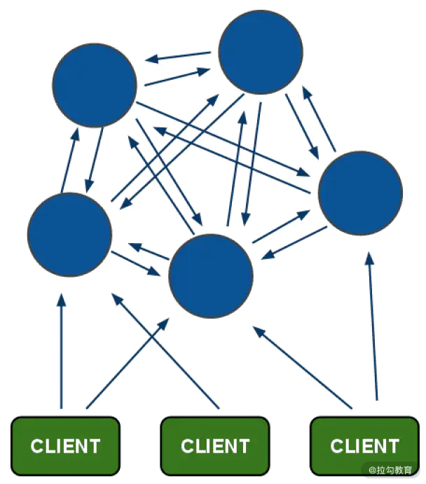
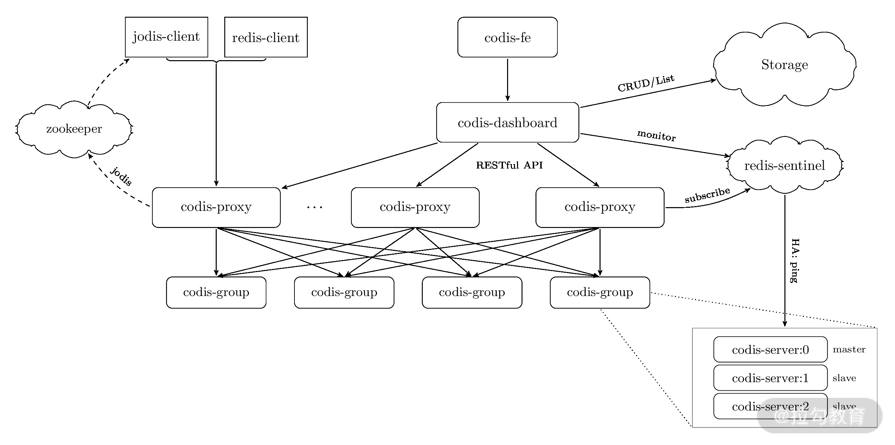

# 43 缓存高可用：缓存如何保证高可用？

上一课时提到了缓存集群的负载均衡策略，保证缓存服务的高可用，集群策略是最常用的，这一课时，我们以 Redis 为例，分析一下单点缓存如何扩展到集群，以及集群部署的几种常见模式。

### Redis 的主从复制

集群实现依靠副本，而副本技术有个非常关键的一点，那就是各个副本之间的快速数据同步，也就是我们常说的主从复制。

主从复制技术在关系型数据库、缓存等各类存储节点中都有比较广泛的应用。Redis 的主从复制，可以将一台服务器的数据复制到其他节点，在 Redis 中，任何节点都可以成为主节点，通过 Slaveof 命令可以开启复制。

主从复制一方面可以作为数据备份，通过实现主从节点之间的最终数据一致性，保证数据尽量不丢失。除了数据备份，从节点还可以扩展主节点的读请求支持能力，实现读写分离，主节点作为写节点，从节点支持读请求。当主节点的系统水位不能承担前台业务请求并发量时，可以将请求路由到从节点，实现集群内的动态均衡。

有了主从复制，现在请你思考一个问题，Redis 的主从复制如何选举呢？

我们先来了解下 MySQL 的选主，也就是故障转移机制，和主从机器之间的数据同步方式有很大关系，同步方式包括半同步、全同步，关于 GTID 的复制等方式，MySQL 缺少一个选举决策的节点，一般是人工干预选主流程，感兴趣的同学可以查阅相关资料了解一下。

我们再来看一下 Redis 的主从配置，正常情况下，当主节点发生故障宕机，需要运维工程师手动从从节点服务器列表中，选择一个晋升为主节点，并且需要更新上游客户端的配置，这种方式显然是非常原始的，我们希望有一个机制，可以自动实现 Failover，也就是 **自动故障转移** 。

在 Redis 集群中，依赖 Sentinel，就可以实现上面的需求。

### Redis Sentinel——Redis 哨兵

Redis Sentinel 就是我们常说的 Redis 哨兵机制，也是官方推荐的高可用解决方案，上面我们提到的主从复制场景，就可以依赖 Sentinel 进行集群监控。

Redis-Sentinel 是一个独立运行的进程，假如主节点宕机，它还可以进行主从之间的切换。主要实现了以下的功能：

- 不定期监控 Redis 服务运行状态
- 发现 Redis 节点宕机，可以通知上游的客户端进行调整
- 当发现 Master 节点不可用时，可以选择一个 Slave 节点，作为新的 Master 机器，并且更新集群中的数据同步关系

现在思考一个场景，我们使用 Sentinel 来管理 Redis 集群高可用，假如 Sentinel 宕机，那么整个系统还可以按照预期的方式运行吗？

答案是否定的，很明显，Sentinel 也存在单点问题，如果 Sentinel 宕机，高可用也就无法实现了，所以，Sentinel 必须支持集群部署。

实际上，Redis Sentine 方案是一个包含了多个 Sentinel 节点，以及多个数据节点的分布式架构。除了监控 Redis 数据节点的运行状态，Sentinel 节点之间还会互相监控，当发现某个 Redis 数据节点不可达时，Sentinel 会对这个节点做下线处理，如果是 Master 节点，会通过投票选择是否下线 Master 节点，完成故障发现和故障转移。

Sentinel 在操作故障节点的上下线时，还会通知上游的业务方，整个过程不需要人工干预，可以自动执行。

### Redis Cluster 集群

Redis Cluster 是官方的集群方案，是一种无中心的架构，可以整体对外提供服务。

为什么是无中心呢？因为在 Redis Cluster 集群中，所有 Redis 节点都可以对外提供服务，包括路由分片、负载信息、节点状态维护等所有功能都在 Redis Cluster 中实现。

Redis 各实例间通过 Gossip 通信，这样设计的好处是架构清晰、依赖组件少，方便横向扩展，有资料介绍 Redis Cluster 集群可以扩展到 1000 个以上的节点。

Redis Cluster 另外一个好处是客户端直接连接服务器，避免了各种 Proxy 中的性能损耗，可以最大限度的保证读写性能。

除了 Redis Cluster，另外一个应用比较多的是 Codis 方案，Codis 是国内开源的一个 Redis 集群方案，其作者是个大牛，也是一位技术创业者，不知道你有没有听过最近几年比较火的分布式关系型数据库 TiDB，就来自于作者的公司 PingCAP。

Codis 的实现和 Redis Cluster 不同，是一个“中心化的结构”，同时添加了 Codis Proxy 和 Codis Manager。Codis 设计中，是在 Proxy 中实现路由、数据分片等逻辑，Redis 集群作为底层的存储引擎，另外通过 ZooKeeper 维护节点状态，可以参考下面这张 Codis 的官方架构图：

之所以提到 Codis，是因为 Codis 和官方的 Redis Cluster 实现思路截然不同，使用 Redis Cluster 方式，数据不经过 Proxy 层，直接访问到对应的节点。

Codis 和 Redis Cluster 的集群细节比较复杂，这里不展开讨论，只要简单了解即可，你也可以在课后分别去官网深入了解。就我自己而言，Codis 的监控和数据迁移更加简便，感觉 Codis 的设计更加合理，不过也是见仁见智，欢迎分享你的思考。

Redis Cluster 划分了 16384 个槽位，每个节点负责其中的一部分数据，都会存储槽位的信息，当客户端链接时，会获得槽位信息。如果需要访问某个具体的数据 Key，就可以根据本地的槽位来确定需要连接的节点。

关于 Redis Cluster 为什么是 16384 个槽位，网上也有很多讨论，Redis 的作者也给出了他的思考， [感兴趣的可点击这里查看](https://github.com/antirez/redis/issues/2576)。

### 总结

这一课时和你分享了 Redis 集群高可用的几种配置方式，包括主从复制、Redis 的哨兵机制，简单介绍了 Redis Cluster 和 Codis 的集群方式。

Redis 高可用集群也经历了一个发展过程，从早期社区中 Twitter 开源的 Proxy 方案，到现在官方的 Redis Cluster 集群方案，中间还有很多公司或者组织贡献了开源方案，比如开源的 Codis、阿里云的 Redis Labs 等。

在我的工作中，一直是应用 Twitter 的代理方案，后面就是公司内部开发的一些中间件，在你的工作中应用了哪些集群方案呢？欢迎留言进行分享。
