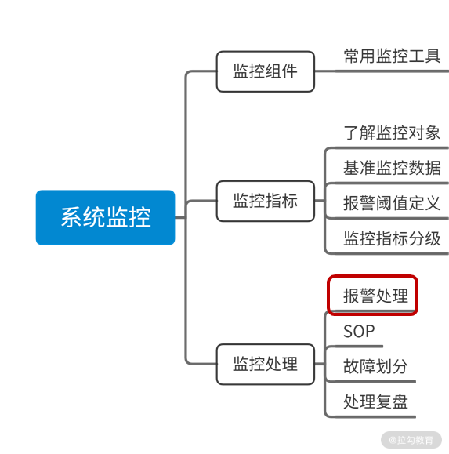

# 49 线上服务有哪些稳定性指标？

在分布式高可用设计中，系统监控非常重要，系统监控做好了，可以提前对异常情况进行报警，避免很多线上故障的产生。系统监控做得好不好，也是评价一家互联网公司基础建设水平的重要标准，今天一起来讨论一下，线上服务都有哪些监控指标，又应该如何展开呢？

### 系统监控的重要性

我的一个朋友是做底层开发工作的，包括内部数据库和微服务的中间件，前不久入职了一家互联网创业公司，这家公司虽然成立不久，但是业务发展很快。最近这几天他和我吐槽，公司的系统监控做得很差，线上经常有各种故障，不得不经常救火，工作非常疲惫。

听了这位朋友的感受，不知道你是否也有过类似的经历，系统监控等稳定性工作，看似离业务开发有点远，但其实是非常重要的，系统监控做得不好，开发人员需要花很多的时间去定位问题，而且很容易出现比较大的系统故障，所以越是在大公司里，对监控的重视程度就越高。

各种监控指标可以帮助我们了解服务运行水平，提前发现线上问题，避免小故障因为处理不及时，变成大故障，从而解放工程师的人力，我在之前的工作中，曾经专门做过一段时间的稳定性工作，现在把自己的一些经验分享给你。

在实际操作中，系统监控可以分为三个方面，分别是监控组件、监控指标、监控处理，在这一课时呢，我先和大家一起梳理下监控指标相关的知识，在接下来的第 44 课时，我将分享常用的监控组件，以及监控报警处理制度。

### 稳定性指标有哪些

稳定性指标，这里我按照自己的习惯，把它分为服务器指标、系统运行指标、基础组件指标和业务运行时指标。

每个分类下面我选择了部分比较有代表性的监控项，如果你还希望了解更多的监控指标，可以参考 Open-Falcon 的监控采集，地址为 [Linux 运维基础采集项](https://book.open-falcon.org/zh/faq/linux-metrics.html)。

#### 服务器监控指标

服务器指标主要关注的是虚拟机或者 Docker 环境的运行时状态，包括 CPU 繁忙程度、磁盘挂载、内存利用率等指标。

服务器是服务运行的宿主环境，如果宿主环境出问题，我们的服务很难保持稳定性，所以服务器监控是非常重要的。常见的服务器报警包括 CPU 利用率飙升、磁盘空间容量不足、内存打满等。

**监控项**  **指标描述** CPU 空闲时间

除硬盘 IO 等待时间以外其他等待时间，这个值越大，表示 CPU 越空闲

CPU 繁忙程度

和 CPU 空闲时间相反

CPU 负载

CPU 负载（如果是 Docker，此指标收集物理机的 load）和 CPU 利用率监控

CPU 的 iowait

在一个采样周期内有百分之几的时间属于以下情况：CPU 空闲且有仍未完成的 I/O 请求

CPU 的 system

CPU 用于运行内核态进程的时间比例

CPU 的 user

CPU 用于运行用户态进程的时间比例

load1

表示最近 1 分钟内运行队列中的平均进程数量

load3

表示最近 5 分钟内运行队列中的平均进程数量

load15

表示最近 15 分钟内运行队列中的平均进程数量（在 falcon 系统里）

磁盘使用情况

磁盘使用情况，磁盘已用，未使用容量

服务器的指标，在实际配置中，需要根据服务器核心数不同，以及不同的业务特点配置不同的指标策略。比如，如果是一个日志型应用，需要大量的磁盘资源，就要把磁盘报警的阈值调低。

#### 系统运行指标

系统指标主要监控服务运行时状态、JVM 指标等，这些监控项都可以在 Open-Falcon 等组件中找到，比如 JVM 的 block 线程数，具体在 Falcon 中指标是 jvm.thread.blocked.count。下面我只是列举了部分监控指标，具体的你可以根据自己工作中应用的监控组件来进行取舍。 **监控项**  **指标描述**  **说明** JVM 线程数

线程总数量

关注整体线程运行情况

JVM 阶段线程增长

累计启动线程数量

线程应该尽量复用，因此不宜持续创建新线程

JVM 死锁

死锁个数

线程死锁，一般都不能忍受

JVM 的 block 线程数

blocked 状态的线程数

blocked 状态的线程过多，说明程序遭遇剧烈的锁竞争

GC 的次数

GC 的次数

垃圾回收的这几个指标，通常会综合来看，在进行调优时非常重要

GC 时间

GC 的时间

年轻代 GC

年轻代 GC 的次数

老年代 GC 次数

年老代 GC 的次数

老年代 GC 时间

年老代 GC 的时间

#### 基础组件指标

在基础组件这里，主要包括对数据库、缓存、消息队列的监控，下面我以数据库为例进行描述，虽然各个中间件对数据库监控的侧重点不同，但是基本都会包括以下的监控项。如果你对这部分指标感兴趣，我建议你咨询一下公司里的 DBA 了解更多的细节。 **监控项**  **指标描述**

写入 QPS

数据库写入 QPS

数据库查询 QPS

查询 QPS

数据库的死锁

死锁处理不及时可能导致业务大量超时

数据库慢查询 QPS

慢查询 QPS

数据库的活跃连接数

数据库的活跃连接数

数据库的总连接数

数据库的总连接数

数据库 Buffer Pool 命中率

可能引起数据库服务抖动，业务系统不稳定

在进行数据库优化时要综合这部分指标，根据具体业务进行配置。

#### 业务运行时指标

业务运行时指标和上面其他分类的指标是不同的，需要根据不同的业务场景来配置。

举个例子，你现在开发的是一个用户评论系统，那么就需要关注每天用户评论的请求数量、成功率、评论耗时等。业务指标的配置，需要结合各类监控组件，在指标的选择上，通常需要结合上下游各个链路，和产品设计、运营同学一起对齐，明确哪些是核心链路，并且进行指标的分级。

### 总结

这一课时讨论了系统监控的重要性，以及系统监控指标的分类，常见的监控指标及其含义。

对稳定性指标的了解，看起来是系统运维负责的工作，但实际上对开发同学也同样重要，打个比方，系统监控指标好像就是医院里体检时的各项化验数据，只有全面了解这些数据，才能更好地明确身体健康情况。

在你的工作中，是如何对稳定性监控指标进行配置的，在配置告警阈值时考虑了哪些因素，应用了哪些监控组件呢？欢迎留言进行分享。
