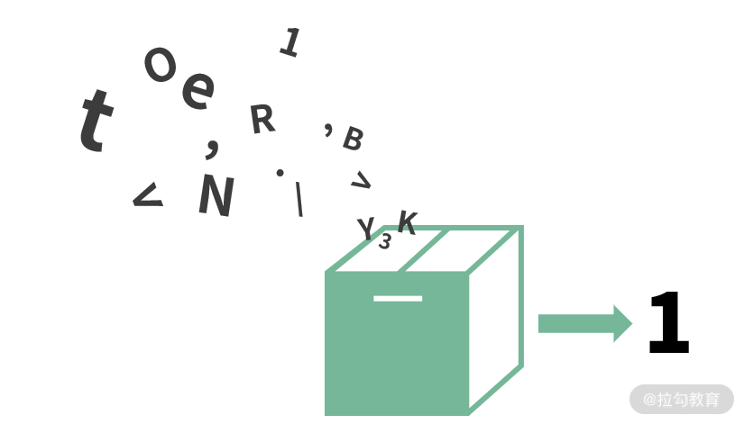

# 13 告警质量：如何更好地创建告警规则和质量？

上一节我向你介绍了告警的目的、数据来源和故障的分类。对告警的来源有一个完整的了解，可以帮助你更好地将它们分门别类，针对性地进行处理。在这一节，我将带你了解如何有针对性地处理，即怎样构建出更适合你的告警规则和如何保证告警质量。

### 告警与指标

你是否还记得我在上一节讲的告警数据来源，在真实的场景下，我们通常会将它们聚合成为一个个指标，通过数字化、可量化的形式统一处理，这样的处理方式有 2 个好处。

**其一是简化数据** 。将告警的数据聚合成指标后，我们不再需要关心数据的内容，通过指标表现出来的数字即可进行告警。比如在查看异常日志时，如果根据日志文本确认内容后再进行告警，就会相对来说复杂一些，因为此时还需要解析日志。不同的数据源会有不同的数据内容，如果告警前需要理解日志的每行文本，告警的成本也会增加。 **其二是易于告警** 。指标可以统一需要告警的资源数据的格式，告警时的规则也更加规范，易于去管理。格式统一后，既不会再因为格式的问题浪费时间，也可以在跨团队沟通时提高沟通的效率。

通过数字可量化的形式，无论你的数据源来自哪里，都可以及时、有效地告警。以白盒中的 3 个来源为例，你可以通过以下的几种形式来构建。 **首先是日志。** 在日志中，我们通常是按照 2 种方法统计数据。

1. **等级区分计数** ： **按照不同的日志等级分别计数** 。比如通过统计 error 级别日志的数量，来了解当前系统中有多少已经存在的错误信息。
2. **具体规则匹配计数** ： **按照具体的匹配规则统计日志中指定信息的数量** 。比如可以将访问日志中的访问路径，按照指定 URL 来获取其执行的次数；或者是在支付场景中，统计支付成功的次数。这种情况通常用于一些无法统计业务指标的特殊场景。 **其次是统计指标** 。这里不用多说，我们所要做的就是将数据聚合成统计指标。 **最后是链路追踪。** 在链路中，可以按照具体 Span 中的数据分析出更详细的指标，比如依据 Span 名称来统计调用次数，或是根据这个 Span 中的具体标签信息来做更细维度的指标分析。

### 告警规则与设定

上面我介绍了告警一般的处理方式，下面我会讲一下告警规则一般是如何计算的，我们又应该怎样设定告警规则。

#### 指标数据存储

在讲解规则的设定之前，我会先介绍一些目前互联网中比较通用的指标存储方式，这可以帮助你更好地理解后面的内容。

我们一般会将指标数据存储在时序数据库中，比如常见的 Prometheus（在最后的实践篇我会做专门的讲解）、OpenTSDB。 **这类数据库基本都是以时间作为维度进行数据索引的** 。数据库主要由以下 3 个部分构成。

1. **时间点** ：信息被记录的时间，每条记录都会有一个具体的时间戳。
2. **主体** ：对数据内容打标签，类似于在 Span 中增加自定义数据。 **键值对可以方便我们标记数据，确认是什么数据内容产生了值** 。
3. **测量值** ：上面 2 点内容最终会对应到一个值上去，这个值也是我们后面在进行阈值设置和告警判断时的关键。

我们可以通过这 3 个部分检索指标数据。同时，时序数据库也具有和传统数据库一样的表的概念，方便我们针对不同的指标来进行相互数据隔离。通过这 3 个指标，你就可以聚合出任意数据。

例如，在 9 月 11 日的 14：15 和 14：56 分别出现了一次 HTTP 返回状态码为 500 的错误，我们就可以认定为有 2 条记录，时间戳分别是 9 月 11 日 14：15 和 9 月 11 日 14：56，主体是 HTTP 的状态码 500。它们的测量值分别是 1 和 1。当然，主体部分有可能会有其他的一些内容，比如请求的 URL、接口属于哪个服务、主机部署于哪个机房。

#### 指标数据计算

通过时序数据库的存储，你就可以结合一些特定的查询方式来聚合结果，从而得到我们的指标数据。时序数据库的聚合方式就是通过主体数据检索，筛选出相对应的数据集，最终利用一些指标函数的计算，得出我们的指标数值。

以上文的数据内容为例，我想统计出 9 月 11 日 14：00~15：00，HTTP 状态码为 500 的次数，就可以检索 9 月 11 日 14：00~15：00 的数据，再选择主体“HTTP 状态码为 500”，最后取得 2 条测量值为 1 的记录。然后通过求和函数计算，我们得到的结果为 2。

假设我们认定 1 个小时内只要超过 1 就认定需要报警。那么，当我们获取结果 2 后，根据配置的规则，就需要告警。

这样的计算方式，能让你以一个类似于"SQL"的查询语句，轻松聚合出你想要的数据。这种方式有 2 个优势。

1. **只关心告警规则** ：你只需要制定好你的告警条件，无须关心是怎么得出数据的。这可以最大程度上简化你获取告警信息时的依赖，不需要你去关心怎样计算数据，怎样聚合内容。
2. **告警时只与阈值有关** ：在规则中配置阈值时，只需要配置一个时间段内出现多少次数就可以了，不需要过多理解业务处理流程。并且在告警时，只需要更改这个值的大小即可，更好的帮助业务人员去操作。

通过这 2 点，我们再来考虑一个复杂的场景。我设定某一段时间内至少出现了 2 次符合阈值的条件才会进行告警。

还是以 HTTP 状态码 500 为例。比如这时候因为网络抖动，或者再重启某个系统而导致的异常，系统很快就进行自动恢复了。这时候你的告警可能意义就不是很大，这个时候就需要长期的观察，比如最近 5 分钟内至少有 2 分钟都达到了阈值时，才会进行触发告警。

这个时候，我们通常会将计算结果放入另外一个数据表中，再根据这个数据表来进行相关阈值的告警就可以。通过这样的方式，可以实现类似于时间窗口的数据聚合计算。

### 设定规则

完成指标数据的存储和计算后，我们就需要设定规则来告警，这也是业务开发和运维人员最关心的。通常我们在设定规则时，只需要根据指标数据计算后的数值，和你的阈值进行比较，然后返回一个“true”或者“false”，代表是否需要进行告警。通常一个规则中会包含以下 3 部分内容。

1. **时间范围** ： **针对某个时间段内的数据进行告警** 。是最近几分钟还是每天固定的时间段，前者更为常见，当满足告警条件时会立刻告警，后者更适用于具有时间段范围的告警，在这个时间段内如果数据异常也不一定会立刻告警。将告警与业务将结合能更好地体现问题。 比如拉勾教育的用户习惯在下午和晚上阅读，那么我们就可以针对这段时间设定具体的告警规则，分别应对上午、下午和晚上不同的访问量情况。
2. **检索范围** ： **你要设定成告警的数据内容。** 比如你希望针对具体的 CPU 使用率告警，那么你就可以检索一段时间内的 CPU 使用率进行平均值计算，然后按照平均值来设定阈值。同时，这个范围可以带有一定的检索和计算，我们可以通过检索，选择具体的计算方式。当你设置到这里时，你基本已经确认了大部分的告警规则。
3. **判断方式** ： **检索数据后会产生出一个当时的计算数值，根据这个值判定是否需要告警** 。这时候就需要结合具体的判定方式，比如大于等于某个数值时告警，还是小于某个值时告警。判断方式是告警时的关键。如果这个值设置的比较小，则可能会误报；如果设置的值比较大，又可能无法及时地告警，这个是需要在生产环境中不断调整优化的。我会在后面的告警质量中介绍。

配置完规则后，我们可以定期去遍历相关的规则，之后通过判定结果来确定是否是需要告警。但我们仍要注意一点，就是有些时候告警规则中的判定条件可能不止一条。如果只使用一个条件来判断会存在局限性，无法将相关的数据联系起来。

配置完规则后，我们可以定期去遍历相关的规则，之后通过判定结果来确定是否是需要告警。但我们仍要注意一点，就是有些时候告警规则中的判定条件可能不止一条。如果只使用一个条件来判断会存在局限性，无法将相关的数据联系起来。

打个比方，我们希望系统的错误率到达 5%时就告警，这个条件看起来没什么问题。但是有这样一种场景：假如 1 分钟就 1 个请求，并且这个请求依旧是错误的，此时的错误率就达到了 100%。但很明显，这样的值是没有参考价值的。这种情况我们一般会增加一个条件，即请求数或错误数到达一定值，这时再结合错误率中的 5%搭配使用，这样的告警就更加有效了。

### 告警质量

介绍完告警规则与设定之后，我们再来看看怎样保证告警拥有高质量。

过多或者过少的告警都不是一个好的告警系统。过多的话则很容易产生“狼来了”，久而久之，大家就习以为常，对告警不再仔细关注，甚至因为过多的告警而忽略了真正可能产生问题的告警。告警较少则有可能会将错误的情况掩盖，没有办法及时响应。

下面我会通过几个部分内容来分别说明，分别是： **告警简化** 、 **告警频率** 和 **黄金指标** 。

#### 告警简化

我们先来看告警简化。顾名思义， **告警简化就是简化系统中需要告警的指标，让告警更精简** 。

如果你将系统中所有的指标都增加了告警，那你的系统可能并不能和你想的一样，针对每个地方都进行告警。给所有的指标都加上告警虽然看似全面，但真正发生错误时，反而会无法快速找到导致告警的原因，让处理变得复杂。

同时，这种做法还会增加了告警系统的运维成本，占用系统资源，导致还没有出现问题，告警系统就因为过多的告警而崩溃，最后无法及时告警，延误问题处理的时间。

如何简化告警系统？我这里有 4 点建议，你可以在设置告警规则的时候多加注意。

1. **选择阈值** ：在配置阈值时，建议前期使用较为保守的阈值，尽可能地减少误报，后期再根据数据值和告警情况统计分析，对这个阈值提高或者是减少。
2. **保证实时性** ：告警只反馈目前发生的，客户感知比较明显的现象，展示服务已经出现或是即将出现的问题。比如错误率飙高会影响用户体验状态，CPU 突增则可能会导致程序处理不过来。告警系统可以通过这一现象预知后面的某个时刻可能会产生数据处理堆积情况。
3. **告警操作** ：让告警随时可以操作，比如出现了误报后随时可以取消告警、调整告警规则或是其他操作。我在下一节对这部分内容做更详细的介绍。
4. **定期删除** ：对于不常用的告警配置规则，运维和开发人员应该定期去进行检测其是否在生效。如果是一个长期不存在或者根本不会触发的告警规则，可以将其删除。

#### 告警频率

其次是告警的频率。 **在告警时，我们要保证告警是有一定的频率的，适当的告警频率可以提高处理的效率** 。一般当系统出现了告警后，开发人员都会停下手上的事情去处理。如果在告警处理时，又收到了告警，可能会让开发人员顾此失彼。

结合我在工作中遇到的情况，我会给出 2 点建议，帮助你更好地设置告警的频率。

1. **分级告警** ：在对告警的内容分级后，我们需要为不同的告警级别设置不同的频率。高级别的告警我们可以适当提高其告警频率，而低级别的告警则需要尽可能地减少告警。这个级别可以根据我们的需求不同来设置，比如在拉勾教育中，可以以影响用户的阅读体验的程度划分。关于告警级别我也会在下一节中介绍。
2. **流程跟进** ：当告警触发并且已经告知到相关开发后，是需要一套完整的告警处理流程，具体我会在下一节展开。这里需要说明的是，如果开发已经得知告警并已经在处理了，这时依旧持续进行告警或者保持着高频率的告警，会干扰开发人员的查询效率。这种情况下，可以选择减少或者不再进行通知。

#### 黄金指标

最后是黄金指标。你是否还记得我在“ **11 课时** ”讲的黄金指标， **黄金指标也是我们在配置告警时的重要参考** 。如果你可以将黄金指标按照告警规则处理，那就已经做得很不错了。

错误、延迟、流量这 3 个指标可以帮助你更好地了解系统当下发生的状况，饱和度则可以让你了解系统可能快出现故障时的资源使用情况。

多花一些时间去思考怎样观测告警时可能出现场景，往往会比直接观测原因更好。因为原因更多的是解决问题，但现象则能更好地体现出问题。

### 结语

在这一节中，我带你了解了告警规则是怎样存储、计算和设定的，你又该如何保证告警中的质量。那么，你在线上环境中遇到过什么困扰你很久的告警，对于告警的质量你又有什么想说的呢？欢迎你在留言区分享。

下一节，我将带你了解告警触发之后，如何更好地去告知开发人员，怎样去更好地处理告警。
