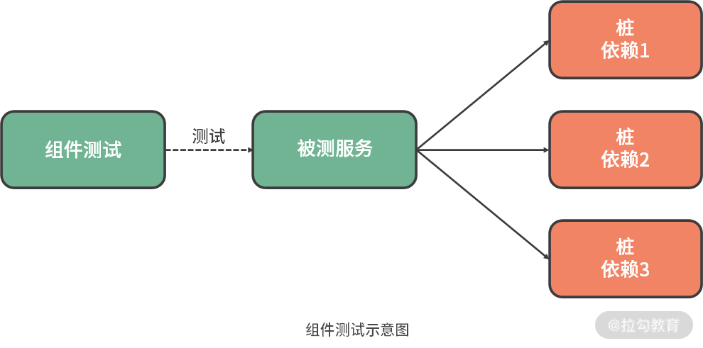
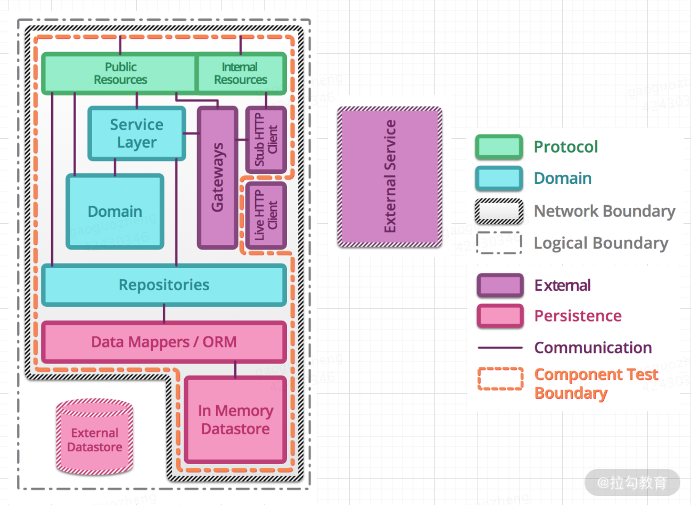
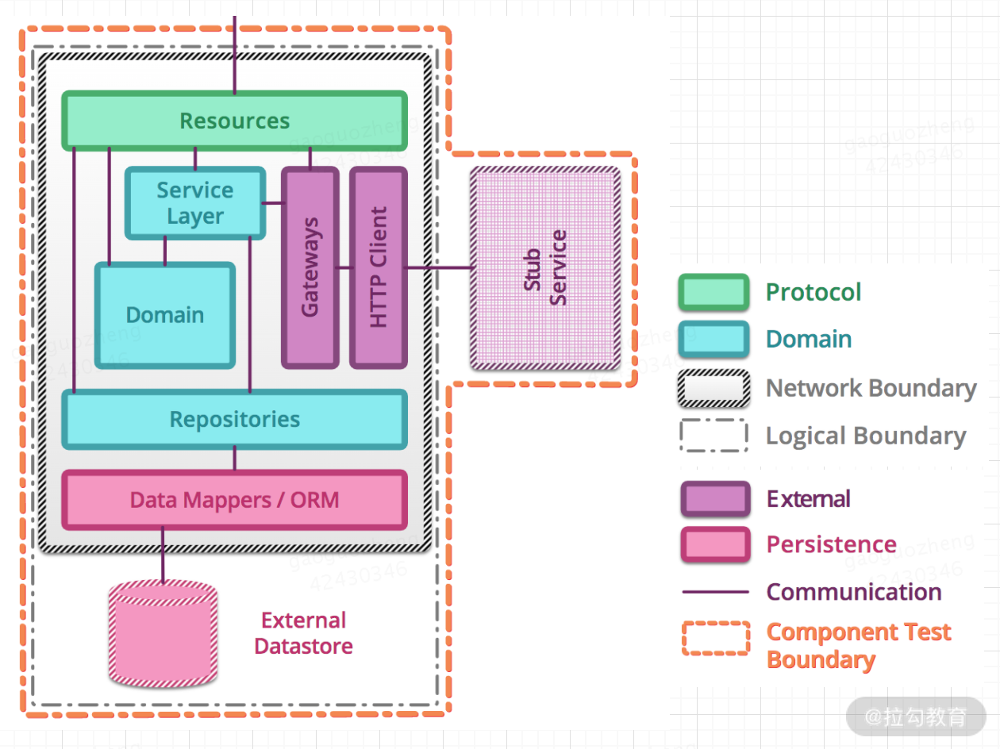
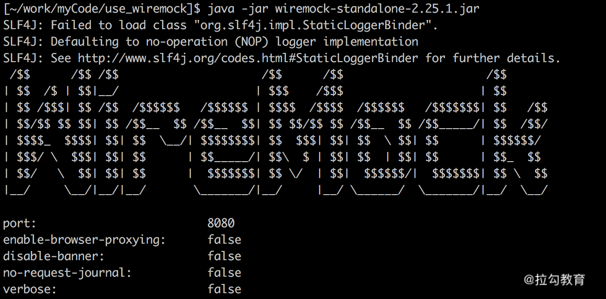
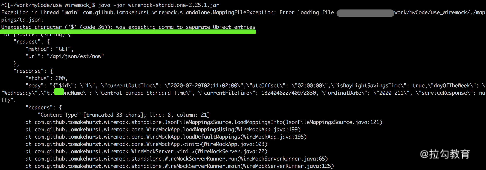
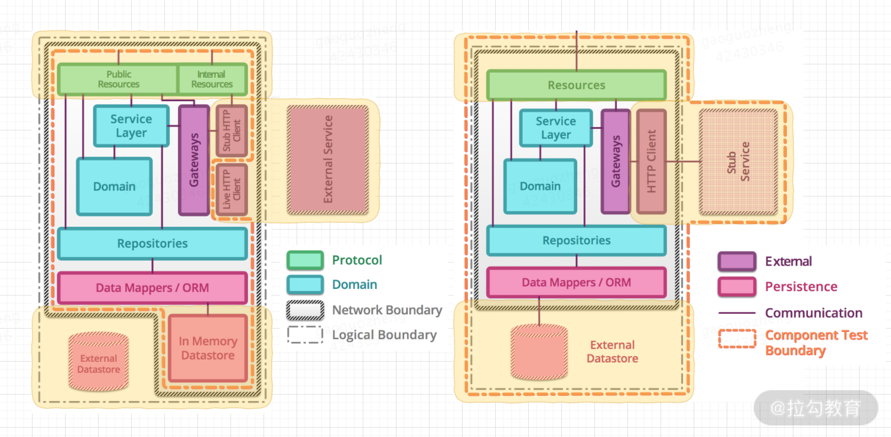

# 06 组件测试：如何保证单服务的质量？

到目前为止，我讲解了微服务架构下的单元测试，它的目的是验证软件代码中的每个单元（方法或类等）是否符合预期；也讲解了微服务架构下的集成测试，它验证微服务是否可以与外部服务或数据存储等基础设施服务进行交互；今天来讲解下保障单个微服务的质量的测试方法——组件测试。

### 组件测试简介

**组件（Component）通常指大型系统中任何封装良好、连贯且可独立替换的中间子系统，在微服务架构中，一般代表单个微服务，因而组件测试（Component Testing）就是对单个服务的测试。**

在一个典型的微服务应用程序中，会有许多微服务，且它们之间存在相互调用关系。因此，要想高效地对单个微服务进行测试，需要将其依赖的其他微服务和数据存储模块进行模拟（mock）。

比如，使用测试替身（Test Double）工具隔离掉单个微服务依赖的其他微服务和数据存储，避免测试过程中受到依赖服务或数据存储模块的各类影响（如服务不可用、服务缺陷、数据库连接断开等）而出现阻塞测试过程、测试无效等情况。



从某种意义上来说，组件测试的本质上是将一个微服务与其依赖的所有其他服务和数据存储模块等隔离开，对该服务进行的功能验收测试。

基于组件测试的隔离特性，它有如下优势：

- 使用测试替身将被测服务与依赖的服务进行隔离，使得服务链路稳定、环境可控，这有利于测试过程的开展；
- 将测试范围限定为单个服务，因而组件的测试设计和测试执行的速度会快很多；
- 即使测试过程中发现了问题，问题也更容易复现，这不仅有利于定位问题所在，问题修复后也有利于进行回归验证。

根据组件测试调用其依赖模块的方式，以及测试替身位于被测服务所在进程的内部或外部，可以有两种方式：进程内组件测试和进程外组件测试。

### 进程内组件测试

进程内组件测试是将测试替身注入所测服务所在的进程中，这样对服务的依赖调用通过方法调用的方式实现，不再需要使用网络。



进程内组件测试示意图

如图所示，进程内组件测试有如下变化：

- 引入测试替身，即模拟的 HTTP 客户端（Stub HTTP Client）和模拟的内存型数据存储模块（In-Memory Datastore）。其中，模拟的 HTTP 客户端用来模拟实际的 HTTP 客户端（live Http Client），模拟的内存型数据存储模块用来模拟真实的外部数据存储模块（External Datastore）。
- 将资源（Resources）拆分成了公共资源（Public Resources）和内部资源（Internal Resources）。服务内部的网关（Gateway）连接了模拟的 HTTP 客户端，不再连接实际的 HTTP 客户端。这是因为进程内组件测试不再需要网络通信，模拟的 HTTP 客户端需要通过一个内部接口进行请求的发送和响应，这需要用到一些库进行 API 之间的转换，常用的有基于微服务的 JVM 的 [inproctester](https://github.com/aharin/inproctester)和基于微服务的 .NET 的 [plasma](https://github.com/jennifersmith/plasma)。

可见，桩（Stub）代码、数据存储模拟模块均放在所测微服务所在的进程中，使用常驻内存的桩代码和模拟代替其依赖性，这就是“ **进程内** （in-process）”的具体表现。通过这种方式，测试可以尽可能接近对被测服务执行真实的 HTTP 请求，而不会产生实际网络交互的额外开销。

这样做的好处是：最大限度地减少不确定因素，降低测试的复杂度，同时加快执行速度；但是其不足在于，这需要侵入微服务的源代码，让其能够以“测试模式”启动和运行。这种情况下，需要引入依赖注入框架（Dependency Injection Frameworks）帮助我们做到这一点，即根据程序在启动时获得的配置，使用不同的依赖对象。常见的依赖注入框架有 Spring、Castle Windsor、Unity、StructureMap、Autofac、Google guice 等。

除了使用测试替身验证单个服务的业务逻辑，还可以针对服务的网络响应等情况进行模拟，比如常见的有外部服务响应延迟、连接中断、响应格式错误，等等。

### 进程外组件测试

进程外组件测试则是将测试替身置于被测服务所在进程之外，因而被测服务需要通过实际网络调用与模拟的外部服务进行交互。

如下图所示，只用模拟的外部服务（Stub Service）替代了真实的外部服务（External Service），所以模拟的外部服务和被测服务都以单独的进程运行，而对于数据库、消息代理等基础设施模块则直接使用真实的。因此，被测服务和模拟的外部服务存在于不同的进程中，这就是“进程外（out-of-process）”的具体表现。除了对功能逻辑有所验证外，进程外组件测试还验证了微服务具有正确的网络配置并能够处理网络请求。



进程外组件测试示意图

关于外部服务模拟，也有不同的类型，常见的有使用事先构造好的静态数据、通过传参方式动态调用API、使用 **录制回放技术** （record-replay mechanism），你可以根据自己的需求选取模拟类型，如果依赖的服务仅提供少数几个固定的功能，并且返回结果较为固定，可以使用静态数据来模拟；如果依赖的服务功能较为单一，但是返回结果有一定的规律，可以使用动态调用 API 的方式来模拟；如果依赖的服务功能丰富多样，那么推荐使用录制回放技术来模拟。

在实际微服务项目中，进程外的组件测试非常常见，一般使用服务虚拟化工具对依赖的服务进行模拟。上一课时给出了 Wiremock 模拟服务通信的例子，在进行组件测试时，依然可以用Wiremock，但与集成测试不同的是，组件测试需要更加深入： **验证被测服务的功能或行为是否符合预期、返回结果的格式是否符合预期、对服务超时、异常返回等异常行为是否具有容错能力，等等。** 用 Wiremock 模拟服务的具体步骤如下：

1.下载 [Wiremock 独立版本](https://repo1.maven.org/maven2/com/github/tomakehurst/wiremock-jre8-standalone/2.27.0/wiremock-jre8-standalone-2.27.0.jar)（wiremock-jre8-standalone-2.27.0.jar）; 2.作为独立版本运行，效果如下：



启动后，Wiremock 会在本地启动一个监听指定端口的 web 服务，端口可以用 --port和 --https-port 来分别指定 http 协议和指定 https 协议端口。之后发到指定端口的请求，就会由 WireMock 来完成响应，从而达到接口 Mock 的目的。

这时，在本地运行目录下会看到自动生成 \_\_files 和 mappings 两个目录。这两个目录中存放的是 Mock 模拟的接口匹配内容。其中 \_\_files 存放接口响应中会用到的一些文件资源，mappings 存放接口响应匹配规则。匹配文件以 json 格式存放在 mappings 目录下，WireMock 会在启动后自动加载该目录下所有符合格式的文件作为匹配规则使用。

3.编辑匹配规则文件 tq.json，放到 mappings 目录下，内容如下：

```plaintext
{ 
    "request": { 
        "method": "GET", 
        "url": "/api/json/est/now" 
    }, 
    "response": { 
        "status": 200, 
        "body": "{\"id\": \"1\", \"currentDateTime\": \"2020-07-29T02:11+02:00\",\"utcOffset\": \"02:00:00\",\"isDayLightSavingsTime\": true,\"dayOfTheWeek\": \"Wednesday\",\"timeZoneName\": \"Central Europe Standard Time\", \"currentFileTime\": 132404622740972830, \"ordinalDate\": \"2020-211\", \"serviceResponse\": null}", 
        "headers": { 
            "Content-Type": "text/plain" 
        } 
    } 
}
```

注意：body 中的内容为 Json 格式时，需要对其中出现的双引号进行转义，否则启动 Wiremock 时将报错。



4.重新启动 Wiremock，访问模拟服务的对应接口（ [http://localhost:8080/api/json/est/now](http://localhost:8080/api/json/est/now)），返回如下：

```plaintext
{ 
id: "1", 
currentDateTime: "2020-07-29T02:11+02:00", 
utcOffset: "02:00:00", 
isDayLightSavingsTime: true, 
dayOfTheWeek: "Wednesday", 
timeZoneName: "Central Europe Standard Time", 
currentFileTime: 132404622740972830, 
ordinalDate: "2020-211", 
serviceResponse: null, 
}
```

至此，就实现了对服务进行 mock 的效果。

要验证被测服务的功能或行为是否符合预期、返回结果的格式是否符合预期，需要先 **熟悉被测服务所负责的业务功能和行为，然后结合测试用例设计方法设计出对被测服务进行验证的测试用例，再使用 Wiremock 强大的模拟能力，对被测服务进行功能验证，以保障被测服务的功能或行为符合预期。**

要验证被测服务出现故障时的场景，可以借助 Wiremock 的故障模拟能力，以 JSON API 为例：

- 错误类返回值

```plaintext
{ 
    "request": { 
        "method": "GET", 
        "url": "/fault" 
    }, 
    "response": { 
        "fault": "MALFORMED_RESPONSE_CHUNK" 
    } 
}
```

可以设置 fault 的值来表示不同的故障：

- - EMPTY_RESPONSE 返回一个完全空的响应；
  - MALFORMED_RESPONSE_CHUNK 发送OK状态标题，然后是垃圾数据，然后关闭连接；
  - RANDOM_DATA_THEN_CLOSE，发送随机的垃圾数据，然后关闭连接。
- 延迟类返回值

```plaintext
{ 
    "request": { 
        "method": "GET", 
        "url": "/delayed" 
    }, 
    "response": { 
        "status": 200, 
        "fixedDelayMilliseconds": 2000 
    } 
}
```

替换 fixedDelayMilliseconds 字段，可以实现如下不同效果的延迟。

- - fixedDelayMilliseconds：固定延迟，单位为毫秒。
  - delayDistribution，type 为 uniform：均匀分布延迟，可用于模拟具有固定抖动量的稳定延迟。它带有两个参数：lower（范围的下限）和 upper（范围的上限），如下代表20ms +/- 5ms的稳定等待时间。

```plaintext
"delayDistribution": { 
        "type": "uniform", 
        "lower": 15, 
        "upper": 25 
}
```

- - delayDistribution，type 为 lognormal：从随机分布中的采样延迟。median 代表中位数，sigma 为标准偏差，值越大，尾巴越长。

```plaintext
"delayDistribution": { 
          "type": "lognormal", 
          "median": 80, 
          "sigma": 0.4 
            }
```

Wiremock 的模拟能力远远不止这些，足够你用它来模拟被测服务，感兴趣的话可以自行探索和学习。

### “进程内” VS “进程外”

如上可知，两种测试方法各有优劣，如下是示意图，方便查看它们的异同：



两种测试方法的示意图对比

两种测试类型的优缺点对比：

**优点**  **缺点**  **进程内组件测试** 测试设计简单； 运行速度快

未测试到服务的部署情况，仿真性弱 **进程外组件测试** 更具集成性和仿真性； 测试覆盖率更高；

测试设计复杂、成本更高； 运行速度慢； 跨网络，运行环境不稳定；

对比两者，进程外组件测试的优势并不明显，因此， **实际项目测试过程中应首选进程内组件测试** 。如果微服务具有复杂的集成、持久性或启动逻辑，则进程外（out-of-process ）方法可能更合适。

### 总结

本节课我讲解了微服务架构下的组件测试，它是针对单个微服务的一种测试方法。根据组件测试调用模块的方式，以及测试替身位于被测服务所在进程的内部或外部，可以有两种测试方法：进程内组件测试和进程外组件测试。

通过对进程内组件测试和进程外组件测试的分析，得知进程内组件测试可以尽可能接近对被测服务执行真实的 HTTP 请求，且具有运行速度快、测试设计简单等优点，是实际项目测试过程的首选方法。但如果微服务具有复杂的集成、持久性或启动逻辑，则进程外组件测试方法可能更合适。

为了能够更全面地测试微服务，需要通过对多种不同的测试方法进行组合（单元测试、集成测试、组件测试），这样可以对组成微服务的模块进行较高的测试覆盖度，从而确保微服务的业务逻辑满足需求。但这些服务并不能确保外部依赖服务满足它们自身的预期契约，或者使微服务集合满足业务诉求。这种场景下，契约测试（Contract Testing）可以验证这类情况，这也是下一课时的内容，敬请期待。

你负责的项目或服务里，是否进行过组件测试，进展如何？欢迎在留言区评论。同时欢迎你能把这篇文章分享给你的同学、朋友和同事，大家一起来交流。

> 相关链接 [https://martinfowler.com/articles/microservice-testing/](https://martinfowler.com/articles/microservice-testing/) [https://www.simform.com/microservice-testing-strategies](https://www.simform.com/microservice-testing-strategies) [https://cloud.spring.io/spring-cloud-contract/reference/html/](https://cloud.spring.io/spring-cloud-contract/reference/html/) 依赖注入框架 Spring： [https://spring.io/](https://spring.io/) Google Guice： [https://github.com/google/guice](https://github.com/google/guice) API转换库： inproctester： [https://github.com/aharin/inproctester](https://github.com/aharin/inproctester) plasma： [https://github.com/jennifersmith/plasma](https://github.com/jennifersmith/plasma) 服务虚拟化工具 WireMock： [http://wiremock.org/](http://wiremock.org/) Hoverfly： [https://hoverfly.io/](https://hoverfly.io/) Mountebank： [http://www.mbtest.org/](http://www.mbtest.org/)
