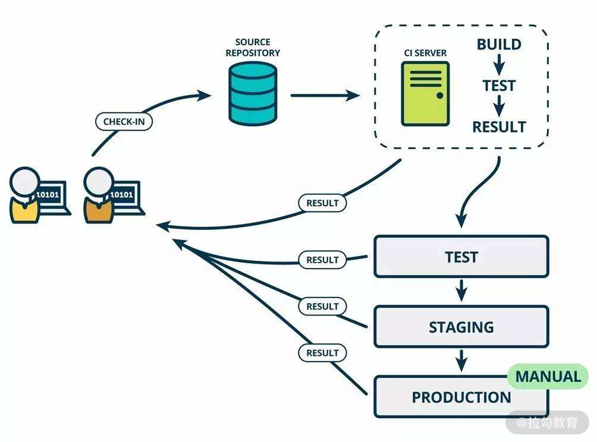

# 12 测试技术篇：如何提升测试效率？

上一课时，我讲解了测试技术的选型。本课时我主要讲解测试技术——如何提升测试效率。

我们都知道，测试过程大体可以抽象为如下内容：

- 测试设计，各类评审、测试用例编写、测试数据准备；
- 测试执行，测试用例执行、Bug 创建与跟进；
- 测试回归，回归用例的维护、回归用例的执行。

针对上述内容进行以下局部优化，可以提升测试过程甚至是研发过程的效率。

- 人员：测试人员通过学习或经验的积累获得能力的提升、招聘能力更强的测试人员。
- 时间：投入更多的个人时间（俗称加班），单纯看测试过程，效率未必提升了，但从交付周期的视角看，交付效率是提升了的。
- 过程：针对测试对象进行可测试性改造，使测试过程更顺畅；严格遵守流程规范，让整个研发过程中的事情正确地发生，减少返工和无效的沟通；进行过程质量把控，当研发过程质量提升，测试时间将大大缩短。
- 环境维护：确保测试环境稳定可用，且尽可能地仿真生产环境。

上述优化项，需要测试团队持续的人力投入，因此，引入能释放人力的技术是非常必要的。

### 释放人力的测试技术

#### 自动化测试技术

自动化测试技术指的是能自动执行软件，并进行预期结果和实际结果比对，再进一步产生测试结果或测试报告的技术。它跟人工测试相比有如下好处。

- 效率高：自动化用例可以并发执行，且运行用例的服务器性能越好，其执行效率越高；
- 精确：测试人员也可能犯错，自动化测试用例不会；
- 可重复：自动化用例可以重复执行、昼夜不停，而人工执行基本只在工作时间进行，重复执行还会产生懈怠情绪、进而效率降低；
- 整体速度快：运行过程中不占用人力，那测试人员就可以去做其他更有价值的事情；

在前面 04～08 课时讲解过微服务架构下的分层测试策略，针对不同层次的测试方法和技术都可以以自动化的测试执行起来。在实际的落地过程中，还需要根据团队和业务特点来确定自动化测试的目标，针对不同层次的设定合理的目标。

- 通常来说，自动化测试的主要意义在于回归测试。
- 优先把最有价值（核心、高频、重要）的业务场景，用自动化运行起来。
- 把不常变化的模块用例以自动化的方式执行起来。如果被依赖服务经常出错，可以用 mock 的方式进行隔离。

#### 流量录制与回放

随着业务和系统的不断迭代，回归测试的比重将越来越高。那么，快速地编写自动化的回归测试用例能极大提升测试效率。**编写回归测试用例时，测试数据的准备是消耗测试时间的一大痛点**，因此，如果能够较快地准备充分的测试数据，将会极大提升回归测试效率。

通常来说，整个研发的交付环境既有线上（生产）环境又有线下（测试）环境，线上环境数据量庞大，线下环境数据量贫瘠。因此，把采集线上环境的数据，作为用例。这样在迭代过程中，可以在测试环境进行用例的回放和结果的比对，这样就可以知道在迭代过程中，是否会对线上目前已有的 case 造成影响。 这就需要用到流量录制与回放技术。

常用的工具有XCopy、jvm-sandbox-repeater、Rdebug 等，这些工具都有详细的使用说明，因此不再讲解如何使用它们。

> jvm-sandbox-repeater 是 JVM-Sandbox 生态体系下的重要模块，它具备了 JVM-Sandbox 的所有特点，插件式设计便于快速适配各种中间件，封装请求录制/回放基础协议，也提供了通用可扩展的各种丰富API。 TCPCopy 是国内各大互联网公司广泛应用 XCopy 系列工具之一，XCopy 是由网易主导，多家公司参与开发的具有在线 Server 流量复制功能的一系列开源软件的总称。XCopy 系列包括 TCPCopy、UDPCopy、MysqlCopy 等开源软件(这些软件都集成在 tcpcopy 开源项目内)。TCPCopy 是一种请求复制(复制基于 TCP 的 packets)工具，通过复制在线数据包，修改TCP/IP 头部信息，发送给测试服务器。

#### 持续集成与持续交付

持续集成（Continuous Integration，简称 CI ）与持续交付（Continuous Delivery，简称 CD ）虽不算是测试技术，但它的确可以在提高测试效率方面，甚至是提高交付效率方面发挥重要的作用。

要想实现持续集成与持续交付，需要尽可能地把几乎所有事情自动化：

- 不适合进行自动化的内容。人工审批、人工演示等交互式的软件流程、探索性测试和UI验收测试；
- 适合进行自动化的内容。构建流程、部署流程、各个层次的测试，包括基础组件的升级和软件的配置等都可以自动化。

由上可知，软件交付的整个周期中，不适合被自动化的事情，要比我们认为的少很多。

持续集成工具主要有 Jenkins、TeamCity、GitLab CI 等。

> Jenkins 的前身是 Hudson 是一个可扩展的持续集成引擎。Jenkins 是一款开源 CI&CD 软件，用于自动化各种任务，包括构建、测试和部署软件。Jenkins 支持各种运行方式，可通过系统包、Docker 或者通过一个独立的 Java 程序。

CI/CD 示意图

由上图可知，在研发人员提交代码后，CI 服务根据指定分支自动执行“编译-打包-部署”，之后执行一系列的自动化测试，每一个阶段的测试结果都反馈给开发人员，这样就可以实现“快速反馈、快速解决”的效果，提升研发和测试效率。可见，**自动化测试技术可以在持续集成中应用起来。** ### 认知

下面是我对精准测试和自动化测试收益分析方面的认知和思考，供你参考。

#### 看清楚精准测试

看了常见的提效测试技术后，你可能会提到“精准测试”。初次知道精准测试是在书籍《不测的秘密：精准测试之路》中，它提供了一种新的思路——尽量做到“不测”，从而解放人力、弥补缺失、去除冗余。精准测试，在我看来，它不是一种特定的技术，更像是一种测试方法论或思想体系。

对于测试人员来说，最理想的情况是，只对已更改的组件运行测试，而不是尝试进行大量的回归测试。精准测试的目标是在不降低质量标准的前提下，探寻缩减测试范围、减少测试独占时长。主要解决的是传统黑盒测试回归内容较多、耗时较长的问题，这与李小龙的截拳道如出一辙。在进行精准测试的过程中，会应用到各种其他的测试技术（ 自动化测试技术、流量录制与回放技术、质量度量、代码覆盖率分析等 ），如果只是知道这种思想，缺乏对其他测试技术的纯熟运用和大量的实践，也很难达到精准的效果。因此，**从技术角度看，精准测试不是完美的，也不可能是完美的。** 其实在测试领域中似乎也没有看到对应精准测试的英文术语，也没有看到各个互联网大厂在这方面的实践经验，所以现阶段它只是一个新颖的理念，保持持续关注即可。

#### 自动化测试的收益分析

自动化测试从逻辑上看是提效的绝佳方式，但不同的团队、不同的业务阶段，自动化执行的收益大大不同。如果不进行收益分析，你甚至说不清楚它到底产生了哪些收益，也就不知道应该如何调整自动化测试策略。因此，在落地自动化测试的过程中，一定要定期衡量它的 ROI（return on investment，投入产出比）。

针对自动化测试的 ROI，可以通过如下计算逻辑： **ROI = 自动化提升的效率 / 自动化产生的成本= (手工用例执行时间 - 自动化用例执行时间) * 自动化用例的有效执行次数 / 自动化用例编写和维护的总成本** 进一步，自动化用例的执行时间通常不需要人工值守，所以可以忽略不计，则最终公式应为： **ROI = (手工用例执行时间 * 自动化用例的有效执行次数) / 自动化用例编写和维护的总成本**

以上这个公式为提升自动化的测试效率指明了方向，我们可以通过改变 ROI 的计算因子，使 ROI 得到提升。

- 手工用例执行时间：提升自动化用例的功能或代码覆盖率，使与之相对应的手工用例执行时间变长。
- 自动化用例的有效执行次数：比如，每进行一次代码提交、环境部署，都触发一次自动化用例执行，有效执行次数得以提升。
- 自动化用例编写和维护的总成本：通过工具自动生成用例，或者提升自动化用例的稳定性、运行环境的稳定性等方式可以降低自动化用例维护的总成本。

自动化测试的效果除了节省时间，还可以发现缺陷。为了发现更多缺陷，需要自动化用例有一定的覆盖度，而覆盖度提升会一定程度降低用例的稳定性、进而维护成本变高。所以，需要综合两者对自动化测试进行收益分析，这样可以避免测试团队陷入常见的极端情况：缺乏结果导向，只写自动化测试用例，但对测试收益不关注。

### 总结

本节课我首先介绍了测试过程的大体内容，如测试设计、测试执行和测试回归，针对这些测试过程的改进可以提升测试效率，但对测试人员有比较明显的独占，虽然是必需的测试工作，但可以引入能够释放测试人力的测试技术。

接着讲解了可以用于提效且可适度释放测试人力的测试技术，如自动化测试技术可以用于回归测试阶段。在实际的落地过程中，需要根据团队和业务特点来确定自动化测试的目标，针对不同层次设定合理的目标。流量录制与回放技术采集线上环境的数据，作为用例，在迭代过程中在测试环境进行用例的回放和结果的比对，可以快速知道是否影响线上功能。持续集成与持续交付技术则把“编译-打包-部署-测试”等环节关联起来，实现“快速反馈、快速解决”的效果，提升研发和测试效率。

最后我分享了针对精准测试和自动化收益分析的认知，供你参考。精准测试是一种方法论，不是一种特定的技术，因此掌握精准测试不太具备实操性，跟个人能力的积累和基础建设的成熟度有很大关系，可以持续保持关注。自动化测试的收益需要持续关注，从而有针对性地提升投入产出比。

你有哪些提升测试效率的干货技巧或技术实践？写在留言区，也让其他同学看看，敬仰一番！

> 相关链接 [https://devops.com/test-better-test-faster-test-smarter/](https://devops.com/test-better-test-faster-test-smarter/) [https://www.softwaretestingnews.co.uk/software-testing-how-to-test-sooner-and-fix-faster/](https://www.softwaretestingnews.co.uk/software-testing-how-to-test-sooner-and-fix-faster/) [https://www.cnblogs.com/finer/p/11895181.html](https://www.cnblogs.com/finer/p/11895181.html) 流量录制与回放[https://github.com/alibaba/jvm-sandbox-repeater](https://github.com/alibaba/jvm-sandbox-repeater) [https://github.com/didi/rdebug](https://github.com/didi/rdebug) CI工具Jenkins[https://www.jenkins.io/zh/](https://www.jenkins.io/zh/)
