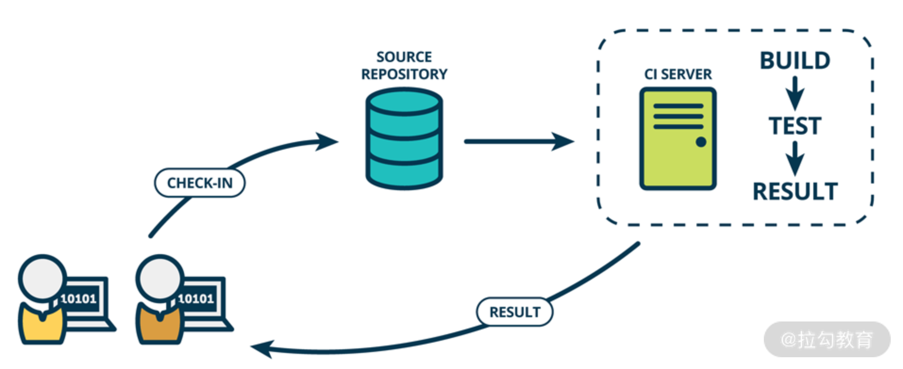
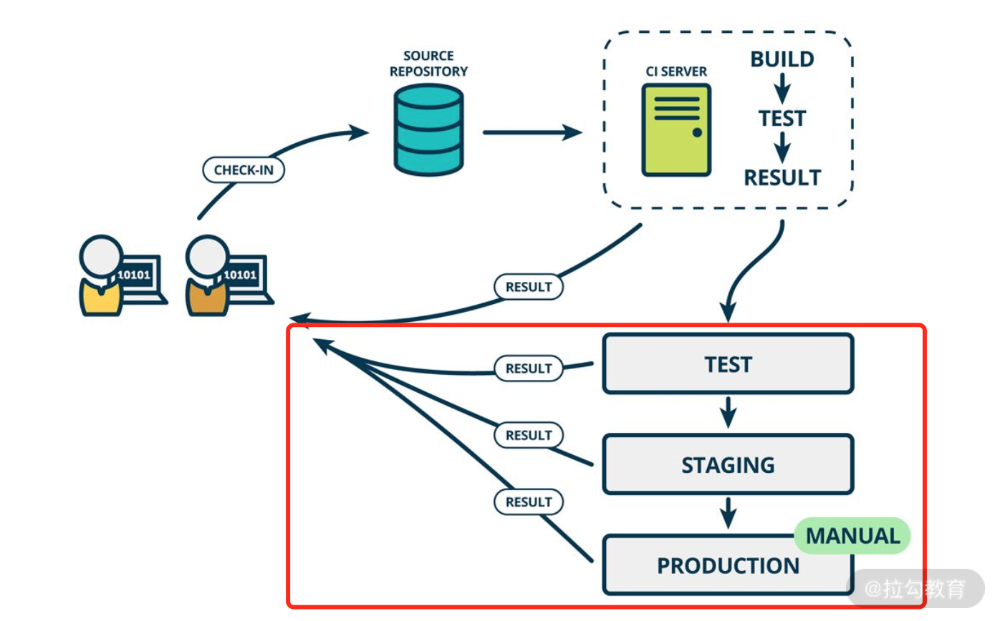
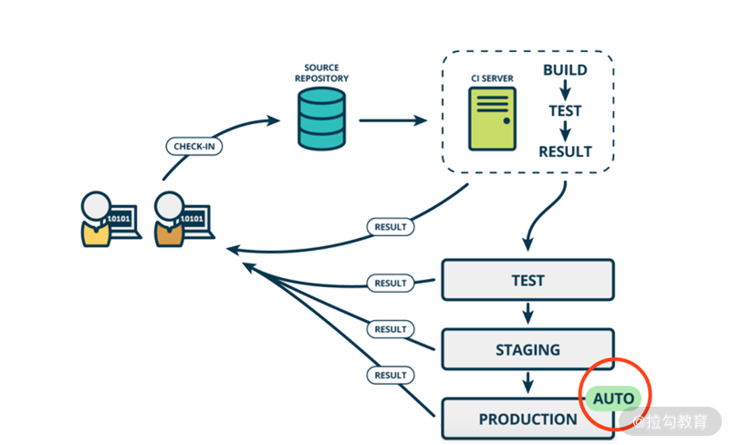
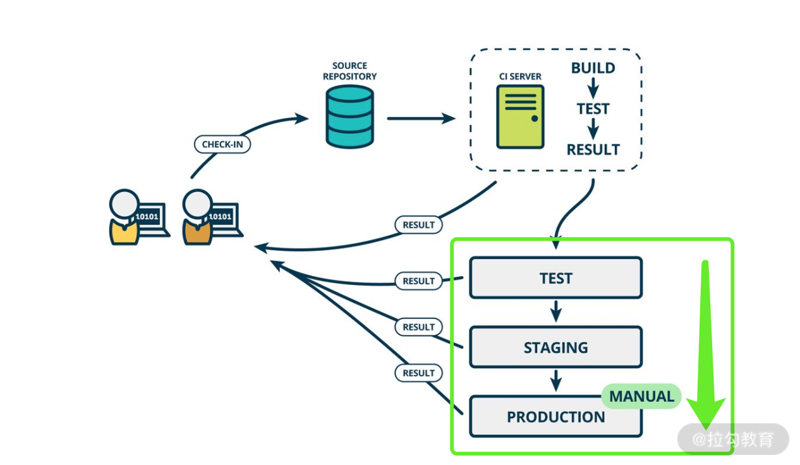
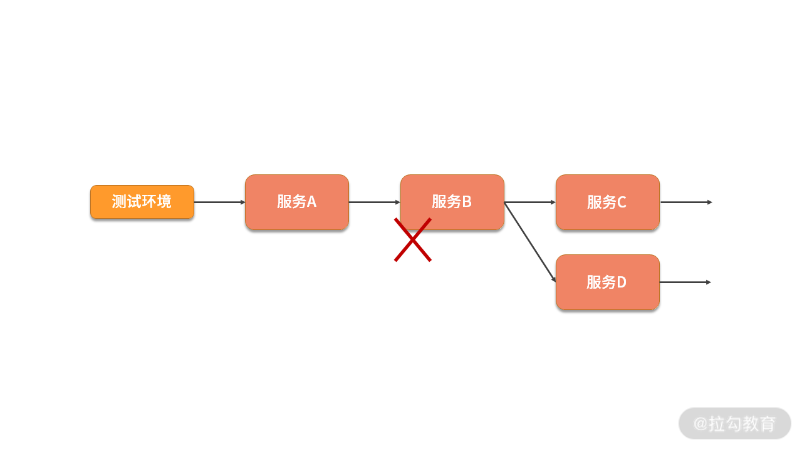
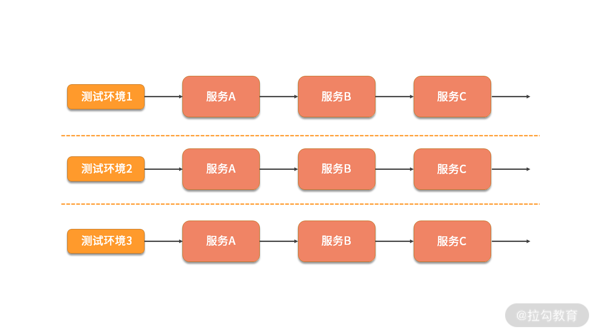
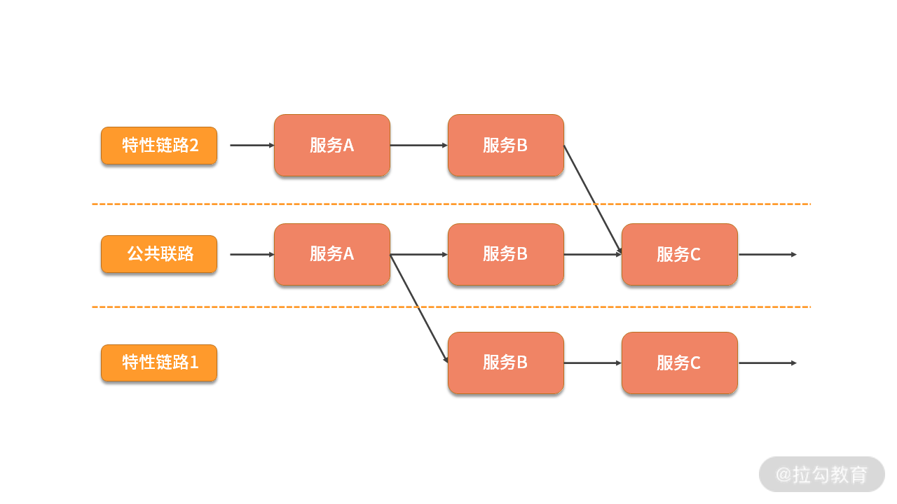
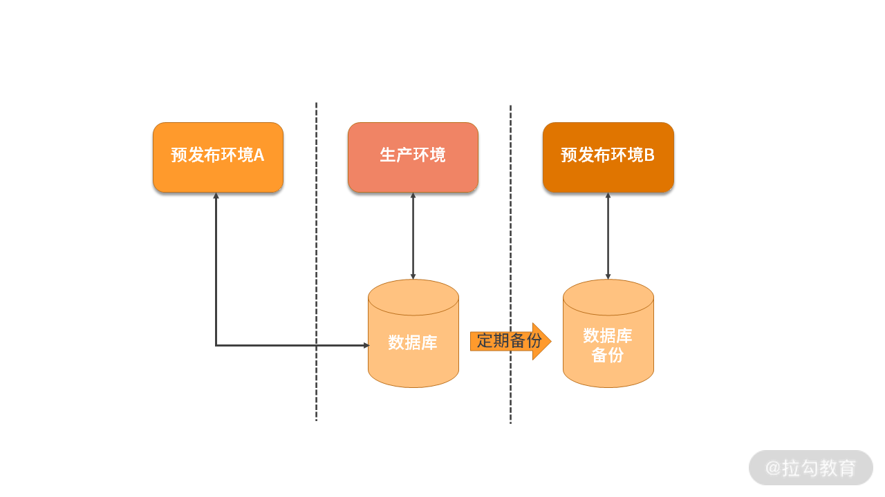
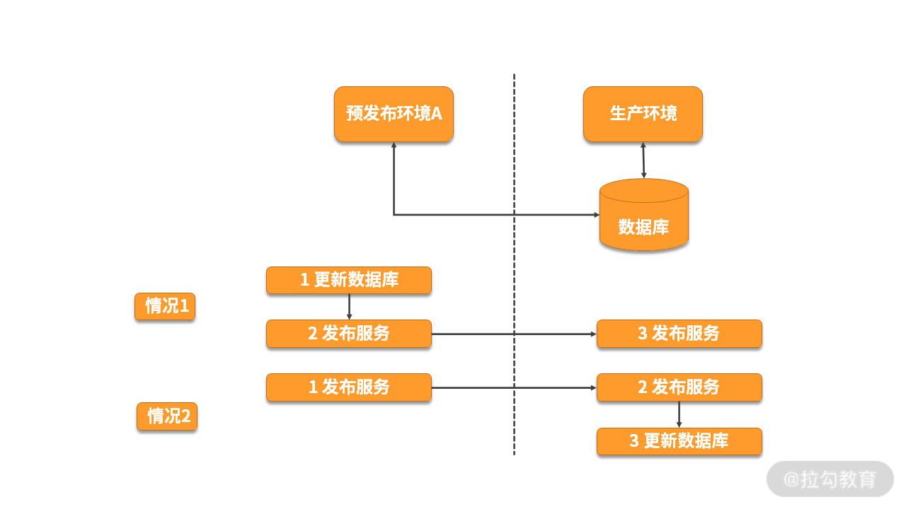
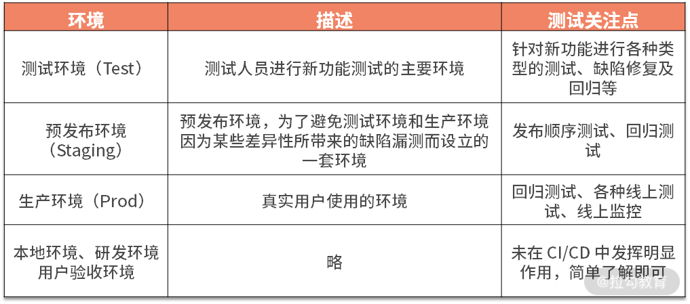

# 14 CICD 篇：如何更好地利用多个“测试”环境？

上一课时，我讲解了专项测试技术。本课时，我主要讲解如何更好地利用多个“测试”环境。

### CI/CD & “测试”环境

**CI/CD** 缩略词 CI/CD 具有几个不同的含义，CI/CD 中的“CI”始终指 **持续集成** （Continuous Integration），它代表研发人员工作的自动化流程， **目的是让正在开发的软件始终处于可工作状态，** 它主要关注代码是否可以编译成功，以及是否可通过单元测试和验收测试等。即，每次当开发人员提交了新代码，CI服务器会自动对这些代码的所属服务进行构建，并对其执行全面的自动化测试。根据测试的结果，可以确定新提交的代码和原有代码是否正确地集成在一起了。如果整个过程中出现了构建失败或测试失败，也需要立即让开发人员知道并修复。如此重复这个过程，就可以确保新代码能够持续地与原有代码正确地集成。

持续集成示意图

而“CD”的含义却有两种：持续交付（Continuous Delivery）、持续部署（Continuous Deployment）。持续部署和持续交付是两个特别容易混淆的概念，它们之间最为本质的区别是： **持续部署是一个技术操作，而持续交付则是一个业务行为。**

我这边具体展开来说下它们两者的区别。

- 持续交付

持续交付是指所有开发人员始终让 Master 分支（也叫做主干分支或发布分支）保持可随时发布的状态，根据实际需要来判断是否进行一键式地发布。

持续交付主要通过如下方式来实现：开发人员在特性分支（Feature分支）上工作，这些分支存在比较短暂的时间，进行过相应的功能测试后，则可以合并到 Master 分支。如果发现引入了其他错误类型（包括缺陷、性能问题、安全问题、可用性问题等）则将测试结果反馈给开发人员，开发人员立即对问题进行解决，使主干始终处于可部署状态，如下图所示。

持续交付示意图

- 持续部署

持续部署是指，在持续交付的基础上，由开发人员或运维人员自助式地向生产环境部署优质的构建版本，甚至每当开发人员提交代码变更时，就触发自动化部署到生产环境。 **可见，持续交付是持续部署的前提，就像持续集成是持续交付的前提条件一样。** 如下图所示。

持续部署示意图

由上图可知，无论 CD 是持续部署还是持续交付， **CI/CD 都是将重复的、手工的工作用自动化的方式来代替** 。因为这样可以减少不同阶段之间等待的时间成本、降低手工操作的出错率、快速收到反馈并修改。久而久之，最终整个产品的交付周期就缩短了。下面，本课时中的 CD 统一表示持续交付。 **“测试”环境** 文章标题提到的“测试”环境，并非代表我们日常所说的测试环境（Test 环境），而是产品交付过程中的各种环境。因为在产品交付过程中，不同的环境有着不同的特性和作用，需要在其中进行不同类型、针对不同对象的测试，所以它们都能起到“支撑测试活动”的作用。

如上述的 **持续部署示意图** 或 **持续交付示意图** 所示，在产品交付过程中，从代码提交到发布到生产环境，会经历多个环境，如 Test 环境、Staging 环境和 Prod 环境等，这些环境在 CI/CD 方面发挥着“价值传递”的作用。

例如，某个业务有一个名叫 Order 的微服务，研发人员对其进行开发后，需要先将代码提交到代码仓库。然后 CI 服务器从代码仓库中将代码拉取到 CI 服务器的特定目录，再通过提前配置好的编译命令对该服务进行编译，并将结果部署到 Test 环境中。如果 Test 环境测试通过，则会进一步部署到 Staging 环境中，Staging 环境测试通过后会以自动化或手工触发的方式在生产环境中部署。由此可见， **Test、Staging、Prod 三个环境对要发布的微服务进行着构建和测试，每前进一步，该微服务就离交付更近一步，离实现业务价值就更近一步。** 

多环境实现价值传递

我们知道，CI/CD 的本质是产品价值的传递。因此，当代码提交后会经历编译、部署，最终形成二进制包，这些软件包会流经不同的环境进行测试。可见， **环境是产品交付过程中价值传递的载体。**

为了快速交付产品价值，需要及时地在不同环境对产品进行测试，这不仅需要各自环境足够稳定，还需要在各种环境中进行各种类型的自动化测试。测试通过后，产品发布到线上，测试不通过，则快速将结果反馈给开发人员。这样便实现了 **“快速响应，快速反馈”** 的效果。这也是 CI/CD 的精髓。

为了更好地传递产品价值，接下来看下产品交付过程中各环境的说明和测试重点。

### 各环境说明及测试侧重点

Test 环境、Staging 环境、Prod 环境，这三个环境，都有其独特的属性。只有通过对其特性的分析，确定测试人员的关注点和侧重点，才能更好地利用它们。

#### 测试环境（Test）

测试环境也叫 Test 环境，这是测试人员进行新功能测试的主要环境，一般由测试人员自己部署、管理和使用。

**测试环境特点**

测试环境一般会克隆生产环境的配置，如果一个服务在测试环境中无法按预期工作，就视为测试不通过，就不能把它发布到生产环境中。

微服务架构下，测试环境如何管理，决定了测试人员的测试效率，常见有三种情况。

- **整个测试团队共用一套测试环境** ：微服务架构下，当一个服务被多个服务依赖时，如果该服务不稳定，那么会影响其他大量服务无法测试。如图，当服务 B 不可用时，依赖服务 B 的其他服务也无法使用。

- **每个测试人员一套完整的测试环境** ：这种情况下虽然可以解决环境依赖问题，但软硬件成本高，环境维护成本比较高，服务器资源利用率比较低。比如，业务系统包含 40 个微服务，测试团队有 10 人，那么就需要 40\*10=400 台服务器来管理测试环境。现如今，虚拟化技术盛行，虽然可以从一定程度上减少资源成本，但维护成本依然不容忽视。

- **服务级复用的虚拟化技术，基于消息路由的控制，实现集群中部分服务的复用。** 像阿里的“公共基础环境+特性环境”，美团的“骨干链路+泳道链路”、有赞的“基础环境（Default Service Chain）+SC 环境（Service-Chain）”都是在此方向上的有效尝试。

服务链路隔离和复用 **测试环境的测试关注点**

测试人员将在该环境进行新功能测试、回归验证 Bug等内容，这包含了微服务架构下的分层测试策略（集成测试、组件测试、契约测试、端到端测试），以及一些非功能类型的测试。

在测试环境测试通过后，就具备了发布的要求。但考虑到 Test 环境和生产环境有比较多的差异，所以在生产环境之前还会在预发布环境进行相关测试。

#### 预发布环境（Staging）

预发布环境（Staging 环境，口语表达时经常变成 Stage 环境）是和生产环境最接近的一个测试环境。预发布环境，从名字中可以看出来，它用来进行正式发布前的预演和验证。测试环境和生产环境之间存在着某些差异，为了避免这些差异导致的缺陷漏测，预发布环境应运而生。

举个最常见的例子，一般在 Test 环境，没有办法测试涉及支付相关的业务功能。虽然可以通过 mock 的方式测试整体的业务流程，但依然不能确保支付功能是可用的。如果此时直接发布到生产环境却发现支付功能不可用，那将是一个业务的灾难级故障。

所以，引入预发布环境可以解决此类问题，这也是它需要高度仿真的缘由。因此在基础环境、配置方面与生产环境一致，差别主要是性能和数据存储。

- 性能：虽然预发布环境的服务器性能与生产环境性能基本一致，但主要体现在预发布环境的服务器实例数通常只有 1 个或少数几台。
- 不同的公司预发布环境略有差异，比如预发布环境使用的是生产环境的数据库备份，或者预发布环境与生产环境使用同一数据库。

如果预发布环境使用生产环境的数据库备份，则需要进行不定期的数据库同步，保持和生产环境的设置、数据一致性。

通常来讲，微服务架构下，数据库有许多库表且数据存储量大，所以以备份数据库方式的预发布环境比较少。如下图所示，两种预发布环境的区别在于使用数据库的方式。

预发布环境连接的数据库有所不同

**Staging 环境的特点**

Staging 环境的特点是高度仿真，它是正式发布前的最后一个环境，数据库同生产环境。对于“数据库同生产环境”这一特点来说，需要特别注意的是，对于同一条用户数据，应避免同时在预发布环境和生产环境对其进行变更。因为数据库缓存存在这两套环境中，可能会产生数据不一致等问题，且难以定位和修复。

可见，预发布环境虽然很接近生产环境，但其区别也同样明显：

- 预发布环境中新功能为最新代码，其他功能代码和生产环境一致；
- 预发布环境和生产环境的访问域名不同；
- 预发布环境一般是研发人员和测试人员使用，而生产环境是提供给真实用户使用的。

**Staging 环境的测试关注点**

- 发布过程测试：针对发布过程的操作步骤进行预演。如果某次发布既需要更新数据库又需要发布服务，需要弄清楚这两者操作顺序的先后。
  - 先更新数据库再发布服务：先在 Staging 环境更新数据库，再在 Staging 环境发布服务，在生产环境操作时则只需要发布服务即可（数据库已经被更新过）。这种情况比较常见。
  - 先发布服务再更新数据库：先在 Staging 环境发布服务，再在生产环境发布服务，再在生产环境更新数据库。这种情况比较少见，比如原先数据库中某字段允许为空，当要把该字段设置为不允许为空时，需要先把微服务中的处理该字段的代码修改为不产生空值，再对数据库进行变更，反之数据库会报错。

- 回归测试：在该环境进行回归测试，应尽量避免造成脏数据。发布过程需要流量来验证，建议采用 UI 层面的端到端自动化测试。
- 特殊内容测试：测试环境可能会受到一些限制，一些流程或者数据没有测试到，就可以在预发布环境进行验证，从而保证产品上线质量。

#### 生产环境（Prod）

生产环境也叫 Prod 环境，Prod 是单词 Production（生产）的简写，代表正式的对外发布服务的环境，是最终用户使用的环境。

生产 **环境特点**

生产环境有着其独有的特点，在测试过程中应特别留意：

- 真正的用户在使用的环境，不要随意在这个环境中做测试，尤其是可能产生脏数据或可能导致服务停用的测试；
- 生产环境的系统复杂度高、存储的数据量大、服务器实例数多，大量的真实用户会产生多种多样的行为，这些都可能导致不可预期的现象，尤其是在性能或异常场景方面；
- 生产环境出现问题后，无论是定位还是解决问题都需要权限，通常需要特定的人员来操作，影响工作效率；

生产 **环境的测试关注点**

通常情况下，为了尽量避免生产环境出现缺陷，采取的方法是在生产环境之前的“类产品环境”进行充分测试。

而微服务架构下，应适当调整测试策略，因为生产环境如果能进行相关的测试活动，对产品质量提升有非常正向的影响。我们可以借助敏捷领域中提到的“测试右移”思想，在生产环境中进行相关质量建设。

比如，微服务发布到生产环境后，除了进行必要的线上回归测试（优先针对已有功能的 checklist 进行回归、再针对本次发布的新功能进行验收测试）之外，还进行许多测试活动，而这些测试活动有助于发现此前测试过程中不容易发现的问题，主要有如下内容。

- 线上测试

线上测试有很多成熟的实践，比如业务逻辑灰度、A/B 测试等。

业务逻辑灰度发布是在新发布一项业务功能时，先只开放给一小部分（比如 5%）用户使用，使用一段时间反响较好或未出现缺陷时再逐步开放使用比例，重复这一过程，直到向所有用户开放使用。一般情况下，业务逻辑灰度适用于发布特大功能、重大的架构改造或发布容易引起用户投诉或舆情的功能等情况。

A/B 测试主要用于产品功能或算法策略的对比，版本 A 和版本 B 分别部署在不同的服务器上并开放给不同的用户使用，一般适用于收集用户反馈或行为数据来辅助产品功能设计。比如对比两种营销策略对用户留存的影响、对比两种推荐算法策略的优劣，等等。

- 线上监控

除了上述测试内容外，还需要针对生产环境进行业务和技术监控，对生产环境的数据和日志等进行分析，旨在前置发现质量风险，暴露问题。

#### 其他环境

除了上述这些环境，产品交付过程中可能还有另外几种环境，但因为没有在 CI/CD 中发挥明显作用，所以只需要简单做下了解即可。

- 本地环境（Local）

研发人员的本地环境，主要用于本地代码开发、调试、自测等。每一个研发人员自己的电脑都充当一个本地环境。

- 研发环境（Dev）

研发环境也叫 Dev 环境，Dev 是 development 的简写，即研发。Dev 环境是研发人员专门用于开发、联调的环境，服务的配置比较随意，只影响开发人员本地代码配置， 为了开发调试方便，一般打开全部错误报告。该环境由研发人员使用，一般不太稳定。

- 用户验收环境（UAT）

UAT(User Acceptance Test)，用户接受度测试，即验收测试，所以 UAT 环境主要是用来作为客户体验的环境。这个阶段可以收集客户的体验反馈，对于出现的问题可反哺到研发交付过程中。

#### 各环境关系

生产环境之外的环境，都是对生产环境的仿真。仿真程度不同，能做的测试类型和深度是不同的。而生产环境，因为它的特殊性，能做的测试也是有限的，所以需要配合使用。几个环境最大的好处就是各司其职，既不会影响开发，也不会影响测试工作。

### 总结

本节课我讲解了 CI/CD 的基本概念，和“测试”环境。CI/CD 是持续集成和持续交付的意思，“测试”环境指的是产品交付过程中的各类环境，在 CI/CD 中的起到了产品价值传递的重要作用。

紧接着，我对交付过程中的各种运行环境进行了讲解，包括环境说明和测试侧重点。

- 其中测试环境（Test）是测试人员进行新功能测试的主要环境，在这个测试阶段针对新功能进行各种类型的测试、缺陷修复及回归等。
- 预发布环境（Staging）用来进行正式发布前的预演和验证，在这个测试阶段，重点进行发布顺序测试、回归测试和特殊内容测试（如支付类场景）。
- 生产环境（Prod）是真实用户使用的环境，在这个测试阶段，除了进行回归测试，还可以进行线上测试和线上监控等。

这三大核心环境相关独立，各司其职，同时又相互配合。

那你所在的业务或项目，共有几个不同类型的环境呢？在每个环境里又进行哪些类型的测试？请写在留言区。

> 相关链接： CI/CD：<https://www.redhat.com/zh/topics/devops/what-is-ci-cd> CircleCI 与 Jenkins：选择正确的 CI/CD 工具 <https://www.kubernetes.org.cn/8268.html> 一次Testing in Production方案的探索 <https://insights.thoughtworks.cn/testing-in-production/> 生产环境下的 QA <https://insights.thoughtworks.cn/qa-in-production-practice/> 在阿里，我们如何管理测试环境 <https://segmentfault.com/a/1190000018022987> 有赞是如何高效管理自己的开发测试环境的？ <https://mp.weixin.qq.com/s/Db5Jwb0QvqsEB207dhWEEg> Devops Handbook《DevOps 实践指南》简介 <https://martinliu.cn/posts/devops-handbook/>
