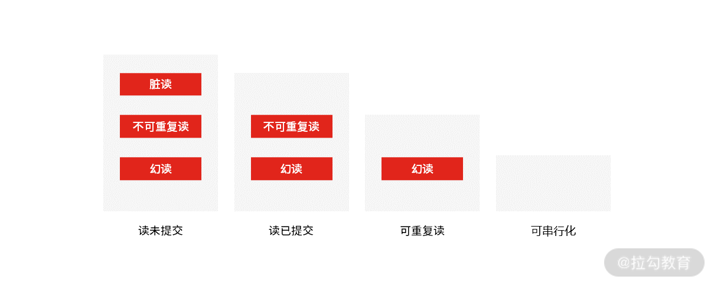
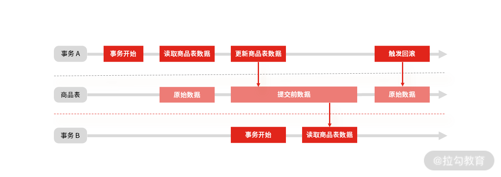
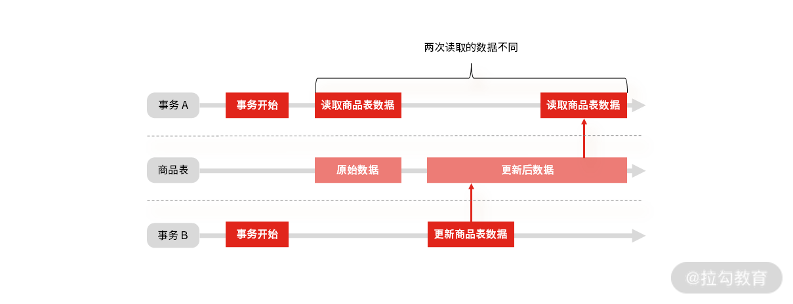
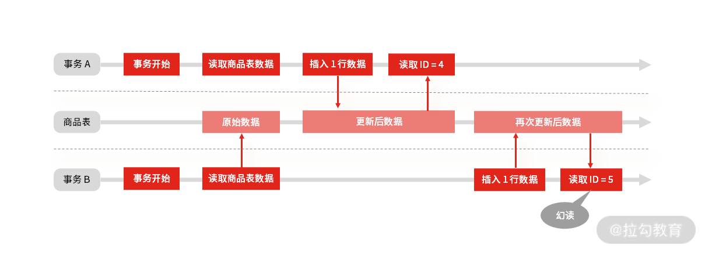
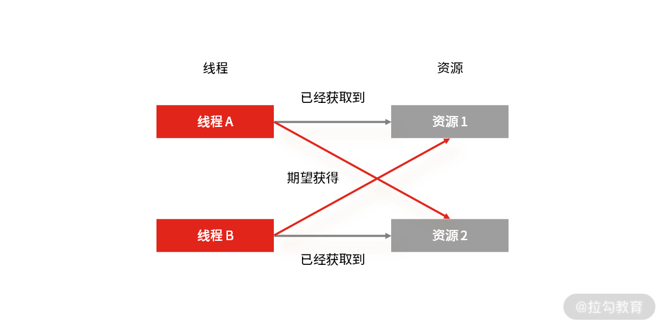
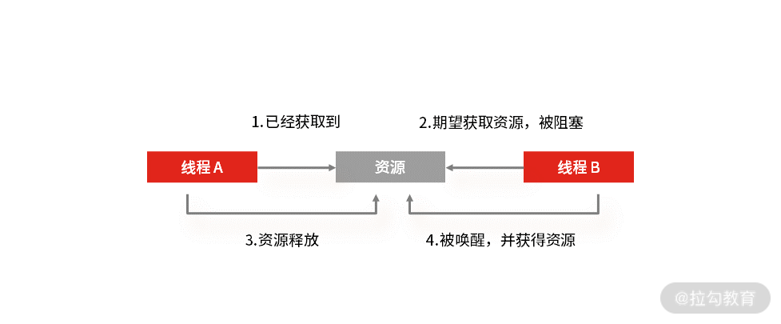
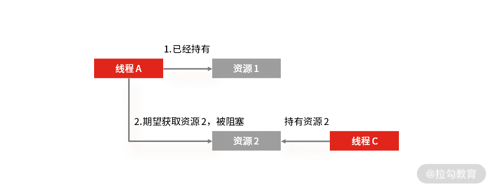
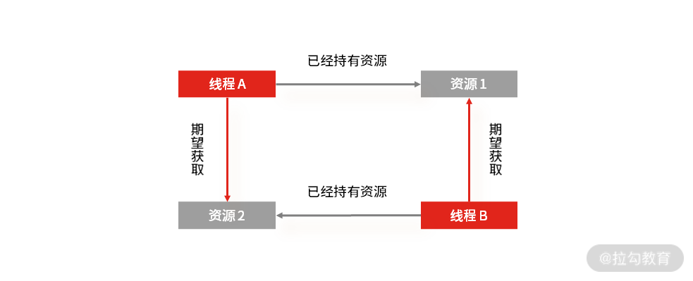

# 10 如何回答 MySQL 的事务隔离级别和锁的机制？

上一讲，我讲了 MySQL 的索引原理与优化问题，今天我带你继续学习 MySQL 的事务隔离级别和锁的机制，MySQL 的事务和锁是并发控制最基本的手段，在面试中，它们与 09 讲的索引一样，同样是 MySQL 重要的考察点。

### 案例背景

MySQL 的事务隔离级别（Isolation Level），是指：当多个线程操作数据库时，数据库要负责隔离操作，来保证各个线程在获取数据时的准确性。它分为四个不同的层次，按隔离水平高低排序， **读未提交 < 读已提交 < 可重复度 < 串行化** 。

MySQL 隔离级别

- **读未提交（Read uncommitted）** ：隔离级别最低、隔离度最弱，脏读、不可重复读、幻读三种现象都可能发生。所以它基本是理论上的存在，实际项目中没有人用，但性能最高。
- **读已提交（Read committed）** ：它保证了事务不出现中间状态的数据，所有数据都是已提交且更新的，解决了脏读的问题。但读已提交级别依旧很低，它允许事务间可并发修改数据，所以不保证再次读取时能得到同样的数据，也就是还会存在不可重复读、幻读的可能。
- **可重复读（Repeatable reads）** ：MySQL InnoDB 引擎的默认隔离级别，保证同一个事务中多次读取数据的一致性，解决脏读和不可重复读，但仍然存在幻读的可能。
- **可串行化（Serializable）** ：选择“可串行化”意味着读取数据时，需要获取共享读锁；更新数据时，需要获取排他写锁；如果 SQL 使用 WHERE 语句，还会获取区间锁。换句话说，事务 A 操作数据库时，事务 B 只能排队等待，因此性能也最低。

至于数据库锁，分为悲观锁和乐观锁，“悲观锁”认为数据出现冲突的可能性很大，“乐观锁”认为数据出现冲突的可能性不大。那悲观锁和乐观锁在基于 MySQL 数据库的应用开发中，是如何实现的呢？

- 悲观锁一般利用 SELECT … FOR UPDATE 类似的语句，对数据加锁，避免其他事务意外修改数据。
- 乐观锁利用 CAS 机制，并不会对数据加锁，而是通过对比数据的时间戳或者版本号，实现版本判断。

### 案例分析

如果面试官想深挖候选人对数据库内部机制的掌握程度，切入点一般是 MySQL 的事务和锁机制。接下来，我就从初中级研发工程师的角度出发，从概念到实践，带你掌握“MySQL 事务和锁机制”的高频考点：

- 举例说明什么是脏读、不可重复度和幻读（三者虽然基础，但很多同学容易弄混）？
- MySQL 是怎么解决脏读、不可重复读，和幻读问题的？
- 你怎么理解死锁？
- ……

### 案例解答

#### 怎么理解脏读、不可重复读和幻读？

**脏读：** 读到了未提交事务的数据。

事务并发时的“脏读”现象

假设有 A 和 B 两个事务，在并发情况下，事务 A 先开始读取商品数据表中的数据，然后再执行更新操作，如果此时事务 A 还没有提交更新操作，但恰好事务 B 开始，然后也需要读取商品数据，此时事务 B 查询得到的是刚才事务 A 更新后的数据。

如果接下来事务 A 触发了回滚，那么事务 B 刚才读到的数据就是过时的数据，这种现象就是脏读。 **“脏读”面试关注点：** 1.  脏读对应的隔离级别是“读未提交”，只有该隔离级别才会出现脏读。
2\.  脏读的解决办法是升级事务隔离级别，比如“读已提交”。 **不可重复读：** 事务 A 先读取一条数据，然后执行逻辑的过程中，事务 B 更新了这条数据，事务 A 再读取时，发现数据不匹配，这个现象就是“不可重复读”。

事务并发时的“不可重复读”现象 **“不可重复读”面试关注点：** 1.  简单理解是两次读取的数据中间被修改，对应的隔离级别是“读未提交”或“读已提交”。
2\.  不可重复读的解决办法就是升级事务隔离级别，比如“可重复度”。 **幻读：** 在一个事务内，同一条查询语句在不同时间段执行，得到不同的结果集。

事务并发时的“幻读”现象

事务 A 读了一次商品表，得到最后的 ID 是 3，事务 B 也同样读了一次，得到最后 ID 也是 3。接下来事务 A 先插入了一行，然后读了一下最新的 ID 是 4，刚好是前面 ID 3 加上 1，然后事务 B 也插入了一行，接着读了一下最新的 ID 发现是 5，而不是 3 加 1。

这时，你发现在使用 ID 做判断或做关键数据时，就会出现问题，这种现象就像是让事务 B 产生了幻觉一样，读取到了一个意想不到的数据，所以叫幻读。当然，不仅仅是新增，删除、修改数据也会发生类似的情况。 **“幻读”面试关注点：** 1.  要想解决幻读不能升级事务隔离级别到“可串行化”，那样数据库也失去了并发处理能力。
2\.  行锁解决不了幻读，因为即使锁住所有记录，还是阻止不了插入新数据。
3\.  解决幻读的办法是锁住记录之间的“间隙”，为此 MySQL InnoDB 引入了新的锁，叫 **间隙锁（Gap Lock）** ，所以在面试中，你也要掌握间隙锁，以及间隙锁与行锁结合的 next-key lock 锁。

#### 怎么理解死锁

除了事务隔离级别，很多同学在面试时，经常会被面试官直奔主题地问：“谈谈你对死锁的理解”。要回答这样开放的问题，你就要在脑海中梳理出系统化的回答思路： **死锁是如何产生的，如何避免死锁。** 死锁一般发生在多线程（两个或两个以上）执行的过程中。因为争夺资源造成线程之间相互等待，这种情况就产生了死锁。我在 06 讲也提到了死锁，但是并没有讲它产生的原因以及怎么避免，所以接下来我们就来了解这部分内容。

线程死锁

比如你有资源 1 和 2，以及线程 A 和 B，当线程 A 在已经获取到资源 1 的情况下，期望获取线程 B 持有的资源 2。与此同时，线程 B 在已经获取到资源 2 的情况下，期望获取现场 A 持有的资源 1。

那么线程 A 和线程 B 就处理了相互等待的死锁状态，在没有外力干预的情况下，线程 A 和线程 B 就会一直处于相互等待的状态，从而不能处理其他的请求。 **死锁产生的四个必要条件** 。

互斥条件 **互斥：** 多个线程不能同时使用一个资源。比如线程 A 已经持有的资源，不能再同时被线程 B 持有。如果线程 B 请求获取线程 A 已经占有的资源，那线程 B 只能等待这个资源被线程 A 释放。

持有并等待 **持有并等待：** 当线程 A 已经持有了资源 1，又提出申请资源 2，但是资源 2 已经被线程 C 占用，所以线程 A 就会处于等待状态，但它在等待资源 2 的同时并不会释放自己已经获取的资源 1。

不可剥夺条件 **不可剥夺：** 线程 A 获取到资源 1 之后，在自己使用完之前不能被其他线程（比如线程 B）抢占使用。如果线程 B 也想使用资源 1，只能在线程 A 使用完后，主动释放后再获取。

循环等待 **循环等待：** 发生死锁时，必然会存在一个线程，也就是资源的环形链。比如线程 A 已经获取了资源 1，但同时又请求获取资源 2。线程 B 已经获取了资源 2，但同时又请求获取资源 1，这就会形成一个线程和资源请求等待的环形图。

死锁只有同时满足 **互斥** 、 **持有并等待** 、 **不可剥夺** 、 **循环等待** 时才会发生。并发场景下一旦死锁，一般没有特别好的方法，很多时候只能重启应用。 **因此，最好是规避死锁，那么具体怎么做呢？答案是：至少破坏其中一个条件** （互斥必须满足，你可以从其他三个条件出发）。

- 持有并等待：我们可以一次性申请所有的资源，这样就不存在等待了。
- 不可剥夺：占用部分资源的线程进一步申请其他资源时，如果申请不到，可以主动释放它占有的资源，这样不可剥夺这个条件就破坏掉了。
- 循环等待：可以靠按序申请资源来预防，也就是所谓的资源有序分配原则，让资源的申请和使用有线性顺序，申请的时候可以先申请资源序号小的，再申请资源序号大的，这样的线性化操作就自然就不存在循环了。

### 总结

我们花了两讲的时间，把 MySQL 数据库面试中的高频问题熟悉了一遍，但是如果从数据库领域应用开发者角度出发，至少还需要掌握以下几部分内容。

- **数据库设计基础** ：掌握数据库设计中的基本范式，以及基础概念，例如表、视图、索引、外键、序列号生成器等，掌握数据库的数据类型的使用，清楚业务实体关系与数据库结构的映射。
- **数据库隔离级别** ：掌握 MySQL 四种事务隔离级别的基础知识，并进一步了解 MVCC、Locking 等机制对于处理的进阶问题的解决；还需要了解不同索引类型的使用，甚至是底层数据结构和算法等。
- **SQL 优化** ：掌握基础的 SQL 调优技巧，至少要了解基本思路是怎样的，例如 SQL 怎样写才能更好利用索引、知道如何分析 SQL 执行计划等。
- **数据库架构设计** ：掌握针对高并发等特定场景中的解决方案，如读写分离、分库分表等。

当然在准备面试时我并不建议你找一堆书闷头苦读，还是要从实际工作中，从使用数据库出发，并结合实践，完善和深化自己的知识体系，今天的内容就讲到这里，我们下一讲见。
