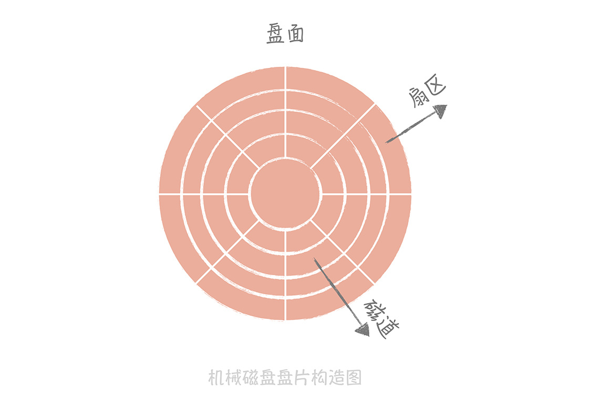

# 01 高并发系统：它的通用设计方法是什么？

我们知道，高并发代表着大流量，高并发系统设计的魅力就在于我们能够凭借自己的聪明才智设计巧妙的方案，从而抵抗巨大流量的冲击，带给用户更好的使用体验。这些方案好似能操纵流量，让流量更加平稳得被系统中的服务和组件处理。

来做个简单的比喻吧。

从古至今，长江和黄河流域水患不断，远古时期，大禹曾拓宽河道，清除淤沙让流水更加顺畅；都江堰作为史上最成功的的治水案例之一，用引流将岷江之水分流到多个支流中，以分担水流压力；三门峡和葛洲坝通过建造水库将水引入水库先存储起来，然后再想办法把水库中的水缓缓地排出去，以此提高下游的抗洪能力。

而我们在应对高并发大流量时也会采用类似“抵御洪水”的方案，归纳起来共有三种方法。

- Scale-out（横向扩展）：分而治之是一种常见的高并发系统设计方法，采用分布式部署的方式把流量分流开，让每个服务器都承担一部分并发和流量。
- 缓存：使用缓存来提高系统的性能，就好比用“拓宽河道”的方式抵抗高并发大流量的冲击。
- 异步：在某些场景下，未处理完成之前，我们可以让请求先返回，在数据准备好之后再通知请求方，这样可以在单位时间内处理更多的请求。

简单介绍了这三种方法之后，我再详细地带你了解一下，这样当你在设计高并发系统时就可以有考虑的方向了。当然了，这三种方法会细化出更多的内容，我会在后面的课程中深入讲解。

首先，我们先来了解第一种方法： **Scale-out。**

## Scale-up vs Scale-out

著名的“摩尔定律”是由 Intel 的创始人之一戈登·摩尔于 1965 年提出的。这个定律提到，集成电路上可容纳的晶体管的数量约每隔两年会增加一倍。

后来，Intel 首席执行官大卫·豪斯提出“18 个月”的说法，即预计 18 个月会将芯片的性能提升一倍，这个说法广为流传。

摩尔定律虽然描述的是芯片的发展速度，但我们可以延伸为整体的硬件性能，从 20 世纪后半叶开始，计算机硬件的性能是指数级演进的。

直到现在，摩尔定律依然生效，在半个世纪以来的 CPU 发展过程中，芯片厂商靠着在有限面积上做更小的晶体管的黑科技，大幅度地提升着芯片的性能。从第一代集成电路上只有十几个晶体管，到现在一个芯片上动辄几十亿晶体管的数量，摩尔定律指引着芯片厂商完成了技术上的飞跃。

但是有专家预测，摩尔定律可能在未来几年之内不再生效，原因是目前的芯片技术已经做到了 10nm 级别，在工艺上已经接近极限，再往上做，即使有新的技术突破，在成本上也难以被市场接受。后来，双核和多核技术的产生拯救了摩尔定律，这些技术的思路是将多个 CPU 核心压在一个芯片上，从而大大提升 CPU 的并行处理能力。

我们在高并发系统设计上也沿用了同样的思路，将类似追逐摩尔定律不断提升 CPU 性能的方案叫做 Scale-up（纵向扩展），把类似 CPU 多核心的方案叫做 Scale-out，这两种思路在实现方式上是完全不同的。

- Scale-up，通过购买性能更好的硬件来提升系统的并发处理能力，比方说目前系统 4 核 4G 每秒可以处理 200 次请求，那么如果要处理 400 次请求呢？很简单，我们把机器的硬件提升到 8 核 8G（硬件资源的提升可能不是线性的，这里仅为参考）。
- Scale-out，则是另外一个思路，它通过将多个低性能的机器组成一个分布式集群来共同抵御高并发流量的冲击。沿用刚刚的例子，我们可以使用两台 4 核 4G 的机器来处理那 400 次请求。

**那么什么时候选择 Scale-up，什么时候选择 Scale-out 呢？** 一般来讲，在我们系统设计初期会考虑使用 Scale-up 的方式，因为这种方案足够简单，所谓能用堆砌硬件解决的问题就用硬件来解决，但是当系统并发超过了单机的极限时，我们就要使用 Scale-out 的方式。

Scale-out 虽然能够突破单机的限制，但也会引入一些复杂问题。比如，如果某个节点出现故障如何保证整体可用性？当多个节点有状态需要同步时，如何保证状态信息在不同节点的一致性？如何做到使用方无感知的增加和删除节点？等等。其中每一个问题都涉及很多的知识点，我会在后面的课程中深入地讲解，这里暂时不展开了。

## 说完了 Scale-out，我们再来看看高并发系统设计的另一种方法： **缓存。** 使用缓存提升性能

Web 2.0 是缓存的时代，这一点毋庸置疑。缓存遍布在系统设计的每个角落，从操作系统到浏览器，从数据库到消息队列，任何略微复杂的服务和组件中，你都可以看到缓存的影子。我们使用缓存的主要作用是提升系统的访问性能，那么在高并发的场景下，就可以支撑更多用户的同时访问。

那么为什么缓存可以大幅度提升系统的性能呢？我们知道数据是放在持久化存储中的，一般的持久化存储都是使用磁盘作为存储介质的，而普通磁盘数据由机械手臂、磁头、转轴、盘片组成，盘片又分为磁道、柱面和扇区，盘片构造图我放在下面了。

盘片是存储介质，每个盘片被划分为多个同心圆，信息都被存储在同心圆之中，这些同心圆就是磁道。在磁盘工作时盘片是在高速旋转的，机械手臂驱动磁头沿着径向移动，在磁道上读取所需要的数据。我们把磁头寻找信息花费的时间叫做寻道时间。

普通磁盘的寻道时间是 10ms 左右，而相比于磁盘寻道花费的时间，CPU 执行指令和内存寻址的时间都在是 ns（纳秒）级别，从千兆网卡上读取数据的时间是在μs（微秒）级别。所以在整个计算机体系中，磁盘是最慢的一环，甚至比其它的组件要慢几个数量级。因此，我们通常使用以内存作为存储介质的缓存，以此提升性能。

当然，缓存的语义已经丰富了很多，我们可以将任何降低响应时间的中间存储都称为缓存。缓存的思想遍布很多设计领域，比如在操作系统中 CPU 有多级缓存，文件有 Page Cache 缓存，你应该有所了解。

异步处理
---- **异步** 也是一种常见的高并发设计方法，我们在很多文章和演讲中都能听到这个名词，与之共同出现的还有它的反义词：同步。比如，分布式服务框架 Dubbo 中有同步方法调用和异步方法调用，IO 模型中有同步 IO 和异步 IO。

**那么什么是同步，什么是异步呢？** 以方法调用为例，同步调用代表调用方要阻塞等待被调用方法中的逻辑执行完成。这种方式下，当被调用方法响应时间较长时，会造成调用方长久的阻塞，在高并发下会造成整体系统性能下降甚至发生雪崩。

异步调用恰恰相反，调用方不需要等待方法逻辑执行完成就可以返回执行其他的逻辑，在被调用方法执行完毕后再通过回调、事件通知等方式将结果反馈给调用方。

异步调用在大规模高并发系统中被大量使用， **比如我们熟知的 12306 网站。** 当我们订票时，页面会显示系统正在排队，这个提示就代表着系统在异步处理我们的订票请求。在 12306 系统中查询余票、下单和更改余票状态都是比较耗时的操作，可能涉及多个内部系统的互相调用，如果是同步调用就会像 12306 刚刚上线时那样，高峰期永远不可能下单成功。

而采用异步的方式，后端处理时会把请求丢到消息队列中，同时快速响应用户，告诉用户我们正在排队处理，然后释放出资源来处理更多的请求。订票请求处理完之后，再通知用户订票成功或者失败。

处理逻辑后移到异步处理程序中，Web 服务的压力小了，资源占用的少了，自然就能接收更多的用户订票请求，系统承受高并发的能力也就提升了。

既然我们了解了这三种方法，那么是不是意味着在高并发系统设计中，开发一个系统时要把这些方法都用上呢？当然不是，系统的设计是不断演进的。

**罗马不是一天建成的，系统的设计也是如此。** 不同量级的系统有不同的痛点，也就有不同的架构设计的侧重点。 **如果都按照百万、千万并发来设计系统，电商一律向淘宝看齐，IM 全都学习微信和 QQ，那么这些系统的命运一定是灭亡。**

因为淘宝、微信的系统虽然能够解决同时百万、千万人同时在线的需求，但其内部的复杂程度也远非我们能够想象的。盲目地追从只能让我们的架构复杂不堪，最终难以维护。就拿从单体架构往服务化演进来说，淘宝也是在经历了多年的发展后，发现系统整体的扩展能力出现问题时，开始启动服务化改造项目的。

**我之前也踩过一些坑，** 参与的一个创业项目在初始阶段就采用了服务化的架构，但由于当时人力有限，团队技术积累不足，因此在实际项目开发过程中，发现无法驾驭如此复杂的架构，也出现了问题难以定位、系统整体性能下降等多方面的问题，甚至连系统宕机了都很难追查到根本原因，最后不得不把服务做整合，回归到简单的单体架构中。

所以我建议一般系统的演进过程应该遵循下面的思路：

- 最简单的系统设计满足业务需求和流量现状，选择最熟悉的技术体系。
- 随着流量的增加和业务的变化，修正架构中存在问题的点，如单点问题，横向扩展问题，性能无法满足需求的组件。在这个过程中，选择社区成熟的、团队熟悉的组件帮助我们解决问题，在社区没有合适解决方案的前提下才会自己造轮子。
- 当对架构的小修小补无法满足需求时，考虑重构、重写等大的调整方式以解决现有的问题。

**以淘宝为例，** 当时在业务从 0 到 1 的阶段是通过购买的方式快速搭建了系统。而后，随着流量的增长，淘宝做了一系列的技术改造来提升高并发处理能力，比如数据库存储引擎从 MyISAM 迁移到 InnoDB，数据库做分库分表，增加缓存，启动中间件研发等。

当这些都无法满足时就考虑对整体架构做大规模重构，比如说著名的“五彩石”项目让淘宝的架构从单体演进为服务化架构。正是通过逐步的技术演进，淘宝才进化出如今承担过亿 QPS 的技术架构。

归根结底一句话： **高并发系统的演进应该是循序渐进，以解决系统中存在的问题为目的和驱动力的。**

## 课程小结

在今天的课程中，我带着你了解了高并发系统设计的三种通用方法： **Scale-out、缓存和异步。** 这三种方法可以在做方案设计时灵活地运用，但它不是具体实施的方案，而是三种思想，在实际运用中会千变万化。

就拿 Scale-out 来说，数据库一主多从、分库分表、存储分片都是它的实际应用方案。而我们需要注意的是，在应对高并发大流量的时候，系统是可以通过增加机器来承担流量冲击的，至于要采用什么样的方案还是要具体问题具体分析。
