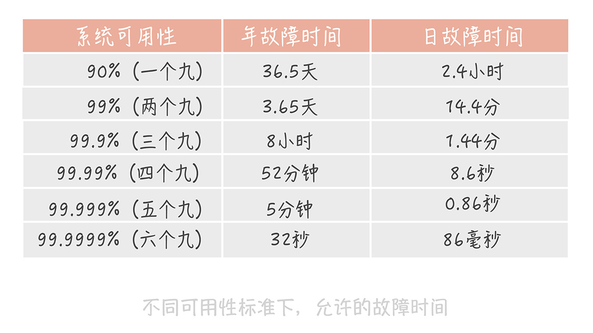
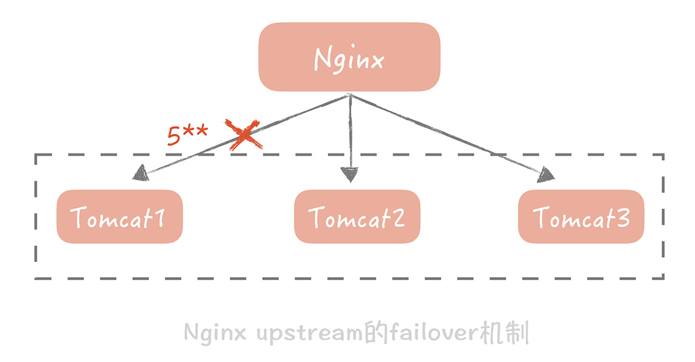

# 04 系统设计目标（二）：系统怎样做到高可用？

你好，我是唐扬。

开课之后，有同学反馈说课程中偏理论知识的讲解比较多，希望看到实例。我一直关注这些声音，也感谢你提出的建议，在 04 讲的开篇，我想对此作出一些回应。

在课程设计时，我主要想用基础篇中的前五讲内容带你了解一些关于高并发系统设计的基本概念，期望能帮你建立一个整体的框架，这样方便在后面的演进篇和实战篇中对涉及的知识点做逐一的展开和延伸。比方说，本节课提到了降级，那我会在运维篇中以案例的方式详细介绍降级方案的种类以及适用的场景，之所以这么设计是期望通过前面少量的篇幅把课程先串起来，以点带面，逐步展开。

当然，不同的声音是我后续不断优化课程内容的动力，我会认真对待每一条建议，不断优化课程，与你一起努力、进步。

接下来，让我们正式进入课程。

本节课，我会继续带你了解高并发系统设计的第二个目标——高可用性。你需要在本节课对提升系统可用性的思路和方法有一个直观的了解，这样，当后续对点讲解这些内容时，你能马上反应过来，你的系统在遇到可用性的问题时，也能参考这些方法进行优化。

**高可用性（High Availability，HA）** 是你在系统设计时经常会听到的一个名词，它指的是系统具备较高的无故障运行的能力。

我们在很多开源组件的文档中看到的 HA 方案就是提升组件可用性，让系统免于宕机无法服务的方案。比如，你知道 Hadoop 1.0 中的 NameNode 是单点的，一旦发生故障则整个集群就会不可用；而在 Hadoop2 中提出的 NameNode HA 方案就是同时启动两个 NameNode，一个处于 Active 状态，另一个处于 Standby 状态，两者共享存储，一旦 Active NameNode 发生故障，则可以将 Standby NameNode 切换成 Active 状态继续提供服务，这样就增强了 Hadoop 的持续无故障运行的能力，也就是提升了它的可用性。

通常来讲，一个高并发大流量的系统，系统出现故障比系统性能低更损伤用户的使用体验。想象一下，一个日活用户过百万的系统，一分钟的故障可能会影响到上千的用户。而且随着系统日活的增加，一分钟的故障时间影响到的用户数也随之增加，系统对于可用性的要求也会更高。所以今天，我就带你了解一下在高并发下，我们如何来保证系统的高可用性，以便给你的系统设计提供一些思路。

## 可用性的度量

可用性是一个抽象的概念，你需要知道要如何来度量它，与之相关的概念是： **MTBF 和 MTTR。**  **MTBF（Mean Time Between Failure）** 是平均故障间隔的意思，代表两次故障的间隔时间，也就是系统正常运转的平均时间。这个时间越长，系统稳定性越高。

**MTTR（Mean Time To Repair）** 表示故障的平均恢复时间，也可以理解为平均故障时间。这个值越小，故障对于用户的影响越小。

可用性与 MTBF 和 MTTR 的值息息相关，我们可以用下面的公式表示它们之间的关系：

> Availability = MTBF / (MTBF + MTTR)

这个公式计算出的结果是一个比例，而这个比例代表着系统的可用性。一般来说，我们会使用几个九来描述系统的可用性。

其实通过这张图你可以发现，一个九和两个九的可用性是很容易达到的，只要没有蓝翔技校的铲车搞破坏，基本上可以通过人肉运维的方式实现。

三个九之后，系统的年故障时间从 3 天锐减到 8 小时。到了四个九之后，年故障时间缩减到 1 小时之内。在这个级别的可用性下，你可能需要建立完善的运维值班体系、故障处理流程和业务变更流程。你可能还需要在系统设计上有更多的考虑。比如，在开发中你要考虑，如果发生故障，是否不用人工介入就能自动恢复。当然了，在工具建设方面，你也需要多加完善，以便快速排查故障原因，让系统快速恢复。

到达五个九之后，故障就不能靠人力恢复了。想象一下，从故障发生到你接收报警，再到你打开电脑登录服务器处理问题，时间可能早就过了十分钟了。所以这个级别的可用性考察的是系统的容灾和自动恢复的能力，让机器来处理故障，才会让可用性指标提升一个档次。

一般来说，我们的核心业务系统的可用性，需要达到四个九，非核心系统的可用性最多容忍到三个九。在实际工作中，你可能听到过类似的说法，只是不同级别，不同业务场景的系统对于可用性要求是不一样的。

目前，你已经对可用性的评估指标有了一定程度的了解了，接下来，我们来看一看高可用的系统设计需要考虑哪些因素。

## 高可用系统设计的思路

一个成熟系统的可用性需要从系统设计和系统运维两方面来做保障，两者共同作用，缺一不可。那么如何从这两方面入手，解决系统高可用的问题呢？

#### 1. 系统设计

“Design for failure”是我们做高可用系统设计时秉持的第一原则。在承担百万 QPS 的高并发系统中，集群中机器的数量成百上千台，单机的故障是常态，几乎每一天都有发生故障的可能。

未雨绸缪才能决胜千里。我们在做系统设计的时候，要把发生故障作为一个重要的考虑点，预先考虑如何自动化地发现故障，发生故障之后要如何解决。当然了，除了要有未雨绸缪的思维之外，我们还需要掌握一些具体的优化方法，比如 **failover（故障转移）、超时控制以及降级和限流。**

一般来说，发生 failover 的节点可能有两种情况：

\\1. 是在完全对等的节点之间做 failover。 \\2. 是在不对等的节点之间，即系统中存在主节点也存在备节点。

在对等节点之间做 failover 相对来说简单些。在这类系统中所有节点都承担读写流量，并且节点中不保存状态，每个节点都可以作为另一个节点的镜像。在这种情况下，如果访问某一个节点失败，那么简单地随机访问另一个节点就好了。

举个例子，Nginx 可以配置当某一个 Tomcat 出现大于 500 的请求的时候，重试请求另一个 Tomcat 节点，就像下面这样：

针对不对等节点的 failover 机制会复杂很多。比方说我们有一个主节点，有多台备用节点，这些备用节点可以是热备（同样在线提供服务的备用节点），也可以是冷备（只作为备份使用），那么我们就需要在代码中控制如何检测主备机器是否故障，以及如何做主备切换。

使用最广泛的故障检测机制是“心跳”。你可以在客户端上定期地向主节点发送心跳包，也可以从备份节点上定期发送心跳包。当一段时间内未收到心跳包，就可以认为主节点已经发生故障，可以触发选主的操作。

选主的结果需要在多个备份节点上达成一致，所以会使用某一种分布式一致性算法，比方说 Paxos，Raft。

除了故障转移以外，对于系统间调用超时的控制也是高可用系统设计的一个重要考虑方面。

复杂的高并发系统通常会有很多的系统模块组成，同时也会依赖很多的组件和服务，比如说缓存组件，队列服务等等。它们之间的调用最怕的就是延迟而非失败，因为失败通常是瞬时的，可以通过重试的方式解决。而一旦调用某一个模块或者服务发生比较大的延迟，调用方就会阻塞在这次调用上，它已经占用的资源得不到释放。当存在大量这种阻塞请求时，调用方就会因为用尽资源而挂掉。

在系统开发的初期，超时控制通常不被重视，或者是没有方式来确定正确的超时时间。

**我之前经历过一个项目，** 模块之间通过 RPC 框架来调用，超时时间是默认的 30 秒。平时系统运行得非常稳定，可是一旦遇到比较大的流量，RPC 服务端出现一定数量慢请求的时候，RPC 客户端线程就会大量阻塞在这些慢请求上长达 30 秒，造成 RPC 客户端用尽调用线程而挂掉。后面我们在故障复盘的时候发现这个问题后，调整了 RPC，数据库，缓存以及调用第三方服务的超时时间，这样在出现慢请求的时候可以触发超时，就不会造成整体系统雪崩。

既然要做超时控制，那么我们怎么来确定超时时间呢？这是一个比较困难的问题。

超时时间短了，会造成大量的超时错误，对用户体验产生影响；超时时间长了，又起不到作用。**我建议你通过收集系统之间的调用日志，统计比如说 99% 的响应时间是怎样的，然后依据这个时间来指定超时时间。** 如果没有调用的日志，那么你只能按照经验值来指定超时时间。不过，无论你使用哪种方式，超时时间都不是一成不变的，需要在后面的系统维护过程中不断地修改。

超时控制实际上就是不让请求一直保持，而是在经过一定时间之后让请求失败，释放资源给接下来的请求使用。这对于用户来说是有损的，但是却是必要的，因为它牺牲了少量的请求却保证了整体系统的可用性。而我们还有另外两种有损的方案能保证系统的高可用，它们就是降级和限流。

**降级是为了保证核心服务的稳定而牺牲非核心服务的做法。** 比方说我们发一条微博会先经过反垃圾服务检测，检测内容是否是广告，通过后才会完成诸如写数据库等逻辑。

反垃圾的检测是一个相对比较重的操作，因为涉及到非常多的策略匹配，在日常流量下虽然会比较耗时却还能正常响应。但是当并发较高的情况下，它就有可能成为瓶颈，而且它也不是发布微博的主体流程，所以我们可以暂时关闭反垃圾服务检测，这样就可以保证主体的流程更加稳定。

**限流完全是另外一种思路，** 它通过对并发的请求进行限速来保护系统。

比如对于 Web 应用，我限制单机只能处理每秒 1000 次的请求，超过的部分直接返回错误给客户端。虽然这种做法损害了用户的使用体验，但是它是在极端并发下的无奈之举，是短暂的行为，因此是可以接受的。

实际上，无论是降级还是限流，在细节上还有很多可供探讨的地方，我会在后面的课程中，随着系统的不断演进深入地剖析，在基础篇里就不多说了。

#### 2. 系统运维

在系统设计阶段为了保证系统的可用性可以采取上面的几种方法，那在系统运维的层面又能做哪些事情呢？其实，我们可以从 **灰度发布、故障演练** 两个方面来考虑如何提升系统的可用性。

你应该知道，在业务平稳运行过程中，系统是很少发生故障的，90% 的故障是发生在上线变更阶段的。比方说，你上了一个新的功能，由于设计方案的问题，数据库的慢请求数翻了一倍，导致系统请求被拖慢而产生故障。

如果没有变更，数据库怎么会无缘无故地产生那么多的慢请求呢？因此，为了提升系统的可用性，重视变更管理尤为重要。而除了提供必要回滚方案，以便在出现问题时快速回滚恢复之外，**另一个主要的手段就是灰度发布。** 灰度发布指的是系统的变更不是一次性地推到线上的，而是按照一定比例逐步推进的。一般情况下，灰度发布是以机器维度进行的。比方说，我们先在 10% 的机器上进行变更，同时观察 Dashboard 上的系统性能指标以及错误日志。如果运行了一段时间之后系统指标比较平稳并且没有出现大量的错误日志，那么再推动全量变更。

灰度发布给了开发和运维同学绝佳的机会，让他们能在线上流量上观察变更带来的影响，是保证系统高可用的重要关卡。

灰度发布是在系统正常运行条件下，保证系统高可用的运维手段，那么我们如何知道发生故障时系统的表现呢？这里就要依靠另外一个手段： **故障演练。**

故障演练指的是对系统进行一些破坏性的手段，观察在出现局部故障时，整体的系统表现是怎样的，从而发现系统中存在的，潜在的可用性问题。

一个复杂的高并发系统依赖了太多的组件，比方说磁盘，数据库，网卡等，这些组件随时随地都可能会发生故障，而一旦它们发生故障，会不会如蝴蝶效应一般造成整体服务不可用呢？我们并不知道，因此，故障演练尤为重要。

在我来看，**故障演练和时下比较流行的“混沌工程”的思路如出一辙，** 作为混沌工程的鼻祖，Netfix 在 2010 年推出的“Chaos Monkey”工具就是故障演练绝佳的工具。它通过在线上系统上随机地关闭线上节点来模拟故障，让工程师可以了解，在出现此类故障时会有什么样的影响。

当然，这一切是以你的系统可以抵御一些异常情况为前提的。如果你的系统还没有做到这一点，那么 **我建议你** 另外搭建一套和线上部署结构一模一样的线下系统，然后在这套系统上做故障演练，从而避免对生产系统造成影响。

## 课程小结

本节课我带你了解了如何度量系统的可用性，以及在做高并发系统设计时如何来保证高可用。

说了这么多，你可以看到从开发和运维角度上来看，提升可用性的方法是不同的：

- **开发** 注重的是如何处理故障，关键词是冗余和取舍。冗余指的是有备用节点，集群来顶替出故障的服务，比如文中提到的故障转移，还有多活架构等等；取舍指的是丢卒保车，保障主体服务的安全。
- 从 **运维角度** 来看则更偏保守，注重的是如何避免故障的发生，比如更关注变更管理以及如何做故障的演练。

两者结合起来才能组成一套完善的高可用体系。

**你还需要注意的是，** 提高系统的可用性有时候是以牺牲用户体验或者是牺牲系统性能为前提的，也需要大量人力来建设相应的系统，完善机制。所以我们要把握一个度，不该做过度的优化。就像我在文中提到的，核心系统四个九的可用性已经可以满足需求，就没有必要一味地追求五个九甚至六个九的可用性。

另外，一般的系统或者组件都是追求极致的性能的，那么有没有不追求性能，只追求极致的可用性的呢？答案是有的。比如配置下发的系统，它只需要在其它系统启动时提供一份配置即可，所以秒级返回也可，十秒钟也 OK，无非就是增加了其它系统的启动速度而已。但是，它对可用性的要求是极高的，甚至会到六个九，原因是配置可以获取的慢，但是不能获取不到。**我给你举这个例子是想让你了解，** 可用性和性能有时候是需要做取舍的，但如何取舍就要视不同的系统而定，不能一概而论了。
