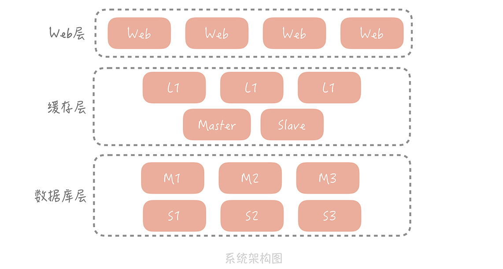
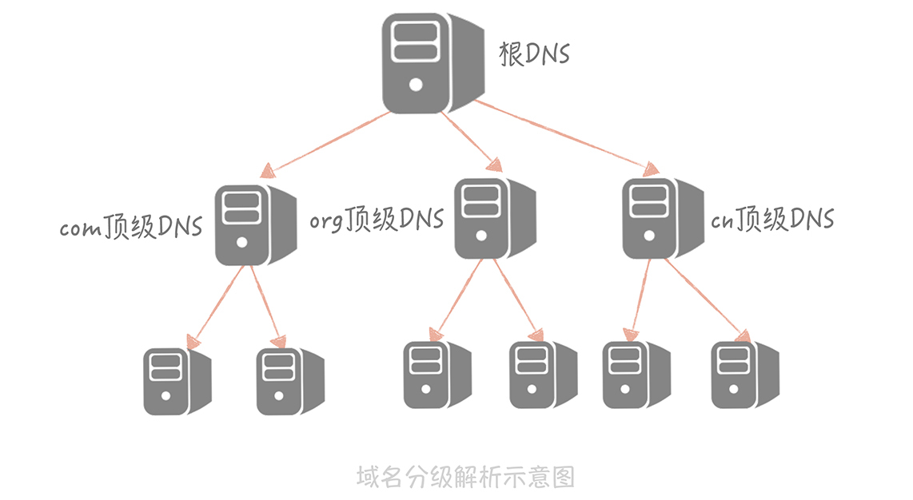
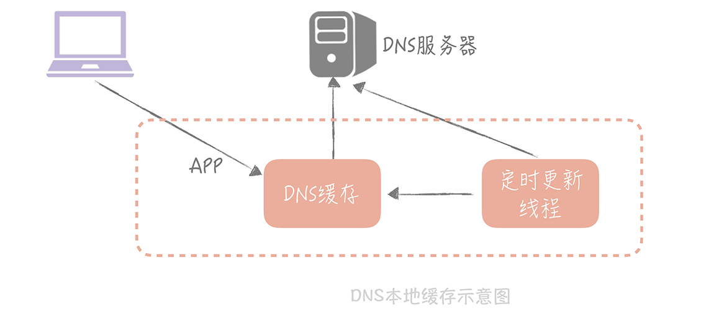
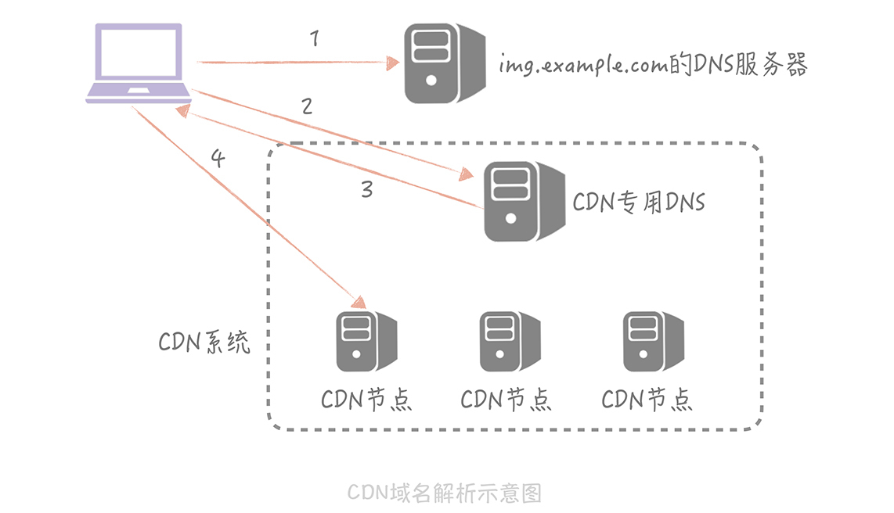
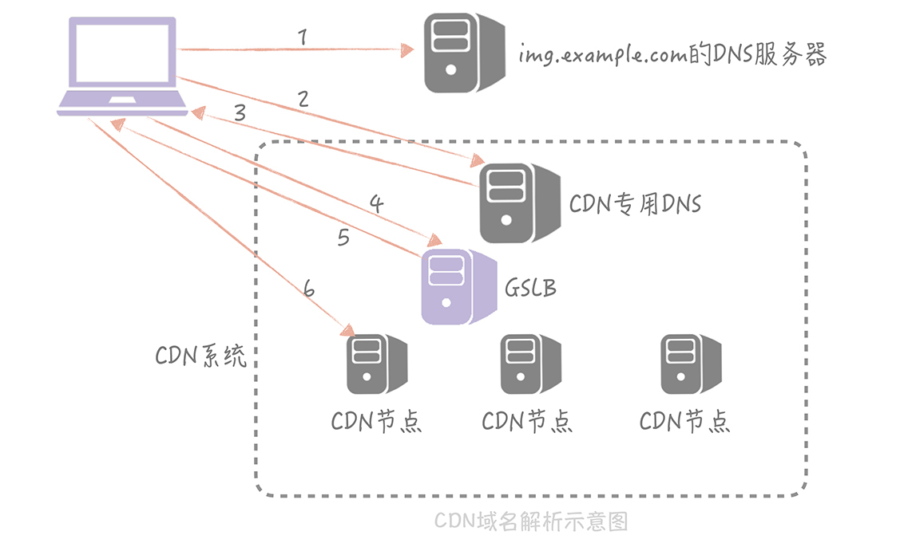

# 16 CDN：静态资源如何加速？

你好，我是唐扬。

前面几节课，我带你了解了缓存的定义以及常用缓存的使用姿势，现在，你应该对包括本地缓存、分布式缓存等缓存组件的适用场景和使用技巧有了一定了解了。结合在14 讲中我提到的客户端高可用方案，你会将单个缓存节点扩展为高可用的缓存集群，现在，你的电商系统架构演变成了下面这样：

在这个架构中我们使用分布式缓存对动态请求数据的读取做了加速，但是在我们的系统中存在着大量的静态资源请求：

\\1. 对于移动 APP 来说，这些静态资源主要是图片、视频和流媒体信息。

\\2. 对于 Web 网站来说，则包括了 JavaScript 文件，CSS 文件，静态 HTML 文件等等。

具体到你的电商系统来说，商品的图片，介绍商品使用方法的视频等等静态资源，现在都放在了 Nginx 等 Web 服务器上，它们的读请求量极大，并且对访问速度的要求很高，并且占据了很高的带宽，这时会出现访问速度慢，带宽被占满影响动态请求的问题， **那么你就需要考虑如何针对这些静态资源进行读加速了。**

## 静态资源加速的考虑点

你可能会问：“我们是否也可以使用分布式缓存来解决这个问题呢？”答案是否定的。一般来说，图片和视频的大小会在几兆到几百兆之间不等，如果我们的应用服务器和分布式缓存都部署在北京的机房里，这时一个杭州的用户要访问缓存中的一个视频，那这个视频文件就需要从北京传输到杭州，期间会经过多个公网骨干网络，延迟很高，会让用户感觉视频打开很慢，严重影响到用户的使用体验。

所以，静态资源访问的关键点是 **就近访问，** 即北京用户访问北京的数据，杭州用户访问杭州的数据，这样才可以达到性能的最优。

你可能会说：“那我们在杭州也自建一个机房，让用户访问杭州机房的数据就好了呀。”可用户遍布在全国各地，有些应用可能还有国外的用户，我们不可能在每个地域都自建机房，这样成本太高了。

另外，单个视频和图片等静态资源很大，并且访问量又极高，如果使用业务服务器和分布式缓存来承担这些流量，无论是对于内网还是外网的带宽都会是很大的考验。

所以我们考虑在业务服务器的上层，增加一层特殊的缓存，用来承担绝大部分对于静态资源的访问，这一层特殊缓存的节点需要遍布在全国各地，这样可以让用户选择最近的节点访问。缓存的命中率也需要一定的保证，尽量减少访问资源存储源站的请求数量（回源请求）。 **这一层缓存就是我们这节课的重点：CDN。**

## CDN 的关键技术

CDN（Content Delivery Network/Content Distribution Network，内容分发网络）。简单来说，CDN 就是将静态的资源分发到，位于多个地理位置机房中的服务器上，因此它能很好地解决数据就近访问的问题，也就加快了静态资源的访问速度。

在大中型公司里面，CDN 的应用非常的普遍，大公司为了提供更稳定的 CDN 服务会选择自建 CDN，而大部分公司基于成本的考虑还是会选择专业的 CDN 厂商，网宿、阿里云、腾讯云、蓝汛等等，其中网宿和蓝汛是老牌的 CDN 厂商，阿里云和腾讯云是云厂商提供的服务，如果你的服务部署在云上可以选择相应云厂商的 CDN 服务，这些 CDN 厂商都是现今行业内比较主流的。

对于 CDN 来说，你可能已经从运维的口中听说过，并且也了解了它的作用。但是当让你来配置 CDN 或者是排查 CDN 方面的问题时，你就有可能因为不了解它的原理而束手无策了。

所以，我先来带你了解一下，要搭建一个 CDN 系统需要考虑哪两点：

\\1. 如何将用户的请求映射到 CDN 节点上；

\\2. 如何根据用户的地理位置信息选择到比较近的节点。

下面我就带你具体了解一下 CDN 系统是如何实现加速用户对于静态资源的请求的。

### 1. 如何让用户的请求到达 CDN 节点

首先，我们考虑一下如何让用户的请求到达 CDN 节点，你可能会觉得，这很简单啊，只需要告诉用户 CDN 节点的 IP 地址，然后请求这个 IP 地址上面部署的 CDN 服务就可以了啊。 **但是这样会有一个问题：** 就是我们使用的是第三方厂商的 CDN 服务，CDN 厂商会给我们一个 CDN 的节点 IP，比如说这个 IP 地址是“111.202.34.130”，那么我们的电商系统中的图片的地址很可能是这样的：“<http://111.202.34.130/1.jpg%E2%80%9D>, 这个地址是要存储在数据库中的。

那么如果这个节点 IP 发生了变更怎么办？或者我们如果更改了 CDN 厂商怎么办？是不是要修改所有的商品的 url 域名呢？这就是一个比较大的工作量了。所以，我们要做的事情是将第三方厂商提供的 IP 隐藏起来，给到用户的最好是一个本公司域名的子域名。

**那么如何做到这一点呢？** 这就需要依靠 DNS 来帮我们解决域名映射的问题了。

DNS（Domain Name System，域名系统）实际上就是一个存储域名和 IP 地址对应关系的分布式数据库。而域名解析的结果一般有两种，一种叫做“A 记录”，返回的是域名对应的 IP 地址；另一种是“CNAME 记录”，返回的是另一个域名，也就是说当前域名的解析要跳转到另一个域名的解析上，实际上 \<www.baidu.com> 域名的解析结果就是一个 CNAME 记录，域名的解析被跳转到 \<www.a.shifen.com> 上了，我们正是利用 CNAME 记录来解决域名映射问题的， **具体是怎么解决的呢？我给你举个例子。**

比如你的公司的一级域名叫做 example.com，那么你可以给你的图片服务的域名定义为“img.example.com”，然后将这个域名的解析结果的 CNAME 配置到 CDN 提供的域名上，比如 uclound 可能会提供一个域名是“80f21f91.cdn.ucloud.com.cn”这个域名。这样你的电商系统使用的图片地址可以是“<http://img.example.com/1.jpg%E2%80%9D%E3%80%82>

用户在请求这个地址时，DNS 服务器会将域名解析到 80f21f91.cdn.ucloud.com.cn 域名上，然后再将这个域名解析为 CDN 的节点 IP，这样就可以得到 CDN 上面的资源数据了。

**不过，这里面有一个问题：** 因为域名解析过程是分级的，每一级有专门的域名服务器承担解析的职责，所以，域名的解析过程有可能需要跨越公网做多次 DNS 查询，在性能上是比较差的。

从“ 域名分级解析示意图”中你可以看出 DNS 分为很多种，有根 DNS，顶级 DNS 等等。除此之外还有两种 DNS 需要特别留意：一种是 Local DNS，它是由你的运营商提供的 DNS，一般域名解析的第一站会到这里；另一种是权威 DNS，它的含义是自身数据库中存储了这个域名对应关系的 DNS。

下面我以 \<www.baidu.com> 这个域名为例给你简单介绍一下域名解析的过程：

一开始，域名解析请求先会检查本机的 hosts 文件，查看是否有 \<www.baidu.com> 对应的 IP；

如果没有的话，就请求 Local DNS 是否有域名解析结果的缓存，如果有就返回，标识是从非权威 DNS 返回的结果；

如果没有，就开始 DNS 的迭代查询。先请求根 DNS，根 DNS 返回顶级 DNS（.com）的地址；xn--36qy46dznw.com 顶级 DNS，得到 baidu.com 的域名服务器地址；再从 baidu.com 的域名服务器中查询到 \<www.baidu.com> 对应的 IP 地址，返回这个 IP 地址的同时，标记这个结果是来自于权威 DNS 的结果，同时写入 Local DNS 的解析结果缓存，这样下一次的解析同一个域名就不需要做 DNS 的迭代查询了。

经过了向多个 DNS 服务器做查询之后，整个 DNS 的解析的时间有可能会到秒级别， **那么我们如何来解决这个性能问题呢？**  **一个解决的思路是：** 在 APP 启动时，对需要解析的域名做预先解析，然后把解析的结果缓存到本地的一个 LRU 缓存里面。这样当我们要使用这个域名的时候，只需要从缓存中直接拿到所需要的 IP 地址就好了，如果缓存中不存在才会走整个 DNS 查询的过程。 **同时，** 为了避免 DNS 解析结果的变更造成缓存内数据失效，我们可以启动一个定时器，定期地更新缓存中的数据。

**我曾经测试过这种方式，** 对于 HTTP 请求的响应时间的提升是很明显的，原先 DNS 解析时间经常会超过 1s，使用这种方式后，DNS 解析时间可以控制在 200ms 之内，整个 HTTP 请求的过程也可以减少大概 80ms～100ms。

**这里总结一下，** 将用户的请求映射到 CDN 服务器上，是使用 CDN 时需要解决的一个核心的问题，而 CNAME 记录在 DNS 解析过程中可以充当一个中间代理层的角色，可以把将用户最初使用的域名代理到正确的 IP 地址上。图片:

现在，剩下的一个问题就是如何找到更近的 CDN 节点了，而 GSLB 承担了这个职责。

### 2. 如何找到离用户最近的 CDN 节点

GSLB（Global Server Load Balance，全局负载均衡）, 它的含义是对于部署在不同地域的服务器之间做负载均衡，下面可能管理了很多的本地负载均衡组件。 **它有两方面的作用：**

一方面，它是一种负载均衡服务器，负载均衡，顾名思义嘛，指的是让流量平均分配使得下面管理的服务器的负载更平均；

另一方面，它还需要保证流量流经的服务器与流量源头在地缘上是比较接近的。

GSLB 可以通过多种策略，来保证返回的 CDN 节点和用户尽量保证在同一地缘区域，比如说可以将用户的 IP 地址按照地理位置划分为若干的区域，然后将 CDN 节点对应到一个区域上，然后根据用户所在区域来返回合适的节点；也可以通过发送数据包测量 RTT 的方式来决定返回哪一个节点。 **不过，这些原理不是本节课重点内容，** 你了解一下就可以了，我不做详细的介绍。

有了 GSLB 之后，节点的解析过程变成了下图中的样子：

**当然，是否能够从 CDN 节点上获取到资源还取决于 CDN 的同步延时。** 一般，我们会通过 CDN 厂商的接口将静态的资源写入到某一个 CDN 节点上，再由 CDN 内部的同步机制将资源分散同步到每个 CDN 节点，即使 CDN 内部网络经过了优化，这个同步的过程是有延时的，一旦我们无法从选定的 CDN 节点上获取到数据，我们就不得不从源站获取数据，而用户网络到源站的网络可能会跨越多个主干网，这样不仅性能上有损耗，也会消耗源站的带宽，带来更高的研发成本。所以，我们在使用 CDN 的时候需要关注 CDN 的命中率和源站的带宽情况。

## 课程小结

本节课，我主要带你了解了 CDN 对静态资源进行加速的原理和使用的核心技术，这里你需要了解的重点有以下几点：

1.DNS 技术是 CDN 实现中使用的核心技术，可以将用户的请求映射到 CDN 节点上；

2.DNS 解析结果需要做本地缓存，降低 DNS 解析过程的响应时间；

3.GSLB 可以给用户返回一个离着他更近的节点，加快静态资源的访问速度。

作为一个服务端开发人员，你可能会忽略 CDN 的重要性，对于偶尔出现的 CDN 问题嗤之以鼻，觉得这个不是我们应该关心的内容， **这种想法是错的。**

CDN 是我们系统的门面，其缓存的静态数据，如图片和视频数据的请求量很可能是接口请求数据的几倍甚至更高，一旦发生故障，对于整体系统的影响是巨大的。另外 CDN 的带宽历来是我们研发成本的大头， **尤其是目前处于小视频和直播风口上，** 大量的小视频和直播研发团队都在绞尽脑汁地减少 CDN 的成本。由此看出，CDN 是我们整体系统至关重要的组成部分，而它作为一种特殊的缓存，其命中率和可用性也是我们服务端开发人员需要重点关注的指标。
