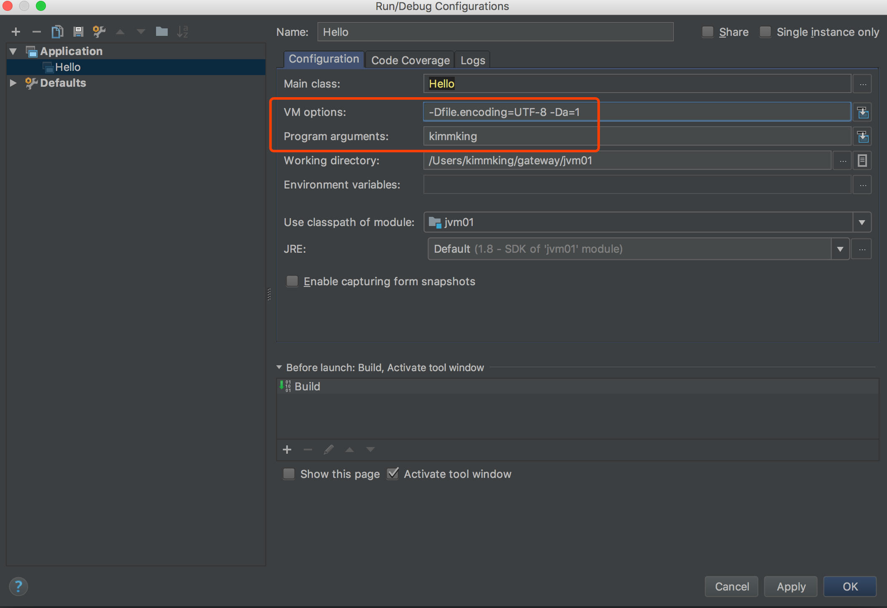

# 08 JVM 启动参数详解：博观而约取、厚积而薄发

JVM 作为一个通用的虚拟机，我们可以通过启动 Java 命令时指定不同的 JVM 参数，让 JVM 调整自己的运行状态和行为，内存管理和垃圾回收的 GC 算法，添加和处理调试和诊断信息等等。本节概括地讲讲 JVM 参数，对于 GC 相关的详细参数将在后续的 GC 章节说明和分析。

直接通过命令行启动 Java 程序的格式为:

```shell
java [options] classname [args]
java [options] -jar filename [args]
```

其中:

- `[options]` 部分称为 "JVM 选项",对应 IDE 中的 VM options, 可用 `jps -v` 查看。
- `[args]` 部分是指 "传给main函数的参数", 对应 IDE 中的 Program arguments, 可用 `jps -m` 查看。

如果是使用 Tomcat 之类自带 startup.sh 等启动脚本的程序，我们一般把相关参数都放到一个脚本定义的 JAVA_OPTS 环境变量中，最后脚本启动 JVM 时会把 JAVA_OPTS 变量里的所有参数都加到命令的合适位置。

如果是在 IDEA 之类的 IDE 里运行的话，则可以在“Run/Debug Configurations”里看到 VM 选项和程序参数两个可以输入参数的地方，直接输入即可。



上图输入了两个 VM 参数，都是环境变量，一个是指定文件编码使用 UTF-8，一个是设置了环境变量 a 的值为 1。

Java 和 JDK 内置的工具，指定参数时都是一个 `-`，不管是长参数还是短参数。有时候，JVM 启动参数和 Java 程序启动参数，并没必要严格区分，大致知道都是一个概念即可。

JVM 的启动参数, 从形式上可以简单分为：

- 以`-`开头为标准参数，所有的 JVM 都要实现这些参数，并且向后兼容。
- 以`-X`开头为非标准参数， 基本都是传给 JVM 的，默认 JVM 实现这些参数的功能，但是并不保证所有 JVM 实现都满足，且不保证向后兼容。
- 以`-XX:`开头为非稳定参数, 专门用于控制 JVM 的行为，跟具体的 JVM 实现有关，随时可能会在下个版本取消。
- `-XX:+-Flags` 形式, `+-` 是对布尔值进行开关。
- `-XX:key=value` 形式, 指定某个选项的值。

实际上，直接在命令行输入 java，然后回车，就会看到 java 命令可以其使用的参数列表说明：

```java
$ java
用法: java [-options] class [args...]
           (执行类)
   或 java [-options] -jar jarfile [args...]
           (执行 jar 文件)
其中选项包括:
    -d32 使用 32 位数据模型 (如果可用)
    -d64 使用 64 位数据模型 (如果可用)
    -server 选择 "server" VM
                  默认 VM 是 server,
                  因为您是在服务器类计算机上运行。
    -cp <目录和 zip/jar 文件的类搜索路径>
    -classpath <目录和 zip/jar 文件的类搜索路径>
                  用 : 分隔的目录, JAR 档案
                  和 ZIP 档案列表, 用于搜索类文件。
    -D<名称>=<值>
                  设置系统属性
    -verbose:[class|gc|jni]
                  启用详细输出
    -version 输出产品版本并退出
    -version:<值>
                  警告: 此功能已过时, 将在
                  未来发行版中删除。
                  需要指定的版本才能运行
    -showversion 输出产品版本并继续
    -jre-restrict-search | -no-jre-restrict-search
                  警告: 此功能已过时, 将在
                  未来发行版中删除。
                  在版本搜索中包括/排除用户专用 JRE
    -? -help 输出此帮助消息
    -X 输出非标准选项的帮助
    -ea[:<packagename>...|:<classname>]
    -enableassertions[:<packagename>...|:<classname>]
                  按指定的粒度启用断言
    -da[:<packagename>...|:<classname>]
    -disableassertions[:<packagename>...|:<classname>]
                  禁用具有指定粒度的断言
    -esa | -enablesystemassertions
                  启用系统断言
    -dsa | -disablesystemassertions
                  禁用系统断言
    -agentlib:<libname>[=<选项>]
                  加载本机代理库 <libname>, 例如 -agentlib:hprof
                  另请参阅 -agentlib:jdwp=help 和 -agentlib:hprof=help
    -agentpath:<pathname>[=<选项>]
                  按完整路径名加载本机代理库
    -javaagent:<jarpath>[=<选项>]
                  加载 Java 编程语言代理, 请参阅 java.lang.instrument
    -splash:<imagepath>
                  使用指定的图像显示启动屏幕
有关详细信息, 请参阅 http://www.oracle.com/technetwork/java/javase/documentation/index.html。
```

### 7.1 设置系统属性

当我们给一个 Java 程序传递参数，最常用的方法有两种：

- 系统属性，有时候也叫环境变量，例如直接给 JVM 传递指定的系统属性参数，需要使用 `-Dkey=value` 这种形式，此时如果系统的环境变量里不管有没有指定这个参数，都会以这里的为准。
- 命令行参数，直接通过命令后面添加的参数，比如运行 Hello 类，同时传递 2 个参数 kimm、king：`java Hello kimm king`，然后在Hello类的 main 方法的参数里可以拿到一个字符串的参数数组，有两个字符串，kimm 和 king。

比如我们常见的设置 $JAVA_HOME 就是一个环境变量，只要在当前命令执行的上下文里有这个环境变量，就可以在启动的任意程序里，通过相关 API 拿到这个参数，比如 Java 里：

`System.getProperty("key")`来获取这个变量的值，这样就可以做到多个不同的应用进程可以共享这些变量，不用每个都重复设置，也可以实现简化 Java 命令行的长度（想想要是配置了 50 个参数多恐怖，放到环境变量里，可以简化启动输入的字符）。此外，由于环境变量的 key-value 的形式，所以不管是环境上下文里配置的，还是通过运行时`-D`来指定，都可以不在意参数的顺序，而命令行参数就必须要注意顺序，顺序错误就会导致程序错误。

例如指定随机数熵源(Entropy Source)，示例:

```shell
JAVA_OPTS="-Djava.security.egd=file:/dev/./urandom"
```

此外还有一些常见设置：

```plaintext
 -Duser.timezone=GMT+08  // 设置用户的时区为东八区
 -Dfile.encoding=UTF-8      // 设置默认的文件编码为UTF-8
```

查看默认的所有系统属性，可以使用命令：

```java
$ java -XshowSettings:properties -version
Property settings:
    awt.toolkit = sun.lwawt.macosx.LWCToolkit
    file.encoding = UTF-8
    file.encoding.pkg = sun.io
    file.separator = /
    gopherProxySet = false
    java.awt.graphicsenv = sun.awt.CGraphicsEnvironment
    java.awt.printerjob = sun.lwawt.macosx.CPrinterJob
    java.class.path = .
    java.class.version = 52.0
...... 省略了几十行
```

同样可以查看 VM 设置：

```java
$ java -XshowSettings:vm -version
VM settings:
    Max. Heap Size (Estimated): 1.78G
    Ergonomics Machine Class: server
    Using VM: Java HotSpot(TM) 64-Bit Server VM
......
```

查看当前 JDK/JRE 的默认显示语言设置：

```java
java -XshowSettings:locale -version
Locale settings:
    default locale = 中文
    default display locale = 中文 (中国)
    default format locale = 英文 (中国)
    available locales = , ar, ar_AE, ar_BH, ar_DZ, ar_EG, ar_IQ, ar_JO,
        ar_KW, ar_LB, ar_LY, ar_MA, ar_OM, ar_QA, ar_SA, ar_SD,
 ......
```

还有常见的，我们使用 mvn 脚本去执行编译的同时，如果不想编译和执行单元测试代码：

> $ mvn package -Djava.test.skip=true

或者

> $ mvn package -DskipTests

等等，很多地方会用设置系统属性的方式去传递数据给Java程序，而不是直接用程序参数的方式。

### 7.2 Agent 相关的选项

Agent 是 JVM 中的一项黑科技, 可以通过无侵入方式来做很多事情，比如注入 AOP 代码，执行统计等等，权限非常大。这里简单介绍一下配置选项，详细功能在后续章节会详细讲。

设置 agent 的语法如下:

- `-agentlib:libname[=options]` 启用native方式的agent, 参考 `LD_LIBRARY_PATH` 路径。
- `-agentpath:pathname[=options]` 启用native方式的agent。
- `-javaagent:jarpath[=options]` 启用外部的agent库, 比如 `pinpoint.jar` 等等。
- `-Xnoagent` 则是禁用所有 agent。

以下示例开启 CPU 使用时间抽样分析:

```shell
JAVA_OPTS="-agentlib:hprof=cpu=samples,file=cpu.samples.log"
```

其中 hprof 是 JDK 内置的一个性能分析器。`cpu=samples` 会抽样在各个方法消耗的时间占比, Java 进程退出后会将分析结果输出到文件。

### 7.3 JVM 运行模式

JVM 有两种运行模式：

- `-server`：设置 jvm 使 server 模式，特点是启动速度比较慢，但运行时性能和内存管理效率很高，适用于生产环境。在具有 64 位能力的 jdk 环境下将默认启用该模式，而忽略 -client 参数。
- `-client` ：JDK1.7 之前在 32 位的 x86 机器上的默认值是 `-client` 选项。设置 jvm 使用 client 模式，特点是启动速度比较快，但运行时性能和内存管理效率不高，通常用于客户端应用程序或者PC应用开发和调试。

此外，我们知道 JVM 加载字节码后，可以解释执行，也可以编译成本地代码再执行，所以可以配置 JVM 对字节码的处理模式：

- `-Xint`：在解释模式（interpreted mode）下，-Xint 标记会强制 JVM 解释执行所有的字节码，这当然会降低运行速度，通常低 10 倍或更多。
- `-Xcomp`：-Xcomp 参数与 -Xint 正好相反，JVM 在第一次使用时会把所有的字节码编译成本地代码，从而带来最大程度的优化。
- `-Xmixed`：-Xmixed 是混合模式，将解释模式和变异模式进行混合使用，有 JVM 自己决定，这是 JVM 的默认模式，也是推荐模式。 我们使用 `java -version` 可以看到 `mixed mode` 等信息。

示例:

```shell
JAVA_OPTS="-server"
```

### 7.4 设置堆内存

JVM 的内存设置是最重要的参数设置，也是 GC 分析和调优的重点。

> JVM 总内存=堆+栈+非堆+堆外内存。

相关的参数：

- `-Xmx`, 指定最大堆内存。 如 `-Xmx4g`. 这只是限制了 Heap 部分的最大值为 4g。这个内存不包括栈内存，也不包括堆外使用的内存。
- `-Xms`, 指定堆内存空间的初始大小。 如 `-Xms4g`。 而且指定的内存大小，并不是操作系统实际分配的初始值，而是 GC 先规划好，用到才分配。 专用服务器上需要保持 `-Xms`和`-Xmx`一致，否则应用刚启动可能就有好几个 FullGC。当两者配置不一致时，堆内存扩容可能会导致性能抖动。
- `-Xmn`, 等价于 `-XX:NewSize`，使用 G1 垃圾收集器 **不应该** 设置该选项，在其他的某些业务场景下可以设置。官方建议设置为 `-Xmx` 的 `1/2 ~ 1/4`。
- `-XX:MaxPermSize=size`, 这是 JDK1.7 之前使用的。Java8 默认允许的 Meta 空间无限大，此参数无效。
- `-XX:MaxMetaspaceSize=size`, Java8 默认不限制 Meta 空间, 一般不允许设置该选项。
- `XX:MaxDirectMemorySize=size`，系统可以使用的最大堆外内存，这个参数跟`-Dsun.nio.MaxDirectMemorySize`效果相同。
- `-Xss`, 设置每个线程栈的字节数。 例如 `-Xss1m` 指定线程栈为 1MB，与`-XX:ThreadStackSize=1m`等价

这里要特别说一下堆外内存，也就是说不在堆上的内存，我们可以通过jconsole，jvisualvm 等工具查看。

RednaxelaFX 提到：

> 一个 Java 进程里面，可以分配 native memory 的东西有很多，特别是使用第三方 native 库的程序更是如此。

但在这里面除了

- GC heap = Java heap + Perm Gen（JDK \<= 7）
- Java thread stack = Java thread count * Xss
- other thread stack = other thread count * stack size
- CodeCache 等东西之外

还有诸如 HotSpot VM 自己的 StringTable、SymbolTable、SystemDictionary、CardTable、HandleArea、JNIHandleBlock 等许多数据结构是常驻内存的，外加诸如 JIT 编译器、GC 等在工作的时候都会额外临时分配一些 native memory，这些都是 HotSpot VM自己所分配的 native memory；在 JDK 类库实现中也有可能有些功能分配长期存活或者临时的 native memory。

然后就是各种第三方库的 native 部分分配的 native memory。

“Direct Memory”，一般来说是 Java NIO 使用的 Direct-X-Buffer（例如 DirectByteBuffer）所分配的 native memory，这个地方如果我们使用 netty 之类的框架，会产生大量的堆外内存。

示例:

```shell
JAVA_OPTS="-Xms28g -Xmx28g"
```

### 最佳实践

#### 配置多少 xmx 合适

从上面的分析可以看到，系统有大量的地方使用堆外内存，远比我们常说的 xmx 和 xms 包括的范围要广。所以我们需要在设置内存的时候留有余地。

实际上，我个人比较推荐配置系统或容器里可用内存的 70-80% 最好。比如说系统有 8G 物理内存，系统自己可能会用掉一点，大概还有 7.5G 可以用，那么建议配置

> -Xmx6g 说明：xmx : 7.5G\*0.8 = 6G，如果知道系统里有明确使用堆外内存的地方，还需要进一步降低这个值。

举个具体例子，我在过去的几个不同规模，不同发展时期，不同研发成熟度的公司研发团队，都发现过一个共同的 JVM 问题，就是线上经常有JVM实例突然崩溃，这个过程也许是三天，也可能是 2 周，异常信息也很明确，就是内存溢出 OOM。

运维人员不断加大堆内存或者云主机的物理内存，也无济于事，顶多让这个过程延缓。

大家怀疑内存泄露，但是看 GC 日志其实一直还挺正常，系统在性能测试环境也没什么问题，开发和运维还因此不断地发生矛盾和冲突。

其中有个运维同事为了缓解问题，通过一个多月的观察，持续地把一个没什么压力的服务器从 2 台逐渐扩展了 15 台，因为每天都有几台随机崩溃，他需要在系统通知到他去处理的这段时间，保证其他机器可以持续提供服务。

大家付出了很多努力，做了一些技术上的探索，还想了不少的歪招，但是没有解决问题，也就是说没有创造价值。

后来我去深入了解一下，几分钟就解决了问题，创造了技术的价值，把服务器又压缩回 2 台就可以保证系统稳定运行，业务持续可用了，降低成本带来的价值，也得到业务方和客户认可。

那么实际问题出在哪儿呢？一台云主机 4G 或 8G 内存，为了让 JVM 最大化的使用内存，服务部署的同事直接配置了xmx4g 或 xmx8g。因为他不知道 xmx 配置的内存和 JVM 可能使用的最大内存是不相等的。我让他把 8G 内存的云主机，设置 xmx6g，再也没出过问题，而且让他观察看到在 Java 进程最多的时候 JVM 进程使用了 7G 出头的内存（堆最多用 6g， java 进程自身、堆外空间都需要使用内存，这些内存不在 xmx 的范围内），而不包含 xmx 设置的 6g 内存内。

#### xmx 和 xms 是不是要配置成一致的

一般情况下，我们的服务器是专用的，就是一个机器（也可能是云主机或 docker 容器）只部署一个 Java 应用，这样的时候建议配置成一样的，好处是不会再动态去分配，如果内存不足（像上面的情况）上来就知道。

### 7.5 GC 日志相关的参数

在生产环境或性能压测环境里，我们用来分析和判断问题的重要数据来源之一就是 GC 日志，JVM 启动参数为我们提供了一些用于控制 GC 日志输出的选项。

- `-verbose:gc` ：和其他 GC 参数组合使用, 在 GC 日志中输出详细的GC信息。 包括每次 GC 前后各个内存池的大小，堆内存的大小，提升到老年代的大小，以及消耗的时间。此参数支持在运行过程中动态开关。比如使用 jcmd, jinfo， 以及使用 JMX 技术的其他客户端。
- `-XX:+PrintGCDetails` 和 `-XX:+PrintGCTimeStamps`：打印 GC 细节与发生时间。请关注我们后续的 GC 课程章节。
- `-Xloggc:file`：与`-verbose:gc`功能类似，只是将每次 GC 事件的相关情况记录到一个文件中，文件的位置最好在本地，以避免网络的潜在问题。若与 verbose:gc 命令同时出现在命令行中，则以 -Xloggc 为准。

示例:

```shell
export JAVA_OPTS="-Xms28g -Xmx28g -Xss1m \
-verbosegc -XX:+UseG1GC -XX:MaxGCPauseMillis=200 \
-XX:+HeapDumpOnOutOfMemoryError -XX:HeapDumpPath=/usr/local/"
```

### 7.6 指定垃圾收集器相关参数

垃圾回收器是 JVM 性能分析和调优的核心内容之一，也是近几个 JDK 版本大力发展和改进的地方。通过不同的 GC 算法和参数组合，配合其他调优手段，我们可以把系统精确校验到性能最佳状态。

以下参数指定具体的垃圾收集器，详细情况会在第二部分讲解：

- `-XX:+UseG1GC`：使用 G1 垃圾回收器
- `-XX:+UseConcMarkSweepGC`：使用 CMS 垃圾回收器
- `-XX:+UseSerialGC`：使用串行垃圾回收器
- `-XX:+UseParallelGC`：使用并行垃圾回收器

### 7.7 特殊情况执行脚本的参数

除了上面介绍的一些 JVM 参数，还有一些用于出现问题时提供诊断信息之类的参数。

- `-XX:+-HeapDumpOnOutOfMemoryError` 选项, 当 `OutOfMemoryError` 产生，即内存溢出(堆内存或持久代)时，自动 Dump 堆内存。 因为在运行时并没有什么开销, 所以在生产机器上是可以使用的。 示例用法: `java -XX:+HeapDumpOnOutOfMemoryError -Xmx256m ConsumeHeap`

```java
java.lang.OutOfMemoryError: Java heap space
Dumping heap to java_pid2262.hprof ...
......
```

- `-XX:HeapDumpPath` 选项, 与`HeapDumpOnOutOfMemoryError`搭配使用, 指定内存溢出时 Dump 文件的目录。 如果没有指定则默认为启动 Java 程序的工作目录。 示例用法: `java -XX:+HeapDumpOnOutOfMemoryError -XX:HeapDumpPath=/usr/local/ ConsumeHeap` 自动 Dump 的 hprof 文件会存储到 `/usr/local/` 目录下。
- `-XX:OnError` 选项, 发生致命错误时(fatal error)执行的脚本。 例如, 写一个脚本来记录出错时间, 执行一些命令, 或者 curl 一下某个在线报警的url. 示例用法: `java -XX:OnError="gdb - %p" MyApp` 可以发现有一个 `%p` 的格式化字符串，表示进程 PID。
- `-XX:OnOutOfMemoryError` 选项, 抛出 OutOfMemoryError 错误时执行的脚本。
- `-XX:ErrorFile=filename` 选项, 致命错误的日志文件名，绝对路径或者相对路径。

本节只简要的介绍一下 JVM 参数，其实还有大量的参数跟 GC 垃圾收集器有关系，将会在第二部分进行详细的解释和分析。

### 参考资料

- 如何比较准确地估算一个Java进程到底申请了多大的Direct Memory？：<https://www.zhihu.com/question/55033583/answer/142577881>
- 最全的官方JVM参数清单：<https://www.oracle.com/technetwork/java/javase/tech/vmoptions-jsp-140102.html>
