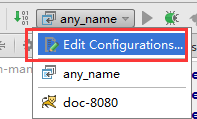
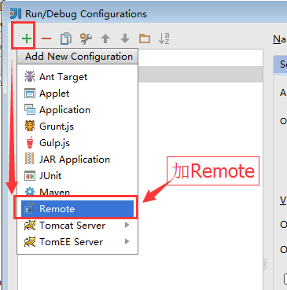
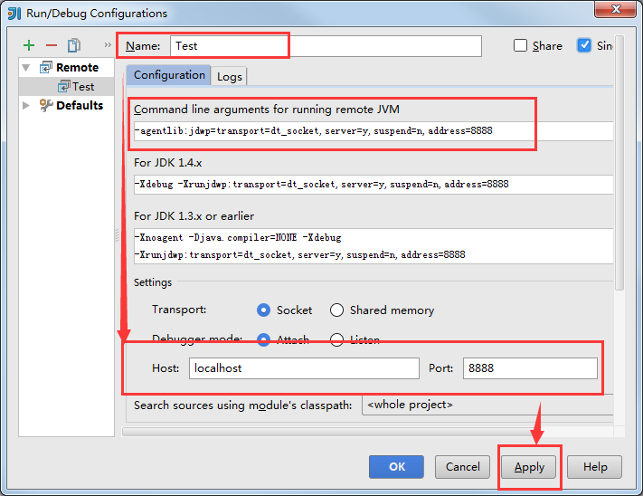

# 11 JDWP 简介：十步杀一人，千里不留行

Java 平台调试体系（Java Platform Debugger Architecture，JPDA），由三个相对独立的层次共同组成。这三个层次由低到高分别是 Java 虚拟机工具接口（JVMTI）、Java 调试连接协议（JDWP）以及 Java 调试接口（JDI）。

模块

层次

编程语言

作用

JVMTI

底层

C

获取及控制当前虚拟机状态

JDWP

中间层

C

定义 JVMTI 和 JDI 交互的数据格式

JDI

高层

Java

提供 Java API 来远程控制被调试虚拟机

> 详细介绍请参考或搜索：[JPDA 体系概览](https://www.ibm.com/developerworks/cn/java/j-lo-jpda1/index.html)。

## 服务端 JVM 配置

本篇主要讲解如何在 JVM 中启用 JDWP，以供远程调试。 假设主启动类是 com.xxx.Test。

在 Windows 机器上：

```java
java -Xdebug -Xrunjdwp:transport=dt_shmem,address=debug,server=y,suspend=y com.xxx.Test
```

在 Solaris 或 Linux 操作系统上：

```java
java -Xdebug -Xrunjdwp:transport=dt_socket,address=8888,server=y,suspend=y com.xxx.Test
```

其实，`-Xdebug` 这个选项什么用都没有，官方说是为了历史兼容性，避免报错才没有删除。

另外这个参数配置里的 `suspend=y` 会让 Java 进程启动时先挂起，等到有调试器连接上以后继续执行程序。

而如果改成 `suspend=n` 的话，则此 Java 进程会直接执行，但是我们可以随时通过调试器连上进程。

就是说，比如说我们启动一个 Web 服务器进程，当这个值是 y 的时候，服务器的 JVM 初始化以后不会启动 Web 服务器，会一直等到我们用 IDEA 或 Eclipse、JDB 等工具连上这个 Java 进程后，再继续启动 Web 服务器。而如果是 n 的话，则会不管有没有调试器连接，都会正常运行。

通过这些启动参数，Test 类将运行在调试模式下，并等待调试器连接到 JVM 的调试地址：在 Windows 上是 Debug，在 Oracle Solaris 或 Linux 操作系统上是 8888 端口。

> 如果细心观察的话，会发现 IDEA 中 Debug 模式启动的程序，自动设置了类似的启动选项。

## JDB

启用了 JDWP 之后，可以使用各种客户端来进行调试/远程调试。比如 JDB 调试本地 JVM：

```plaintext
jdb -attach 'debug'
jdb -attach 8888
```

当 JDB 初始化并连接到 Test 之后，就可以进行 Java 代码级（Java-level）的调试。

但是 JDB 调试非常麻烦，比如说几个常用命令：

\\1. 设置断点：

```plaintext
stop at 类名:行号 
```

\\2. 清除断点：

```plaintext
clear at 类名:行号 
```

\\3. 显示局部变量：

```localx
```

\\4. 显示变量 a 的值：
```

print a

```plaintext
\\5. 显示当前线程堆栈：
```

wherei

```plaintext
\\6. 代码执行到下一行：
```

next

```plaintext
\\7. 代码继续执行，直到遇到下一个断点：
```

cont

```plaintext
可以看到使用 JDB 调试的话非常麻烦，所以我们一般还是在开发工具 IDE（IDEA、Eclipse）里调试代码。

## 开发工具 IDEA 中使用远程调试

下面介绍 IDEA 中怎样使用远程调试。与常规的 Debug 配置类似，进入编辑：



添加 Remote（不是 Tomcat 下面的那个 Remote Server）：



然后配置端口号，比如 8888。



然后点击应用（Apply）按钮。

点击 Debug 的那个按钮即可启动远程调试，连上之后就和调试本地程序一样了。当然，记得加断点或者条件断点。

**注意** ：远程调试时，需要保证服务端 JVM 中运行的代码和本地完全一致，否则可能会有莫名其妙的问题。

细心的同学可能已经发现，IDEA 给出了远程 JVM 的启动参数，建议使用 agentlib 的方式：
```

-agentlib:jdwp=transport=dt_socket,server=y,suspend=n,address=8888
```

远程调试代码不仅在开发程序的过程中非常有用，而且实际生产环境，有时候我们无法判断程序运行的过程中出现了什么问题，到时运行结果跟期望值不一致，这时候就可以使用远程调试功能连接到生产环境，从而可以追踪导致执行过程中的哪个步骤出了问题。

JVM 为什么可以让不同的开发工具和调试器都连接上进行调试呢？因为它提供了一套公开的调试信息的交互协议，各家厂商就可以根据这个协议去实现自己的调试图形工具，进而方便 Java 开发人员的使用。下面就简单谈谈这个协议。

## JDWP 协议规范

JDWP 全称是 Java Debug Wire Protocol，中文翻译为“Java 调试连接协议”，是用于规范调试器（Debugger）与目标 JVM 之间通信的协议。

JDWP 是一个可选组件，可能在某些 JDK 实现中不可用。

JDWP 支持两种调试场景：

- 同一台计算机上的其他进程
- 远程计算机上

与许多协议规范的不同之处在于，JDWP 只规定了具体的格式和布局，而不管你用什么协议来传输数据。

JDWP 实现可以只使用简单的 API 来接受不同的传输机制。具体的传输不一定支持各种组合。

JDWP 设计得非常简洁，容易实现，而且对于未来的升级也足够灵活。

当前，JDWP 没有指定任何传输机制。将来如果发生变更，会在单独的文档中来进行规范。

JDWP 是 JPDA 中的一层。JPDA（Java Platform Debugger Architecture，Java 平台调试器体系结构）架构还包含更上层的 Java 调试接口（JDI，Java Debug Interface）。JDWP 旨在促进 JDI 的有效使用；为此，它的许多功能都是量身定制的。

对于那些用 Java 语言编写的 Debugger 工具来说，直接使用 JDI 比起 JDWP 更加方便。

有关 JPDA 的更多信息，请参考：

> [Java Platform Debugger Architecture documentation](https://docs.oracle.com/javase/8/docs/technotes/guides/jpda/index.html)

## JDWP 握手过程

连接建立之后，在发送其他数据包之前，连接双方需要进行握手：

握手过程包括以下步骤：

- Debugger 端向目标 JVM 发送 14 个字节，也就是包括 14 个 ASCII 字符的字符串 "JDWP-Handshake"。
- VM 端以相同的 14 个字节答复：JDWP-Handshake。

## JDWP 数据包

JDWP 是无状态的协议，基于数据包来传输数据。包含两种基本的数据包类型：命令包（Command Packet）和应答包（Reply Packet）。

调试器和目标 VM 都可以发出命令包，调试器可以用命令包来从目标 VM 请求相关信息或者控制程序的执行，目标 VM 可以将自身的某些事件（例如断点或异常）用命令数据包的方式通知调试器。

应答包仅用于对命令包进行响应，并且标明该命令是成功还是失败。 应答包还可以携带命令中请求的数据（例如字段或变量的值）。当前，从目标 VM 发出的事件不需要调试器的应答。

JDWP 是异步的，在收到某个应答之前，可以发送多个命令包。

命令包和应答包的 header 大小相等。这样使传输更易于实现和抽象。每个数据包的布局如下所示。

**命令包（Command Packet）**

- Header
  - length（4 bytes）
  - id（4 bytes）
  - flags（1 byte）
  - command set（1 byte）
  - command（1 byte）
- data（长度不固定）

**应答包（Reply Packet）**

- Header
  - length（4 bytes）
  - id（4 bytes）
  - flags（1 byte）
  - error code（2 bytes）
- data（Variable）

可以看到，这两种数据包的 Header 中，前三个字段格式是相同的。

通过 JDWP 发送的所有字段和数据都应采用大端字节序（big-endian）。大端字节序的定义请参考《Java 虚拟机规范》。

## 数据包字段说明

### 通用 Header 字段

下面的 Header 字段是命令包与应答包通用的。

**length** length 字段表示整个数据包（包括 header）的字节数。因为数据包 header 的大小为 11 个字节，因此没有 data 的数据包会将此字段值设置为 11。 **id** id 字段用于唯一标识每一对数据包（command/reply）。应答包 id 值必须与对应的命令包 ID 相同。这样异步方式的命令和应答就能匹配起来。同一个来源发送的所有未完成命令包的 id 字段必须唯一。（调试器发出的命令包，与 JVM 发出的命令包如果 ID 相同也没关系。） 除此之外，对 ID 的分配没有任何要求。对于大多数实现而言，使用自增计数器就足够了。id 的取值允许 232 个数据包，足以应对各种调试场景。 **flags** flags 标志用于修改命令的排队和处理方式，也用来标记源自 JVM 的数据包。当前只定义了一个标志位 0x80，表示此数据包是应答包。协议的未来版本可能会定义其他标志。

### 命令包的 Header

除了前面的通用 Header 字段，命令包还有以下请求头。 **command set**

该字段主要用于通过一种有意义的方式对命令进行分组。Sun 定义的命令集，通过在 JDI 中支持的接口进行分组。例如，所有支持 VirtualMachine 接口的命令都在 VirtualMachine 命令集里面。命令集空间大致分为以下几类：

- 0-63：发给目标 VM 的命令集
- 64-127：发送给调试器的命令集
- 128-256：JVM 提供商自己定义的命令和扩展。

**command** 该字段用于标识命令集中的具体命令。该字段与命令集字段一起用于指示应如何处理命令包。更简洁地说，它们告诉接收者该怎么做。具体命令将在本文档后面介绍。

### 应答包的 Header

除了前面的通用 Header 字段，应答包还有以下请求头。 **error code**

此字段用于标识是否成功处理了对应的命令包。0 值表示成功，非零值表示错误。返回的错误代码由具体的命令集/命令规定，但是通常会映射为 JVM TI 标准错误码。

### Data

每个命令的 Data 部分都是不同的。相应的命令包和应答包之间也有所不同。例如，请求命令包希望获取某个字段的值，可以在 Data 中填上 object ID 和 field ID。应答包的 Data 字段将存放该字段的值。

## JDWP 中常用的数据类型

通常，命令或应答包的 Data 字段格式由具体的命令规定。Data 中的每个字段都是（Java 标准的）大端格式编码。下面介绍每个 Data 字段的数据类型。

大部分 JDWP 数据包中的数据类型如下所述。

Name

Size

byte

1 byte

boolean

1 byte

int

4 bytes

long

8 bytes

objectID

由具体的 JVM 确定，最多 8 字节

tagged-objectID

objectID 的大小 +1 字节

threadID

同 objectID

threadGroupID

同 objectID

stringID

同 objectID

classLoaderID

同 objectID

classObjectID

同 objectID

arrayID

同 objectID

referenceTypeID

同 objectID

classID

同 referenceTypeID

interfaceID

同 referenceTypeID

arrayTypeID

同 referenceTypeID

methodID

由具体的 JVM 确定，最多 8 字节

fieldID

由具体的 JVM 确定，最多 8 字节

frameID

由具体的 JVM 确定，最多 8 字节

location

由具体的 JVM 确定

string

长度不固定

value

长度不固定

untagged-value

长度不固定

arrayregion

长度不固定

不同的 JVM 中，Object IDs、Reference Type IDs、Field IDs、Method IDs 和 Frame IDs 的大小可能不同。

通常，它们的大小与 JNI 和 JVMDI 调用中用于这些项目的 native 标识符的大小相对应。这些类型中最大的 size 为 8 个字节。当然，调试器可以使用 "idSizes" 这个命令来确定每种类型的大小。

如果 JVM 收到的命令包里面含有未实现（non-implemented）或无法识别（non-recognized）的命令/命令集，则会返回带有错误码 NOT_IMPLEMENTED 的应答包。具体的错误常量可参考：

> [Error Constants](https://docs.oracle.com/javase/8/docs/platform/jpda/jdwp/jdwp-protocol.html#JDWP_Error)

## 参考文档

- [JDWP 协议的具体命令](https://docs.oracle.com/javase/8/docs/platform/jpda/jdwp/jdwp-protocol.html)
- [Java Platform Debugger Architecture](https://docs.oracle.com/javase/8/docs/technotes/guides/jpda/index.html)
- [JDWP Specification](https://docs.oracle.com/javase/8/docs/technotes/guides/jpda/jdwp-spec.html)
- [使用 JDB 进行调试](https://www.jianshu.com/p/5a64ed722b91)
