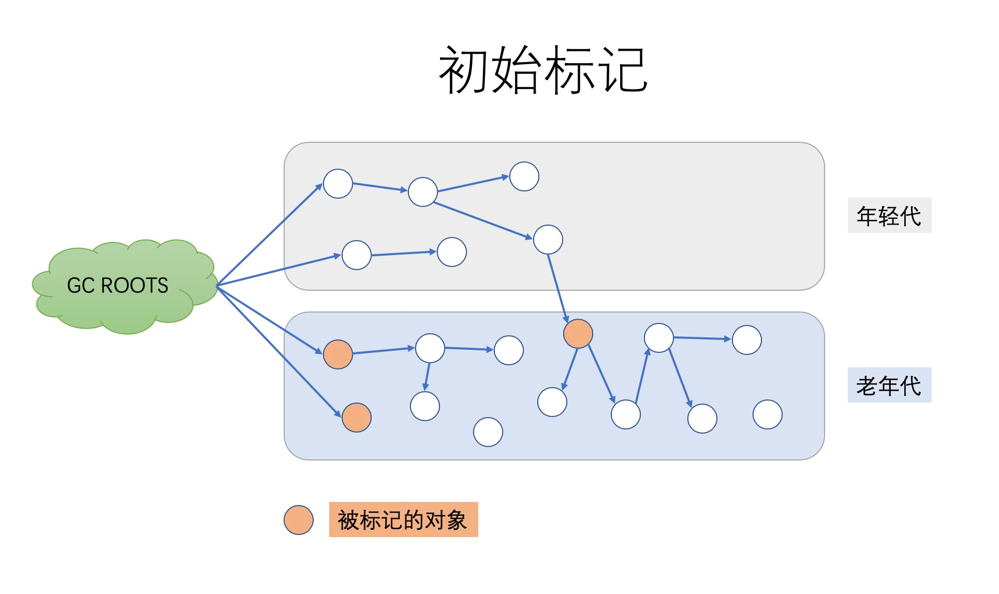
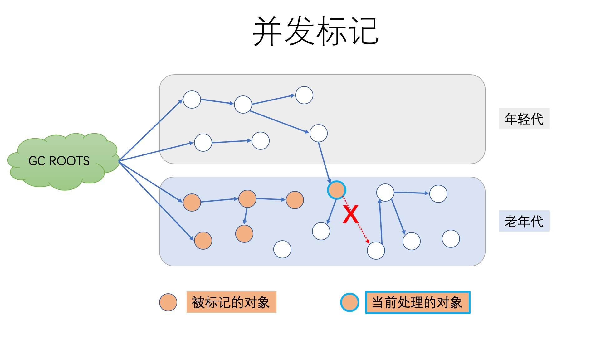
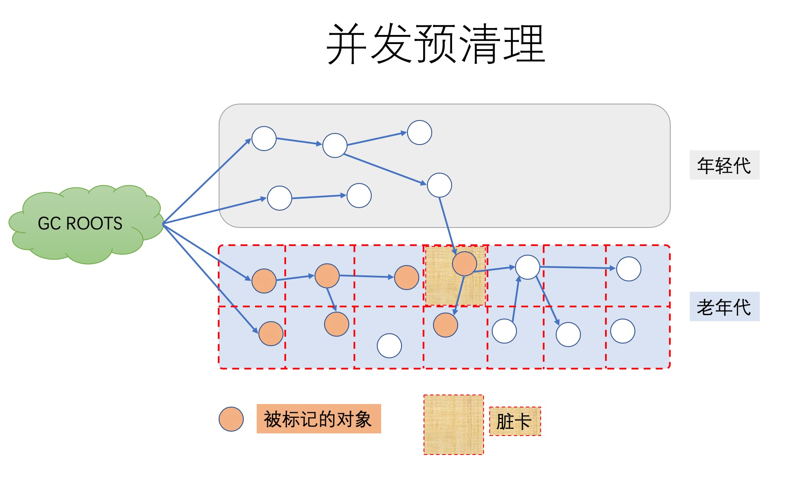
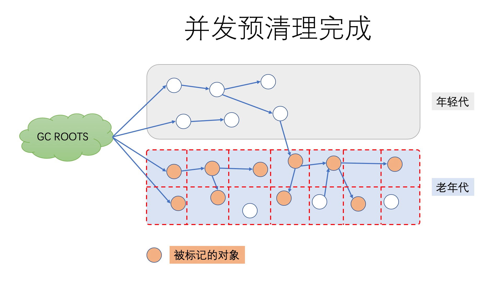
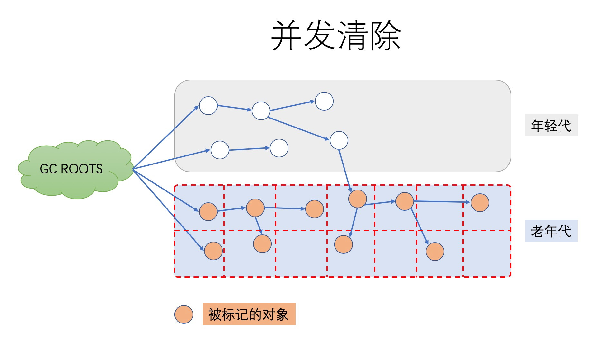
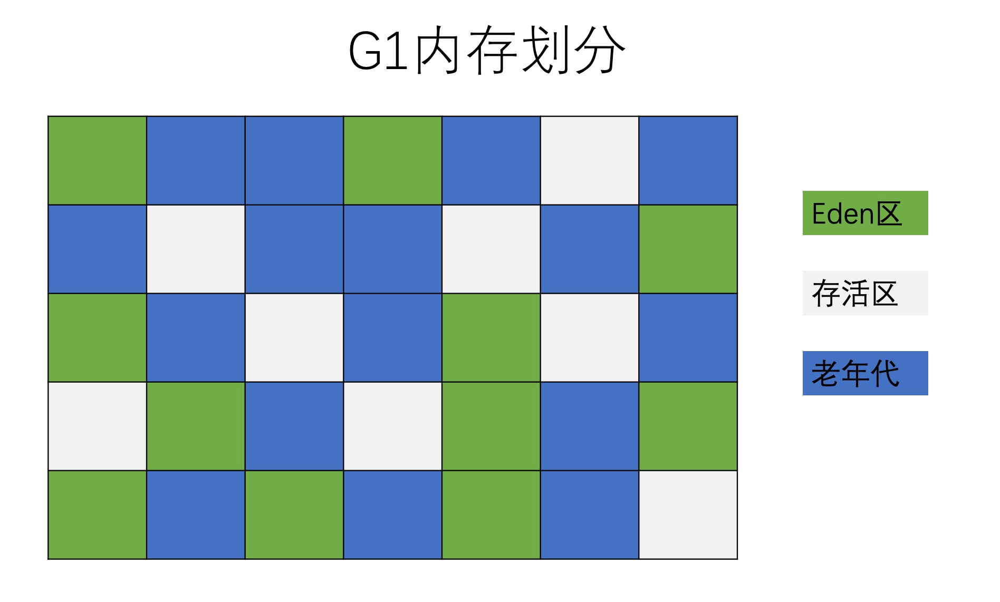
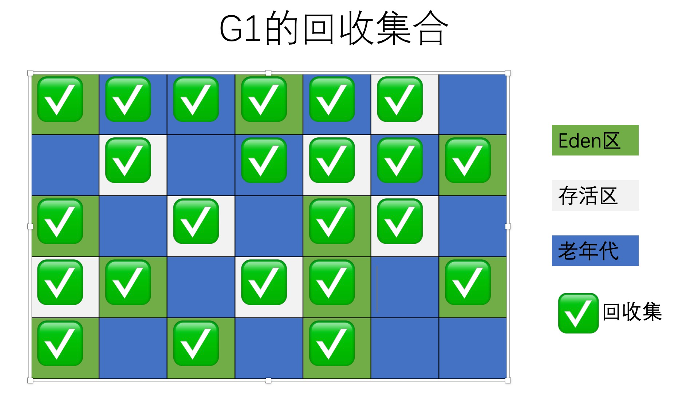
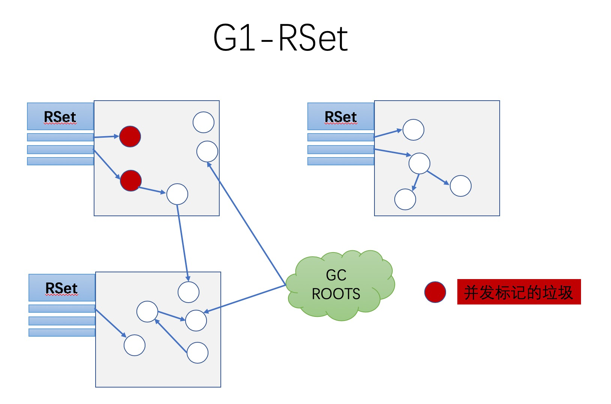
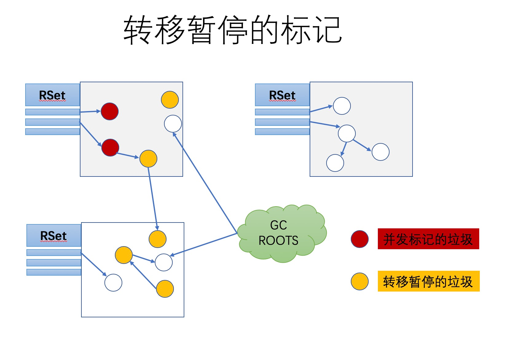
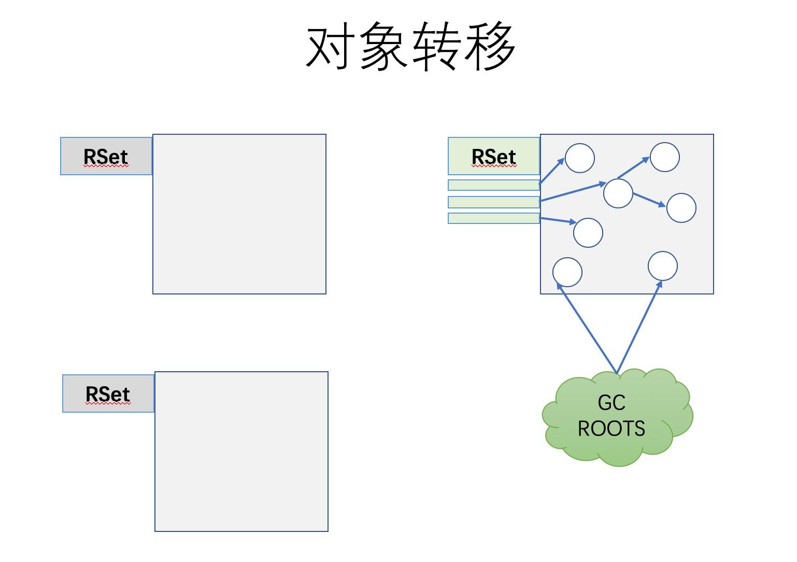

# 14 常见的 GC 算法（ParallelCMSG1）

学习了 GC 算法的相关概念之后，我们将介绍在 JVM 中这些算法的具体实现。首先要记住的是，大多数 JVM 都需要使用两种不同的 GC 算法——一种用来清理年轻代，另一种用来清理老年代。

我们可以选择 JVM 内置的各种算法。如果不通过参数明确指定垃圾收集算法，则会使用相应 JDK 版本的默认实现。本章会详细介绍各种算法的实现原理。

### 串行 GC（Serial GC）

串行 GC 对年轻代使用 mark-copy（标记—复制）算法，对老年代使用 mark-sweep-compact（标记—清除—整理）算法。

两者都是单线程的垃圾收集器，不能进行并行处理，所以都会触发全线暂停（STW），停止所有的应用线程。

因此这种 GC 算法不能充分利用多核 CPU。不管有多少 CPU 内核，JVM 在垃圾收集时都只能使用单个核心。

要启用此款收集器，只需要指定一个 JVM 启动参数即可，同时对年轻代和老年代生效：

```plaintext
-XX:+UseSerialGC
```

该选项只适合几百 MB 堆内存的 JVM，而且是单核 CPU 时比较有用。

对于服务器端来说，因为一般是多个 CPU 内核，并不推荐使用，除非确实需要限制 JVM 所使用的资源。大多数服务器端应用部署在多核平台上，选择 串行 GC 就意味着人为地限制了系统资源的使用，会导致资源闲置，多余的 CPU 资源也不能用增加业务处理的吞吐量。

关于串行垃圾收集器的日志内容，我们在后面的内容《GC 日志解读与分析》之中进行详细的讲解。

### 并行 GC（Parallel GC）

并行垃圾收集器这一类组合，在年轻代使用“标记—复制（mark-copy）算法”，在老年代使用“标记—清除—整理（mark-sweep-compact）算法”。年轻代和老年代的垃圾回收都会触发 STW 事件，暂停所有的应用线程来执行垃圾收集。两者在执行“标记和复制/整理”阶段时都使用多个线程，因此得名“ **Parallel** ”。通过并行执行，使得 GC 时间大幅减少。

通过命令行参数 `-XX:ParallelGCThreads=NNN` 来指定 GC 线程数，其默认值为 CPU 核心数。可以通过下面的任意一组命令行参数来指定并行 GC：

```plaintext
-XX:+UseParallelGC
-XX:+UseParallelOldGC
-XX:+UseParallelGC -XX:+UseParallelOldGC
```

并行垃圾收集器适用于多核服务器，主要目标是增加吞吐量。因为对系统资源的有效使用，能达到更高的吞吐量：

- 在 GC 期间，所有 CPU 内核都在并行清理垃圾，所以总暂停时间更短；
- 在两次 GC 周期的间隔期，没有 GC 线程在运行，不会消耗任何系统资源。

另一方面，因为此 GC 的所有阶段都不能中断，所以并行 GC 很容易出现长时间的卡顿（注：这里说的长时间也很短，一般来说例如 minor GC 是毫秒级别，full GC 是几十几百毫秒级别）。如果系统的主要目标是最低的停顿时间/延迟，而不是整体的吞吐量最大，那么就应该选择其他垃圾收集器组合。

> **注** ：长时间卡顿的意思是，此 GC 启动之后，属于一次性完成所有操作，于是单次 暂停 的时间会较长。

### CMS 垃圾收集器

CMS GC 的官方名称为 **Mostly Concurrent Mark and Sweep Garbage Collector** （最大并发—标记—清除—垃圾收集器）。其对年轻代采用并行 STW 方式的 mark-copy（标记—复制）算法，对老年代主要使用并发 mark-sweep（标记—清除）算法。

CMS GC 的设计目标是避免在老年代垃圾收集时出现长时间的卡顿，主要通过两种手段来达成此目标：

- 第一，不对老年代进行整理，而是使用空闲列表（free-lists）来管理内存空间的回收。
- 第二，在 **mark-and-sweep** （标记—清除）阶段的大部分工作和应用线程一起并发执行。

也就是说，在这些阶段并没有明显的应用线程暂停。但值得注意的是，它仍然和应用线程争抢 CPU 时间。默认情况下，CMS 使用的并发线程数等于 CPU 核心数的 1/4。

通过以下选项来指定 CMS 垃圾收集器：

```plaintext
-XX:+UseConcMarkSweepGC
```

如果服务器是多核 CPU，并且主要调优目标是降低 GC 停顿导致的系统延迟，那么使用 CMS 是个很明智的选择。通过减少每一次 GC 停顿的时间，很多时候会直接改善系统的用户体验。因为多数时候都有部分 CPU 资源被 GC 消耗，所以在 CPU 资源受限的情况下，CMS GC 会比并行 GC 的吞吐量差一些（对于绝大部分系统，这个吞吐和延迟的差别应该都不明显）。

在实际情况下，进行老年代的并发回收时，可能会伴随着多次年轻代的 minor GC。在这种情况下，full GC 的日志中就会掺杂着多次 minor GC 事件，像前面所介绍的一样。下面我们来看一看 CMS GC 的几个阶段。

#### **阶段 1：Initial Mark（初始标记）** 这个阶段伴随着 STW 暂停。初始标记的目标是标记所有的根对象，包括根对象直接引用的对象，以及被年轻代中所有存活对象所引用的对象（老年代单独回收）

> 为什么 CMS 不管年轻代了呢？前面不是刚刚完成 minor GC 嘛，再去收集年轻代估计也没什么效果。

看看示意图：



#### **阶段 2：Concurrent Mark（并发标记）** 在此阶段，CMS GC 遍历老年代，标记所有的存活对象，从前一阶段“Initial Mark”找到的根对象开始算起。“并发标记”阶段，就是与应用程序同时运行，不用暂停的阶段。请注意，并非所有老年代中存活的对象都在此阶段被标记，因为在标记过程中对象的引用关系还在发生变化



在上面的示意图中，“当前处理的对象”的一个引用就被应用线程给断开了，即这个部分的对象关系发生了变化（下面会讲如何处理）。

#### **阶段 3：Concurrent Preclean（并发预清理）** 此阶段同样是与应用线程并发执行的，不需要停止应用线程

因为前一阶段“并发标记”与程序并发运行，可能有一些引用关系已经发生了改变。如果在并发标记过程中引用关系发生了变化，JVM 会通过“Card（卡片）”的方式将发生了改变的区域标记为“脏”区，这就是所谓的“卡片标记（Card Marking）”。



在预清理阶段，这些脏对象会被统计出来，它们所引用的对象也会被标记。此阶段完成后，用以标记的 card 也就会被清空。



此外，本阶段也会进行一些必要的细节处理，还会为 Final Remark 阶段做一些准备工作。

#### **阶段 4：Concurrent Abortable Preclean（可取消的并发预清理）** 此阶段也不停止应用线程。本阶段尝试在 STW 的 Final Remark 阶段 之前尽可能地多做一些工作。本阶段的具体时间取决于多种因素，因为它循环做同样的事情，直到满足某个退出条件（如迭代次数，有用工作量，消耗的系统时间等等）

此阶段可能显著影响 STW 停顿的持续时间，并且有许多重要的[配置选项](https://blogs.oracle.com/jonthecollector/entry/did_you_know)和失败模式。

#### **阶段 5：Final Remark（最终标记）** 最终标记阶段是此次 GC 事件中的第二次（也是最后一次）STW 停顿

本阶段的目标是完成老年代中所有存活对象的标记. 因为之前的预清理阶段是并发执行的，有可能 GC 线程跟不上应用程序的修改速度。所以需要一次 STW 暂停来处理各种复杂的情况。

通常 CMS 会尝试在年轻代尽可能空的情况下执行 Final Remark 阶段，以免连续触发多次 STW 事件。

在 5 个标记阶段完成之后，老年代中所有的存活对象都被标记了，然后 GC 将清除所有不使用的对象来回收老年代空间。

#### **阶段 6：Concurrent Sweep（并发清除）** 此阶段与应用程序并发执行，不需要 STW 停顿。JVM 在此阶段删除不再使用的对象，并回收它们占用的内存空间



#### **阶段 7：Concurrent Reset（并发重置）** 此阶段与应用程序并发执行，重置 CMS 算法相关的内部数据，为下一次 GC 循环做准备

总之，CMS 垃圾收集器在减少停顿时间上做了很多复杂而有用的工作，用于垃圾回收的并发线程执行的同时，并不需要暂停应用线程。当然，CMS 也有一些缺点，其中最大的问题就是老年代内存碎片问题（因为不压缩），在某些情况下 GC 会造成不可预测的暂停时间，特别是堆内存较大的情况下。

### G1 垃圾收集器

> G1 的全称是 Garbage-First，意为垃圾优先，哪一块的垃圾最多就优先清理它。

G1 GC 最主要的设计目标是：将 STW 停顿的时间和分布，变成可预期且可配置的。

事实上，G1 GC 是一款软实时垃圾收集器，可以为其设置某项特定的性能指标。例如可以指定：在任意 xx 毫秒时间范围内，STW 停顿不得超过 yy 毫秒。举例说明：任意 1 秒内暂停时间不超过 5 毫秒。G1 GC 会尽力达成这个目标（有很大概率会满足，但并不完全确定）。

#### **G1 GC 的特点** 为了达成可预期停顿时间的指标，G1 GC 有一些独特的实现

首先，堆不再分成年轻代和老年代，而是划分为多个（通常是 2048 个）可以存放对象的 小块堆区域（smaller heap regions）。每个小块，可能一会被定义成 Eden 区，一会被指定为 Survivor 区或者 Old 区。在逻辑上，所有的 Eden 区和 Survivor 区合起来就是年轻代，所有的 Old 区拼在一起那就是老年代，如下图所示：



这样划分之后，使得 G1 不必每次都去收集整个堆空间，而是以增量的方式来进行处理：每次只处理一部分内存块，称为此次 GC 的回收集（collection set）。每次 GC 暂停都会收集所有年轻代的内存块，但一般只包含部分老年代的内存块，见下图带对号的部分：



G1 的另一项创新是，在并发阶段估算每个小堆块存活对象的总数。构建回收集的原则是： **垃圾最多的小块会被优先收集** 。这也是 G1 名称的由来。

通过以下选项来指定 G1 垃圾收集器：

```plaintext
-XX:+UseG1GC -XX:MaxGCPauseMillis=50
```

#### **G1 GC 常用参数设置**

- `-XX:+UseG1GC`：启用 G1 GC，JDK 7 和 JDK 8 要求必须显示申请启动 G1 GC；
- `-XX:G1NewSizePercent`：初始年轻代占整个 Java Heap 的大小，默认值为 5%；
- `-XX:G1MaxNewSizePercent`：最大年轻代占整个 Java Heap 的大小，默认值为 60%；
- `-XX:G1HeapRegionSize`：设置每个 Region 的大小，单位 MB，需要为 1、2、4、8、16、32 中的某个值，默认是堆内存的 1/2000。如果这个值设置比较大，那么大对象就可以进入 Region 了。
- `-XX:ConcGCThreads`：与 Java 应用一起执行的 GC 线程数量，默认是 Java 线程的 1/4，减少这个参数的数值可能会提升并行回收的效率，提高系统内部吞吐量。如果这个数值过低，参与回收垃圾的线程不足，也会导致并行回收机制耗时加长。
- `-XX:+InitiatingHeapOccupancyPercent`（简称 IHOP）：G1 内部并行回收循环启动的阈值，默认为 Java Heap 的 45%。这个可以理解为老年代使用大于等于 45% 的时候，JVM 会启动垃圾回收。这个值非常重要，它决定了在什么时间启动老年代的并行回收。
- `-XX:G1HeapWastePercent`：G1 停止回收的最小内存大小，默认是堆大小的 5%。GC 会收集所有的 Region 中的对象，但是如果下降到了 5%，就会停下来不再收集了。就是说，不必每次回收就把所有的垃圾都处理完，可以遗留少量的下次处理，这样也降低了单次消耗的时间。
- `-XX:G1MixedGCCountTarget`：设置并行循环之后需要有多少个混合 GC 启动，默认值是 8 个。老年代 Regions 的回收时间通常比年轻代的收集时间要长一些。所以如果混合收集器比较多，可以允许 G1 延长老年代的收集时间。
- `-XX:+G1PrintRegionLivenessInfo`：这个参数需要和 `-XX:+UnlockDiagnosticVMOptions` 配合启动，打印 JVM 的调试信息，每个 Region 里的对象存活信息。
- `-XX:G1ReservePercent`：G1 为了保留一些空间用于年代之间的提升，默认值是堆空间的 10%。因为大量执行回收的地方在年轻代（存活时间较短），所以如果你的应用里面有比较大的堆内存空间、比较多的大对象存活，这里需要保留一些内存。
- `-XX:+G1SummarizeRSetStats`：这也是一个 VM 的调试信息。如果启用，会在 VM 退出的时候打印出 RSets 的详细总结信息。如果启用`-XX:G1SummaryRSetStatsPeriod`参数，就会阶段性地打印 RSets 信息。
- `-XX:+G1TraceConcRefinement`：这个也是一个 VM 的调试信息，如果启用，并行回收阶段的日志就会被详细打印出来。
- `-XX:+GCTimeRatio`：大家知道，GC 的有些阶段是需要 Stop—the—World，即停止应用线程的。这个参数就是计算花在 Java 应用线程上和花在 GC 线程上的时间比率，默认是 9，跟新生代内存的分配比例一致。这个参数主要的目的是让用户可以控制花在应用上的时间，G1 的计算公式是 100/（1+GCTimeRatio）。这样如果参数设置为 9，则最多 10% 的时间会花在 GC 工作上面。Parallel GC 的默认值是 99，表示 1% 的时间被用在 GC 上面，这是因为 Parallel GC 贯穿整个 GC，而 G1 则根据 Region 来进行划分，不需要全局性扫描整个内存堆。
- `-XX:+UseStringDeduplication`：手动开启 Java String 对象的去重工作，这个是 JDK8u20 版本之后新增的参数，主要用于相同 String 避免重复申请内存，节约 Region 的使用。
- `-XX:MaxGCPauseMills`：预期 G1 每次执行 GC 操作的暂停时间，单位是毫秒，默认值是 200 毫秒，G1 会尽量保证控制在这个范围内。

这里面最重要的参数，就是：

- `-XX:+UseG1GC`：启用 G1 GC；
- `-XX:+InitiatingHeapOccupancyPercent`：决定什么情况下发生 G1 GC；
- `-XX:MaxGCPauseMills`：期望每次 GC 暂定的时间，比如我们设置为 50，则 G1 GC 会通过调节每次 GC 的操作时间，尽量让每次系统的 GC 停顿都在 50 上下浮动。如果某次 GC 时间超过 50ms，比如说 100ms，那么系统会自动在后面动态调整 GC 行为，围绕 50 毫秒浮动。

#### **年轻代模式转移暂停（Evacuation Pause）** 通过前面的分析可以看到，G1 GC 会通过前面一段时间的运行情况来不断的调整自己的回收策略和行为，以此来比较稳定地控制暂停时间。在应用程序刚启动时，G1 还没有采集到什么足够的信息，这时候就处于初始的 fully-young 模式。当年轻代空间用满后，应用线程会被暂停，年轻代内存块中的存活对象被拷贝到存活区。如果还没有存活区，则任意选择一部分空闲的内存块作为存活区

拷贝的过程称为转移（Evacuation），这和前面介绍的其他年轻代收集器是一样的工作原理。

#### **并发标记（Concurrent Marking）** 同时我们也可以看到，G1 GC 的很多概念建立在 CMS 的基础上，所以下面的内容需要对 CMS 有一定的理解

G1 并发标记的过程与 CMS 基本上是一样的。G1 的并发标记通过 **Snapshot-At-The-Beginning（起始快照）** 的方式，在标记阶段开始时记下所有的存活对象。即使在标记的同时又有一些变成了垃圾。通过对象的存活信息，可以构建出每个小堆块的存活状态，以便回收集能高效地进行选择。

这些信息在接下来的阶段会用来执行老年代区域的垃圾收集。

有两种情况是可以完全并发执行的：

- 如果在标记阶段确定某个小堆块中没有存活对象，只包含垃圾；
- 在 STW 转移暂停期间，同时包含垃圾和存活对象的老年代小堆块。

当堆内存的总体使用比例达到一定数值，就会触发并发标记。这个默认比例是 45%，但也可以通过 JVM 参数 **InitiatingHeapOccupancyPercent** 来设置。和 CMS 一样，G1 的并发标记也是由多个阶段组成，其中一些阶段是完全并发的，还有一些阶段则会暂停应用线程。 **阶段 1：Initial Mark（初始标记）** 此阶段标记所有从 GC 根对象直接可达的对象。在 CMS 中需要一次 STW 暂停，但 G1 里面通常是在转移暂停的同时处理这些事情，所以它的开销是很小的。 **阶段 2：Root Region Scan（Root 区扫描）** 此阶段标记所有从“根区域”可达的存活对象。根区域包括：非空的区域，以及在标记过程中不得不收集的区域。

因为在并发标记的过程中迁移对象会造成很多麻烦，所以此阶段必须在下一次转移暂停之前完成。如果必须启动转移暂停，则会先要求根区域扫描中止，等它完成才能继续扫描。在当前版本的实现中，根区域是存活的小堆块：包括下一次转移暂停中肯定会被清理的那部分年轻代小堆块。 **阶段 3：Concurrent Mark（并发标记）** 此阶段和 CMS 的并发标记阶段非常类似：只遍历对象图，并在一个特殊的位图中标记能访问到的对象。

为了确保标记开始时的快照准确性，所有应用线程并发对对象图执行引用更新，G1 要求放弃前面阶段为了标记目的而引用的过时引用。 **阶段 4：Remark（再次标记）** 和 CMS 类似，这是一次 STW 停顿（因为不是并发的阶段），以完成标记过程。

G1 收集器会短暂地停止应用线程，停止并发更新信息的写入，处理其中的少量信息，并标记所有在并发标记开始时未被标记的存活对象。 这一阶段也执行某些额外的清理，如引用处理或者类卸载（class unloading）。 **阶段 5：Cleanup（清理）** 最后这个清理阶段为即将到来的转移阶段做准备，统计小堆块中所有存活的对象，并将小堆块进行排序，以提升 GC 的效率。此阶段也为下一次标记执行必需的所有整理工作（house-keeping activities）：维护并发标记的内部状态。

所有不包含存活对象的小堆块在此阶段都被回收了。有一部分任务是并发的：例如空堆区的回收，还有大部分的存活率计算。此阶段也需要一个短暂的 STW 暂停，才能不受应用线程的影响并完成作业。

#### **转移暂停：混合模式（Evacuation Pause(mixed)）** 并发标记完成之后，G1 将执行一次混合收集（mixed collection），就是不只清理年轻代，还将一部分老年代区域也加入到 回收集 中。混合模式的转移暂停不一定紧跟并发标记阶段。有很多规则和历史数据会影响混合模式的启动时机。比如，假若在老年代中可以并发地腾出很多的小堆块，就没有必要启动混合模式。因此，在并发标记与混合转移暂停之间，很可能会存在多次 young 模式的转移暂停

具体添加到回收集的老年代小堆块的大小及顺序，也是基于许多规则来判定的。其中包括指定的软实时性能指标，存活性，以及在并发标记期间收集的 GC 效率等数据，外加一些可配置的 JVM 选项。混合收集的过程，很大程度上和前面的 fully-young gc 是一样的。 **Remembered Sets（历史记忆集）简介** Remembered Sets（历史记忆集）用来支持不同的小堆块进行独立回收。

例如，在回收小堆块 A、B、C 时，我们必须要知道是否有从 D 区或者 E 区指向其中的引用，以确定它们的存活性. 但是遍历整个堆需要相当长的时间，这就违背了增量收集的初衷，因此必须采取某种优化手段。类似于其他 GC 算法中的“卡片”方式来支持年轻代的垃圾收集，G1 中使用的则是 Remembered Sets。

如下图所示，每个小堆块都有一个 **Remembered Set** ，列出了从外部指向本块的所有引用。这些引用将被视为附加的 GC 根。注意，在并发标记过程中，老年代中被确定为垃圾的对象会被忽略，即使有外部引用指向它们：因为在这种情况下引用者也是垃圾（如垃圾对象之间的引用或者循环引用）。



接下来的行为，和其他垃圾收集器一样：多个 GC 线程并行地找出哪些是存活对象，确定哪些是垃圾：



最后，存活对象被转移到存活区（survivor regions），在必要时会创建新的小堆块。现在，空的小堆块被释放，可用于存放新的对象了。



### GC 选择的经验总结


通过本节内容的学习，你应该对 G1 垃圾收集器有了一定了解。当然，为了简洁我们省略了很多实现细节，例如如何处理“巨无霸对象（humongous objects）”。

综合来看，G1 是 JDK11 之前 HotSpot JVM 中最先进的 **准产品级（production-ready）** 垃圾收集器。重要的是，HotSpot 工程师的主要精力都放在不断改进 G1 上面。在更新的 JDK 版本中，将会带来更多强大的功能和优化。

可以看到，G1 作为 CMS 的代替者出现，解决了 CMS 中的各种疑难问题，包括暂停时间的可预测性，并终结了堆内存的碎片化。对单业务延迟非常敏感的系统来说，如果 CPU 资源不受限制，那么 G1 可以说是 HotSpot 中最好的选择，特别是在最新版本的 JVM 中。当然这种降低延迟的优化也不是没有代价的：由于额外的写屏障和守护线程，G1 的开销会更大。如果系统属于吞吐量优先型的，又或者 CPU 持续占用 100%，而又不在乎单次 GC 的暂停时间，那么 CMS 是更好的选择。

> 总之， **G1 适合大内存，需要较低延迟的场景** 。

选择正确的 GC 算法，唯一可行的方式就是去尝试，并找出不合理的地方，一般性的指导原则：

- 如果系统考虑吞吐优先，CPU 资源都用来最大程度处理业务，用 Parallel GC；
- 如果系统考虑低延迟有限，每次 GC 时间尽量短，用 CMS GC；
- 如果系统内存堆较大，同时希望整体来看平均 GC 时间可控，使用 G1 GC。

对于内存大小的考量：

- 一般 4G 以上，算是比较大，用 G1 的性价比较高。
- 一般超过 8G，比如 16G-64G 内存，非常推荐使用 G1 GC。

最后讨论一个很多开发者经常忽视的问题，也是面试大厂常问的问题：

> JDK 8 的默认 GC 是什么？

很多人或觉得是 CMS，甚至 G1，其实都不是。

答案是：并行 GC 是 JDK8 里的默认 GC 策略。

注意，G1 成为 JDK9 以后版本的默认 GC 策略，同时，ParNew + SerialOld 这种组合不被支持。

下一节将会介绍更高 JDK 版本的新 GC 策略（ZGC、Shenandoah）等。
