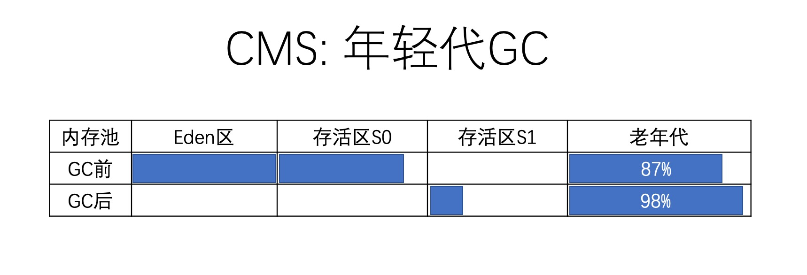

# 19 GC 日志解读与分析（实例分析中篇）

### CMS 的 GC 日志解读

CMS 也可称为“并发标记清除垃圾收集器”。其设计目标是避免在老年代 GC 时出现长时间的卡顿。默认情况下，CMS 使用的并发线程数等于 CPU 内核数的 1/4。

通过以下选项来指定 CMS 垃圾收集器：

```shell
-XX:+UseConcMarkSweepGC
```

如果 CPU 资源受限，CMS 的吞吐量会比并行 GC 差一些。示例：

```shell
# 请注意命令行启动时没有换行，此处是方便大家阅读。
java -XX:+UseConcMarkSweepGC
-Xms512m
-Xmx512m
-Xloggc：gc.demo.log
-XX:+PrintGCDetails
-XX:+PrintGCDateStamps
demo.jvm0204.GCLogAnalysis
```

和前面分析的串行 GC/并行 GC 一样，我们将程序启动起来，看看 CMS 算法生成的 GC 日志是什么样子：

```shell
Java HotSpot(TM) 64-Bit Server VM (25.162-b12) 。。。
Memory： 4k page，physical 16777216k(1168104k free)
CommandLine flags：
  -XX:InitialHeapSize=536870912 -XX:MaxHeapSize=536870912
  -XX:MaxNewSize=178958336 -XX:MaxTenuringThreshold=6
  -XX:NewSize=178958336 -XX:OldPLABSize=16 -XX:OldSize=357912576
  -XX:+PrintGC -XX:+PrintGCDateStamps
  -XX:+PrintGCDetails -XX:+PrintGCTimeStamps
  -XX:+UseCompressedClassPointers -XX:+UseCompressedOops
  -XX:+UseConcMarkSweepGC -XX:+UseParNewGC
2019-12-22T00:00:31.865-0800: 1.067：
  [GC (Allocation Failure)
    2019-12-22T00:00:31.865-0800: 1.067：
    [ParNew： 136418K->17311K(157248K)，0.0233955 secs]
    442378K->360181K(506816K)，0.0234719 secs]
  [Times: user=0.10 sys=0.02，real=0.02 secs]
2019-12-22T00:00:31.889-0800: 1.091：
  [GC (CMS Initial Mark)
    [1 CMS-initial-mark: 342870K(349568K)]
    363883K(506816K)，0.0002262 secs]
  [Times: user=0.00 sys=0.00,real=0.00 secs]
2019-12-22T00:00:31.889-0800: 1.091：
  [CMS-concurrent-mark-start]
2019-12-22T00:00:31.890-0800: 1.092：
  [CMS-concurrent-mark: 0.001/0.001 secs]
  [Times: user=0.00 sys=0.00,real=0.01 secs]
2019-12-22T00:00:31.891-0800: 1.092：
  [CMS-concurrent-preclean-start]
2019-12-22T00:00:31.891-0800: 1.093：
  [CMS-concurrent-preclean: 0.001/0.001 secs]
  [Times: user=0.00 sys=0.00,real=0.00 secs]
2019-12-22T00:00:31.891-0800: 1.093：
  [CMS-concurrent-abortable-preclean-start]
2019-12-22T00:00:31.891-0800: 1.093：
  [CMS-concurrent-abortable-preclean: 0.000/0.000 secs]
  [Times: user=0.00 sys=0.00,real=0.00 secs]
2019-12-22T00:00:31.891-0800: 1.093：
  [GC (CMS Final Remark)
    [YG occupancy: 26095 K (157248 K)]
    2019-12-22T00:00:31.891-0800: 1.093：
      [Rescan (parallel) ，0.0002680 secs]
    2019-12-22T00:00:31.891-0800: 1.093：
      [weak refs processing，0.0000230 secs]
    2019-12-22T00:00:31.891-0800: 1.093：
      [class unloading，0.0004008 secs]
    2019-12-22T00:00:31.892-0800: 1.094：
      [scrub symbol table，0.0006072 secs]
    2019-12-22T00:00:31.893-0800: 1.095：
      [scrub string table，0.0001769 secs]
      [1 CMS-remark: 342870K(349568K)]
    368965K(506816K)，0.0015928 secs]
  [Times: user=0.01 sys=0.00,real=0.00 secs]
2019-12-22T00:00:31.893-0800: 1.095：
  [CMS-concurrent-sweep-start]
2019-12-22T00:00:31.893-0800: 1.095：
  [CMS-concurrent-sweep： 0.000/0.000 secs]
  [Times: user=0.00 sys=0.00,real=0.00 secs]
2019-12-22T00:00:31.893-0800: 1.095：
  [CMS-concurrent-reset-start]
2019-12-22T00:00:31.894-0800: 1.096：
  [CMS-concurrent-reset: 0.000/0.000 secs]
  [Times: user=0.00 sys=0.00,real=0.00 secs]
```

这只是摘录的一部分 GC 日志。比起串行 GC/并行 GC 来说，CMS 的日志信息复杂了很多，这一方面是因为 CMS 拥有更加精细的 GC 步骤，另一方面 GC 日志很详细就意味着暴露出来的信息也就更全面细致。

#### **Minor GC 日志分析** 最前面的几行日志是清理年轻代的 Minor GC 事件

```shell
2019-12-22T00:00:31.865-0800: 1.067：
  [GC (Allocation Failure)
    2019-12-22T00:00:31.865-0800: 1.067：
    [ParNew： 136418K->17311K(157248K)，0.0233955 secs]
    442378K->360181K(506816K)，0.0234719 secs]
  [Times: user=0.10 sys=0.02，real=0.02 secs]
```

我们一起来解读：

1. `2019-12-22T00:00:31.865-0800: 1.067`：GC 事件开始的时间。
1. `GC (Allocation Failure)`：用来区分 Minor GC 还是 Full GC 的标志。`GC` 表明这是一次“小型 GC”；`Allocation Failure` 表示触发 GC 的原因。本次 GC 事件，是由于年轻代可用空间不足，新对象的内存分配失败引起的。
1. `[ParNew： 136418K->17311K(157248K)，0.0233955 secs]`：其中 `ParNew` 是垃圾收集器的名称，对应的就是前面日志中打印的 `-XX:+UseParNewGC` 这个命令行标志。表示在年轻代中使用的“并行的标记—复制（mark-copy）”垃圾收集器，专门设计了用来配合 CMS 垃圾收集器，因为 CMS 只负责回收老年代。后面的数字表示 GC 前后的年轻代使用量变化，以及年轻代的总大小。`0.0233955 secs` 是消耗的时间。
1. `442378K->360181K(506816K)，0.0234719 secs`：表示 GC 前后堆内存的使用量变化，以及堆内存空间的大小。消耗的时间是 `0.0234719 secs`，和前面的 ParNew 部分的时间基本上一样。
1. `[Times: user=0.10 sys=0.02，real=0.02 secs]`：GC 事件的持续时间。`user` 是 GC 线程所消耗的总 CPU 时间；`sys` 是操作系统调用和系统等待事件消耗的时间；应用程序实际暂停的时间 `real ~= (user + sys)/GC线程数`。我的机器是 4 核 8 线程，而这里是 6 倍的比例，因为总有一定比例的处理过程是不能并行执行的。

进一步计算和分析可以得知，在 GC 之前，年轻代使用量为 136418K/157248K=86%。堆内存的使用率为 442378K/506816K=87%。稍微估算一下，老年代的使用率为：(442378K-136418K)/(506816K-157248K)=(305960K /349568K)=87%。这里是凑巧了，GC 之前 3 个比例都在 87% 左右。

GC 之后呢？年轻代使用量为 17311K ~= 17%，下降了 119107K。堆内存使用量为 360181K ~= 71%，只下降了 82197K。两个下降值相减，就是年轻代提升到老年代的内存量：119107-82197=36910K。

那么老年代空间有多大？老年代使用量是多少？正在阅读的同学，请开动脑筋，用这些数字算一下。

此次 GC 的内存变化示意图为：



哇塞，这个数字不得了，老年代使用量 98% 了，非常高了。后面紧跟着就是一条 Full GC 的日志，请接着往下看。

#### **Full GC 日志分析** 实际上这次截取的年轻代 GC 日志和 FullGC 日志是紧连着的，我们从间隔时间也能大致看出来，`1.067 + 0.02secs ~ 1.091`

CMS 的日志是一种完全不同的格式，并且很长，因为 CMS 对老年代进行垃圾收集时每个阶段都会有自己的日志。为了简洁，我们将对这部分日志按照阶段依次介绍。

首先来看 CMS 这次 FullGC 的日志：

```shell
2019-12-22T00:00:31.889-0800: 1.091:
  [GC (CMS Initial Mark)
    [1 CMS-initial-mark: 342870K(349568K)]
    363883K(506816K)，0.0002262 secs]
  [Times: user=0.00 sys=0.00,real=0.00 secs]
2019-12-22T00:00:31.889-0800: 1.091:
  [CMS-concurrent-mark-start]
2019-12-22T00:00:31.890-0800: 1.092:
  [CMS-concurrent-mark: 0.001/0.001 secs]
  [Times: user=0.00 sys=0.00,real=0.01 secs]
2019-12-22T00:00:31.891-0800: 1.092:
  [CMS-concurrent-preclean-start]
2019-12-22T00:00:31.891-0800: 1.093:
  [CMS-concurrent-preclean: 0.001/0.001 secs]
  [Times: user=0.00 sys=0.00,real=0.00 secs]
2019-12-22T00:00:31.891-0800: 1.093:
  [CMS-concurrent-abortable-preclean-start]
2019-12-22T00:00:31.891-0800: 1.093:
  [CMS-concurrent-abortable-preclean: 0.000/0.000 secs]
  [Times: user=0.00 sys=0.00,real=0.00 secs]
2019-12-22T00:00:31.891-0800: 1.093:
  [GC (CMS Final Remark)
    [YG occupancy: 26095 K (157248 K)]
    2019-12-22T00:00:31.891-0800: 1.093:
      [Rescan (parallel) ，0.0002680 secs]
    2019-12-22T00:00:31.891-0800: 1.093:
      [weak refs processing，0.0000230 secs]
    2019-12-22T00:00:31.891-0800: 1.093:
      [class unloading，0.0004008 secs]
    2019-12-22T00:00:31.892-0800: 1.094:
      [scrub symbol table，0.0006072 secs]
    2019-12-22T00:00:31.893-0800: 1.095:
      [scrub string table，0.0001769 secs]
      [1 CMS-remark: 342870K(349568K)]
    368965K(506816K)，0.0015928 secs]
  [Times: user=0.01 sys=0.00,real=0.00 secs]
2019-12-22T00:00:31.893-0800: 1.095:
  [CMS-concurrent-sweep-start]
2019-12-22T00:00:31.893-0800: 1.095:
  [CMS-concurrent-sweep： 0.000/0.000 secs]
  [Times: user=0.00 sys=0.00,real=0.00 secs]
2019-12-22T00:00:31.893-0800: 1.095:
  [CMS-concurrent-reset-start]
2019-12-22T00:00:31.894-0800: 1.096:
  [CMS-concurrent-reset: 0.000/0.000 secs]
  [Times: user=0.00 sys=0.00,real=0.00 secs]
```

在实际运行中，CMS 在进行老年代的并发垃圾回收时，可能会伴随着多次年轻代的 Minor GC（想想是为什么）。在这种情况下，Full GC 的日志中可能会掺杂着多次 Minor GC 事件。 **阶段 1：Initial Mark（初始标记）** 前面章节提到过，这个阶段伴随着 STW 暂停。初始标记的目标是标记所有的根对象，包括 GC ROOT 直接引用的对象，以及被年轻代中所有存活对象所引用的对象。后面这部分也非常重要，因为老年代是独立进行回收的。

先看这个阶段的日志：

```shell
2019-12-22T00:00:31.889-0800: 1.091:
  [GC (CMS Initial Mark)
    [1 CMS-initial-mark: 342870K(349568K)]
    363883K(506816K), 0.0002262 secs]
  [Times: user=0.00 sys=0.00,real=0.00 secs]
```

让我们简单解读一下：

1. `2019-12-22T00:00:31.889-0800: 1.091:`：时间部分就不讲了，参考前面的解读。后面的其他阶段也一样，不再进行重复介绍。
1. `CMS Initial Mark`：这个阶段的名称为“Initial Mark”，会标记所有的 GC Root。
1. `[1 CMS-initial-mark: 342870K(349568K)]`：这部分数字表示老年代的使用量，以及老年代的空间大小。
1. `363883K(506816K)，0.0002262 secs`：当前堆内存的使用量，以及可用堆的大小、消耗的时间。可以看出这个时间非常短，只有 0.2 毫秒左右，因为要标记的这些 Roo 数量很少。
1. `[Times: user=0.00 sys=0.00,real=0.00 secs]`：初始标记事件暂停的时间，可以看到可以忽略不计。 **阶段 2：Concurrent Mark（并发标记）** 在并发标记阶段，CMS 从前一阶段“Initial Mark”找到的 ROOT 开始算起，遍历老年代并标记所有的存活对象。

看看这个阶段的 GC 日志：

```shell
2019-12-22T00:00:31.889-0800: 1.091:
  [CMS-concurrent-mark-start]
2019-12-22T00:00:31.890-0800: 1.092:
  [CMS-concurrent-mark: 0.001/0.001 secs]
  [Times: user=0.00 sys=0.00,real=0.01 secs]
```

简单解读一下：

1. `CMS-concurrent-mark`：指明了是 CMS 垃圾收集器所处的阶段为并发标记（“Concurrent Mark”）。
1. `0.001/0.001 secs`：此阶段的持续时间，分别是 GC 线程消耗的时间和实际消耗的时间。
1. `[Times: user=0.00 sys=0.00,real=0.01 secs]`：`Times` 对并发阶段来说这些时间并没多少意义，因为是从并发标记开始时刻计算的，而这段时间应用线程也在执行，所以这个时间只是一个大概的值。 **阶段 3：Concurrent Preclean（并发预清理）** 此阶段同样是与应用线程并发执行的，不需要停止应用线程。

看看并发预清理阶段的 GC 日志：

```shell
2019-12-22T00:00:31.891-0800: 1.092:
  [CMS-concurrent-preclean-start]
2019-12-22T00:00:31.891-0800: 1.093:
  [CMS-concurrent-preclean: 0.001/0.001 secs]
  [Times: user=0.00 sys=0.00,real=0.00 secs]
```

简单解读：

1. `CMS-concurrent-preclean`：表明这是并发预清理阶段的日志，这个阶段会统计前面的并发标记阶段执行过程中发生了改变的对象。
1. `0.001/0.001 secs`：此阶段的持续时间，分别是 GC 线程运行时间和实际占用的时间。
1. `[Times: user=0.00 sys=0.00,real=0.00 secs]`：Times 这部分对并发阶段来说没多少意义，因为是从开始时间计算的，而这段时间内不仅 GC 线程在执行并发预清理，应用线程也在运行。 **阶段 4：Concurrent Abortable Preclean（可取消的并发预清理）** 此阶段也不停止应用线程，尝试在会触发 STW 的 Final Remark 阶段开始之前，尽可能地多干一些活。

本阶段的具体时间取决于多种因素，因为它循环做同样的事情，直到满足某一个退出条件（如迭代次数、有用工作量、消耗的系统时间等等）。

看看 GC 日志：

```shell
2019-12-22T00:00:31.891-0800: 1.093:
  [CMS-concurrent-abortable-preclean-start]
2019-12-22T00:00:31.891-0800: 1.093:
  [CMS-concurrent-abortable-preclean: 0.000/0.000 secs]
  [Times: user=0.00 sys=0.00,real=0.00 secs]
```

简单解读：

1. `CMS-concurrent-abortable-preclean`：指示此阶段的名称：“Concurrent Abortable Preclean”。
1. `0.000/0.000 secs`：此阶段 GC 线程的运行时间和实际占用的时间。从本质上讲，GC 线程试图在执行 STW 暂停之前等待尽可能长的时间。默认条件下，此阶段可以持续最长 5 秒钟的时间。
1. `[Times: user=0.00 sys=0.00,real=0.00 secs]`：“Times”这部分对并发阶段来说没多少意义，因为程序在并发阶段中持续运行。

此阶段完成的工作可能对 STW 停顿的时间有较大影响，并且有许多重要的[配置选项](https://blogs.oracle.com/jonthecollector/entry/did_you_know)和失败模式。 **阶段 5：Final Remark（最终标记）** 最终标记阶段是此次 GC 事件中的第二次（也是最后一次）STW 停顿。

本阶段的目标是完成老年代中所有存活对象的标记。因为之前的预清理阶段是并发执行的，有可能 GC 线程跟不上应用程序的修改速度。所以需要一次 STW 暂停来处理各种复杂的情况。

通常 CMS 会尝试在年轻代尽可能空的情况下执行 final remark 阶段，以免连续触发多次 STW 事件。

这部分的 GC 日志看起来稍微复杂一些：

```shell
2019-12-22T00:00:31.891-0800: 1.093:
  [GC (CMS Final Remark)
    [YG occupancy: 26095 K (157248 K)]
    2019-12-22T00:00:31.891-0800: 1.093:
      [Rescan (parallel) ，0.0002680 secs]
    2019-12-22T00:00:31.891-0800: 1.093:
      [weak refs processing，0.0000230 secs]
    2019-12-22T00:00:31.891-0800: 1.093:
      [class unloading，0.0004008 secs]
    2019-12-22T00:00:31.892-0800: 1.094:
      [scrub symbol table，0.0006072 secs]
    2019-12-22T00:00:31.893-0800: 1.095:
      [scrub string table，0.0001769 secs]
      [1 CMS-remark: 342870K(349568K)]
    368965K(506816K)，0.0015928 secs]
  [Times: user=0.01 sys=0.00,real=0.00 secs]
```

一起来进行解读：

1. `CMS Final Remark`：这是此阶段的名称，最终标记阶段，会标记老年代中所有的存活对象，包括此前的并发标记过程中创建/修改的引用。
1. `YG occupancy: 26095 K (157248 K)`：当前年轻代的使用量和总容量。
1. `[Rescan (parallel) ，0.0002680 secs]`：在程序暂停后进行重新扫描（Rescan），以完成存活对象的标记。这部分是并行执行的，消耗的时间为 0.0002680 秒。
1. `weak refs processing，0.0000230 secs`：第一个子阶段，处理弱引用的持续时间。
1. `class unloading，0.0004008 secs`：第二个子阶段，卸载不使用的类，以及持续时间。
1. `scrub symbol table，0.0006072 secs`：第三个子阶段，清理符号表，即持有 class 级别 metadata 的符号表（symbol tables）。
1. `scrub string table，0.0001769 secs`：第四个子阶段， 清理内联字符串对应的 string tables。
1. `[1 CMS-remark: 342870K(349568K)]`：此阶段完成后老年代的使用量和总容量。
1. `368965K(506816K)，0.0015928 secs`：此阶段完成后，整个堆内存的使用量和总容量。
1. `[Times: user=0.01 sys=0.00,real=0.00 secs]`：GC 事件的持续时间。

在这 5 个标记阶段完成后，老年代中的所有存活对象都被标记上了，接下来 JVM 会将所有不使用的对象清除，以回收老年代空间。 **阶段 6：Concurrent Sweep（并发清除）** 此阶段与应用程序并发执行，不需要 STW 停顿。目的是删除不再使用的对象，并回收他们占用的内存空间。

看看这部分的 GC 日志：

```shell
2019-12-22T00:00:31.893-0800: 1.095:
  [CMS-concurrent-sweep-start]
2019-12-22T00:00:31.893-0800: 1.095:
  [CMS-concurrent-sweep: 0.000/0.000 secs]
  [Times: user=0.00 sys=0.00,real=0.00 secs]
```

简单解读：

1. `CMS-concurrent-sweep`：此阶段的名称，“Concurrent Sweep”，并发清除老年代中所有未被标记的对象、也就是不再使用的对象，以释放内存空间。
1. `0.000/0.000 secs`：此阶段的持续时间和实际占用的时间，这是一个四舍五入值，只精确到小数点后 3 位。
1. `[Times: user=0.00 sys=0.00,real=0.00 secs]`：“Times”部分对并发阶段来说没有多少意义，因为是从并发标记开始时计算的，而这段时间内不仅是并发标记线程在执行，程序线程也在运行。 **阶段 7：Concurrent Reset（并发重置）**

此阶段与应用程序线程并发执行，重置 CMS 算法相关的内部数据结构，下一次触发 GC 时就可以直接使用。

对应的日志为：

```shell
2019-12-22T00:00:31.893-0800: 1.095:
  [CMS-concurrent-reset-start]
2019-12-22T00:00:31.894-0800: 1.096:
  [CMS-concurrent-reset: 0.000/0.000 secs]
  [Times: user=0.00 sys=0.00,real=0.00 secs]
```

简单解读：

1. `CMS-concurrent-reset`：此阶段的名称，“Concurrent Reset”，重置 CMS 算法的内部数据结构，为下一次 GC 循环做准备。
1. `0.000/0.000 secs`：此阶段的持续时间和实际占用的时间
1. `[Times: user=0.00 sys=0.00,real=0.00 secs]`：“Times”部分对并发阶段来说没多少意义，因为是从并发标记开始时计算的，而这段时间内不仅 GC 线程在运行，程序也在运行。

那么问题来了，CMS 之后老年代内存使用量是多少呢？很抱歉这里分析不了，只能通过后面的 Minor GC 日志来分析了。

例如本次运行，后面的 GC 日志是这样的：

```shell
2019-12-22T00:00:31.921-0800: 1.123:
  [GC (Allocation Failure) 2019-12-22T00:00:31.921-0800: 1.123:
    [ParNew: 153242K->16777K(157248K), 0.0070050 secs]
    445134K->335501K(506816K)，
    0.0070758 secs]
  [Times: user=0.05 sys=0.00,real=0.00 secs]
```

参照前面年轻代 GC 日志的分析方法，我们推算出来，上面的 CMS Full GC 之后，老年代的使用量应该是：445134K-153242K=291892K，老年代的总容量 506816K-157248K=349568K，所以 Full GC 之后老年代的使用量占比是 291892K/349568K=83%。

这个占比不低。说明什么问题呢？ 一般来说就是分配的内存小了，毕竟我们才指定了 512MB 的最大堆内存。

按照惯例，来一张 GC 前后的内存使用情况示意图：


总之，CMS 垃圾收集器在减少停顿时间上做了很多给力的工作，很大一部分 GC 线程是与应用线程并发运行的，不需要暂停应用线程，这样就可以在一般情况下每次暂停的时候较少。当然，CMS 也有一些缺点，其中最大的问题就是老年代的内存碎片问题，在某些情况下 GC 会有不可预测的暂停时间，特别是堆内存较大的情况下。

> 透露一个学习 CMS 的诀窍：参考上面各个阶段的示意图，请同学们自己画一遍。

本节的学习到此就结束了，下一节我们继续介绍 G1 日志分析。
