# 25 FastThread 相关的工具介绍：欲穷千里目，更上一层楼

### FastThread 简介

在前面的章节里，我们知道了可以打印出来 JVM 的所有线程信息，然后进行分析。然而所有的线程信息都很长，看起来又差不多，每次去看都让人头大。

所以，每当我去分析线程都在想，要是有工具能帮我把一般情况汇总，并自动帮我分析分析 JVM 线程情况就好了。这里要介绍的 FastThread 就是这么一款工具。

> FastThread 是一款线程转储(Thread Dump)分析工具，官网地址为：[http://fastthread.io/](http://fastthread.io/) 。
>
> 这款工具由 [tier1app 公司](https://tier1app.com/) 开发和支持，这家公司现在主要提供 3 款 JVM 分析工具，除了 FastThread 还有：
>
> - GCEasy，访问地址：[https://gceasy.io/](https://gceasy.io/)，详情请参考前面的文章 \[《GC 日志解读与分析（番外篇可视化工具）》\]。
> - HeapHero，官网地址：[https://heaphero.io/](https://heaphero.io/)，顾名思义，这是一款 Heap Dump 分析工具。

FastThread 工具可用来分析和定位问题，功能特征包括：

- 通用线程转储分析，FastThread 是一款通用的线程转储分析工具，可以通过 JVM 导出的线程转储，来进行根本原因排查分析（RCA，root cause analysis）。
- 提供在线分析功能，因为线程转储一般不会太大，所以只需上传我们导出的线程转储文件即可快速查看分析报告，而不需要在本地计算机下载和安装。使用非常方便。
- 提供直观的线程分析视图，通过仪表盘等形式的图形展示，使用起来既简单又容易理解。并对各种线程状态进行分类，比如阻塞、运行、定时等待、等待，以及重复的堆栈跟踪。通过这款工具，可以快速方便地解决可扩展性、性能问题和可用性问题。
- 支持 REST 方式的 API 接口调用，FastThread 是业界第一款支持 API 方式的线程转储分析工具。通过 API 接口，我们就可以通过脚本或者程序实现自动化分析，适用于进行批量的操作。
- 支持核心转储分析（Core Dump Analysis），Java 核心转储包括很多信息，但格式非常难以理解和解析。FastThread 可以分析 Java 核心转储文件，并以图形方式提供精确的信息。
- 分析 hs_err_pid 文件，进程崩溃（crashes）或致命错误(fatal error）会导致JVM异常终止。这时候 JVM 会自动生成 hs_err_pid 文件。这个文件中包含大量的信息，可以用 FastThread 来帮助我们进行分析。

> 顺便说一句，JVM 的线程转储不只是 Java 语言有，其他语言也是支持的，例如 Scala、Jython、JRuby 等等。

通过 FastThread 官方网站在线进行线程堆栈分析是“免费”的，下面我们通过示例程序来演示这款工具的使用。

### 示例程序与线程 Dump

基于前面《JVM 的线程堆栈数据分析》章节中的示例代码，我们简单修改一下，用来模拟死锁和线程等待的状态。

示例程序如下：

```java
package demo.jvm0207;
import java.util.concurrent.TimeUnit;
import java.util.concurrent.atomic.AtomicBoolean;
public class DeadLockSample2 {
    public static void main(String[] args) throws Exception {
        DeadLockTask deadLockTask = new DeadLockTask();
        // 多线程模拟死锁
        new Thread(deadLockTask).start();
        new Thread(deadLockTask).start();
        // 等待状态
        Thread wt = new WaitedThread();
        wt.start();
        // 当前线程等待另一个线程来汇合
        wt.join();
    }
    private static class WaitedThread extends Thread {
        @Override
        public void run() {
            synchronized (DeadLockSample2.class) {
                try {
                    DeadLockSample2.class.wait();
                } catch (InterruptedException e) {
                    e.printStackTrace();
                }
            }
        }
    }
    // 简单的死锁; 分别锁2个对象
    private static class DeadLockTask implements Runnable {
        private Object lockA = new Object();
        private Object lockB = new Object();
        private AtomicBoolean flag = new AtomicBoolean(false);
        public void run() {
            try {
                if (flag.compareAndSet(false, true)) {
                    synchronized (lockA) {
                        TimeUnit.SECONDS.sleep(2);
                        synchronized (lockB) {
                            System.out.println("死锁内部代码");
                        }
                    }
                } else {
                    synchronized (lockB) {
                        TimeUnit.SECONDS.sleep(2);
                        synchronized (lockA) {
                            System.out.println("死锁内部代码");
                        }
                    }
                }
            } catch (Exception e) {
            }
        }
    }
}
```

我们启动程序，会发现系统卡住不动。

然后我们可以用各种工具来探测和检查线程状态，如果有不了解的同学，可以参考前面的 《\[JVM 的线程堆栈数据分析\]》章节。

线程转储快照（Thread Dump）可用来辅助诊断 CPU 高负载、死锁、内存异常、系统响应时间长等问题。

所以我们需要先获取对应的 Thread Dump 文件：

```shell
# 查看本地 JVM 进程信息
jps -v
#  直接打印线程快照
jstack -l 51399
#  将线程快照信息保存到文件
jstack -l 51399 > 51399.thread.dump.txt
```

jstack 工具得到的线程转储信息大致如下所示：

```java
Full thread dump Java HotSpot(TM) 64-Bit Server VM (25.162-b12 mixed mode):
"Thread-2" #15 prio=5 os_prio=31 tid=0x00007fb3ee805000 nid=0x5a03 in Object.wait() [0x000070000475d000]
   java.lang.Thread.State: WAITING (on object monitor)
 at java.lang.Object.wait(Native Method)
 - waiting on <0x000000076abee388> (a java.lang.Class for demo.jvm0207.DeadLockSample2)
 at java.lang.Object.wait(Object.java:502)
 at demo.jvm0207.DeadLockSample2$WaitedThread.run(DeadLockSample2.java:25)
 - locked <0x000000076abee388> (a java.lang.Class for demo.jvm0207.DeadLockSample2)
   Locked ownable synchronizers:
 - None
"Thread-1" #14 prio=5 os_prio=31 tid=0x00007fb3ed05d800 nid=0x5903 waiting for monitor entry [0x000070000465a000]
   java.lang.Thread.State: BLOCKED (on object monitor)
 at demo.jvm0207.DeadLockSample2$DeadLockTask.run(DeadLockSample2.java:52)
 - waiting to lock <0x000000076abf7338> (a java.lang.Object)
 - locked <0x000000076abf7348> (a java.lang.Object)
 at java.lang.Thread.run(Thread.java:748)
   Locked ownable synchronizers:
 - None
"Thread-0" #13 prio=5 os_prio=31 tid=0x00007fb3ef8c1000 nid=0xa703 waiting for monitor entry [0x0000700004557000]
   java.lang.Thread.State: BLOCKED (on object monitor)
 at demo.jvm0207.DeadLockSample2$DeadLockTask.run(DeadLockSample2.java:45)
 - waiting to lock <0x000000076abf7348> (a java.lang.Object)
 - locked <0x000000076abf7338> (a java.lang.Object)
 at java.lang.Thread.run(Thread.java:748)
   Locked ownable synchronizers:
 - None
"main" #1 prio=5 os_prio=31 tid=0x00007fb3ee006000 nid=0x2603 in Object.wait() [0x0000700002f15000]
   java.lang.Thread.State: WAITING (on object monitor)
 at java.lang.Object.wait(Native Method)
 - waiting on <0x000000076abf7cf8> (a demo.jvm0207.DeadLockSample2$WaitedThread)
 at java.lang.Thread.join(Thread.java:1252)
 - locked <0x000000076abf7cf8> (a demo.jvm0207.DeadLockSample2$WaitedThread)
 at java.lang.Thread.join(Thread.java:1326)
 at demo.jvm0207.DeadLockSample2.main(DeadLockSample2.java:17)
   Locked ownable synchronizers:
 - None
JNI global references: 1358
Found one Java-level deadlock:
=============================
"Thread-1":
  waiting to lock monitor 0x00007fb3ee01f698 (object 0x000000076abf7338，a java.lang.Object)，
  which is held by "Thread-0"
"Thread-0":
  waiting to lock monitor 0x00007fb3ee01f7f8 (object 0x000000076abf7348，a java.lang.Object)，
  which is held by "Thread-1"
Java stack information for the threads listed above:
===================================================
"Thread-1":
 at demo.jvm0207.DeadLockSample2$DeadLockTask.run(DeadLockSample2.java:52)
 - waiting to lock <0x000000076abf7338> (a java.lang.Object)
 - locked <0x000000076abf7348> (a java.lang.Object)
 at java.lang.Thread.run(Thread.java:748)
"Thread-0":
 at demo.jvm0207.DeadLockSample2$DeadLockTask.run(DeadLockSample2.java:45)
 - waiting to lock <0x000000076abf7348> (a java.lang.Object)
 - locked <0x000000076abf7338> (a java.lang.Object)
 at java.lang.Thread.run(Thread.java:748)
Found 1 deadlock.
```

工具自动找到了死锁，另外几个处于等待状态的线程也标识了出来。当然，上面省略了其他线程的信息，例如：

```java
Full thread dump Java HotSpot(TM) 64-Bit Server VM (25.162-b12 mixed mode):
"Thread-2" #15 ... in Object.wait()
   java.lang.Thread.State: WAITING (on object monitor)
"Thread-1" #14 ... waiting for monitor entry
   java.lang.Thread.State: BLOCKED (on object monitor)
"Thread-0" #13 ... waiting for monitor entry
   java.lang.Thread.State: BLOCKED (on object monitor)
"Service Thread" #12 ... daemon prio=9 ... runnable
   java.lang.Thread.State: RUNNABLE
"C2 CompilerThread2" #10 daemon ... waiting on condition
   java.lang.Thread.State: RUNNABLE
"Signal Dispatcher" #4 daemon ... runnable
   java.lang.Thread.State: RUNNABLE
"Finalizer" #3 daemon ... in Object.wait()
   java.lang.Thread.State: WAITING (on object monitor)
"Reference Handler" #2 daemon ... in Object.wait()
   java.lang.Thread.State: WAITING (on object monitor)
"main" #1 ... in Object.wait()
   java.lang.Thread.State: WAITING (on object monitor)
"VM Thread" ... runnable
"GC task thread#0 (ParallelGC)" ... runnable
"GC task thread#1 (ParallelGC)" ... runnable
"GC task thread#2 (ParallelGC)" ... runnable
"GC task thread#3 (ParallelGC)" ... runnable
"GC task thread#4 (ParallelGC)" ... runnable
"GC task thread#5 (ParallelGC)" ... runnable
"GC task thread#6 (ParallelGC)" ... runnable
"GC task thread#7 (ParallelGC)" ... runnable
"VM Periodic Task Thread" ... waiting on condition
```

获取到了线程快照信息之后，下面我们来看看怎么使用 FastThread 分析工具。

### FastThread 使用示例

打开官网首页：[http://fastthread.io/](http://fastthread.io/)。

#### **文件上传方式** 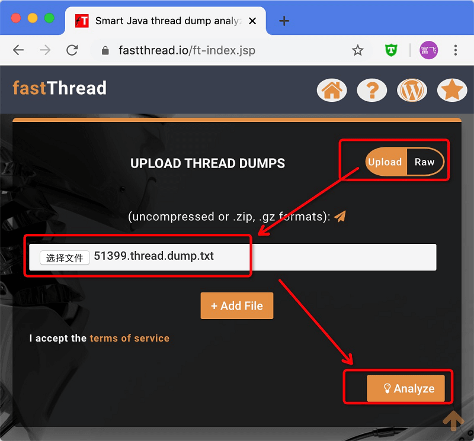

选择文件并上传，然后鼠标点击“分析”（Analyze）按钮即可。

#### **上传文本方式** 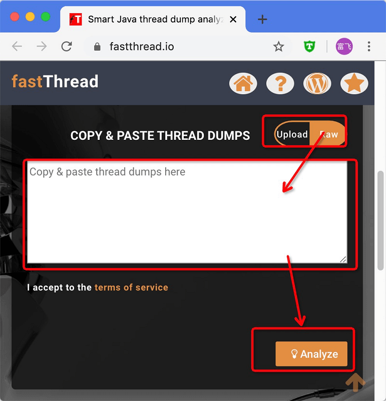

两种方式步骤都差不多，选择 RAW 方式上传文本字符串，然后点击分析按钮。

#### **分析结果页面**

等待片刻，自动跳转到分析结果页面。

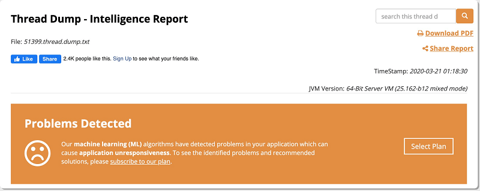

这里可以看到基本信息，以及右边的一些链接：

- 分享报告，可以很方便地把报告结果发送给其他小伙伴。

#### **线程数汇总** 把页面往下拉，可以看到线程数量汇总报告

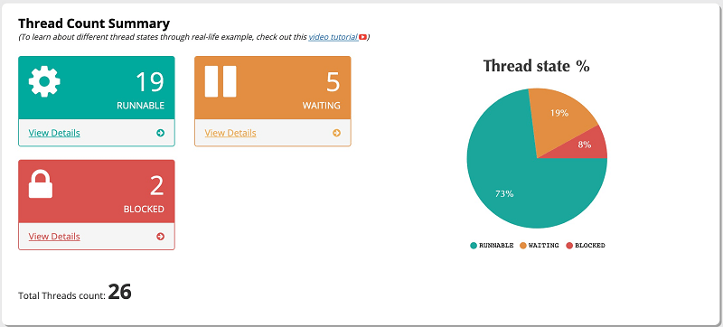

从这个报告中可以很直观地看到，线程总数为 26，其中 19 个运行状态线程，5 个等待状态的线程，2 个阻塞状态线程。

右边还给了一个饼图，展示各种状态所占的比例。

#### **线程组分析** 接着是将线程按照名称自动分组


这里就看到线程命名的好处了吧！如果我们的线程池统一命名，那么相关资源池的使用情况就很直观。

> 所以在代码里使用线程池的时候，统一添加线程名称就是一个好的习惯！

#### **守护线程分析** 接下来是守护线程分析

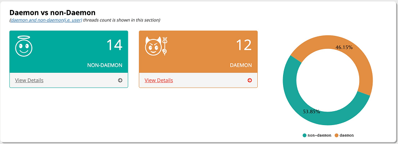

这里可以看到守护线程与前台线程的统计信息。

#### **死锁情况检测** 当然，也少不了死锁分析

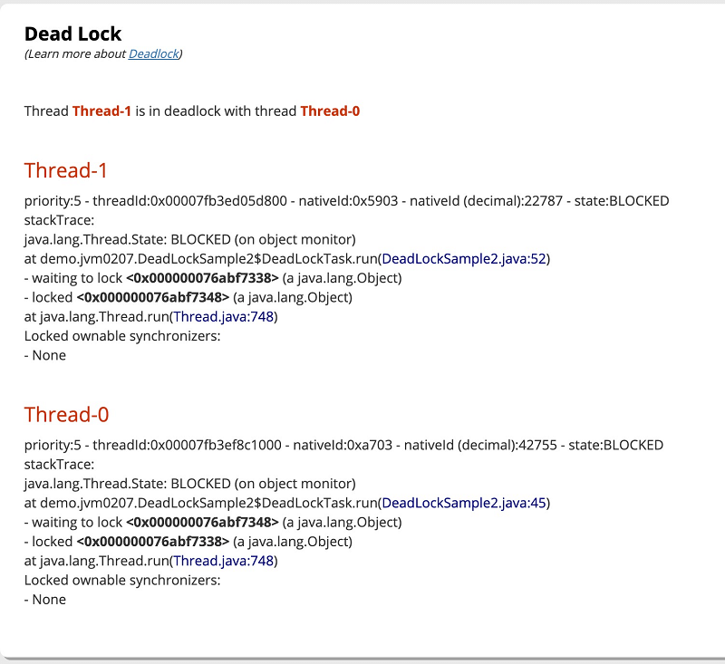

可以看到，各个工具得出的死锁检测结果都差不多。并不难分析，其中给出了线程名称，以及方法调用栈信息，等待的是哪个锁。

#### **线程调用栈情况** 以及线程调用情况

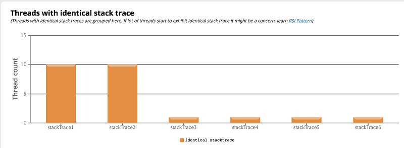

后面是这些线程的详情：

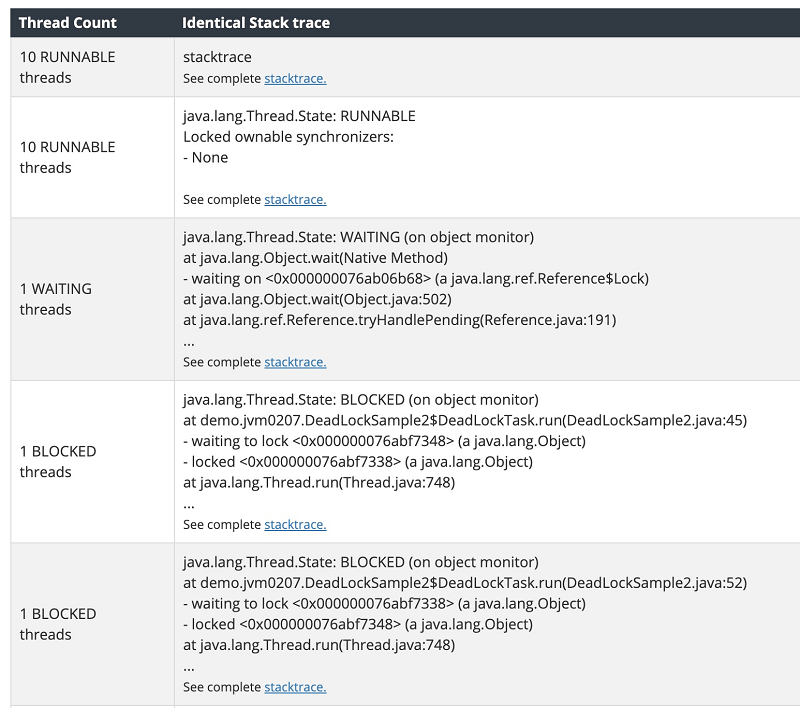

这块信息只是将相关的方法调用栈展示出来。

#### **热点方法统计** 热点方法是一个需要注意的重点，调用的越多，说明这一块可能是系统的性能瓶颈


这里展示了此次快照中正在执行的方法。如果只看热点方法抽样的话，更精确的工具是 JDK 内置的 hprof。

但如果有很多方法阻塞或等待，则线程快照中展示的热点方法位置可以快速确定问题出现的代码行。

#### **CPU 消耗信息** 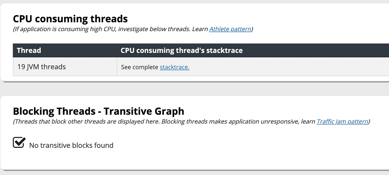

这里的提示信息不太明显，但给出了一些学习资源，这些资源请参考本文末尾给出的博客链接地址。

#### **GC 线程信息** 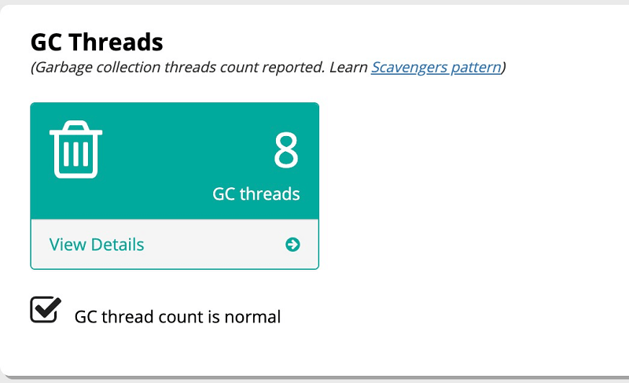

这里看到 GC 线程数是 8 个，这个值跟具体的 CPU 内核数量相差不大就算是正常的。

GC 线程数如果太多或者太少，会造成很多问题，我们在后面的章节中通过案例进行讲解。

#### **线程栈深度** 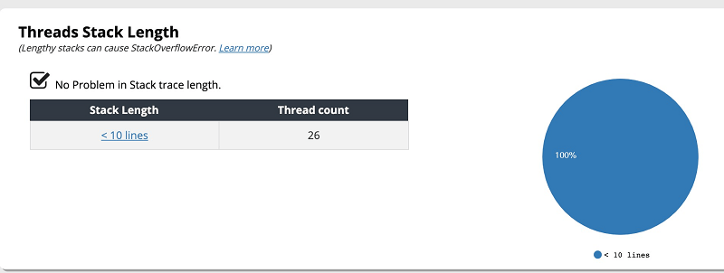

这里都小于10，说明堆栈都不深。

#### **复杂死锁检测** 接下来是复杂死锁检测和 Finalizer 线程的信息


简单死锁是指两个线程之间互相死等资源锁。那么什么复杂死锁呢？ 这个问题留给同学们自己搜索。

#### **火焰图** 

火焰图挺有趣，将所有线程调用栈汇总到一张图片中。

#### **调用栈树**

如果我们把所有的调用栈合并到一起，整体来看呢？

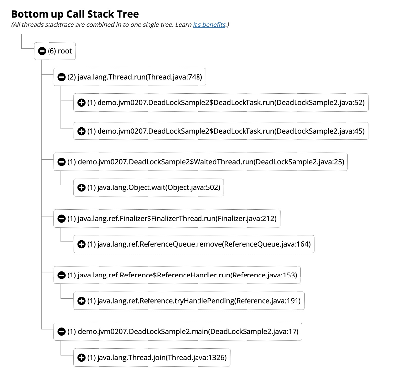

树形结构在有些时候也很有用，比如大量线程都在执行类似的调用栈路径时。

以上这些信息，都有助于我们去分析和排查 JVM 问题，而图形工具相对于命令行工具的好处是直观、方便、快速，帮我们省去过滤一些不必要的干扰信息的时间。

### 参考链接

- [8 个抓取 Java Thread Dumps 的方式](https://www.jianshu.com/p/433dfb0f7879)
- [Thread Dump 选项](https://blog.fastthread.io/2016/06/06/how-to-take-thread-dumps-7-options/)
- [FastThread 官方博客](https://blog.fastthread.io/)
