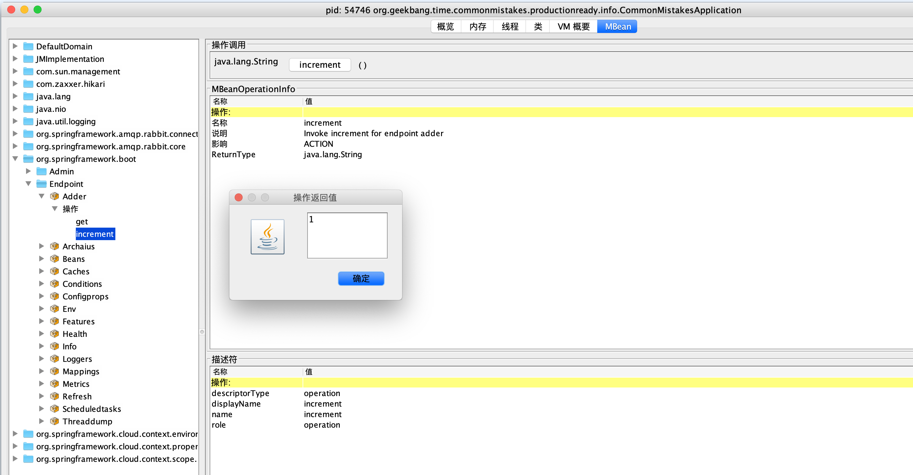
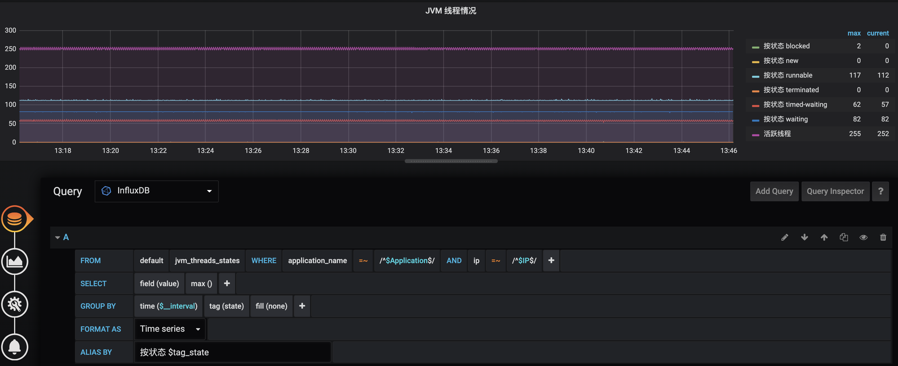
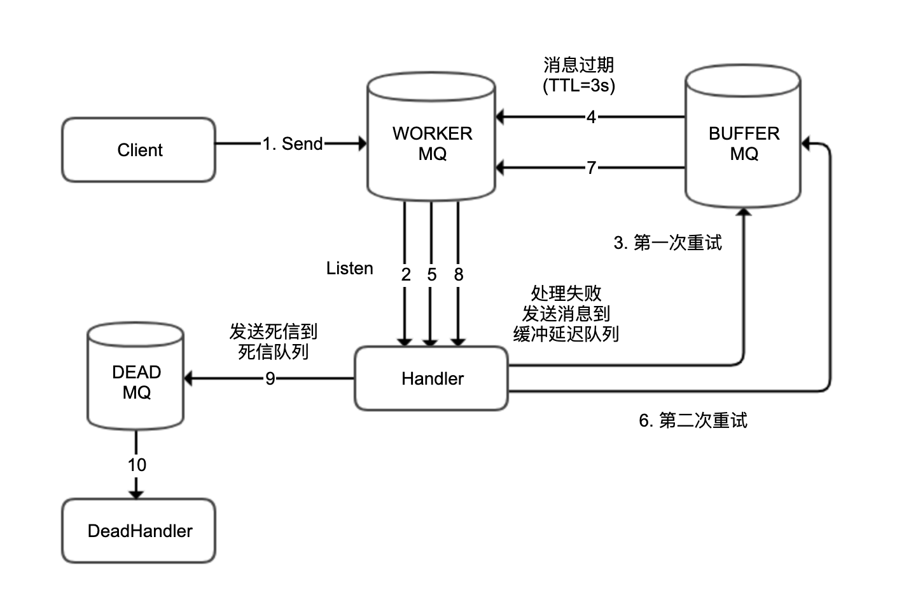

# 答疑篇：设计篇思考题答案合集

你好，我是朱晔。

今天，我们继续一起分析这门课“设计篇”模块的第 21~26 讲的课后思考题。这些题目涉及了代码重复、接口设计、缓存设计、生产就绪、异步处理和数据存储这 6 大知识点。

接下来，我们就一一具体分析吧。

### 21 | 代码重复：搞定代码重复的三个绝招

问题 1：除了模板方法设计模式是减少重复代码的一把好手，观察者模式也常用于减少代码重复（并且是松耦合方式），Spring 也提供了类似工具（点击这里查看），你能想到观察者模式有哪些应用场景吗？

答：其实，和使用 MQ 来解耦系统和系统的调用类似，应用内各个组件之间的调用我们也可以使用观察者模式来解耦，特别是当你的应用是一个大单体的时候。观察者模式除了是让组件之间可以更松耦合，还能更有利于消除重复代码。

其原因是，对于一个复杂的业务逻辑，里面必然涉及到大量其它组件的调用，虽然我们没有重复写这些组件内部处理逻辑的代码，但是这些复杂调用本身就构成了重复代码。

我们可以考虑把代码逻辑抽象一下，抽象出许多事件，围绕这些事件来展开处理，那么这种处理模式就从“命令式”变为了“环境感知式”，每一个组件就好像活在一个场景中，感知场景中的各种事件，然后又把发出处理结果作为另一个事件。

经过这种抽象，复杂组件之间的调用逻辑就变成了“事件抽象 + 事件发布 + 事件订阅”，整个代码就会更简化。

补充说明一下，除了观察者模式我们还经常听到发布订阅模式，那么它们有什么区别呢？

其实，观察者模式也可以叫做发布订阅模式。不过在严格定义上，前者属于松耦合，后者必须要 MQ Broker 的介入，实现发布者订阅者的完全解耦。

问题 2：关于 Bean 属性复制工具，除了最简单的 Spring 的 BeanUtils 工具类的使用，你还知道哪些对象映射类库吗？它们又有什么功能呢？

答：在众多对象映射工具中，MapStruct更具特色一点。它基于 JSR 269 的 Java 注解处理器实现（你可以理解为，它是编译时的代码生成器），使用的是纯 Java 方法而不是反射进行属性赋值，并且做到了编译时类型安全。

如果你使用 IDEA 的话，可以进一步安装 IDEA MapStruct Support 插件，实现映射配置的自动完成、跳转到定义等功能。关于这个插件的具体功能，你可以参考这里。

### 22 | 接口设计：系统间对话的语言，一定要统一

问题 1：在“接口的响应要明确表示接口的处理结果”这一节的例子中，接口响应结构体中的 code 字段代表执行结果的错误码，对于业务特别复杂的接口，可能会有很多错误情况，code 可能会有几十甚至几百个。客户端开发人员需要根据每一种错误情况逐一写 if-else 进行不同交互处理，会非常麻烦，你觉得有什么办法来改进吗？作为服务端，是否有必要告知客户端接口执行的错误码呢？

答：服务端把错误码反馈给客户端有两个目的，一是客户端可以展示错误码方便排查问题，二是客户端可以根据不同的错误码来做交互区分。

对于第一点方便客户端排查问题，服务端应该进行适当的收敛和规整错误码，而不是把服务内可能遇到的、来自各个系统各个层次的错误码，一股脑地扔给客户端提示给用户。

我的建议是，开发一个错误码服务来专门治理错误码，实现错误码的转码、分类和收敛逻辑，甚至可以开发后台，让产品来录入需要的错误码提示消息。

此外，我还建议错误码由一定的规则构成，比如错误码第一位可以是错误类型（比如 A 表示错误来源于用户；B 表示错误来源于当前系统，往往是业务逻辑出错，或程序健壮性差等问题；C 表示错误来源于第三方服务），第二、第三位可以是错误来自的系统编号（比如 01 来自用户服务，02 来自商户服务等等），后面三位是自增错误码 ID。

对于第二点对不同错误码的交互区分，我觉得更好的做法是服务端驱动模式，让服务端告知客户端如何处理，说白了就是客户端只需要照做即可，不需要感知错误码的含义（即便客户端显示错误码，也只是用于排错）。

比如，服务端的返回可以包含 actionType 和 actionInfo 两个字段，前者代表客户端应该做的交互动作，后者代表客户端完成这个交互动作需要的信息。其中，actionType 可以是 toast（无需确认的消息提示）、alert（需要确认的弹框提示）、redirectView（转到另一个视图）、redirectWebView（打开 Web 视图）等；actionInfo 就是 toast 的信息、alert 的信息、redirect 的 URL 等。

由服务端来明确客户端在请求 API 后的交互行为，主要的好处是灵活和统一两个方面。

灵活在于两个方面：第一，在紧急的时候还可以通过 redirect 方式进行救急。比如，遇到特殊情况需要紧急进行逻辑修改的情况时，我们可以直接在不发版的情况下切换到 H5 实现。第二是，我们可以提供后台，让产品或运营来配置交互的方式和信息（而不是改交互，改提示还需要客户端发版）。

统一：有的时候会遇到不同的客户端（比如 iOS、Android、前端），对于交互的实现不统一的情况，如果 API 结果可以规定这部分内容，那就可以彻底避免这个问题。

问题 2：在“要考虑接口变迁的版本控制策略”这一节的例子中，我们在类或方法上标记 @APIVersion 自定义注解，实现了 URL 方式统一的接口版本定义。你可以用类似的方式（也就是自定义 RequestMappingHandlerMapping），来实现一套统一的基于请求头方式的版本控制吗？

答：我在 GitHub 上第 21 讲的源码中更新了我的实现，你可以点击这里查看。主要原理是，定义自己的 RequestCondition 来做请求头的匹配：

```java
public class APIVersionCondition implements RequestCondition<APIVersionCondition> {
    @Getter
    private String apiVersion;
    @Getter
    private String headerKey;
    public APIVersionCondition(String apiVersion, String headerKey) {
        this.apiVersion = apiVersion;
        this.headerKey = headerKey;
    }
    @Override
    public APIVersionCondition combine(APIVersionCondition other) {
        return new APIVersionCondition(other.getApiVersion(), other.getHeaderKey());
    }
    @Override
    public APIVersionCondition getMatchingCondition(HttpServletRequest request) {
        String version = request.getHeader(headerKey);
        return apiVersion.equals(version) ? this : null;
    }
    @Override
    public int compareTo(APIVersionCondition other, HttpServletRequest request) {
        return 0;
    }
}
```

并且自定义 RequestMappingHandlerMapping，来把方法关联到自定义的 RequestCondition：

```java
public class APIVersionHandlerMapping extends RequestMappingHandlerMapping {
    @Override
    protected boolean isHandler(Class<?> beanType) {
        return AnnotatedElementUtils.hasAnnotation(beanType, Controller.class);
    }
    @Override
    protected RequestCondition<APIVersionCondition> getCustomTypeCondition(Class<?> handlerType) {
        APIVersion apiVersion = AnnotationUtils.findAnnotation(handlerType, APIVersion.class);
        return createCondition(apiVersion);
    }
    @Override
    protected RequestCondition<APIVersionCondition> getCustomMethodCondition(Method method) {
        APIVersion apiVersion = AnnotationUtils.findAnnotation(method, APIVersion.class);
        return createCondition(apiVersion);
    }
    private RequestCondition<APIVersionCondition> createCondition(APIVersion apiVersion) {
        return apiVersion == null ? null : new APIVersionCondition(apiVersion.value(), apiVersion.headerKey());
    }
}
```

### 23 | 缓存设计：缓存可以锦上添花也可以落井下石

问题 1：在聊到缓存并发问题时，我们说到热点 Key 回源会对数据库产生的压力问题，如果 Key 特别热的话，可能缓存系统也无法承受，毕竟所有的访问都集中打到了一台缓存服务器。如果我们使用 Redis 来做缓存，那可以把一个热点 Key 的缓存查询压力，分散到多个 Redis 节点上吗？

答：Redis 4.0 以上如果开启了 LFU 算法作为 maxmemory-policy，那么可以使用–hotkeys 配合 redis-cli 命令行工具来探查热点 Key。此外，我们还可以通过 MONITOR 命令来收集 Redis 执行的所有命令，然后配合redis-faina 工具来分析热点 Key、热点前缀等信息。

对于如何分散热点 Key 对于 Redis 单节点的压力的问题，我们可以考虑为 Key 加上一定范围的随机数作为后缀，让一个 Key 变为多个 Key，相当于对热点 Key 进行分区操作。

当然，除了分散 Redis 压力之外，我们也可以考虑再做一层短时间的本地缓存，结合 Redis 的 Keyspace 通知功能，来处理本地缓存的数据同步。

问题 2：大 Key 也是数据缓存容易出现的一个问题。如果一个 Key 的 Value 特别大，那么可能会对 Redis 产生巨大的性能影响，因为 Redis 是单线程模型，对大 Key 进行查询或删除等操作，可能会引起 Redis 阻塞甚至是高可用切换。你知道怎么查询 Redis 中的大 Key，以及如何在设计上实现大 Key 的拆分吗？

答：Redis 的大 Key 可能会导致集群内存分布不均问题，并且大 Key 的操作可能也会产生阻塞。

关于查询 Redis 中的大 Key，我们可以使用 redis-cli --bigkeys 命令来实时探查大 Key。此外，我们还可以使用 redis-rdb-tools 工具来分析 Redis 的 RDB 快照，得到包含 Key 的字节数、元素个数、最大元素长度等信息的 CSV 文件。然后，我们可以把这个 CSV 文件导入 MySQL 中，写 SQL 去分析。

针对大 Key，我们可以考虑两方面的优化：

第一，是否有必要在 Redis 保存这么多数据。一般情况下，我们在缓存系统中保存面向呈现的数据，而不是原始数据；对于原始数据的计算，我们可以考虑其它文档型或搜索型的 NoSQL 数据库。

第二，考虑把具有二级结构的 Key（比如 List、Set、Hash）拆分成多个小 Key，来独立获取（或是用 MGET 获取）。

此外值得一提的是，大 Key 的删除操作可能会产生较大性能问题。从 Redis 4.0 开始，我们可以使用 UNLINK 命令而不是 DEL 命令在后台删除大 Key；而对于 4.0 之前的版本，我们可以考虑使用游标删除大 Key 中的数据，而不是直接使用 DEL 命令，比如对于 Hash 使用 HSCAN+HDEL 结合管道功能来删除。

### 24 | 业务代码写完，就意味着生产就绪了？

问题 1：Spring Boot Actuator 提供了大量内置端点，你觉得端点和自定义一个 @RestController 有什么区别呢？你能否根据官方文档，开发一个自定义端点呢？

答：Endpoint 是 Spring Boot Actuator 抽象出来的一个概念，主要用于监控和配置。使用 @Endpoint 注解自定义端点，配合方法上的 @ReadOperation、@WriteOperation、@DeleteOperation 注解，分分钟就可以开发出自动通过 HTTP 或 JMX 进行暴露的监控点。

如果只希望通过 HTTP 暴露的话，可以使用 @WebEndpoint 注解；如果只希望通过 JMX 暴露的话，可以使用 @JmxEndpoint 注解。

而使用 @RestController 一般用于定义业务接口，如果数据需要暴露到 JMX 的话需要手动开发。

比如，下面这段代码展示了如何定义一个累加器端点，提供了读取操作和累加两个操作：

```java
@Endpoint(id = "adder")
@Component
public class TestEndpoint {
    private static AtomicLong atomicLong = new AtomicLong();
    //读取值
    @ReadOperation
    public String get() {
        return String.valueOf(atomicLong.get());
    }
    //累加值
    @WriteOperation
    public String increment() {
        return String.valueOf(atomicLong.incrementAndGet());
    }
}
```

然后，我们可以通过 HTTP 或 JMX 来操作这个累加器。这样，我们就实现了一个自定义端点，并且可以通过 JMX 来操作：



问题 2：在介绍指标 Metrics 时我们看到，InfluxDB 中保存了由 Micrometer 框架自动帮我们收集的一些应用指标。你能否参考源码中两个 Grafana 配置的 JSON 文件，把这些指标在 Grafana 中配置出一个完整的应用监控面板呢？

答：我们可以参考Micrometer 源码中的 binder 包下面的类，来了解 Micrometer 帮我们自动做的一些指标。

JVM 在线时间：process.uptime

系统 CPU 使用：system.cpu.usage

JVM 进程 CPU 使用：process.cpu.usage

系统 1 分钟负载：system.load.average.1m

JVM 使用内存：jvm.memory.used

JVM 提交内存：jvm.memory.committed

JVM 最大内存：jvm.memory.max

JVM 线程情况：jvm.threads.states

JVM GC 暂停：jvm.gc.pause、jvm.gc.concurrent.phase.time

剩余磁盘：disk.free

Logback 日志数量：logback.events

Tomcat 线程情况（最大、繁忙、当前）：tomcat.threads.config.max、tomcat.threads.busy、tomcat.threads.current

具体的面板配置方式，第 24 讲中已有说明。这里，我只和你分享在配置时会用到的两个小技巧。

第一个小技巧是，把公共的标签配置为下拉框固定在页头显示：一般来说，我们会配置一个面板给所有的应用使用（每一个指标中我们都会保存应用名称、IP 地址等信息，这个功能可以使用 Micrometer 的 CommonTags 实现，参考文档的 5.2 节），我们可以利用 Grafana 的Variables功能把应用名称和 IP 展示为两个下拉框显示，同时提供一个 adhoc 筛选器自由增加筛选条件：


来到 Variables 面板，可以看到我配置的三个变量：


Application 和 IP 两个变量的查询语句如下：

```plaintext
SHOW TAG VALUES FROM jvm_memory_used WITH KEY = "application_name"
SHOW TAG VALUES FROM jvm_memory_used WITH KEY = "ip" WHERE application_name=~ /^$Application$/
```

第二个小技巧是，利用 GROUP BY 功能展示一些明细的曲线：类似 jvm_threads_states、jvm.gc.pause 等指标中包含了更细节的一些状态区分标签，比如 jvm_threads_states 中的 state 标签代表了线程状态。一般而言，我们在展现图表的时候需要按照线程状态分组分曲线显示：



配置的 InfluxDB 查询语句是：

```sql
SELECT max("value") FROM "jvm_threads_states" WHERE ("application_name" =~ /^$Application$/ AND "ip" =~ /^$IP$/) AND $timeFilter GROUP BY time($__interval), "state" fill(none)
```

这里可以看到，application_name 和 ip 两个条件的值，是关联到刚才我们配置的两个变量的，在 GROUP BY 中增加了按照 state 的分组。

### 25 | 异步处理好用，但非常容易用错

问题 1：在用户注册后发送消息到 MQ，然后会员服务监听消息进行异步处理的场景下，有些时候我们会发现，虽然用户服务先保存数据再发送 MQ，但会员服务收到消息后去查询数据库，却发现数据库中还没有新用户的信息。你觉得，这可能是什么问题呢，又该如何解决呢？

答：我先来分享下，我遇到这个问题的真实情况。

当时，我们是因为业务代码把保存数据和发 MQ 消息放在了一个事务中，收到消息的时候有可能事务还没有提交完成。为了解决这个问题，开发同学当时的处理方式是，收 MQ 消息的时候 Sleep 1 秒再去处理。这样虽然解决了问题，但却大大降低了消息处理的吞吐量。

更好的做法是先提交事务，完成后再发 MQ 消息。但是，这又引申出来一个问题：MQ 消息发送失败怎么办，如何确保发送消息和本地事务有整体事务性？这就需要进一步考虑建立本地消息表来确保 MQ 消息可补偿，把业务处理和保存 MQ 消息到本地消息表的操作，放在相同事务内处理，然后异步发送和补偿消息表中的消息到 MQ。

问题 2：除了使用 Spring AMQP 实现死信消息的重投递外，RabbitMQ 2.8.0 后支持的死信交换器 DLX 也可以实现类似功能。你能尝试用 DLX 实现吗，并比较下这两种处理机制？

答：其实 RabbitMQ 的DLX 死信交换器和普通交换器没有什么区别，只不过它有一个特点是，可以把其它队列关联到这个 DLX 交换器上，然后消息过期后自动会转发到 DLX 交换器。那么，我们就可以利用这个特点来实现延迟消息重投递，经过一定次数之后还是处理失败则作为死信处理。

实现结构如下图所示：



关于这个实现架构图，我需要说明的是：

为了简单起见，图中圆柱体代表交换器 + 队列，并省去了 RoutingKey。

WORKER 作为 DLX 用于处理消息，BUFFER 用于临时存放需要延迟重试的消息，WORKER 和 BUFFER 绑定在一起。

DEAD 用于存放超过重试次数的死信。

在这里 WORKER 其实是一个 DLX，我们把它绑定到 BUFFER 实现延迟重试。

通过 RabbitMQ 实现具有延迟重试功能的消息重试以及最后进入死信队列的整个流程如下：

客户端发送记录到 WORKER；

Handler 收到消息后处理失败；

第一次重试，发送消息到 BUFFER；

3 秒后消息过期，自动转发到 WORKER；

Handler 再次收到消息后处理失败；

第二次重试，发送消息到 BUFFER；

3 秒后消息过期，还是自动转发到 WORKER；

Handler 再次收到消息后处理失败，达到最大重试次数；

发送消息到 DEAD（作为死信消息）；

DeadHandler 收到死信处理（比如进行人工处理）。

整个程序的日志输出如下，可以看到输出日志和我们前面贴出的结构图、详细解释的流程一致：

```plaintext
[21:59:48.625] [http-nio-45678-exec-1] [INFO ] [o.g.t.c.a.r.DeadLetterController:24  ] - Client 发送消息 msg1
[21:59:48.640] [org.springframework.amqp.rabbit.RabbitListenerEndpointContainer#0-1] [INFO ] [o.g.t.c.a.rabbitmqdlx.MQListener:27  ] - Handler 收到消息：msg1
[21:59:48.641] [org.springframework.amqp.rabbit.RabbitListenerEndpointContainer#0-1] [INFO ] [o.g.t.c.a.rabbitmqdlx.MQListener:33  ] - Handler 消费消息：msg1 异常，准备重试第1次
[21:59:51.643] [org.springframework.amqp.rabbit.RabbitListenerEndpointContainer#0-1] [INFO ] [o.g.t.c.a.rabbitmqdlx.MQListener:27  ] - Handler 收到消息：msg1
[21:59:51.644] [org.springframework.amqp.rabbit.RabbitListenerEndpointContainer#0-1] [INFO ] [o.g.t.c.a.rabbitmqdlx.MQListener:33  ] - Handler 消费消息：msg1 异常，准备重试第2次
[21:59:54.646] [org.springframework.amqp.rabbit.RabbitListenerEndpointContainer#0-1] [INFO ] [o.g.t.c.a.rabbitmqdlx.MQListener:27  ] - Handler 收到消息：msg1
[21:59:54.646] [org.springframework.amqp.rabbit.RabbitListenerEndpointContainer#0-1] [INFO ] [o.g.t.c.a.rabbitmqdlx.MQListener:40  ] - Handler 消费消息：msg1 异常，已重试 2 次，发送到死信队列处理！
[21:59:54.649] [org.springframework.amqp.rabbit.RabbitListenerEndpointContainer#1-1] [ERROR] [o.g.t.c.a.rabbitmqdlx.MQListener:62  ] - DeadHandler 收到死信消息： msg1
```

接下来，我们再对比下这种实现方式和第 25 讲中 Spring 重试的区别。其实，这两种实现方式的差别很大，体现在下面两点。

第一点，Spring 的重试是在处理的时候，在线程内休眠进行延迟重试，消息不会重发到 MQ；我们这个方案中处理失败的消息会发送到 RMQ，由 RMQ 做延迟处理。

第二点，Spring 的重试方案，只涉及普通队列和死信队列两个队列（或者说交换器）；我们这个方案的实现中涉及工作队列、缓冲队列（用于存放等待延迟重试的消息）和死信队列（真正需要人工处理的消息）三个队列。

当然了，如果你希望把存放正常消息的队列和把存放需要重试处理消息的队列区分开的话，可以把我们这个方案中的队列再拆分下，变为四个队列，也就是工作队列、重试队列、缓冲队列（关联到重试队列作为 DLX）和死信队列。

这里我再强调一下，虽然说我们利用了 RMQ 的 DLX 死信交换器的功能，但是我们把 DLX 当做了工作队列来使用，因为我们利用的是其能自动（从 BUFFER 缓冲队列）接收过期消息的特性。

这部分源码比较长，我直接放在 GitHub 上了。感兴趣的话，你可以点击这里的链接查看。

### 26 | 数据存储：NoSQL 与 RDBMS 如何取长补短、相辅相成？

问题 1：我们提到，InfluxDB 不能包含太多 tag。你能写一段测试代码，来模拟这个问题，并观察下 InfluxDB 的内存使用情况吗？

答：我们写一段如下的测试代码：向 InfluxDB 写入大量指标，每一条指标关联 10 个 Tag，每一个 Tag 都是 100000 以内的随机数，这种方式会造成high series cardinality 问题，从而大量占用 InfluxDB 的内存。

```java
@GetMapping("influxdbwrong")
public void influxdbwrong() {
    OkHttpClient.Builder okHttpClientBuilder = new OkHttpClient().newBuilder()
            .connectTimeout(1, TimeUnit.SECONDS)
            .readTimeout(60, TimeUnit.SECONDS)
            .writeTimeout(60, TimeUnit.SECONDS);
    try (InfluxDB influxDB = InfluxDBFactory.connect("http://127.0.0.1:8086", "root", "root", okHttpClientBuilder)) {
        influxDB.setDatabase("performance");
        //插入100000条记录
        IntStream.rangeClosed(1, 100000).forEach(i -> {
            Map<String, String> tags = new HashMap<>();
            //每条记录10个tag，tag的值是100000以内随机值
            IntStream.rangeClosed(1, 10).forEach(j -> tags.put("tagkey" + i, "tagvalue" + ThreadLocalRandom.current().nextInt(100000)));
            Point point = Point.measurement("bad")
                    .tag(tags)
                    .addField("value", ThreadLocalRandom.current().nextInt(10000))
                    .time(System.currentTimeMillis(), TimeUnit.MILLISECONDS)
                    .build();
            influxDB.write(point);
        });
    }
}
```

不过因为 InfluxDB 的默认参数配置限制了 Tag 的值数量以及数据库 Series 数量：

```plaintext
max-values-per-tag = 100000
max-series-per-database = 1000000
```

所以这个程序很快就会出错，无法形成 OOM，你可以把这两个参数改为 0 来解除这个限制。

继续运行程序，我们可以发现 InfluxDB 占用大量内存最终出现 OOM。

问题 2：文档数据库 MongoDB，也是一种常用的 NoSQL。你觉得 MongoDB 的优势和劣势是什么呢？它适合用在什么场景下呢？

答：MongoDB 是目前比较火的文档型 NoSQL。虽然 MongoDB 在 4.0 版本后具有了事务功能，但是它整体的稳定性相比 MySQL 还是有些差距。因此，MongoDB 不太适合作为重要数据的主数据库，但可以用来存储日志、爬虫等数据重要程度不那么高，但写入并发量又很大的场景。

虽然 MongoDB 的写入性能较高，但复杂查询性能却相比 Elasticsearch 来说没啥优势；虽然 MongoDB 有 Sharding 功能，但是还不太稳定。因此，我个人建议在数据写入量不大、更新不频繁，并且不需要考虑事务的情况下，使用 Elasticsearch 来替换 MongoDB。

以上，就是咱们这门课的第 21~26 讲的思考题答案了。

关于这些题目，以及背后涉及的知识点，如果你还有哪里感觉不清楚的，欢迎在评论区与我留言，也欢迎你把今天的内容分享给你的朋友或同事，一起交流。
