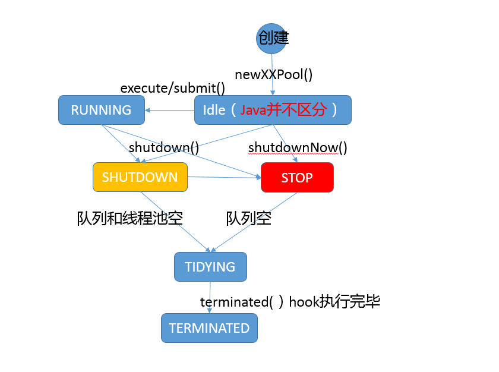

# 21 Java并发类库提供的线程池有哪几种？ 分别有什么特点？

我在\[专栏第 17 讲\]中介绍过线程是不能够重复启动的，创建或销毁线程存在一定的开销，所以利用线程池技术来提高系统资源利用效率，并简化线程管理，已经是非常成熟的选择。

今天我要问你的问题是，Java 并发类库提供的线程池有哪几种？ 分别有什么特点？

## 典型回答

通常开发者都是利用 Executors 提供的通用线程池创建方法，去创建不同配置的线程池，主要区别在于不同的 ExecutorService 类型或者不同的初始参数。

Executors 目前提供了 5 种不同的线程池创建配置：

- newCachedThreadPool()，它是一种用来处理大量短时间工作任务的线程池，具有几个鲜明特点：它会试图缓存线程并重用，当无缓存线程可用时，就会创建新的工作线程；如果线程闲置的时间超过 60 秒，则被终止并移出缓存；长时间闲置时，这种线程池，不会消耗什么资源。其内部使用 SynchronousQueue 作为工作队列。
- newFixedThreadPool(int nThreads)，重用指定数目（nThreads）的线程，其背后使用的是无界的工作队列，任何时候最多有 nThreads 个工作线程是活动的。这意味着，如果任务数量超过了活动队列数目，将在工作队列中等待空闲线程出现；如果有工作线程退出，将会有新的工作线程被创建，以补足指定的数目 nThreads。
- newSingleThreadExecutor()，它的特点在于工作线程数目被限制为 1，操作一个无界的工作队列，所以它保证了所有任务的都是被顺序执行，最多会有一个任务处于活动状态，并且不允许使用者改动线程池实例，因此可以避免其改变线程数目。
- newSingleThreadScheduledExecutor() 和 newScheduledThreadPool(int corePoolSize)，创建的是个 ScheduledExecutorService，可以进行定时或周期性的工作调度，区别在于单一工作线程还是多个工作线程。
- newWorkStealingPool(int parallelism)，这是一个经常被人忽略的线程池，Java 8 才加入这个创建方法，其内部会构建[ForkJoinPool](https://docs.oracle.com/javase/9/docs/api/java/util/concurrent/ForkJoinPool.html)，利用[Work-Stealing](https://en.wikipedia.org/wiki/Work_stealing)算法，并行地处理任务，不保证处理顺序。

## 考点分析

Java 并发包中的 Executor 框架无疑是并发编程中的重点，今天的题目考察的是对几种标准线程池的了解，我提供的是一个针对最常见的应用方式的回答。

在大多数应用场景下，使用 Executors 提供的 5 个静态工厂方法就足够了，但是仍然可能需要直接利用 ThreadPoolExecutor 等构造函数创建，这就要求你对线程构造方式有进一步的了解，你需要明白线程池的设计和结构。

另外，线程池这个定义就是个容易让人误解的术语，因为 ExecutorService 除了通常意义上“池”的功能，还提供了更全面的线程管理、任务提交等方法。

Executor 框架可不仅仅是线程池，我觉得至少下面几点值得深入学习：

- 掌握 Executor 框架的主要内容，至少要了解组成与职责，掌握基本开发用例中的使用。
- 对线程池和相关并发工具类型的理解，甚至是源码层面的掌握。
- 实践中有哪些常见问题，基本的诊断思路是怎样的。
- 如何根据自身应用特点合理使用线程池。

## 知识扩展

首先，我们来看看 Executor 框架的基本组成，请参考下面的类图。


我们从整体上把握一下各个类型的主要设计目的：

- Executor 是一个基础的接口，其初衷是将任务提交和任务执行细节解耦，这一点可以体会其定义的唯一方法。

```java
void execute(Runnable command);
```

Executor 的设计是源于 Java 早期线程 API 使用的教训，开发者在实现应用逻辑时，被太多线程创建、调度等不相关细节所打扰。就像我们进行 HTTP 通信，如果还需要自己操作 TCP 握手，开发效率低下，质量也难以保证。

- ExecutorService 则更加完善，不仅提供 service 的管理功能，比如 shutdown 等方法，也提供了更加全面的提交任务机制，如返回[Future](https://docs.oracle.com/javase/9/docs/api/java/util/concurrent/Future.html)而不是 void 的 submit 方法。

```java
<T> Future<T> submit(Callable<T> task);
```

注意，这个例子输入的可是[Callable](https://docs.oracle.com/javase/9/docs/api/java/util/concurrent/Callable.html)，它解决了 Runnable 无法返回结果的困扰。

- Java 标准类库提供了几种基础实现，比如[ThreadPoolExecutor](https://docs.oracle.com/javase/9/docs/api/java/util/concurrent/ThreadPoolExecutor.html)、[ScheduledThreadPoolExecutor](https://docs.oracle.com/javase/9/docs/api/java/util/concurrent/ScheduledThreadPoolExecutor.html)、[ForkJoinPool](https://docs.oracle.com/javase/9/docs/api/java/util/concurrent/ForkJoinPool.html)。这些线程池的设计特点在于其高度的可调节性和灵活性，以尽量满足复杂多变的实际应用场景，我会进一步分析其构建部分的源码，剖析这种灵活性的源头。
- Executors 则从简化使用的角度，为我们提供了各种方便的静态工厂方法。

下面我就从源码角度，分析线程池的设计与实现，我将主要围绕最基础的 ThreadPoolExecutor 源码。ScheduledThreadPoolExecutor 是 ThreadPoolExecutor 的扩展，主要是增加了调度逻辑，如想深入了解，你可以参考相关[教程](https://www.journaldev.com/2340/java-scheduler-scheduledexecutorservice-scheduledthreadpoolexecutor-example)。而 ForkJoinPool 则是为 ForkJoinTask 定制的线程池，与通常意义的线程池有所不同。

这部分内容比较晦涩，罗列概念也不利于你去理解，所以我会配合一些示意图来说明。在现实应用中，理解应用与线程池的交互和线程池的内部工作过程，你可以参考下图。


简单理解一下：

- 工作队列负责存储用户提交的各个任务，这个工作队列，可以是容量为 0 的 SynchronousQueue（使用 newCachedThreadPool），也可以是像固定大小线程池（newFixedThreadPool）那样使用 LinkedBlockingQueue。

```java
private final BlockingQueue<Runnable> workQueue; 
```

- 内部的“线程池”，这是指保持工作线程的集合，线程池需要在运行过程中管理线程创建、销毁。例如，对于带缓存的线程池，当任务压力较大时，线程池会创建新的工作线程；当业务压力退去，线程池会在闲置一段时间（默认 60 秒）后结束线程。

```java
private final HashSet<Worker> workers = new HashSet<>();
```

线程池的工作线程被抽象为静态内部类 Worker，基于[AQS](https://docs.oracle.com/javase/9/docs/api/java/util/concurrent/locks/AbstractQueuedSynchronizer.html)实现。

- ThreadFactory 提供上面所需要的创建线程逻辑。
- 如果任务提交时被拒绝，比如线程池已经处于 SHUTDOWN 状态，需要为其提供处理逻辑，Java 标准库提供了类似[ThreadPoolExecutor.AbortPolicy](https://docs.oracle.com/javase/9/docs/api/java/util/concurrent/ThreadPoolExecutor.AbortPolicy.html)等默认实现，也可以按照实际需求自定义。

从上面的分析，就可以看出线程池的几个基本组成部分，一起都体现在线程池的构造函数中，从字面我们就可以大概猜测到其用意：

- corePoolSize，所谓的核心线程数，可以大致理解为长期驻留的线程数目（除非设置了 allowCoreThreadTimeOut）。对于不同的线程池，这个值可能会有很大区别，比如 newFixedThreadPool 会将其设置为 nThreads，而对于 newCachedThreadPool 则是为 0。
- maximumPoolSize，顾名思义，就是线程不够时能够创建的最大线程数。同样进行对比，对于 newFixedThreadPool，当然就是 nThreads，因为其要求是固定大小，而 newCachedThreadPool 则是 Integer.MAX_VALUE。
- keepAliveTime 和 TimeUnit，这两个参数指定了额外的线程能够闲置多久，显然有些线程池不需要它。
- workQueue，工作队列，必须是 BlockingQueue。

通过配置不同的参数，我们就可以创建出行为大相径庭的线程池，这就是线程池高度灵活性的基础。

```java
public ThreadPoolExecutor(int corePoolSize,
                       int maximumPoolSize,
                       long keepAliveTime,
                       TimeUnit unit,
                       BlockingQueue<Runnable> workQueue,
                       ThreadFactory threadFactory,
                       RejectedExecutionHandler handler) 
```

进一步分析，线程池既然有生命周期，它的状态是如何表征的呢？

这里有一个非常有意思的设计，ctl 变量被赋予了双重角色，通过高低位的不同，既表示线程池状态，又表示工作线程数目，这是一个典型的高效优化。试想，实际系统中，虽然我们可以指定线程极限为 Integer.MAX_VALUE，但是因为资源限制，这只是个理论值，所以完全可以将空闲位赋予其他意义。

```java
private final AtomicInteger ctl = new AtomicInteger(ctlOf(RUNNING, 0));
// 真正决定了工作线程数的理论上限 
private static final int COUNT_BITS = Integer.SIZE - 3;
private static final int COUNT_MASK = (1 << COUNT_BITS) - 1;
// 线程池状态，存储在数字的高位
private static final int RUNNING = -1 << COUNT_BITS;
…
// Packing and unpacking ctl
private static int runStateOf(int c)  { return c & ~COUNT_MASK; }
private static int workerCountOf(int c)  { return c & COUNT_MASK; }
private static int ctlOf(int rs, int wc) { return rs | wc; }
```

为了让你能对线程生命周期有个更加清晰的印象，我这里画了一个简单的状态流转图，对线程池的可能状态和其内部方法之间进行了对应，如果有不理解的方法，请参考 Javadoc。 **注意** ，实际 Java 代码中并不存在所谓 Idle 状态，我添加它仅仅是便于理解。



前面都是对线程池属性和构建等方面的分析，下面我选择典型的 execute 方法，来看看其是如何工作的，具体逻辑请参考我添加的注释，配合代码更加容易理解。

```java
public void execute(Runnable command) {
    …
 int c = ctl.get();
    // 检查工作线程数目，低于 corePoolSize 则添加 Worker
 if (workerCountOf(c) < corePoolSize) {
     if (addWorker(command, true))
         return;
     c = ctl.get();
 }
    // isRunning 就是检查线程池是否被 shutdown
    // 工作队列可能是有界的，offer 是比较友好的入队方式
 if (isRunning(c) && workQueue.offer(command)) {
     int recheck = ctl.get();
        // 再次进行防御性检查
     if (! isRunning(recheck) && remove(command))
         reject(command);
     else if (workerCountOf(recheck) == 0)
         addWorker(null, false);
 }
    // 尝试添加一个 worker，如果失败意味着已经饱和或者被 shutdown 了
 else if (!addWorker(command, false))
     reject(command);
}
```

### 线程池实践

线程池虽然为提供了非常强大、方便的功能，但是也不是银弹，使用不当同样会导致问题。我这里介绍些典型情况，经过前面的分析，很多方面可以自然的推导出来。

- 避免任务堆积。前面我说过 newFixedThreadPool 是创建指定数目的线程，但是其工作队列是无界的，如果工作线程数目太少，导致处理跟不上入队的速度，这就很有可能占用大量系统内存，甚至是出现 OOM。诊断时，你可以使用 jmap 之类的工具，查看是否有大量的任务对象入队。
- 避免过度扩展线程。我们通常在处理大量短时任务时，使用缓存的线程池，比如在最新的 HTTP/2 client API 中，目前的默认实现就是如此。我们在创建线程池的时候，并不能准确预计任务压力有多大、数据特征是什么样子（大部分请求是 1K 、100K 还是 1M 以上？），所以很难明确设定一个线程数目。
- 另外，如果线程数目不断增长（可以使用 jstack 等工具检查），也需要警惕另外一种可能性，就是线程泄漏，这种情况往往是因为任务逻辑有问题，导致工作线程迟迟不能被释放。建议你排查下线程栈，很有可能多个线程都是卡在近似的代码处。
- 避免死锁等同步问题，对于死锁的场景和排查，你可以复习[专栏第 18 讲](http://time.geekbang.org/column/article/9266)。
- 尽量避免在使用线程池时操作 ThreadLocal，同样是[专栏第 17 讲](http://time.geekbang.org/column/article/9103)已经分析过的，通过今天的线程池学习，应该更能理解其原因，工作线程的生命周期通常都会超过任务的生命周期。

### 线程池大小的选择策略

上面我已经介绍过，线程池大小不合适，太多会太少，都会导致麻烦，所以我们需要去考虑一个合适的线程池大小。虽然不能完全确定，但是有一些相对普适的规则和思路。

- 如果我们的任务主要是进行计算，那么就意味着 CPU 的处理能力是稀缺的资源，我们能够通过大量增加线程数提高计算能力吗？往往是不能的，如果线程太多，反倒可能导致大量的上下文切换开销。所以，这种情况下，通常建议按照 CPU 核的数目 N 或者 N+1。
- 如果是需要较多等待的任务，例如 I/O 操作比较多，可以参考 Brain Goetz 推荐的计算方法：

!!! note
线程数 = CPU 核数 × （1 + 平均等待时间 / 平均工作时间）

这些时间并不能精准预计，需要根据采样或者概要分析等方式进行计算，然后在实际中验证和调整。

- 上面是仅仅考虑了 CPU 等限制，实际还可能受各种系统资源限制影响，例如我最近就在 Mac OS X 上遇到了大负载时[ephemeral 端口受限](https://danielmendel.github.io/blog/2013/04/07/benchmarkers-beware-the-ephemeral-port-limit/)的情况。当然，我是通过扩大可用端口范围解决的，如果我们不能调整资源的容量，那么就只能限制工作线程的数目了。这里的资源可以是文件句柄、内存等。

另外，在实际工作中，不要把解决问题的思路全部指望到调整线程池上，很多时候架构上的改变更能解决问题，比如利用背压机制的[Reactive Stream](http://www.reactive-streams.org/)、合理的拆分等。

今天，我从 Java 创建的几种线程池开始，对 Executor 框架的主要组成、线程池结构与生命周期等方面进行了讲解和分析，希望对你有所帮助。

## 一课一练

关于今天我们讨论的题目你做到心中有数了吗？今天的思考题是从逻辑上理解，线程池创建和生命周期。请谈一谈，如果利用 newSingleThreadExecutor() 创建一个线程池，corePoolSize、maxPoolSize 等都是什么数值？ThreadFactory 可能在线程池生命周期中被使用多少次？怎么验证自己的判断？
