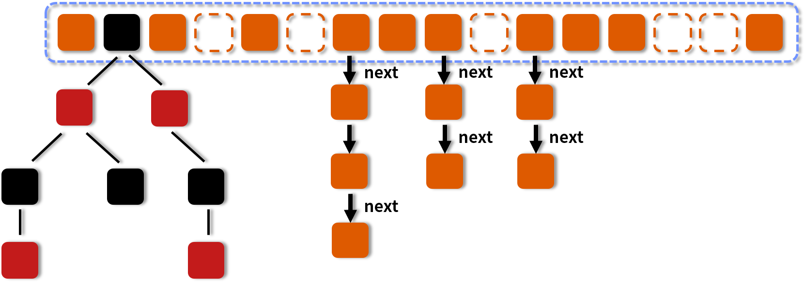

# 32 同样是线程安全，ConcurrentHashMap 和 Hashtable 的区别

在本课时我们主要讲解同样是线程安全，ConcurrentHashMap 与 Hashtable 到底有什么区别呢？

我们都知道 HashMap 不是线程安全的，而 ConcurrentHashMap 和 Hashtable 它们两个确实都是线程安全的，那它们有哪些不同点呢？我们从以下四个角度出发，去分析它们的不同点。

### 出现的版本不同

我们先从表面的、显而易见的出现时间来分析。Hashtable 在 JDK1.0 的时候就存在了，并在 JDK1.2 版本中实现了 Map 接口，成为了集合框架的一员。而 ConcurrentHashMap 则是在 JDK1.5 中才出现的，也正是因为它们出现的年代不同，而后出现的往往是对前面出现的类的优化，所以它们在实现方式以及性能上，也存在着较大的不同。

### 实现线程安全的方式不同

虽然 ConcurrentHashMap 和 Hashtable 它们两个都是线程安全的，但是从原理上分析，Hashtable 实现并发安全的原理是通过 synchronized 关键字，让我们直接看下源码，以 clear() 方法为例，代码如下：

```java
public synchronized void clear() {
    Entry<?,?> tab[] = table;
    modCount++;
    for (int index = tab.length; --index >= 0; )
        tab[index] = null;
    count = 0;
}
```

可以看出这个 clear() 方法是被 synchronized 关键字所修饰的，同理其他的方法例如 put、get、size 等，也同样是被 synchronized 关键字修饰的。之所以 Hashtable 是线程安全的，是因为几乎每个方法都被 synchronized 关键字所修饰了，这也就保证了线程安全。

Collections.SynchronizedMap(new HashMap()) 的原理和 Hashtable 类似，也是利用 synchronized 实现的。而我们的 ConcurrentHashMap 实现的原理，却有大大的不同，让我们看一下它在 Java 8 中的结构示意图：



对于 ConcurrentHashMap 的原理，我们在第 30 课时的时候有过详细的介绍和源码分析，本质上它实现线程安全的原理是利用了 CAS + synchronized + Node 节点的方式，这和 Hashtable 的完全利用 synchronized 的方式有很大的不同。

### 性能不同

正因为它们在线程安全的实现方式上的不同，导致它们在性能方面也有很大的不同。当线程数量增加的时候，Hashtable 的性能会急剧下降，因为每一次修改都需要锁住整个对象，而其他线程在此期间是不能操作的。不仅如此，还会带来额外的上下文切换等开销，所以此时它的吞吐量甚至还不如单线程的情况。

而在 ConcurrentHashMap 中，就算上锁也仅仅会对一部分上锁而不是全部都上锁，所以多线程中的吞吐量通常都会大于单线程的情况，也就是说，在并发效率上，ConcurrentHashMap 比 Hashtable 提高了很多。

### 迭代时修改的不同

Hashtable（包括 HashMap）不允许在迭代期间修改内容，否则会抛出ConcurrentModificationException 异常，其原理是检测 modCount 变量，迭代器的 next() 方法的代码如下：

```java
public T next() {
    if (modCount != expectedModCount)
        throw new ConcurrentModificationException();
    return nextElement();
}
```

可以看出在这个 next() 方法中，会首先判断 modCount 是否等于 expectedModCount。其中 expectedModCount 是在迭代器生成的时候随之生成的，并且不会改变。它所代表的含义是当前 Hashtable 被修改的次数，而每一次去调用 Hashtable 的包括 addEntry()、remove()、rehash() 等方法中，都会修改 modCount 的值。这样一来，如果我们在迭代的过程中，去对整个 Hashtable 的内容做了修改的话，也就同样会反映到 modCount 中。这样一来，迭代器在进行 next 的时候，也可以感知到，于是它就会发现 modCount 不等于 expectedModCount，就会抛出 ConcurrentModificationException 异常。

所以对于 Hashtable 而言，它是不允许在迭代期间对内容进行修改的。相反，ConcurrentHashMap 即便在迭代期间修改内容，也不会抛出ConcurrentModificationException。

本课时总结了 ConcurrentHashMap 与 Hashtable 的区别，虽然它们都是线程安全的，但是在出现的版本上、实现线程安全的方式上、性能上，以及迭代时是否支持修改等方面都有较大的不同，如果我们有并发的场景，那么使用 ConcurrentHashMap 是最合适的，相反，Hashtable 已经不再推荐使用。
