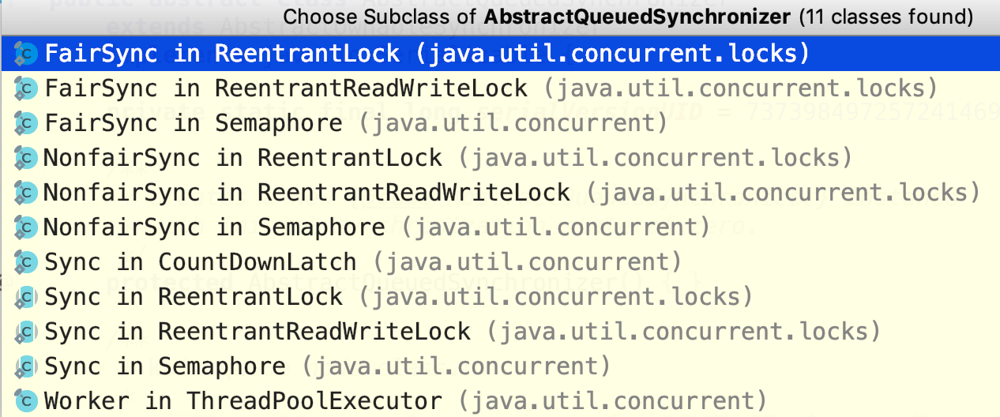

# 75 为什么需要 AQS？AQS 的作用和重要性是什么？

本课时我们主要讲解 AQS 的重要性，为什么需要 AQS，以及它的作用。

#### AQS 的重要性

我们先来介绍一下 AQS（AbstractQueuedSynchronizer）的重要性，来看看 AQS 被用在了哪些类里面。

如图所示，AQS 在 **ReentrantLock、ReentrantReadWriteLock、Semaphore、CountDownLatch、ThreadPoolExcutor 的 Worker** 中都有运用（JDK 1.8），AQS 是这些类的底层原理。

而以上这些类，很多都是我们经常使用的类，大部分我们在前面课时中也已经详细介绍过，所以说 JUC 包里很多重要的工具类背后都离不开 AQS 框架，因此 AQS 的重要性不言而喻。

#### 学习 AQS 的思路

接下来我想介绍一下我对于学习 AQS 的思路的理解。AQS 类的内部结构要比一般的类 **复杂得多** ，里面有很多细节，不容易完全掌握，所以如果我们一上来就直接看源码，容易把自己给绕晕，容易陷入细节不能自拔，导致最后铩羽而归。

其实我们大多数的程序员都是业务开发者，而不是 JDK 开发者，所以平时并不需要自己来开发类似于 ReentrantLock 这样的工具类，所以通常而言，我们 **不会直接使用到 AQS 来进行开发** ，因为 JDK 已经提供了很多封装好的线程协作工具类，像前面讲解的 ReentrantLock、Semaphore 就是 JDK 提供给我们的，其内部就用到了 AQS，而这些工具类已经基本 **足够覆盖大部分的业务场景** 了，这就使得我们即便不了解 AQS，也能利用这些工具类顺利进行开发。

既然我们学习 AQS 的目的不是进行代码开发，那我们为什么还需要学习 AQS 呢？我认为，我们学习 AQS 的目的主要是想理解其背后的 **原理** 、学习 **设计思想** ，以 **提高技术** 并 **应对面试** 。所以本课时的主要目的是从宏观的角度去解读 AQS，比如知道为什么需要 AQS、AQS 有什么作用，在了解了宏观思想之后，再去分析它的内部结构，学习起来就轻松多了。

#### 锁和协作类有共同点：阀门功能

就让我们从熟悉的类作为学习 AQS 的切入点，请你先来思考一下，之前学过的 ReentrantLock 和 Semaphore，二者之间有没有什么共同点？

其实它们都可以当做一个阀门来使用。比如我们把 Semaphore 的许可证数量设置为 1，那么由于它只有一个许可证，所以只能允许一个线程通过，并且当之前的线程归还许可证后，会允许其他线程继续获得许可证。其实这点和 ReentrantLock 很像，只有一个线程能获得锁，并且当这个线程释放锁之后，会允许其他的线程获得锁。那如果线程发现当前没有额外的许可证时，或者当前得不到锁，那么线程就会被阻塞，并且等到后续有许可证或者锁释放出来后，被唤醒，所以这些环节都是比较类似的。

除了上面讲的 ReentrantLock 和 Semaphore 之外，我们会发现 CountDownLatch、ReentrantReadWriteLock 等工具类都有 **类似的让线程“协作”的功能** ，其实它们背后都是利用 AQS 来实现的。

#### 为什么需要 AQS

有了上面的铺垫，现在就让我们来想一下，为什么需要 AQS？

原因是，上面刚讲的那些协作类，它们有很多工作是类似的，所以如果能把实现类似工作的代码给提取出来，变成一个新的底层工具类（或称为框架）的话，就可以直接使用这个工具类来构建上层代码了，而这个工具类其实就是 AQS。

有了 AQS 之后，对于 ReentrantLock 和 Semaphore 等线程协作工具类而言，它们就不需要关心这么多的 **线程调度** 细节，只需要实现它们各自的设计逻辑即可。

#### 如果没有 AQS

那我们再尝试逆向思考一下，如果没有 AQS 会怎么样？

如果没有 AQS，那就需要每个线程协作工具类自己去实现至少以下内容，包括：

- **状态的原子性管理** - **线程的阻塞与解除阻塞** - **队列的管理** 这里的状态对于不同的工具类而言，代表不同的含义，比如对于 ReentrantLock 而言，它需要维护 **锁被重入的次数** ，但是保存重入次数的变量是会被多线程同时操作的，就需要进行处理，以便保证线程安全。不仅如此，对于那些未抢到锁的线程，还应该让它们陷入阻塞，并进行排队，并在合适的时机唤醒。所以说这些内容其实是比较繁琐的，而且也是比较重复的，而这些工作目前都由 AQS 来承担了。

如果没有 AQS，就需要 ReentrantLock 等类来自己实现相关的逻辑，但是让每个线程协作工具类自己去正确并且高效地实现这些内容，是相当有难度的。AQS 可以帮我们把 “脏活累活” 都搞定，所以对于 ReentrantLock 和 Semaphore 等类而言，它们只需要关注自己特有的业务逻辑即可。正所谓是“哪有什么岁月静好，不过是有人替你负重前行”。

#### 比喻：HR 和面试官

如果看到这里，你还不是特别理解 AQS 的作用，那就请看接下来的这个比喻，我们 **把 AQS 和线程协作工具类给“拟人化”，比作是 HR 和面试官** 。

这里模拟候选人参加校招面试的场景。对公司而言，面试一般需要面试官和 HR 参加。通常有两种面试，一种是群面，一种是单面，群面是指多个同学一起参加的面试，例如规定是 10 个人一起面试，那群面规则就是先凑齐 10 个人，再统一面试。

而单面往往是流水线形式的、一对一的面试。假设我们一共有 5 个面试官进行单面，即这 5 个面试官同时分别面试一个候选人，在面试过程中，候选人会进行排队，前面的候选人面试完了以后，后面候选人就跟上，找空闲的面试官开始面试，这就是单面的场景。

乍看起来，群面和单面的面试规则是很不一样的：前者是多人一起面试，而后者是逐个面试。但也其实， **群面和单面也有很多相同的地方** （或者称为流程或环节），而这些相同的地方往往都是由 HR 负责的。比如面试者来了，HR 需要安排候选人 **签到、就坐等待、排队，然后 HR 要按顺序叫号** ，从而避免发生多个候选人冲突的情况，同时 HR 还要确保等待的同学最终都会被叫到，这一系列的内容都由 HR 负责，而这些内容无论是单面还是群面都是一样的。这些 HR 在面试中所做的工作，其实就可以比作是 AQS 所干的活儿。

至于具体的面试规则，比如群面规则是 5 个人还是 10 个人一起？是单面还是群？这些是由面试官来安排的。对于面试官而言，他不会关心候选人是否号码冲突、如何等待、如何叫号，是否有休息的场地等，因为这是 HR 的职责范围。

这里的 **面试官就对应利用了 AQS 实现具体的协作逻辑的工具类，而 HR 则代表 AQS** 。刚才所说的让候选人休息，就是指把线程进行阻塞，不要持续耗费 CPU；而后续叫号让候选人去面试，则意味着去唤醒线程。

群面的流程类似于 CountDownLatch，CountDownLatch 会先设置需要倒数的初始值，假设为 10，每来一个候选人，计数减 1，如果 10 个人都到齐了，就开始面试。同样，单面可以理解为是 Semaphore 信号量，假设有 5 个许可证，每个线程每次获取 1 个许可证，这就类似于有 5 个面试官并行面试，候选人在面试之前需要先获得许可证，面试结束后归还许可证。

对于 CountDownLatch 和 Semaphore 等工具类而言，它要确定自己的“要人”规则，是凑齐 10 个候选人一起面试，像群面一样呢？还是出 1 进 1，像单面一样呢？确定了规则之后，剩下的类似招呼面试者（类比于调度线程）等一系列工作可以交给 AQS 来做，这样一来， **各自的职责就非常独立且分明了** 。

#### AQS 的作用

好，在有了上面的理解之后，现在我们来总结一下 AQS 的作用。 **AQS 是一个用于构建锁、同步器等线程协作工具类的框架** ，有了 AQS 以后，很多用于线程协作的工具类就都可以很方便的被写出来，有了 AQS 之后，可以让更上层的开发极大的减少工作量，避免重复造轮子，同时也避免了上层因处理不当而导致的线程安全问题，因为 AQS 把这些事情都做好了。总之，有了 AQS 之后，我们构建线程协作工具类就容易多了。

#### 总结

在本课时中，我们主要介绍了学习 AQS 的思路，为什么需要 AQS，以及 AQS 的作用，利用 AQS 可以很方便的实现线程协作工具类，而且 AQS 被广泛应用在了 JUC 包中。
