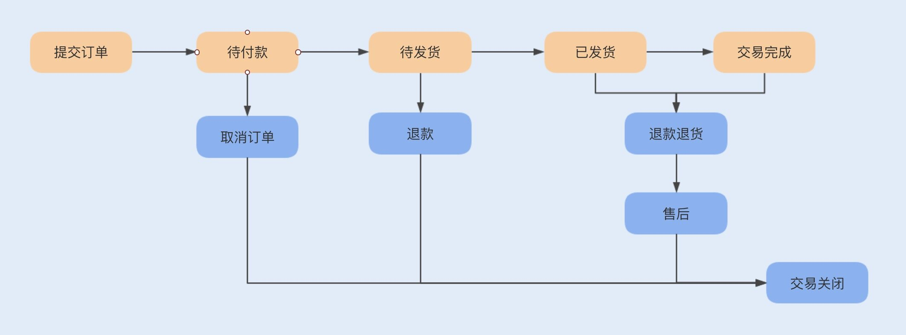

# 37 电商系统表设计优化案例分析

你好，我是刘超。今天我将带你一起了解下电商系统中的表设计优化。

如果在业务架构设计初期，表结构没有设计好，那么后期随着业务以及数据量的增多，系统就很容易出现瓶颈。如果表结构扩展性差，业务耦合度将会越来越高，系统的复杂度也将随之增加。这一讲我将以电商系统中的表结构设计为例，为你详讲解在设计表时，我们都需要考虑哪些因素，又是如何通过表设计来优化系统性能。

## 核心业务

要懂得一个电商系统的表结构设计，我们必须先得熟悉一个电商系统中都有哪些基本核心业务。这部分的内容，只要你有过网购经历，就很好理解。

一般电商系统分为平台型和自营型电商系统。平台型电商系统是指有第三方商家入驻的电商平台，第三方商家自己开设店铺来维护商品信息、库存信息、促销活动、客服售后等，典型的代表有淘宝、天猫等。而自营型电商系统则是指没有第三方商家入驻，而是公司自己运营的电商平台，常见的有京东自营、苹果商城等。

两种类型的电商系统比较明显的区别是卖家是 C 端还是 B 端，很显然，平台型电商系统的复杂度要远远高于自营型电商系统。为了更容易理解商城的业务，我们将基于自营型电商系统来讨论表结构设计优化，这里以苹果商城为例。

一个电商系统的核心业务肯定就是销售商品了，围绕销售商品，我们可以将核心业务分为以下几个主要模块：

### 1. 商品模块

商品模块主要包括商品分类以及商品信息管理，商品分类则是我们常见的大分类了，有人喜欢将分类细化为多个层级，例如，第一个大类是手机、电视、配件等，配件的第二个大类又分为耳机、充电宝等。为了降低用户学习系统操作的成本，我们应该尽量将层级减少。

当我们通过了分类查询之后，就到了商品页面，一个商品 Item 包含了若干商品 SKU。商品 Item 是指一种商品，例如 IPhone9，就是一个 Item，商品 SKU 则是指具体属性的商品，例如金色 128G 内存的 IPhone9。

### 2. 购物车模块

购物车主要是用于用户临时存放欲购买的商品，并可以在购物车中统一下单结算。购物车一般分为离线购物车和在线购物车。离线购物车则是用户选择放入到购物车的商品只保存在本地缓存中，在线购物车则是会同步这些商品信息到服务端。

目前大部分商城都是支持两种状态的购物车，当用户没有登录商城时，主要是离线购物车在记录用户的商品信息，当用户登录商城之后，用户放入到购物车中的商品都会同步到服务端，以后在手机和电脑等不同平台以及不同时间都能查看到自己放入购物车的商品。

### 3. 订单模块

订单是盘活整个商城的核心功能模块，如果没有订单的产出，平台将难以维持下去。订单模块管理着用户在平台的交易记录，是用户和商家交流购买商品状态的渠道，用户可以随时更改一个订单的状态，商家则必须按照业务流程及时订单的更新状态，告知用户已购买商品的具体状态。

通常一个订单分为以下几个状态：待付款、待发货、待收货、待评价、交易完成、用户取消、仅退款、退货退款状态。一个订单的流程见下图：

### 4. 库存模块

这里主要记录的是商品 SKU 的具体库存信息，主要功能包括库存交易、库存管理。库存交易是指用户购买商品时实时消费库存，库存管理主要包括运营人员对商品的生产或采购入库、调拨。

一般库存信息分为商品 SKU、仓区、实时库存、锁定库存、待退货库存、活动库存。

现在大部分电商都实现了华南华北的库存分区，所以可能存在同一个商品 SKU 在华北没有库存，而在华南存在库存的情况，所以我们需要有仓区这个字段，用来区分不同地区仓库的同一个商品 SKU。

实时库存则是指商品的实时库存，锁定库存则表示用户已经提交订单到实际扣除库存或订单失效的这段时间里锁定的库存，待退货库存、活动库存则分别表表示订单退款时的库存数量以及每次活动时的库存数量。

除了这些库存信息，我们还可以为商品设置库存状态，例如虚拟库存状态、实物库存状态。如果一个商品不需要设定库存，可以任由用户购买，我们则不需要在每次用户购买商品时都去查询库存、扣除库存，只需要设定商品的库存状态为虚拟库存即可。

### 5. 促销活动模块

促销活动模块是指消费券、红包以及满减等促销功能，这里主要包括了活动管理和交易管理。前者主要负责管理每次发放的消费券及红包有效期、金额、满足条件、数量等信息，后者则主要负责管理用户领取红包、消费券等信息。

## 业务难点

了解了以上那些主要模块的具体业务之后，我们就可以更深入地去评估从业务落实到系统实现，可能存在的难点以及性能瓶颈了。

### 1. 不同商品类别存在差异，如何设计商品表结构？

我们知道，一个手机商品的详细信息跟一件衣服的详细信息差别很大，手机的 SKU 包括了颜色、运行内存、存储内存等，而一件衣服则包含了尺码、颜色。

如果我们需要将这些商品都存放在一张表中，要么就使用相同字段来存储不同的信息，要么就新增字段来维护各自的信息。前者会导致程序设计复杂化、表宽度大，从而减少磁盘单页存储行数，影响查询性能，且维护成本高；后者则会导致一张表中字段过多，如果有新的商品类型出现，又需要动态添加字段。

比较好的方式是通过一个公共表字段来存储一些具有共性的字段，创建单独的商品类型表，例如手机商品一个表、服饰商品一个表。但这种方式也有缺点，那就是可能会导致表非常多，查询商品信息的时候不够灵活，不好实现全文搜索。

这时候，我们可以基于一个公共表来存储商品的公共信息，同时结合搜索引擎，将商品详细信息存储到键值对数据库，例如 ElasticSearch、Solr 中。

### 2. 双十一购物车商品数量大增，购物车系统出现性能瓶颈怎么办？

在用户没有登录系统的情况下，我们是通过 cookie 来保存购物车的商品信息，而在用户登录系统之后，购物车的信息会保存到数据库中。

在双十一期间，大部分用户都会提前将商品加入到购物车中，在加入商品到购物车的这段操作中，由于时间比较长，操作会比较分散，所以对数据库的写入并不会造成太大的压力。但在购买时，由于多数属于抢购商品，用户对购物车的访问则会比较集中了，如果都去数据库中读取，那么数据库的压力就可想而知了。

此时我们应该考虑冷热数据方案来存储购物车的商品信息，用户一般都会首选最近放入购物车的商品，这些商品信息则是热数据，而较久之前放入购物车中的商品信息则是冷数据，我们需要提前将热数据存放在 Redis 缓存中，以便提高系统在活动期间的并发性能。例如，可以将购物车中近一个月的商品信息都存放到 Redis 中，且至少为一个分页的信息。

当在缓存中没有查找到购物车信息时，再去数据库中查询，这样就可以大大降低数据库的压力。

### 3. 订单表海量数据，如何设计订单表结构？

通常我们的订单表是系统数据累计最快的一张表，无论订单是否真正付款，只要订单提交了就会在订单表中创建订单。如果公司的业务发展非常迅速，那么订单表的分表分库就只是迟早的事儿了。

在没有分表之前，订单的主键 ID 都是自增的，并且关联了一些其它业务表。一旦要进行分表分库，就会存在主键 ID 与业务耦合的情况，而且分表后新自增 ID 与之前的 ID 也可能会发生冲突，后期做表升级的时候我们将会面临巨大的工作量。如果我们确定后期做表升级，建议提前使用 snowflake 来生成主键 ID。

如果订单表要实现水平分表，那我们基于哪个字段来实现分表呢？

通常我们是通过计算用户 ID 字段的 Hash 值来实现订单的分表，这种方式可以优化用户购买端对订单的操作性能。如果我们需要对订单表进行水平分库，那就还是基于用户 ID 字段来实现。

在分表分库之后，对于我们的后台订单管理系统来说，查询订单就是一个挑战了。通常后台都是根据订单状态、创建订单时间进行查询的，且需要支持分页查询以及部分字段的 JOIN 查询，如果需要在分表分库的情况下进行这些操作，无疑是一个巨大的挑战了。

对于 JOIN 查询，我们一般可以通过冗余一些不常修改的配置表来实现。例如，商品的基础信息，我们录入之后很少修改，可以在每个分库中冗余该表，如果字段信息比较少，我们可以直接在订单表中冗余这些字段。

而对于分页查询，通常我们建议冗余订单信息到大数据中。后台管理系统通过大数据来查询订单信息，用户在提交订单并且付款之后，后台将会同步这条订单到大数据。用户在 C 端修改或运营人员在后台修改订单时，会通过异步方式通知大数据更新该订单数据，这种方式可以解决分表分库后带来的分页查询问题。

### 4. 抢购业务，如何解决库存表的性能瓶颈？

在平时购买商品时，我们一般是直接去数据库检查、锁定库存，但如果是在促销活动期间抢购商品，我们还是直接去数据库检查、更新库存的话，面对高并发，系统无疑会产生性能瓶颈。

一般我们会将促销活动的库存更新到缓存中，通过缓存来查询商品的实时库存，并且通过分布式锁来实现库存扣减、锁定库存。分布式锁的具体实现，我会在第 41 讲中详讲。

### 5. 促销活动也存在抢购场景，如何设计表？

促销活动中的优惠券和红包交易，很多时候跟抢购活动有些类似。

在一些大型促销活动之前，我们一般都会定时发放各种商品的优惠券和红包，用户需要点击领取才能使用。所以在一定数量的优惠券和红包放出的同时，也会存在同一时间抢购这些优惠券和红包的情况，特别是一些热销商品。

我们可以参考库存的优化设计方式，使用缓存和分布式锁来查询、更新优惠券和红包的数量，通过缓存获取数量成功以后，再通过异步方式更新数据库中优惠券和红包的数量。

## 总结

这一讲，我们结合电商系统实战练习了如何进行表设计，可以总结为以下几个要点：

- 在字段比较复杂、易变动、不方便统一的情况下，建议使用键值对来代替关系数据库表存储；
- 在高并发情况下的查询操作，可以使用缓存代替数据库操作，提高并发性能；
- 数据量叠加比较快的表，需要考虑水平分表或分库，避免单表操作的性能瓶颈；
- 除此之外，我们应该通过一些优化，尽量避免比较复杂的 JOIN 查询操作，例如冗余一些字段，减少 JOIN 查询；创建一些中间表，减少 JOIN 查询。

## 思考题

你在设计表时，是否使用过外键来关联各个表呢？目前互联网公司一般建议逻辑上实现各个表之间的关联，而不建议使用外键来实现实际的表关联，你知道这为什么吗？
