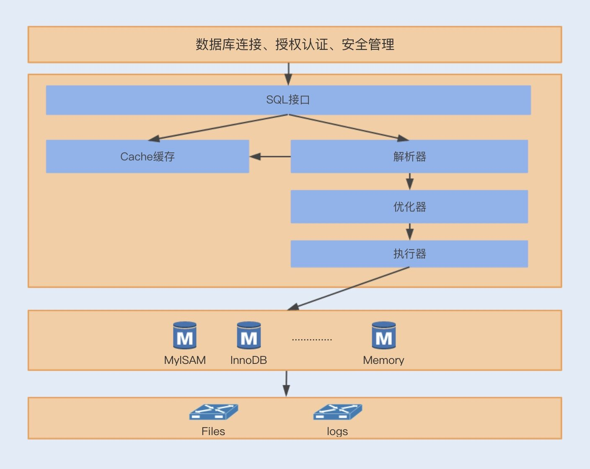
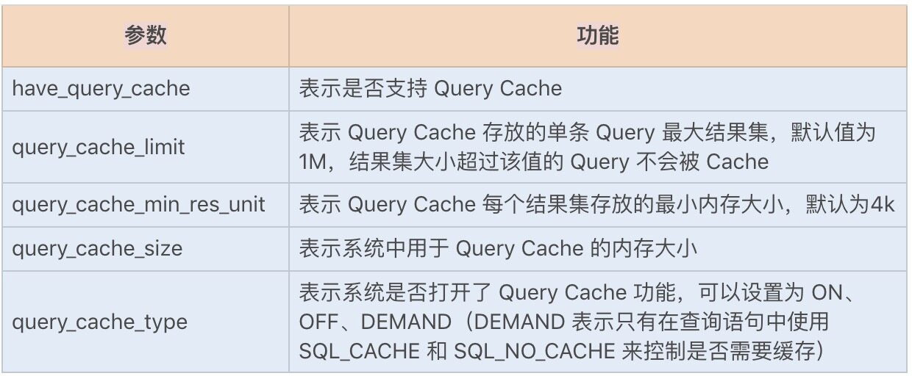
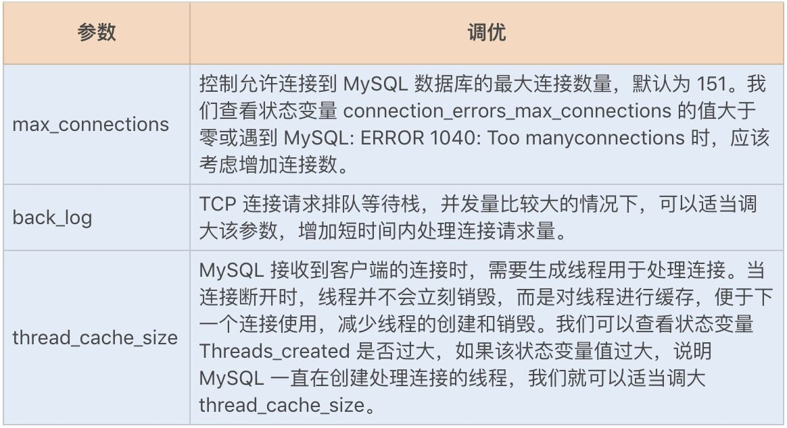

# 38 数据库参数设置优化，失之毫厘差之千里

你好，我是刘超。

MySQL 是一个灵活性比较强的数据库系统，提供了很多可配置参数，便于我们根据应用和服务器硬件来做定制化数据库服务。如果现在让你回想，你可能觉得在开发的过程中很少去调整 MySQL 的配置参数，但我今天想说的是我们很有必要去深入了解它们。

我们知道，数据库主要是用来存取数据的，而存取数据涉及到了磁盘 I/O 的读写操作，所以数据库系统主要的性能瓶颈就是 I/O 读写的瓶颈了。MySQL 数据库为了减少磁盘 I/O 的读写操作，应用了大量内存管理来优化数据库操作，包括内存优化查询、排序以及写入操作。

也许你会想，我们把内存设置得越大越好，数据刷新到磁盘越快越好，不就对了吗？其实不然，内存设置过大，同样会带来新的问题。例如，InnoDB 中的数据和索引缓存，如果设置过大，就会引发 SWAP 页交换。还有数据写入到磁盘也不是越快越好，我们期望的是在高并发时，数据能均匀地写入到磁盘中，从而避免 I/O 性能瓶颈。

> SWAP 页交换：SWAP 分区在系统的物理内存不够用的时候，就会把物理内存中的一部分空间释放出来，以供当前运行的程序使用。被释放的空间可能来自一些很长时间没有什么操作的程序，这些被释放的空间的数据被临时保存到 SWAP 分区中，等到那些程序要运行时，再从 SWAP 分区中恢复保存的数据到内存中。

所以，这些参数的设置跟我们的应用服务特性以及服务器硬件有很大的关系。MySQL 是一个高定制化的数据库，我们可以根据需求来调整参数，定制性能最优的数据库。

不过想要了解这些参数的具体作用，我们先得了解数据库的结构以及不同存储引擎的工作原理。

## MySQL 体系结构

我们一般可以将 MySQL 的结构分为四层，最上层为客户端连接器，主要包括了数据库连接、授权认证、安全管理等，该层引用了线程池，为接入的连接请求提高线程处理效率。

第二层是 Server 层，主要实现 SQL 的一些基础功能，包括 SQL 解析、优化、执行以及缓存等，其中与我们这一讲主要相关的就是缓存。

第三层包括了各种存储引擎，主要负责数据的存取，这一层涉及到的 Buffer 缓存，也和这一讲密切相关。

最下面一层是数据存储层，主要负责将数据存储在文件系统中，并完成与存储引擎的交互。



接下来我们再来了解下，当数据接收到一个 SQL 语句时，是如何处理的。

### 1. 查询语句

一个应用服务需要通过第一层的连接和授权认证，再将 SQL 请求发送至 SQL 接口。SQL 接口接收到请求之后，会先检查查询 SQL 是否命中 Cache 缓存中的数据，如果命中，则直接返回缓存中的结果；否则，需要进入解析器。

解析器主要对 SQL 进行语法以及词法分析，之后，便会进入到优化器中，优化器会生成多种执行计划方案，并选择最优方案执行。

确定了最优执行计划方案之后，执行器会检查连接用户是否有该表的执行权限，有则查看 Buffer 中是否存在该缓存，存在则获取锁，查询表数据；否则重新打开表文件，通过接口调用相应的存储引擎处理，这时存储引擎就会进入到存储文件系统中获取相应的数据，并返回结果集。

### 2. 更新语句

数据库更新 SQL 的执行流程其实跟查询 SQL 差不多，只不过执行更新操作的时候多了记录日志的步骤。在执行更新操作时 MySQL 会将操作的日志记录到 binlog（归档日志）中，这个步骤所有的存储引擎都有。而 InnoDB 除了要记录 binlog 之外，还需要多记录一个 redo log（重做日志）。

redo log 主要是为了解决 crash-safe 问题而引入的。我们知道，当数据库在存储数据时发生异常重启，我们需要保证存储的数据要么存储成功，要么存储失败，也就是不会出现数据丢失的情况，这就是 crash-safe 了。

我们在执行更新操作时，首先会查询相关的数据，之后通过执行器执行更新操作，并将执行结果写入到内存中，同时记录更新操作到 redo log 的缓存中，此时 redo log 中的记录状态为 prepare，并通知执行器更新完成，随时可以提交事务。执行器收到通知后会执行 binlog 的写入操作，此时的 binlog 是记录在缓存中的，写入成功后会调用引擎的提交事务接口，更新记录状态为 commit。之后，内存中的 redo log 以及 binlog 都会刷新到磁盘文件中。

## 内存调优

基于以上两个 SQL 执行过程，我们可以发现，在执行查询 SQL 语句时，会涉及到两个缓存。第一个缓存是刚进来时的 Query Cache，它缓存的是 SQL 语句和对应的结果集。这里的缓存是以查询 SQL 的 Hash 值为 key，返回结果集为 value 的键值对，判断一条 SQL 是否命中缓存，是通过匹配查询 SQL 的 Hash 值来实现的。

很明显，Query Cache 可以优化查询 SQL 语句，减少大量工作，特别是减少了 I/O 读取操作。我们可以通过以下几个主要的设置参数来优化查询操作：



我们可以通过设置合适的 query_cache_min_res_unit 来减少碎片，这个参数最合适的大小和应用程序查询结果的平均大小直接相关，可以通过以下公式计算所得：

（query_cache_size - Qcache_free_memory）/ Qcache_queries_in_cache

Qcache_free_memory 和 Qcache_queries_in_cache 的值可以通过以下命令查询：

```plaintext
show status like 'Qcache%'
```

Query Cache 虽然可以优化查询操作，但也仅限于不常修改的数据，如果一张表数据经常进行新增、更新和删除操作，则会造成 Query Cache 的失效率非常高，从而导致频繁地清除 Cache 中的数据，给系统增加额外的性能开销。

这也会导致缓存命中率非常低，我们可以通过以上查询状态的命令查看 Qcache_hits，该值表示缓存命中率。如果缓存命中率特别低的话，我们还可以通过 query_cache_size = 0 或者 query_cache_type 来关闭查询缓存。

经过了 Query Cache 缓存之后，还会使用到存储引擎中的 Buffer 缓存。不同的存储引擎，使用的 Buffer 也是不一样的。这里我们主要讲解两种常用的存储引擎。

### 1. MyISAM 存储引擎参数设置调优

MyISAM 存储引擎使用 key buffer 缓存索引块，MyISAM 表的数据块则没有缓存，它是直接存储在磁盘文件中的。

我们可以通过 key_buffer_size 设置 key buffer 缓存的大小，而它的大小并不是越大越好。正如我前面所讲的，key buffer 缓存设置过大，实际应用却不大的话，就容易造成内存浪费，而且系统也容易发生 SWAP 页交换，一般我是建议将服务器内存中可用内存的 1/4 分配给 key buffer。

如果要更准确地评估 key buffer 的设置是否合理，我们还可以通过缓存使用率公式来计算：

1-((key_blocks_unused\*key_cache_block_size)/key_buffer_size)

> key_blocks_unused 表示未使用的缓存簇（blocks）数 key_cache_block_size 表示 key_buffer_size 被分割的区域大小 key_blocks_unused\*key_cache_block_size 则表示剩余的可用缓存空间（一般来说，缓存使用率在 80% 作用比较合适）。

### 2. InnoDB 存储引擎参数设置调优

InnoDB Buffer Pool（简称 IBP）是 InnoDB 存储引擎的一个缓冲池，与 MyISAM 存储引擎使用 key buffer 缓存不同，它不仅存储了表索引块，还存储了表数据。查询数据时，IBP 允许快速返回频繁访问的数据，而无需访问磁盘文件。InnoDB 表空间缓存越多，MySQL 访问物理磁盘的频率就越低，这表示查询响应时间更快，系统的整体性能也有所提高。

我们一般可以通过多个设置参数来调整 IBP，优化 InnoDB 表性能。

- **innodb_buffer_pool_size**

IBP 默认的内存大小是 128M，我们可以通过参数 innodb_buffer_pool_size 来设置 IBP 的大小，IBP 设置得越大，InnoDB 表性能就越好。但是，将 IBP 大小设置得过大也不好，可能会导致系统发生 SWAP 页交换。所以我们需要在 IBP 大小和其它系统服务所需内存大小之间取得平衡。MySQL 推荐配置 IBP 的大小为服务器物理内存的 80%。

我们也可以通过计算 InnoDB 缓冲池的命中率来调整 IBP 大小：

(1-innodb_buffer_pool_reads/innodb_buffer_pool_read_request)\*100

但如果我们将 IBP 的大小设置为物理内存的 80% 以后，发现命中率还是很低，此时我们就应该考虑扩充内存来增加 IBP 的大小。

- **innodb_buffer_pool_instances**

InnoDB 中的 IBP 缓冲池被划分为了多个实例，对于具有数千兆字节的缓冲池的系统来说，将缓冲池划分为单独的实例可以减少不同线程读取和写入缓存页面时的争用，从而提高系统的并发性。该参数项仅在将 innodb_buffer_pool_size 设置为 1GB 或更大时才会生效。

在 windows 32 位操作系统中，如果 innodb_buffer_pool_size 的大小超过 1.3GB，innodb_buffer_pool_instances 默认大小就为 innodb_buffer_pool_size/128MB；否则，默认为 1。

而在其它操作系统中，如果 innodb_buffer_pool_size 大小超过 1GB，innodb_buffer_pool_instances 值就默认为 8；否则，默认为 1。

为了获取最佳效率，建议指定 innodb_buffer_pool_instances 的大小，并保证每个缓冲池实例至少有 1GB 内存。通常，建议 innodb_buffer_pool_instances 的大小不超过 innodb_read_io_threads + innodb_write_io_threads 之和，建议实例和线程数量比例为 1:1。

- **innodb_read_io_threads** / **innodb_write_io_threads**

在默认情况下，MySQL 后台线程包括了主线程、IO 线程、锁线程以及监控线程等，其中读写线程属于 IO 线程，主要负责数据库的读取和写入操作，这些线程分别读取和写入 innodb_buffer_pool_instances 创建的各个内存页面。MySQL 支持配置多个读写线程，即通过 innodb_read_io_threads 和 innodb_write_io_threads 设置读写线程数量。

读写线程数量值默认为 4，也就是总共有 8 个线程同时在后台运行。innodb_read_io_threads 和 innodb_write_io_threads 设置的读写线程数量，与 innodb_buffer_pool_instances 的大小有关，两者的协同优化是提高系统性能的一个关键因素。

在一些内存以及 CPU 内核超大型的数据库服务器上，我们可以在保证足够大的 IBP 内存的前提下，通过以下公式，协同增加缓存实例数量以及读写线程。

( innodb_read_io_threads + innodb_write_io_threads ) = innodb_buffe_pool_instances

如果我们仅仅是将读写线程根据缓存实例数量对半来分，即读线程和写线程各为实例大小的一半，肯定是不合理的。例如我们的应用服务读取数据库的数据多于写入数据库的数据，那么增加写入线程反而没有优化效果。我们一般可以通过 MySQL 服务器保存的全局统计信息，来确定系统的读取和写入比率。

我们可以通过以下查询来确定读写比率：

```plaintext
SHOW GLOBAL STATUS LIKE 'Com_select';// 读取数量
SHOW GLOBAL STATUS WHERE Variable_name IN ('Com_insert', 'Com_update', 'Com_replace', 'Com_delete');// 写入数量
```

如果读大于写，我们应该考虑将读线程的数量设置得大一些，写线程数量小一些；否则，反之。

- **innodb_log_file_size**

除了以上 InnoDB 缓存等因素之外，InnoDB 的日志缓存大小、日志文件大小以及日志文件持久化到磁盘的策略都影响着 InnnoDB 的性能。 InnoDB 中有一个 redo log 文件，InnoDB 用它来存储服务器处理的每个写请求的重做活动。执行的每个写入查询都会在日志文件中获得重做条目，以便在发生崩溃时可以恢复更改。

当日志文件大小已经超过我们参数设置的日志文件大小时，InnoDB 会自动切换到另外一个日志文件，由于重做日志是一个循环使用的环，在切换时，就需要将新的日志文件脏页的缓存数据刷新到磁盘中（触发检查点）。

理论上来说，innodb_log_file_size 设置得越大，缓冲池中需要的检查点刷新活动就越少，从而节省磁盘 I/O。那是不是将这个日志文件设置得越大越好呢？如果日志文件设置得太大，恢复时间就会变长，这样不便于 DBA 管理。在大多数情况下，我们将日志文件大小设置为 1GB 就足够了。

- **innodb_log_buffer_size**

这个参数决定了 InnoDB 重做日志缓冲池的大小，默认值为 8MB。如果高并发中存在大量的事务，该值设置得太小，就会增加写入磁盘的 I/O 操作。我们可以通过增大该参数来减少写入磁盘操作，从而提高并发时的事务性能。

- **innodb_flush_log_at_trx_commit**

这个参数可以控制重做日志从缓存写入文件刷新到磁盘中的策略，默认值为 1。

当设置该参数为 0 时，InnoDB 每秒种就会触发一次缓存日志写入到文件中并刷新到磁盘的操作，这有可能在数据库崩溃后，丢失 1s 的数据。

当设置该参数为 1 时，则表示每次事务的 redo log 都会直接持久化到磁盘中，这样可以保证 MySQL 异常重启之后数据不会丢失。

当设置该参数为 2 时，每次事务的 redo log 都会直接写入到文件中，再将文件刷新到磁盘。

在一些对数据安全性要求比较高的场景中，显然该值需要设置为 1；而在一些可以容忍数据库崩溃时丢失 1s 数据的场景中，我们可以将该值设置为 0 或 2，这样可以明显地减少日志同步到磁盘的 I/O 操作。

## 总结

MySQL 数据库的参数设置非常多，今天我们仅仅是了解了与内存优化相关的参数设置。除了这些参数设置，我们还有一些常用的提高 MySQL 并发的相关参数设置，总结如下：



## 思考题

我们知道，InnoDB 的 IBP 的内存大小是有限的，你知道 InnoDB 是如何将热点数据留在内存中，淘汰非热点数据的吗？
