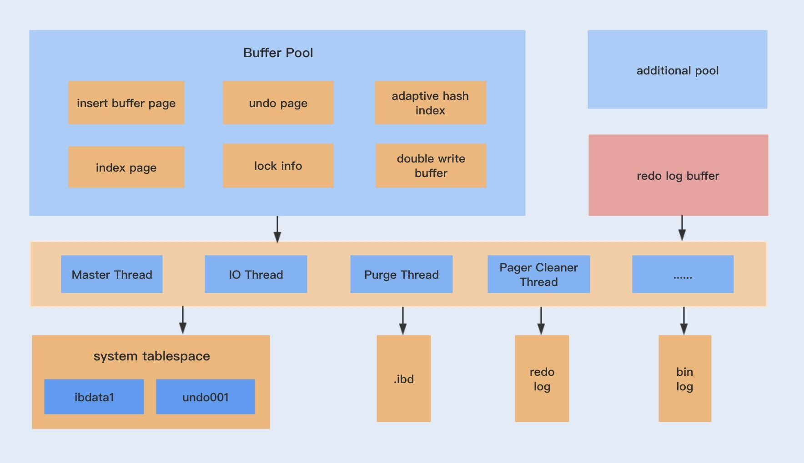
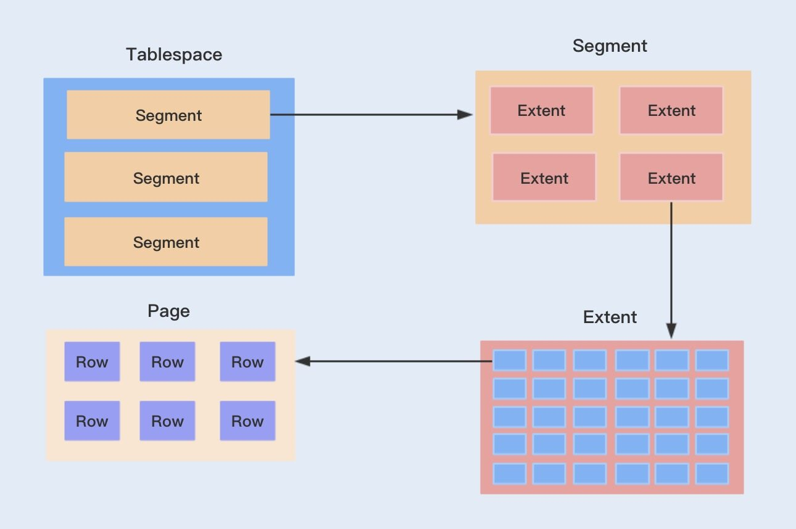
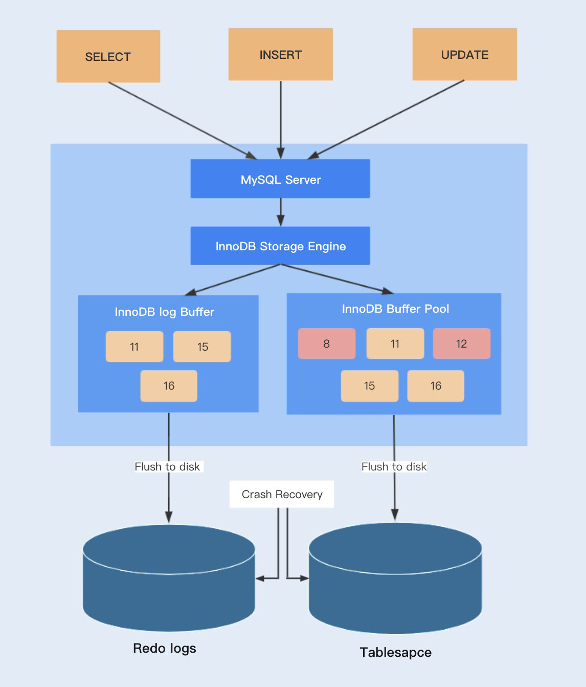

# 39 答疑课堂：MySQL中InnoDB的知识点串讲

你好，我是刘超。

模块六有关数据库调优的内容到本周也正式结束了，今天我们一起串下 MySQL 中 InnoDB 的知识点。InnoDB 存储引擎作为我们最常用到的存储引擎之一，充分熟悉它的的实现和运行原理，有助于我们更好地创建和维护数据库表。

## InnoDB 体系架构

InnoDB 主要包括了内存池、后台线程以及存储文件。内存池又是由多个内存块组成的，主要包括缓存磁盘数据、redo log 缓冲等；后台线程则包括了 Master Thread、IO Thread 以及 Purge Thread 等；由 InnoDB 存储引擎实现的表的存储结构文件一般包括表结构文件（.frm）、共享表空间文件（ibdata1）、独占表空间文件（ibd）以及日志文件（redo 文件等）等。

### 1. 内存池

我们知道，如果客户端从数据库中读取数据是直接从磁盘读取的话，无疑会带来一定的性能瓶颈，缓冲池的作用就是提高整个数据库的读写性能。

客户端读取数据时，如果数据存在于缓冲池中，客户端就会直接读取缓冲池中的数据，否则再去磁盘中读取；对于数据库中的修改数据，首先是修改在缓冲池中的数据，然后再通过 Master Thread 线程刷新到磁盘上。

理论上来说，缓冲池的内存越大越好。我们在\[第 38 讲\]中详细讲过了缓冲池的大小配置方式以及调优。

缓冲池中不仅缓存索引页和数据页，还包括了 undo 页，插入缓存、自适应哈希索引以及 InnoDB 的锁信息等等。

InnoDB 允许多个缓冲池实例，从而减少数据库内部资源的竞争，增强数据库的并发处理能力，\[第 38 讲\]还讲到了缓冲池实例的配置以及调优。

InnoDB 存储引擎会先将重做日志信息放入到缓冲区中，然后再刷新到重做日志文件中。

### 2. 后台线程

Master Thread 主要负责将缓冲池中的数据异步刷新到磁盘中，除此之外还包括插入缓存、undo 页的回收等，IO Thread 是负责读写 IO 的线程，而 Purge Thread 主要用于回收事务已经提交了的 undo log，Pager Cleaner Thread 是新引入的一个用于协助 Master Thread 刷新脏页到磁盘的线程，它可以减轻 Master Thread 的工作压力，减少阻塞。

### 3. 存储文件

在 MySQL 中建立一张表都会生成一个.frm 文件，该文件是用来保存每个表的元数据信息的，主要包含表结构定义。

在 InnoDB 中，存储数据都是按表空间进行存放的，默认为共享表空间，存储的文件即为共享表空间文件（ibdata1）。若设置了参数 innodb_file_per_table 为 1，则会将存储的数据、索引等信息单独存储在一个独占表空间，因此也会产生一个独占表空间文件（ibd）。如果你对共享表空间和独占表空间的理解还不够透彻，接下来我会详解。

而日志文件则主要是重做日志文件，主要记录事务产生的重做日志，保证事务的一致性。

## InnoDB 逻辑存储结构

InnoDB 逻辑存储结构分为表空间（Tablespace）、段 (Segment)、区 (Extent)、页 Page) 以及行 (row)。

### 1. 表空间（Tablespace）

InnoDB 提供了两种表空间存储数据的方式，一种是共享表空间，一种是独占表空间。 InnoDB 默认会将其所有的表数据存储在一个共享表空间中，即 ibdata1。

我们可以通过设置 innodb_file_per_table 参数为 1（1 代表独占方式）开启独占表空间模式。开启之后，每个表都有自己独立的表空间物理文件，所有的数据以及索引都会存储在该文件中，这样方便备份以及恢复数据。

### 2. 段 (Segment)

表空间是由各个段组成的，段一般分为数据段、索引段和回滚段等。我们知道，InnoDB 默认是基于 B + 树实现的数据存储。

这里的索引段则是指的 B + 树的非叶子节点，而数据段则是 B + 树的叶子节点。而回滚段则指的是回滚数据，之前我们在讲事务隔离的时候就介绍到了 MVCC 利用了回滚段实现了多版本查询数据。

### 3. 区 (Extent) / 页（Page）

区是表空间的单元结构，每个区的大小为 1MB。而页是组成区的最小单元，页也是 InnoDB 存储引擎磁盘管理的最小单元，每个页的大小默认为 16KB。为了保证页的连续性，InnoDB 存储引擎每次从磁盘申请 4-5 个区。

### 4. 行（Row）

InnoDB 存储引擎是面向列的（row-oriented)，也就是说数据是按行进行存放的，每个页存放的行记录也是有硬性定义的，最多允许存放 16KB/2-200 行，即 7992 行记录。

## InnoDB 事务之 redo log 工作原理

InnoDB 是一个事务性的存储引擎，而 InnoDB 的事务实现是基于事务日志 redo log 和 undo log 实现的。redo log 是重做日志，提供再写入操作，实现事务的持久性；undo log 是回滚日志，提供回滚操作，保证事务的一致性。

redo log 又包括了内存中的日志缓冲（redo log buffer）以及保存在磁盘的重做日志文件（redo log file），前者存储在内存中，容易丢失，后者持久化在磁盘中，不会丢失。

InnoDB 的更新操作采用的是 Write Ahead Log 策略，即先写日志，再写入磁盘。当一条记录更新时，InnoDB 会先把记录写入到 redo log buffer 中，并更新内存数据。我们可以通过参数 innodb_flush_log_at_trx_commit 自定义 commit 时，如何将 redo log buffer 中的日志刷新到 redo log file 中。

在这里，我们需要注意的是 InnoDB 的 redo log 的大小是固定的，分别有多个日志文件采用循环方式组成一个循环闭环，当写到结尾时，会回到开头循环写日志。我们可以通过参数 innodb_log_files_in_group 和 innodb_log_file_size 配置日志文件数量和每个日志文件的大小。

Buffer Pool 中更新的数据未刷新到磁盘中，该内存页我们称之为脏页。最终脏页的数据会刷新到磁盘中，将磁盘中的数据覆盖，这个过程与 redo log 不一定有关系。

只有当 redo log 日志满了的情况下，才会主动触发脏页刷新到磁盘，而脏页不仅只有 redo log 日志满了的情况才会刷新到磁盘，以下几种情况同样会触发脏页的刷新：

- 系统内存不足时，需要将一部分数据页淘汰掉，如果淘汰的是脏页，需要先将脏页同步到磁盘；
- MySQL 认为空闲的时间，这种情况没有性能问题；
- MySQL 正常关闭之前，会把所有的脏页刷入到磁盘，这种情况也没有性能问题。

在生产环境中，如果我们开启了慢 SQL 监控，你会发现偶尔会出现一些用时稍长的 SQL。这是因为脏页在刷新到磁盘时可能会给数据库带来性能开销，导致数据库操作抖动。

## LRU 淘汰策略

以上我们了解了 InnoDB 的更新和插入操作的具体实现原理，接下来我们再来了解下读的实现和优化方式。

InnoDB 存储引擎是基于集合索引实现的数据存储，也就是除了索引列以及主键是存储在 B + 树之外，其它列数据也存储在 B + 树的叶子节点中。而这里的索引页和数据页都会缓存在缓冲池中，在查询数据时，只要在缓冲池中存在该数据，InnoDB 就不用每次都去磁盘中读取页，从而提高数据库的查询性能。

虽然缓冲池是一个很大的内存区域，但由于存放了各种类型的数据，加上存储数据量之大，缓冲池无法将所有的数据都存储在其中。因此，缓冲池需要通过 LRU 算法将最近且经常查询的数据缓存在其中，而不常查询的数据就淘汰出去。

InnoDB 对 LRU 做了一些优化，我们熟悉的 LRU 算法通常是将最近查询的数据放到 LRU 列表的首部，而 InnoDB 则是将数据放在一个 midpoint 位置，通常这个 midpoint 为列表长度的 5/8。

这种策略主要是为了避免一些不常查询的操作突然将热点数据淘汰出去，而热点数据被再次查询时，需要再次从磁盘中获取，从而影响数据库的查询性能。

如果我们的热点数据比较多，我们可以通过调整 midpoint 值来增加热点数据的存储量，从而降低热点数据的淘汰率。

## 总结

以上 InnoDB 的实现和运行原理到这里就介绍完了。回顾模块六，前三讲我主要介绍了数据库操作的性能优化，包括 SQL 语句、事务以及索引的优化，接下来我又讲到了数据库表优化，包括表设计、分表分库的实现等等，最后我还介绍了一些数据库参数的调优。

总的来讲，作为开发工程师，我们应该掌握数据库几个大的知识点，然后再深入到数据库内部实现的细节，这样才能避免经常写出一些具有性能问题的 SQL，培养调优数据库性能的能力。
