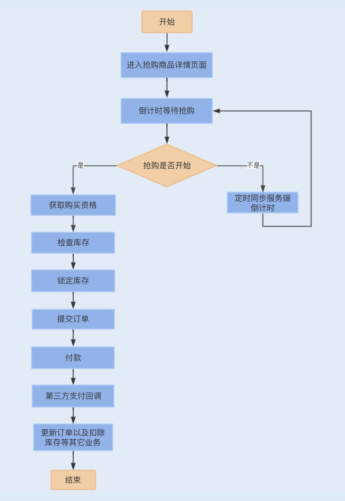

# 44 记一次双十一抢购性能瓶颈调优

你好，我是刘超。今天我们来聊聊双十一的那些事儿，基于场景比较复杂，这一讲的出发点主要是盘点各个业务中高频出现的性能瓶颈，给出相应的优化方案，但优化方案并没有一一展开，深度讲解其具体实现。你可以结合自己在这个专栏的所学和日常积累，有针对性地在留言区提问，我会一一解答。下面切入正题。

每年的双十一都是很多研发部门最头痛的节日，由于这个节日比较特殊，公司一般都会准备大量的抢购活动，相应的瞬时高并发请求对系统来说是个不小的考验。

还记得我们公司商城第一次做双十一抢购活动，优惠力度特别大，购买量也很大，提交订单的接口 TPS 一度达到了 10W。在首波抢购时，后台服务监控就已经显示服务器的各项指标都超过了 70%，CPU 更是一直处于 400%（4 核 CPU），数据库磁盘 I/O 一直处于 100% 状态。由于瞬时写入日志量非常大，导致我们的后台服务监控在短时间内，无法实时获取到最新的请求监控数据，此时后台开始出现一系列的异常报警。

更严重的系统问题是出现在第二波的抢购活动中，由于第一波抢购时我们发现后台服务的压力比较大，于是就横向扩容了服务，但却没能缓解服务的压力，反而在第二波抢购中，我们的系统很快就出现了宕机。

这次活动暴露出来的问题很多。首先，由于没有限流，超过预期的请求量导致了系统卡顿；其次，基于 Redis 实现的分布式锁分发抢购名额的功能抛出了大量异常；再次，就是我们误判了横向扩容服务可以起到的作用，其实第一波抢购的性能瓶颈是在数据库，横向扩容服务反而又增加了数据库的压力，起到了反作用；最后，就是在服务挂掉的情况下，丢失了异步处理的业务请求。

接下来我会以上面的这个案例为背景，重点讲解抢购业务中的性能瓶颈该如何调优。

## 抢购业务流程

在进行具体的性能问题讨论之前，我们不妨先来了解下一个常规的抢购业务流程，这样方便我们更好地理解一个抢购系统的性能瓶颈以及调优过程。

- 用户登录后会进入到商品详情页面，此时商品购买处于倒计时状态，购买按钮处于置灰状态。
- 当购买倒计时间结束后，用户点击购买商品，此时用户需要排队等待获取购买资格，如果没有获取到购买资格，抢购活动结束，反之，则进入提交页面。
- 用户完善订单信息，点击提交订单，此时校验库存，并创建订单，进入锁定库存状态，之后，用户支付订单款。
- 当用户支付成功后，第三方支付平台将产生支付回调，系统通过回调更新订单状态，并扣除数据库的实际库存，通知用户购买成功。



## 抢购系统中的性能瓶颈

熟悉了一个常规的抢购业务流程之后，我们再来看看抢购中都有哪些业务会出现性能瓶颈。

### 1. 商品详情页面

如果你有过抢购商品的经验，相信你遇到过这样一种情况，在抢购马上到来的时候，商品详情页面几乎是无法打开的。

这是因为大部分用户在抢购开始之前，会一直疯狂刷新抢购商品页面，尤其是倒计时一分钟内，查看商品详情页面的请求量会猛增。此时如果商品详情页面没有做好，就很容易成为整个抢购系统中的第一个性能瓶颈。

类似这种问题，我们通常的做法是提前将整个抢购商品页面生成为一个静态页面，并 push 到 CDN 节点，并且在浏览器端缓存该页面的静态资源文件，通过 CDN 和浏览器本地缓存这两种缓存静态页面的方式来实现商品详情页面的优化。

### 2. 抢购倒计时

在商品详情页面中，存在一个抢购倒计时，这个倒计时是服务端时间的，初始化时间需要从服务端获取，并且在用户点击购买时，还需要服务端判断抢购时间是否已经到了。

如果商品详情每次刷新都去后端请求最新的时间，这无疑将会把整个后端服务拖垮。我们可以改成初始化时间从客户端获取，每隔一段时间主动去服务端刷新同步一次倒计时，这个时间段是随机时间，避免集中请求服务端。这种方式可以避免用户主动刷新服务端的同步时间接口。

### 3. 获取购买资格

可能你会好奇，在抢购中我们已经通过库存数量限制用户了，那为什么会出现一个获取购买资格的环节呢？

我们知道，进入订单详情页面后，需要填写相关的订单信息，例如收货地址、联系方式等，在这样一个过程中，很多用户可能还会犹豫，甚至放弃购买。如果把这个环节设定为一定能购买成功，那我们就只能让同等库存的用户进来，一旦用户放弃购买，这些商品可能无法再次被其他用户抢购，会大大降低商品的抢购销量。

增加购买资格的环节，选择让超过库存的用户量进来提交订单页面，这样就可以保证有足够提交订单的用户量，确保抢购活动中商品的销量最大化。

获取购买资格这步的并发量会非常大，还是基于分布式的，通常我们可以通过 Redis 分布式锁来控制购买资格的发放。

### 4. 提交订单

由于抢购入口的请求量会非常大，可能会占用大量带宽，为了不影响提交订单的请求，我建议将提交订单的子域名与抢购子域名区分开，分别绑定不同网络的服务器。

用户点击提交订单，需要先校验库存，库存足够时，用户先扣除缓存中的库存，再生成订单。如果校验库存和扣除库存都是基于数据库实现的，那么每次都去操作数据库，瞬时的并发量就会非常大，对数据库来说会存在一定的压力，从而会产生性能瓶颈。与获取购买资格一样，我们同样可以通过分布式锁来优化扣除消耗库存的设计。

由于我们已经缓存了库存，所以在提交订单时，库存的查询和冻结并不会给数据库带来性能瓶颈。但在这之后，还有一个订单的幂等校验，为了提高系统性能，我们同样可以使用分布式锁来优化。

而保存订单信息一般都是基于数据库表来实现的，在单表单库的情况下，碰到大量请求，特别是在瞬时高并发的情况下，磁盘 I/O、数据库请求连接数以及带宽等资源都可能会出现性能瓶颈。此时我们可以考虑对订单表进行分库分表，通常我们可以基于 userid 字段来进行 hash 取模，实现分库分表，从而提高系统的并发能力。

### 5. 支付回调业务操作

在用户支付订单完成之后，一般会有第三方支付平台回调我们的接口，更新订单状态。

除此之外，还可能存在扣减数据库库存的需求。如果我们的库存是基于缓存来实现查询和扣减，那提交订单时的扣除库存就只是扣除缓存中的库存，为了减少数据库的并发量，我们会在用户付款之后，在支付回调的时候去选择扣除数据库中的库存。

此外，还有订单购买成功的短信通知服务，一些商城还提供了累计积分的服务。

在支付回调之后，我们可以通过异步提交的方式，实现订单更新之外的其它业务处理，例如库存扣减、积分累计以及短信通知等。通常我们可以基于 MQ 实现业务的异步提交。

## 性能瓶颈调优

了解了各个业务流程中可能存在的性能瓶颈，我们再来讨论下商城基于常规优化设计之后，还可能出现的一些性能问题，我们又该如何做进一步调优。

### 1. 限流实现优化

限流是我们常用的兜底策略，无论是倒计时请求接口，还是抢购入口，系统都应该对它们设置最大并发访问数量，防止超出预期的请求集中进入系统，导致系统异常。

通常我们是在网关层实现高并发请求接口的限流，如果我们使用了 Nginx 做反向代理的话，就可以在 Nginx 配置限流算法。Nginx 是基于漏桶算法实现的限流，这样做的好处是能够保证请求的实时处理速度。

Nginx 中包含了两个限流模块：[ngx_http_limit_conn_module](https://nginx.org/en/docs/http/ngx_http_limit_conn_module.html) 和 [ngx_http_limit_req_module](https://nginx.org/en/docs/http/ngx_http_limit_req_module.html)，前者是用于限制单个 IP 单位时间内的请求数量，后者是用来限制单位时间内所有 IP 的请求数量。以下分别是两个限流的配置：

```plaintext
limit_conn_zone $binary_remote_addr zone=addr:10m;
server {
    location / {
        limit_conn addr 1;
    }
http {
    limit_req_zone $binary_remote_addr zone=one:10m rate=1r/s;
    server {
        location / {
            limit_req zone=one burst=5 nodelay;
        }
} 
```

在网关层，我们还可以通过 lua 编写 OpenResty 来实现一套限流功能，也可以通过现成的 Kong 安装插件来实现。除了网关层的限流之外，我们还可以基于服务层实现接口的限流，通过 Zuul RateLimit 或 Guava RateLimiter 实现。

### 2. 流量削峰

瞬间有大量请求进入到系统后台服务之后，首先是要通过 Redis 分布式锁获取购买资格，这个时候我们看到了大量的“JedisConnectionException Could not get connection from pool”异常。

这个异常是一个 Redis 连接异常，由于我们当时的 Redis 集群是基于哨兵模式部署的，哨兵模式部署的 Redis 也是一种主从模式，我们在写 Redis 的时候都是基于主库来实现的，在高并发操作一个 Redis 实例就很容易出现性能瓶颈。

你可能会想到使用集群分片的方式来实现，但对于分布式锁来说，集群分片的实现只会增加性能消耗，这是因为我们需要基于 Redission 的红锁算法实现，需要对集群的每个实例进行加锁。

后来我们使用 Redission 插件替换 Jedis 插件，由于 Jedis 的读写 I/O 操作还是阻塞式的，方法调用都是基于同步实现，而 Redission 底层是基于 Netty 框架实现的，读写 I/O 是非阻塞 I/O 操作，且方法调用是基于异步实现。

但在瞬时并发非常大的情况下，依然会出现类似问题，此时，我们可以考虑在分布式锁前面新增一个等待队列，减缓抢购出现的集中式请求，相当于一个流量削峰。当请求的 key 值放入到队列中，请求线程进入阻塞状态，当线程从队列中获取到请求线程的 key 值时，就会唤醒请求线程获取购买资格。

### 3. 数据丢失问题

无论是服务宕机，还是异步发送给 MQ，都存在请求数据丢失的可能。例如，当第三方支付回调系统时，写入订单成功了，此时通过异步来扣减库存和累计积分，如果应用服务刚好挂掉了，MQ 还没有存储到该消息，那即使我们重启服务，这条请求数据也将无法还原。

重试机制是还原丢失消息的一种解决方案。在以上的回调案例中，我们可以在写入订单时，同时在数据库写入一条异步消息状态，之后再返回第三方支付操作成功结果。在异步业务处理请求成功之后，更新该数据库表中的异步消息状态。

假设我们重启服务，那么系统就会在重启时去数据库中查询是否有未更新的异步消息，如果有，则重新生成 MQ 业务处理消息，供各个业务方消费处理丢失的请求数据。

## 总结

减少抢购中操作数据库的次数，缩短抢购流程，是抢购系统设计和优化的核心点。

抢购系统的性能瓶颈主要是在数据库，即使我们对服务进行了横向扩容，当流量瞬间进来，数据库依然无法同时响应处理这么多的请求操作。我们可以对抢购业务表进行分库分表，通过提高数据库的处理能力，来提升系统的并发处理能力。

除此之外，我们还可以分散瞬时的高并发请求，流量削峰是最常用的方式，用一个队列，让请求排队等待，然后有序且有限地进入到后端服务，最终进行数据库操作。当我们的队列满了之后，可以将溢出的请求放弃，这就是限流了。通过限流和削峰，可以有效地保证系统不宕机，确保系统的稳定性。

## 思考题

在提交了订单之后会进入到支付阶段，此时系统是冻结了库存的，一般我们会给用户一定的等待时间，这样就很容易出现一些用户恶意锁库存，导致抢到商品的用户没办法去支付购买该商品。你觉得该怎么优化设计这个业务操作呢？
