# 03 深入剖析：哪些资源，容易成为瓶颈？

在第 02 课时，我们简单介绍了解决性能问题常用的一些切入点。本课时我将从计算机资源层面向你讲解，哪些系统组件容易出现性能瓶颈？以及如何判断该系统组件是否达到了瓶颈？

计算机各个组件之间的速度往往很不均衡，比如 CPU 和硬盘，比兔子和乌龟的速度差还大，那么按照我们前面介绍的木桶理论，可以说这个系统是存在着短板的。

当系统存在短板时，就会对性能造成较大的负面影响，比如当 CPU 的负载特别高时，任务就会排队，不能及时执行。而其中，CPU、内存、I/O 这三个系统组件，又往往容易成为瓶颈，所以接下来我会对这三方面分别进行讲解。

# CPU

首先介绍计算机中最重要的计算组件中央处理器 CPU，围绕 CPU 一般我们可以：

- 通过 top 命令，来观测 CPU 的性能；
- 通过负载，评估 CPU 任务执行的排队情况；
- 通过 vmstat，看 CPU 的繁忙程度。

具体情况如下。

## 1.top 命令 —— CPU 性能

如下图，当进入 top 命令后，按 1 键即可看到每核 CPU 的运行指标和详细性能。

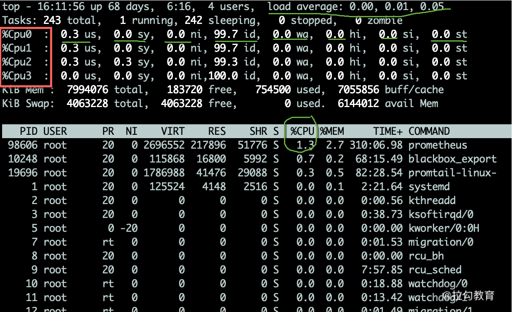

CPU 的使用有多个维度的指标，下面分别说明：

- us 用户态所占用的 CPU 百分比，即引用程序所耗费的 CPU；
- sy 内核态所占用的 CPU 百分比，需要配合 vmstat 命令，查看上下文切换是否频繁；
- ni 高优先级应用所占用的 CPU 百分比；
- wa 等待 I/O 设备所占用的 CPU 百分比，经常使用它来判断 I/O 问题，过高输入输出设备可能存在非常明显的瓶颈；
- hi 硬中断所占用的 CPU 百分比；
- si 软中断所占用的 CPU 百分比；
- st 在平常的服务器上这个值很少发生变动，因为它测量的是宿主机对虚拟机的影响，即虚拟机等待宿主机 CPU 的时间占比，这在一些超卖的云服务器上，经常发生；
- id 空闲 CPU 百分比。

一般地，我们比较关注空闲 CPU 的百分比，它可以从整体上体现 CPU 的利用情况。

## 2.负载 —— CPU 任务排队情况

如果我们评估 CPU 任务执行的排队情况，那么需要通过负载（load）来完成。除了 top 命令，使用 uptime 命令也能够查看负载情况，load 的效果是一样的，分别显示了最近 1min、5min、15min 的数值。

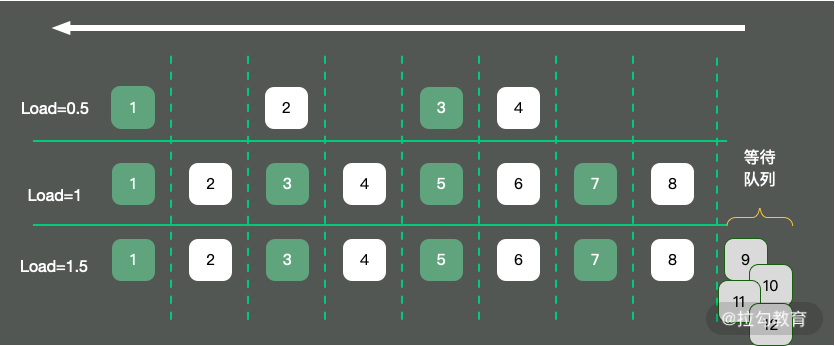

如上图所示，以单核操作系统为例，将 CPU 资源抽象成一条单向行驶的马路，则会发生以下三种情况：

- 马路上的车只有 4 辆，车辆畅通无阻，load 大约是 0.5；
- 马路上的车有 8 辆，正好能首尾相接安全通过，此时 load 大约为 1；
- 马路上的车有 12 辆，除了在马路上的 8 辆车，还有 4 辆等在马路外面，需要排队，此时 load 大约为 1.5。

那 load 为 1 代表的是啥？针对这个问题，误解还是比较多的。

很多人看到 load 的值达到 1，就认为系统负载已经到了极限。这在单核的硬件上没有问题，但在多核硬件上，这种描述就不完全正确，它还与 CPU 的个数有关。例如：

- 单核的负载达到 1，总 load 的值约为 1；
- 双核的每核负载都达到 1，总 load 约为 2；
- 四核的每核负载都达到 1，总 load 约为 4。

所以，对于一个 load 到了 10，却是 16 核的机器，你的系统还远没有达到负载极限。

## 3.vmstat —— CPU 繁忙程度

要看 CPU 的繁忙程度，可以通过 vmstat 命令，下图是 vmstat 命令的一些输出信息。

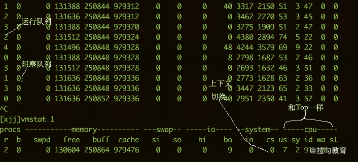

比较关注的有下面几列：

- **b** 如果系统有负载问题，就可以看一下 b 列（Uninterruptible Sleep），它的意思是等待 I/O，可能是读盘或者写盘动作比较多；
- **si/so** 显示了交换分区的一些使用情况，交换分区对性能的影响比较大，需要格外关注；
- **cs** 每秒钟上下文切换（ **Context Switch** ）的数量，如果上下文切换过于频繁，就需要考虑是否是进程或者线程数开的过多。

每个进程上下文切换的具体数量，可以通过查看内存映射文件获取，如下代码所示：

```plaintext
[[email protected] ~]# cat /proc/2788/status
...
voluntary_ctxt_switches: 93950
nonvoluntary_ctxt_switches: 171204
```

# 内存

要想了解内存对性能的影响，则需要从操作系统层面来看一下内存的分布。


我们在平常写完代码后，比如写了一个 C++ 程序，去查看它的汇编，如果看到其中的内存地址，并不是实际的物理内存地址，那么应用程序所使用的，就是 **逻辑内存** 。学过计算机组成结构的同学应该都有了解。

逻辑地址可以映射到两个内存段上： **物理内存** 和 **虚拟内存**，那么整个系统可用的内存就是两者之和。比如你的物理内存是 4GB，分配了 8GB 的 SWAP 分区，那么应用可用的总内存就是 12GB。

## 1. top 命令

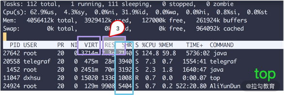

如上图所示，我们看一下内存的几个参数，从 top 命令可以看到几列数据，注意方块框起来的三个区域，解释如下：

- **VIRT** 这里是指虚拟内存，一般比较大，不用做过多关注；
- **RES** 我们平常关注的是这一列的数值，它代表了进程实际占用的内存，平常在做监控时，主要监控的也是这个数值；
- **SHR** 指的是共享内存，比如可以复用的一些 so 文件等。

## 2. CPU 缓存

由于 CPU 和内存之间的速度差异非常大，解决方式就是 **加入高速缓存** 。实际上，这些高速缓存往往会有多层，如下图所示。

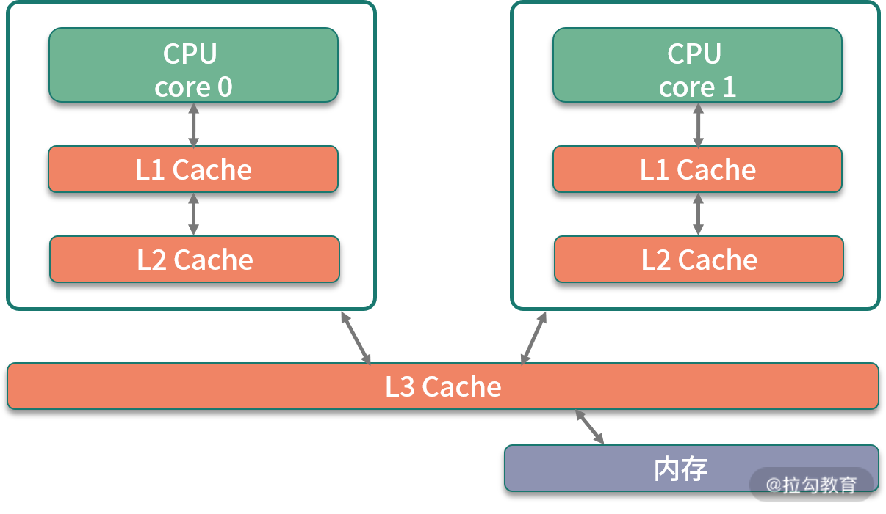

Java 有大部分知识点是围绕多线程的，那是因为，如果一个线程的时间片跨越了多个 CPU，那么就会存在同步问题。

在 Java 中，和 CPU 缓存相关的最典型的知识点，就是在并发编程中，针对 Cache line 的 **伪共享** （False Sharing）问题。

伪共享指的是在这些高速缓存中，以缓存行为单位进行存储，哪怕你修改了缓存行中一个很小很小的数据，它都会整个刷新。所以，当多线程修改一些变量的值时，如果这些变量都在同一个缓存行里，就会造成频繁刷新，无意中影响彼此的性能。

CPU 的每个核，基本是相同的，我们拿 CPU0 来说，可以通过以下的命令查看它的缓存行大小，这个值一般是 64。

```plaintext
cat /sys/devices/system/cpu/cpu0/cache/index0/coherency_line_size
cat /sys/devices/system/cpu/cpu0/cache/index1/coherency_line_size
cat /sys/devices/system/cpu/cpu0/cache/index2/coherency_line_size
cat /sys/devices/system/cpu/cpu0/cache/index3/coherency_line_size
```

当然，通过 cpuinfo 也能得到一样的结果：

```plaintext
# cat /proc/cpuinfo | grep cache
cache size : 20480 KB
cache_alignment : 64
cache size : 20480 KB
cache_alignment : 64
cache size : 20480 KB
cache_alignment : 64
cache size : 20480 KB
cache_alignment : 64
```

在 JDK8 以上的版本，通过开启参数 -XX:-RestrictContended，就可以使用注解 @sun.misc.Contended 进行补齐，来避免伪共享的问题。具体情况，在 12 课时并行优化中，我们再详细讲解。

## 3. HugePage


我们再回顾一下上文提到的这张图，上面有一个 TLB 组件，它的速度很快，但容量有限，在普通的 PC 机上没有什么瓶颈。但如果机器配置比较高，物理内存比较大，那就会产生非常多的映射表，CPU 的检索效率也会随之降低。

传统的页大小是 4KB，在大内存时代这个值偏小了，解决的办法就是增加页的尺寸，比如将其增加到 2MB，这样，就可以使用较少的映射表来管理大内存。而这种将页增大的技术，就是 **Huge Page** 。

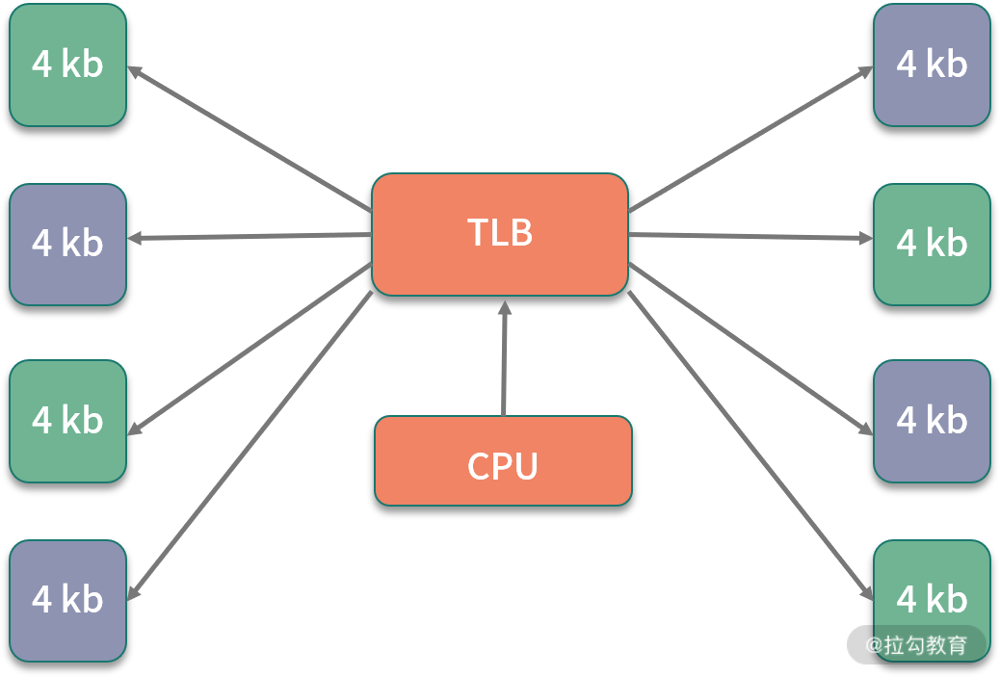

同时，HugePage 也伴随着一些副作用，比如竞争加剧，但在一些大内存的机器上，开启后在一定程度上会增加性能。

## 4. 预先加载

另外，一些程序的默认行为也会对性能有所影响，比如 JVM 的 -XX:+AlwaysPreTouch 参数。

默认情况下，JVM 虽然配置了 Xmx、Xms 等参数，指定堆的初始化大小和最大大小，但它的内存在真正用到时，才会分配；但如果加上 AlwaysPreTouch 这个参数，JVM 会在启动的时候，就把所有的内存预先分配。

这样，启动时虽然慢了些，但运行时的性能会增加。

# I/O

I/O 设备可能是计算机里速度最慢的组件了，它指的不仅仅是硬盘，还包括外围的所有设备。那硬盘有多慢呢？我们不去探究不同设备的实现细节，直接看它的写入速度（数据未经过严格测试，仅作参考）。

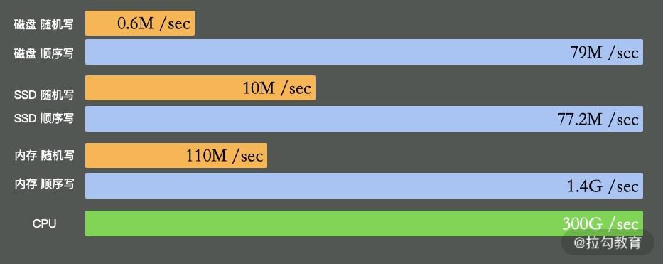

如上图所示，可以看到普通磁盘的随机写与顺序写相差非常大，但顺序写与 CPU 内存依旧不在一个数量级上。**缓冲区依然是解决速度差异的唯一工具**，但在极端情况下，比如断电时，就产生了太多的不确定性，这时这些缓冲区，都容易丢。由于这部分内容的篇幅比较大，我将在第 06 课时专门讲解。

## 1. iostat

最能体现 I/O 繁忙程度的，就是 top 命令和 vmstat 命令中的 wa%。如果你的应用写了大量的日志，I/O wait 就可能非常高。

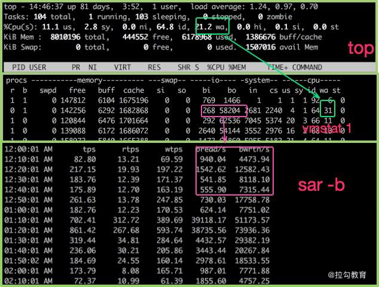

很多同学反馈到，不知道有哪些便捷好用的查看磁盘 I/O 的工具，其实 iostat 就是。你可以通过 sysstat 包进行安装。

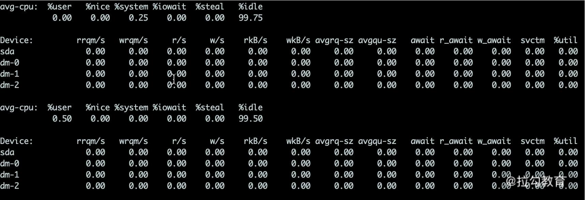

上图中的指标详细介绍如下所示。

- **%util** ：我们非常关注这个数值，通常情况下，这个数字超过 80%，就证明 I/O 的负荷已经非常严重了。
- **Device** ：表示是哪块硬盘，如果你有多块磁盘，则会显示多行。
- **avgqu-sz** ：平均请求队列的长度，这和十字路口排队的汽车也非常类似。显然，这个值越小越好。
- **awai** ：响应时间包含了队列时间和服务时间，它有一个经验值。通常情况下应该是小于 5ms 的，如果这个值超过了 10ms，则证明等待的时间过长了。
- **svctm** ：表示操作 I/O 的平均服务时间。你可以回忆一下第 01 课时的内容，在这里就是 AVG 的意思。svctm 和 await 是强相关的，如果它们比较接近，则表示 I/O 几乎没有等待，设备的性能很好；但如果 await 比 svctm 的值高出很多，则证明 I/O 的队列等待时间太长，进而系统上运行的应用程序将变慢。

## 2. 零拷贝

硬盘上的数据，在发往网络之前，需要经过多次缓冲区的拷贝，以及用户空间和内核空间的多次切换。如果能减少一些拷贝的过程，效率就能提升，所以零拷贝应运而生。**零拷贝** 是一种非常重要的性能优化手段，比如常见的 Kafka、Nginx 等，就使用了这种技术。我们来看一下有无零拷贝之间的区别。

（1）没有采取零拷贝手段

如下图所示，传统方式中要想将一个文件的内容通过 Socket 发送出去，则需要经过以下步骤：

- 将文件内容拷贝到内核空间；
- 将内核空间内存的内容，拷贝到用户空间内存，比如 Java 应用读取 zip 文件；
- 用户空间将内容写入到内核空间的缓存中；
- Socket 读取内核缓存中的内容，发送出去。

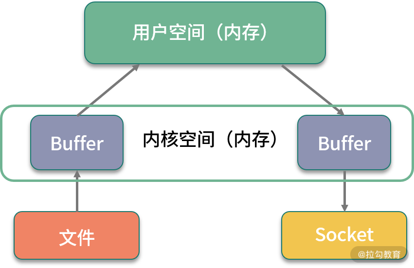 没有采取零拷贝手段的图

（2）采取了零拷贝手段

零拷贝有多种模式，我们用 sendfile 来举例。如下图所示，在内核的支持下，零拷贝少了一个步骤，那就是内核缓存向用户空间的拷贝，这样既节省了内存，也节省了 CPU 的调度时间，让效率更高。

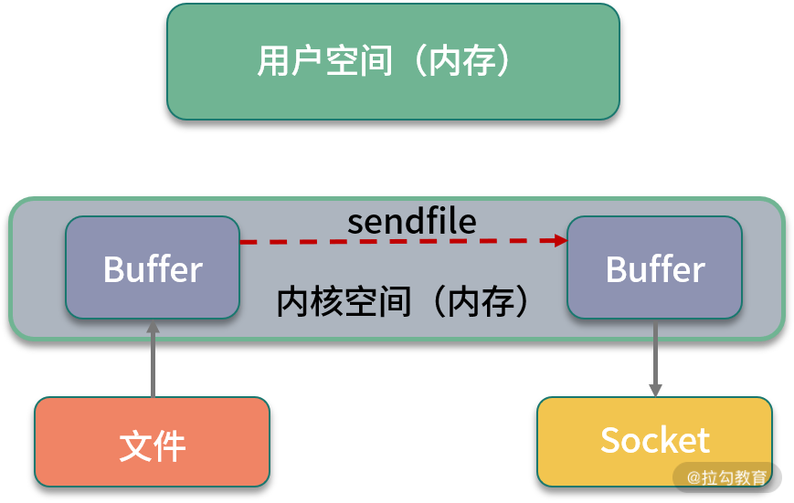 采取了零拷贝手段的图

# 小结

本课时我们学习了计算机中对性能影响最大的三个组件：CPU、内存、I/O，并深入了解了观测它们性能的一些命令，这些方式可以帮我们大体猜测性能问题发生的地方。

但它们对性能问题，只能起到辅助作用，不能帮助我们精准地定位至真正的性能瓶颈，还需要做更多深入的排查工作，收集更多信息。

最后留一个思考题：磁盘的速度这么慢，为什么 Kafka 操作磁盘，吞吐量还能那么高？你可以先在留言区讨论，下一课时我会讲解。

不知你在实际的工作中是否还有其他的疑惑，欢迎留言讨论，我会一一解答~

在接下来的第 04 课时，我将介绍一系列更深入的工具，帮你获取性能数据，离“病灶”更近一步。
