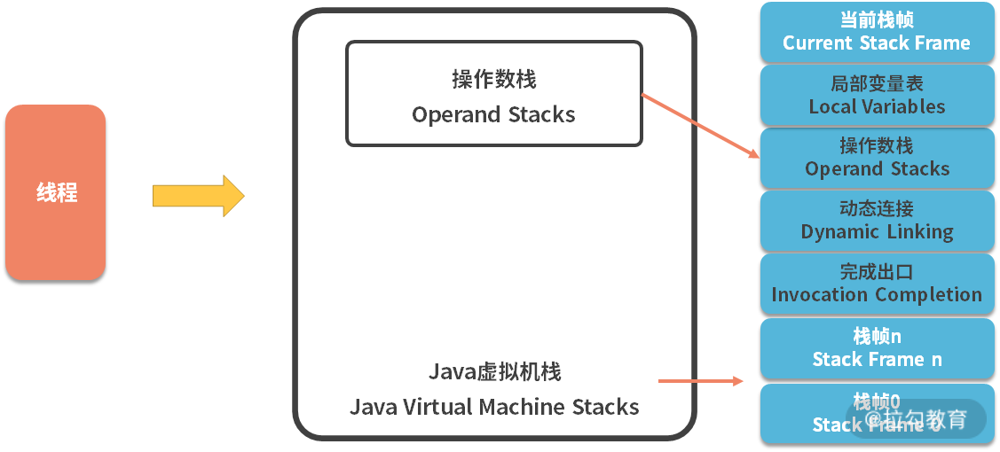
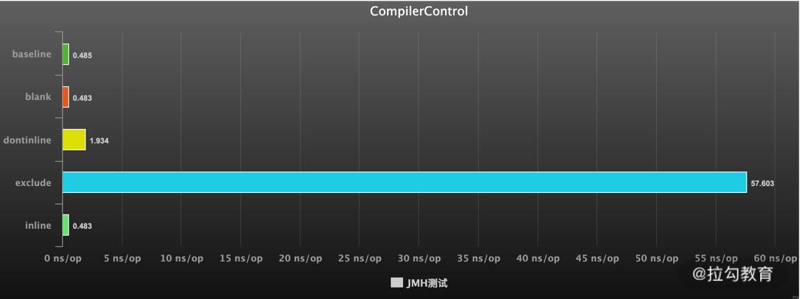
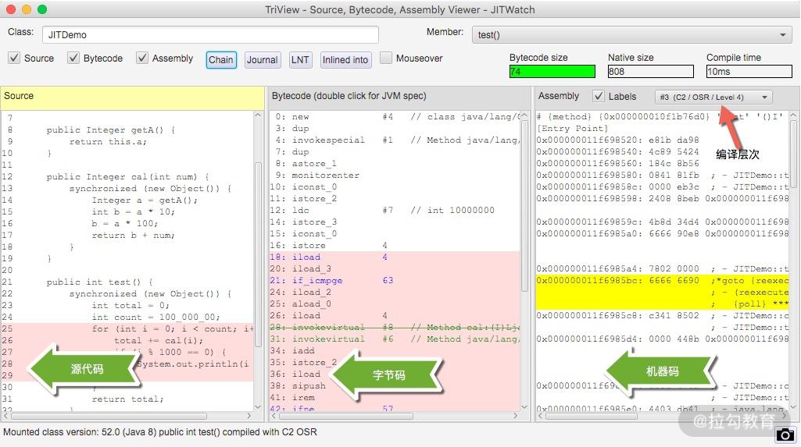
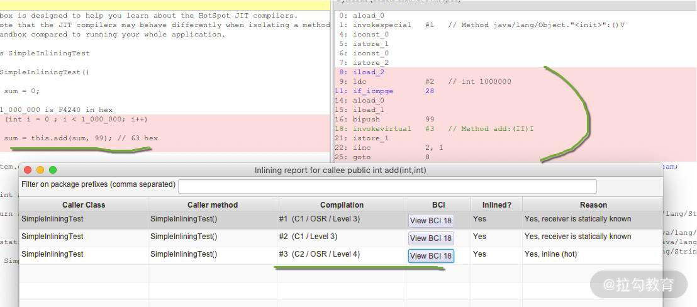

# 18 高级进阶：JIT 如何影响 JVM 的性能？

我们在上一课时，我们了解到 Java 虚拟机栈，其实是一个双层的栈，如下图所示，第一层就是针对 method 的栈帧，第二层是针对字节码指令的操作数栈。



Java 虚拟机栈图

栈帧的创建是需要耗费资源的，尤其是对于 Java 中常见的 getter、setter 方法来说，这些代码通常只有一行，每次都创建栈帧的话就太浪费了。

另外，Java 虚拟机栈对代码的执行，采用的是字节码解释的方式，考虑到下面这段代码，变量 a 声明之后，就再也不被使用，要是按照字节码指令解释执行的话，就要做很多无用功。

```java
public class A{
    int attr = 0;
    public void test(){
        int a = attr;
        System.out.println("ok");
    }
}
```

下面是这段代码的字节码指令，我们能够看到 aload_0，getfield ，istore_1 这三个无用的字节码指令操作。

```java
 public void test();
    descriptor: ()V
    flags: ACC_PUBLIC
    Code:
      stack=2, locals=2, args_size=1
         0: aload_0
         1: getfield      #2                  // Field attr:I
         4: istore_1
         5: getstatic     #3                  // Field java/lang/System.out:Ljava/io/PrintStream;
         8: ldc           #4                  // String ok
        10: invokevirtual #5                  // Method java/io/PrintStream.println:(Ljava/lang/String;)V
        13: return
      LineNumberTable:
        line 4: 0
        line 5: 5
        line 6: 13
```

另外，我们了解到垃圾回收器回收的目标区域主要是堆，堆上创建的对象越多，GC 的压力就越大。要是能把一些变量，直接在栈上分配，那 GC 的压力就会小一些。

其实，我们说的这几个优化的可能性，JVM 已经通过 JIT 编译器（Just In Time Compiler）去做了，JIT 最主要的目标是把解释执行变成编译执行。

为了提高热点代码的执行效率，在运行时，虚拟机将会把这些代码编译成与本地平台相关的机器码，并进行各种层次的优化，这就是 JIT 编译器的功能。


如上图，JVM 会将调用次数很高，或者在 for 循环里频繁被使用的代码，编译成机器码，然后缓存在 CodeCache 区域里，下次调用相同方法的时候，就可以直接使用。

那 JIT 编译都有哪些手段呢？接下来我们详细介绍。

### 方法内联

在 **“05 | 工具实践：基准测试 JMH，精确测量方法性能”** 提到 JMH 的时候，我们就了解到 CompilerControl 注解可以控制 JIT 编译器的一些行为。

其中，有一个模式叫作 **inline** ，就是内联的意思，它会把一些短小的方法体，直接纳入目标方法的作用范围之内，就像是直接在代码块中追加代码。这样，就少了一次方法调用，执行速度就能够得到提升，这就是方法内联的概念。

可以使用 -XX:-Inline 参数来禁用方法内联，如果想要更细粒度的控制，可以使用 CompileCommand 参数，例如：

```java
-XX:CompileCommand=exclude,java/lang/String.indexOf
```

JMH 就是使用这个参数来实现的自定义编译特性。 在 JDK 的源码里，也有很多被 **@ForceInline** 注解的方法，这些方法，会在执行的时候被强制进行内联；而被 **@DontInline** 注解的方法，则始终不会被内联。

我们从 **“05 | 工具实践：基准测试 JMH，精确测量方法性能”** 获取第 16 个代码示例，来看一下 JIT 这些优化的效果，主要代码块如下：

```java
public void target_blank() {
    // this method was intentionally left blank
}
@CompilerControl(CompilerControl.Mode.DONT_INLINE)
public void target_dontInline() {
    // this method was intentionally left blank
}
@CompilerControl(CompilerControl.Mode.INLINE)
public void target_inline() {
    // this method was intentionally left blank
}
@CompilerControl(CompilerControl.Mode.EXCLUDE)
public void target_exclude() {
    // this method was intentionally left blank
}
```

执行结果如下，可以看到不使用 JIT 编译和使用了 JIT 编译的性能差距达到了 100 多倍，使用了内联比不使用内联，速度快了 5 倍。

```plaintext
Benchmark                                Mode  Cnt   Score   Error  Units
JMHSample_16_CompilerControl.baseline    avgt    3   0.485 ± 1.492  ns/op
JMHSample_16_CompilerControl.blank       avgt    3   0.483 ± 1.518  ns/op
JMHSample_16_CompilerControl.dontinline  avgt    3   1.934 ± 3.112  ns/op
JMHSample_16_CompilerControl.exclude     avgt    3  57.603 ± 4.435  ns/op
JMHSample_16_CompilerControl.inline      avgt    3   0.483 ± 1.520  ns/op
```



JIT 编译之后的二进制代码，是放在 Code Cache 区域里的。这个区域的大小是固定的，而且一旦启动无法扩容。如果 Code Cache 满了，JVM 并不会报错，但会停止编译。所以编译执行就会退化为解释执行，性能就会降低。不仅如此，JIT 编译器会一直尝试去优化你的代码，造成 CPU 占用上升。

通过参数 -XX:ReservedCodeCacheSize 可以指定 Code Cache 区域的大小，如果你通过监控发现空间达到了上限，就要适当的增加它的大小。

### 编译层次

HotSpot 虚拟机包含多个即时编译器，有 C1，C2 和 Graal，JDK8 以后采用的是分层编译的模式。使用 jstack 命令获得的线程信息，经常能看到它们的身影。

```java
"C2 CompilerThread0" #6 daemon prio=9 os_prio=31 cpu=830.41ms elapsed=4252.14s tid=0x00007ffaed023000 nid=0x5a03 waiting on condition  [0x0000000000000000]
   java.lang.Thread.State: RUNNABLE
   No compile task
"C1 CompilerThread0" #8 daemon prio=9 os_prio=31 cpu=549.91ms elapsed=4252.14s tid=0x00007ffaed831800 nid=0x5c03 waiting on condition  [0x0000000000000000]
   java.lang.Thread.State: RUNNABLE
   No compile task
```

使用额外线程进行即时编译，可以不用阻塞解释执行的逻辑。JIT 通常会在触发之后就在后台运行，编译完成之后就将相应的字节码替换为编译后的代码。 JIT 编译方式有两种：一种是编译方法，另一种是编译循环。

分层编译将 Java 虚拟机的执行状态分为了五个层次。

- 字节码的解释执行;
- 执行不带 profiling 的 C1 代码;
- 执行仅带方法调用次数以及循环执行次数 profiling 的 C1 代码;
- 执行带所有 profiling 的 C1 代码;
- 执行 C2 代码。

其中，Profiling 指的是运行时的程序的执行状态数据，比如循环调用的次数、方法调用的次数、分支跳转次数、类型转换次数等。比如 JDK 中的 hprof 工具，就是一种 profiler，说白了就是一些中间的统计数据。

在不启用分层编译的情况下，当方法的调用次数和循环回边的次数的总和，超过由参数 -XX:CompileThreshold 指定的阈值时，便会触发即时编译；但当启用分层编译时，这个参数将会失效，会采用一套动态调整进行调整。

### 逃逸分析

**下面着重讲解一下逃逸分析，这个知识点在面试的时候经常会被问到。** 我们先回顾一下上一课时留下的问题：我们常说的对象，除了基本数据类型，一定是在堆上分配的吗？

答案是否定的，通过逃逸分析，JVM 能够分析出一个新的对象的使用范围，从而决定是否要将这个对象分配到堆上。逃逸分析现在是 JVM 的默认行为，可以通过参数 -XX:-DoEscapeAnalysis 关掉它。

那什么样的对象算是逃逸的呢？可以看一下下面的两种典型情况。

如代码所示，对象被赋值给成员变量或者静态变量，可能被外部使用，变量就发生了逃逸。

```java
public class EscapeAttr {
    Object attr;
    public void test() {
        attr = new Object();
    }
}
```

再看下面这段代码，对象通过 return 语句返回。由于程序并不能确定这个对象后续会不会被使用，外部的线程能够访问到这个结果，对象也发生了逃逸。

```java
public class EscapeReturn {
    Object attr;
    public Object test() {
        Object obj = new Object();
        return obj;
    }
}
```

那逃逸分析有什么好处呢？ **1. 栈上分配** 如果一个对象在子程序中被分配，指向该对象的指针永远不会逃逸，对象有可能会被优化为栈分配。栈分配可以快速地在栈帧上创建和销毁对象，不用再分配到堆空间，可以有效地减少 GC 的压力。 **2. 分离对象或标量替换** 但对象结构通常都比较复杂，如何将对象保存在栈上呢？

JIT 可以将对象打散，全部替换为一个个小的局部变量，这个打散的过程，就叫作标量替换（标量就是不能被进一步分割的变量，比如 int、long 等基本类型）。也就是说，标量替换后的对象，全部变成了局部变量，可以方便地进行栈上分配，而无须改动其他的代码。

从上面的描述我们可以看到，并不是所有的对象或者数组，都会在堆上分配。由于JIT的存在，如果发现某些对象没有逃逸出方法，那么就有可能被优化成栈分配。 **3.同步消除** 如果一个对象被发现只能从一个线程被访问到，那么对于这个对象的操作可以不考虑同步。

注意这是针对 synchronized 来说的，JUC 中的 Lock 并不能被消除。

要开启同步消除，需要加上 -XX:+EliminateLocks 参数。由于这个参数依赖逃逸分析，所以同时要打开 -XX:+DoEscapeAnalysis 选项。

比如下面这段代码，JIT 判断对象锁只能被一个线程访问，就可以去掉这个同步的影响。

```java
public class SyncEliminate {
    public void test() {
        synchronized (new Object()) {
        }
    }
}
```

仓库中也有一个 StringBuffer 和 StringBuilder 的 JMH 测试对比，可以看到在开启了锁消除的情况下，它们的效率相差并不大。

```plaintext
Benchmark                          Mode  Cnt       Score       Error   Units
BuilderVsBufferBenchmark.buffer   thrpt   10   90085.927 ± 95174.289  ops/ms
BuilderVsBufferBenchmark.builder  thrpt   10  103280.200 ± 76172.538  ops/ms
```

### JITWatch

可以使用 jitwatch 工具来观测 JIT 的一些行为。

```plaintext
https://github.com/AdoptOpenJDK/jitwatch
```

在代码的启动参数里加入 LogCompilation 等参数开启记录，将生成一个 jitdemo.log 文件。

```plaintext
 -XX:+UnlockDiagnosticVMOptions -XX:+TraceClassLoading  -XX:+PrintAssembly -XX:+LogCompilation -XX:LogFile=jitdemo.log
```

使用 jitwatch 工具，可打开这个文件，看到详细的编译结果。



下面是一段测试代码：

```java
public class SimpleInliningTest {
    public SimpleInliningTest() {
        int sum = 0;
        // 1_000_000 is F4240 in hex
        for (int i = 0; i < 1_000_000; i++) {
            sum = this.add(sum, 99);
            // 63 hex
        }
        System.out.println("Sum:" + sum);
    }
    public int add(int a, int b) {
        return a + b;
    }
    public static void main(String[] args) {
        new SimpleInliningTest();
    }
}
```

从执行后的结果可以看到，热点 for 循环已经使用 JIT 进行了编译，而里面应用的 add 方法，也已经被内联。



### 小结

JIT 是现代 JVM 主要的优化点，能够显著地提升程序的执行效率。从解释执行到最高层次的 C2，一个数量级的性能提升也是有可能的。但即时编译的过程是非常缓慢的，既耗时间也费空间，所以这些优化操作会和解释执行同时进行。

值得注意的是，JIT 在某些情况下还会出现逆优化。比如一些热部署方式触发的 redefineClass，就会造成 JIT 编译结果的失效，相关的内联代码也需要重新生成。

JIT 优化并不见得每次都有用，比如下面这段代码，编译后执行，会发生死循环。但如果你在启动的时候，加上 **-Djava.compiler=NONE** 参数，禁用 JIT，它就能够执行下去。

```java
public class Demo {
 static final class TestThread extends Thread {
  boolean stop = false;
  public boolean isStop() {
   return stop;
  }
  @Override
  public void run() {
   try {
    Thread.sleep(100);
   } catch (Exception ex) {
    ex.printStackTrace();
   }
   stop = true;
   System.out.println("END");
  }
 }
 public static void main(String[] args) {
  int i = 0;
  TestThread test = new TestThread();
  test.start();
  while(!test.isStop()){
   System.out.println("--");
   i++;
  }
 }
}
```

**我们主要看了方法内联、逃逸分析等概念，了解到一些方法在被优化后，对象并不一定是在堆上分配的，它可能在被标量替换后，直接在栈上分配。这几个知识点也是在面试中经常被问到的。**

JIT 的这些优化一般都是在后台进程默默地去做了，我们不需要关注太多。Code Cache 的容量达到上限，会影响程序执行的效率，但除非你有特别多的代码，默认的 240M 一般来说，足够用了。
```
