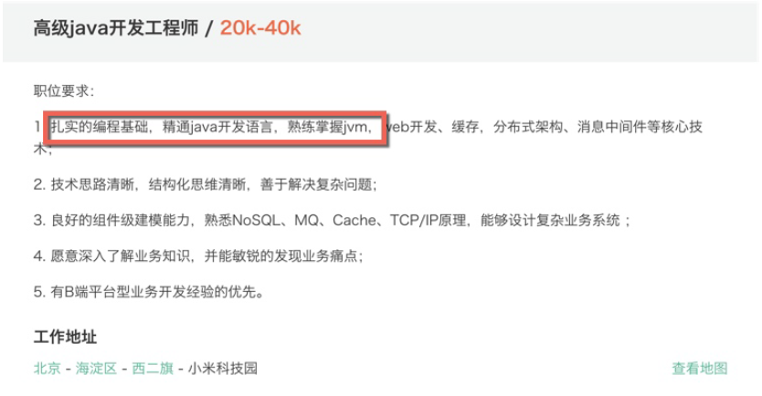
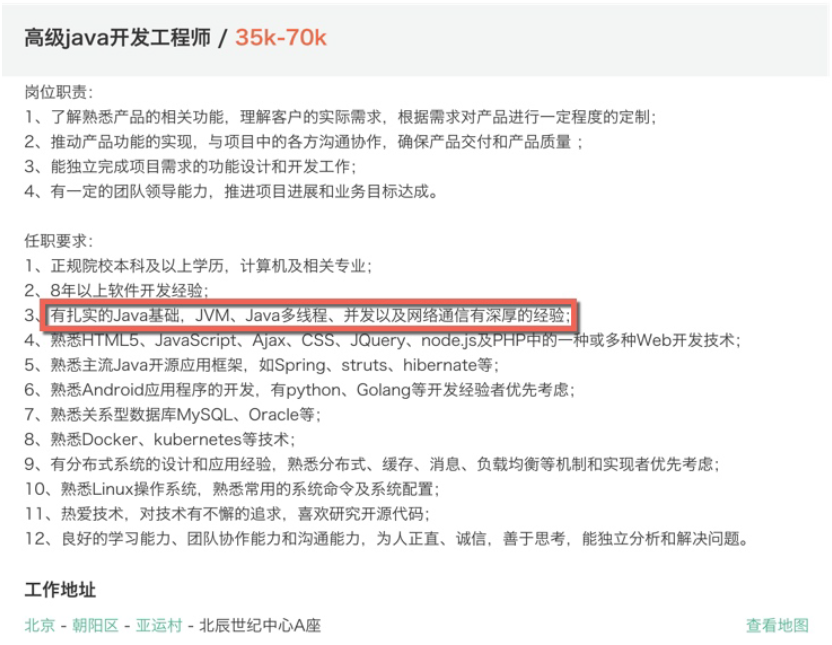

# 00 开篇词：JVM，一块难啃的骨头

你好，我是你的 JVM 讲师李国，曾任京东金融、陌陌科技高级架构师，专注分享基础架构方面的知识。

# JVM 目前情况

我在工作期间，因为接触的都是比较底层的中间件和操作系统，会涉及大量高并发场景下的调优工作。其中，JVM 的调优和故障排查，是非常重要的一项工作内容。 许多同学对 JVM 有一些恐惧，这是可以理解的。JVM 是“Java 虚拟机”的意思，“虚拟”这两个字，证明了它要实现一个庞大的生态，有点类似于“操作系统”，内容肯定是非常多的。 而随着互联网进入下半场，好公司对程序员的要求也水涨船高，各大互联网公司的岗位描述中，JVM 几乎是逃不掉的关键词，我们举几个来自拉勾网的 JD 实例。

你会发现，在 Java 高级工程师岗位要求中，JVM 几乎成了必须掌握的技能点，而在面经里涉及 JVM 的知识也数不胜数，本专栏各课时涉及的知识点，也正是各大厂 Java 高级工程师面试的高频考题。 只要你是在做 Java 方面的工作，JVM 便是必备的知识。

# JVM 在学习过程中的难点和问题

### 实践资料太少，不太容易系统化

其实，我们开发人员离 JVM 很近，它也没有那么神秘。许多问题，你可能在平常的工作中就已经遇到了。

- 正在运行的 Java 进程，可能突然就 OOM 内存溢出了。
- 线上系统产生卡顿，CPU 疯狂运转，GC 时间飙升，严重影响了服务响应时间。
- 面对一堆 JVM 的参数无从下手，错失了性能提升的可能，或者因为某个参数的错误配置，产生了尴尬的负面效果。
- 想要了解线上应用的垃圾回收状况，却不知从何开始，服务监控状况无法掌控。
- 一段代码有问题，执行效率低，但就是无法找到深层次原因。

这些都是经常发生的事情，我就不止一次在半夜被报警铃声叫起，并苦于问题的追踪。别担心，我也是从这个阶段过来的，通过大量的线上实操，积累了非常丰富的经验。还记得当时花了整整一周时间，才定位到一个棘手的堆外内存泄漏问题。现在再回头看这些问题，就显得比较风轻云淡了。

### 相关问题太多，概念太杂了

同时，JVM 的版本更新很快，造成了很多同学会对 JVM 有一些疑问。网络上的一些博主，可能会从自己的角度去分析问题，读者无法产生代入感。甚至，一些错误的知识会产生比较严重的后果，你会经常看到一些有冲突的概念。

- Java 源代码是怎么变成字节码的，字节码又是怎么进入 JVM 的？
- JVM 是怎么执行字节码的？哪些数据放在栈？哪些数据放在堆？
- Java 的一些特性是如何与字节码产生关联的？
- 如何监控 JVM 的运行，才能够做到问题自动发现？

如果你有这方面的疑问，那再正常不过了。我们在专栏中将从实际的应用场景出发，来探讨一些比较深入的问题。 那为什么要学习 JVM？不学习 JVM 会影响我写 Java 代码么？严格意义上来说，并不会。但是，如果不学习 JVM 你可能可以写出功能完善的代码，但是一定无法写出更加高效的代码。更别说常见的性能优化和故障排查了。

### 学习 JVM 有什么用？

由于 JVM 是一个虚拟的体系，它拥有目前最前沿的垃圾回收算法实现，虽然 JVM 也有一些局限性，但学习它之后，在遇到其他基于“虚拟机”的语言时，便能够触类旁通。

- **面试必考**

学习 JVM 最重要的一点就是体系化，仅靠零零散散的知识是无法形成有效的知识系统的。这样，在回答面试官的问题时，便会陷入模棱两可的境地。如果你能够触类旁通，既有深度又有广度地做进一步升华，会让面试官眼前一亮。

- **职业提升**

JVM 是 Java 体系中非常重要的内容，不仅仅因为它是面试必考，更因为它与我们的工作息息相关。同时，我们也认识到，JVM 是一块难啃的骨头。市面上有很多大牛分享的书籍，但大部分都是侧重于理论，不会教你什么时候用什么参数，也不会教你怎么去优化代码。理论与实践是有很大出入的，你可能非常了解 JVM 的内存模型，但等到真正发生问题时，还是会一头雾水。

如果能够理论联系实际，在面临一些棘手问题时，就能够快速定位到它的根本问题，为你的职业发展助力。

- **业务场景强相关**

不同的业务，JVM 的配置肯定也是不同的。比如高并发的互联网业务，与传统的报表导出业务，就是完全不同的两个应用场景：它们有的对服务响应时间 RT 要求比较高，不允许有长尾请求；有的对功能完整度要求比较高，不能运行到一半就宕机了。所以大家在以后的 JVM 优化前，一定要先确立场景，如果随便从网络上搬下几个配置参数进行设置，那是非常危险的。

鉴于以上这些问题，我会在课程中分享一些对线上 JVM 的实践和思考。课程中还会有很多代码示例来配合讲解，辅之以实战案例，让你对理论部分的知识有更深的理解。本门课程，我就以自己对 JVM 的理解，用尽量简单、活泼的语言，来解答这些问题。

# JVM 怎么学？

为了准备这个课程，我同时研读了大量的中英文资料。我发现这方面的内容，有一个非常显著的特点，就是比较晦涩。很多大牛讲得比较深入，但你可能读着读着就进行不下去了。很容易产生当时感觉非常有道理，过几天就忘了的结果。 我在公众号（xjjdog）上分享了大量高价值的文章，但有些需要系统性讲解的知识点，我决定做成精品课程，JVM 就是其中优先级比较高的。问题探讨会产生更多思想碰撞，也能加深记忆，大家可以多多交流。 我将整个课程分为四个部分，一个问题可能会从不同的角度去解析，每个课时都会做一个简单的总结。

1. 基础原理：主要讲解 JVM 基础概念，以及内存区域划分和类加载机制等。最后，会根据需求实现一个自定义类加载器。
1. 垃圾回收：Java 中有非常丰富的垃圾回收器，此部分以理论为主，是通往高级工程师之路无法绕过的知识点。我会横向比较工作中常用的垃圾回收器并以主题深入的方式讲解 G1、GMS、ZGC 等主流垃圾回收器。
1. 实战部分：我会模拟工作中涉及的 OOM 溢出全场景，用 23 个大型工作实例分析线上问题，并针对这些问题提供排查的具体工具的使用介绍，还会提供一个高阶的对堆外内存问题的排查思路。
1. 进阶部分：介绍 JMM，以及从字节码层面来剖析 Java 的基础特性以及并发方面的问题。还会重点分析应用较多的 Java Agent 技术。这部分内容比较底层，可以加深我们对 Java 底层实现的理解。
1. 彩蛋：带你回顾 JVM 的历史并展望未来，即使 JVM 版本不断革新也能够洞悉未来掌握先机，最后会给你提供一份全面的 JVM 面试题，助力高级 Java 岗位面试。

# 你将获得什么？

### 建立完整的 JVM 知识体系

通过这门课程，你可以系统地学习 JVM 相关知识，而不是碎片化获取。我会以大量的实例来增加你的理解和记忆，理论结合实践，进而加深对 Java 语言的理解。

### 能够对线上应用进行优化和故障排查

课程中包含大量的实战排查工具，掌握它们，你能够非常容易地定位到应用中有问题的点，并提供优化思路，尤其是 MAT 等工具的使用，这通常是普通开发人员非常缺乏的一项技能。 我还会分享一些在线的 JVM 监控系统建设方案，让你实时掌控整个 JVM 的健康状况，辅助故障的排查。

### 面试中获取 Offer 的利器

本课程的每小节，都是 Java 面试题的重灾区。在课程中以实际工作场景为出发点来解答面试中的问题，既能在面试中回答问题的理论知识，又能以实际工作场景为例与面试官深入探讨问题，可以说通过本课程学习 JVM 是成为 Java 高级、资深工程师的必经之路。
