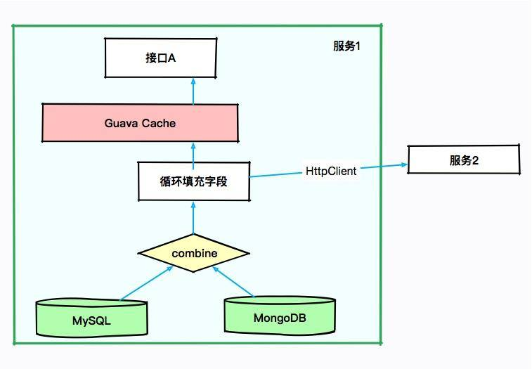
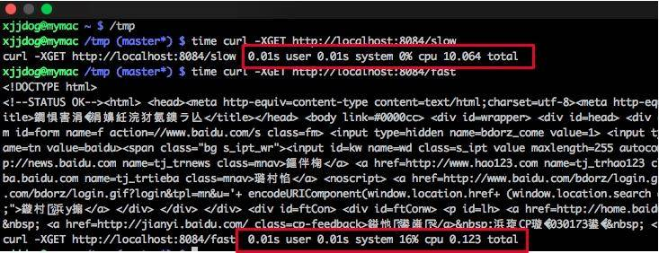
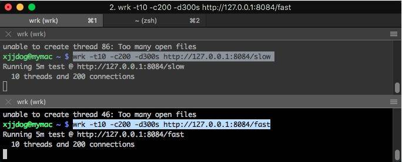
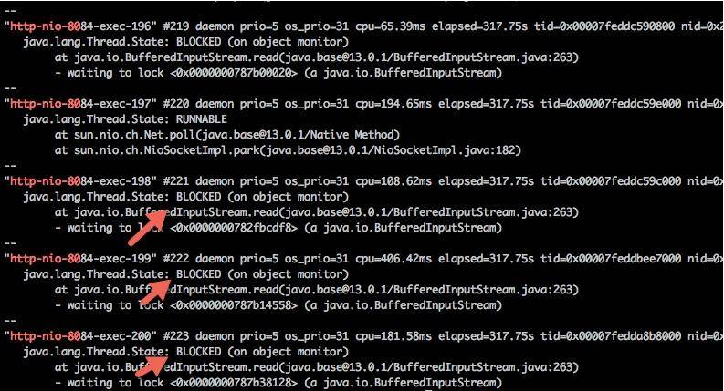
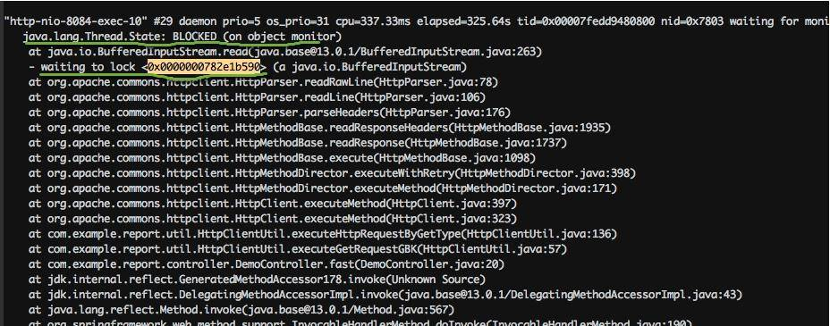
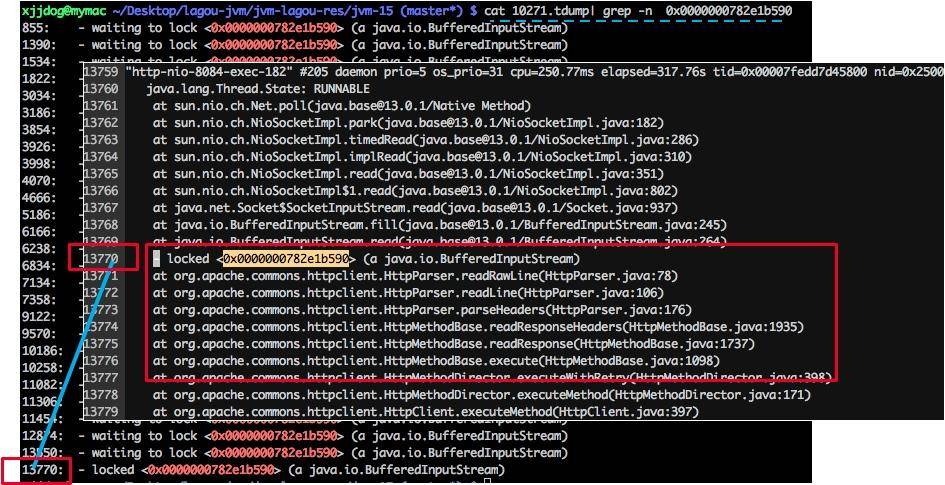
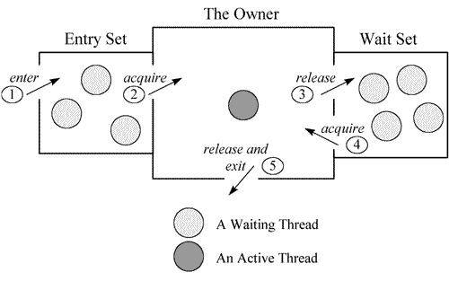
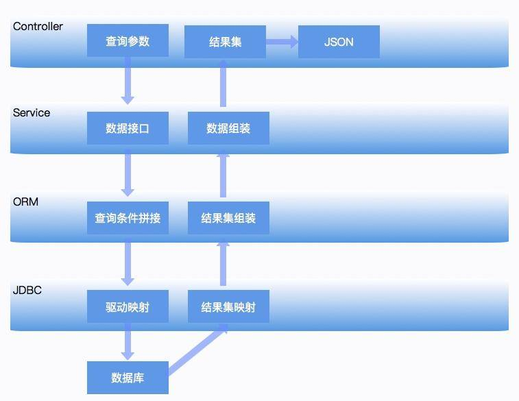
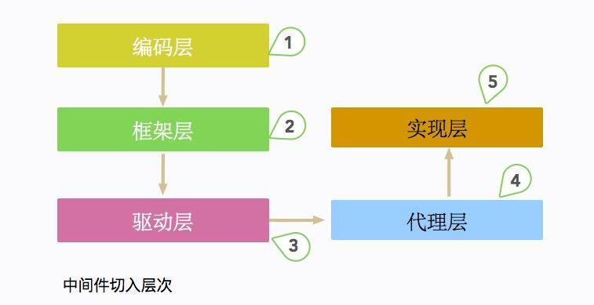
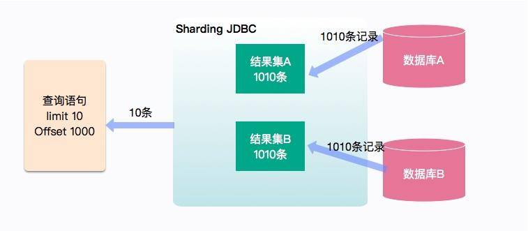

# 16 案例分析：一个高死亡率的报表系统的优化之路

本课时我们主要分析一个案例，那就是一个“高死亡率”报表系统的优化之路。

传统观念上的报表系统，可能访问量不是特别多，点击一个查询按钮，后台 SQL 语句的执行需要等数秒。如果使用 jstack 来查看执行线程，会发现大多数线程都阻塞在数据库的 I/O 上。

上面这种是非常传统的报表。还有一种类似于大屏监控一类的实时报表，这种报表的并发量也是比较可观的，但由于它的结果集都比较小，所以我们可以像对待一个高并发系统一样对待它，问题不是很大。

本课时要讲的，就是传统观念上的报表。除了处理时间比较长以外，报表系统每次处理的结果集，普遍都比较大，这给 JVM 造成了非常大的压力。

下面我们以一个综合性的实例，来看一下一个“病入膏肓”的报表系统的优化操作。

有一个报表系统，频繁发生内存溢出，在高峰期间使用时，还会频繁的发生拒绝服务，这是不可忍受的。

## 服务背景

本次要优化的服务是一个 SaaS 服务，使用 Spring Boot 编写，采用的是 CMS 垃圾回收器。如下图所示，有些接口会从 MySQL 中获取数据，有些则从 MongoDB 中获取数据，涉及的结果集合都比较大。

由于有些结果集的字段不是太全，因此需要对结果集合进行循环，可通过 HttpClient 调用其他服务的接口进行数据填充。也许你会认为某些数据可能会被复用，于是使用 Guava 做了 JVM 内缓存。

大体的服务依赖可以抽象成下面的图。



初步排查，JVM 的资源太少。当接口 A 每次进行报表计算时，都要涉及几百兆的内存，而且在内存里驻留很长时间，同时有些计算非常耗 CPU，特别的“吃”资源。而我们分配给 JVM 的内存只有 3 GB，在多人访问这些接口的时候，内存就不够用了，进而发生了 OOM。在这种情况下，即使连最简单的报表都不能用了。

没办法，只有升级机器。把机器配置升级到 4core8g，给 JVM 分配 6GB 的内存，这样 OOM 问题就消失了。但随之而来的是频繁的 GC 问题和超长的 GC 时间，平均 GC 时间竟然有 5 秒多。

## 初步优化

我们前面算过，6GB 大小的内存，年轻代大约是 2GB，在高峰期，每几秒钟则需要进行一次 MinorGC。报表系统和高并发系统不太一样，它的对象，存活时长大得多，并不能仅仅通过增加年轻代来解决；而且，如果增加了年轻代，那么必然减少了老年代的大小，由于 CMS 的碎片和浮动垃圾问题，我们可用的空间就更少了。虽然服务能够满足目前的需求，但还有一些不太确定的风险。

第一，了解到程序中有很多缓存数据和静态统计数据，为了减少 MinorGC 的次数，通过分析 GC 日志打印的对象年龄分布，把 MaxTenuringThreshold 参数调整到了 3（请根据你自己的应用情况设置）。**这个参数是让年轻代的这些对象，赶紧回到老年代去，不要老呆在年轻代里** 。

第二，我们的 GC 时间比较长，就一块开了参数 **CMSScavengeBeforeRemark**，使得在 CMS remark 前，先执行一次 Minor GC 将新生代清掉。同时配合上个参数，其效果还是比较好的，一方面，对象很快晋升到了老年代，另一方面，年轻代的对象在这种情况下是有限的，在整个 MajorGC 中占的时间也有限。

第三，由于缓存的使用，有大量的弱引用，拿一次长达 10 秒的 GC 来说。我们发现在 GC 日志里，处理 **weak refs** 的时间较长，达到了 4.5 秒。

```plaintext
2020-01-28T12:13:32.876+0800: 526569.947: [weak refs processing, 4.5240649 secs]
```

所以加入了参数 **ParallelRefProcEnabled** 来并行处理 Reference，以加快处理速度，缩短耗时。

同时还加入了其他一些优化参数，比如通过调整触发 GC 的参数来进行优化。

```plaintext
-Xmx6g -Xms6g -XX:MaxTenuringThreshold=3 -XX:+AlwaysPreTouch -XX:+Par
allelRefProcEnabled -XX:+CMSScavengeBeforeRemark -XX:+UseConcMarkSwe
epGC -XX:CMSInitiatingOccupancyFraction=80 -XX:+UseCMSInitiatingOccu
pancyOnly  -XX:MetaspaceSize=256M -XX:MaxMetaspaceSize=256M
```

优化之后，效果不错，但并不是特别明显。经过评估，针对高峰时期的情况进行调研，我们决定再次提升机器性能，改用 8core16g 的机器。但是，这会带来另外一个问题。**高性能的机器带来了非常大的服务吞吐量**，通过 jstat 进行监控，能够看到年轻代的分配速率明显提高，但随之而来的 MinorGC 时长却变的不可控，有时候会超过 1 秒。累积的请求造成了更加严重的后果。

这是由于堆空间明显加大造成的回收时间加长。为了获取较小的停顿时间，我们在堆上采用了 G1 垃圾回收器，把它的目标设定在 200ms。G1 是一款非常优秀的垃圾收集器，不仅适合堆内存大的应用，同时也简化了调优的工作。通过主要的参数初始和最大堆空间、以及最大容忍的 GC 暂停目标，就能得到不错的性能。所以为了照顾大对象的生成，我们把小堆区的大小修改为 16 M。修改之后，虽然 GC 更加频繁了一些，但是停顿时间都比较小，应用的运行较为平滑。

```plaintext
-Xmx12g -Xms12g -XX:+UseG1GC -XX:InitiatingHeapOccupancyPercent=45   -XX:MaxGCPauseMillis=200  -XX:G1HeapRegionSize=16m -XX:MetaspaceSize=256m -XX:MaxMetaspaceSize=256m
```

这个时候，任务来了：业务部门发力，预计客户增长量增长 10 ~ 100 倍，报表系统需要评估其可行性，以便进行资源协调。可问题是，这个“千疮百孔”的报表系统，稍微一压测，就宕机，那如何应对十倍百倍的压力呢？

使用 MAT 分析堆快照，发现很多地方可以通过代码优化，那些占用内存特别多的对象，都是我们需要优化的。

## 代码优化

我们使用扩容硬件的方式，暂时缓解了 JVM 的问题，但是根本问题并没有触及到。为了减少内存的占用，肯定要清理无用的信息。通过对代码的仔细分析，首先要改造的就是 SQL 查询语句。

很多接口，其实并不需要把数据库的每个字段都查询出来，当你在计算和解析的时候，它们会不知不觉地“吃掉”你的内存。所以我们只需要获取所需的数据就够了，也就是把 **select** \*这种方式修改为具体的查询字段，对于报表系统来说这种优化尤其明显。

再一个就是 Cache 问题，通过排查代码，会发现一些命中率特别低，占用内存又特别大的对象，放到了 JVM 内的 Cache 中，造成了无用的浪费。

解决方式，就是把 Guava 的 Cache 引用级别改成弱引用（ **WeakKeys** ），尽量去掉无用的应用缓存。对于某些使用特别频繁的小 key，使用分布式的 Redis 进行改造即可。

为了找到更多影响因子大的问题，我们部署了独立的环境，然后部署了 JVM 监控。在回放某个问题请求后，观察 JVM 的响应，通过这种方式，发现了更多的优化可能。

报表系统使用了 POI 组件进行导入导出功能的开发，结果客户在没有限制的情况下上传、下载了条数非常多的文件，直接让堆内存飙升。为了解决这种情况，我们在导入功能加入了文件大小的限制，强制客户进行拆分；在下载的时候指定范围，严禁跨度非常大的请求。

在完成代码改造之后，再把机器配置降级回 4core8g，依然采用 G1 垃圾回收器，再也没有发生 OOM 的问题了，GC 问题也得到了明显的缓解。

## 拒绝服务问题

上面解决的是 JVM 的内存问题，可以看到除了优化 JVM 参数、升级机器配置以外，代码修改带来的优化效果更加明显，但这个报表服务还有一个严重的问题。

刚开始我们提到过，由于没有微服务体系，有些数据需要使用 HttpClient 来获取进行补全。提供数据的服务有的响应时间可能会很长，也有可能会造成服务整体的阻塞。


如上图所示，接口 A 通过 HttpClient 访问服务 2，响应 100ms 后返回；接口 B 访问服务 3，耗时 2 秒。HttpClient 本身是有一个最大连接数限制的，如果服务 3 迟迟不返回，就会造成 HttpClient 的连接数达到上限，最上层的 Tomcat 线程也会一直阻塞在这里，进而连响应速度比较快的接口 A 也无法正常提供服务。

这是出现频率非常高的的一类故障，在工作中你会大概率遇见。**概括来讲，就是同一服务，由于一个耗时非常长的接口，进而引起了整体的服务不可用。** 这个时候，通过 jstack 打印栈信息，会发现大多数竟然阻塞在了接口 A 上，而不是耗时更长的接口 B。这是一种错觉，其实是因为接口 A 的速度比较快，在问题发生点进入了更多的请求，它们全部都阻塞住了。

证据本身具有非常强的迷惑性。由于这种问题发生的频率很高，排查起来又比较困难，我这里专门做了一个小工程，用于还原解决这种问题的一个方式，参见 **report-demo** 工程。

demo 模拟了两个使用同一个 HttpClient 的接口。如下图所示，fast 接口用来访问百度，很快就能返回；slow 接口访问谷歌，由于众所周知的原因，会阻塞直到超时，大约 10 s。



使用 **wrk** 工具对这两个接口发起压测。

```plaintext
wrk -t10 -c200 -d300s http://127.0.0.1:8084/slow
wrk -t10 -c200 -d300s http://127.0.0.1:8084/fast
```



此时访问一个简单的接口，耗时竟然能够达到 20 秒。

```plaintext
time curl http://localhost:8084/stat
fast648,slow:1curl http://localhost:8084/stat  0.01s user 0.01s system 0% cpu 20.937 total
```

**使用 jstack 工具 dump 堆栈** 。首先使用 jps 命令找到进程号，然后把结果重定向到文件（可以参考 10271.jstack 文件）。

过滤一下 nio 关键字，可以查看 tomcat 相关的线程，足足有 200 个，这和 Spring Boot 默认的 **maxThreads** 个数不谋而合。更要命的是，有大多数线程，都处于 BLOCKED 状态，说明线程等待资源超时。

```plaintext
cat 10271.jstack |grep http-nio-80 -A 3
```



使用脚本分析，发现有大量的线程阻塞在 fast 方法上。我们上面也说过，这是一个假象，可能你到了这一步，会心生存疑，以至于无法再向下分析。

```plaintext
cat 10271.jstack |grep fast | wc -l
```

137

```plaintext
cat 10271.jstack |grep slow | wc -l
```

63

```plaintext
```

分析栈信息，你可能会直接查找 locked 关键字，如下图所示，但是这样的方法一般没什么用，我们需要做更多的统计。


注意下图中有一个处于 BLOCKED 状态的线程，它阻塞在对锁的获取上（wating to lock）。大体浏览一下 DUMP 文件，会发现多处这种状态的线程，可以使用如下脚本进行统计。


```

cat 10271.tdump| grep "waiting to lock " | awk '{print 5}' | sort | uniq -c | sort -k1 -r
26 \<0x0000000782e1b590>
18 \<0x0000000787b00448>
16 \<0x0000000787b38128>
10 \<0x0000000787b14558>
8 \<0x0000000787b25060>
4 \<0x0000000787b2da18>
4 \<0x0000000787b00020>
2 \<0x0000000787b6e8e8>
2 \<0x0000000787b03328>
2 \<0x0000000782e8a660>
1 \<0x0000000787b6ab18>
1 \<0x0000000787b2ae00>
1 \<0x0000000787b0d6c0>
1 \<0x0000000787b073b8>
1 \<0x0000000782fbcdf8>
1 \<0x0000000782e11200>
1 \<0x0000000782dfdae0>

```plaintext
我们找到给 **0x0000000782e1b590** 上锁的执行栈，可以发现全部卡在了 HttpClient 的读操作上。在实际场景中，可以看下排行比较靠前的几个锁地址，找一下共性。



返回头去再看一下代码。我们发现 HttpClient 是共用了一个连接池，当连接数超过 100 的时候，就会阻塞等待。它的连接超时时间是 10 秒，这和 slow 接口的耗时不相上下。
```

private final static HttpConnectionManager httpConnectionManager = new SimpleHttpConnectionManager(true);

```java
static {

    HttpConnectionManagerParams params = new HttpConnectionManagerParams();

    params.setMaxTotalConnections(100);

    params.setConnectionTimeout(1000 * 10);

    params.setSoTimeout(defaultTimeout);

    httpConnectionManager.setParams(params);
```


```java
slow 接口和 fast 接口同时在争抢这些连接，让它时刻处在饱满的状态，进而让 tomcat 的线程等待、占满，造成服务不可用。

问题找到了，解决方式就简单多了。我们希望 slow 接口在阻塞的时候，并不影响 fast 接口的运行。这就可以对某一类接口进行限流，或者对不重要的接口进行熔断处理，这里不再深入讲解（具体可参考 Spring Boot 的限流熔断处理）。

现实情况是，对于一个运行的系统，我们并不知道是 slow 接口慢还是 fast 接口慢，这就需要加入一些额外的日志信息进行排查。当然，如果有一个监控系统能够看到这些数据是再好不过了。

项目中的 HttpClientUtil2 文件，是改造后的一个版本。除了调大了连接数，它还使用了多线程版本的 **连接管理器** （MultiThreadedHttpConnectionManager），这个管理器根据请求的 host 进行划分，每个 host 的最大连接数不超过 20。还提供了 getConnectionsInPool 函数，用于查看当前连接池的统计信息。采用这些辅助的手段，可以快速找到问题服务，这是典型的情况。由于其他应用的服务水平低而引起的连锁反应，一般的做法是熔断、限流等，在此不多做介绍了。

jstack 产生的信息
------------

为了观测一些状态，我上传了几个 Java 类，你可以实际运行一下，然后使用 jstack 来看一下它的状态。

### waiting on condition

示例参见 SleepDemo.java。
```

public class SleepDemo {

```java
public static void main(String[] args) {

    new Thread(()->{

        try {

            Thread.sleep(Integer.MAX_VALUE);

        } catch (InterruptedException e) {

            e.printStackTrace();

        }

    },"sleep-demo").start();

}
```

}

```java
这个状态出现在线程等待某个条件的发生，来把自己唤醒，或者调用了 sleep 函数，常见的情况就是等待网络读写，或者等待数据 I/O。如果发现大多数线程都处于这种状态，证明后面的资源遇到了瓶颈。

此时线程状态大致分为以下两种：

*   java.lang.Thread.State: WAITING (parking)：一直等待条件发生；
*   java.lang.Thread.State: TIMED\_WAITING (parking 或 sleeping)：定时的，即使条件不触发，也将定时唤醒。
```

"sleep-demo" #12 prio=5 os_prio=31 cpu=0.23ms elapsed=87.49s tid=0x00007fc7a7965000 nid=0x6003 waiting on condition  \[0x000070000756d000\]
java.lang.Thread.State: TIMED_WAITING (sleeping)

```java
at java.lang.Thread.sleep([email protected]/Native Method)

at SleepDemo.lambda$main$0(SleepDemo.java:5)

at SleepDemo$$Lambda$16/0x0000000800b45040.run(Unknown Source)

at java.lang.Thread.run([email protected]/Thread.java:830)
```


```java
值的注意的是，Java 中的可重入锁，也会让线程进入这种状态，但通常带有 parking 字样，parking 指线程处于挂起中，要注意区别。代码可参见 LockDemo.java：
```

import java.util.concurrent.locks.Lock;
import java.util.concurrent.locks.ReentrantLock;
public class LockDemo {

```java
public static void main(String[] args) {

    Lock lock = new ReentrantLock();

    lock.lock();
    new Thread(() -> {

        try {

            lock.lock();

        } finally {

            lock.unlock();

        }

    }, "lock-demo").start();

}
```


```plaintext
堆栈代码如下：
```

"lock-demo" #12 prio=5 os_prio=31 cpu=0.78ms elapsed=14.62s tid=0x00007ffc0b949000 nid=0x9f03 waiting on condition  \[0x0000700005826000\]
java.lang.Thread.State: WAITING (parking)

```java
at jdk.internal.misc.Unsafe.park([email protected]/Native Method)

- parking to wait for  <0x0000000787cf0dd8> (a java.util.concurrent.locks.ReentrantLock$NonfairSync)

at java.util.concurrent.locks.LockSupport.park([email protected]/LockSupport.java:194)

at java.util.concurrent.locks.AbstractQueuedSynchronizer.parkAndCheckInterrupt([email protected]/AbstractQueuedSynchronizer.java:885)

at java.util.concurrent.locks.AbstractQueuedSynchronizer.acquireQueued([email protected]/AbstractQueuedSynchronizer.java:917)

at java.util.concurrent.locks.AbstractQueuedSynchronizer.acquire([email protected]/AbstractQueuedSynchronizer.java:1240)

at java.util.concurrent.locks.ReentrantLock.lock([email protected]/ReentrantLock.java:267)

at LockDemo.lambda$main$0(LockDemo.java:11)

at LockDemo$$Lambda$14/0x0000000800b44840.run(Unknown Source)

at java.lang.Thread.run([email protected]/Thread.java:830)
```


```plaintext
### waiting for monitor entry

我们上面提到的 HttpClient 例子，就是大部分处于这种状态，线程都是 BLOCKED 的。这意味着它们都在等待进入一个临界区，需要重点关注。
```

"http-nio-8084-exec-120" #143 daemon prio=5 os_prio=31 cpu=122.86ms elapsed=317.88s tid=0x00007fedd8381000 nid=0x1af03 waiting for monitor entry  \[0x00007000150e1000\]
java.lang.Thread.State: BLOCKED (on object monitor)

```java
at java.io.BufferedInputStream.read([email protected]/BufferedInputStream.java:263)

- waiting to lock <0x0000000782e1b590> (a java.io.BufferedInputStream)

at org.apache.commons.httpclient.HttpParser.readRawLine(HttpParser.java:78)

at org.apache.commons.httpclient.HttpParser.readLine(HttpParser.java:106)

at org.apache.commons.httpclient.HttpConnection.readLine(HttpConnection.java:1116)

at org.apache.commons.httpclient.HttpMethodBase.readStatusLine(HttpMethodBase.java:1973)

at org.apache.commons.httpclient.HttpMethodBase.readResponse(HttpMethodBase.java:1735)
```


```java
### in Object.wait()

示例代码参见 WaitDemo.java：
```

public class WaitDemo {

```java
public static void main(String[] args) throws Exception {

    Object o = new Object();

    new Thread(() -> {

        try {

            synchronized (o) {

                o.wait();

            }

        } catch (InterruptedException e) {

            e.printStackTrace();

        }

    }, "wait-demo").start();
    Thread.sleep(1000);
    synchronized (o) {

        o.wait();

    }

}
```


```java
说明在获得了监视器之后，又调用了 java.lang.Object.wait() 方法。

关于这部分的原理，可以参见一张经典的图。每个监视器（Monitor）在某个时刻，只能被一个线程拥有，该线程就是“Active Thread”，而其他线程都是“Waiting Thread”，分别在两个队列“Entry Set”和“Wait Set”里面等候。在“Entry Set”中等待的线程状态是“Waiting for monitor entry”，而在“Wait Set”中等待的线程状态是“in Object.wait()”。


```

"wait-demo" #12 prio=5 os_prio=31 cpu=0.14ms elapsed=12.58s tid=0x00007fb66609e000 nid=0x6103 in Object.wait()  \[0x000070000f2bd000\]
java.lang.Thread.State: WAITING (on object monitor)

```java
at java.lang.Object.wait([email protected]/Native Method)

- waiting on <0x0000000787b48300> (a java.lang.Object)

at java.lang.Object.wait([email protected]/Object.java:326)

at WaitDemo.lambda$main$0(WaitDemo.java:7)

- locked <0x0000000787b48300> (a java.lang.Object)

at WaitDemo$$Lambda$14/0x0000000800b44840.run(Unknown Source)

at java.lang.Thread.run([email protected]/Thread.java:830)
```


```java
### 死锁

代码参见 DeadLock.java：
```

public class DeadLockDemo {

```java
public static void main(String[] args) {

    Object object1 = new Object();

    Object object2 = new Object();

    Thread t1 = new Thread(() -> {

        synchronized (object1) {

            try {

                Thread.sleep(200);

            } catch (InterruptedException e) {

                e.printStackTrace();

            }

            synchronized (object2) {

            }

        }

    }, "deadlock-demo-1");
    t1.start();

    Thread t2 = new Thread(() -> {

        synchronized (object2) {

            synchronized (object1) {

            }

        }

    }, "deadlock-demo-2");

    t2.start();

}
```

}

```plaintext
死锁属于比较严重的一种情况，jstack 会以明显的信息进行提示。
```

Found one Java-level deadlock:
\=============================
"deadlock-demo-1":
waiting to lock monitor 0x00007fe5e406f500 (object 0x0000000787cecd78, a java.lang.Object),
which is held by "deadlock-demo-2"
"deadlock-demo-2":
waiting to lock monitor 0x00007fe5e406d500 (object 0x0000000787cecd68, a java.lang.Object),
which is held by "deadlock-demo-1"
Java stack information for the threads listed above:
\===================================================
"deadlock-demo-1":

```java
at DeadLockDemo.lambda$main$0(DeadLockDemo.java:13)

- waiting to lock <0x0000000787cecd78> (a java.lang.Object)

- locked <0x0000000787cecd68> (a java.lang.Object)

at DeadLockDemo$$Lambda$14/0x0000000800b44c40.run(Unknown Source)

at java.lang.Thread.run([email protected].1/Thread.java:830)
```

"deadlock-demo-2":

```java
at DeadLockDemo.lambda$main$1(DeadLockDemo.java:21)

- waiting to lock <0x0000000787cecd68> (a java.lang.Object)

- locked <0x0000000787cecd78> (a java.lang.Object)

at DeadLockDemo$$Lambda$16/0x0000000800b45040.run(Unknown Source)

at java.lang.Thread.run([email protected]/Thread.java:830)
```

Found 1 deadlock

```plaintext
当然，关于线程的 dump，也有一些线上分析工具可以使用。下图是 [fastthread](https://fastthread.io/) 的一个分析结果，但也需要你先了解这些情况发生的意义。

!\[本课时我们主要分析一个案例，那就是分库分表后，我的应用崩溃了。

前面介绍了一种由于数据库查询语句拼接问题，而引起的一类内存溢出。下面将详细介绍一下这个过程。

假设我们有一个用户表，想要通过用户名来查询某个用户，一句简单的 SQL 语句即可：
```

select * from user where fullname = "xxx" and other="other";

```plaintext
为了达到动态拼接的效果，这句 SQL 语句被一位同事进行了如下修改。他的本意是，当 fullname 或者 other 传入为空的时候，动态去掉这些查询条件。这种写法，在 MyBaits 的配置文件中，也非常常见。
```

List<User> query(String fullname, String other) {

```java
    StringBuilder sb = new StringBuilder("select * from user where 1=1 ");

    if (!StringUtils.isEmpty(fullname)) {

        sb.append(" and fullname=");

        sb.append(" \"" + fullname + "\"");

    }

    if (!StringUtils.isEmpty(other)) {

        sb.append(" and other=");

        sb.append(" \"" + other + "\"");

    }

    String sql = sb.toString();

    ...
```

}

```plaintext
大多数情况下，这种写法是没有问题的，因为结果集合是可以控制的。但随着系统的运行，用户表的记录越来越多，当传入的 fullname 和 other 全部为空时，悲剧的事情发生了，SQL 被拼接成了如下的语句：
```

select * from user where 1=1

```plaintext
数据库中的所有记录，都会被查询出来，载入到 JVM 的内存中。由于数据库记录实在太多，直接把内存给撑爆了。

在工作中，由于这种原因引起的内存溢出，发生的频率非常高。通常的解决方式是强行加入 **分页功能**，或者对一些必填的参数进行校验，但不总是有效。因为上面的示例仅展示了一个非常简单的 SQL 语句，而在实际工作中，这个 SQL 语句会非常长，每个条件对结果集的影响也会非常大，在进行数据筛选的时候，一定要小心。

内存使用问题
------



拿一个最简单的 Spring Boot 应用来说，请求会通过 Controller 层来接收数据，然后 Service 层会进行一些逻辑的封装，数据通过 Dao 层的 ORM 比如 JPA 或者 MyBatis 等，来调用底层的 JDBC 接口进行实际的数据获取。通常情况下，JVM 对这种数据获取方式，表现都是非常温和的。我们挨个看一下每一层可能出现的一些不正常的内存使用问题（仅限 JVM 相关问题），以便对平常工作中的性能分析和性能优化有一个整体的思路。

首先，我们提到一种可能，那就是类似于 Fastjson 工具所产生的 bug，这类问题只能通过升级依赖的包来解决，属于一种极端案例。[具体可参考这里](https://github.com/alibaba/fastjson/commit/995845170527221ca0293cf290e33a7d6cb52bf7)

### Controller 层

Controller 层用于接收前端查询参数，然后构造查询结果。现在很多项目都采用 **前后端分离** 架构，所以 Controller 层的方法，一般使用 @ResponseBody 注解，把查询的结果，解析成 JSON 数据返回。

这在数据集非常大的情况下，会占用很多内存资源。假如结果集在解析成 JSON 之前，占用的内存是 10MB，那么在解析过程中，有可能会使用 20M 或者更多的内存去做这个工作。如果结果集有非常深的嵌套层次，或者引用了另外一个占用内存很大，且对于本次请求无意义的对象（比如非常大的 byte\[\] 对象），那这些序列化工具会让问题变得更加严重。

因此，对于一般的服务，保持结果集的精简，是非常有必要的，这也是 DTO（Data Transfer Object）存在的必要。如果你的项目，返回的结果结构比较复杂，对结果集进行一次转换是非常有必要的。互联网环境不怕小结果集的高并发请求，却非常恐惧大结果集的耗时请求，这是其中一方面的原因。

### Service 层

Service 层用于处理具体的业务，更加贴合业务的功能需求。一个 Service，可能会被多个 Controller 层所使用，也可能会使用多个 dao 结构的查询结果进行计算、拼装。

Service 的问题主要是对底层资源的不合理使用。举个例子，有一回在一次代码 review 中，发现了下面让人无语的逻辑：
```

//错误代码示例
int getUserSize() {

```plaintext
    List<User> users = dao.getAllUser();

    return null == users ? 0 : users.size();
```

}

```plaintext
这种代码，其实在一些现存的项目里大量存在，只不过由于项目规模和工期的原因，被隐藏了起来，成为内存问题的定时炸弹。

Service 层的另外一个问题就是，职责不清、代码混乱，以至于在发生故障的时候，让人无从下手。这种情况就更加常见了，比如使用了 Map 作为函数的入参，或者把多个接口的请求返回放在一个 Java 类中。
```

//错误代码示例
Object exec(Map\<String,Object> params){

```plaintext
    String q = getString(params,"q");

    if(q.equals("insertToa")){

        String q1 = getString(params,"q1");

        String q2 = getString(params,"q2");

        //do A

    }else if(q.equals("getResources")){

        String q3 = getString(params,"q3");

        //do B

    }

    ...

    return null;
```

}

```plaintext
这种代码使用了万能参数和万能返回值，exec 函数会被几十个上百个接口调用，进行逻辑的分发。这种将逻辑揉在一起的代码块，当发生问题时，即使使用了 Jstack，也无法发现具体的调用关系，在平常的开发中，应该严格禁止。

### ORM 层

ORM 层可能是发生内存问题最多的地方，除了本课时开始提到的 SQL 拼接问题，大多数是由于对这些 ORM 工具使用不当而引起的。

举个例子，在 JPA 中，如果加了一对多或者多对多的映射关系，而又没有开启懒加载、级联查询的时候就容易造成深层次的检索，内存的开销就超出了我们的期望，造成过度使用。

另外，JPA 可以通过使用缓存来减少 SQL 的查询，它默认开启了一级缓存，也就是 EntityManager 层的缓存（会话或事务缓存），如果你的事务非常的大，它会缓存很多不需要的数据；JPA 还可以通过一定的配置来完成二级缓存，也就是全局缓存，造成更多的内存占用。

一般，项目中用到缓存的地方，要特别小心。除了容易造成数据不一致之外，对堆内内存的使用也要格外关注。如果使用量过多，很容易造成频繁 GC，甚至内存溢出。

JPA 比起 MyBatis 等 ORM 拥有更多的特性，看起来容易使用，但精通门槛却比较高。

这并不代表 MyBatis 就没有内存问题，在这些 ORM 框架之中，存在着非常多的类型转换、数据拷贝。

举个例子，有一个批量导入服务，在 MyBatis 执行批量插入的时候，竟然产生了内存溢出，按道理这种插入操作是不会引起额外内存占用的，最后通过源码追踪到了问题。

这是因为 MyBatis 循环处理 batch 的时候，操作对象是数组，而我们在接口定义的时候，使用的是 List；当传入一个非常大的 List 时，它需要调用 List 的 toArray 方法将列表转换成数组（浅拷贝）；在最后的拼装阶段，使用了 StringBuilder 来拼接最终的 SQL，所以实际使用的内存要比 List 多很多。

事实证明，不论是插入操作还是查询动作，只要涉及的数据集非常大，就容易出现问题。由于项目中众多框架的引入，想要分析这些具体的内存占用，就变得非常困难。保持小批量操作和结果集的干净，是一个非常好的习惯。

分库分表内存溢出
--------

### 分库分表组件

如果数据库的记录非常多，达到千万或者亿级别，对于一个传统的 RDBMS 来说，最通用的解决方式就是分库分表。这也是海量数据的互联网公司必须面临的一个问题。



根据切入的层次，数据库中间件一般分为编码层、框架层、驱动层、代理层、实现层 5 大类。典型的框架有驱动层的 sharding-jdbc 和代理层的 MyCat。

MyCat 是一个独立部署的 Java 服务，它模拟了一个 MySQL 进行请求的处理，对于应用来说使用是透明的。而 sharding-jdbc 实际上是一个数据库驱动，或者说是一个 DataSource，它是作为 jar 包直接嵌入在客户端应用的，所以它的行为会直接影响到主应用。

这里所要说的分库分表组件，就是 sharding-jdbc。不管是普通 Spring 环境，还是 Spring Boot 环境，经过一系列配置之后，我们都可以像下面这种方式来使用 sharding-jdbc，应用层并不知晓底层实现的细节：
```

@Autowired
private DataSource dataSource;

```plaintext
我们有一个线上订单应用，由于数据量过多的原因，进行了分库分表。但是在某些条件下，却经常发生内存溢出。

### 分库分表的内存溢出

一个最典型的内存溢出场景，就是在订单查询中使用了深分页，并且在查询的时候没有使用“切分键”。使用前面介绍的一些工具，比如 MAT、Jstack，最终追踪到是由于 sharding-jdbc 内部实现所引起的。

这个过程也是比较好理解的，如图所示，订单数据被存放在两个库中。如果没有提供切分键，查询语句就会被分发到所有的数据库中，这里的查询语句是 limit 10、offset 1000，最终结果只需要返回 10 条记录，但是数据库中间件要完成这种计算，则需要 (1000+10)\*2=2020 条记录来完成这个计算过程。如果 offset 的值过大，使用的内存就会暴涨。虽然 sharding-jdbc 使用归并算法进行了一些优化，但在实际场景中，深分页仍然引起了内存和性能问题。



下面这一句简单的 SQL 语句，会产生严重的后果：
```

select * from order  order by updateTime desc limit 10 offset 10000

```plaintext
这种在中间节点进行归并聚合的操作，在分布式框架中非常常见。比如在 ElasticSearch 中，就存在相似的数据获取逻辑，不加限制的深分页，同样会造成 ES 的内存问题。

另外一种情况，就是我们在进行一些复杂查询的时候，发现分页失效了，每次都是取出全部的数据。最后根据 Jstack，定位到具体的执行逻辑，发现分页被重写了。
```

private void appendLimitRowCount(final SQLBuilder sqlBuilder, final RowCountToken rowCountToken, final int count, final List<SQLToken> sqlTokens, final boolean isRewrite) {

```plaintext
    SelectStatement selectStatement = (SelectStatement) sqlStatement;

    Limit limit = selectStatement.getLimit();

    if (!isRewrite) {

        sqlBuilder.appendLiterals(String.valueOf(rowCountToken.getRowCount()));

    } else if ((!selectStatement.getGroupByItems().isEmpty() || !selectStatement.getAggregationSelectItems().isEmpty()) && !selectStatement.isSameGroupByAndOrderByItems()) {

        sqlBuilder.appendLiterals(String.valueOf(Integer.MAX_VALUE));

    } else {

        sqlBuilder.appendLiterals(String.valueOf(limit.isNeedRewriteRowCount() ? rowCountToken.getRowCount() + limit.getOffsetValue() : rowCountToken.getRowCount()));

    }

    int beginPosition = rowCountToken.getBeginPosition() + String.valueOf(rowCountToken.getRowCount()).length();

    appendRest(sqlBuilder, count, sqlTokens, beginPosition);

}
```


```java
如上代码，在进入一些复杂的条件判断时（参照 SQLRewriteEngine.java），分页被重置为 Integer.MAX\_VALUE。

总结
--

本课时以 Spring Boot 项目常见的分层结构，介绍了每一层可能会引起的内存问题，我们把结论归结为一点，那就是 **保持输入集或者结果集的简洁** 。一次性获取非常多的数据，会让中间过程变得非常不可控。最后，我们分析了一个驱动层的数据库中间件，以及对内存使用的一些问题。

很多程序员把这些耗时又耗内存的操作，写了非常复杂的 SQL 语句，然后扔给最底层的数据库去解决，这种情况大多数认为换汤不换药，不过是把具体的问题冲突，转移到另一个场景而已。img\](assets/Cgq2xl5YswOALstRAAKRsvw-7ZU685.jpg)

小结
--

本课时主要介绍了一个处处有问题的报表系统，并逐步解决了它的 OOM 问题，同时定位到了拒绝服务的原因。

在研发资源不足的时候，我们简单粗暴的进行了硬件升级，并切换到了更加优秀的 G1 垃圾回收器，还通过代码手段进行了问题的根本解决：

*   缩减查询的字段，减少常驻内存的数据；
*   去掉不必要的、命中率低的堆内缓存，改为分布式缓存；
*   从产品层面限制了单次请求对内存的无限制使用。

在这个过程中，使用 MAT 分析堆数据进行问题代码定位，帮了大忙。代码优化的手段是最有效的，改造完毕后，可以节省更多的硬件资源。事实上，使用了 G1 垃圾回收器之后，那些乱七八糟的调优参数越来越少用了。

接下来，我们使用 jstack 分析了一个出现频率非常非常高的问题，主要是不同速度的接口在同一应用中的资源竞争问题，我们发现一些成熟的微服务框架，都会对这些资源进行限制和隔离。

最后，以 4 个简单的示例，展示了 jstack 输出内容的一些意义。代码都在 git 仓库里，你可以实际操作一下，希望对你有所帮助。
```

