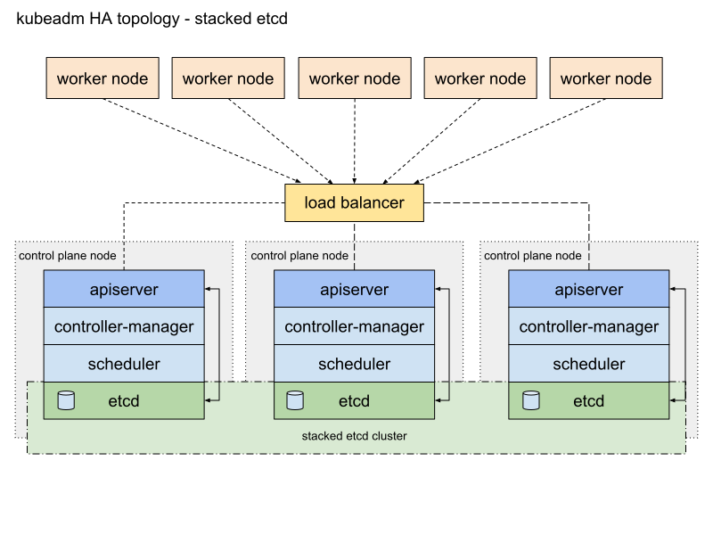
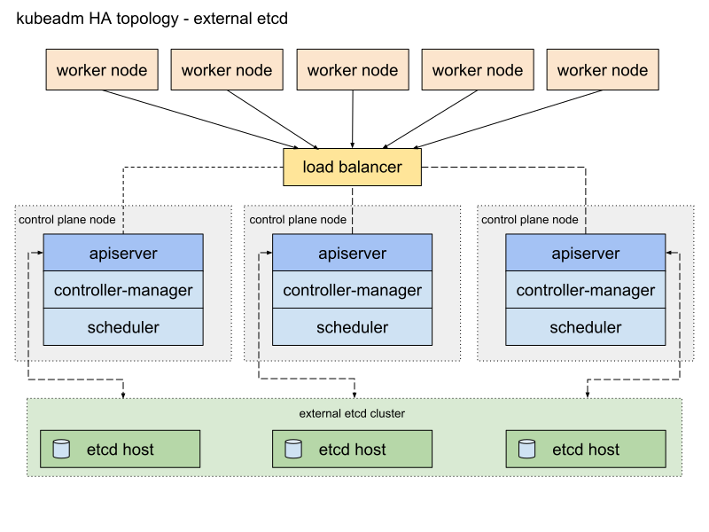
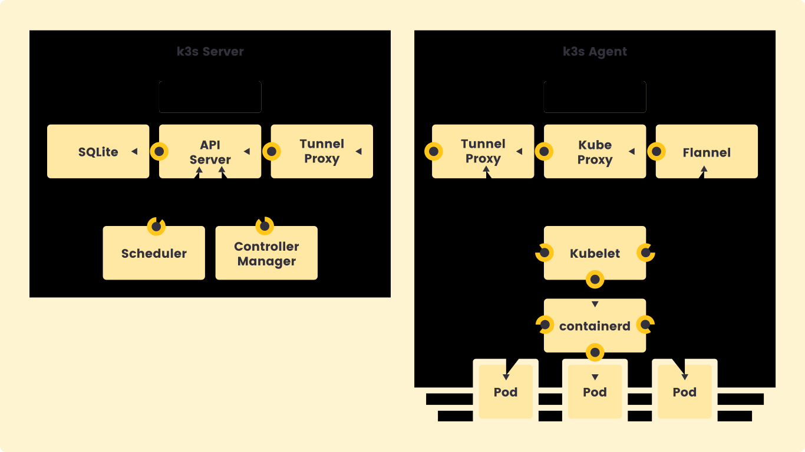

# 01 重新认识 Kubernetes 的核心组件

本篇我们开始介绍 Kubernetes 的核心组件，为了方便大家提前在脑中建立起完整的 Kubernetes 架构印象，笔者整理出核心组件的介绍如下：

- kube-apiserver，提供了 Kubernetes 各类资源对象（Pod、RC、Service 等）的增删改查及 watch 等 HTTP REST 接口，是整个系统的管理入口。
- kube-controller-manager，作为集群内部的管理控制中心，负责集群内的 Node、Pod 副本、服务端点（Endpoint）、命名空间（Namespace）、服务账号（ServiceAccount）、资源定额（ResourceQuota）等对象管理。
- kube-scheduler，集群调度器，提供了策略丰富，弹性拓扑能力。调度实现专注在业务可用性、性能和容量等能力上。
- kube-proxy，提供南北向流量负载和服务发现的反向代理。
- kubelet，是工作节点的管理 Pod 的控制程序，专门来调度启动 Pod 容器组。
- etcd，是集群数据集中存储的分布式键值服务，用来存储 Kubernetes 集群中所有数据和状态的数据库。
- cni-plugins，容器网络工作组维护的标准网络驱动如 fannel、ptp、host-local、portmap、tuning、vlan、sample、dhcp、ipvlan、macvlan、loopback、bridge 等网络插件供业务需求使用。这层 Overlay 网络只能包含一层，无法多层网络的互联互通。
- runc，运行单个容器的容器运行时进程，遵循 OCI（开放容器标准）。
- cri-o，容器运行时管理进程，类似 Docker 管理工具 containerd，国内业界普遍使用 containerd。

我们可以用如下一张架构设计图更能深刻理解和快速掌握 Kubernetes 的核心组件的布局：

通过以上的介绍，核心组件的基本知识就这么多。从最近几年落地 Kubernetes 云原生技术的用户反馈来看，大家仍然觉得这套系统太复杂，不太好管理，并且随时担心系统给业务带来致命性的影响。

那么 Kubernetes 的组件是为分布式系统设计的，为什么大家还是担心它会影响业务系统的稳定性呢？从笔者接触到的用户来讲，业界并没有统一的可以直接参考的解决方案。大家在落地过程中，只能去摸石头过河，一点一点总结经验并在迭代中不断地改进实施方案。因为业务规模的不同，Kubernetes 实施的架构也完全不同，你很难让基础设施的一致性在全部的商业企业 IT 环境中保持一致性。业务传播的都是最佳实践，在 A 用户这里可以行的通，不代表在 B 用户可以实施下去。

当然，除了客观的限制因素之外，我们应用 Kubernetes 的初衷是尽量的保持企业的 IT 基础设施的一致性，并随着企业业务需求的增长而弹性扩展。毕竟 Kubernetes 是谷歌基于内部 Borg 应用管理系统成功经验的基础之上开源的容器编排系统，它的发展积累了整个业界的经验精华，所以目前企业在做数字转型的阶段，都在无脑的切换到这套新的环境中，生怕技术落后影响了业务的发展。

本篇的目的是让大家从企业的角度更深刻的理解 Kubernetes 的组件，并能用好他们，所以笔者准备从一下几个角度来分析：

- 主控节点组件的使用策略
- 工作节点组件的使用策略
- 工作节点附加组件的使用策略

### 主控节点组件的使用策略

从刚接手维护 Kubernetes 集群的新用户角度考虑，一般第一步要做的就是遵循安装文档把集群搭建起来。世面上把集群安装的工具分为两类，

一类是学习用集群安装工具：

- Docker Desktop for Kubernetes
- Kind（Kubernetes IN Docker）
- Minikube
- MicroK8s

另一类是生产级别的安装工具：

- kubeadm
- kops
- kubespray
- Rancher Kubernetes Engine（RKE）
- K3s

其中 kubeadm 和 RKE 采用了容器组件的形式来安装 Kubernetes 集群。虽然采用系统容器来运行集群环境对主机系统的侵入性降低了，但运维的维护成本会线性增加。维护过容器应用的用户都会知道，容器技术主要是对运行进程的隔离，它并不是为系统进程设计的隔离工具，容器的生命周期都很短，随时可以失败。当容器进程出错的时候，隔离环境很难还原故障的环境。常用的办法就是通过重启容器来忽略故障，期望能快速排除故障。

但是往往这种潜在的小问题，就是让你很烦恼并对长时间无法重现感到烦恼。那么对于系统进程，Linux 是有对应的系统维护工具 Systemd 来维护的。它的生态足够完善，并能在多种 Linux 环境中保持行为一致。当出现问题的时候，运维可以直接登录主机快速排查系统日志来定位排错。根据这样的经验积累，笔者推荐生产环境还是采用原生进程的方式来维护 Kubernetes 的组件，让运维可以集中精力在集群架构上多做冗余优化。

接下来我们重新理解 etcd 集群的架构。根据 Kubernetes 官方文档的参考资料介绍，通常按照 etcd 集群的拓扑模型可以分为两类生产级别的 Kubernetes 集群。

栈式 etcd 集群拓扑：

独立式 etcd 集群拓扑：

参考上面的架构图，我们可以看到 etcd 集群的部署方式影响着 Kubernetes 集群的规模。在落地实践中因为采购的机器都是高性能大内存的刀片服务器，业务部门的期望是能充分的把这些资源利用上，并不期望用这些机器来跑集群控制管理组件。

当遇到这种情况，很多部署方案会采用第一种方案，是把主机节点、工作节点和 etcd 集群都放在一起复用资源。从高可用架构来讲，高度的应用密度集合并不能给用户带来无限制的好处。试想当出现节点宕机后这种架构的隐患是业务应用会受到极大的影响。所以通常的高可用架构经验是工作节点一定要和主控节点分开部署。在虚拟化混合环境下，主控节点可以使用小型的虚拟机来部署最为合适。当你的基础设施完全采用物理机的时候，直接使用物理机来部署主控节点是很浪费的，建议在现有物理机集群中先使用虚拟化软件虚拟化一批中小型虚拟机来提供管理节点的管理资源。开源的管理系统有 OpenStack，商业的方案是 VMware vSphere，按需求丰俭由人即可。

除了以上标准的部署解决方案，社区还提供了单机模式部署的 K3s 集群模式。把核心组件直接绑定为一个单体二进制文件，这样的好处就是这个系统进程只有一个，非常容易管理和恢复集群。在纯物理机环境，使用这种单点集群架构来部署应用，我们可以通过冗余部署多套集群的方式来支持应用的高可用和容灾。下图就是 K3s 的具体架构图：

K3s 本来是为嵌入式环境提供的精简 Kubernetes 集群，但是这个不妨碍我们在生产实践中灵活运用。K3s 提供的是原生 Kubernetes 的所有稳定版本 API 接口，在 x86 集群下可以发挥同样的编排容器业务的能力。

### 工作节点组件的使用策略

在工作节点上默认安装的组件是 kubelet 和 kube-proxy。在实际部署的过程中，kubelet 是有很多配置项需要调优的，这些参数会根据业务需求来调整，并不具备完全一样的配置方案。让我们再次认识一下 kubelet 组件，对于 kubelet，它是用来启动 Pod 的控制管理进程。虽然 kubelet 总体启动容器的工作流程，但是具体的操作它是依赖主机层面的容器引擎来管理的。对于依赖的容器引擎，我们可以选择的组件有 containerd、ori-o 等。Kubernetes 默认配置的组件是 cri-o。但是业界实际落地部署最多的还是 containerd，因为它的部署量巨大，很多潜在的问题都会被第一时间解决。containerd 是从 docker 引擎抽离出来的容器管理工具，用户具备长期的使用经验，这些经验对于运维和管理容器会带来很多潜在的使用信心。

对于容器实例的维护，我们常用的命令行工具是 Docker，在切换到 containerd 之后，命令行工具就切换为 ctr 和 crictl。很多时候用户无法搞清楚这两个工具的用处，并和 Docker 混为一谈。

Docker 可以理解为单机上运行容器的最全面的开发管理工具，这个不用多介绍，大家都了解。ctr 是 containerd 的客户端级别的命令行工具，主要的能力是管理运行中的容器。crictl 这个工具是管理 CRI 运行时环境的，在上图中是操作 cri-containerd 的组件。它的功能主要聚焦在 Pod 层面的镜像加载和运行。

还请大家注意下 Docker、ctr、crictl 三者细节实现上的差别。举个例子，Docker 和 ctr 确实都是管理主机层面的镜像和容器的，但是他们都有自己独立的管理目录，所以你即使是同样的加载镜像的操作，在主机存储的文件位置也是不同的，他们的镜像层无法复用。而 crictl 是操作 Pod 的，它并不是直接操作镜像的进程，一般把命令发送给对应的镜像管理程序，比如 containerd 进程。

另外一个组件是 kube-proxy，它是面向 Service 对象概念的南北向反向代理服务。通过对接 Endpoint 对象，可以按照均衡策略来负载流量。另外为了实现集群全局的服务发现机制，每一个服务都会定义全局唯一的名字，也就是 Service 的名字。这个名字可以通过附加的组件 coredns 来实现集群内的名字解析，也就是服务发现。对于流量的负载，Kubernetes 是通过 iptables 或 IPVS（IP Virtual Server）来实现。

在正常的集群规模下，Service 并不会超过 500 个，但是华为容器技术团队做了一个极限压测，发现了 iptables 在实现反向代理的时候出现的性能瓶颈。试验验证了，当 Service 增加到足够大的时候，Service 规则增加对于 iptables 是 O(n) 的复杂度，而切换到 IPVS 却是 O(1)。压测结果如下：

目前 Kubernetes 默认反向代理激活模块为 IPVS 模式，iptables 和 IPVS 都是基于 Linux 的子模块 netfilter，他们的相同点就是做反向代理，但是还是有以下 3 点区别需要知道：

- IPVS 提供大规模集群扩展性和高性能
- IPVS 提供更丰富的负载均衡算法（最小负载、最小链接数、基于局部性调度、加权轮叫等等）
- IPVS 支持服务器健康检查和网络重试机制

当 IPVS 在处理流量的 packet filtering、SNAT 和 masquerade 需求时，仍然需要使用 iptables 的扩展包工具 ipset 配置固定数量的转换规则，不会像 iptables 模式下随着服务和 Pod 的增加而线性写入规则导致系统的计算 CPU 负载加大，影响集群的处理能力。

以下表单是 IPVS 模式需要使用的 ipset 规则：

set name

members

usage

KUBE-CLUSTER-IP

All service IP + port

Mark-Masq for cases that `masquerade-all=true` or `clusterCIDR` specified

KUBE-LOOP-BACK

All service IP + port + IP

masquerade for solving hairpin purpose

KUBE-EXTERNAL-IP

service external IP + port

masquerade for packages to external IPs

KUBE-LOAD-BALANCER

load balancer ingress IP + port

masquerade for packages to load balancer type service

KUBE-LOAD-BALANCER-LOCAL

LB ingress IP + port with `externalTrafficPolicy=local`

accept packages to load balancer with `externalTrafficPolicy=local`

KUBE-LOAD-BALANCER-FW

load balancer ingress IP + port with `loadBalancerSourceRanges`

package filter for load balancer with `loadBalancerSourceRanges` specified

KUBE-LOAD-BALANCER-SOURCE-CIDR

load balancer ingress IP + port + source CIDR

package filter for load balancer with `loadBalancerSourceRanges` specified

KUBE-NODE-PORT-TCP

nodeport type service TCP port

masquerade for packets to nodePort(TCP)

KUBE-NODE-PORT-LOCAL-TCP

nodeport type service TCP port with `externalTrafficPolicy=local`

accept packages to nodeport service with `externalTrafficPolicy=local`

KUBE-NODE-PORT-UDP

nodeport type service UDP port

masquerade for packets to nodePort(UDP)

KUBE-NODE-PORT-LOCAL-UDP

nodeport type service UDP port with `externalTrafficPolicy=local`

accept packages to nodeport service with `externalTrafficPolicy=local`

另外，IPVS 模式会在以下场景下降级使用 iptables 模式：

- kube-proxy 启动的同时启用 `--masquerade-all=true`
- kube-proxy 启动时指定 Pod 层网段
- Load Balancer 类型的 Service
- NodePort 类型的 Service
- 配置了 externalIP 的 Service

### 工作节点附加组件的使用策略

提到附加的组件，一般常识是这些组件可有可无，锦上添花的能力而已。但是在 Kubernetes 集群中，这些附加组件是不得不安装的，不然整个集群就是一套鸡肋的展览品。Kubernetes 官方把这些附加组件分为以下五类：

- 网络和网络策略
- 服务发现
- 可视化管理
- 基础设施
- 遗留组件

大家看到标题，基本上就能理解这些组件的用处。我这里还是从实用的角度和大家一起重新认识一下这些组件，为之后的使用提供经验参考。

**1. 网络和网络策略** 对于网络，我们主要指容器网络。注意在 Kubernetes 集群里面，是有两层虚拟网络的。一说虚拟网络，就会有丢包率，这个是以往虚拟化环境不可想象的问题。为了提高或者说规避这方面的棘手问题，我们会放弃所有官方的方案，采用传统的网络方案来支持。当然传统的网络方案大都不是为 Kubernetes 网络设计的，需要做很多自定义适配工作来完善体验。在不理想的传统方案之外，容器网络方案中最流行的有 Calico、Cilium、Flannel、Contiv 等等。采用这些方案之后，随着业务流量的增加一定会带来网络丢包的情况。网络丢包带来的问题是业务处理能力的降低，为了恢复业务实例的处理能力，我们常规的操作是水平扩展容器实例数。注意，正是因为实例数的增加反而会提高业务处理能力，让运维人员忽略容器网络带来的性能损耗。另外，Kubernetes 在业务实践中还参考了主流网络管理的需求设计，引入了 Network Policies。这些策略定义了 Pod 之间的连通关系，方便对业务容器组的安全网络隔离。当然笔者在实践中发现，这些策略完全依赖容器网络的实现能力，依赖性强，只能作为试验品体验，但是在实际业务中，还没有看到实际的能力优势。**2. 服务发现** 目前提供的能力就是给 Pod 提供 DNS 服务，并引入了域名的定义规则。官方认可的只有 CoreDNS。注意 ，这个服务发现只能在集群内部使用。不推荐直接暴露给外部服务，集群对外暴露的服务仍然是 IP 和端口。外部 DNS 可以灵活的指定这个固定 IP 来让业务在全局服务发现。**3. 可视化管理** 官方提供了 Dashboard，这是官方提供的标准管理集群的 web 界面，很多开发集成测试环境，使用它就可以满足业务管理的需求。这个可选安装。**4. 基础设施** 官方提供了 KubeVirt，是可以让 Kubernetes 运行虚拟机的附加组件，默认运行在裸机群集上。从目前的实践经验来看，这种能力还属于试验性的能力，一般很少人使用。**5. 遗留组件**

对于很多老版本的 Kubernetes，有很多历史遗留的组件可以选用，所以官方把这些可选的组件都保留了下来，帮助用户在迁移集群版本的过程中可以继续发挥老集群的能力。一般很少人使用。

通过三个纬度的介绍，我相信大家对 Kubernetes 的核心组件有了更深入的理解。在生产实践中，为了标准化运维模型，我们对 Kubernetes 的组件可以按照业务需求定义一个基线模型，有选择的使用这些组件，相信一定可以规避很多兼容性的问题。在笔者遇到的大部分的 Kubernetes 集群故障案例中，大部分就是对组件的错用或者误用，让问题变的更复杂，更难以复现。

当然，云端的 Kubernetes 可以彻底解决基线的问题，我相信未来用户会越来越容易的使用到靠谱的 Kubernetes 集群环境。只是你一定要记住，我们只是把运维 Kubernetes 的难题交给专业的云服务开发者而已。
