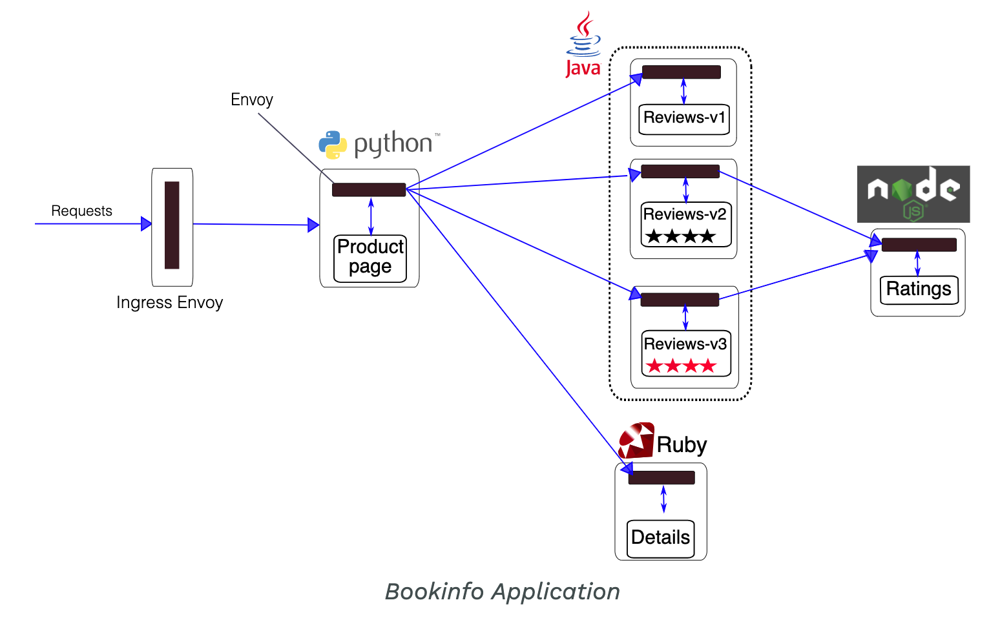
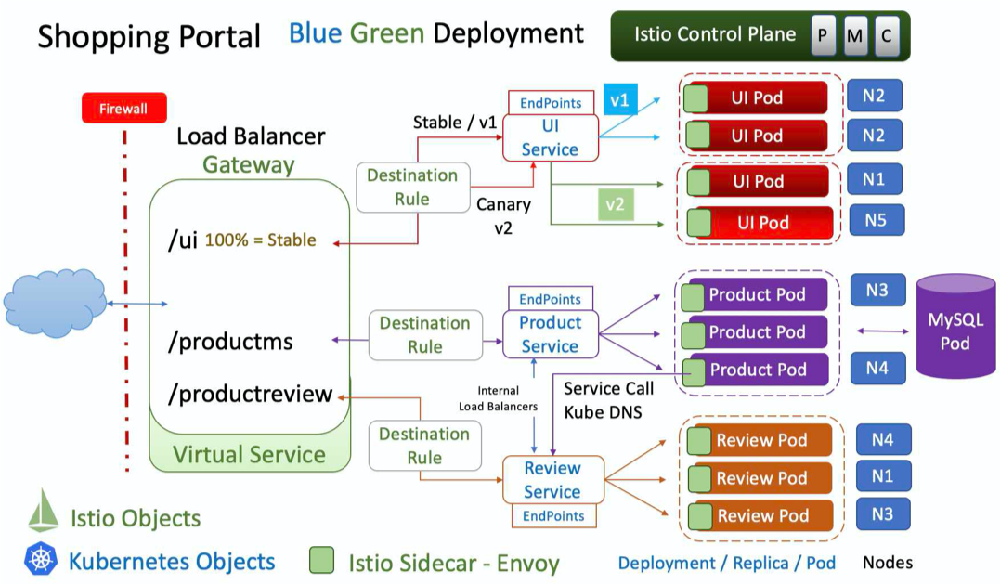
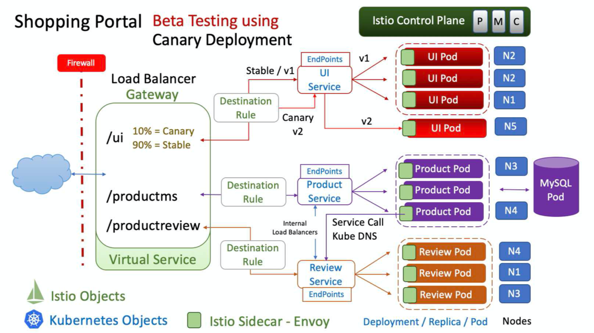
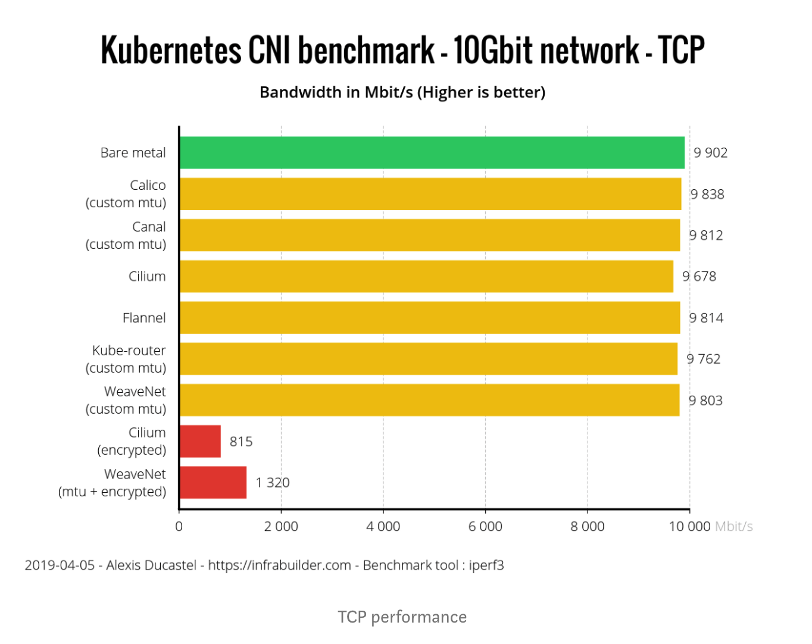

# 06 练习篇：K8s 核心实践知识掌握

经过前面章节的介绍，我们把 Kubernetes 的核心组件、应用编排落地 Kubernetes、DevOps 场景落地 Kubernetes、微服务场景落地 Kubernetes 等主要的知识点给大家讲解了一遍。考虑到读者从拿来知识的角度看总觉得浅，不如通过一篇实战讲解来熟练掌握 Kubernetes 的主要技术能力。

很多读者在安装高可用的 Kubernetes 的集群开始的时候就会遇到很多挫折，虽然网上可以参考的资料非常多，但真正容易上手并能完整提供连续性的项目还没有真正的官方推荐。虽然用户遇到碰壁后会很疼，但参考 CNCF 基金会提供的认证 Kubernetes 管理员的知识范围里面，安装集群的知识反而并不是重点，实际考察的是用 kubectl 这个命令行工具来把集群熟练用起来。这个知识误区放很多入门用户把精力放在了并不是最重要的知识点上。毕竟咱们业务场景中最重要的是解决知道如何使用，而不是探究它底层的技术实现。

切记，我们需要把主要精力放在 80% 的如何使用 Kubernetes 的知识面上更能带来业绩，20% 的底层技术实现相关的知识涉及面广需要慢慢体会和学习，并且和前面的 Kubernetes 的使用方面的知识也是相得映彰，不熟悉很难理解底层技术实现能带来的收益。

### 练习-1：使用命令行运行 Pod 容器

使用命令行工具 Kubectl 执行如下命令：

```bash
❯ kubectl run --image=nginx nginx-app
kubectl run --generator=deployment/apps.v1 is DEPRECATED and will be removed in a future version. Use kubectl run --generator=run-pod/v1 or kubectl create instead.
deployment.apps/nginx-app created
```

运行成功后，就要看看有没有运行起来，执行如下命令：

```bash
❯ kubectl get po -o wide
NAME                        READY   STATUS    RESTARTS   AGE     IP            NODE                                                 NOMINATED NODE   READINESS GATES
nginx-app-d65f68dd5-rv4wz   1/1     Running   0          3m41s   10.4.47.234   gke-us-central1-cloud-okteto-com-pro-a09dced8-jxp8   <none>           <none>
```

为了更清楚地理解 Pod 运行的过程，我们还经常会运行如下命令来查看：

```bash
❯ kubectl describe po nginx-app-d65
Name:               nginx-app-d65f68dd5-rv4wz
Namespace:          xiaods
Priority:           0    
PriorityClassName:  <none>
Node:               gke-us-central1-cloud-okteto-com-pro-a09dced8-jxp8/10.128.0.133
Start Time:         Sat, 02 May 2020 13:28:15 +0800     
Labels:             pod-template-hash=d65f68dd5
                    run=nginx-app
Annotations:        cni.projectcalico.org/podIP: 10.4.47.234/32
                    container.apparmor.security.beta.kubernetes.io/nginx-app: runtime/default
                    kubernetes.io/egress-bandwidth: 5M          
                    kubernetes.io/ingress-bandwidth: 5M           
                    kubernetes.io/limit-ranger: LimitRanger plugin set: cpu, memory request for container nginx-app; cpu, memory limit for container nginx-app
                    kubernetes.io/psp: cloud-okteto-enterprise-restrictive
                    seccomp.security.alpha.kubernetes.io/pod: runtime/default                                                                                                     
Status:             Running                                                                                                                                                       
IP:                 10.4.47.234                                                                                                                                                   Controlled By:      ReplicaSet/nginx-app-d65f68dd5
......省略若干代码......
Events:
  Type    Reason     Age    From                                                         Message
  ----    ------     ----   ----                                                         -------
  Normal  Scheduled  5m19s  default-scheduler                                            Successfully assigned xiaods/nginx-app-d65f68dd5-rv4wz to gke-us-central1-cloud-okteto-co
m-pro-a09dced8-jxp8
  Normal  Pulling    5m17s  kubelet, gke-us-central1-cloud-okteto-com-pro-a09dced8-jxp8  Pulling image "nginx"
  Normal  Pulled     5m17s  kubelet, gke-us-central1-cloud-okteto-com-pro-a09dced8-jxp8  Successfully pulled image "nginx"
  Normal  Created    5m17s  kubelet, gke-us-central1-cloud-okteto-com-pro-a09dced8-jxp8  Created container nginx-app
  Normal  Started    5m16s  kubelet, gke-us-central1-cloud-okteto-com-pro-a09dced8-jxp8  Started container nginx-app
```

如上面返回的结果中，Events 项的事件日志信息是我们快速定位 Pod 运行情况的最重要的信息，可以快速了解 Pod 生命周期的运行过程。

**作者建议：** kubectl 有很多命令参数很多，请务必参考 Kubernetes Docs 网站提供的 [Kubectl Cheat Sheet](https://kubernetes.io/docs/reference/kubectl/cheatsheet/)，正好可以作为练习题来熟练你需要的命令行技能。

### 练习-2：给组内每一位成员分配独立独有资源

配置安装完成 Kubernetes 集群后，系统会给我们提供一个 Kubeconfig 文件，里面默认配置了一个 cluster-admin 账号来全局管理所有集群资源，并且它是超级管理员权限。这个账号和集群直接是通过企业证书的认证方式来进入系统的，我们没办法像传统业务系统一样简单地更改密码来避免文件公用的安全分险，所以我们一般需要给每一位开发提供一个独立的账号和命名资源空间来隔离资源的使用。kubeconfig 文件一般配置如下：

```yaml
apiVersion: v1
kind: Config
preferences: {}
clusters:
- cluster:
  name: development
- cluster:
  name: scratch
users:
- name: developer
- name: experimenter
contexts:
- context:
  name: dev-frontend
- context:
  name: dev-storage
- context:
  name: exp-scratch
```

当我们要把一个用户加入配置，使用如下命令：

```bash
kubectl config --kubeconfig=config-demo set-credentials developer --client-certificate=fake-cert-file --client-key=fake-key-seefile
```

如果要删除用户，可以运行：

```plaintext
kubectl --kubeconfig=config-demo config unset users.<name>
```

当然，我们还要在集群里面给这个用户账号提供 RBAC 的配置，那个过程相当复杂，其实并不适合在实际工作中采用。既然这个配置繁琐，我们有没有现成的工具来帮助我们实现多用户的配置呢？答案是有的，它就是 Kiosk 多租户管理套件：

```bash
# 安装 Kiosk
# Install kiosk with helm v3
kubectl create namespace kiosk
helm install kiosk --repo https://charts.devspace.sh/ kiosk --namespace kiosk --atomic
$ kubectl get pod -n kiosk
NAME                     READY   STATUS    RESTARTS   AGE
kiosk-58887d6cf6-nm4qc   2/2     Running   0          1h
# 配置用户账号和权限
kubectl apply -f https://raw.githubusercontent.com/kiosk-sh/kiosk/master/examples/account.yaml
# View your own accounts as regular account user
kubectl get accounts --as=john
# View the details of one of your accounts as regular account user
kubectl get account johns-account -o yaml --as=john
```

特别注意 Kubernetes 提供了多种用户类型，常见的类型有： X509 证书用户和 Service Account Tokens。目前主流的用户管理方式倾向于可以动态生成 Token 的 ServiceAccount 模式：

```bash
USER_NAME="john"
kubectl -n kiosk create serviceaccount $USER_NAME
# 为 john 用户配置 kubeconfig 文件
KUBECONFIG_PATH="$HOME/.kube/config-kiosk"
kubectl config view --minify --raw >$KUBECONFIG_PATH
export KUBECONFIG=$KUBECONFIG_PATH
CURRENT_CONTEXT=$(kubectl config current-context)
kubectl config rename-context $CURRENT_CONTEXT kiosk-admin
CLUSTER_NAME=$(kubectl config view -o jsonpath="{.clusters[].name}")
ADMIN_USER=$(kubectl config view -o jsonpath="{.users[].name}")
SA_NAME=$(kubectl -n kiosk get serviceaccount $USER_NAME -o jsonpath="{.secrets[0].name}")
SA_TOKEN=$(kubectl -n kiosk get secret $SA_NAME -o jsonpath="{.data.token}" | base64 -d)
kubectl config set-credentials $USER_NAME --token=$SA_TOKEN
kubectl config set-context kiosk-user --cluster=$CLUSTER_NAME --user=$USER_NAME
kubectl config use-context kiosk-user
# Optional: delete admin context and user
kubectl config unset contexts.kiosk-admin
kubectl config unset users.$ADMIN_USER
export KUBECONFIG=""
# If not already set, then:
KUBECONFIG_PATH="$HOME/.kube/config-kiosk"
export KUBECONFIG=$KUBECONFIG_PATH
kubectl ...
```

**笔者建议** ：经过讲解相信读者对这一块会有一个更加深刻的理解。我们通过 Kiosk 间接简化了用户管理的运维成本，推荐使用。

### 练习-3：通过编排策略实现应用的灰度、蓝绿、回滚发布

当前学习 Kubernetes 的最主要的应用场景就是帮助企业建立更先进的应用发布平台，依托开源技术的创新能力让企业花费很少的研发投入就可以立即拥有主流大厂才能支持的应用灰度发布、蓝绿发布、回滚发布。

原生的 Kubernetes 支持单个应用容器 Pod 的滚动更新，借助这个能力，很多企业实现了类似的灰度、蓝绿发布的能力。但是往往在回顾实现效果上又感觉路数不对。是的，Kubernetes 本身并没有支持应用层的集群系统的灰度、蓝绿等高级发布特性的能力，所以这种改造是没有走对路线。

在最新的 Kubernetes 中已经引入了 Ingress 对象，它提供七层南北向流量的引流服务，目前默认常见的组件是用 NGINX Ingress Controller + Nginx 来支撑。由于 Nginx 支持在流量请求中加入 Header 标签，所以让我们可以完美支持业务的入口流量灰度发布。以下是 Nginx Ingress 对灰度发布的注解：

```plaintext
nginx.ingress.kubernetes.io/canary    "true" or "false"
nginx.ingress.kubernetes.io/canary-by-header    string
nginx.ingress.kubernetes.io/canary-by-header-value    string
nginx.ingress.kubernetes.io/canary-by-header-pattern    string
nginx.ingress.kubernetes.io/canary-by-cookie    string
nginx.ingress.kubernetes.io/canary-weight    number
```

基于 Request Header 的流量切分，部分注解的详解如下。

```plaintext
nginx.ingress.kubernetes.io/canary-by-header
```

用于通知 Ingress 将请求路由到 Canary Ingress 中指定的服务的 Header。当请求 Header 设置为 always 时，它将被路由到 Canary。当 Header 设置为 never 时，它将永远不会被路由到 Canary。对于其他值将忽略此请求 Header，并通过优先级将请求与其他 Canary 规则进行比较。

```plaintext
nginx.ingress.kubernetes.io/canary-by-header-value
```

要匹配的 Header 值，用于通知 Ingress 将请求路由到 Canary Ingress 中指定的服务。当请求 Header 设置为此值时，它将被路由到 Canary。对于其他 Header 值将被忽略，并且请求值会与其他 Canary 规则的优先级进行比较。此注解必须与 canary-by-header 一起使用。

```plaintext
nginx.ingress.kubernetes.io/canary-by-header
```

注解允许自定义 Header 值而不是使用程序自定义 Header 来控制流量。如果 `nginx.ingress.kubernetes.io/canary-by-header` 注解未定义则没有任何效果。

完整示例如下：

```yaml
---
apiVersion: extensions/v1beta1
kind: Ingress
metadata:
  annotations:
    nginx.ingress.kubernetes.io/canary: "true"
    nginx.ingress.kubernetes.io/canary-by-header: "new"
    nginx.ingress.kubernetes.io/canary-by-header-value："xxx"
  labels:
    app: demo
  name: demo-ingress
  namespace: demo-canary
spec:
  rules:
  - host: canary.example.com
    http:
      paths:
      - backend:
          serviceName: demo-canary
          servicePort: 80
        path: /
```

这样的灰度发布效果应用场景是有限的，往往企业内部的应用发布的时候包含十几二十个组件，这些组建直接还有很多网关进行细分，如何有效给细分组件的流量管理才是现在的迫切需求。这种流量策略按照当前的架构方向，是在往微服务网格方向发展，比较出名的开源框架就是 Istio。笔者认为使用服务网格来实现应用的流量观测和引导才更具弹性。

一谈到 Istio，相信大家一定部署过 Bookinfo 项目，其中最体现业务价值的就是业务流量的标记和切换：



Istio 通过控制 Header 实现蓝绿示例：



Istio 通过更改 Header 值实现灰度发布示例：

 **笔者建议** ：使用服务网格来实现应用流量的切换是比较自然的设计实现方式，它所依赖的底层技术确实就是 Kubernetes 的经典滚动更新技术。但是比原生 Kubernetes 更好的地方是，服务网格在通过 Header 引导流量的特性中，还加入了熔断、黑名单、限流等更高级的应用保障特性，值得使用。

### 练习-4：配置合理的网络方案并让流量数据可视化

应用在部署到 Kubernetes 集群后，我们最急手的需求就是业务数据的可视化。当前，仍然有很多用户在纠结使用哪种网络方案是最好的，从笔者来看，这个选型是需要依据你的硬件网络基础设施来决定的。并且当前主流的容器网络插件的损耗非常接近原生网络，早期用户网络的糟糕体验已经一去不复返。

容器技术的能力提升完全依赖 Kernel 内核的技术能力，容器网络也包括在内。在最近的 Kernel 4.9 中开始引入了扩展 Berkeley Packet Filtering（eBPF）特性使得用户空间的各个点上附加自定义程序，包括（sockets、trace points、packet reception），用于接收和处理数据。它实现网络安全策略和可视化的利器，参考开源可观测项目 Hubble 让大家体会下它的能力：


此可观测项目来源自主流原生容器网络 **Cilium** 提供支持。这里介绍它，是因为它选择使用 eBPF 技术来实现容器网络流量的转发，直接代替了 iptables。它是能和 **Calico** 容器网络相提并论开源项目。你一定关心对比，这里引用网上的一份对比参考：

> [https://itnext.io/benchmark-results-of-kubernetes-network-plugins-cni-over-10gbit-s-network-updated-april-2019-4a9886efe9c4](https://itnext.io/benchmark-results-of-kubernetes-network-plugins-cni-over-10gbit-s-network-updated-april-2019-4a9886efe9c4)

可以看到性能差不不大：

 **笔者建议** ：当前容器网络的选择并没有像以前那样纠结了。任意一种网络方案都是可以覆盖大部分业务需求的。但是当前新型的容器网络方案例如 Cilium 开始提供除了网络连通性之外的更多友好特性，比如多集群网络、替换 Kubeproxy、数据可视化等。值得你关注和体验。

### 练习-5：善用官方文档，善用工具来解决问题

Kubernetes 大版本基本上 3 个月就会更新一次，如果让我们天天泡在阅读各种文档资料的话，我相信一定会让很多人头脑大爆炸。为了解决业务应用的发布问题，Kubernetes 的源头信息必要保证最新、最全、最权威。这里，笔者再次强调，官方的社区文档站点（[https://kubernetes.io/docs](https://kubernetes.io/docs)）就是最新、最全、最权威的参考资料了。不要在到别处求证，官方的文档都是经过全球开发者的阅读和监督，比其它转载的要及时可靠。

另外，Kubernetes 是云原生计算基金会（CNCF）的技术蓝图中了一个组件，当你遇到技术难题时，请第一时间参考 CNCF 的技术蓝图找点灵感：

> [https://landscape.cncf.io/](https://landscape.cncf.io/)

相信你一定可以获得满意的架构建议和方案。 **笔者建议** ：遇到概念问题不清楚，请到 [https://kubernetes.io/docs](https://kubernetes.io/docs) 搜索获取最新的资料。遇到技术架构的问题，请到 [https://landscape.cncf.io/](https://landscape.cncf.io/) 参考云原生的技术架构蓝图，相信也可以找到线索。

### 总结

作为笔者，一路练习实践走过来，我发现企业在应用容器上的惧怕就真实存在的。为了克服恐惧，你需要多在本地演练和验证技术细节的可行性。因为各个企业的硬件基础设施不一样，请不要无脑照办业界大厂的落地 Kubernetes 的成功经验。从实际需求出发，按照自己公司的业务场景来实践才是目的，做一次真正的架构师主人。
