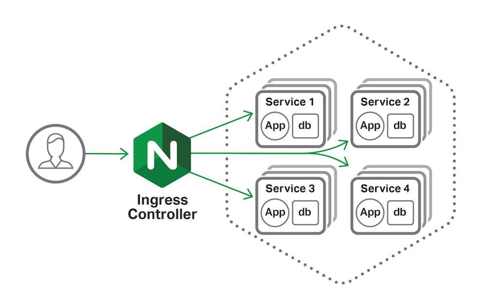

# 15 Service 层引流技术实践

Kubernetes 引入的 Service 层给集群带来了两样特性：第一是 ClusterIP，通过集群 DNS 分配的服务别名，服务可以获得一个稳定的服务名字，例如：foo.bar.svc.cluster.local。第二是反向代理，通过 iptables/IPVS/eBPF 等各种网络数据转换技术把流量负载到上游的 Pod 容器组中。到这里，其实 Service 层的基本技术已经给大家介绍了，但是从实践的角度再次分析，发现其中还有很多最新的进展需要给大家讲解以下，并从中我们能总结出技术发展过程中如何优化的策略总结。

### Ingress 的误解？

在社区文档中介绍的 Ingress 资源，我们知道它是应对 HTTP(S) Web 流量引入到集群的场景创建的资源对象。一般介绍中我们会说它不支持 L4 层的引流。如果想支持其它网络协议，最好用 Service 的另外两种形式 `ServiceType=NodePort` 或者 `ServiceType=LoadBalancer` 模式来支持。

首先，Ingress 资源对象能不能支持 L4 层，并不是完全由这个资源对象能把控，真正承载引流能力的是独立部署的 Ingress-Nginx 实例，也就是 Nginx 才能决定。我们知道 Nginx 本身就是支持 L4 层的。所以，Ingress 通过变相增加参数的方式可以提供支持：

```yaml
apiVersion: v1
kind: ConfigMap
metadata:
  name: tcp-services
  namespace: default
data:
  27017: "default/tcp-svc:27017"
---
apiVersion: flux.weave.works/v1beta1
kind: HelmRelease
metadata:
  name: nginx-ingress
  namespace: default
spec:
  releaseName: nginx-ingress
  chart:
    repository: https://kubernetes-charts.storage.googleapis.com 
    name: nginx-ingress
    version: 1.6.10
  values:
    tcp:
      27017: "default/tcp-svc:27017"
```

同理，UDP 协议也可以支持，在此不再赘述。从实践角度来讲，这种依赖 Nginx 的在其它 Ingress 控制器中会有不同的支持，你需要详细查阅开发文档来确认。

另外，Ingress-Nginx 在介绍中都是直接通过 Service 来把流量负载均衡到 Pod 容器组，连很多架构图都是这么画的：



在工程代码实现上默认 Ingress-Nginx 是不经过 Service，也不经过 kube-proxy 访问 Pod，而且通过 Service 找到对应的 Endpoint，然后直接把请求分发到对应的 Pod IP 和端口。这样做的目的是规避了 Service 这层的 DNAT 转换，缺点就是没有了反向代理能力，接入流量服务也不是高可用的 SLA。为了能把 Service 这层反向代理能力重新启用，可以加入注解参数：

```plaintext
nginx.ingress.kubernetes.io/service-upstream: "true"
```

通过这个注解特性，就可以让 Nginx 直接使用上游的 Service ClusterIP 作为上游入口。这种特性的增强有很多，如果你有兴趣，可以多到[注解特性的清单](https://kubernetes.github.io/ingress-nginx/user-guide/nginx-configuration/annotations/)这里查阅。另外，如果你是 Golang 程序员，还能扩展新注解参数并不断的给 Nginx 加入新特性，请参考[案例入门](https://medium.com/better-programming/creating-a-custom-annotation-for-the-kubernetes-ingress-nginx-controller-444e9d486192)，这里不再赘述。

### Service 的误解？

在社区文档中描述 Pod 发布到集群中，明确说是无法直接对外提供服务的。所以才引入了 Service 资源对象来暴露服务。但是随着实践案例的增加，Pod 也是可以直接绑定主机端口的，请看如下案例：

```yaml
apiVersion: v1
kind: Pod
metadata:
  name: nginx
spec:
  hostNetwork: true
  dnsPolicy: ClusterFirstWithHostNet
  containers:
    - name: nginx
      image: nginx
      ports:
        - containerPort: 8080
```

对于以 hostNetwork 方式运行的 Pod 需要显式设置其 DNS 策略 ClusterFirstWithHostNet，只有这样 Pod 才会走集群 DNS 查询服务。这个范例也提醒了我们 Service IP 并不是唯一引流的方案，一定要结合实际场景来应用 Kubernetes 的特性。

接下来我们在来刨析下 Service IP，它是由 iptables 创建的虚拟 IP 地址。根据 iptables 定义规则，统称这类 IP 为 DNAT 模式：


通过 kube-proxy 生成的 iptables 规则（最新版本采用 IPVS 模块生成代理规则，这里不在赘述，原理类似），每当一个数据包的目的地是服务 IP 时，它就会被 DNAT 化（DNAT = 目的地网络地址转换），也就是说目的地 IP 从服务 IP 变成了 iptables 随机选择的一个端点 Pod IP。这样可以保证负载流量可以在后端 Pod 中均匀分布。当 DNAT 发生时，这些信息会被存储在 conntrack 即 Linux 连接跟踪表中（存储 5 元组数据记录集：协议、srcIP、srcPort、dstIP、dstPort）。当数据回复回来的时候，就可以取消 DNAT，也就是把源 IP 从 Pod IP 改成 Service IP。这样一来，客户端就不需要知道后面的数据包流是如何处理的。


对于从 Pod 发起并出站的数据流量，也是需要 NAT 转换的。一般来说，节点可以同时拥有私有虚拟 IP 和公有 IP。在节点与外部 IP 的正常通信中，对于出站数据包，源 IP 由节点的私有虚拟 IP 变为其公有 IP，对于入站数据包的回复则反过来。但是当连接到外部 IP 是由 Pod 发起时，源 IP 是 Pod 的 IP，kube-proxy 会多加一些 iptables 规则，做 SNAT（Source Network Address Translation）也就是 IP MASQUERADE。SNAT 规则告诉内核出站数据包需要使用节点的外网 IP 来代替源 Pod 的 IP。系统还需要保留一个 conntrack 条目来解除 SNAT 的回复。

注意这里的性能问题，由于集群容器规模的增加，conntrack 会暴增，后由华为容器团队引入的 IPVS 方案也是在做大规模容器负载的压测中发现这个瓶颈，并提出引入 IPVS 来解决这个问题。在笔者实际应用中发现，iptables 方案在小规模集群场景下性能和 IPVS 持平，所以 IPVS 方案从本质上来讲还只是一个临时方案，它只解决了入站流量数据包的 DNAT 转换，SNAT 转换还是需要 iptables 来维护。去 iptables 化相信在不久的将来会被 eBPF 技术取代，并最终实现最优的流量引流设计方案。

### Ingress 的高级策略

Ingress 引入后，它的用途在被不断扩大，这里我总结下可能的应用案例，期望在需要的时候可以快速应用。

**Ingress 规则汇聚能力案例** 

```plaintext
apiVersion: extensions/v1beta1

kind: Ingress

metadata:

name: <ingress-name>

spec:

rules:

- host: <yourchoice1>.<cluster-id>.k8s.gigantic.io

  http:
```

paths:

```plaintext
- path: /
```

backend:
      serviceName: <service1-name>
      servicePort: <service1-port>

```plaintext
- host: <yourchoice2>.<cluster-id>.k8s.gigantic.io

  http:
```

paths:

```plaintext
- path: /
```

backend:
      serviceName: <service2-name>
      servicePort: <service2-port>

```plaintext
` **请求地址分流案例** `
apiVersion: extensions/v1beta1

kind: Ingress

metadata:

name: <ingress-name>

spec:

rules:

- host: <yourchoice>.<cluster-id>.k8s.gigantic.io

  http:
```

paths:

```plaintext
- path: /foo
```

backend:
      serviceName: <service1-name>
      servicePort: <service1-port>

```plaintext
- path: /bar
```

backend:
      serviceName: <service2-name>
      servicePort: <service2-port>

```plaintext
` **SSL 直通案例** `
apiVersion: extensions/v1beta1

kind: Ingress

metadata:

name: <ingress-name>

annotations:
```

nginx.ingress.kubernetes.io/ssl-passthrough: "true"

```plaintext
spec:

tls:

- hosts:

  - <yourchoice>.<cluster-id>.k8s.gigantic.io

  rules:

- host: <yourchoice>.<cluster-id>.k8s.gigantic.io

  http:
```

paths:

```plaintext
- path: /
```

backend:
      serviceName: <service-name>
      servicePort: <service-port>

```plaintext
` **SSL 终结案例** `
apiVersion: v1

kind: Secret

type: kubernetes.io/tls

metadata:

name: mytlssecret

data:

tls.crt: <base64 encoded cert>

tls.key: <base64 encoded key>

______________________________________________________________________

apiVersion: extensions/v1beta1

kind: Ingress

metadata:

name: <ingress-name>

spec:

tls:

- hosts:

  - <yourchoice>.<cluster-id>.k8s.gigantic.io

    secretName: mytlssecret

  rules:

- host: <yourchoice>.<cluster-id>.k8s.gigantic.io

  http:
```

paths:

```plaintext
- path: /
```

backend:
      serviceName: <service-name>
      servicePort: <service-port>

```plaintext
``` **CORS 跨站请求案例** 要在 Ingress 规则中启用跨源资源共享（CORS），请添加注释：
```

ingress.kubernetes.io/enable-cors: "true"

` **重写路由地址案例** `
apiVersion: extensions/v1beta1

kind: Ingress

metadata:

name: <ingress-name>

annotations:

```plaintext
nginx.ingress.kubernetes.io/rewrite-target: /
```

spec:

rules:

- host: <yourchoice>.<cluster-id>.k8s.gigantic.io

  http:

```plaintext
  paths:
```

- path: /foo

```plaintext
    backend:
      serviceName: <service-name>
      servicePort: <service1port>
```

` **请求流量限制案例** `
nginx.ingress.kubernetes.io/limit-connections：一个 IP 地址允许的并发连接数

nginx.ingress.kubernetes.io/limit-rps：每秒从给定 IP 接受的连接数

```plaintext
在一个 Ingress 规则中同时指定这两个注解，limit-rps 优先。 **后端支持接入 SSL 案例** 默认情况下，Nginx 使用 HTTP 来到达服务。在 Ingress 规则中添加注解：
```

nginx.ingress.kubernetes.io/secure-backends: "true"

```plaintext
在 Ingress 规则中把协议改为 HTTPS。 **白名单案例** 你可以通过：
```

nginx.ingress.kubernetes.io/whitelist-source-range

```plaintext
注解来指定允许的客户端 IP 源范围，该值是一个逗号分隔的 CIDRs 列表，例如 10.0.0.0/24,172.10.0.1。 **Session Affinity 和 Cookie affinity** 注解：
```

nginx.ingress.kubernetes.io/affinity

```plaintext
在 Ingress 的所有上行中启用并设置亲和力类型。这样一来，请求将始终被指向同一个上游服务节点。
如果你使用 cookie 类型，你也可以用注解：
```

nginx.ingress.kubernetes.io/session-cookie-name

```plaintext
来指定用于路由请求的 cookie 的名称。默认情况下是创建一个名为 route 的 cookie。
```

annotation nginx.ingress.kubernetes.io/session-cookie-hash

```plaintext
定义了将使用哪种算法对使用的上游进行哈希。默认值是 MD5，可能的值是 MD5、SHA1 和 Index。Index 选项不进行哈希，而是使用内存中的索引，它更快，开销更短。
注意此 Index 和上游服务节点列表的匹配规则是不一致的。因此在服务重新加载时，如果上游服务节点 Pod 发生了变化，索引值不能保证与之前的服务节点 Pod 一致。请谨慎使用，只有在需要的情况下才使用此 index 算法。
### 总结
Service 层接入引流技术，主要的能力就是需要把流量准确无误的引入到服务 Pod 中，当我们需要弹性、高可用时，只能通过增加一层服务反向代理的冗余设计才能保证流量引入的可靠性。这种冗余设计有三种选择：Ingress、NodePort、LoadBalancer，目前看三种选择都无法能适应所有业务场景，鉴于对 Ingress 已经在 1.19 最新版本中升级到 GA，从引入流量的规范性角度，首选还是 Ingress，因为它的 ingress-controller 能力通过注解可以无限放大，笔者预测在未来的发展趋势下，Service 能力会被 Ingress 接管，大家再也不用操心 NodePort 了。
```

