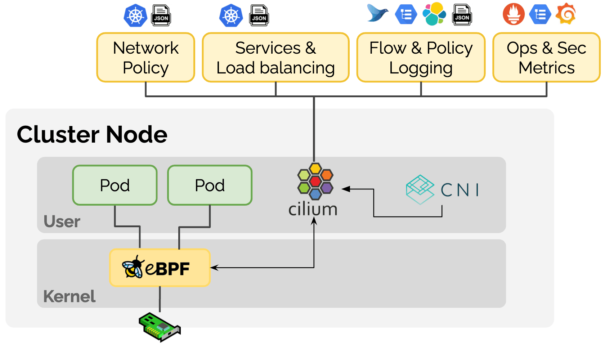
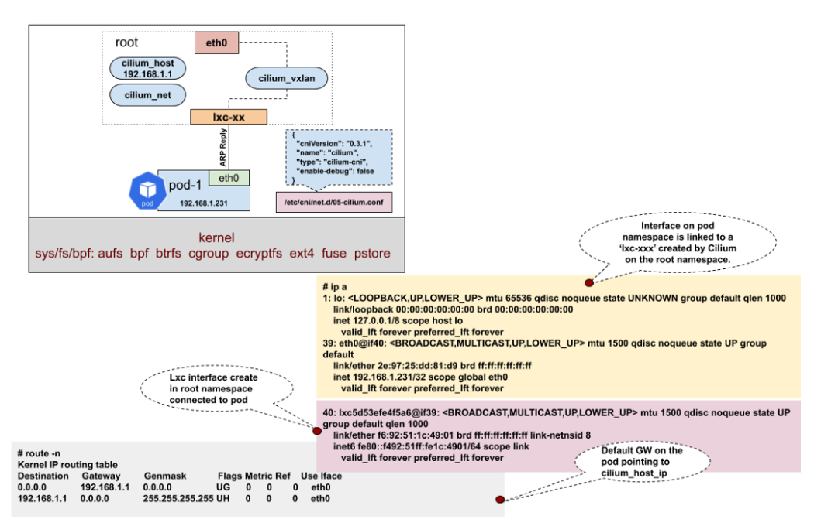
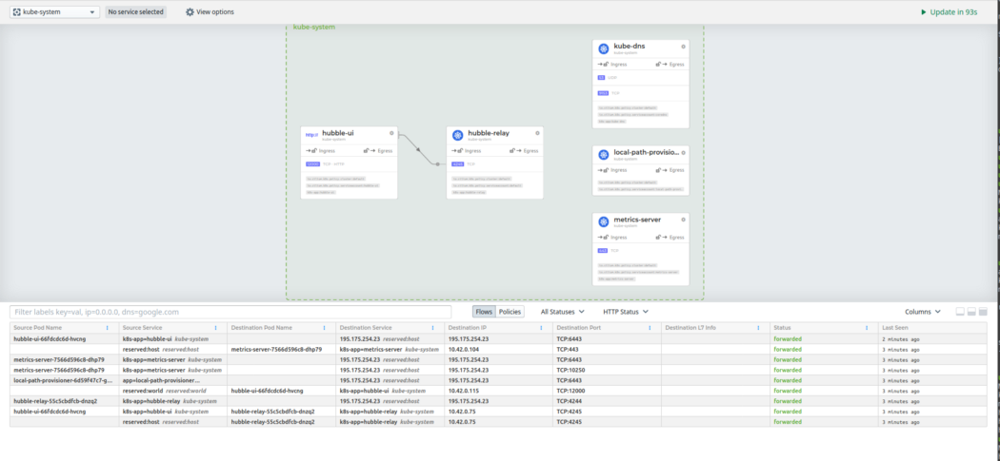

# 16 Cilium 容器网络的落地实践

随着越来越多的企业采用 Kubernetes，围绕多云、安全、可见性和可扩展性等新要求，可编程数据平面的需求用例范围越来越广。此外，服务网格和无服务器等新技术对 Kubernetes 底层提出了更多的定制化要求。这些新需求都有一些共同点：它们需要一个更可编程的数据平面，能够在不牺牲性能的情况下执行 Kubernetes 感知的网络数据操作。

Cilium 项目通过引入扩展的伯克利数据包过滤器（eBPF）技术，在 Linux 内核内向网络栈暴露了可编程的钩子。使得网格数据包不需要在用户和内核空间之间来回切换就可以通过上下文快速进行数据交换操作。这是一种新型的网络范式，它也是 Cilium 容器网络项目的核心思想。



### 为什么需要落地 Cilium 容器网络？

Kubernetes 的容器网络方案发展至今，一直是百家争鸣，各有特色。之前因为 CNI 网络方案不成熟，大家用起来都是战战兢兢，时刻提防容器网络给业务带来不可接受的效果，随即就把容器网络替换成主机网络。随着时间的磨砺，当前主流的容器网络方案如 Calico 等已经经历成百上千次生产环境的应用考验，大部分场景下都可以达到用户可以接受的网络性能指标。因为成功经验开始增多，用户也开始大规模启用容器网络的上线了。随着业务流量的引入越来越大，用户对 Kubernetes 网络的认知也趋于一致。大致分为两大类，一类是 Cluster IP，是一层反向代理的虚拟网络；一类是 Pod IP，是容器间交互数据的网络数据平面。对于反向代理虚拟网络的技术实现，早期 kube-proxy 是采用 iptables，后来引入 IPVS 也解决了大规模容器集群的网络编排的性能问题。这样的实现结构你从顶端俯瞰会明显感知到 Kubernetes 网络数据平台非常零散，并没有实现一套体系的网络策略编排和隔离。显然，这样的技术结构也无法引入数据可视化能力。这也是 Istio 服务网格引入后，通过增加 envoy sidecar 来实现网络流量可视化带来了机会。但是这种附加的边界网关毕竟又对流量增加了一层反向代理，让网络性能更慢了。Cilium 原生通过 eBPF 编排网络数据，让可视化更简单。

Cilium 还有一个强项就是通过 eBPF 是可以自定义隔离策略的，这样就可以在非信任的主机环境编排更多的容器网络隔离成多租户环境，让用户不在担心数据的泄露，可以更专注在数据业务的连通性上。因为 eBPF 的可编程性，我们还能依据业务需求，增加各种定制化插件，让数据平台可以更加灵活安全。

### Cilium CNI 实现

Cilium Agent、Cilium CLI Client 和 CNI Plugin 运行在集群中的每一个节点上（以守护进程的形式部署）。Cilium CNI 插件执行所有与网络管道有关的任务，如创建链接设备（veth 对），为容器分配 IP，配置 IP 地址，路由表，sysctl 参数等。Cilium Agent 编译 BPF 程序，并使内核在网络栈的关键点上运行这些程序。

Cilium 提供两种联网模式：

- 叠加网络（）Overlay）模式：Cilium 默认的网络模式。集群中的所有节点为一个网状的隧道，使用基于 udp 的封装协议。VXLAN（默认）或 Geneve （通用网络虚拟化封装）。在这种模式下，Cilium 可以自动形成一个覆盖网络，无需用户使用 kube-controller-manager 中的 `--allocate-node-cidrs` 选项进行任何配置。
- 直接/本地路由模式：在这个配置中，Cilium 会把所有不针对另一个本地端点的数据包交给 linux 内核的路由子系统。这个设置需要一个额外的路由守护程序，如 Bird、Quagga、BGPD、Zebra 等，通过节点的 IP 向所有其他节点公布非本地节点分配的前缀。与 VxLAN 叠加相比，BGP 方案具有更好的性能，更重要的是，它使容器 IP 可路由化，无需任何额外的网状配置。

Cilium 在主机网络空间上创建了三个虚拟接口：cilium_host、cilium_net 和 cilium_vxlan。Cilium Agent 在启动时创建一个名为“cilium_host -> cilium_net”的 veth 对，并将 CIDR 的第一个 IP 地址设置为 cilium_host，然后作为 CIDR 的网关。CNI 插件会生成 BPF 规则，编译后注入内核，以解决 veth 对之间的连通问题。数据链路参考如下：



### 落地安装实践

因为 Cilium 对内核要求很高，本来我以为需要采用 Ubuntu 才可以安装，后来查阅文档发现，只要是 CentOS 7.x 之后就可以支持。安装步骤如下。

1. 先挂载 bpf 模块：

```plaintext
sudo mount bpffs -t bpf /sys/fs/bpf
```

2. 修改 /etc/fstab 文件，在最后面加入如下配置：

```plaintext
bpffs                  /sys/fs/bpf             bpf     defaults 0 0
```

3. 安装一套干净的 Kubernetes 系统，这里我采用 K3s 快速搭建：

```plaintext
export MASTER_IP=$(ip a |grep global | grep -v '10.0.2.15' | awk '{print $2}' | cut -f1 -d '/')
curl -sfL https://get.k3s.io | INSTALL_K3S_EXEC="--flannel-backend=none --no-flannel --node-ip=${MASTER_IP} --node-external-ip=${MASTER_IP} --bind-address=${MASTER_IP} --no-deploy servicelb --no-deploy traefik" sh -
```

4. 在这之后，当你运行以下命令，你应该看到 local-path，metrics-server 和 coredns pods 处于 Pending 状态。这是正常的。

```plaintext
[[email protected] ~]# kubectl get po -n kube-system
NAME                                     READY   STATUS    RESTARTS   AGE
coredns-7944c66d8d-xn96v                 0/1     Pending   0          3m2s
local-path-provisioner-6d59f47c7-77bfz   0/1     Pending   0          3m2s
metrics-server-7566d596c8-8bhrq          0/1     Pending   0          3m2s
```

5. 安装 helm3：

```plaintext
sudo wget — no-check-certificate https://get.helm.sh/helm-v3.2.4-linux-amd64.tar.gz
sudo tar -zxvf helm-v3.2.4-linux-amd64.tar.gz
sudo mv linux-amd64/helm /usr/local/bin/helm
```

6. 安装 Cilium 套件：

```bash
# sudo helm repo add cilium https://helm.cilium.io/
# sudo helm install cilium cilium/cilium --set global.device=eth0 --set global.tag="v1.8.1" \
--set global.containerRuntime.integration="containerd" \
--set global.containerRuntime.socketPath="/var/run/k3s/containerd/containerd.sock" \
--set global.kubeProxyReplacement="strict" \
--set global.hubble.enabled="true" \
--set global.hubble.listenAddress=":4244" \
--set global.hubble.metrics.enabled="{dns,drop,tcp,flow,port-distribution,icmp,http}" \
--set global.hubble.relay.enabled="true" \
--set global.hubble.ui.enabled="true" \
--kubeconfig /etc/rancher/k3s/k3s.yaml --namespace kube-system
NAME: cilium
LAST DEPLOYED: Fri Oct  9 19:53:59 2020
NAMESPACE: kube-system
STATUS: deployed
REVISION: 1
TEST SUITE: None
NOTES:
You have successfully installed Cilium with Hubble Relay and Hubble UI.
Your release version is 1.8.4.
For any further help, visit https://docs.cilium.io/en/v1.8/gettinghelp
```

7. 去掉 IPAM 特性：

```plaintext
kubectl edit configmap cilium-config -n kube-system
### 把以下配置去掉
  ipam: cluster-pool
  k8s-require-ipv4-pod-cidr: "true"
  k8s-require-ipv6-pod-cidr: "false"
```

稍等片刻，就可以看到 Cilium 相关的容器都启动起来了。Cilium 容器网络配置成功。

8. 修改 Hubble UI 控制台服务为 NodePort 模式：

```plaintext
sudo kubectl edit svc hubble-ui -n kube-system
sudo kubectl get svc hubble-ui -n kube-system
```

然后就可以查看可视化数据平台，如下图：



### 经验总结

Cilium 网络方案从实际体验来看，已经可以满足常规容器网络需求。它的可视化控制台 Hubble 是对数据平面可视化的最原生实现，比 Istio 的方案显然要技高一筹。数据可视化这块让笔者有点意外，没有想到 eBPF 的编程能力可以这么强，为之后更多的插件功能带来更多期待。因为 cilium 技术太新，按照实践经验，笔者推荐大家在开发测试环境可以大胆使用起来，生产环境还要再等等，我相信在经过半年的磨砺，Cilium 应该会成为 Kubernetes 社区使用最多的容器网络方案。
