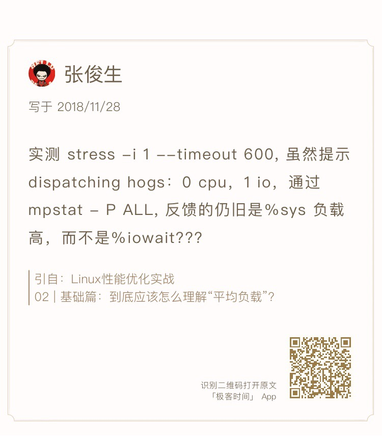
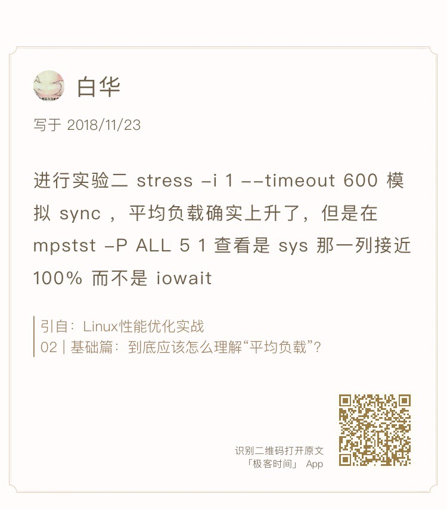
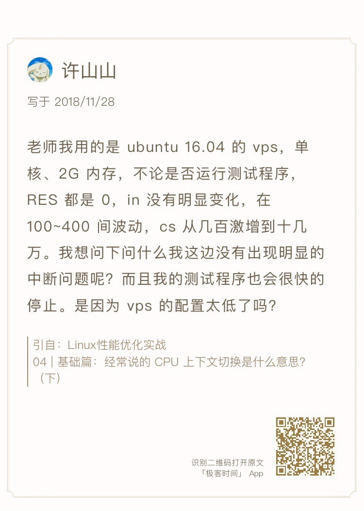
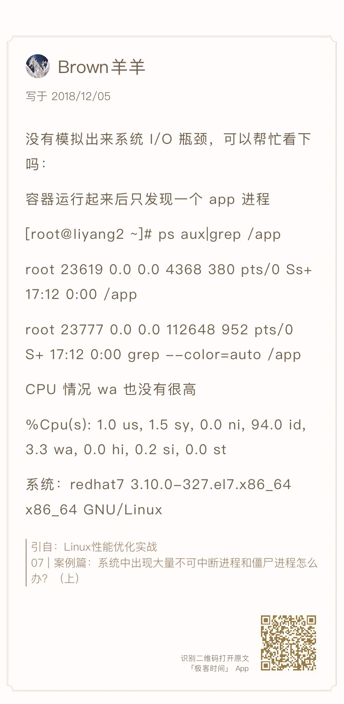
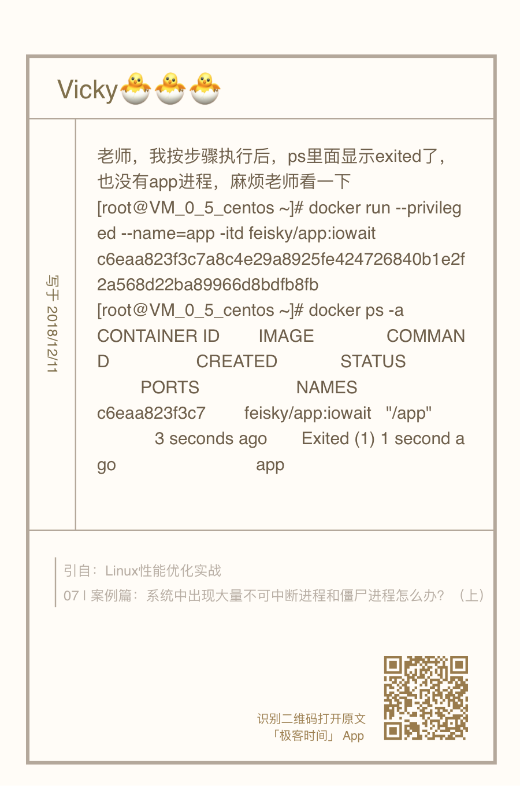
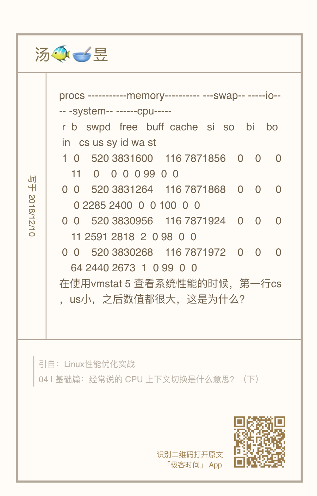

# 13 Linux 性能优化答疑（一）

你好，我是倪朋飞。

专栏更新至今，四大基础模块之一的 CPU 性能篇，我们就已经学完了。很开心过半数同学还没有掉队，仍然在学习、积极实践操作，并且热情地留下了大量的留言。

这些留言中，我非常高兴地看到，很多同学已经做到了活学活用，用学过的案例思路，分析出了线上应用的性能瓶颈，解决了实际工作中的性能问题。 还有同学能够反复推敲思考，指出文章中某些不当或不严谨的叙述，我也十分感谢你，同时很乐意和你探讨。

此外，很多留言提出的问题也很有价值，大部分我都已经在 app 里回复，一些手机上不方便回复的或者很有价值的典型问题，我专门摘了出来，作为今天的答疑内容，集中回复。另一方面，也是为了保证所有人都能不漏掉任何一个重点。

今天是性能优化答疑的第一期。为了便于你学习理解，它们并不是严格按照文章顺序排列的。每个问题，我都附上了留言区提问的截屏。如果你需要回顾内容原文，可以扫描每个问题右下方的二维码查看。

## 问题 1：性能工具版本太低，导致指标不全


这是使用 CentOS 的同学普遍碰到的问题。在文章中，我的 pidstat 输出里有一个 %wait 指标，代表进程等待 CPU 的时间百分比，这是 systat 11.5.5 版本才引入的新指标，旧版本没有这一项。而 CentOS 软件库里的 sysstat 版本刚好比这个低，所以没有这项指标。

不过，你也不用担心。前面我就强调过，工具只是查找分析的手段，指标才是我们重点分析的对象。如果你的 pidstat 里没有显示，自然还有其他手段能找到这个指标。

比如说，在讲解系统原理和性能工具时，我一般会介绍一些 **proc 文件系统** 的知识，教你看懂 proc 文件系统提供的各项指标。之所以这么做，一方面，当然是为了让你更直观地理解系统的工作原理；另一方面，其实是想给你展示，性能工具上能看到的各项性能指标的原始数据来源。

这样，在实际生产环境中，即使你很可能需要运行老版本的操作系统，还没有权限安装新的软件包，你也可以查看 proc 文件系统，获取自己想要的指标。

但是，性能分析的学习，我还是建议你要用最新的性能工具来学。新工具有更全面的指标，让你更容易上手分析。这个绝对的优势，可以让你更直观地得到想要的数据，也不容易让你打退堂鼓。

当然，初学时，你最好试着去理解性能工具的原理，或者熟悉了使用方法后，再回过头重新学习原理。这样，即使是在无法安装新工具的环境中，你仍然可以从 proc 文件系统或者其他地方，获得同样的指标，进行有效的分析。

## 问题 2：使用 stress 命令，无法模拟 iowait 高的场景



使用 stress 无法模拟 iowait 升高，但是却看到了 sys 升高。这是因为案例中 的 stress -i 参数，它表示通过系统调用 sync() 来模拟 I/O 的问题，但这种方法实际上并不可靠。

因为 sync() 的本意是刷新内存缓冲区的数据到磁盘中，以确保同步。如果缓冲区内本来就没多少数据，那读写到磁盘中的数据也就不多，也就没法产生 I/O 压力。

这一点，在使用 SSD 磁盘的环境中尤为明显，很可能你的 iowait 总是 0，却单纯因为大量的系统调用，导致了系统 CPU 使用率 sys 升高。

这种情况，我在留言中也回复过，推荐使用 stress-ng 来代替 stress。担心你没有看到留言，所以这里我再强调一遍。

你可以运行下面的命令，来模拟 iowait 的问题。

```bash
# -i 的含义还是调用 sync，而—hdd 则表示读写临时文件
 stress-ng -i 1 --hdd 1 --timeout 600
```

## 问题 3：无法模拟出 RES 中断的问题



这个问题是说，即使运行了大量的线程，也无法模拟出重调度中断 RES 升高的问题。

其实我在 CPU 上下文切换的案例中已经提到，重调度中断是调度器用来分散任务到不同 CPU 的机制，也就是可以唤醒空闲状态的 CPU ，来调度新任务运行，而这通常借助 **处理器间中断** （Inter-Processor Interrupts，IPI）来实现。

所以，这个中断在单核（只有一个逻辑 CPU）的机器上当然就没有意义了，因为压根儿就不会发生重调度的情况。

不过，正如留言所说，上下文切换的问题依然存在，所以你会看到， cs（context switch）从几百增加到十几万，同时 sysbench 线程的自愿上下文切换和非自愿上下文切换也都会大幅上升，特别是非自愿上下文切换，会上升到十几万。根据非自愿上下文的含义，我们都知道，这是过多的线程在争抢 CPU。

其实这个结论也可以从另一个角度获得。比如，你可以在 pidstat 的选项中，加入 -u 和 -t 参数，输出线程的 CPU 使用情况，你会看到下面的界面：

```bash
$ pidstat -u -t 1 
14:24:03      UID      TGID       TID    %usr %system  %guest   %wait    %CPU   CPU  Command
14:24:04        0         -      2472    0.99    8.91    0.00   77.23    9.90     0  |__sysbench
14:24:04        0         -      2473    0.99    8.91    0.00   68.32    9.90     0  |__sysbench
14:24:04        0         -      2474    0.99    7.92    0.00   75.25    8.91     0  |__sysbench
14:24:04        0         -      2475    2.97    6.93    0.00   70.30    9.90     0  |__sysbench
14:24:04        0         -      2476    2.97    6.93    0.00   68.32    9.90     0  |__sysbench
...
```

从这个 pidstat 的输出界面，你可以发现，每个 stress 线程的 %wait 高达 70%，而 CPU 使用率只有不到 10%。换句话说， stress 线程大部分时间都消耗在了等待 CPU 上，这也表明，确实是过多的线程在争抢 CPU。

在这里顺便提一下，留言中很常见的一个错误。有些同学会拿 pidstat 中的 %wait 跟 top 中的 iowait% （缩写为 wa）对比，其实这是没有意义的，因为它们是完全不相关的两个指标。

- pidstat 中， %wait 表示进程等待 CPU 的时间百分比。
- top 中 ，iowait% 则表示等待 I/O 的 CPU 时间百分比。

回忆一下我们学过的进程状态，你应该记得，等待 CPU 的进程已经在 CPU 的就绪队列中，处于运行状态；而等待 I/O 的进程则处于不可中断状态。

另外，不同版本的 sysbench 运行参数也不是完全一样的。比如，在案例 Ubuntu 18.04 中，运行 sysbench 的格式为：

```bash
sysbench --threads=10 --max-time=300 threads run
```

而在 Ubuntu 16.04 中，运行格式则为（感谢 Haku 留言分享的执行命令）：

```bash
sysbench --num-threads=10 --max-time=300 --test=threads run
```

## 问题 4：无法模拟出 I/O 性能瓶颈，以及 I/O 压力过大的问题



这个问题可以看成是上一个问题的延伸，只是把 stress 命令换成了一个在容器中运行的 app 应用。

事实上，在 I/O 瓶颈案例中，除了上面这个模拟不成功的留言，还有更多留言的内容刚好相反，说的是案例 I/O 压力过大，导致自己的机器出各种问题，甚至连系统都没响应了。

之所以这样，其实还是因为每个人的机器配置不同，既包括了 CPU 和内存配置的不同，更是因为磁盘的巨大差异。比如，机械磁盘（HDD）、低端固态磁盘（SSD）与高端固态磁盘相比，性能差异可能达到数倍到数十倍。

其实，我自己所用的案例机器也只是低端的 SSD，比机械磁盘稍微好一些，但跟高端固态磁盘还是比不了的。所以，相同操作下，我的机器上刚好出现 I/O 瓶颈，但换成一台使用机械磁盘的机器，可能磁盘 I/O 就被压死了（表现为使用率长时间 100%），而换上好一些的 SSD 磁盘，可能又无法产生足够的 I/O 压力。

另外，由于我在案例中只查找了 /dev/xvd 和 /dev/sd 前缀的磁盘，而没有考虑到使用其他前缀磁盘（比如 /dev/nvme）的同学。如果你正好用的是其他前缀，你可能会碰到跟 Vicky 类似的问题，也就是 app 启动后又很快退出，变成 exited 状态。



在这里，berryfl 同学提供了一个不错的建议：可以在案例中增加一个参数指定块设备，这样有需要的同学就不用自己编译和打包案例应用了。


所以，在最新的案例中，我为 app 应用增加了三个选项。

- -d 设置要读取的磁盘，默认前缀为 `/dev/sd` 或者 `/dev/xvd` 的磁盘。
- -s 设置每次读取的数据量大小，单位为字节，默认为 67108864（也就是 64MB）。
- -c 设置每个子进程读取的次数，默认为 20 次，也就是说，读取 20\*64MB 数据后，子进程退出。

你可以点击 [Github](https://github.com/feiskyer/linux-perf-examples/tree/master/high-iowait-process) 查看它的源码，使用方法我写在了这里：

```bash
docker run --privileged --name=app -itd feisky/app:iowait /app -d /dev/sdb -s 67108864 -c 20
```

案例运行后，你可以执行 docker logs 查看它的日志。正常情况下，你可以看到下面的输出：

```bash
$ docker logs app
Reading data from disk /dev/sdb with buffer size 67108864 and count 20
```

## 问题 5：性能工具（如 vmstat）输出中，第一行数据跟其他行差别巨大



这个问题主要是说，在执行 vmstat 时，第一行数据跟其他行相比较，数值相差特别大。我相信不少同学都注意到了这个现象，这里我简单解释一下。

首先还是要记住，我总强调的那句话， **在碰到直观上解释不了的现象时，要第一时间去查命令手册** 。

比如，运行 man vmstat 命令，你可以在手册中发现下面这句话：

```bash
The first report produced gives averages since the last reboot.  Additional reports give information on a sam‐ 
pling period of length delay.  The process and memory reports are instantaneous in either case. 
```

也就是说，第一行数据是系统启动以来的平均值，其他行才是你在运行 vmstat 命令时，设置的间隔时间的平均值。另外，进程和内存的报告内容都是即时数值。

你看，这并不是什么不得了的事故，但如果我们不清楚这一点，很可能卡住我们的思维，阻止我们进一步的分析。这里我也不得不提一下，文档的重要作用。

授之以鱼，不如授之以渔。我们专栏的学习核心，一定是教会你 **性能分析的原理和思路** ，性能工具只是我们的路径和手段。所以，在提到各种性能工具时，我并没有详细解释每个工具的各种命令行选项的作用，一方面是因为你很容易通过文档查到这些，另一方面就是不同版本、不同系统中，个别选项的含义可能并不相同。

所以，不管因为哪个因素，自己 man 一下，一定是最快速并且最准确的方式。特别是，当你发现某些工具的输出不符合常识时，一定记住，第一时间查文档弄明白。实在读不懂文档的话，再上网去搜，或者在专栏里向我提问。

学习是一个“从薄到厚再变薄”的过程，我们从细节知识入手开始学习，积累到一定程度，需要整理成一个体系来记忆，这其中还要不断地对这个体系进行细节修补。有疑问、有反思才可以达到最佳的学习效果。

最后，欢迎继续在留言区写下你的疑问，我会持续不断地解答。我的目的仍然不变，希望可以和你一起，把文章的知识变成你的能力，我们不仅仅在实战中演练，也要在交流中进步。
