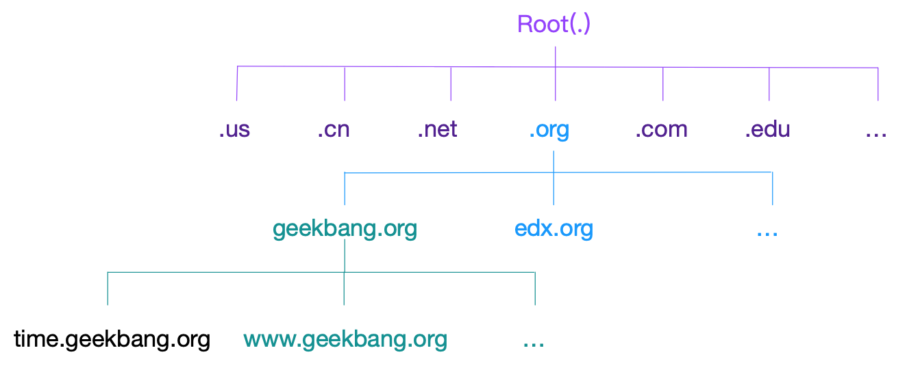
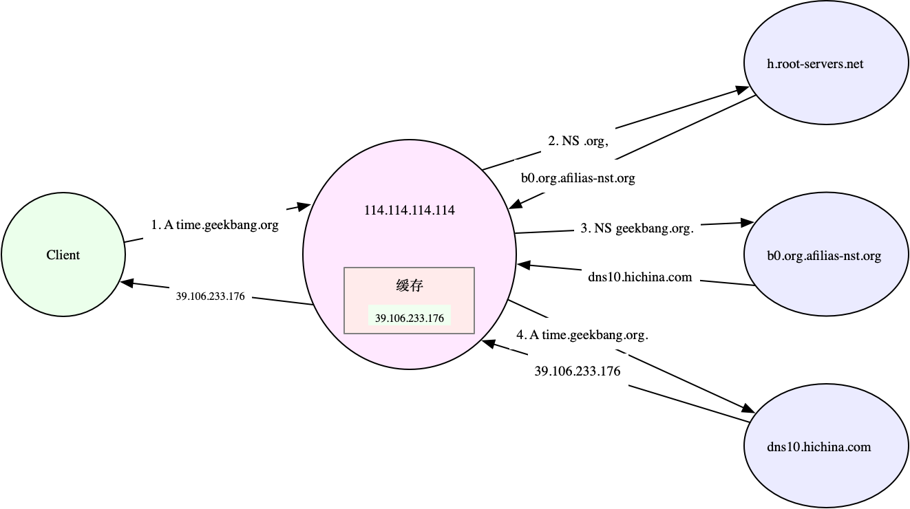

# 37 案例篇：DNS 解析时快时慢，我该怎么办？

你好，我是倪朋飞。

上一节，我带你一起学习了网络性能的评估方法。简单回顾一下，Linux 网络基于 TCP/IP 协议栈构建，而在协议栈的不同层，我们所关注的网络性能也不尽相同。

在应用层，我们关注的是应用程序的并发连接数、每秒请求数、处理延迟、错误数等，可以使用 wrk、Jmeter 等工具，模拟用户的负载，得到想要的测试结果。

而在传输层，我们关注的是 TCP、UDP 等传输层协议的工作状况，比如 TCP 连接数、 TCP 重传、TCP 错误数等。此时，你可以使用 iperf、netperf 等，来测试 TCP 或 UDP 的性能。

再向下到网络层，我们关注的则是网络包的处理能力，即 PPS。Linux 内核自带的 pktgen，就可以帮你测试这个指标。

由于低层协议是高层协议的基础，所以一般情况下，我们所说的网络优化，实际上包含了整个网络协议栈的所有层的优化。当然，性能要求不同，具体需要优化的位置和目标并不完全相同。

前面在评估网络性能（比如 HTTP 性能）时，我们在测试工具中指定了网络服务的 IP 地址。IP 地址是 TCP/IP 协议中，用来确定通信双方的一个重要标识。每个 IP 地址又包括了主机号和网络号两部分。相同网络号的主机组成一个子网；不同子网再通过路由器连接，组成一个庞大的网络。

然而，IP 地址虽然方便了机器的通信，却给访问这些服务的人们，带来了很重的记忆负担。我相信，没几个人能记得住 Github 所在的 IP 地址，因为这串字符，对人脑来说并没有什么含义，不符合我们的记忆逻辑。

不过，这并不妨碍我们经常使用这个服务。为什么呢？当然是因为还有更简单、方便的方式。我们可以通过域名 github.com 访问，而不是必须依靠具体的 IP 地址，这其实正是域名系统 DNS 的由来。

DNS（Domain Name System），即域名系统，是互联网中最基础的一项服务，主要提供域名和 IP 地址之间映射关系的查询服务。

DNS 不仅方便了人们访问不同的互联网服务，更为很多应用提供了，动态服务发现和全局负载均衡（Global Server Load Balance，GSLB）的机制。这样，DNS 就可以选择离用户最近的 IP 来提供服务。即使后端服务的 IP 地址发生变化，用户依然可以用相同域名来访问。

DNS 显然是我们工作中基础而重要的一个环节。那么，DNS 出现问题时，又该如何分析和排查呢？今天，我就带你一起来看看这个问题。

## 域名与 DNS 解析

域名我们本身都比较熟悉，由一串用点分割开的字符组成，被用作互联网中的某一台或某一组计算机的名称，目的就是为了方便识别，互联网中提供各种服务的主机位置。

要注意，域名是全球唯一的，需要通过专门的域名注册商才可以申请注册。为了组织全球互联网中的众多计算机，域名同样用点来分开，形成一个分层的结构。而每个被点分割开的字符串，就构成了域名中的一个层级，并且位置越靠后，层级越高。

我们以极客时间的网站 time.geekbang.org 为例，来理解域名的含义。这个字符串中，最后面的 org 是顶级域名，中间的 geekbang 是二级域名，而最左边的 time 则是三级域名。

如下图所示，注意点（.）是所有域名的根，也就是说所有域名都以点作为后缀，也可以理解为，在域名解析的过程中，所有域名都以点结束。



通过理解这几个概念，你可以看出，域名主要是为了方便让人记住，而 IP 地址是机器间的通信的真正机制。把域名转换为 IP 地址的服务，也就是我们开头提到的，域名解析服务（DNS），而对应的服务器就是域名服务器，网络协议则是 DNS 协议。

这里注意，DNS 协议在 TCP/IP 栈中属于应用层，不过实际传输还是基于 UDP 或者 TCP 协议（UDP 居多） ，并且域名服务器一般监听在端口 53 上。

既然域名以分层的结构进行管理，相对应的，域名解析其实也是用递归的方式（从顶级开始，以此类推），发送给每个层级的域名服务器，直到得到解析结果。

不过不要担心，递归查询的过程并不需要你亲自操作，DNS 服务器会替你完成，你要做的，只是预先配置一个可用的 DNS 服务器就可以了。

当然，我们知道，通常来说，每级 DNS 服务器，都会有最近解析记录的缓存。当缓存命中时，直接用缓存中的记录应答就可以了。如果缓存过期或者不存在，才需要用刚刚提到的递归方式查询。

所以，系统管理员在配置 Linux 系统的网络时，除了需要配置 IP 地址，还需要给它配置 DNS 服务器，这样它才可以通过域名来访问外部服务。

比如，我的系统配置的就是 114.114.114.114 这个域名服务器。你可以执行下面的命令，来查询你的系统配置：

```bash
$ cat /etc/resolv.conf
nameserver 114.114.114.114
```

另外，DNS 服务通过资源记录的方式，来管理所有数据，它支持 A、CNAME、MX、NS、PTR 等多种类型的记录。比如：

- A 记录，用来把域名转换成 IP 地址；
- CNAME 记录，用来创建别名；
- 而 NS 记录，则表示该域名对应的域名服务器地址。

简单来说，当我们访问某个网址时，就需要通过 DNS 的 A 记录，查询该域名对应的 IP 地址，然后再通过该 IP 来访问 Web 服务。

比如，还是以极客时间的网站 time.geekbang.org 为例，执行下面的 nslookup 命令，就可以查询到这个域名的 A 记录，可以看到，它的 IP 地址是 39.106.233.176：

```bash
$ nslookup time.geekbang.org
# 域名服务器及端口信息
Server:  114.114.114.114
Address: 114.114.114.114#53 
# 非权威查询结果
Non-authoritative answer:
Name: time.geekbang.org
Address: 39.106.233.17
```

这里要注意，由于 114.114.114.114 并不是直接管理 time.geekbang.org 的域名服务器，所以查询结果是非权威的。使用上面的命令，你只能得到 114.114.114.114 查询的结果。

前面还提到了，如果没有命中缓存，DNS 查询实际上是一个递归过程，那有没有方法可以知道整个递归查询的执行呢？

其实除了 nslookup，另外一个常用的 DNS 解析工具 dig ，就提供了 trace 功能，可以展示递归查询的整个过程。比如你可以执行下面的命令，得到查询结果：

```bash
# +trace 表示开启跟踪查询
# +nodnssec 表示禁止 DNS 安全扩展
$ dig +trace +nodnssec time.geekbang.org 
; <<>> DiG 9.11.3-1ubuntu1.3-Ubuntu <<>> +trace +nodnssec time.geekbang.org
;; global options: +cmd
.   322086 IN NS m.root-servers.net.
.   322086 IN NS a.root-servers.net.
.   322086 IN NS i.root-servers.net.
.   322086 IN NS d.root-servers.net.
.   322086 IN NS g.root-servers.net.
.   322086 IN NS l.root-servers.net.
.   322086 IN NS c.root-servers.net.
.   322086 IN NS b.root-servers.net.
.   322086 IN NS h.root-servers.net.
.   322086 IN NS e.root-servers.net.
.   322086 IN NS k.root-servers.net.
.   322086 IN NS j.root-servers.net.
.   322086 IN NS f.root-servers.net.
;; Received 239 bytes from 114.114.114.114#53(114.114.114.114) in 1340 ms 
org.   172800 IN NS a0.org.afilias-nst.info.
org.   172800 IN NS a2.org.afilias-nst.info.
org.   172800 IN NS b0.org.afilias-nst.org.
org.   172800 IN NS b2.org.afilias-nst.org.
org.   172800 IN NS c0.org.afilias-nst.info.
org.   172800 IN NS d0.org.afilias-nst.org.
;; Received 448 bytes from 198.97.190.53#53(h.root-servers.net) in 708 ms 
geekbang.org.  86400 IN NS dns9.hichina.com.
geekbang.org.  86400 IN NS dns10.hichina.com.
;; Received 96 bytes from 199.19.54.1#53(b0.org.afilias-nst.org) in 1833 ms 
time.geekbang.org. 600 IN A 39.106.233.176
;; Received 62 bytes from 140.205.41.16#53(dns10.hichina.com) in 4 ms
```

dig trace 的输出，主要包括四部分。

- 第一部分，是从 114.114.114.114 查到的一些根域名服务器（.）的 NS 记录。
- 第二部分，是从 NS 记录结果中选一个（h.root-servers.net），并查询顶级域名 org. 的 NS 记录。
- 第三部分，是从 org. 的 NS 记录中选择一个（b0.org.afilias-nst.org），并查询二级域名 geekbang.org. 的 NS 服务器。
- 最后一部分，就是从 geekbang.org. 的 NS 服务器（dns10.hichina.com）查询最终主机 time.geekbang.org. 的 A 记录。

这个输出里展示的各级域名的 NS 记录，其实就是各级域名服务器的地址，可以让你更清楚 DNS 解析的过程。 为了帮你更直观理解递归查询，我把这个过程整理成了一张流程图，你可以保存下来理解。



当然，不仅仅是发布到互联网的服务需要域名，很多时候，我们也希望能对局域网内部的主机进行域名解析（即内网域名，大多数情况下为主机名）。Linux 也支持这种行为。

所以，你可以把主机名和 IP 地址的映射关系，写入本机的 /etc/hosts 文件中。这样，指定的主机名就可以在本地直接找到目标 IP。比如，你可以执行下面的命令来操作：

```bash
$ cat /etc/hosts
127.0.0.1   localhost localhost.localdomain
::1         localhost6 localhost6.localdomain6
192.168.0.100 domain.com
```

或者，你还可以在内网中，搭建自定义的 DNS 服务器，专门用来解析内网中的域名。而内网 DNS 服务器，一般还会设置一个或多个上游 DNS 服务器，用来解析外网的域名。

清楚域名与 DNS 解析的基本原理后，接下来，我就带你一起来看几个案例，实战分析 DNS 解析出现问题时，该如何定位。

## 案例准备

本次案例还是基于 Ubuntu 18.04，同样适用于其他的 Linux 系统。我使用的案例环境如下所示：

- 机器配置：2 CPU，8GB 内存。
- 预先安装 docker 等工具，如 apt install docker.io。

你可以先打开一个终端，SSH 登录到 Ubuntu 机器中，然后执行下面的命令，拉取案例中使用的 Docker 镜像：

```bash
$ docker pull feisky/dnsutils
Using default tag: latest
...
Status: Downloaded newer image for feisky/dnsutils:latest
```

然后，运行下面的命令，查看主机当前配置的 DNS 服务器：

```bash
$ cat /etc/resolv.conf
nameserver 114.114.114.114
```

可以看到，我这台主机配置的 DNS 服务器是 114.114.114.114。

到这里，准备工作就完成了。接下来，我们正式进入操作环节。

## 案例分析

### 案例 1：DNS 解析失败

首先，执行下面的命令，进入今天的第一个案例。如果一切正常，你将可以看到下面这个输出：

```bash
# 进入案例环境的 SHELL 终端中
$ docker run -it --rm -v $(mktemp):/etc/resolv.conf feisky/dnsutils bash
[email protected]:/#
```

注意，这儿 root 后面的 7e9ed6ed4974，是 Docker 生成容器的 ID 前缀，你的环境中很可能是不同的 ID，所以直接忽略这一项就可以了。

> 注意：下面的代码段中， /# 开头的命令都表示在容器内部运行的命令。

接着，继续在容器终端中，执行 DNS 查询命令，我们还是查询 time.geekbang.org 的 IP 地址：

```bash
/# nslookup time.geekbang.org
;; connection timed out; no servers could be reached
```

你可以发现，这个命令阻塞很久后，还是失败了，报了 connection timed out 和 no servers could be reached 错误。

看到这里，估计你的第一反应就是网络不通了，到底是不是这样呢？我们用 ping 工具检查试试。执行下面的命令，就可以测试本地到 114.114.114.114 的连通性：

```bash
/# ping -c3 114.114.114.114
PING 114.114.114.114 (114.114.114.114): 56 data bytes
64 bytes from 114.114.114.114: icmp_seq=0 ttl=56 time=31.116 ms
64 bytes from 114.114.114.114: icmp_seq=1 ttl=60 time=31.245 ms
64 bytes from 114.114.114.114: icmp_seq=2 ttl=68 time=31.128 ms
--- 114.114.114.114 ping statistics ---
3 packets transmitted, 3 packets received, 0% packet loss
round-trip min/avg/max/stddev = 31.116/31.163/31.245/0.058 ms
```

这个输出中，你可以看到网络是通的。那要怎么知道 nslookup 命令失败的原因呢？这里其实有很多方法，最简单的一种，就是开启 nslookup 的调试输出，查看查询过程中的详细步骤，排查其中是否有异常。

比如，我们可以继续在容器终端中，执行下面的命令：

```bash
/# nslookup -debug time.geekbang.org
;; Connection to 127.0.0.1#53(127.0.0.1) for time.geekbang.org failed: connection refused.
;; Connection to ::1#53(::1) for time.geekbang.org failed: address not available.
```

从这次的输出可以看到，nslookup 连接环回地址（127.0.0.1 和 ::1）的 53 端口失败。这里就有问题了，为什么会去连接环回地址，而不是我们的先前看到的 114.114.114.114 呢？

你可能已经想到了症结所在——有可能是因为容器中没有配置 DNS 服务器。那我们就执行下面的命令确认一下：

```bash
/# cat /etc/resolv.conf
```

果然，这个命令没有任何输出，说明容器里的确没有配置 DNS 服务器。到这一步，很自然的，我们就知道了解决方法。在 /etc/resolv.conf 文件中，配置上 DNS 服务器就可以了。

你可以执行下面的命令，在配置好 DNS 服务器后，重新执行 nslookup 命令。自然，我们现在发现，这次可以正常解析了：

```bash
/# echo "nameserver 114.114.114.114" > /etc/resolv.conf
/# nslookup time.geekbang.org
Server:  114.114.114.114
Address: 114.114.114.114#53 
Non-authoritative answer:
Name: time.geekbang.org
Address: 39.106.233.176
```

到这里，第一个案例就轻松解决了。最后，在终端中执行 exit 命令退出容器，Docker 就会自动清理刚才运行的容器。

### 案例 2：DNS 解析不稳定

接下来，我们再来看第二个案例。执行下面的命令，启动一个新的容器，并进入它的终端中：

```bash
$ docker run -it --rm --cap-add=NET_ADMIN --dns 8.8.8.8 feisky/dnsutils bash
[email protected]:/#
```

然后，跟上一个案例一样，还是运行 nslookup 命令，解析 time.geekbang.org 的 IP 地址。不过，这次要加一个 time 命令，输出解析所用时间。如果一切正常，你可能会看到如下输出：

```bash
/# time nslookup time.geekbang.org
Server:  8.8.8.8
Address: 8.8.8.8#53 
Non-authoritative answer:
Name: time.geekbang.org
Address: 39.106.233.176 
real 0m10.349s
user 0m0.004s
sys 0m0.0
```

可以看到，这次解析非常慢，居然用了 10 秒。如果你多次运行上面的 nslookup 命令，可能偶尔还会碰到下面这种错误：

```bash
/# time nslookup time.geekbang.org
;; connection timed out; no servers could be reached 
real 0m15.011s
user 0m0.006s
sys 0m0.006s
```

换句话说，跟上一个案例类似，也会出现解析失败的情况。综合来看，现在 DNS 解析的结果不但比较慢，而且还会发生超时失败的情况。

这是为什么呢？碰到这种问题该怎么处理呢？

其实，根据前面的讲解，我们知道，DNS 解析，说白了就是客户端与服务器交互的过程，并且这个过程还使用了 UDP 协议。

那么，对于整个流程来说，解析结果不稳定，就有很多种可能的情况了。比方说：

- DNS 服务器本身有问题，响应慢并且不稳定；
- 或者是，客户端到 DNS 服务器的网络延迟比较大；
- 再或者，DNS 请求或者响应包，在某些情况下被链路中的网络设备弄丢了。

根据上面 nslookup 的输出，你可以看到，现在客户端连接的 DNS 是 8.8.8.8，这是 Google 提供的 DNS 服务。对 Google 我们还是比较放心的，DNS 服务器出问题的概率应该比较小。基本排除了 DNS 服务器的问题，那是不是第二种可能，本机到 DNS 服务器的延迟比较大呢？

前面讲过，ping 可以用来测试服务器的延迟。比如，你可以运行下面的命令：

```bash
/# ping -c3 8.8.8.8
PING 8.8.8.8 (8.8.8.8): 56 data bytes
64 bytes from 8.8.8.8: icmp_seq=0 ttl=31 time=137.637 ms
64 bytes from 8.8.8.8: icmp_seq=1 ttl=31 time=144.743 ms
64 bytes from 8.8.8.8: icmp_seq=2 ttl=31 time=138.576 ms
--- 8.8.8.8 ping statistics ---
3 packets transmitted, 3 packets received, 0% packet loss
round-trip min/avg/max/stddev = 137.637/140.319/144.743/3.152 ms
```

从 ping 的输出可以看到，这里的延迟已经达到了 140ms，这也就可以解释，为什么解析这么慢了。实际上，如果你多次运行上面的 ping 测试，还会看到偶尔出现的丢包现象。

```bash
$ ping -c3 8.8.8.8
PING 8.8.8.8 (8.8.8.8): 56 data bytes
64 bytes from 8.8.8.8: icmp_seq=0 ttl=30 time=134.032 ms
64 bytes from 8.8.8.8: icmp_seq=1 ttl=30 time=431.458 ms
--- 8.8.8.8 ping statistics ---
3 packets transmitted, 2 packets received, 33% packet loss
round-trip min/avg/max/stddev = 134.032/282.745/431.458/148.713 ms
```

这也进一步解释了，为什么 nslookup 偶尔会失败，正是网络链路中的丢包导致的。

碰到这种问题该怎么办呢？显然，既然延迟太大，那就换一个延迟更小的 DNS 服务器，比如电信提供的 114.114.114.114。

配置之前，我们可以先用 ping 测试看看，它的延迟是不是真的比 8.8.8.8 好。执行下面的命令，你就可以看到，它的延迟只有 31ms：

```bash
/# ping -c3 114.114.114.114
PING 114.114.114.114 (114.114.114.114): 56 data bytes
64 bytes from 114.114.114.114: icmp_seq=0 ttl=67 time=31.130 ms
64 bytes from 114.114.114.114: icmp_seq=1 ttl=56 time=31.302 ms
64 bytes from 114.114.114.114: icmp_seq=2 ttl=56 time=31.250 ms
--- 114.114.114.114 ping statistics ---
3 packets transmitted, 3 packets received, 0% packet loss
round-trip min/avg/max/stddev = 31.130/31.227/31.302/0.072 ms
```

这个结果表明，延迟的确小了很多。我们继续执行下面的命令，更换 DNS 服务器，然后，再次执行 nslookup 解析命令：

```bash
/# echo nameserver 114.114.114.114 > /etc/resolv.conf
/# time nslookup time.geekbang.org
Server:  114.114.114.114
Address: 114.114.114.114#53 
Non-authoritative answer:
Name: time.geekbang.org
Address: 39.106.233.176 
real    0m0.064s
user    0m0.007s
sys     0m0.006s
```

你可以发现，现在只需要 64ms 就可以完成解析，比刚才的 10s 要好很多。

到这里，问题看似就解决了。不过，如果你多次运行 nslookup 命令，估计就不是每次都有好结果了。比如，在我的机器中，就经常需要 1s 甚至更多的时间。

```bash
/# time nslookup time.geekbang.org
Server:  114.114.114.114
Address: 114.114.114.114#53 
Non-authoritative answer:
Name: time.geekbang.org
Address: 39.106.233.176 
real 0m1.045s
user 0m0.007s
sys 0m0.004s
```

1s 的 DNS 解析时间还是太长了，对很多应用来说也是不可接受的。那么，该怎么解决这个问题呢？我想你一定已经想到了，那就是使用 DNS 缓存。这样，只有第一次查询时需要去 DNS 服务器请求，以后的查询，只要 DNS 记录不过期，使用缓存中的记录就可以了。

不过要注意，我们使用的主流 Linux 发行版，除了最新版本的 Ubuntu （如 18.04 或者更新版本）外，其他版本并没有自动配置 DNS 缓存。

所以，想要为系统开启 DNS 缓存，就需要你做额外的配置。比如，最简单的方法，就是使用 dnsmasq。

dnsmasq 是最常用的 DNS 缓存服务之一，还经常作为 DHCP 服务来使用。它的安装和配置都比较简单，性能也可以满足绝大多数应用程序对 DNS 缓存的需求。

我们继续在刚才的容器终端中，执行下面的命令，就可以启动 dnsmasq：

```bash
/# /etc/init.d/dnsmasq start
 * Starting DNS forwarder and DHCP server dnsmasq                    [ OK ]
```

然后，修改 /etc/resolv.conf，将 DNS 服务器改为 dnsmasq 的监听地址，这儿是 127.0.0.1。接着，重新执行多次 nslookup 命令：

```bash
/# echo nameserver 127.0.0.1 > /etc/resolv.conf
/# time nslookup time.geekbang.org
Server:  127.0.0.1
Address: 127.0.0.1#53 
Non-authoritative answer:
Name: time.geekbang.org
Address: 39.106.233.176 
real 0m0.492s
user 0m0.007s
sys 0m0.006s 
/# time nslookup time.geekbang.org
Server:  127.0.0.1
Address: 127.0.0.1#53 
Non-authoritative answer:
Name: time.geekbang.org
Address: 39.106.233.176 
real 0m0.011s
user 0m0.008s
sys 0m0.003s
```

现在我们可以看到，只有第一次的解析很慢，需要 0.5s，以后的每次解析都很快，只需要 11ms。并且，后面每次 DNS 解析需要的时间也都很稳定。

案例的最后，还是别忘了执行 exit，退出容器终端，Docker 会自动清理案例容器。

## 小结

今天，我带你一起学习了 DNS 的基本原理，并通过几个案例，带你一起掌握了，发现 DNS 解析问题时的分析和解决思路。

DNS 是互联网中最基础的一项服务，提供了域名和 IP 地址间映射关系的查询服务。很多应用程序在最初开发时，并没考虑 DNS 解析的问题，后续出现问题后，排查好几天才能发现，其实是 DNS 解析慢导致的。

试想，假如一个 Web 服务的接口，每次都需要 1s 时间来等待 DNS 解析，那么，无论你怎么优化应用程序的内在逻辑，对用户来说，这个接口的响应都太慢，因为响应时间总是会大于 1 秒的。

所以，在应用程序的开发过程中，我们必须考虑到 DNS 解析可能带来的性能问题，掌握常见的优化方法。这里，我总结了几种常见的 DNS 优化方法。

- 对 DNS 解析的结果进行缓存。缓存是最有效的方法，但要注意，一旦缓存过期，还是要去 DNS 服务器重新获取新记录。不过，这对大部分应用程序来说都是可接受的。
- 对 DNS 解析的结果进行预取。这是浏览器等 Web 应用中最常用的方法，也就是说，不等用户点击页面上的超链接，浏览器就会在后台自动解析域名，并把结果缓存起来。
- 使用 HTTPDNS 取代常规的 DNS 解析。这是很多移动应用会选择的方法，特别是如今域名劫持普遍存在，使用 HTTP 协议绕过链路中的 DNS 服务器，就可以避免域名劫持的问题。
- 基于 DNS 的全局负载均衡（GSLB）。这不仅为服务提供了负载均衡和高可用的功能，还可以根据用户的位置，返回距离最近的 IP 地址。

## 思考

最后，我想请你来聊一聊，你所碰到的 DNS 问题。你都碰到过哪些类型的 DNS 问题？你是通过哪些方法来排查的，又通过哪些方法解决的呢？你可以结合今天学到的知识，总结自己的思路。

欢迎在留言区和我讨论，也欢迎你把这篇文章分享给你的同事、朋友。我们一起在实战中演练，在交流中进步。
