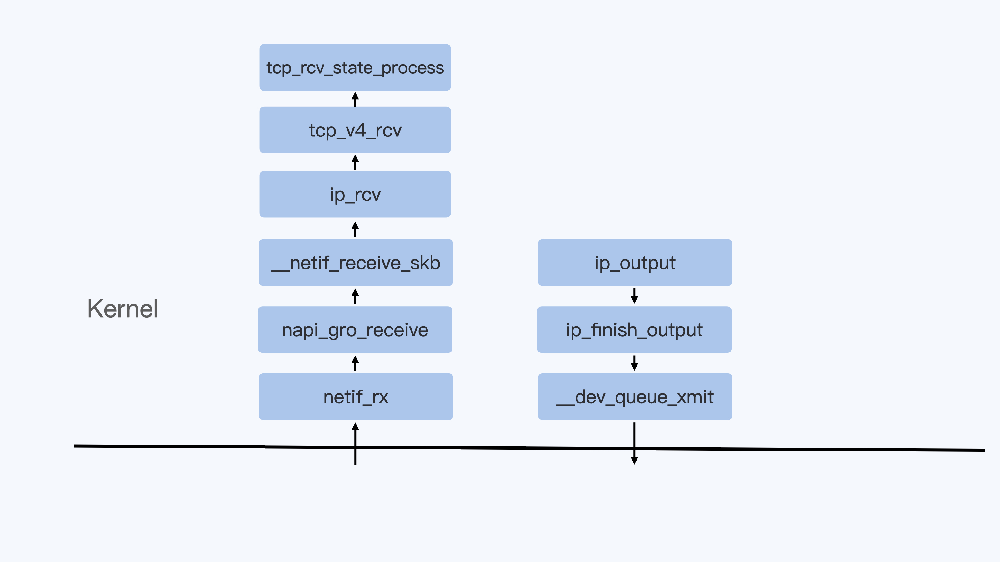
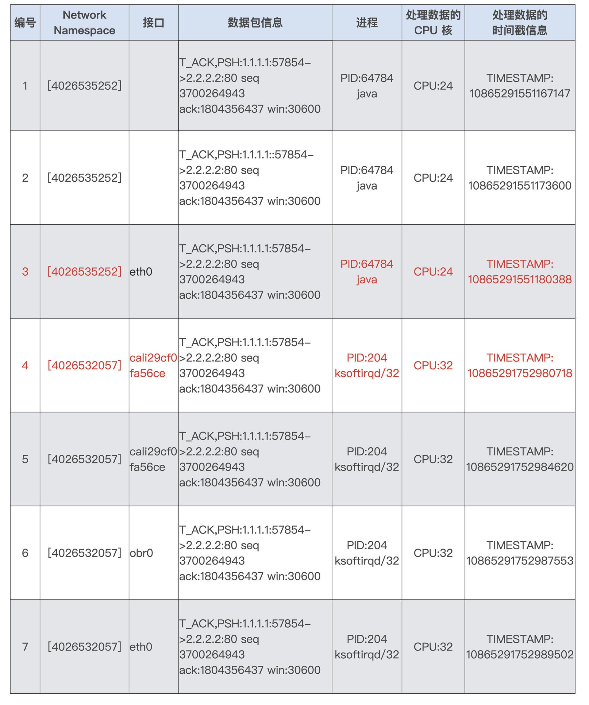
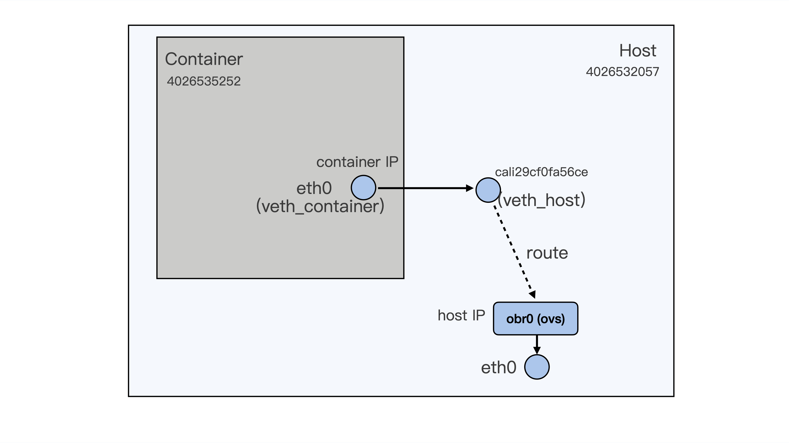
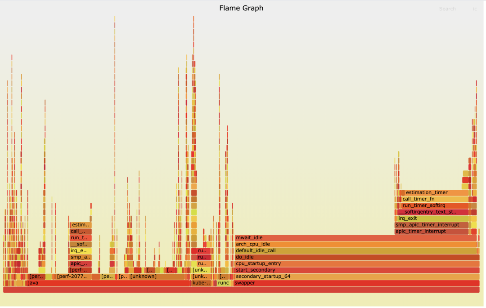
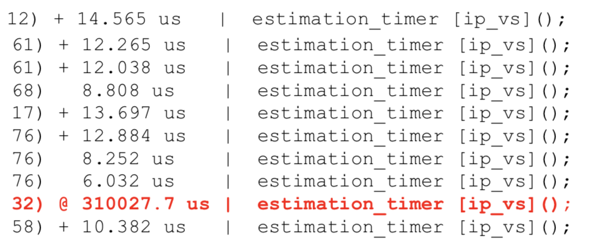

# 加餐01 案例分析：怎么解决海量IPVS规则带来的网络延时抖动问题？

你好，我是程远。

今天，我们进入到了加餐专题部分。我在结束语的彩蛋里就和你说过，在这个加餐案例中，我们会用到 perf、ftrace、bcc/ebpf 这几个 Linux 调试工具，了解它们的原理，熟悉它们在调试问题的不同阶段所发挥的作用。

加餐内容我是这样安排的，专题的第 1 讲我先完整交代这个案例的背景，带你回顾我们当时整个的调试过程和思路，然后用 5 讲内容，对这个案例中用到的调试工具依次进行详细讲解。

好了，话不多说。这一讲，我们先来整体看一下这个容器网络延时的案例。

## 问题的背景

在 2020 年初的时候，我们的一个用户把他们的应用从虚拟机迁移到了 Kubernetes 平台上。迁移之后，用户发现他们的应用在容器中的出错率很高，相比在之前虚拟机上的出错率要高出一个数量级。

那为什么会有这么大的差别呢？我们首先分析了应用程序的出错日志，发现在 Kubernetes 平台上，几乎所有的出错都是因为网络超时导致的。

经过网络环境排查和比对测试，我们排除了网络设备上的问题，那么这个超时就只能是容器和宿主机上的问题了。

这里要先和你说明的是，尽管应用程序的出错率在容器中比在虚拟机里高出一个数量级，不过这个出错比例仍然是非常低的，在虚拟机中的出错率是 0.001%，而在容器中的出错率是 0.01%~0.04%。

因为这个出错率还是很低，所以对于这种低概率事件，我们想复现和排查问题，难度就很大了。

当时我们查看了一些日常的节点监控数据，比如 CPU 使用率、Load Average、内存使用、网络流量和丢包数量、磁盘 I/O，发现从这些数据中都看不到任何的异常。

既然常规手段无效，那我们应该如何下手去调试这个问题呢？

你可能会想到用 tcpdump 看一看，因为它是网络抓包最常见的工具。其实我们当时也这样想过，不过马上就被自己否定了，因为这个方法存在下面三个问题。

第一，我们遇到的延时问题是偶尔延时，所以需要长时间地抓取数据，这样抓取的数据量就会很大。

第二，在抓完数据之后，需要单独设计一套分析程序来找到长延时的数据包。

第三，即使我们找到了长延时的数据包，也只是从实际的数据包层面证实了问题。但是这样做无法取得新进展，也无法帮助我们发现案例中网络超时的根本原因。

## 调试过程

对于这种非常偶然的延时问题，之前我们能做的是依靠经验，去查看一些可疑点碰碰“运气”。

不过这一次，我们想用更加系统的方法来调试这个问题。所以接下来，我会从 ebpf 破冰，perf 进一步定位以及用 ftrace 最终锁定这三个步骤，带你一步步去解决这个复杂的网络延时问题。

### ebpf 的破冰

我们的想法是这样的：因为延时产生在节点上，所以可以推测，这个延时有很大的概率发生在 Linux 内核处理数据包的过程中。

沿着这个思路，还需要进一步探索。我们想到，可以给每个数据包在内核协议栈关键的函数上都打上时间戳，然后计算数据包在每两个函数之间的时间差，如果这个时间差比较大，就可以说明问题出在这两个内核函数之间。

要想找到内核协议栈中的关键函数，还是比较容易的。比如下面的这张示意图里，就列出了 Linux 内核在接收数据包和发送数据包过程中的主要函数：



找到这些主要函数之后，下一个问题就是，想给每个数据包在经过这些函数的时候打上时间戳做记录，应该用什么方法呢？接下来我们一起来看看。

在不修改内核源代码的情况，要截获内核函数，我们可以利用kprobe或者tracepoint的接口。

使用这两种接口的方法也有两种：一是直接写 kernel module 来调用 kprobe 或者 tracepoint 的接口，第二种方法是通过ebpf的接口来调用它们。在后面的课程里，我还会详细讲解 ebpf、kprobe、tracepoint，这里你先有个印象就行。

在这里，我们选择了第二种方法，也就是使用 ebpf 来调用 kprobe 或者 tracepoint 接口，记录数据包处理过程中这些协议栈函数的每一次调用。

选择 ebpf 的原因主要是两个：一是 ebpf 的程序在内核中加载会做很严格的检查，这样在生产环境中使用比较安全；二是 ebpf map 功能可以方便地进行内核态与用户态的通讯，这样实现一个工具也比较容易。

决定了方法之后，这里我们需要先实现一个 ebpf 工具，然后用这个工具来对内核网络函数做 trace。

我们工具的具体实现是这样的，针对用户的一个 TCP/IP 数据流，记录这个流的数据发送包与数据接收包的传输过程，也就是数据发送包从容器的 Network Namespace 发出，一直到它到达宿主机的 eth0 的全过程，以及数据接收包从宿主机的 eth0 返回到容器 Network Namespace 的 eth0 的全程。

在收集了数十万条记录后，我们对数据做了分析，找出前后两步时间差大于 50 毫秒（ms）的记录。最后，我们终于发现了下面这段记录：



在这段记录中，我们先看一下“Network Namespace”这一列。编号 3 对应的 Namespace ID 4026535252 是容器里的，而 ID4026532057 是宿主机上的 Host Namespace。

数据包从 1 到 7 的数据表示了，一个数据包从容器里的 eth0 通过 veth 发到宿主机上的 peer veth cali29cf0fa56ce，然后再通过路由从宿主机的 obr0（openvswitch）接口和 eth0 接口发出。

为了方便你理解，我在下面画了一张示意图，描述了这个数据包的传输过程：



在这个过程里，我们发现了当数据包从容器的 eth0 发送到宿主机上的 cali29cf0fa56ce，也就是从第 3 步到第 4 步之间，花费的时间是 10865291752980718-10865291551180388=201800330。

因为时间戳的单位是纳秒 ns，而 201800330 超过了 200 毫秒（ms），这个时间显然是不正常的。

你还记得吗？我们在容器网络模块的第 17 讲说过 veth pair 之间数据的发送，它会触发一个 softirq，并且在我们 ebpf 的记录中也可以看到，当数据包到达 cali29cf0fa56ce 后，就是 softirqd 进程在 CPU32 上对它做处理。

那么这时候，我们就可以把关注点放到 CPU32 的 softirq 处理上了。我们再仔细看看 CPU32 上的 si（softirq）的 CPU 使用情况（运行 top 命令之后再按一下数字键 1，就可以列出每个 CPU 的使用率了），会发现在 CPU32 上时不时出现 si CPU 使用率超过 20% 的现象。

具体的输出情况如下：

```plaintext
%Cpu32 :  8.7 us,  0.0 sy,  0.0 ni, 62.1 id,  0.0 wa,  0.0 hi, 29.1 si,  0.0 st
```

其实刚才说的这点，在最初的节点监控数据上，我们是不容易注意到的。这是因为我们的节点上有 80 个 CPU，单个 CPUsi 偶尔超过 20%，平均到 80 个 CPU 上就只有 0.25% 了。要知道，对于一个普通节点，1% 的 si 使用率都是很正常的。

好了，到这里我们已经缩小了问题的排查范围。可以看到，使用了 ebpf 帮助我们在毫无头绪的情况，找到了一个比较明确的方向。那么下一步，我们自然要顺藤摸瓜，进一步去搞清楚，为什么在 CPU32 上的 softirq CPU 使用率会时不时突然增高？

### perf 定位热点

对于查找高 CPU 使用率情况下的热点函数，perf 显然是最有力的工具。我们只需要执行一下后面的这条命令，看一下 CPU32 上的函数调用的热度。

```plaintext
# perf record -C 32 -g -- sleep 10
```

为了方便查看，我们可以把 perf record 输出的结果做成一个火焰图，具体的方法我在下一讲里介绍，这里你需要先理解定位热点的整体思路。



结合前面的数据分析，我们已经知道了问题出现在 softirq 的处理过程中，那么在查看火焰图的时候，就要特别关注在 softirq 中被调用到的函数。

从上面这张图里，我们可以看到，run_timer_softirq 所占的比例是比较大的，而在 run_timer_softirq 中的绝大部分比例又是被一个叫作 estimation_timer() 的函数所占用的。

运行完 perf 之后，我们离真相又近了一步。现在，我们知道了 CPU32 上 softirq 的繁忙是因为 TIMER softirq 引起的，而 TIMER softirq 里又在不断地调用 estimation_timer() 这个函数。

沿着这个思路继续分析，对于 TIMER softirq 的高占比，一般有这两种情况，一是 softirq 发生的频率很高，二是 softirq 中的函数执行的时间很长。

那怎么判断具体是哪种情况呢？我们用 /proc/softirqs 查看 CPU32 上 TIMER softirq 每秒钟的次数，就会发现 TIMER softirq 在 CPU32 上的频率其实并不高。

这样第一种情况就排除了，那我们下面就来看看，Timer softirq 中的那个函数 estimation_timer()，是不是它的执行时间太长了？

### ftrace 锁定长延时函数

我们怎样才能得到 estimation_timer() 函数的执行时间呢？

你还记得，我们在容器 I/O 与内存那一讲里用过的ftrace么？当时我们把 ftrace 的 tracer 设置为 function_graph，通过这个办法查看内核函数的调用时间。在这里我们也可以用同样的方法，查看 estimation_timer() 的调用时间。

这时候，我们会发现在 CPU32 上的 estimation_timer() 这个函数每次被调用的时间都特别长，比如下面图里的记录，可以看到 CPU32 上的时间高达 310 毫秒！



现在，我们可以确定问题就出在 estimation_timer() 这个函数里了。

接下来，我们需要读一下 estimation_timer() 在内核中的源代码，看看这个函数到底是干什么的，它为什么耗费了这么长的时间。其实定位到这一步，后面的工作就比较容易了。

estimation_timer() 是IPVS模块中每隔 2 秒钟就要调用的一个函数，它主要用来更新节点上每一条 IPVS 规则的状态。Kubernetes Cluster 里每建一个 service，在所有的节点上都会为这个 service 建立相应的 IPVS 规则。

通过下面这条命令，我们可以看到节点上 IPVS 规则的数目：

```plaintext
# ipvsadm -L -n | wc -l
79004
```

我们的节点上已经建立了将近 80K 条 IPVS 规则，而 estimation_timer() 每次都需要遍历所有的规则来更新状态，这样就导致 estimation_timer() 函数时间开销需要上百毫秒。

我们还有最后一个问题，estimation_timer() 是 TIMER softirq 里执行的函数，那它为什么会影响到网络 RX softirq 的延时呢？

这个问题，我们只要看一下 softirq 的处理函数\_\_do_softirq()，就会明白了。因为在同一个 CPU 上，\_\_do_softirq() 会串行执行每一种类型的 softirq，所以 TIMER softirq 执行的时间长了，自然会影响到下一个 RX softirq 的执行。

好了，分析这里，这个网络延时问题产生的原因我们已经完全弄清楚了。接下来，我带你系统梳理一下这个问题的解决思路。

## 问题小结

首先回顾一下今天这一讲的问题，我们分析了一个在容器平台的生产环境中，用户的应用程序网络延时的问题。这个延时只是偶尔发生，并且出错率只有 0.01%~0.04%，所以我们从常规的监控数据中无法看到任何异常。

那调试这个问题该如何下手呢？

我们想到的方法是使用 ebpf 调用 kprobe/tracepoint 的接口，这样就可以追踪数据包在内核协议栈主要函数中花费的时间。

我们实现了一个 ebpf 工具，并且用它缩小了排查范围，我们发现当数据包从容器的 veth 接口发送到宿主机上的 veth 接口，在某个 CPU 上的 softirq 的处理会有很长的延时。并且由此发现了，在对应的 CPU 上 si 的 CPU 使用率时不时会超过 20%。

找到了这个突破口之后，我们用 perf 工具专门查找了这个 CPU 上的热点函数，发现 TIMER softirq 中调用 estimation_timer() 的占比是比较高的。

接下来，我们使用 ftrace 进一步确认了，在这个特定 CPU 上 estimation_timer() 所花费的时间需要几百毫秒。

通过这些步骤，我们最终锁定了问题出在 IPVS 的这个 estimation_timer() 函数里，也找到了问题的根本原因：在我们的节点上存在大量的 IPVS 规则，每次遍历这些规则都会消耗很多时间，最终导致了网络超时现象。

知道了原因之后，因为我们在生产环境中并不需要读取 IPVS 规则状态，所以为了快速解决生产环境上的问题，我们可以使用内核livepatch的机制在线地把 estimation_timer() 函数替换成了一个空函数。

这样，我们就暂时规避了因为 estimation_timer() 耗时长而影响其他 softirq 的问题。至于长期的解决方案，我们可以把 IPVS 规则的状态统计从 TIMER softirq 中转移到 kernel thread 中处理。

## 思考题

如果不使用 ebpf 工具，你还有什么方法来找到这个问题的突破口呢？

欢迎你在留言区和我交流讨论。如果这一讲的内容对你有帮助的话，也欢迎转发给你的朋友、同事，和他一起学习进步。
