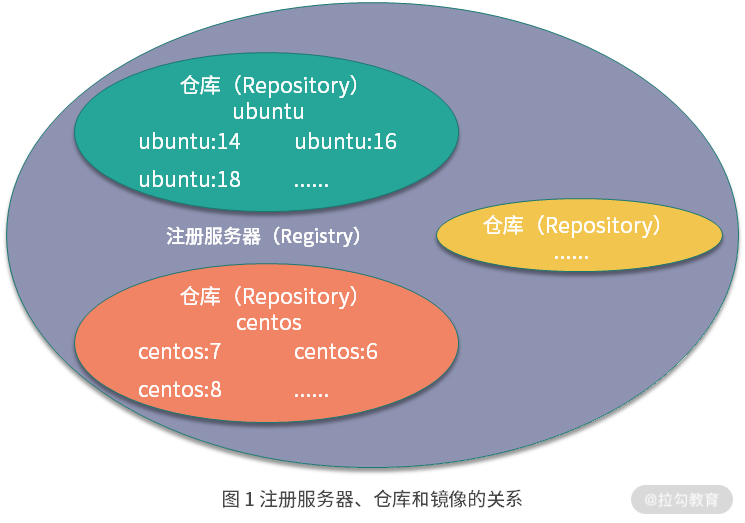
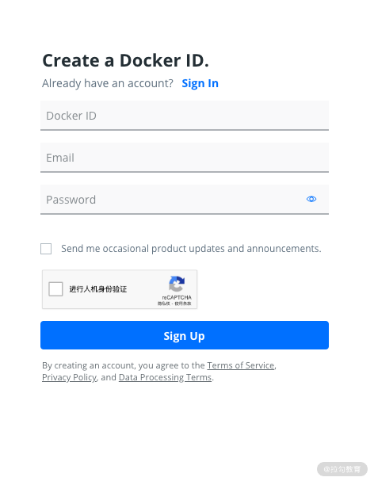
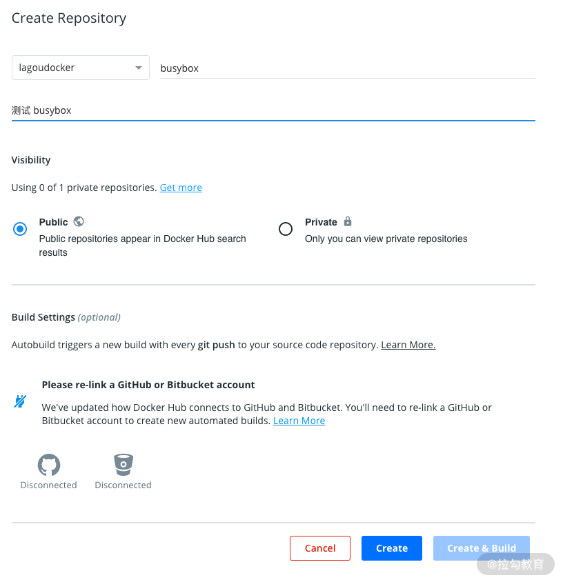

# 05 仓库访问：怎样搭建属于你的私有仓库？

在第三课时“镜像使用：Docker 环境下如何配置你的镜像？”里，我介绍了镜像的基本操作和镜像的原理，那么有了镜像，我们应该如何更好地存储和分发镜像呢？答案就是今天的主角——Docker 的镜像仓库。其实我们不仅可以使用公共镜像仓库存储和分发镜像，也可以自己搭建私有的镜像仓库，那在搭建之前，我们先回顾下仓库的基础知识。

### 仓库是什么？

仓库（Repository）是存储和分发 Docker 镜像的地方。镜像仓库类似于代码仓库，Docker Hub 的命名来自 GitHub，Github 是我们常用的代码存储和分发的地方。同样 Docker Hub 是用来提供 Docker 镜像存储和分发的地方。

有的同学可能经常分不清注册服务器（Registry）和仓库（Repository）的概念。在这里我可以解释下这两个概念的区别：注册服务器是存放仓库的实际服务器，而仓库则可以被理解为一个具体的项目或者目录；注册服务器可以包含很多个仓库，每个仓库又可以包含多个镜像。例如我的镜像地址为 docker.io/centos，docker.io 是注册服务器，centos 是仓库名。 它们之间的关系如图 1 所示。



按照类型，我们将镜像仓库分为公共镜像仓库和私有镜像仓库。

### 公共镜像仓库

公共镜像仓库一般是 Docker 官方或者其他第三方组织（阿里云，腾讯云，网易云等）提供的，允许所有人注册和使用的镜像仓库。

Docker Hub 是全球最大的镜像市场，目前已经有超过 10w 个容器镜像，这些容器镜像主要来自软件供应商、开源组织和社区。大部分的操作系统镜像和软件镜像都可以直接在 Docker Hub 下载并使用。


图 2 Docker Hub 镜像

下面我以 Docker Hub 为例，教你如何使用公共镜像仓库分发和存储镜像。

#### 注册 Docker Hub 账号

我们首先访问[Docker Hub](https://hub.docker.com/)官网，点击注册按钮进入注册账号界面。



图 3 注册 Docker Hub 账号

注册完成后，我们可以点击创建仓库，新建一个仓库用于推送镜像。



图 4 创建仓库

这里我的账号为 lagoudocker，创建了一个名称为 busybox 的仓库，创建好仓库后我们就可以推送本地镜像到这个仓库里了。下面我通过一个实例来演示一下如何推送镜像到自己的仓库中。

首先我们使用以下命令拉取 busybox 镜像：

```bash
$ docker pull busybox
Using default tag: latest
latest: Pulling from library/busybox
Digest: sha256:4f47c01fa91355af2865ac10fef5bf6ec9c7f42ad2321377c21e844427972977
Status: Image is up to date for busybox:latest
docker.io/library/busybox:latest
```

在推送镜像仓库前，我们需要使用`docker login`命令先登录一下镜像服务器，因为只有已经登录的用户才可以推送镜像到仓库。

```bash
$ docker login
Login with your Docker ID to push and pull images from Docker Hub. If you don't have a Docker ID, head over to https://hub.docker.com to create one.
Username: lagoudocker
Password:
Login Succeeded
```

使用`docker login`命令登录镜像服务器，这时 Docker 会要求我们输入用户名和密码，输入我们刚才注册的账号和密码，看到`Login Succeeded`表示登录成功。登录成功后就可以推送镜像到自己创建的仓库了。

> `docker login`命令默认会请求 Docker Hub，如果你想登录第三方镜像仓库或者自建的镜像仓库，在`docker login`后面加上注册服务器即可。例如我们想登录访问阿里云镜像服务器，则使用`docker login registry.cn-beijing.aliyuncs.com`，输入阿里云镜像服务的用户名密码即可。

在本地镜像推送到自定义仓库前，我们需要先把镜像“重命名”一下，才能正确推送到自己创建的镜像仓库中，使用`docker tag`命令将镜像“重命名”：

```bash
docker tag busybox lagoudocker/busybox
```

镜像“重命名”后使用`docker push`命令就可以推送镜像到自己创建的仓库中了。

```bash
$ docker push lagoudocker/busybox
The push refers to repository [docker.io/lagoudocker/busybox]
514c3a3e64d4: Mounted from library/busybox
latest: digest: sha256:400ee2ed939df769d4681023810d2e4fb9479b8401d97003c710d0e20f7c49c6 size: 527
```

此时，`busybox`这个镜像就被推送到自定义的镜像仓库了。这里我们也可以新建其他的镜像仓库，然后把自己构建的镜像推送到仓库中。 有时候，出于安全或保密的需求，你可能想要搭建一个自己的镜像仓库，下面我带你一步一步构建一个私有的镜像仓库。

### 搭建私有仓库

#### 启动本地仓库

Docker 官方提供了开源的镜像仓库 [Distribution](https://github.com/docker/distribution)，并且镜像存放在 Docker Hub 的 [Registry](https://hub.docker.com/_/registry) 仓库下供我们下载。

我们可以使用以下命令启动一个本地镜像仓库：

```bash
$ docker run -d -p 5000:5000 --name registry registry:2.7
Unable to find image 'registry:2.7' locally
2.7: Pulling from library/registry
cbdbe7a5bc2a: Pull complete
47112e65547d: Pull complete
46bcb632e506: Pull complete
c1cc712bcecd: Pull complete
3db6272dcbfa: Pull complete
Digest: sha256:8be26f81ffea54106bae012c6f349df70f4d5e7e2ec01b143c46e2c03b9e551d
Status: Downloaded newer image for registry:2.7
d7e449a8a93e71c9a7d99c67470bd7e7a723eee5ae97b3f7a2a8a1cf25982cc3
```

使用`docker ps`命令查看一下刚才启动的容器：

```bash
$ docker ps
CONTAINER ID        IMAGE               COMMAND                  CREATED             STATUS              PORTS                    NAMES
d7e449a8a93e        registry:2.7        "/entrypoint.sh /etc…"   50 seconds ago      Up 49 seconds       0.0.0.0:5000->5000/tcp   registry
```

此时我们就拥有了一个私有镜像仓库，访问地址为`localhost`，端口号为 5000。

#### 推送镜像到本地仓库

我们依旧使用 busybox 镜像举例。首先我们使用`docker tag`命令把 busybox 镜像"重命名"为`localhost:5000/busybox`

```bash
docker tag busybox localhost:5000/busybox
```

此时 Docker 为`busybox`镜像创建了一个别名`localhost:5000/busybox`，`localhost:5000`为主机名和端口，Docker 将会把镜像推送到这个地址。 使用`docker push`推送镜像到本地仓库：

```bash
$ docker push localhost:5000/busybox
The push refers to repository [localhost:5000/busybox]
514c3a3e64d4: Layer already exists
latest: digest: sha256:400ee2ed939df769d4681023810d2e4fb9479b8401d97003c710d0e20f7c49c6 size: 527
```

这里可以看到，我们已经可以把`busybox`推送到了本地镜像仓库。

此时，我们验证一下从本地镜像仓库拉取镜像。首先，我们删除本地的`busybox`和`localhost:5000/busybox`镜像。

```bash
$ docker rmi busybox localhost:5000/busybox
Untagged: busybox:latest
Untagged: [email protected]:4f47c01fa91355af2865ac10fef5bf6ec9c7f42ad2321377c21e844427972977
Untagged: localhost:5000/busybox:latest
Untagged: localhost:5000/[email protected]:400ee2ed939df769d4681023810d2e4fb9479b8401d97003c710d0e20f7c49c6
```

查看一下本地`busybox`镜像：

```bash
$ docker image ls busybox
REPOSITORY          TAG                 IMAGE ID            CREATED             SIZE
```

可以看到此时本地已经没有`busybox`这个镜像了。下面，我们从本地镜像仓库拉取`busybox`镜像：

```bash
$ docker pull localhost:5000/busybox
Using default tag: latest
latest: Pulling from busybox
Digest: sha256:400ee2ed939df769d4681023810d2e4fb9479b8401d97003c710d0e20f7c49c6
Status: Downloaded newer image for localhost:5000/busybox:latest
localhost:5000/busybox:latest
```

然后再使用`docker image ls busybox`命令，这时可以看到我们已经成功从私有镜像仓库拉取`busybox`镜像到本地了

#### 持久化镜像存储

我们知道，容器是无状态的。上面私有仓库的启动方式可能会导致镜像丢失，因为我们并没有把仓库的数据信息持久化到主机磁盘上，这在生产环境中是无法接受的。下面我们使用以下命令将镜像持久化到主机目录：

```bash
docker run -v /var/lib/registry/data:/var/lib/registry -d -p 5000:5000 --name registry registry:2.7
```

我们在上面启动`registry`的命令中加入了`-v /var/lib/registry/data:/var/lib/registry`，`-v`的含义是把 Docker 容器的某个目录或文件挂载到主机上，保证容器被重建后数据不丢失。`-v`参数冒号前面为主机目录，冒号后面为容器内目录。

> 事实上，registry 的持久化存储除了支持本地文件系统还支持很多种类型，例如 S3、Google Cloud Platform、Microsoft Azure Blob Storage Service 等多种存储类型。

到这里我们的镜像仓库虽然可以本地访问和拉取，但是如果你在另外一台机器上是无法通过 Docker 访问到这个镜像仓库的，因为 Docker 要求非`localhost`访问的镜像仓库必须使用 HTTPS，这时候就需要构建外部可访问的镜像仓库。

#### 构建外部可访问的镜像仓库

要构建一个支持 HTTPS 访问的安全镜像仓库，需要满足以下两个条件：

- 拥有一个合法的域名，并且可以正确解析到镜像服务器；
- 从证书颁发机构（CA）获取一个证书。

在准备好域名和证书后，就可以部署我们的镜像服务器了。这里我以`regisry.lagoudocker.io`这个域名为例。首先准备存放证书的目录`/var/lib/registry/certs`，然后把申请到的证书私钥和公钥分别放到该目录下。 假设我们申请到的证书文件分别为`regisry.lagoudocker.io.crt`和`regisry.lagoudocker.io.key`。

如果上一步启动的仓库容器还在运行，我们需要先停止并删除它。

```bash
docker stop registry && docker rm registry
```

然后使用以下命令启动新的镜像仓库：

```bash
$ docker run -d \
  --name registry \
  -v "/var/lib/registry/data:/var/lib/registry \
  -v "/var/lib/registry/certs:/certs \
  -e REGISTRY_HTTP_ADDR=0.0.0.0:443 \
  -e REGISTRY_HTTP_TLS_CERTIFICATE=/certs/regisry.lagoudocker.io.crt \
  -e REGISTRY_HTTP_TLS_KEY=/certs/regisry.lagoudocker.io.key \
  -p 443:443 \
  registry:2.7
```

这里，我们使用 -v 参数把镜像数据持久化在`/var/lib/registry/data`目录中，同时把主机上的证书文件挂载到了容器的 /certs 目录下，同时通过 -e 参数设置 HTTPS 相关的环境变量参数，最后让仓库在主机上监听 443 端口。

仓库启动后，我们就可以远程推送镜像了。

```bash
docker tag busybox regisry.lagoudocker.io/busybox
docker push regisry.lagoudocker.io/busybox
```

#### 私有仓库进阶

Docker 官方开源的镜像仓库`Distribution`仅满足了镜像存储和管理的功能，用户权限管理相对较弱，并且没有管理界面。

如果你想要构建一个企业的镜像仓库，[Harbor](https://goharbor.io/) 是一个非常不错的解决方案。Harbor 是一个基于`Distribution`项目开发的一款企业级镜像管理软件，拥有 RBAC （基于角色的访问控制）、管理用户界面以及审计等非常完善的功能。目前已经从 CNCF 毕业，这代表它已经有了非常高的软件成熟度。


图 5 Harbor 官网

Harbor 的使命是成为 Kubernetes 信任的云原生镜像仓库。 Harbor 需要结合 Kubernetes 才能发挥其最大价值，因此，在这里我就不展开介绍 Harbor 了。如果你对 Harbor 构建企业级镜像仓库感兴趣，可以到它的[官网](https://goharbor.io/)了解更多。

### 结语

到此，相信你不仅可以使用公共镜像仓库存储和拉取镜像，还可以自己动手搭建一个私有的镜像仓库。那当你使用 Docker Hub 拉取镜像很慢的时候，你知道如何加快镜像的拉取速度吗？思考后，可以把你的想法写在留言区。
