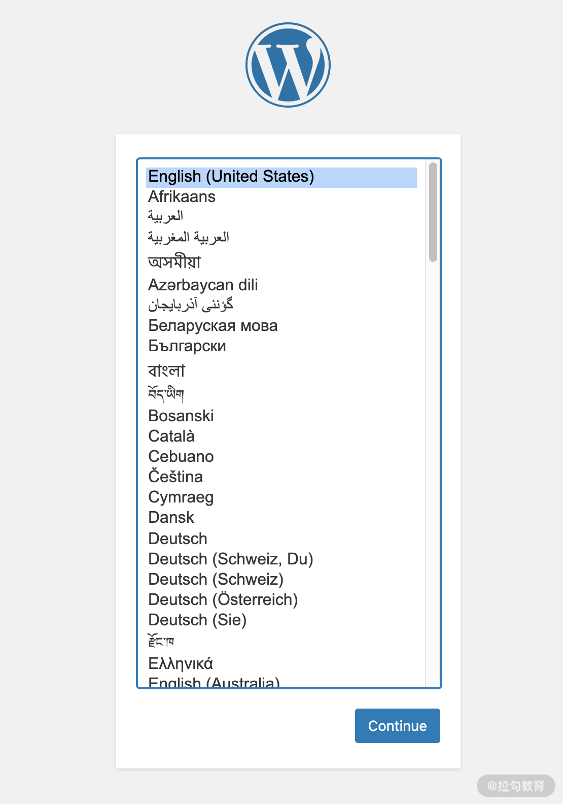

# 19 如何使用 Docker Compose 解决开发环境的依赖？

前两个模块，我们从 Docker 的基本操作到 Docker 的实现原理，为你一步一步揭开了 Docker 神秘的面纱。然而目前为止，我们所有的操作都是围绕单个容器进行的，但当我们的业务越来越复杂时，需要多个容器相互配合，甚至需要多个主机组成容器集群才能满足我们的业务需求，这个时候就需要用到容器的编排工具了。因为容器编排工具可以帮助我们批量地创建、调度和管理容器，帮助我们解决规模化容器的部署问题。

从这一课时开始，我将向你介绍 Docker 三种常用的编排工具：Docker Compose、Docker Swarm 和 Kubernetes。了解这些编排工具，可以让你在不同的环境中选择最优的编排框架。

本课时我们先来学习一个在开发时经常用到的编排工具——Docker Compose。合理地使用 Docker Compose 可以极大地帮助我们提升开发效率。那么 Docker Compose 究竟是什么呢？

### Docker Compose 的前世今生

Docker Compose 的前身是 Orchard 公司开发的 Fig，2014 年 Docker 收购了 Orchard 公司，然后将 Fig 重命名为 Docker Compose。现阶段 Docker Compose 是 Docker 官方的单机多容器管理系统，它本质是一个 Python 脚本，它通过解析用户编写的 yaml 文件，调用 Docker API 实现动态的创建和管理多个容器。

要想使用 Docker Compose，需要我们先安装一个 Docker Compose。

### 安装 Docker Compose

Docker Compose 可以安装在 macOS、 Windows 和 Linux 系统中，其中在 macOS 和 Windows 系统下 ，Docker Compose 都是随着 Docker 的安装一起安装好的，这里就不再详细介绍。 下面我重点介绍下如何在 Linux 系统下安装 Docker Compose。

#### Linux 系统下安装 Docker Compose

在安装 Docker Compose 之前，请确保你的机器已经正确运行了 Docker，如果你的机器还没有安装 Docker，请参考[官方网站](https://docs.docker.com/engine/install/)安装 Docker。

要在 Linux 平台上安装 Docker Compose，我们需要到 Compose 的 Github 页面下载对应版本的安装包。这里我以 1.27.3 版本为例，带你安装一个 Docker Compose。

（1）使用 curl 命令（一种发送 http 请求的命令行工具）下载 Docker Compose 的安装包：

```bash
sudo curl -L "https://github.com/docker/compose/releases/download/1.27.3/docker-compose-$(uname -s)-$(uname -m)" -o /usr/local/bin/docker-compose
```

> 如果你想要安装其他版本的 Docker Compose，将 1.27.3 替换为你想要安装的版本即可。

（2）修改 Docker Compose 执行权限：

```bash
sudo chmod +x /usr/local/bin/docker-compose
```

（3）检查 Docker Compose 是否安装成功：

```bash
$ docker-compose --version
docker-compose version 1.27.3, build 1110ad01
```

当我们执行完上述命令后，如果 Docker Compose 输出了当前版本号，就表示我们的 Docker Compose 已经安装成功。 Docker Compose 安装成功后，我们就可以很方便地使用它了。

在使用 Docker Compose 之前，我们首先需要先编写 Docker Compose 模板文件，因为 Docker Compose 运行的时候是根据 Docker Compose 模板文件中的定义来运行的。

下面我们首先来学习一下如何编写一个 Docker Compose 模板文件。

### 编写 Docker Compose 模板文件

在使用 Docker Compose 启动容器时， Docker Compose 会默认使用 docker-compose.yml 文件， docker-compose.yml 文件的格式为 yaml（类似于 json，一种标记语言）。

Docker Compose 模板文件一共有三个版本： v1、v2 和 v3。目前最新的版本为 v3，也是功能最全面的一个版本，下面我主要围绕 v3 版本介绍一下如何编写 Docker Compose 文件。

Docker Compose 文件主要分为三部分： services（服务）、networks（网络） 和 volumes（数据卷）。

- services（服务）：服务定义了容器启动的各项配置，就像我们执行`docker run`命令时传递的容器启动的参数一样，指定了容器应该如何启动，例如容器的启动参数，容器的镜像和环境变量等。
- networks（网络）：网络定义了容器的网络配置，就像我们执行`docker network create`命令创建网络配置一样。
- volumes（数据卷）：数据卷定义了容器的卷配置，就像我们执行`docker volume create`命令创建数据卷一样。

一个典型的 Docker Compose 文件结构如下：

```plaintext
version: "3"
services:
  nginx:
    ## ... 省略部分配置
networks:
  frontend:
  backend:
volumes:
  db-data:
```

下面我们首先来学习一下如何编写 services 部分的配置。

#### 编写 Service 配置

services 下，首先需要定义服务名称，例如你这个服务是 nginx 服务，你可以定义 service 名称为 nginx，格式如下：

```plaintext
version: "3.8"
services:
  nginx: 
```

服务名称定义完毕后，我们需要在服务名称的下一级定义当前服务的各项配置，使得我们的服务可以按照配置正常启动。常用的 16 种 service 配置如下。如果你比较了解，可以直接跳过看 Volume 配置和后续实操即可。

**build：** 用于构建 Docker 镜像，类似于`docker build`命令，build 可以指定 Dockerfile 文件路径，然后根据 Dockerfile 命令来构建文件。使用方法如下：

```bash
build:
  ## 构建执行的上下文目录
  context: .
  ## Dockerfile 名称
  dockerfile: Dockerfile-name
```

**cap_add、cap_drop：** 指定容器可以使用到哪些内核能力（capabilities）。使用格式如下：

```plaintext
cap_add:

- NET_ADMIN
  cap_drop:
- SYS_ADMIN
```

**command：** 用于覆盖容器默认的启动命令，它和 Dockerfile 中的 CMD 用法类似，也有两种使用方式：

```plaintext
command: sleep 3000
```


```plaintext
command: \["sleep", "3000"\]
```

**container_name：** 用于指定容器启动时容器的名称。使用格式如下：

```plaintext
container_name: nginx
```

**depends_on：** 用于指定服务间的依赖关系，这样可以先启动被依赖的服务。例如，我们的服务依赖数据库服务 db，可以指定 depends\_on 为 db。使用格式如下：

```plaintext
version: "3.8"
services:
my-web:
```

build: .

depends_on:

  - db

```plaintext
db:
```

image: mysql

```plaintext
``` **devices：** 挂载主机的设备到容器中。使用格式如下：
```

devices:

- "/dev/sba:/dev/sda"

``` **dns：** 自定义容器中的 dns 配置。

```plaintext
dns:

- 8.8.8.8
- 114.114.114.114
```

**dns_search：** 配置 dns 的搜索域。

```plaintext
dns_search:

- svc.cluster.com
- svc1.cluster.com
```

**entrypoint：** 覆盖容器的 entrypoint 命令。

```plaintext
entrypoint: sleep 3000
```

或

```plaintext
entrypoint: \["sleep", "3000"\]
```

**env_file：** 指定容器的环境变量文件，启动时会把该文件中的环境变量值注入容器中。

```plaintext
env_file:

- ./dbs.env
```

env 文件的内容格式如下：

```plaintext
KEY_ENV=values
```

**environment：** 指定容器启动时的环境变量。

```plaintext
environment:

- KEY_ENV=values
```

**image：** 指定容器镜像的地址。

```plaintext
image: busybox:latest
```

**pid：** 共享主机的进程命名空间，像在主机上直接启动进程一样，可以看到主机的进程信息。

```plaintext
pid: "host"
```

**ports：** 暴露端口信息，使用格式为 HOST:CONTAINER，前面填写要映射到主机上的端口，后面填写对应的容器内的端口。

```plaintext
ports:

- "1000"
- "1000-1005"
- "8080:8080"
- "8888-8890:8888-8890"
- "2222:22"
- "127.0.0.1:9999:9999"
- "127.0.0.1:3000-3005:3000-3005"
- "6789:6789/udp"
```

**networks：** 这是服务要使用的网络名称，对应顶级的 networks 中的配置。

```plaintext
services:
my-service:
```

networks:

 - hello-network

 - hello1-network

```bash
``` **volumes：** 不仅可以挂载主机数据卷到容器中，也可以直接挂载主机的目录到容器中，使用方式类似于使用`docker run`启动容器时添加 -v 参数。
```

version: "3"

services:

  db:

    image: mysql:5.6

    volumes:

      - type: volume

        source: /var/lib/mysql

        target: /var/lib/mysql

```plaintext
volumes 除了上面介绍的长语法外，还支持短语法的书写方式，例如上面的写法可以精简为：
```

version: "3"

services:

  db:

    image: mysql:5.6

    volumes:

      - /var/lib/mysql:/var/lib/mysql

```plaintext
#### 编写 Volume 配置

如果你想在多个容器间共享数据卷，则需要在外部声明数据卷，然后在容器里声明使用数据卷。例如我想在两个服务间共享日志目录，则使用以下配置：
```

version: "3"

services:

  my-service1:

    image: service:v1

    volumes:

      - type: volume

        source: logdata

        target: /var/log/mylog

  my-service2:

    image: service:v2

    volumes:

      - type: volume

        source: logdata

        target: /var/log/mylog

volumes:

  logdata:

```bash
#### 编写 Network 配置

Docker Compose 文件顶级声明的 networks 允许你创建自定义的网络，类似于`docker network create`命令。
例如你想声明一个自定义 bridge 网络配置，并且在服务中使用它，使用格式如下：
```

version: "3"

services:

  web:

    networks:

      mybridge: 

        ipv4_address: 172.16.1.11

networks:

  mybridge:

    driver: bridge

    ipam: 

      driver: default

      config:

        subnet: 172.16.1.0/24

```bash
编写完 Docker Compose 模板文件后，需要使用 docker-compose 命令来运行这些文件。下面我们来学习下 docker-compose 都有哪些操作命令。

### Docker Compose 操作命令

我们可以使用`docker-compose -h`命令来查看 docker-compose 的用法，docker-compose 的基本使用格式如下：
```

docker-compose [-f <arg>...] [options] [--] [COMMAND] [ARGS...]

```bash
其中 options 是 docker-compose 的参数，支持的参数和功能说明如下：
```

-f, --file FILE             指定 docker-compose 文件，默认为 docker-compose.yml

  -p, --project-name NAME     指定项目名称，默认使用当前目录名称作为项目名称

  --verbose                   输出调试信息

  --log-level LEVEL           日志级别 (DEBUG, INFO, WARNING, ERROR, CRITICAL)

  -v, --version               输出当前版本并退出

  -H, --host HOST             指定要连接的 Docker 地址

  --tls                       启用 TLS 认证

  --tlscacert CA_PATH         TLS CA 证书路径

  --tlscert CLIENT_CERT_PATH  TLS 公钥证书问价

  --tlskey TLS_KEY_PATH       TLS 私钥证书文件

  --tlsverify                 使用 TLS 校验对端

  --skip-hostname-check       不校验主机名

  --project-directory PATH    指定工作目录，默认是 Compose 文件所在路径。

```bash
COMMAND 为 docker-compose 支持的命令。支持的命令如下：
```

build              构建服务

  config             校验和查看 Compose 文件

  create             创建服务

  down               停止服务，并且删除相关资源

  events             实时监控容器的时间信息

  exec               在一个运行的容器中运行指定命令

  help               获取帮助

  images             列出镜像

  kill               杀死容器

  logs               查看容器输出

  pause              暂停容器

  port               打印容器端口所映射出的公共端口

  ps                 列出项目中的容器列表

  pull               拉取服务中的所有镜像

  push               推送服务中的所有镜像

  restart            重启服务

  rm                 删除项目中已经停止的容器

  run                在指定服务上运行一个命令

  scale              设置服务运行的容器个数

  start              启动服务

  stop               停止服务

  top                限制服务中正在运行中的进程信息

  unpause            恢复暂停的容器

  up                 创建并且启动服务

  version            打印版本信息并退出

```bash
好了，学习完 Docker Compose 模板的编写和 docker-compose 命令的使用方法，下面我们编写一个 Docker Compose 模板文件，实现一键启动 WordPress 服务（一种博客系统），来搭建一个属于我们自己的博客系统。

### 使用 Docker Compose 管理 WordPress

#### 启动 WordPress

第一步，创建项目目录。首先我们在 /tmp 目录下创建一个 WordPress 的目录，这个目录将作为我们的工作目录。
```

mkdir /tmp/wordpress

```plaintext
第二步，进入工作目录。
```

cd /tmp/wordpress

```bash
第三步，创建 docker-compose.yml 文件。
```

touch docker-compose.yml

```plaintext
然后写入以下内容：
```

version: '3'

services:

   mysql:

     image: mysql:5.7

     volumes:

       - mysql_data:/var/lib/mysql

     restart: always

     environment:

       MYSQL_ROOT_PASSWORD: root

       MYSQL_DATABASE: mywordpress

       MYSQL_USER: mywordpress

       MYSQL_PASSWORD: mywordpress

   wordpress:

     depends_on:

       - mysql

     image: wordpress:php7.4

     ports:

       - "8080:80"

     restart: always

     environment:

       WORDPRESS_DB_HOST: mysql:3306

       WORDPRESS_DB_USER: mywordpress

       WORDPRESS_DB_PASSWORD: mywordpress

       WORDPRESS_DB_NAME: mywordpress

volumes:

    mysql_data: {}

```plaintext
第四步，启动 MySQL 数据库和 WordPress 服务。
```

$ docker-compose up -d

Starting wordpress_mysql_1 ... done

Starting wordpress_wordpress_1 ... done

```bash
执行完以上命令后，Docker Compose 首先会为我们启动一个 MySQL 数据库，按照 MySQL 服务中声明的环境变量来设置 MySQL 数据库的用户名和密码。然后等待 MySQL 数据库启动后，再启动 WordPress 服务。WordPress 服务启动后，我们就可以通过 [http://localhost:8080](http://localhost:8080/) 访问它了，访问成功后，我们就可以看到以下界面，然后按照提示一步一步设置就可以拥有属于自己的专属博客系统了。

图 1 WordPress 启动界面

#### 停止 WordPress

如果你不再需要 WordPress 服务了，可以使用`docker-compose stop`命令来停止已启动的服务。
```

$ docker-compose stop

Stopping wordpress_wordpress_1 ... done

Stopping wordpress_mysql_1     ... done
```

### 结语

Docker Compose 是一个用来定义复杂应用的单机编排工具，通常用于服务依赖关系复杂的开发和测试环境，如果你还在为配置复杂的开发环境而烦恼，Docker Compose 可以轻松帮你搞定复杂的开发环境。你只需要把复杂的开发环境使用 Docker Compose 模板文件描述出来，之后无论你在哪里可以轻松的一键启动开发和测试环境，极大地提高了我们的开发效率，同时也避免了污染我们开发机器的配置。

那么，学完本课时的课程，你可以试着使用 Docker Compose 一键启动一个 [LNMP](https://baike.baidu.com/item/LNMP) 开发环境吗？

下一课时，我将为你讲解容器的另一个编排系统 Docker Swarm。
