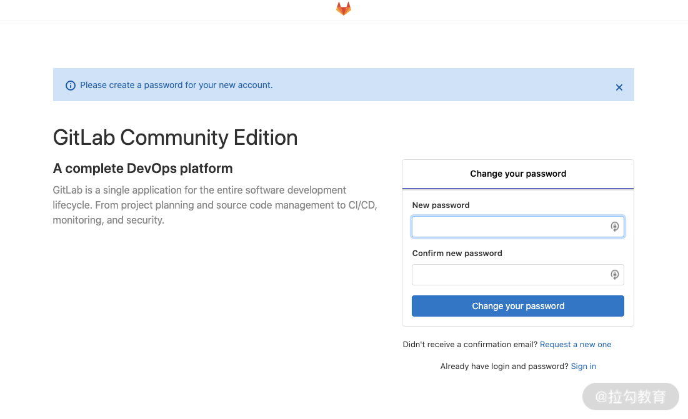
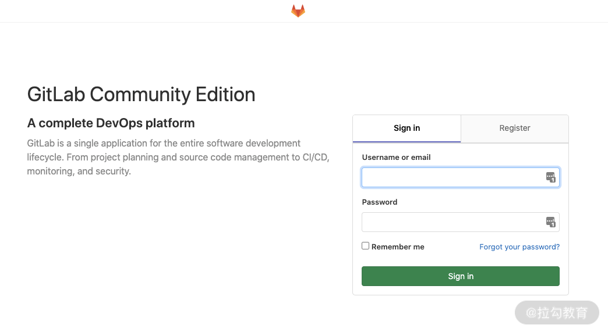
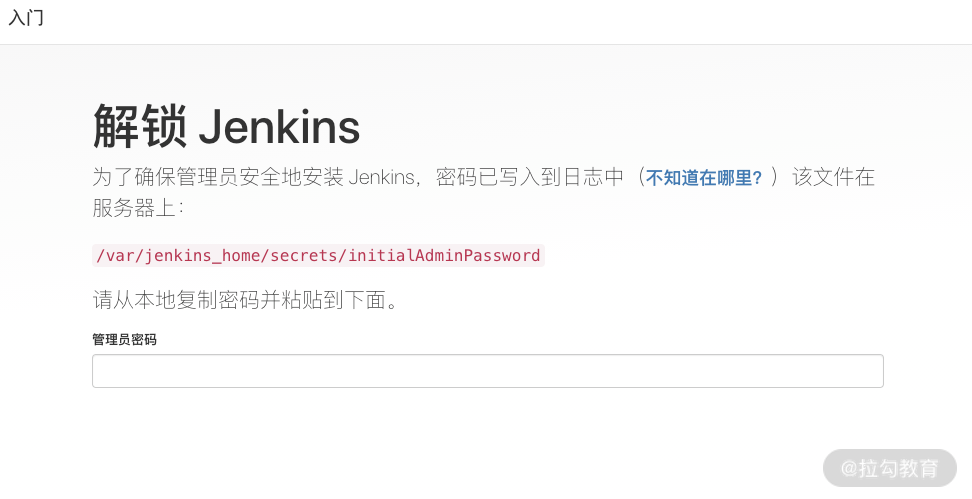
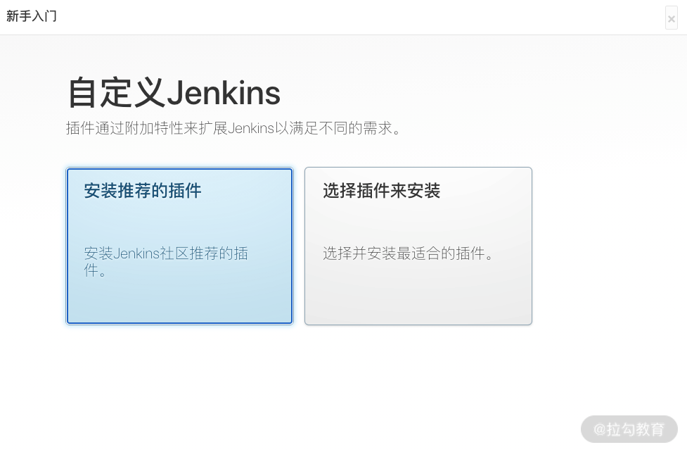
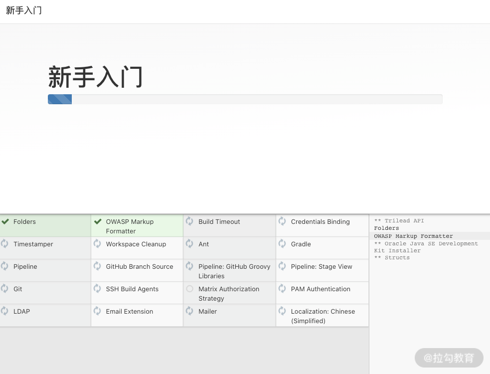
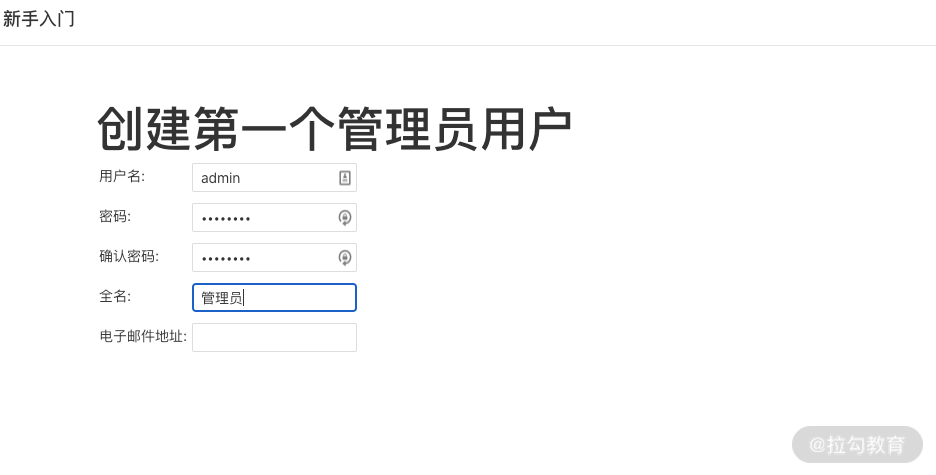
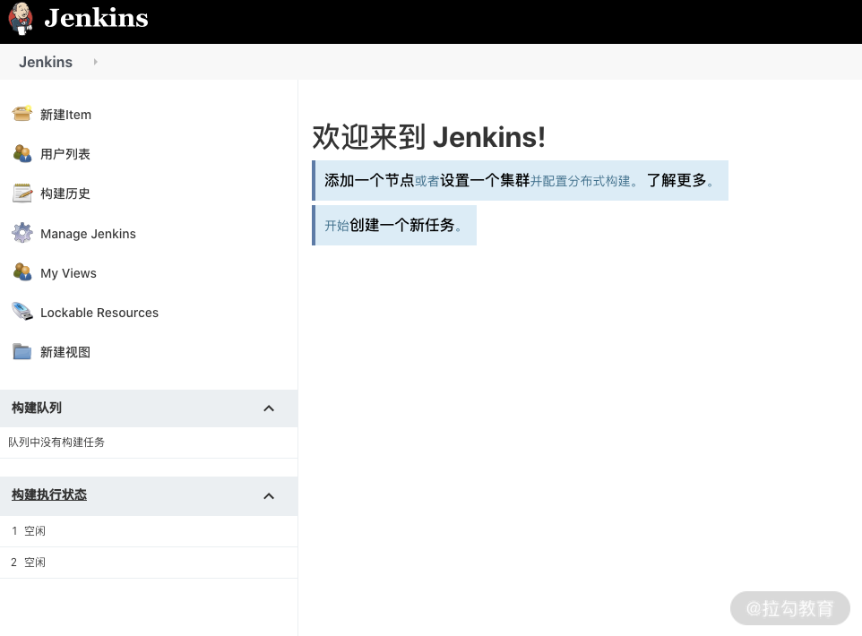
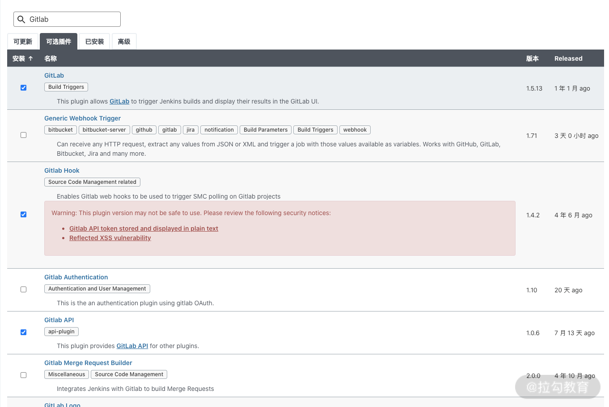
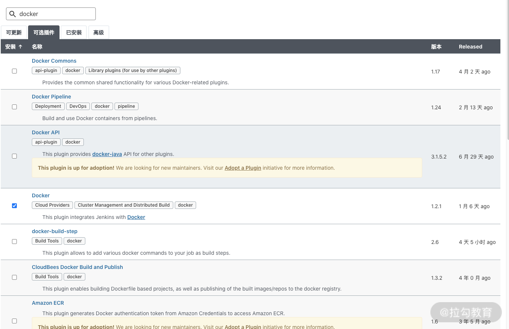

# 24 CICD：容器化后如何实现持续集成与交付？（上）

上一讲，我介绍了 DevOps 的概念与 DevOps 的一些思想。DevOps 的思想可以帮助我们缩短上线周期并且提高软件迭代速度，而 CI/CD 则是 DevOps 思想中最重要的部分。

具体来说，CI/CD 是一种通过在应用开发阶段，引入自动化的手段来频繁地构建应用，并且向客户交付应用的方法。它的核心理念是持续开发、持续部署以及持续交付，它还可以让自动化持续交付贯穿于整个应用生命周期，使得开发和运维统一参与协同支持。

下面我们来详细了解下 CI/CD 。

### 什么是 CI/CD

#### CI 持续集成（Continuous Integration）

随着软件功能越来越复杂，一个大型项目要想在规定时间内顺利完成，就需要多位开发人员协同开发。但是，如果我们每个人都负责开发自己的代码，然后集中在某一天将代码合并在一起（称为“合并日”）。你会发现，代码可能会有很多冲突和编译问题，而这个处理过程十分烦琐、耗时，并且需要每一位工程师确认代码是否被覆盖，代码是否完整。这种情况显然不是我们想要看到的，这时持续集成（CI）就可以很好地帮助我们解决这个问题。

CI 持续集成要求开发人员频繁地（甚至是每天）将代码提交到共享分支中。一旦开发人员的代码被合并，将会自动触发构建流程来构建应用，并通过触发自动化测试（单元测试或者集成测试）来验证这些代码的提交，确保这些更改没有对应用造成影响。如果发现提交的代码在测试过程中或者构建过程中有问题，则会马上通知研发人员确认，修改代码并重新提交。通过将以往的定期合并代码的方式，改变为频繁提交代码并且自动构建和测试的方式，可以帮助我们 **及早地发现问题和解决冲突，减少代码出错。**

传统 CI 流程的实现十分复杂，无法做到标准化交付，而当我们的应用容器化后，应用构建的结果就是 Docker 镜像。代码检查完毕没有缺陷后合并入主分支。此时启动构建流程，构建系统会自动将我们的应用打包成 Docker 镜像，并且推送到镜像仓库。

#### CD 持续交付（Continuous Delivery）

当我们每次完成代码的测试和构建后，我们需要将编译后的镜像快速发布到测试环境，这时我们的持续交付就登场了。持续交付要求我们实现自动化准备测试环境、自动化测试应用、自动化监控代码质量，并且自动化交付生产环境镜像。

在以前，测试环境的构建是非常耗时的，并且很难保证测试环境和研发环境的一致性。但现在，借助于容器技术，我们可以很方便地构建出一个测试环境，并且可以保证开发和测试环境的一致性，这样不仅可以提高测试效率，还可以提高敏捷性。

容器化后的应用交付过程是这样的，我们将测试的环境交由 QA 来维护，当我们确定好本次上线要发布的功能列表时，我们将不同开发人员开发的 feature 分支的代码合并到 release 分支。然后由 QA 来将构建镜像部署到测试环境，结合自动测试和人工测试、自动检测和人工记录，形成完整的测试报告，并且把测试过程中遇到的问题交由开发人员修改，开发修改无误后再次构建测试环境进行测试。测试没有问题后，自动交付生产环境的镜像到镜像仓库。

#### CD 持续部署（Continuous Deployment）

CD 不仅有持续交付的含义，还代表持续部署。经测试无误打包完生产环境的镜像后，我们需要把镜像部署到生产环境，持续部署是最后阶段，它作为持续交付的延伸，可以自动将生产环境的镜像发布到生产环境中。

部署业务首先需要我们有一个资源池，实现资源自动化供给，而且有的应用还希望有自动伸缩的能力，根据外部流量自动调整容器的副本数，而这一切在容器云中都将变得十分简单。

我们可以想象，如果有客户提出了反馈，我们通过持续部署在几分钟内，就能在更改完代码的情况下，将新的应用版本发布到生产环境中（假设通过了自动化测试），这时我们就可以实现快速迭代，持续接收和整合用户的反馈，将用户体验做到极致。

讲了这么多概念，也许你会感觉比较枯燥乏味。下面我们就动动手，利用一些工具搭建一个 DevOps 环境。

搭建 DevOps 环境的工具非常多，这里我选择的工具为 Jenkins、Docker 和 GitLab。Jenkins 和 Docker 都已经介绍过了，这里我再介绍一下 Gitlab。

Gitlab 是由 Gitlab Inc. 开发的一款基于 Git 的代码托管平台，它的功能和 GitHub 类似，可以帮助我们存储代码。除此之外，GitLab 还具有在线编辑 wiki、issue 跟踪等功能，另外最新版本的 GitLab 还集成了 CI/CD 功能，不过这里我们仅仅使用 GitLab 的代码存储功能， CI/CD 还是交给我们的老牌持续集成工具 Jenkins 来做。

### Docker+Jenkins+GitLab 搭建 CI/CD 系统

软件安装环境如下。

- 操作系统：CentOS 7
- Jenkins：tls 长期维护版
- Docker：18.06
- GitLab：13.3.8-ce.0

#### 第一步：安装 Docker

安装 Docker 的步骤可以在\[第一讲\]的内容中找到，这里就不再赘述。Docker 环境准备好后，我们就可以利用 Docker 来部署 GitLab 和 Jenkins 了。

#### 第二步：安装 GitLab

GitLab 官方提供了 GitLab 的 Docker 镜像，因此我们只需要执行以下命令就可以快速启动一个 GitLab 服务了。

```bash
$ docker run -d \
--hostname localhost \
-p 8080:80 -p 2222:22 \
--name gitlab \
--restart always \
--volume /tmp/gitlab/config:/etc/gitlab \
--volume /tmp/gitlab/logs:/var/log/gitlab \
--volume /tmp/gitlab/data:/var/opt/gitlab \
gitlab/gitlab-ce:13.3.8-ce.0
```

这个启动过程可能需要几分钟的时间。当服务启动后我们就可以通过 [http://localhost:8080](http://localhost:8080/) 访问到我们的 GitLab 服务了。



图1 GitLab 设置密码界面

第一次登陆，GitLab 会要求我们设置管理员密码，我们输入管理员密码后点击确认即可，之后 GitLab 会自动跳转到登录页面。



图2 GitLab 登录界面

然后输入默认管理员用户名：[\[email protected\]](/cdn-cgi/l/email-protection)，密码为我们上一步设置的密码。点击登录即可登录到系统中，至此，GitLab 已经安装成功。

#### 第三步：安装 Jenkins

Jenkins 官方提供了 Jenkins 的 Docker 镜像，我们使用 Jenkins 镜像就可以一键启动一个 Jenkins 服务。命令如下：

```bash
# docker run -d --name=jenkins \
-p 8888:8080 \
-u root \
--restart always \
-v /var/run/docker.sock:/var/run/docker.sock \
-v /usr/bin/docker:/usr/bin/docker \
-v /tmp/jenkins_home:/var/jenkins_home \
jenkins/jenkins:lts
```

> 这里，我将 docker.sock 和 docker 二进制挂载到了 Jenkins 容器中，是为了让 Jenkins 可以直接调用 docker 命令来构建应用镜像。

Jenkins 的默认密码会在容器启动后打印在容器的日志中，我们可以通过以下命令找到 Jenkins 的默认密码，星号之间的类似于一串 UUID 的随机串就是我们的密码。

```bash
$ docker logs -f jenkins
unning from: /usr/share/jenkins/jenkins.war
webroot: EnvVars.masterEnvVars.get("JENKINS_HOME")
2020-10-31 16:13:06.472+0000 [id=1] INFO org.eclipse.jetty.util.log.Log#initialized: Logging initialized @292ms to org.eclipse.jetty.util.log.JavaUtilLog
2020-10-31 16:13:06.581+0000 [id=1] INFO winstone.Logger#logInternal: Beginning extraction from war file
2020-10-31 16:13:08.369+0000 [id=1] WARNING o.e.j.s.handler.ContextHandler#setContextPath: Empty contextPath
... 省略部分启动日志
Jenkins initial setup is required. An admin user has been created and a password generated.
Please use the following password to proceed to installation: ****  ****  ****  ****  ****  ****  ****  ****  ****  ****  ****  ****  ****  ****  ****  ****  ****  ****  ****  ****  ****  ****  ****  ****  ****  ****  ****  ****  ****  ****  ****  ****  ****  ****  ****  ****  ****  ****  ****  ****  ****  ****  ****  ****  **** ***Jenkins initial setup is required. An admin user has been created and a password generated.
Please use the following password to proceed to installation:
fb3499944e4845bba9d4b7d9eb4e3932
This may also be found at: /var/jenkins_home/secrets/initialAdminPassword ****  ****  ****  ****  ****  ****  ****  ****  ****  ****  ****  ****  ****  ****  ****  ****  ****  ****  ****  ****  ****  ****  ****  ****  ****  ****  ****  ****  ****  ****  ****  ****  ****  ****  ****  ****  ****  ****  ****  ****  ****  ****  ****  ****  **** ***
This may also be found at: /var/jenkins_home/secrets/initialAdminPassword
2020-10-31 16:17:07.577+0000 [id=28] INFO jenkins.InitReactorRunner$1#onAttained: Completed initialization
2020-10-31 16:17:07.589+0000 [id=21] INFO hudson.WebAppMain$3#run: Jenkins is fully up and running
```

之后，我们通过访问 [http://localhost:8888](http://localhost:8888/) 就可以访问到 Jenkins 服务了。



图3 Jenkins 登录界面

然后将日志中的密码粘贴到密码框即可，之后 Jenkins 会自动初始化，我们根据引导，安装推荐的插件即可。



图4 Jenkins 引导页面

选择好安装推荐的插件后，Jenkins 会自动开始初始化一些常用插件。界面如下：



图5 Jenkins 插件初始化

插件初始化完后，创建管理员账户和密码，输入用户名、密码和邮箱等信息，然后点击保存并完成即可。



图6 Jenkins 创建管理员

这里，确认 Jenkins 地址，我们就可以进入到 Jenkins 主页了。



图7 Jenkins 主页

然后在系统管理 -> 插件管理 -> 可选插件处，搜索 GitLab 和 Docker ，分别安装相关插件即可，以便我们的 Jenkins 服务和 GitLab 以及 Docker 可以更好地交互。

 

图8 Jenkins 插件安装

等待插件安装完成， 重启 Jenkins ，我们的 Jenkins 环境就准备完成了。

现在，我们的 Docker+Jenkins+GitLab 环境已经准备完成，后面只需要把我们的代码推送到 GitLab 中，并做相关的配置即可实现推送代码自动构建镜像和发布。

### 结语

Docker 的出现解决了 CI/CD 流程中的各种问题，Docker 交付的镜像不仅包含应用程序，也包含了应用程序的运行环境，这很好地解决了开发和线上环境不一致问题。同时 Docker 的出现也极大地提升了 CI/CD 的构建效率，我们仅仅需要编写一个 Dockerfile 并将 Dockerfile 提交到我们的代码仓库即可快速构建出我们的应用，最后，当我们构建好 Docker 镜像后 Docker 可以帮助我们快速发布及更新应用。

那么，你知道 Docker 还可以帮助我们解决 CI/CD 流程中的哪些问题吗？
