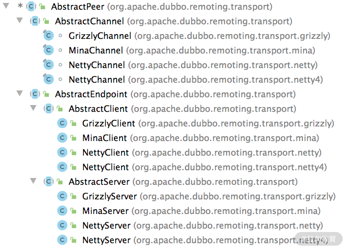
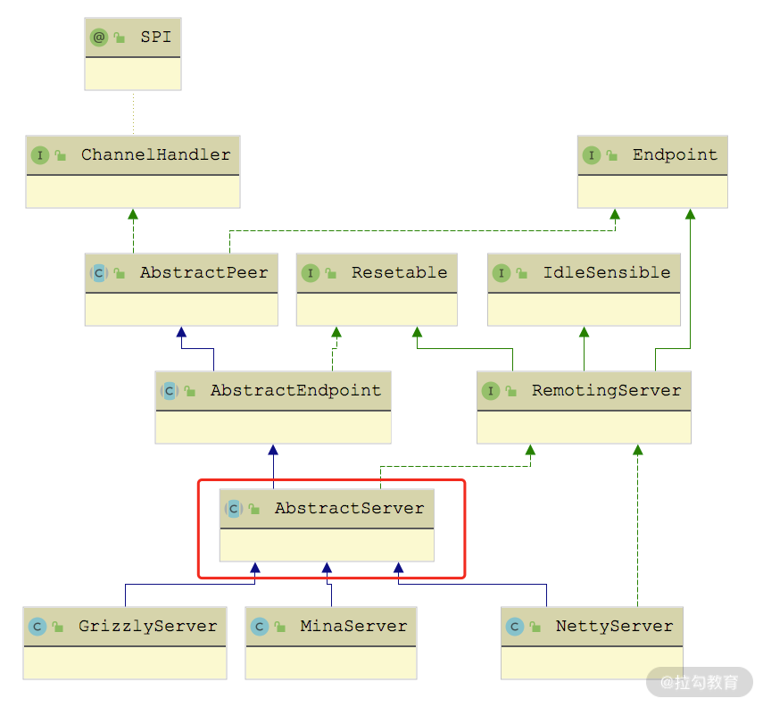
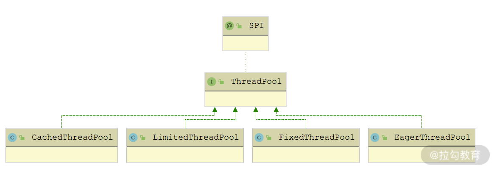
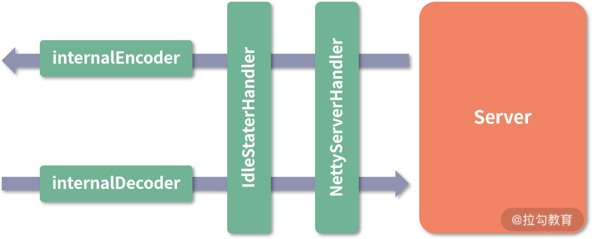
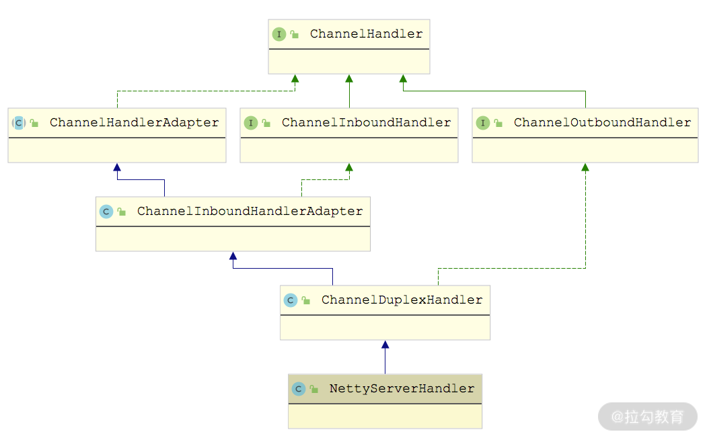
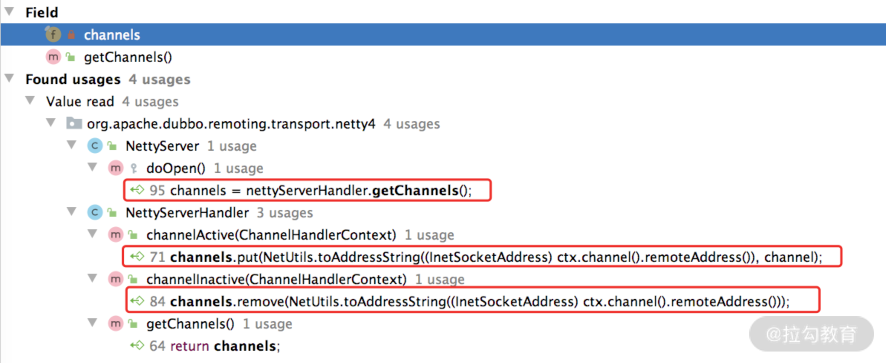
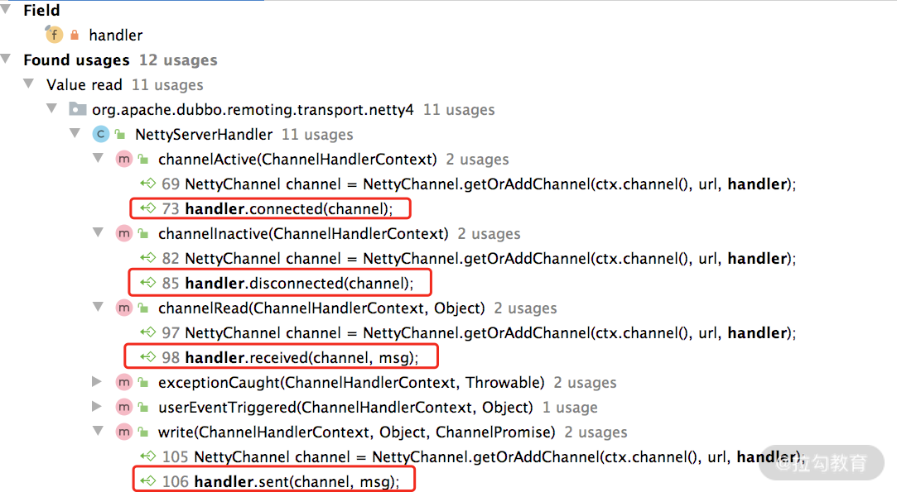
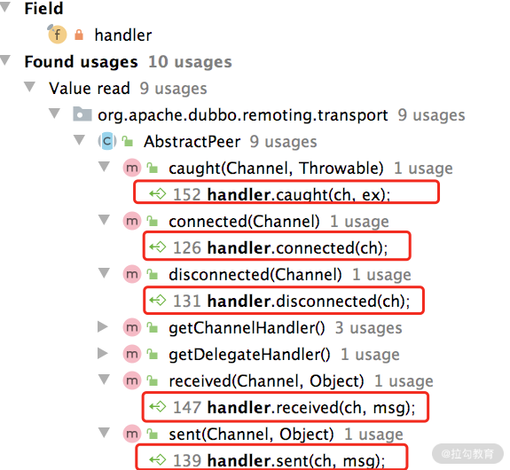
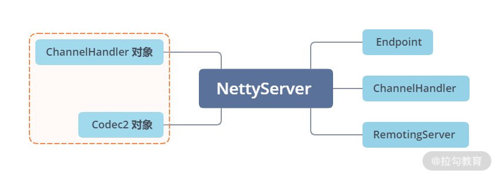

# 19 Transporter 层核心实现：编解码与线程模型一文打尽（上）

在第 17 课时中，我们详细介绍了 dubbo-remoting-api 模块中 Transporter 相关的核心抽象接口，本课时将继续介绍 dubbo-remoting-api 模块的其他内容。这里我们依旧从 Transporter 层的 RemotingServer、Client、Channel、ChannelHandler 等核心接口出发，介绍这些核心接口的实现。

### AbstractPeer 抽象类

首先，我们来看 AbstractPeer 这个抽象类，它同时实现了 Endpoint 接口和 ChannelHandler 接口，如下图所示，它也是 AbstractChannel、AbstractEndpoint 抽象类的父类。



AbstractPeer 继承关系

> Netty 中也有 ChannelHandler、Channel 等接口，但无特殊说明的情况下，这里的接口指的都是 Dubbo 中定义的接口。如果涉及 Netty 中的接口，会进行特殊说明。

AbstractPeer 中有四个字段：一个是表示该端点自身的 URL 类型的字段，还有两个 Boolean 类型的字段（closing 和 closed）用来记录当前端点的状态，这三个字段都与 Endpoint 接口相关；第四个字段指向了一个 ChannelHandler 对象，AbstractPeer 对 ChannelHandler 接口的所有实现，都是委托给了这个 ChannelHandler 对象。从上面的继承关系图中，我们可以得出这样一个结论：AbstractChannel、AbstractServer、AbstractClient 都是要关联一个 ChannelHandler 对象的。

### AbstractEndpoint 抽象类

我们顺着上图的继承关系继续向下看，AbstractEndpoint 继承了 AbstractPeer 这个抽象类。AbstractEndpoint 中维护了一个 Codec2 对象（codec 字段）和两个超时时间（timeout 字段和 connectTimeout 字段），在 AbstractEndpoint 的构造方法中会根据传入的 URL 初始化这三个字段：

```plaintext
public AbstractEndpoint(URL url, ChannelHandler handler) {
    super(url, handler); // 调用父类AbstractPeer的构造方法
    // 根据URL中的codec参数值，确定此处具体的Codec2实现类
    this.codec = getChannelCodec(url);
    // 根据URL中的timeout参数确定timeout字段的值，默认1000
    this.timeout = url.getPositiveParameter(TIMEOUT_KEY,
         DEFAULT_TIMEOUT);
    // 根据URL中的connect.timeout参数确定connectTimeout字段的值，默认3000
    this.connectTimeout = url.getPositiveParameter(
    Constants.CONNECT_TIMEOUT_KEY, Constants.DEFAULT_CONNECT_TIMEOUT);
}
```

在\[第 17 课时\]介绍 Codec2 接口的时候提到它是一个 SPI 扩展点，这里的 AbstractEndpoint.getChannelCodec() 方法就是基于 Dubbo SPI 选择其扩展实现的，具体实现如下：

```java
protected static Codec2 getChannelCodec(URL url) {
    // 根据URL的codec参数获取扩展名
    String codecName = url.getParameter(Constants.CODEC_KEY, "telnet");
    if (ExtensionLoader.getExtensionLoader(Codec2.class).hasExtension(codecName)) { // 通过ExtensionLoader加载并实例化Codec2的具体扩展实现
        return ExtensionLoader.getExtensionLoader(Codec2.class).getExtension(codecName);
    } else { // Codec2接口不存在相应的扩展名，就尝试从Codec这个老接口的扩展名中查找，目前Codec接口已经废弃了，所以省略这部分逻辑
    }
}
```

另外，AbstractEndpoint 还实现了 Resetable 接口（只有一个 reset() 方法需要实现），虽然 AbstractEndpoint 中的 reset() 方法比较长，但是逻辑非常简单，就是根据传入的 URL 参数重置 AbstractEndpoint 的三个字段。下面是重置 codec 字段的代码片段，还是调用 getChannelCodec() 方法实现的：

```java
public void reset(URL url) {
    // 检测当前AbstractEndpoint是否已经关闭(略)
    // 省略重置timeout、connectTimeout两个字段的逻辑
    try {
        if (url.hasParameter(Constants.CODEC_KEY)) {
            this.codec = getChannelCodec(url);
        }
    } catch (Throwable t) {
        logger.error(t.getMessage(), t);
    }
}
```

### Server 继承路线分析

AbstractServer 和 AbstractClient 都实现了 AbstractEndpoint 抽象类，我们先来看 AbstractServer 的实现。AbstractServer 在继承了 AbstractEndpoint 的同时，还实现了 RemotingServer 接口，如下图所示：



AbstractServer 继承关系图

**AbstractServer 是对服务端的抽象，实现了服务端的公共逻辑** 。AbstractServer 的核心字段有下面几个。

- localAddress、bindAddress（InetSocketAddress 类型）：分别对应该 Server 的本地地址和绑定的地址，都是从 URL 中的参数中获取。bindAddress 默认值与 localAddress 一致。
- accepts（int 类型）：该 Server 能接收的最大连接数，从 URL 的 accepts 参数中获取，默认值为 0，表示没有限制。
- executorRepository（ExecutorRepository 类型）：负责管理线程池，后面我们会深入介绍 ExecutorRepository 的具体实现。
- executor（ExecutorService 类型）：当前 Server 关联的线程池，由上面的 ExecutorRepository 创建并管理。

在 AbstractServer 的构造方法中会根据传入的 URL初始化上述字段，并调用 doOpen() 这个抽象方法完成该 Server 的启动，具体实现如下：

```java
public AbstractServer(URL url, ChannelHandler handler) {
    super(url, handler); // 调用父类的构造方法
    // 根据传入的URL初始化localAddress和bindAddress
    localAddress = getUrl().toInetSocketAddress();
    String bindIp = getUrl().getParameter(Constants.BIND_IP_KEY, getUrl().getHost());
    int bindPort = getUrl().getParameter(Constants.BIND_PORT_KEY, getUrl().getPort());
    if (url.getParameter(ANYHOST_KEY, false) || NetUtils.isInvalidLocalHost(bindIp)) {
        bindIp = ANYHOST_VALUE;
    }
    bindAddress = new InetSocketAddress(bindIp, bindPort);
    // 初始化accepts等字段
    this.accepts = url.getParameter(ACCEPTS_KEY, DEFAULT_ACCEPTS);
    this.idleTimeout = url.getParameter(IDLE_TIMEOUT_KEY, DEFAULT_IDLE_TIMEOUT);
    try {
        doOpen(); // 调用doOpen()这个抽象方法，启动该Server
    } catch (Throwable t) {
        throw new RemotingException("...");
    }
    // 获取该Server关联的线程池
    executor = executorRepository.createExecutorIfAbsent(url);
}
```

#### ExecutorRepository

在继续分析 AbstractServer 的具体实现类之前，我们先来了解一下 ExecutorRepository 这个接口。

ExecutorRepository 负责创建并管理 Dubbo 中的线程池，该接口虽然是个 SPI 扩展点，但是只有一个默认实现—— DefaultExecutorRepository。在该默认实现中维护了一个 ConcurrentMap\<String, ConcurrentMap\<Integer, ExecutorService>> 集合（data 字段）缓存已有的线程池，第一层 Key 值表示线程池属于 Provider 端还是 Consumer 端，第二层 Key 值表示线程池关联服务的端口。

DefaultExecutorRepository.createExecutorIfAbsent() 方法会根据 URL 参数创建相应的线程池并缓存在合适的位置，具体实现如下：

```java
public synchronized ExecutorService createExecutorIfAbsent(URL url) {
    // 根据URL中的side参数值决定第一层key
    String componentKey = EXECUTOR_SERVICE_COMPONENT_KEY;
    if (CONSUMER_SIDE.equalsIgnoreCase(url.getParameter(SIDE_KEY))) {
        componentKey = CONSUMER_SIDE; 
    }
    Map<Integer, ExecutorService> executors = data.computeIfAbsent(componentKey, k -> new ConcurrentHashMap<>());
    // 根据URL中的port值确定第二层key
    Integer portKey = url.getPort();
    ExecutorService executor = executors.computeIfAbsent(portKey, k -> createExecutor(url));
    // 如果缓存中相应的线程池已关闭，则同样需要调用createExecutor()方法
    // 创建新的线程池，并替换掉缓存中已关闭的线程持，这里省略这段逻辑
    return executor;
}
```

在 createExecutor() 方法中，会通过 Dubbo SPI 查找 ThreadPool 接口的扩展实现，并调用其 getExecutor() 方法创建线程池。ThreadPool 接口被 @SPI 注解修饰，默认使用 FixedThreadPool 实现，但是 ThreadPool 接口中的 getExecutor() 方法被 @Adaptive 注解修饰，动态生成的适配器类会优先根据 URL 中的 threadpool 参数选择 ThreadPool 的扩展实现。ThreadPool 接口的实现类如下图所示：



ThreadPool 继承关系图

不同实现会根据 URL 参数创建不同特性的线程池，这里以 **CacheThreadPool** 为例进行分析：

```java
public Executor getExecutor(URL url) {
    String name = url.getParameter(THREAD_NAME_KEY, DEFAULT_THREAD_NAME);
    // 核心线程数量
    int cores = url.getParameter(CORE_THREADS_KEY, DEFAULT_CORE_THREADS);
    // 最大线程数量
    int threads = url.getParameter(THREADS_KEY, Integer.MAX_VALUE);
    // 缓冲队列的最大长度
    int queues = url.getParameter(QUEUES_KEY, DEFAULT_QUEUES);
    // 非核心线程的最大空闲时长，当非核心线程空闲时间超过该值时，会被回收
    int alive = url.getParameter(ALIVE_KEY, DEFAULT_ALIVE);
    // 下面就是依赖JDK的ThreadPoolExecutor创建指定特性的线程池并返回
    return new ThreadPoolExecutor(cores, threads, alive, TimeUnit.MILLISECONDS,
            queues == 0 ? new SynchronousQueue<Runnable>() :
                    (queues < 0 ? new LinkedBlockingQueue<Runnable>()
                            : new LinkedBlockingQueue<Runnable>(queues)),
            new NamedInternalThreadFactory(name, true), new AbortPolicyWithReport(name, url));
}
```

再简单说一下其他 ThreadPool 实现创建的线程池。

- **LimitedThreadPool** ：与 CacheThreadPool 一样，可以指定核心线程数、最大线程数以及缓冲队列长度。区别在于，LimitedThreadPool 创建的线程池的非核心线程不会被回收。
- **FixedThreadPool** ：核心线程数和最大线程数一致，且不会被回收。

上述三种类型的线程池都是基于 JDK ThreadPoolExecutor 线程池，在核心线程全部被占用的时候，会优先将任务放到缓冲队列中缓存，在缓冲队列满了之后，才会尝试创建新线程来处理任务。

EagerThreadPool 创建的线程池是 EagerThreadPoolExecutor（继承了 JDK 提供的 ThreadPoolExecutor），使用的队列是 TaskQueue（继承了LinkedBlockingQueue）。该线程池与 ThreadPoolExecutor 不同的是：在线程数没有达到最大线程数的前提下，EagerThreadPoolExecutor 会优先创建线程来执行任务，而不是放到缓冲队列中；当线程数达到最大值时，EagerThreadPoolExecutor 会将任务放入缓冲队列，等待空闲线程。

EagerThreadPoolExecutor 覆盖了 ThreadPoolExecutor 中的两个方法：execute() 方法和 afterExecute() 方法，具体实现如下，我们可以看到其中维护了一个 submittedTaskCount 字段（AtomicInteger 类型），用来记录当前在线程池中的任务总数（正在线程中执行的任务数+队列中等待的任务数）。

```java
public void execute(Runnable command) {
    // 任务提交之前，递增submittedTaskCount
    submittedTaskCount.incrementAndGet(); 
    try {
        super.execute(command); // 提交任务
    } catch (RejectedExecutionException rx) {
        final TaskQueue queue = (TaskQueue) super.getQueue();
        try {
            // 任务被拒绝之后，会尝试再次放入队列中缓存，等待空闲线程执行
            if (!queue.retryOffer(command, 0, TimeUnit.MILLISECONDS)) {
                // 再次入队被拒绝，则队列已满，无法执行任务
                // 递减submittedTaskCount
                submittedTaskCount.decrementAndGet();
                throw new RejectedExecutionException("Queue capacity is full.", rx);
            }
        } catch (InterruptedException x) {
            // 再次入队列异常，递减submittedTaskCount
            submittedTaskCount.decrementAndGet();
            throw new RejectedExecutionException(x);
        }
    } catch (Throwable t) { // 任务提交异常，递减submittedTaskCount
        submittedTaskCount.decrementAndGet();
        throw t;
    }
}
protected void afterExecute(Runnable r, Throwable t) {
    // 任务指定结束，递减submittedTaskCount
    submittedTaskCount.decrementAndGet(); 
}
```

看到这里，你可能会有些疑惑：没有看到优先创建线程执行任务的逻辑啊。其实重点在关联的 TaskQueue 实现中，它覆盖了 LinkedBlockingQueue.offer() 方法，会判断线程池的 submittedTaskCount 值是否已经达到最大线程数，如果未超过，则会返回 false，迫使线程池创建新线程来执行任务。示例代码如下：

```bash
public boolean offer(Runnable runnable) {
    // 获取当前线程池中的活跃线程数
    int currentPoolThreadSize = executor.getPoolSize();
    // 当前有线程空闲，直接将任务提交到队列中，空闲线程会直接从中获取任务执行
    if (executor.getSubmittedTaskCount() < currentPoolThreadSize) {
        return super.offer(runnable);
    }
    // 当前没有空闲线程，但是还可以创建新线程，则返回false，迫使线程池创建
    // 新线程来执行任务
    if (currentPoolThreadSize < executor.getMaximumPoolSize()) {
        return false;
    }
    // 当前线程数已经达到上限，只能放到队列中缓存了
    return super.offer(runnable);
}
```

线程池最后一个相关的小细节是 AbortPolicyWithReport ，它继承了 ThreadPoolExecutor.AbortPolicy，覆盖的 rejectedExecution 方法中会输出包含线程池相关信息的 WARN 级别日志，然后进行 dumpJStack() 方法，最后才会抛出RejectedExecutionException 异常。

我们回到 Server 的继承线上，下面来看基于 Netty 4 实现的 NettyServer，它继承了前文介绍的 AbstractServer，实现了 doOpen() 方法和 doClose() 方法。这里重点看 doOpen() 方法，如下所示：

```java
protected void doOpen() throws Throwable {
    // 创建ServerBootstrap
    bootstrap = new ServerBootstrap(); 
    // 创建boss EventLoopGroup
    bossGroup = NettyEventLoopFactory.eventLoopGroup(1, "NettyServerBoss");
    // 创建worker EventLoopGroup
    workerGroup = NettyEventLoopFactory.eventLoopGroup(
            getUrl().getPositiveParameter(IO_THREADS_KEY, Constants.DEFAULT_IO_THREADS),
            "NettyServerWorker");
    // 创建NettyServerHandler，它是一个Netty中的ChannelHandler实现，
    // 不是Dubbo Remoting层的ChannelHandler接口的实现
    final NettyServerHandler nettyServerHandler = new NettyServerHandler(getUrl(), this);
    // 获取当前NettyServer创建的所有Channel，这里的channels集合中的
    // Channel不是Netty中的Channel对象，而是Dubbo Remoting层的Channel对象
    channels = nettyServerHandler.getChannels();
    // 初始化ServerBootstrap，指定boss和worker EventLoopGroup
    bootstrap.group(bossGroup, workerGroup)
            .channel(NettyEventLoopFactory.serverSocketChannelClass())
            .option(ChannelOption.SO_REUSEADDR, Boolean.TRUE)
            .childOption(ChannelOption.TCP_NODELAY, Boolean.TRUE)
            .childOption(ChannelOption.ALLOCATOR, PooledByteBufAllocator.DEFAULT)
            .childHandler(new ChannelInitializer<SocketChannel>() {
                @Override
                protected void initChannel(SocketChannel ch) throws Exception {
                    // 连接空闲超时时间
                    int idleTimeout = UrlUtils.getIdleTimeout(getUrl());
                    // NettyCodecAdapter中会创建Decoder和Encoder
                    NettyCodecAdapter adapter = new NettyCodecAdapter(getCodec(), getUrl(), NettyServer.this);
                    ch.pipeline()
                            // 注册Decoder和Encoder
                            .addLast("decoder", adapter.getDecoder())
                            .addLast("encoder", adapter.getEncoder())
                            // 注册IdleStateHandler
                            .addLast("server-idle-handler", new IdleStateHandler(0, 0, idleTimeout, MILLISECONDS))
                            // 注册NettyServerHandler
                            .addLast("handler", nettyServerHandler);
                }
            });
    // 绑定指定的地址和端口
    ChannelFuture channelFuture = bootstrap.bind(getBindAddress());
    channelFuture.syncUninterruptibly(); // 等待bind操作完成
    channel = channelFuture.channel();
}
```

看完 NettyServer 实现的 doOpen() 方法之后，你会发现它和简易版 RPC 框架中启动一个 Netty 的 Server 端基本流程类似：初始化 ServerBootstrap、创建 Boss EventLoopGroup 和 Worker EventLoopGroup、创建 ChannelInitializer 指定如何初始化 Channel 上的 ChannelHandler 等一系列 Netty 使用的标准化流程。

其实在 Transporter 这一层看，功能的不同其实就是注册在 Channel 上的 ChannelHandler 不同，通过 doOpen() 方法得到的 Server 端结构如下：



NettyServer 模型

#### 核心 ChannelHandler

下面我们来逐个看看这四个 ChannelHandler 的核心功能。

首先是 **decoder 和 encoder**，它们都是 NettyCodecAdapter 的内部类，如下图所示，分别继承了 Netty 中的 ByteToMessageDecoder 和 MessageToByteEncoder：


还记得 AbstractEndpoint 抽象类中的 codec 字段（Codec2 类型）吗？InternalDecoder 和 InternalEncoder 会将真正的编解码功能委托给 NettyServer 关联的这个 Codec2 对象去处理，这里以 InternalDecoder 为例进行分析：

```java
private class InternalDecoder extends ByteToMessageDecoder {
    protected void decode(ChannelHandlerContext ctx, ByteBuf input, List<Object> out) throws Exception {
        // 将ByteBuf封装成统一的ChannelBuffer
        ChannelBuffer message = new NettyBackedChannelBuffer(input);
        // 拿到关联的Channel
        NettyChannel channel = NettyChannel.getOrAddChannel(ctx.channel(), url, handler);
        do {
            // 记录当前readerIndex的位置
            int saveReaderIndex = message.readerIndex();
            // 委托给Codec2进行解码
            Object msg = codec.decode(channel, message);
            // 当前接收到的数据不足一个消息的长度，会返回NEED_MORE_INPUT，
            // 这里会重置readerIndex，继续等待接收更多的数据
            if (msg == Codec2.DecodeResult.NEED_MORE_INPUT) {
                message.readerIndex(saveReaderIndex);
                break;
            } else {
                if (msg != null) { // 将读取到的消息传递给后面的Handler处理
                    out.add(msg);
                }
            }
        } while (message.readable());
    }
}
```

你是不是发现 InternalDecoder 的实现与我们简易版 RPC 的 Decoder 实现非常相似呢？

InternalEncoder 的具体实现就不再展开讲解了，你若感兴趣可以翻看源码进行研究和分析。

接下来是 **IdleStateHandler**，它是 Netty 提供的一个工具型 ChannelHandler，用于定时心跳请求的功能或是自动关闭长时间空闲连接的功能。它的原理到底是怎样的呢？在 IdleStateHandler 中通过 lastReadTime、lastWriteTime 等几个字段，记录了最近一次读/写事件的时间，IdleStateHandler 初始化的时候，会创建一个定时任务，定时检测当前时间与最后一次读/写时间的差值。如果超过我们设置的阈值（也就是上面 NettyServer 中设置的 idleTimeout），就会触发 IdleStateEvent 事件，并传递给后续的 ChannelHandler 进行处理。后续 ChannelHandler 的 userEventTriggered() 方法会根据接收到的 IdleStateEvent 事件，决定是关闭长时间空闲的连接，还是发送心跳探活。

最后来看 **NettyServerHandler**，它继承了 ChannelDuplexHandler，这是 Netty 提供的一个同时处理 Inbound 数据和 Outbound 数据的 ChannelHandler，从下面的继承图就能看出来。



NettyServerHandler 继承关系图

在 NettyServerHandler 中有 channels 和 handler 两个核心字段。

- channels（Map\<String,Channel>集合）：记录了当前 Server 创建的所有 Channel，从下图中可以看到，连接创建（触发 channelActive() 方法）、连接断开（触发 channelInactive()方法）会操作 channels 集合进行相应的增删。



- handler（ChannelHandler 类型）：NettyServerHandler 内几乎所有方法都会触发该 Dubbo ChannelHandler 对象（如下图）。



这里以 write() 方法为例进行简单分析：

```java
public void write(ChannelHandlerContext ctx, Object msg, ChannelPromise promise) throws Exception {
    super.write(ctx, msg, promise); // 将发送的数据继续向下传递
    // 并不影响消息的继续发送，只是触发sent()方法进行相关的处理，这也是方法
    // 名称是动词过去式的原因，可以仔细体会一下。其他方法可能没有那么明显，
    // 这里以write()方法为例进行说明
    NettyChannel channel = NettyChannel.getOrAddChannel(ctx.channel(), url, handler);
    handler.sent(channel, msg);
}
```

在 NettyServer 创建 NettyServerHandler 的时候，可以看到下面的这行代码：

```java
final NettyServerHandler nettyServerHandler = new NettyServerHandler(getUrl(), this);
```

其中第二个参数传入的是 NettyServer 这个对象，你可以追溯一下 NettyServer 的继承结构，会发现它的最顶层父类 AbstractPeer 实现了 ChannelHandler，并且将所有的方法委托给其中封装的 ChannelHandler 对象，如下图所示：



也就是说，NettyServerHandler 会将数据委托给这个 ChannelHandler。

到此为止，Server 这条继承线就介绍完了。你可以回顾一下，从 AbstractPeer 开始往下，一路继承下来，NettyServer 拥有了 Endpoint、ChannelHandler 以及RemotingServer多个接口的能力，关联了一个 ChannelHandler 对象以及 Codec2 对象，并最终将数据委托给这两个对象进行处理。所以，上层调用方只需要实现 ChannelHandler 和 Codec2 这两个接口就可以了。



### 总结

本课时重点介绍了 Dubbo Transporter 层中 Server 相关的实现。

首先，我们介绍了 AbstractPeer 这个最顶层的抽象类，了解了 Server、Client 和 Channel 的公共属性。接下来，介绍了 AbstractEndpoint 抽象类，它提供了编解码等 Server 和 Client 所需的公共能力。最后，我们深入分析了 AbstractServer 抽象类以及基于 Netty 4 实现的 NettyServer，同时，还深入剖析了涉及的各种组件，例如，ExecutorRepository、NettyServerHandler 等。
