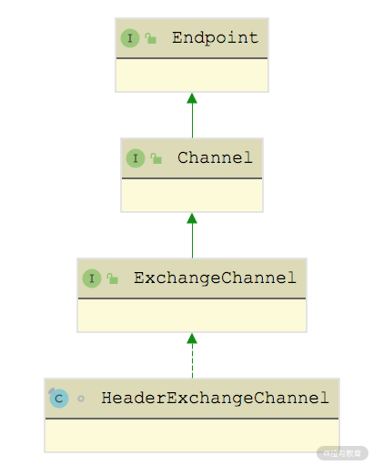
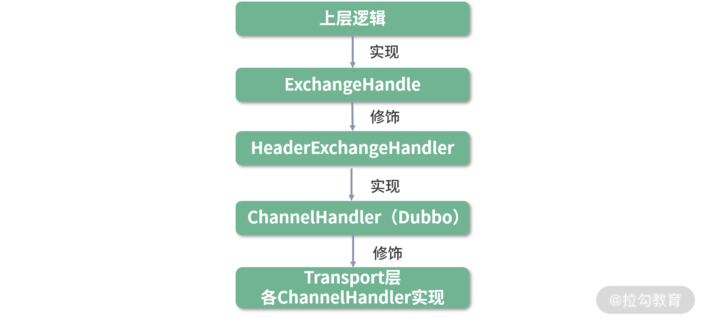
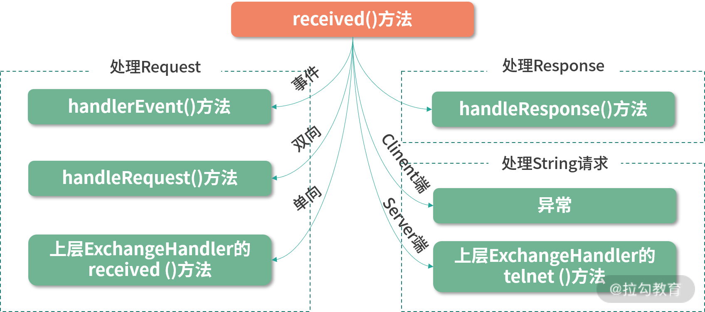

# 21 Exchange 层剖析：彻底搞懂 Request-Response 模型（上）

在前面的课程中，我们深入介绍了 Dubbo Remoting 中的 Transport 层，了解了 Dubbo 抽象出来的端到端的统一传输层接口，并分析了以 Netty 为基础的相关实现。当然，其他 NIO 框架的接入也是类似的，本课程就不再展开赘述了。

在本课时中，我们将介绍 Transport 层的上一层，也是 Dubbo Remoting 层中的最顶层—— Exchange 层。**Dubbo 将信息交换行为抽象成 Exchange 层，官方文档对这一层的说明是：封装了请求-响应的语义，即关注一问一答的交互模式，实现了同步转异步** 。在 Exchange 这一层，以 Request 和 Response 为中心，针对 Channel、ChannelHandler、Client、RemotingServer 等接口进行实现。

下面我们从 Request 和 Response 这一对基础类开始，依次介绍 Exchange 层中 ExchangeChannel、HeaderExchangeHandler 的核心实现。

### Request 和 Response

Exchange 层的 Request 和 Response 这两个类是 Exchange 层的核心对象，是对请求和响应的抽象。我们先来看 **Request 类** 的核心字段：

```java
public class Request {
    // 用于生成请求的自增ID，当递增到Long.MAX_VALUE之后，会溢出到Long.MIN_VALUE，我们可以继续使用该负数作为消息ID
    private static final AtomicLong INVOKE_ID = new AtomicLong(0);
    private final long mId; // 请求的ID
    private String mVersion; // 请求版本号
    // 请求的双向标识，如果该字段设置为true，则Server端在收到请求后，
    // 需要给Client返回一个响应
    private boolean mTwoWay = true; 
    // 事件标识，例如心跳请求、只读请求等，都会带有这个标识
    private boolean mEvent = false; 
    // 请求发送到Server之后，由Decoder将二进制数据解码成Request对象，
    // 如果解码环节遇到异常，则会设置该标识，然后交由其他ChannelHandler根据
    // 该标识做进一步处理
    private boolean mBroken = false;
    // 请求体，可以是任何Java类型的对象,也可以是null
    private Object mData; 
}
```

接下来是 Response 的核心字段：

```java
public class Response {
    // 响应ID，与相应请求的ID一致
    private long mId = 0;
    // 当前协议的版本号，与请求消息的版本号一致
    private String mVersion;
    // 响应状态码，有OK、CLIENT_TIMEOUT、SERVER_TIMEOUT等10多个可选值
    private byte mStatus = OK; 
    private boolean mEvent = false;
    private String mErrorMsg; // 可读的错误响应消息
    private Object mResult; // 响应体
}
```

### ExchangeChannel & DefaultFuture

在前面的课时中，我们介绍了 Channel 接口的功能以及 Transport 层对 Channel 接口的实现。在 Exchange 层中定义了 ExchangeChannel 接口，它在 Channel 接口之上抽象了 Exchange 层的网络连接。ExchangeChannel 接口的定义如下：


ExchangeChannel 接口

其中，request() 方法负责发送请求，从图中可以看到这里有两个重载，其中一个重载可以指定请求的超时时间，返回值都是 Future 对象。



HeaderExchangeChannel 继承关系图

**从上图中可以看出，HeaderExchangeChannel 是 ExchangeChannel 的实现**，它本身是 Channel 的装饰器，封装了一个 Channel 对象，其 send() 方法和 request() 方法的实现都是依赖底层修饰的这个 Channel 对象实现的。

```java
public void send(Object message, boolean sent) throws RemotingException {
    if (message instanceof Request || message instanceof Response
            || message instanceof String) {
        channel.send(message, sent);
    } else {
        Request request = new Request();
        request.setVersion(Version.getProtocolVersion());
        request.setTwoWay(false);
        request.setData(message);
        channel.send(request, sent);
    }
}
public CompletableFuture<Object> request(Object request, int timeout, ExecutorService executor) throws RemotingException {
    Request req = new Request();  // 创建Request对象
    req.setVersion(Version.getProtocolVersion());
    req.setTwoWay(true);
    req.setData(request);
    DefaultFuture future = DefaultFuture.newFuture(channel, 
       req, timeout, executor); // 创建DefaultFuture
    channel.send(req);
    return future;
}
```

注意这里的 request() 方法，它返回的是一个 DefaultFuture 对象。通过前面课时的介绍我们知道，io.netty.channel.Channel 的 send() 方法会返回一个 ChannelFuture 方法，表示此次发送操作是否完成，而这里的 **DefaultFuture 就表示此次请求-响应是否完成，也就是说，要收到响应为 Future 才算完成** 。

下面我们就来深入介绍一下请求发送过程中涉及的 DefaultFuture 以及HeaderExchangeChannel的内容。

首先来了解一下 DefaultFuture 的具体实现，它继承了 JDK 中的 CompletableFuture，其中维护了两个 static 集合。

- CHANNELS（Map\<Long, Channel>集合）：管理请求与 Channel 之间的关联关系，其中 Key 为请求 ID，Value 为发送请求的 Channel。
- FUTURES（Map\<Long, Channel>集合）：管理请求与 DefaultFuture 之间的关联关系，其中 Key 为请求 ID，Value 为请求对应的 Future。

DefaultFuture 中核心的实例字段包括如下几个。

- request（Request 类型）和 id（Long 类型）：对应请求以及请求的 ID。
- channel（Channel 类型）：发送请求的 Channel。
- timeout（int 类型）：整个请求-响应交互完成的超时时间。
- start（long 类型）：该 DefaultFuture 的创建时间。
- sent（volatile long 类型）：请求发送的时间。
- timeoutCheckTask（Timeout 类型）：该定时任务到期时，表示对端响应超时。
- executor（ExecutorService 类型）：请求关联的线程池。

DefaultFuture.newFuture() 方法创建 DefaultFuture 对象时，需要先初始化上述字段，并创建请求相应的超时定时任务：

```java
public static DefaultFuture newFuture(Channel channel, Request request, int timeout, ExecutorService executor) {
    // 创建DefaultFuture对象，并初始化其中的核心字段
    final DefaultFuture future = new DefaultFuture(channel, request, timeout);
    future.setExecutor(executor); 
    // 对于ThreadlessExecutor的特殊处理，ThreadlessExecutor可以关联一个waitingFuture，就是这里创建DefaultFuture对象
    if (executor instanceof ThreadlessExecutor) {
        ((ThreadlessExecutor) executor).setWaitingFuture(future);
    }
    // 创建一个定时任务，用处理响应超时的情况
    timeoutCheck(future);
    return future;
}
```

在 HeaderExchangeChannel.request() 方法中完成 DefaultFuture 对象的创建之后，会将请求通过底层的 Dubbo Channel 发送出去，发送过程中会触发沿途 ChannelHandler 的 sent() 方法，其中的 HeaderExchangeHandler 会调用 DefaultFuture.sent() 方法更新 sent 字段，记录请求发送的时间戳。后续如果响应超时，则会将该发送时间戳添加到提示信息中。

过一段时间之后，Consumer 会收到对端返回的响应，在读取到完整响应之后，会触发 Dubbo Channel 中各个 ChannelHandler 的 received() 方法，其中就包括上一课时介绍的 WrappedChannelHandler。例如，AllChannelHandler 子类会将后续 ChannelHandler.received() 方法的调用封装成任务提交到线程池中，响应会提交到 DefaultFuture 关联的线程池中，如上一课时介绍的 ThreadlessExecutor，然后由业务线程继续后续的 ChannelHandler 调用。（你也可以回顾一下上一课时对 Transport 层 Dispatcher 以及 ThreadlessExecutor 的介绍。）

当响应传递到 HeaderExchangeHandler 的时候，会通过调用 handleResponse() 方法进行处理，其中调用了 DefaultFuture.received() 方法，该方法会找到响应关联的 DefaultFuture 对象（根据请求 ID 从 FUTURES 集合查找）并调用 doReceived() 方法，将 DefaultFuture 设置为完成状态。

```java
public static void received(Channel channel, Response response, boolean timeout) { // 省略try/finally代码块
    // 清理FUTURES中记录的请求ID与DefaultFuture之间的映射关系
    DefaultFuture future = FUTURES.remove(response.getId()); 
    if (future != null) {
        Timeout t = future.timeoutCheckTask;
        if (!timeout) { // 未超时，取消定时任务
            t.cancel();
        }
        future.doReceived(response); // 调用doReceived()方法
    }else{ // 查找不到关联的DefaultFuture会打印日志(略)}
    // 清理CHANNELS中记录的请求ID与Channel之间的映射关系
    CHANNELS.remove(response.getId()); 
}
// DefaultFuture.doReceived()方法的代码片段
private void doReceived(Response res) {
    if (res == null) {
        throw new IllegalStateException("response cannot be null");
    }
    if (res.getStatus() == Response.OK) { // 正常响应
        this.complete(res.getResult());
    } else if (res.getStatus() == Response.CLIENT_TIMEOUT || res.getStatus() == Response.SERVER_TIMEOUT) { // 超时
            this.completeExceptionally(new TimeoutException(res.getStatus() == Response.SERVER_TIMEOUT, channel, res.getErrorMessage()));
    } else { // 其他异常
            this.completeExceptionally(new RemotingException(channel, res.getErrorMessage()));
    }
    // 下面是针对ThreadlessExecutor的兜底处理，主要是防止业务线程一直阻塞在ThreadlessExecutor上
    if (executor != null && executor instanceof ThreadlessExecutor) {
        ThreadlessExecutor threadlessExecutor = (ThreadlessExecutor) executor;
        if (threadlessExecutor.isWaiting()) {
            // notifyReturn()方法会向ThreadlessExecutor提交一个任务，这样业务线程就不会阻塞了，提交的任务会尝试将DefaultFuture设置为异常结束
            threadlessExecutor.notifyReturn(new IllegalStateException("The result has returned..."));
        }
    }
}
```

下面我们再来看看响应超时的场景。在创建 DefaultFuture 时调用的 timeoutCheck() 方法中，会创建 TimeoutCheckTask 定时任务，并添加到时间轮中，具体实现如下：

```java
private static void timeoutCheck(DefaultFuture future) {
    TimeoutCheckTask task = new TimeoutCheckTask(future.getId());
    future.timeoutCheckTask = TIME_OUT_TIMER.newTimeout(task, future.getTimeout(), TimeUnit.MILLISECONDS);
}
```

TIME_OUT_TIMER 是一个 HashedWheelTimer 对象，即 Dubbo 中对时间轮的实现，这是一个 static 字段，所有 DefaultFuture 对象共用一个。

TimeoutCheckTask 是 DefaultFuture 中的内部类，实现了 TimerTask 接口，可以提交到时间轮中等待执行。当响应超时的时候，TimeoutCheckTask 会创建一个 Response，并调用前面介绍的 DefaultFuture.received() 方法。示例代码如下：

```java
public void run(Timeout timeout) {
    // 检查该任务关联的DefaultFuture对象是否已经完成
    if (future.getExecutor() != null) { // 提交到线程池执行，注意ThreadlessExecutor的情况
        future.getExecutor().execute(() -> notifyTimeout(future));
    } else {
        notifyTimeout(future);
    }
}
private void notifyTimeout(DefaultFuture future) {
    // 没有收到对端的响应，这里会创建一个Response，表示超时的响应
    Response timeoutResponse = new Response(future.getId());
    timeoutResponse.setStatus(future.isSent() ? Response.SERVER_TIMEOUT : Response.CLIENT_TIMEOUT);
    timeoutResponse.setErrorMessage(future.getTimeoutMessage(true));
    // 将关联的DefaultFuture标记为超时异常完成
    DefaultFuture.received(future.getChannel(), timeoutResponse, true);
}
```

### HeaderExchangeHandler

在前面介绍 DefaultFuture 时，我们简单说明了请求-响应的流程，其实无论是发送请求还是处理响应，都会涉及 HeaderExchangeHandler，所以这里我们就来介绍一下 HeaderExchangeHandler 的内容。

**HeaderExchangeHandler 是 ExchangeHandler 的装饰器**，其中维护了一个 ExchangeHandler 对象，ExchangeHandler 接口是 Exchange 层与上层交互的接口之一，上层调用方可以实现该接口完成自身的功能；然后再由 HeaderExchangeHandler 修饰，具备 Exchange 层处理 Request-Response 的能力；最后再由 Transport ChannelHandler 修饰，具备 Transport 层的能力。如下图所示：



ChannelHandler 继承关系总览图

HeaderExchangeHandler 作为一个装饰器，其 connected()、disconnected()、sent()、received()、caught() 方法最终都会转发给上层提供的 ExchangeHandler 进行处理。这里我们需要聚焦的是 HeaderExchangeHandler 本身对 Request 和 Response 的处理逻辑。



received() 方法处理的消息分类

结合上图，我们可以看到在 **received() 方法** 中，对收到的消息进行了分类处理。

- 只读请求会由 **handlerEvent() 方法** 进行处理，它会在 Channel 上设置 channel.readonly 标志，后续介绍的上层调用中会读取该值。

```plaintext
void handlerEvent(Channel channel, Request req) throws RemotingException {
    if (req.getData() != null && req.getData().equals(READONLY_EVENT)) {
        channel.setAttribute(Constants.CHANNEL_ATTRIBUTE_READONLY_KEY, Boolean.TRUE);
    }
}
```

- 双向请求由 **handleRequest() 方法** 进行处理，会先对解码失败的请求进行处理，返回异常响应；然后将正常解码的请求交给上层实现的 ExchangeHandler 进行处理，并添加回调。上层 ExchangeHandler 处理完请求后，会触发回调，根据处理结果填充响应结果和响应码，并向对端发送。

```java
void handleRequest(final ExchangeChannel channel, Request req) throws RemotingException {
    Response res = new Response(req.getId(), req.getVersion());
    if (req.isBroken()) { // 请求解码失败
        Object data = req.getData();
        // 设置异常信息和响应码
        res.setErrorMessage("Fail to decode request due to: " + msg);
        res.setStatus(Response.BAD_REQUEST); 
        channel.send(res); // 将异常响应返回给对端
        return;
    }
    Object msg = req.getData();
    // 交给上层实现的ExchangeHandler进行处理
    CompletionStage<Object> future = handler.reply(channel, msg);
    future.whenComplete((appResult, t) -> { // 处理结束后的回调
        if (t == null) { // 返回正常响应
            res.setStatus(Response.OK);
            res.setResult(appResult);
        } else { // 处理过程发生异常，设置异常信息和错误码
            res.setStatus(Response.SERVICE_ERROR);
            res.setErrorMessage(StringUtils.toString(t));
        }
        channel.send(res); // 发送响应
    });
}
```

- 单向请求直接委托给 **上层 ExchangeHandler 实现的 received() 方法** 进行处理，由于不需要响应，HeaderExchangeHandler 不会关注处理结果。
- 对于 Response 的处理，前文已提到了，HeaderExchangeHandler 会通过 **handleResponse() 方法** 将关联的 DefaultFuture 设置为完成状态（或是异常完成状态），具体内容这里不再展开讲述。
- 对于 String 类型的消息，HeaderExchangeHandler 会根据当前服务的角色进行分类，具体与 Dubbo 对 telnet 的支持相关，后面的课时会详细介绍，这里就不展开分析了。

接下来我们再来看 **sent() 方法**，该方法会通知上层 ExchangeHandler 实现的 sent() 方法，同时还会针对 Request 请求调用 DefaultFuture.sent() 方法记录请求的具体发送时间，该逻辑在前文也已经介绍过了，这里不再重复。

在 **connected() 方法** 中，会为 Dubbo Channel 创建相应的 HeaderExchangeChannel，并将两者绑定，然后通知上层 ExchangeHandler 处理 connect 事件。

在 **disconnected() 方法** 中，首先通知上层 ExchangeHandler 进行处理，之后在 DefaultFuture.closeChannel() 通知 DefaultFuture 连接断开（其实就是创建并传递一个 Response，该 Response 的状态码为 CHANNEL_INACTIVE），这样就不会继续阻塞业务线程了，最后再将 HeaderExchangeChannel 与底层的 Dubbo Channel 解绑。

### 总结

本课时我们重点介绍了 Dubbo Exchange 层中对 Channel 和 ChannelHandler 接口的实现。

我们首先介绍了 Exchange 层中请求-响应模型的基本抽象，即 Request 类和 Response 类。然后又介绍了 ExchangeChannel 对 Channel 接口的实现，同时还说明了发送请求之后得到的 DefaultFuture 对象，这也是上一课时遗留的小问题。最后，讲解了 HeaderExchangeHandler 是如何将 Transporter 层的 ChannelHandler 对象与上层的 ExchangeHandler 对象相关联的。
