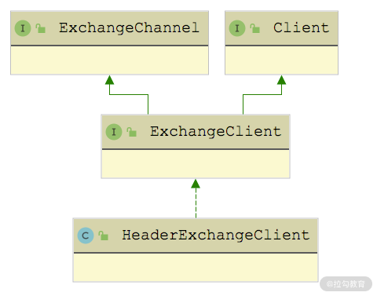
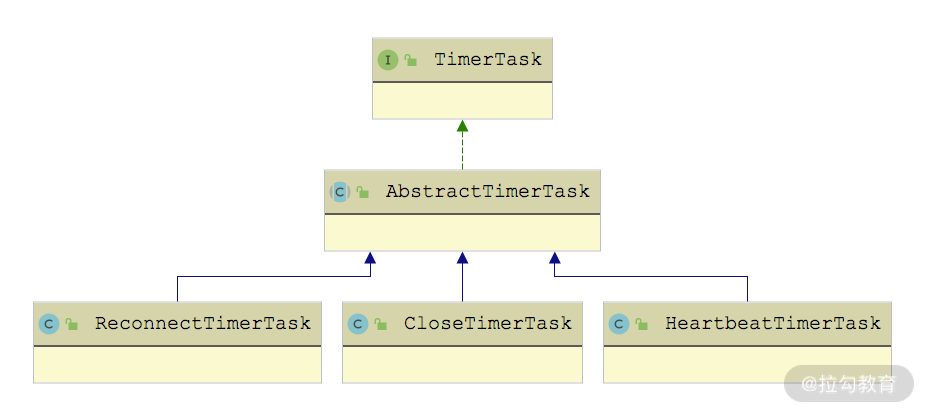
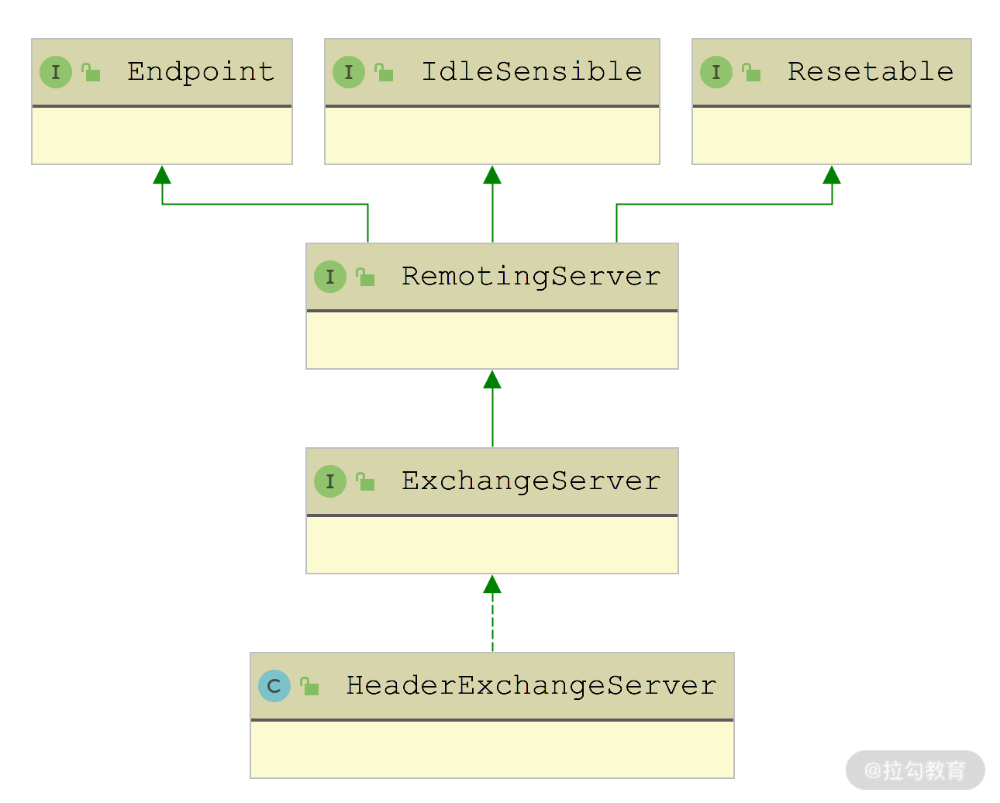
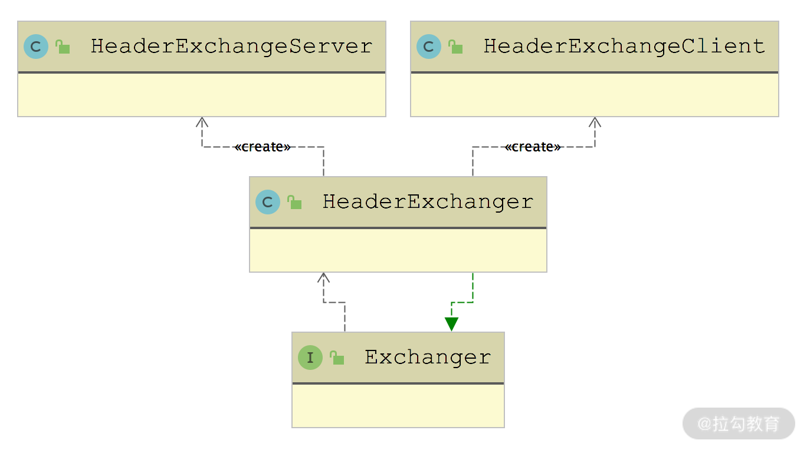
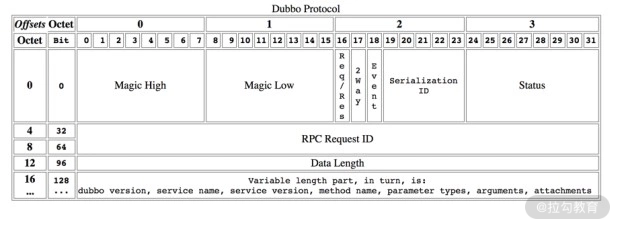

# 22 Exchange 层剖析：彻底搞懂 Request-Response 模型（下）

在上一课时中，我们重点分析了 Exchange 层中 Channel 接口以及 ChannelHandler 接口的核心实现，同时还介绍 Request、Response 两个基础类，以及 DefaultFuture 这个 Future 实现。本课时，我们将继续讲解 Exchange 层其他接口的实现逻辑。

### HeaderExchangeClient

HeaderExchangeClient 是 Client 装饰器，主要为其装饰的 Client 添加两个功能：

- 维持与 Server 的长连状态，这是通过 **定时发送心跳消息** 实现的；
- 在因故障掉线之后，进行重连，这是通过 **定时检查连接状态** 实现的。

因此，HeaderExchangeClient 侧重定时轮资源的分配、定时任务的创建和取消。

HeaderExchangeClient 实现的是 ExchangeClient 接口，如下图所示，间接实现了 ExchangeChannel 和 Client 接口，ExchangeClient 接口是个空接口，没有定义任何方法。



HeaderExchangeClient 继承关系图

HeaderExchangeClient 中有以下两个核心字段。

- client（Client 类型）：被修饰的 Client 对象。HeaderExchangeClient 中对 Client 接口的实现，都会委托给该对象进行处理。
- channel（ExchangeChannel 类型）：Client 与服务端建立的连接，HeaderExchangeChannel 也是一个装饰器，在前面我们已经详细介绍过了，这里就不再展开介绍。HeaderExchangeClient 中对 ExchangeChannel 接口的实现，都会委托给该对象进行处理。

HeaderExchangeClient 构造方法的第一个参数封装 Transport 层的 Client 对象，第二个参数 startTimer参与控制是否开启心跳定时任务和重连定时任务，如果为 true，才会进一步根据其他条件，最终决定是否启动定时任务。这里我们以心跳定时任务为例：

```java
private void startHeartBeatTask(URL url) {
    if (!client.canHandleIdle()) { // Client的具体实现决定是否启动该心跳任务
        AbstractTimerTask.ChannelProvider cp = () -> Collections.singletonList(HeaderExchangeClient.this);
        // 计算心跳间隔，最小间隔不能低于1s
        int heartbeat = getHeartbeat(url); 
        long heartbeatTick = calculateLeastDuration(heartbeat);
        // 创建心跳任务
        this.heartBeatTimerTask = new HeartbeatTimerTask(cp, heartbeatTick, heartbeat);
        // 提交到IDLE_CHECK_TIMER这个时间轮中等待执行
        IDLE_CHECK_TIMER.newTimeout(heartBeatTimerTask, heartbeatTick, TimeUnit.MILLISECONDS);
    }
}
```

重连定时任务是在 startReconnectTask() 方法中启动的，其中会根据 URL 中的参数决定是否启动任务。重连定时任务最终也是提交到 IDLE_CHECK_TIMER 这个时间轮中，时间轮定义如下：

```java
private static final HashedWheelTimer IDLE_CHECK_TIMER = new HashedWheelTimer(
            new NamedThreadFactory("dubbo-client-idleCheck", true), 1, TimeUnit.SECONDS, TICKS_PER_WHEEL);
```

其实，startReconnectTask() 方法的具体实现与前面展示的 startHeartBeatTask() 方法类似，这里就不再赘述。

下面我们继续回到心跳定时任务进行分析，你可以回顾第 20 课时介绍的 NettyClient 实现，其 canHandleIdle() 方法返回 true，表示该实现可以自己发送心跳请求，无须 HeaderExchangeClient 再启动一个定时任务。NettyClient 主要依靠 IdleStateHandler 中的定时任务来触发心跳事件，依靠 NettyClientHandler 来发送心跳请求。

对于无法自己发送心跳请求的 Client 实现，HeaderExchangeClient 会为其启动 HeartbeatTimerTask 心跳定时任务，其继承关系如下图所示：



TimerTask 继承关系图

我们先来看 AbstractTimerTask 这个抽象类，它有三个字段。

- channelProvider（ChannelProvider类型）：ChannelProvider 是 AbstractTimerTask 抽象类中定义的内部接口，定时任务会从该对象中获取 Channel。
- tick（Long类型）：任务的过期时间。
- cancel（boolean类型）：任务是否已取消。

AbstractTimerTask 抽象类实现了 TimerTask 接口的 run() 方法，首先会从 ChannelProvider 中获取此次任务相关的 Channel 集合（在 Client 端只有一个 Channel，在 Server 端有多个 Channel），然后检查 Channel 的状态，针对未关闭的 Channel 执行 doTask() 方法处理，最后通过 reput() 方法将当前任务重新加入时间轮中，等待再次到期执行。

AbstractTimerTask.run() 方法的具体实现如下：

```java
public void run(Timeout timeout) throws Exception {
    // 从ChannelProvider中获取任务要操作的Channel集合
    Collection<Channel> c = channelProvider.getChannels();
    for (Channel channel : c) {
        if (channel.isClosed()) { // 检测Channel状态
            continue;
        }
        doTask(channel); // 执行任务
    }
    reput(timeout, tick); // 将当前任务重新加入时间轮中，等待执行
}
```

doTask() 是一个 AbstractTimerTask 留给子类实现的抽象方法，不同的定时任务执行不同的操作。例如，HeartbeatTimerTask.doTask() 方法中会读取最后一次读写时间，然后计算距离当前的时间，如果大于心跳间隔，就会发送一个心跳请求，核心实现如下：

```java
protected void doTask(Channel channel) {
    // 获取最后一次读写时间
    Long lastRead = lastRead(channel);
    Long lastWrite = lastWrite(channel);
    if ((lastRead != null && now() - lastRead > heartbeat)
            || (lastWrite != null && now() - lastWrite > heartbeat)) {
        // 最后一次读写时间超过心跳时间，就会发送心跳请求
        Request req = new Request();
        req.setVersion(Version.getProtocolVersion());
        req.setTwoWay(true);
        req.setEvent(HEARTBEAT_EVENT);
        channel.send(req);
    }
}
```

这里 lastRead 和 lastWrite 时间戳，都是从要待处理 Channel 的附加属性中获取的，对应的 Key 分别是：KEY_READ_TIMESTAMP、KEY_WRITE_TIMESTAMP。你可以回顾前面课程中介绍的 HeartbeatHandler，它属于 Transport 层，是一个 ChannelHandler 的装饰器，在其 connected() 、sent() 方法中会记录最后一次写操作时间，在其 connected()、received() 方法中会记录最后一次读操作时间，在其 disconnected() 方法中会清理这两个时间戳。

在 ReconnectTimerTask 中会检测待处理 Channel 的连接状态，以及读操作的空闲时间，对于断开或是空闲时间较长的 Channel 进行重连，具体逻辑这里就不再展开了。

HeaderExchangeClient 最后要关注的是它的关闭流程，具体实现在 close() 方法中，如下所示：

```java
public void close(int timeout) {
    startClose(); // 将closing字段设置为true
    doClose(); // 关闭心跳定时任务和重连定时任务
    channel.close(timeout); // 关闭HeaderExchangeChannel
}
```

在 HeaderExchangeChannel.close(timeout) 方法中首先会将自身的 closed 字段设置为 true，这样就不会继续发送请求。如果当前 Channel 上还有请求未收到响应，会循环等待至收到响应，如果超时未收到响应，会自己创建一个状态码将连接关闭的 Response 交给 DefaultFuture 处理，与收到 disconnected 事件相同。然后会关闭 Transport 层的 Channel，以 NettyChannel 为例，NettyChannel.close() 方法会先将自身的 closed 字段设置为 true，清理 CHANNEL_MAP 缓存中的记录，以及 Channel 的附加属性，最后才是关闭 io.netty.channel.Channel。

### HeaderExchangeServer

下面再来看 HeaderExchangeServer，其继承关系如下图所示，其中 Endpoint、RemotingServer、Resetable 这三个接口我们在前面已经详细介绍过了，这里不再重复。



HeaderExchangeServer 的继承关系图

与前面介绍的 HeaderExchangeClient 一样，HeaderExchangeServer 是 RemotingServer 的装饰器，实现自 RemotingServer 接口的大部分方法都委托给了所修饰的 RemotingServer 对象。

在 HeaderExchangeServer 的构造方法中，会启动一个 CloseTimerTask 定时任务，定期关闭长时间空闲的连接，具体的实现方式与 HeaderExchangeClient 中的两个定时任务类似，这里不再展开分析。

需要注意的是，前面课时介绍的 NettyServer 并没有启动该定时任务，而是靠 NettyServerHandler 和 IdleStateHandler 实现的，原理与 NettyClient 类似，这里不再展开，你若感兴趣的话，可以回顾第 20课时或是查看 CloseTimerTask 的具体实现。

在 19 课时介绍 Transport Server 的时候，我们并没有过多介绍其关闭流程，这里我们就通过 HeaderExchangeServer 自顶向下梳理整个 Server 端关闭流程。先来看 HeaderExchangeServer.close() 方法的关闭流程：

1. 将被修饰的 RemotingServer 的 closing 字段设置为 true，表示这个 Server 端正在关闭，不再接受新 Client 的连接。你可以回顾第 19 课时中介绍的 AbstractServer.connected() 方法，会发现 Server 正在关闭或是已经关闭时，则直接关闭新建的 Client 连接。
1. 向 Client 发送一个携带 ReadOnly 事件的请求（根据 URL 中的配置决定是否发送，默认为发送）。在接收到该请求之后，Client 端的 HeaderExchangeHandler 会在 Channel 上添加 Key 为 “channel.readonly” 的附加信息，上层调用方会根据该附加信息，判断该连接是否可写。
1. 循环去检测是否还存在 Client 与当前 Server 维持着长连接，直至全部 Client 断开连接或超时。
1. 更新 closed 字段为 true，之后 Client 不会再发送任何请求或是回复响应了。
1. 取消 CloseTimerTask 定时任务。
1. 调用底层 RemotingServer 对象的 close() 方法。以 NettyServer 为例，其 close() 方法会先调用 AbstractPeer 的 close() 方法将自身的 closed 字段设置为 true；然后调用 doClose() 方法关闭 boss Channel（即用来接收客户端连接的 Channel），关闭 channels 集合中记录的 Channel（这些 Channel 是与 Client 之间的连接），清理 channels 集合；最后，关闭 bossGroup 和 workerGroup 两个线程池。

HeaderExchangeServer.close() 方法的核心逻辑如下：

```java
public void close(final int timeout) {
    startClose(); // 将底层RemotingServer的closing字段设置为true，表示当前Server正在关闭，不再接收连接
    if (timeout > 0) {
        final long max = (long) timeout;
        final long start = System.currentTimeMillis();
        if (getUrl().getParameter(Constants.CHANNEL_SEND_READONLYEVENT_KEY, true)) {
            // 发送ReadOnly事件请求通知客户端
            sendChannelReadOnlyEvent();
        }
        while (HeaderExchangeServer.this.isRunning()
                && System.currentTimeMillis() - start < max) {
            Thread.sleep(10); // 循环等待客户端断开连接
        }
    }
    doClose(); // 将自身closed字段设置为true，取消CloseTimerTask定时任务
    server.close(timeout); // 关闭Transport层的Server
}
```

通过对上述关闭流程的分析，你就可以清晰地知道 HeaderExchangeServer 优雅关闭的原理。

### HeaderExchanger

对于上层来说，Exchange 层的入口是 Exchangers 这个门面类，其中提供了多个 bind() 以及 connect() 方法的重载，这些重载方法最终会通过 SPI 机制，获取 Exchanger 接口的扩展实现，这个流程与第 17 课时介绍的 Transport 层的入口—— Transporters 门面类相同。

我们可以看到 Exchanger 接口的定义与前面介绍的 Transporter 接口非常类似，同样是被 @SPI 接口修饰（默认扩展名为“header”，对应的是 HeaderExchanger 这个实现），bind() 方法和 connect() 方法也同样是被 @Adaptive 注解修饰，可以通过 URL 参数中的 exchanger 参数值指定扩展名称来覆盖默认值。

```plaintext
@SPI(HeaderExchanger.NAME)
public interface Exchanger {
    @Adaptive({Constants.EXCHANGER_KEY})
    ExchangeServer bind(URL url, ExchangeHandler handler) throws RemotingException;
    @Adaptive({Constants.EXCHANGER_KEY})
    ExchangeClient connect(URL url, ExchangeHandler handler) throws RemotingException;
}
```

Dubbo 只为 Exchanger 接口提供了 HeaderExchanger 这一个实现，其中 connect() 方法创建的是 HeaderExchangeClient 对象，bind() 方法创建的是 HeaderExchangeServer 对象，如下图所示：



HeaderExchanger 门面类

从 HeaderExchanger 的实现可以看到，它会在 Transport 层的 Client 和 Server 实现基础之上，添加前文介绍的 HeaderExchangeClient 和 HeaderExchangeServer 装饰器。同时，为上层实现的 ExchangeHandler 实例添加了 HeaderExchangeHandler 以及 DecodeHandler 两个修饰器：

```java
public class HeaderExchanger implements Exchanger {
    public static final String NAME = "header";
    @Override
    public ExchangeClient connect(URL url, ExchangeHandler handler) throws RemotingException {
        return new HeaderExchangeClient(Transporters.connect(url, new DecodeHandler(new HeaderExchangeHandler(handler))), true);
    }
    @Override
    public ExchangeServer bind(URL url, ExchangeHandler handler) throws RemotingException {
        return new HeaderExchangeServer(Transporters.bind(url, new DecodeHandler(new HeaderExchangeHandler(handler))));
    }
}
```

### 再谈 Codec2

在前面第 17 课时介绍 Dubbo Remoting 核心接口的时候提到，Codec2 接口提供了 encode() 和 decode() 两个方法来实现消息与字节流之间的相互转换。需要注意与 DecodeHandler 区分开来， **DecodeHandler 是对请求体和响应结果的解码，Codec2 是对整个请求和响应的编解码** 。

这里重点介绍 Transport 层和 Exchange 层对 Codec2 接口的实现，涉及的类如下图所示：


**AbstractCodec** 抽象类并没有实现 Codec2 中定义的接口方法，而是提供了几个给子类用的基础方法，下面简单说明这些方法的功能。

- getSerialization() 方法：通过 SPI 获取当前使用的序列化方式。
- checkPayload() 方法：检查编解码数据的长度，如果数据超长，会抛出异常。
- isClientSide()、isServerSide() 方法：判断当前是 Client 端还是 Server 端。

接下来看 **TransportCodec** ，我们可以看到这类上被标记了 @Deprecated 注解，表示已经废弃。TransportCodec 的实现非常简单，其中根据 getSerialization() 方法选择的序列化方法对传入消息或 ChannelBuffer 进行序列化或反序列化，这里就不再介绍 TransportCodec 实现了。

**TelnetCodec** 继承了 TransportCodec 序列化和反序列化的基本能力，同时还提供了对 Telnet 命令处理的能力。

最后来看 **ExchangeCodec** ，它在 TelnetCodec 的基础之上，添加了处理协议头的能力。下面是 Dubbo 协议的格式，能够清晰地看出协议中各个数据所占的位数：



Dubbo 协议格式

结合上图，我们来深入了解一下 Dubbo 协议中各个部分的含义：

- 0~7 位和 8~15 位分别是 Magic High 和 Magic Low，是固定魔数值（0xdabb），我们可以通过这两个 Byte，快速判断一个数据包是否为 Dubbo 协议，这也类似 Java 字节码文件里的魔数。
- 16 位是 Req/Res 标识，用于标识当前消息是请求还是响应。
- 17 位是 2Way 标识，用于标识当前消息是单向还是双向。
- 18 位是 Event 标识，用于标识当前消息是否为事件消息。
- 19~23 位是序列化类型的标志，用于标识当前消息使用哪一种序列化算法。
- 24~31 位是 Status 状态，用于记录响应的状态，仅在 Req/Res 为 0（响应）时有用。
- 32~95 位是 Request ID，用于记录请求的唯一标识，类型为 long。
- 96~127 位是序列化后的内容长度，该值是按字节计数，int 类型。
- 128 位之后是可变的数据，被特定的序列化算法（由序列化类型标志确定）序列化后，每个部分都是一个 byte \[\] 或者 byte。如果是请求包（Req/Res = 1），则每个部分依次为：Dubbo version、Service name、Service version、Method name、Method parameter types、Method arguments 和 Attachments。如果是响应包（Req/Res = 0），则每个部分依次为：①返回值类型（byte），标识从服务器端返回的值类型，包括返回空值（RESPONSE_NULL_VALUE 2）、正常响应值（RESPONSE_VALUE 1）和异常（RESPONSE_WITH_EXCEPTION 0）三种；②返回值，从服务端返回的响应 bytes。

可以看到 Dubbo 协议中前 128 位是协议头，之后的内容是具体的负载数据。协议头就是通过 ExchangeCodec 实现编解码的。

ExchangeCodec 的核心字段有如下几个。

- HEADER_LENGTH（int 类型，值为 16）：协议头的字节数，16 字节，即 128 位。
- MAGIC（short 类型，值为 0xdabb）：协议头的前 16 位，分为 MAGIC_HIGH 和 MAGIC_LOW 两个字节。
- FLAG_REQUEST（byte 类型，值为 0x80）：用于设置 Req/Res 标志位。
- FLAG_TWOWAY（byte 类型，值为 0x40）：用于设置 2Way 标志位。
- FLAG_EVENT（byte 类型，值为 0x20）：用于设置 Event 标志位。
- SERIALIZATION_MASK（int 类型，值为 0x1f）：用于获取序列化类型的标志位的掩码。

在 ExchangeCodec 的 encode() 方法中会根据需要编码的消息类型进行分类，其中 encodeRequest() 方法专门对 Request 对象进行编码，具体实现如下：

```java
protected void encodeRequest(Channel channel, ChannelBuffer buffer, Request req) throws IOException {
    Serialization serialization = getSerialization(channel);
    byte[] header = new byte[HEADER_LENGTH]; // 该数组用来暂存协议头
    // 在header数组的前两个字节中写入魔数
    Bytes.short2bytes(MAGIC, header);
    // 根据当前使用的序列化设置协议头中的序列化标志位
    header[2] = (byte) (FLAG_REQUEST | serialization.getContentTypeId());
    if (req.isTwoWay()) { // 设置协议头中的2Way标志位
        header[2] |= FLAG_TWOWAY;
    }
    if (req.isEvent()) { // 设置协议头中的Event标志位
        header[2] |= FLAG_EVENT;
    }
    // 将请求ID记录到请求头中
    Bytes.long2bytes(req.getId(), header, 4);
    // 下面开始序列化请求，并统计序列化后的字节数
    // 首先使用savedWriteIndex记录ChannelBuffer当前的写入位置
    int savedWriteIndex = buffer.writerIndex();
    // 将写入位置后移16字节
    buffer.writerIndex(savedWriteIndex + HEADER_LENGTH);
    // 根据选定的序列化方式对请求进行序列化
    ChannelBufferOutputStream bos = new ChannelBufferOutputStream(buffer);
    ObjectOutput out = serialization.serialize(channel.getUrl(), bos);
    if (req.isEvent()) { // 对事件进行序列化
        encodeEventData(channel, out, req.getData());
    } else { // 对Dubbo请求进行序列化，具体在DubboCodec中实现
        encodeRequestData(channel, out, req.getData(), req.getVersion());
    }
    out.flushBuffer();
    if (out instanceof Cleanable) {
        ((Cleanable) out).cleanup();
    }
    bos.flush();
    bos.close(); // 完成序列化
    int len = bos.writtenBytes(); // 统计请求序列化之后，得到的字节数
    checkPayload(channel, len); // 限制一下请求的字节长度
    Bytes.int2bytes(len, header, 12); // 将字节数写入header数组中
    // 下面调整ChannelBuffer当前的写入位置，并将协议头写入Buffer中
    buffer.writerIndex(savedWriteIndex);
    buffer.writeBytes(header); 
    // 最后，将ChannelBuffer的写入位置移动到正确的位置
    buffer.writerIndex(savedWriteIndex + HEADER_LENGTH + len);
}
```

encodeResponse() 方法编码响应的方式与 encodeRequest() 方法编码请求的方式类似，这里就不再展开介绍了，感兴趣的同学可以参考源码进行学习。对于既不是 Request，也不是 Response 的消息，ExchangeCodec 会使用从父类继承下来的能力来编码，例如对 telnet 命令的编码。

ExchangeCodec 的 decode() 方法是 encode() 方法的逆过程，会先检查魔数，然后读取协议头和后续消息的长度，最后根据协议头中的各个标志位构造相应的对象，以及反序列化数据。在了解协议头结构的前提下，再去阅读这段逻辑就十分轻松了，这就留给你自己尝试分析一下。

### 总结

本课时我们重点介绍了 Dubbo Exchange 层中对 Client 和 Server 接口的实现。

我们首先介绍了 HeaderExchangeClient 对 ExchangeClient 接口的实现，以及 HeaderExchangeServer 对 ExchangeServer 接口的实现，这两者是在 Transport 层 Client 和 Server 的基础上，添加了新的功能。接下来，又讲解了 HeaderExchanger 这个用来创建 HeaderExchangeClient 和 HeaderExchangeServer 的门面类。最后，分析了 Dubbo 协议的格式，以及处理 Dubbo 协议的 ExchangeCodec 实现。
