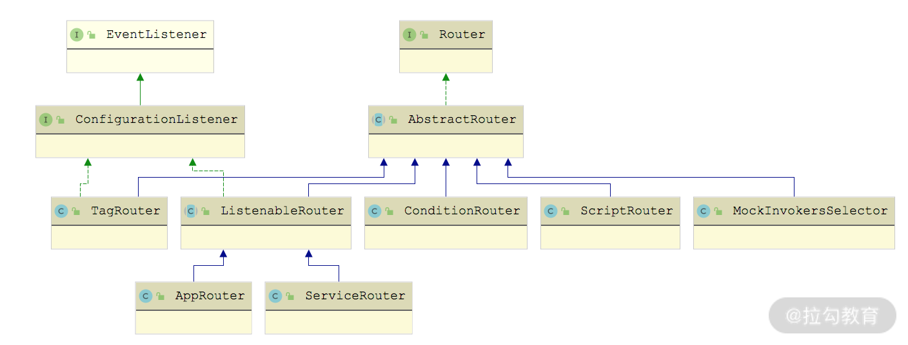
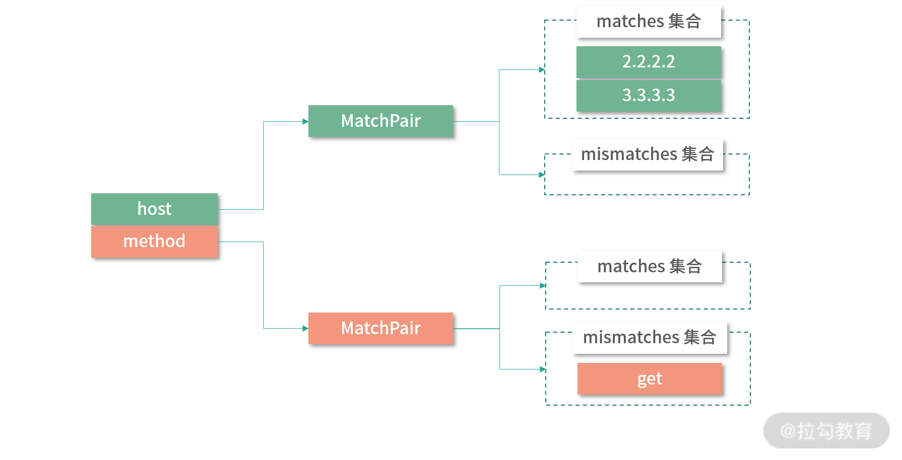

# 32 路由机制：请求到底怎么走，它说了算（上）

作为 dubbo-cluster 模块分析的第二课时，本课时我们就来介绍一下 dubbo-cluster 模块中涉及的另一个核心概念—— Router。

**Router 的主要功能就是根据用户配置的路由规则以及请求携带的信息，过滤出符合条件的 Invoker 集合，供后续负载均衡逻辑使用** 。在上一课时介绍 RegistryDirectory 实现的时候，我们就已经看到了 RouterChain 这个 Router 链的存在，但是没有深入分析，下面我们就来深入 Router 进行分析。

### RouterChain、RouterFactory 与 Router

首先我们来看 RouterChain 的核心字段。

- invokers（List\<Invoker`<T>`> 类型）：当前 RouterChain 对象要过滤的 Invoker 集合。我们可以看到，在 StaticDirectory 中是通过 RouterChain.setInvokers() 方法进行设置的。
- builtinRouters（List`<Router>` 类型）：当前 RouterChain 激活的内置 Router 集合。
- routers（List`<Router>` 类型）：当前 RouterChain 中真正要使用的 Router 集合，其中不仅包括了上面 builtinRouters 集合中全部的 Router 对象，还包括通过 addRouters() 方法添加的 Router 对象。

在 RouterChain 的构造函数中，会在传入的 URL 参数中查找 router 参数值，并根据该值获取确定激活的 RouterFactory，之后通过 Dubbo SPI 机制加载这些激活的 RouterFactory 对象，由 RouterFactory 创建当前激活的内置 Router 实例，具体实现如下：

```java
private RouterChain(URL url) {
    // 通过ExtensionLoader加载激活的RouterFactory
    List<RouterFactory> extensionFactories = ExtensionLoader.getExtensionLoader(RouterFactory.class)
            .getActivateExtension(url, "router");
    // 遍历所有RouterFactory，调用其getRouter()方法创建相应的Router对象
    List<Router> routers = extensionFactories.stream()
            .map(factory -> factory.getRouter(url))
            .collect(Collectors.toList());
    initWithRouters(routers); // 初始化buildinRouters字段以及routers字段
}
public void initWithRouters(List<Router> builtinRouters) {
    this.builtinRouters = builtinRouters;
    this.routers = new ArrayList<>(builtinRouters);
    this.sort(); // 这里会对routers集合进行排序
}
```

完成内置 Router 的初始化之后，在 Directory 实现中还可以通过 addRouter() 方法添加新的 Router 实例到 routers 字段中，具体实现如下：

```java
public void addRouters(List<Router> routers) {
    List<Router> newRouters = new ArrayList<>();
    newRouters.addAll(builtinRouters); // 添加builtinRouters集合
    newRouters.addAll(routers); // 添加传入的Router集合
    CollectionUtils.sort(newRouters); // 重新排序
    this.routers = newRouters;
}
```

RouterChain.route() 方法会遍历 routers 字段，逐个调用 Router 对象的 route() 方法，对 invokers 集合进行过滤，具体实现如下：

```plaintext
public List<Invoker<T>> route(URL url, Invocation invocation) {
    List<Invoker<T>> finalInvokers = invokers;
    for (Router router : routers) { // 遍历全部的Router对象
        finalInvokers = router.route(finalInvokers, url, invocation);
    }
    return finalInvokers;
}
```

了解了 RouterChain 的大致逻辑之后，我们知道 **真正进行路由的是 routers 集合中的 Router 对象** 。接下来我们再来看 RouterFactory 这个工厂接口，**RouterFactory 接口是一个扩展接口**，具体定义如下：

```plaintext
@SPI
public interface RouterFactory {
    @Adaptive("protocol") // 动态生成的适配器会根据protocol参数选择扩展实现
    Router getRouter(URL url);
}
```

RouterFactory 接口有很多实现类，如下图所示：


RouterFactory 继承关系图

下面我们就来深入介绍下每个 RouterFactory 实现类以及对应的 Router 实现对象。**Router 决定了一次 Dubbo 调用的目标服务，Router 接口的每个实现类代表了一个路由规则**，当 Consumer 访问 Provider 时，Dubbo 根据路由规则筛选出合适的 Provider 列表，之后通过负载均衡算法再次进行筛选。Router 接口的继承关系如下图所示：



Router 继承关系图

接下来我们就开始介绍 RouterFactory 以及 Router 的具体实现。

### ConditionRouterFactory&ConditionRouter

首先来看 ConditionRouterFactory 实现，其扩展名为 condition，在其 getRouter() 方法中会创建 ConditionRouter 对象，如下所示：

```java
public Router getRouter(URL url) {
    return new ConditionRouter(url);
}
```

**ConditionRouter 是基于条件表达式的路由实现类**，下面就是一条基于条件表达式的路由规则：

```javascript
host = 192.168.0.100 => host = 192.168.0.150
```

在上述规则中，`=>`之前的为 Consumer 匹配的条件，该条件中的所有参数会与 Consumer 的 URL 进行对比，当 Consumer 满足匹配条件时，会对该 Consumer 的此次调用执行 `=>` 后面的过滤规则。

`=>` 之后为 Provider 地址列表的过滤条件，该条件中的所有参数会和 Provider 的 URL 进行对比，Consumer 最终只拿到过滤后的地址列表。**如果 Consumer 匹配条件为空，表示 => 之后的过滤条件对所有 Consumer 生效**，例如：=> host != 192.168.0.150，含义是所有 Consumer 都不能请求 192.168.0.150 这个 Provider 节点。**如果 Provider 过滤条件为空，表示禁止访问所有 Provider**，例如：host = 192.168.0.100 =>，含义是 192.168.0.100 这个 Consumer 不能访问任何 Provider 节点。

ConditionRouter 的核心字段有如下几个。

- url（URL 类型）：路由规则的 URL，可以从 rule 参数中获取具体的路由规则。
- ROUTE_PATTERN（Pattern 类型）：用于切分路由规则的正则表达式。
- priority（int 类型）：路由规则的优先级，用于排序，该字段值越大，优先级越高，默认值为 0。
- force（boolean 类型）：当路由结果为空时，是否强制执行。如果不强制执行，则路由结果为空的路由规则将会自动失效；如果强制执行，则直接返回空的路由结果。
- whenCondition（Map\<String, MatchPair> 类型）：Consumer 匹配的条件集合，通过解析条件表达式 rule 的 `=>` 之前半部分，可以得到该集合中的内容。
- thenCondition（Map\<String, MatchPair> 类型）：Provider 匹配的条件集合，通过解析条件表达式 rule 的 `=>` 之后半部分，可以得到该集合中的内容。

在 ConditionRouter 的构造方法中，会根据 URL 中携带的相应参数初始化 priority、force、enable 等字段，然后从 URL 的 rule 参数中获取路由规则进行解析，具体的解析逻辑是在 init() 方法中实现的，如下所示：

```java
public void init(String rule) {
    // 将路由规则中的"consumer."和"provider."字符串清理掉
    rule = rule.replace("consumer.", "").replace("provider.", "");
    // 按照"=>"字符串进行分割，得到whenRule和thenRule两部分
    int i = rule.indexOf("=>"); 
    String whenRule = i < 0 ? null : rule.substring(0, i).trim();
    String thenRule = i < 0 ? rule.trim() : rule.substring(i + 2).trim();
    // 解析whenRule和thenRule，得到whenCondition和thenCondition两个条件集合
    Map<String, MatchPair> when = StringUtils.isBlank(whenRule) || "true".equals(whenRule) ? new HashMap<String, MatchPair>() : parseRule(whenRule);
    Map<String, MatchPair> then = StringUtils.isBlank(thenRule) || "false".equals(thenRule) ? null : parseRule(thenRule);
    this.whenCondition = when;
    this.thenCondition = then;
}
```

whenCondition 和 thenCondition 两个集合中，Key 是条件表达式中指定的参数名称（例如 host = 192.168.0.150 这个表达式中的 host）。ConditionRouter 支持三类参数：

- 服务调用信息，例如，method、argument 等；
- URL 本身的字段，例如，protocol、host、port 等；
- URL 上的所有参数，例如，application 等。

Value 是 MatchPair 对象，包含两个 Set 类型的集合—— matches 和 mismatches。在 **使用 MatchPair 进行过滤** 的时候，会按照下面四条规则执行。

1. 当 mismatches 集合为空的时候，会逐个遍历 matches 集合中的匹配条件，匹配成功任意一条即会返回 true。这里具体的匹配逻辑以及后续 mismatches 集合中条件的匹配逻辑，都是在 UrlUtils.isMatchGlobPattern() 方法中实现，其中完成了如下操作：如果匹配条件以 "$" 符号开头，则从 URL 中获取相应的参数值进行匹配；当遇到 "_" 通配符的时候，会处理"_"通配符在匹配条件开头、中间以及末尾三种情况。
1. 当 matches 集合为空的时候，会逐个遍历 mismatches 集合中的匹配条件，匹配成功任意一条即会返回 false。
1. 当 matches 集合和 mismatches 集合同时不为空时，会优先匹配 mismatches 集合中的条件，成功匹配任意一条规则，就会返回 false；若 mismatches 中的条件全部匹配失败，才会开始匹配 matches 集合，成功匹配任意一条规则，就会返回 true。
1. 当上述三个步骤都没有成功匹配时，直接返回 false。

上述流程具体实现在 MatchPair 的 isMatch() 方法中，比较简单，这里就不再展示。

了解了每个 MatchPair 的匹配流程之后，我们来看 **parseRule() 方法是如何解析一条完整的条件表达式，生成对应 MatchPair 的**，具体实现如下：

```java
private static Map<String, MatchPair> parseRule(String rule) throws ParseException {
    Map<String, MatchPair> condition = new HashMap<String, MatchPair>();
    MatchPair pair = null;
    Set<String> values = null;
    // 首先，按照ROUTE_PATTERN指定的正则表达式匹配整个条件表达式
    final Matcher matcher = ROUTE_PATTERN.matcher(rule);
    while (matcher.find()) { // 遍历匹配的结果
        // 每个匹配结果有两部分(分组)，第一部分是分隔符，第二部分是内容
        String separator = matcher.group(1); 
        String content = matcher.group(2);
        if (StringUtils.isEmpty(separator)) { // ---(1) 没有分隔符，content即为参数名称
            pair = new MatchPair();
            // 初始化MatchPair对象，并将其与对应的Key(即content)记录到condition集合中
            condition.put(content, pair); 
        }
        else if ("&".equals(separator)) { // ---(4)
            // &分隔符表示多个表达式,会创建多个MatchPair对象
            if (condition.get(content) == null) {
                pair = new MatchPair();
                condition.put(content, pair);
            } else {
                pair = condition.get(content);
            }
        }else if ("=".equals(separator)) { // ---(2) 
            // =以及!=两个分隔符表示KV的分界线
            if (pair == null) {
                throw new ParseException("..."");
            }
            values = pair.matches;
            values.add(content);
        }else if ("!=".equals(separator)) { // ---(5)
            if (pair == null) {
                throw new ParseException("...");
            }
            values = pair.mismatches;
            values.add(content);
        }else if (",".equals(separator)) { // ---(3)
            // 逗号分隔符表示有多个Value值
            if (values == null || values.isEmpty()) {
                throw new ParseException("...");
            }
            values.add(content);
        } else {
            throw new ParseException("...");
        }
    }
    return condition;
}
```

介绍完 parseRule() 方法的实现之后，我们可以再通过下面这个条件表达式示例的解析流程，更深入地体会 parseRule() 方法的工作原理：

```javascript
host = 2.2.2.2,1.1.1.1,3.3.3.3 & method !=get => host = 1.2.3.4
```

经过 ROUTE_PATTERN 正则表达式的分组之后，我们得到如下分组：


Rule 分组示意图

我们先来看 `=>` 之前的 Consumer 匹配规则的处理。

1. 分组 1 中，separator 为空字符串，content 为 host 字符串。此时会进入上面示例代码展示的 parseRule() 方法中（1）处的分支，创建 MatchPair 对象，并以 host 为 Key 记录到 condition 集合中。
1. 分组 2 中，separator 为 "=" 空字符串，content 为 "2.2.2.2" 字符串。处理该分组时，会进入 parseRule() 方法中（2） 处的分支，在 MatchPair 的 matches 集合中添加 "2.2.2.2" 字符串。
1. 分组 3 中，separator 为 "," 字符串，content 为 "3.3.3.3" 字符串。处理该分组时，会进入 parseRule() 方法中（3）处的分支，继续向 MatchPair 的 matches 集合中添加 "3.3.3.3" 字符串。
1. 分组 4 中，separator 为 "&" 字符串，content 为 "method" 字符串。处理该分组时，会进入 parseRule() 方法中（4）处的分支，创建新的 MatchPair 对象，并以 method 为 Key 记录到 condition 集合中。
1. 分组 5 中，separator 为 "!=" 字符串，content 为 "get" 字符串。处理该分组时，会进入 parseRule() 方法中（5）处的分支，向步骤 4 新建的 MatchPair 对象中的 mismatches 集合添加 "get" 字符串。

最后，我们得到的 whenCondition 集合如下图所示：



whenCondition 集合示意图

同理，parseRule() 方法解析上述表达式 `=>` 之后的规则得到的 thenCondition 集合，如下图所示：


thenCondition 集合示意图

了解了 ConditionRouter 解析规则的流程以及 MatchPair 内部的匹配原则之后，ConditionRouter 中最后一个需要介绍的内容就是它的 route() 方法了。

ConditionRouter.route() 方法首先会尝试前面创建的 whenCondition 集合，判断此次发起调用的 Consumer 是否符合表达式中 `=>` 之前的 Consumer 过滤条件，若不符合，直接返回整个 invokers 集合；若符合，则通过 thenCondition 集合对 invokers 集合进行过滤，得到符合 Provider 过滤条件的 Invoker 集合，然后返回给上层调用方。ConditionRouter.route() 方法的核心实现如下：

```java
public <T> List<Invoker<T>> route(List<Invoker<T>> invokers, URL url, Invocation invocation)
        throws RpcException {
    ... // 通过enable字段判断当前ConditionRouter对象是否可用
    ... // 当前invokers集合为空，则直接返回
    if (!matchWhen(url, invocation)) { // 匹配发起请求的Consumer是否符合表达式中=>之前的过滤条件
        return invokers;
    }
    List<Invoker<T>> result = new ArrayList<Invoker<T>>();
    if (thenCondition == null) { // 判断=>之后是否存在Provider过滤条件，若不存在则直接返回空集合，表示无Provider可用
        return result;
    }
    for (Invoker<T> invoker : invokers) { // 逐个判断Invoker是否符合表达式中=>之后的过滤条件
        if (matchThen(invoker.getUrl(), url)) {
            result.add(invoker); // 记录符合条件的Invoker
        }
    }
    if (!result.isEmpty()) {
        return result;
    } else if (force) { // 在无Invoker符合条件时，根据force决定是返回空集合还是返回全部Invoker
        return result;
    }
    return invokers;
}
```

### ScriptRouterFactory&ScriptRouter

ScriptRouterFactory 的扩展名为 script，其 getRouter() 方法中会创建一个 ScriptRouter 对象并返回。

**ScriptRouter 支持 JDK 脚本引擎的所有脚本**，例如，JavaScript、JRuby、Groovy 等，通过 `type=javascript` 参数设置脚本类型，缺省为 javascript。下面我们就定义一个 route() 函数进行 host 过滤：

```java
function route(invokers, invocation, context){
    var result = new java.util.ArrayList(invokers.size()); 
 var targetHost = new java.util.ArrayList();
 targetHost.add("10.134.108.2"); 
 for (var i = 0; i < invokers.length; i) {  // 遍历Invoker集合
        // 判断Invoker的host是否符合条件
  if(targetHost.contains(invokers[i].getUrl().getHost())){
   result.add(invokers[i]);
  }
 }
 return result;
}
route(invokers, invocation, context)  // 立即执行route()函数
```

我们可以将上面这段代码进行编码并作为 rule 参数的值添加到 URL 中，在这个 URL 传入 ScriptRouter 的构造函数时，即可被 ScriptRouter 解析。

ScriptRouter 的 **核心字段** 有如下几个。

- url（URL 类型）：路由规则的 URL，可以从 rule 参数中获取具体的路由规则。
- priority（int 类型）：路由规则的优先级，用于排序，该字段值越大，优先级越高，默认值为 0。
- ENGINES（ConcurrentHashMap\<String, ScriptEngine> 类型）：这是一个 static 集合，其中的 Key 是脚本语言的名称，Value 是对应的 ScriptEngine 对象。这里会按照脚本语言的类型复用 ScriptEngine 对象。
- engine（ScriptEngine 类型）：当前 ScriptRouter 使用的 ScriptEngine 对象。
- rule（String 类型）：当前 ScriptRouter 使用的具体脚本内容。
- function（CompiledScript 类型）：根据 rule 这个具体脚本内容编译得到。

在 ScriptRouter 的构造函数中，首先会初始化 url 字段以及 priority 字段（用于排序），然后根据 URL 中的 type 参数初始化 engine、rule 和 function 三个核心字段 ，具体实现如下：

```javascript
public ScriptRouter(URL url) {
    this.url = url;
    this.priority = url.getParameter(PRIORITY_KEY, SCRIPT_ROUTER_DEFAULT_PRIORITY);
    // 根据URL中的type参数值，从ENGINES集合中获取对应的ScriptEngine对象
    engine = getEngine(url);
    // 获取URL中的rule参数值，即为具体的脚本
    rule = getRule(url);
    Compilable compilable = (Compilable) engine;
    // 编译rule字段中的脚本，得到function字段
    function = compilable.compile(rule);
}
```

接下来看 ScriptRouter 对 route() 方法的实现，其中首先会创建调用 function 函数所需的入参，也就是 Bindings 对象，然后调用 function 函数得到过滤后的 Invoker 集合，最后通过 getRoutedInvokers() 方法整理 Invoker 集合得到最终的返回值。

```java
public <T> List<Invoker<T>> route(List<Invoker<T>> invokers, URL url, Invocation invocation) throws RpcException {
    // 创建Bindings对象作为function函数的入参
    Bindings bindings = createBindings(invokers, invocation);
    if (function == null) {
        return invokers;
    }
    // 调用function函数，并在getRoutedInvokers()方法中整理得到的Invoker集合
    return getRoutedInvokers(function.eval(bindings));
}
private <T> Bindings createBindings(List<Invoker<T>> invokers, Invocation invocation) {
    Bindings bindings = engine.createBindings();
    // 与前面的javascript的示例脚本结合，我们可以看到这里在Bindings中为脚本中的route()函数提供了invokers、Invocation、context三个参数
    bindings.put("invokers", new ArrayList<>(invokers));
    bindings.put("invocation", invocation);
    bindings.put("context", RpcContext.getContext());
    return bindings;
}
```

### 总结

本课时重点介绍了 Router 接口的相关内容。首先我们介绍了 RouterChain 的核心实现以及构建过程，然后讲解了 RouterFactory 接口和 Router 接口中核心方法的功能。接下来，我们还深入分析了 **ConditionRouter 对条件路由功能的实现**，以及 **ScriptRouter 对脚本路由功能的实现** 。
